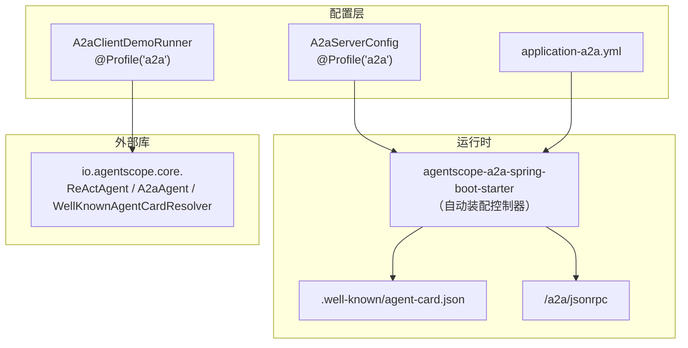
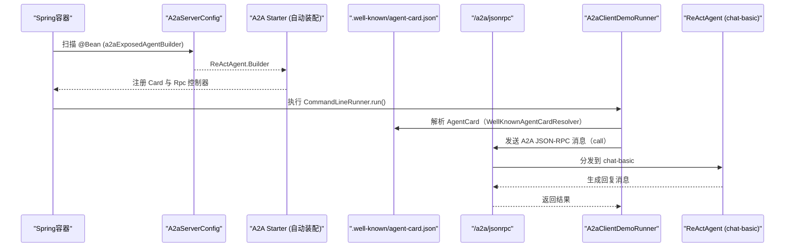
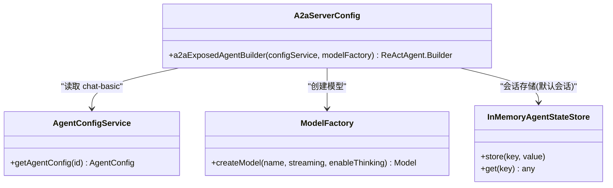
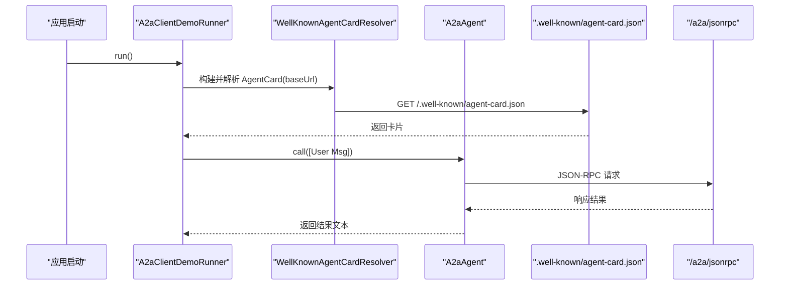
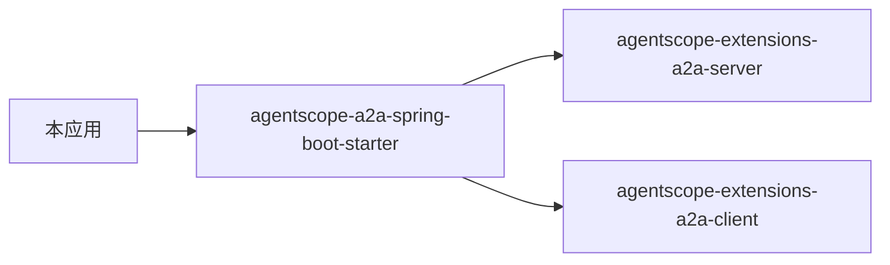

# A2A 协议

<cite>
**本文引用的文件**
- [src/main/java/com/skloda/agentscope/config/A2aServerConfig.java](file://src/main/java/com/skloda/agentscope/config/A2aServerConfig.java)
- [src/main/java/com\skloda\agentscope\config\A2aClientDemoRunner.java](file://src/main/java/com\skloda\agentscope/config/A2aClientDemoRunner.java)
- [src/main/resources/application-a2a.yml](file://src/main/resources/application-a2a.yml)
- [README.md](file://README.md)
- [AGENTS.md](file://AGENTS.md)
- [src/main/resources/config/agents.yml](file://src/main/resources/config/agents.yml)
- [pom.xml](file://pom.xml)
</cite>

## 目录
1. [简介](#简介)
2. [项目结构](#项目结构)
3. [核心组件](#核心组件)
4. [架构总览](#架构总览)
5. [详细组件分析](#详细组件分析)
6. [依赖分析](#依赖分析)
7. [性能与可靠性考虑](#性能与可靠性考虑)
8. [排错指南](#排错指南)
9. [结论](#结论)
10. [附录：部署与使用示例](#附录部署与使用示例)

## 简介
本技术文档聚焦于该仓库中的 Agent-to-Agent（A2A）协议能力。基于 Profile 激活的服务器端配置和客户端演示，实现以下关键点：
- 暴露 .well-known/agent-card.json 与 /a2a/jsonrpc JSON-RPC 任务端点（由 A2A starter 自动装配）。
- 通过 ReActAgent.Builder 将 chat-basic Agent 作为 A2A 服务暴露出去。
- 使用 WellKnownAgentCardResolver 与 A2aAgent 完成“同进程自循环”调用，展示发现与远程调用链路。
- 结合 agentscope.a2a.* 配置项进行开关控制、AgentCard 元数据定义以及日志级别管理。

## 项目结构
A2A 相关代码集中在配置包与资源文件：
- 服务器端配置：com.skloda.agentscope.config.A2aServerConfig（Profile: a2a）
- 客户端演示运行器：com.skloda.agentscope.config.A2aClientDemoRunner（Profile: a2a）
- 启用配置：application-a2a.yml
- 被暴露的 Agent 定义：config/agents.yml 中的 chat-basic
- API 文档与依赖声明：README.md、AGENTS.md、pom.xml

图表来源
- [src/main/java/com/skloda/agentscope/config/A2aServerConfig.java:37-62](file://src/main/java/com/skloda/agentscope/config/A2aServerConfig.java#L37-L62)
- [src/main/java/com/skloda/agentscope/config/A2aClientDemoRunner.java:35-81](file://src/main/java/com/skloda/agentscope/config/A2aClientDemoRunner.java#L35-L81)
- [src/main/resources/application-a2a.yml:1-27](file://src/main/resources/application-a2a.yml#L1-L27)

章节来源
- [README.md](file://README.md)
- [AGENTS.md](file://AGENTS.md)
- [src/main/java/com/skloda/agentscope/config/A2aServerConfig.java:37-62](file://src/main/java/com/skloda/agentscope/config/A2aServerConfig.java#L37-L62)
- [src/main/java/com/skloda/agentscope/config/A2aClientDemoRunner.java:35-81](file://src/main/java/com/skloda/agentscope/config/A2aClientDemoRunner.java#L35-L81)
- [src/main/resources/application-a2a.yml:1-27](file://src/main/resources/application-a2a.yml#L1-L27)

## 核心组件
- A2aServerConfig：以 @Profile("a2a") 启用，导出 ReActAgent.Builder（包装 chat-basic），供 A2A starter 自动装配成 A2A 服务端（提供 AgentCard 发现与 JSON-RPC 端点）。
- A2aClientDemoRunner：以 CommandLineRunner 启动后解析远端 AgentCard，并构建 A2aAgent 进行调用；在本应用中默认对同一实例做自循环调用，展示“发现—调用—返回结果”的完整流程。
- application-a2a.yml：启用 A2A 模块、配置 AgentCard 元信息、JSON-RPC 传输开关与日志等级。
- agents.yml：被暴露的 chat-basic Agent 定义（名称、提示词、模型等），由 A2aServerConfig 加载并用于对外服务。

章节来源
- [src/main/java/com/skloda/agentscope/config/A2aServerConfig.java:43-62](file://src/main/java/com/skloda/agentscope/config/A2aServerConfig.java#L43-L62)
- [src/main/java/com/skloda/agentscope/config/A2aClientDemoRunner.java:53-81](file://src/main/java/com/skloda/agentscope/config/A2aClientDemoRunner.java#L53-L81)
- [src/main/resources/application-a2a.yml:12-27](file://src/main/resources/application-a2a.yml#L12-L27)
- [src/main/resources/config/agents.yml:1-25](file://src/main/resources/config/agents.yml#L1-L25)

## 架构总览
下图展示了 A2A 在应用内的整体交互：
- 启动时加载 application-a2a.yml，开启 A2A 能力。
- A2aServerConfig 输出 ReActAgent.Builder；starter 据此注册 /.well-known/agent-card.json 与 /a2a/jsonrpc。
- A2aClientDemoRunner 解析本地地址的 AgentCard 并构造 A2aAgent，向同一进程的服务发起 JSON-RPC 调用。

图表来源
- [src/main/java/com/skloda/agentscope/config/A2aServerConfig.java:43-62](file://src/main/java/com/skloda/agentscope/config/A2aServerConfig.java#L43-L62)
- [src/main/java/com/skloda/agentscope/config/A2aClientDemoRunner.java:53-81](file://src/main/java/com/skloda/agentscope/config/A2aClientDemoRunner.java#L53-L81)
- [README.md](file://README.md)
- [AGENTS.md](file://AGENTS.md)

章节来源
- [src/main/resources/application-a2a.yml:12-27](file://src/main/resources/application-a2a.yml#L12-L27)
- [README.md](file://README.md)
- [AGENTS.md](file://AGENTS.md)

## 详细组件分析

### A2aServerConfig：服务器侧暴露 Agent
- 职责：创建 ReActAgent.Builder，将 chat-basic Agent 包装为 A2A 服务入口。
- 关键行为：
  - 从 AgentConfigService 获取 chat-basic 配置并构造 Model。
  - 注入 InMemoryAgentStateStore 与 defaultSessionId，保证会话可区分且独立。
  - 通过 Bean 输出给 starter 装配，最终暴露 /.well-known/agent-card.json 与 /a2a/jsonrpc。

图表来源
- [src/main/java/com/skloda/agentscope/config/A2aServerConfig.java:43-62](file://src/main/java/com/skloda/agentscope/config/A2aServerConfig.java#L43-L62)

章节来源
- [src/main/java/com/skloda/agentscope/config/A2aServerConfig.java:43-62](file://src/main/java/com/skloda/agentscope/config/A2aServerConfig.java#L43-L62)

### A2aClientDemoRunner：自循环演示逻辑
- 职责：解析本地 AgentCard 并调用远端 Agent；在同一 JVM 内构成自循环。
- 关键点：
  - 使用 WellKnownAgentCardResolver 基于 base-url 与相对路径定位 card。
  - 构造 A2aAgent，以 Msg/List 形式发送用户指令并阻塞等待结果。
  - 支持自定义 server.baseUrl；未覆盖时使用 local:server.port。

图表来源
- [src/main/java/com/skloda/agentscope/config/A2aClientDemoRunner.java:42-81](file://src/main/java/com/skloda/agentscope/config/A2aClientDemoRunner.java#L42-L81)

章节来源
- [src/main/java/com/skloda/agentscope/config/A2aClientDemoRunner.java:42-81](file://src/main/java/com/skloda/agentscope/config/A2aClientDemoRunner.java#L42-L81)

### Application-a2a.yml：A2A 能力开关与元数据
- 关键配置项：
  - agentscope.a2a.server.enabled：控制是否暴露服务端能力。
  - agentscope.a2a.server.card.*：AgentCard 元信息（name、description、version）。
  - agentscope.a2a.server.transports.jsonrpc.enabled：启用 JSON-RPC 传输。
  - 日志级别：针对 io.agentscope.core.a2a 与 starter 包的日志等级。

章节来源
- [src/main/resources/application-a2a.yml:12-27](file://src/main/resources/application-a2a.yml#L12-L27)

### AgentCard 结构与发现流程
- 发现路径：/.well-known/agent-card.json（由 starter 暴露）。
- 作用：描述可用 Agent 的名称、版本、描述等元信息；client 通过 WellKnownAgentCardResolver 抓取并使用。
- 注意：AgentCard 的字段与结构受 starter 管理；本仓库通过配置项设置 name/description/version 等元数据。

章节来源
- [src/main/java/com/skloda/agentscope/config/A2aServerConfig.java:15-35](file://src/main/java/com/skloda/agentscope/config/A2aServerConfig.java#L15-L35)
- [src/main/java/com/skloda/agentscope/config/A2aClientDemoRunner.java:55-65](file://src/main/java/com/skloda/agentscope/config/A2aClientDemoRunner.java#L55-L65)
- [README.md](file://README.md)
- [AGENTS.md](file://AGENTS.md)

### JSON-RPC 任务处理：发送、获取、取消
- 端点：/a2a/jsonrpc（POST）。
- 能力：send/get/cancel 三类方法调用（具体方法名由 starter 契约定义），用于异步任务的创建、轮询获取与提前取消。
- 触发：由 A2aAgent.call 内部根据任务生命周期驱动。

章节来源
- [src/main/java/com/skloda/agentscope/config/A2aServerConfig.java:31-35](file://src/main/java/com/skloda/agentscope/config/A2aServerConfig.java#L31-L35)
- [README.md](file://README.md)
- [AGENTS.md](file://AGENTS.md)

## 依赖分析
- Maven 依赖引入了 A2A 相关扩展：
  - agentscope-extensions-a2a-server
  - agentscope-extensions-a2a-client
  - agentscope-a2a-spring-boot-starter
- 这些依赖负责注册控制器、解析 AgentCard、实现 JSON-RPC 传输与错误序列化等。

图表来源
- [pom.xml:104-118](file://pom.xml#L104-L118)

章节来源
- [pom.xml:104-118](file://pom.xml#L104-L118)
- [AGENTS.md](file://AGENTS.md)

## 性能与可靠性考虑
- 状态存储：服务器端使用 InMemoryAgentStateStore 管理会话上下文，适用于演示场景；生产环境可迁移至持久化或分布式状态存储。
- 流式与思考：chat-basic 已启用 streaming 与 thinking，建议结合后端连接池与超时策略优化网络往返。
- 自循环调用：当前演示在同一进程内调用，适合快速验证；若拆分多实例，需确保 JSON-RPC 可达性与负载均衡。
- 日志：通过 application-a2a.yml 调整 A2A 包日志级别，便于问题定位与性能观测。

[本节为通用指导，不直接引用具体代码]

## 排错指南
常见问题与检查点：
- 未激活 a2a profile：确保启动参数包含 --spring.profiles.active=a2a，并验证 agentscope.a2a.server.enabled=true。
- AgentCard 不可达：确认 .well-known/agent-card.json 可访问；检查 server.base-url 与端口映射。
- 调用失败：查看日志中 io.agentscope.core.a2a 相关错误信息；核对 JSON-RPC 路由是否存在。
- 模型初始化异常：确认 DASHSCOPE_API_KEY 或对应模型配置正确。
- 超时与取消：若出现长耗时任务，尝试使用 cancel；必要时调整客户端与服务端超时配置。

章节来源
- [src/main/java/com/skloda/agentscope/config/A2aClientDemoRunner.java:72-81](file://src/main/java/com/skloda/agentscope/config/A2aClientDemoRunner.java#L72-L81)
- [src/main/resources/application-a2a.yml:24-27](file://src/main/resources/application-a2a.yml#L24-L27)

## 结论
本项目以极简的配置方式实现了 A2A 协议的端到端连通性：
- 服务器侧：将 chat-basic Agent 以 ReActAgent.Builder 暴露，starter 自动装配出 AgentCard 与 JSON-RPC 接口。
- 客户端侧：通过 WellKnownAgentCardResolver 解析 AgentCard，并使用 A2aAgent 执行跨 Agent 的远程调用，形成自循环演示。
- 扩展性：未来可在同一进程中挂载多个 Agent 或使用不同的 Agent 实例进行互调，满足复杂协作场景。

[本节总结性内容，不引用具体代码]

## 附录：部署与使用示例
- 运行命令（启用 A2A）：mvn spring-boot:run -Dspring-boot.run.arguments="--spring.profiles.active=a2a"
- 校验端点：
  - GET .well-known/agent-card.json
  - POST /a2a/jsonrpc（按 starter 契约发送 send/get/cancel）
- 观察效果：启动后可见客户端向同一服务的 AgentCard 解析与 JSON-RPC 调用日志，随后得到来自 chat-basic 的回复。

章节来源
- [src/main/java/com/skloda/agentscope/config/A2aClientDemoRunner.java:29-33](file://src/main/java/com/skloda/agentscope/config/A2aClientDemoRunner.java#L29-L33)
- [README.md](file://README.md)
- [AGENTS.md](file://AGENTS.md)