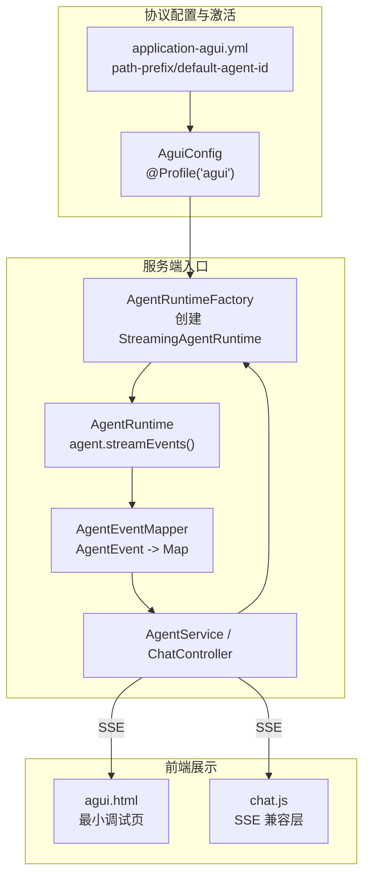
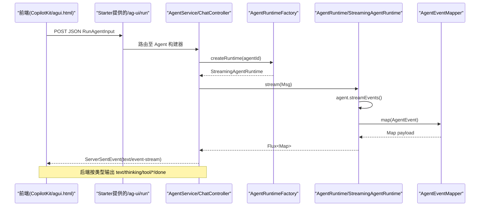
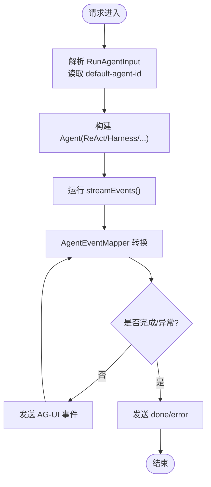
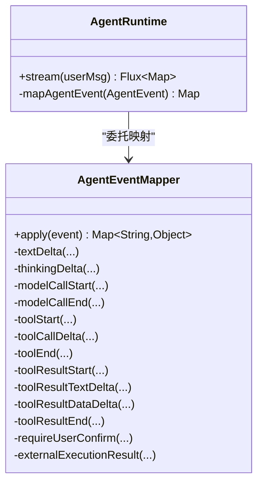
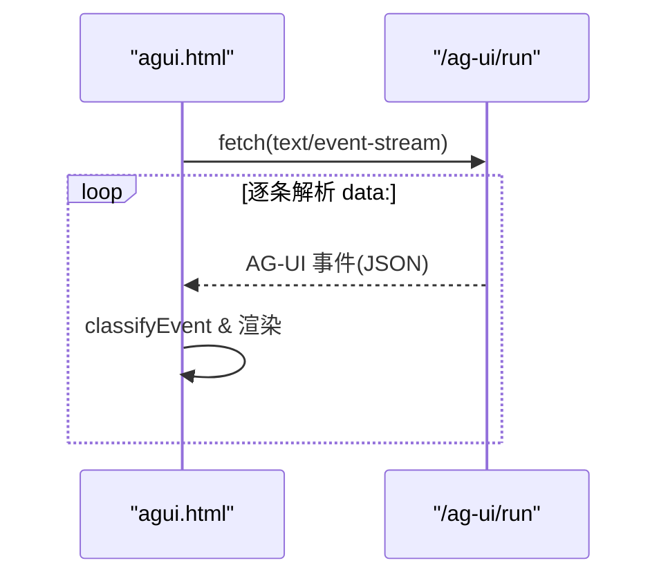

# AG-UI 协议

<cite>
**本文引用的文件 **
- [AguiConfig.java](file://src/main/java/com/skloda/agentscope/config/AguiConfig.java)
- [application-agui.yml](file://src/main/resources/application-agui.yml)
- [ChatController.java](file://src/main/java/com/skloda/agentscope/controller/ChatController.java)
- [AgentRuntimeFactory.java](file://src/main/java/com/skloda/agentscope/runtime/AgentRuntimeFactory.java)
- [AgentEventMapper.java](file://src/main/java/com/skloda/agentscope/runtime/AgentEventMapper.java)
- [StreamingAgentRuntime.java](file://src/main/java/com/skloda/agentscope/runtime/StreamingAgentRuntime.java)
- [AgentService.java](file://src/main/java/com/skloda/agentscope/service/AgentService.java)
- [ChatEvent.java](file://src/main/java/com/skloda/agentscope/model/ChatEvent.java)
- [agui.html](file://src/main/resources/static/agui.html)
- [chat.js](file://src/main/resources/static/scripts/chat.js)
- [pom.xml](file://pom.xml)
- [AGENTS.md](file://AGENTS.md)
- [README.md](file://README.md)
</cite>

## 目录
1. [简介](#简介)
2. [项目结构与协议位置](#项目结构与协议位置)
3. [核心组件](#核心组件)
4. [架构总览](#架构总览)
5. [端点链路详解：/ag-ui/run](#端点链路详解ag-uirun)
6. [事件类型与转换规范](#事件类型与转换规范)
7. [前端兼容层处理](#前端兼容层处理)
8. [启动期 AgentCard 发现与会话管理](#启动期-agentcard-发现与会话管理)
9. [配置项、超时、错误码与调试](#配置项超时错误码与调试)
10. [性能与优化建议](#性能与优化建议)
11. [集成示例：CopilotKit 等 AG-UI 前端](#集成示例copilotkit-等-agui-前端)
12. [故障排查指南](#故障排查指南)
13. [结论](#结论)

## 简介
本项目实现了基于 AgentScope 的 AG-UI（Agent-Gateway UI）协议能力，通过 Spring Profile“agui”激活相关 Bean，在默认路径前缀下暴露标准化 SSE 端点 /ag-ui/run，将底层 ReActAgent 的执行事件转换为前端消费的标准事件流。该协议与既有 /chat/send 自定义事件流并存互不干扰，适合使用 CopilotKit 等支持 AG-UI 的前端框架进行对接。

- 激活方式：--spring.profiles.active=agui
- 暴露端点：POST {path-prefix}/run，默认路径为 /ag-ui/run
- 关键能力：@AguiAgentId 注解注册 Agent；运行时将 AguiEvent 经流式响应推送到前端；事件覆盖文本增量、工具调用、思考过程、生命周期等。

## 项目结构与协议位置
AG-UI 相关代码集中在以下位置：
- 配置与激活：config/AguiConfig.java、application-agui.yml
- 控制器：controller/ChatController.java（现有 /chat/send），AG-UI 端点由 starter 装配
- 运行与转换：runtime/AgentRuntime*、runtime/AgentEventMapper.java
- 前端：static/agui.html（最小演示页）、static/scripts/chat.js（通用 SSE 兼容层）
- 依赖：pom.xml 引入 agentscope-extensions-agui 与 spring-boot-starter

**图示来源**
- [AguiConfig.java:17-38](file://src/main/java/com/skloda/agentscope/config/AguiConfig.java#L17-L38)
- [application-agui.yml:7-14](file://src/main/resources/application-agui.yml#L7-L14)
- [AgentRuntimeFactory.java:41-61](file://src/main/java/com/skloda/agentscope/runtime/AgentRuntimeFactory.java#L41-L61)
- [AgentRuntime.java:67-142](file://src/main/java/com/skloda/agentscope/runtime/AgentRuntime.java#L67-L142)
- [AgentEventMapper.java:64-105](file://src/main/java/com/skloda/agentscope/runtime/AgentEventMapper.java#L64-L105)
- [agui.html:40-134](file://src/main/resources/static/agui.html#L40-L134)
- [chat.js:78-171](file://src/main/resources/static/scripts/chat.js#L78-L171)

**章节来源**
- [AguiConfig.java:17-38](file://src/main/java/com/skloda/agentscope/config/AguiConfig.java#L17-L38)
- [application-agui.yml:7-14](file://src/main/resources/application-agui.yml#L7-L14)
- [pom.xml:134-144](file://pom.xml#L134-L144)

## 核心组件
- AguiConfig：以 Spring Profile “agui”加载，声明 @Bean 并以 @AguiAgentId("chat-basic") 标注，交由 Starter 自动注入到 AG-UI 可调用 Agent 注册中心，从而启用 /ag-ui/run。
- AgentService / ChatController：处理会话级消息与流转；AG-UI 请求进入后复用同一条执行管线构建 Agent 并拉取事件流。
- AgentRuntimeFactory：根据 agent 配置与类型选择具体运行时（单代理、多代理编排、Harness 等）。
- StreamingAgentRuntime：统一 stream(Msg) 接口抽象所有运行时，便于上层聚合。
- AgentRuntime：封装 agent.streamEvents()，合并事件 Sink，并通过 AgentEventMapper 将原生事件转成统一的 Map 结构供前端渲染。
- AgentEventMapper：实现全部事件类型的映射与过滤（文本增量、思考增量、模型调用起止、工具起止、结果、提示、子代理、超迭代、外部执行等）。

**章节来源**
- [AguiConfig.java:45-64](file://src/main/java/com/skloda/agentscope/config/AguiConfig.java#L45-L64)
- [AgentService.java:120-177](file://src/main/java/com/skloda/agentscope/service/AgentService.java#L120-L177)
- [AgentRuntimeFactory.java:41-105](file://src/main/java/com/skloda/agentscope/runtime/AgentRuntimeFactory.java#L41-L105)
- [StreamingAgentRuntime.java:9-20](file://src/main/java/com/skloda/agentscope/runtime/StreamingAgentRuntime.java#L9-L20)
- [AgentRuntime.java:26-30](file://src/main/java/com/skloda/agentscope/runtime/AgentRuntime.java#L26-L30)
- [AgentEventMapper.java:39-105](file://src/main/java/com/skloda/agentscope/runtime/AgentEventMapper.java#L39-L105)

## 架构总览
下图展示了从 HTTP 请求到达直至将 AG-UI 事件序列化为 Server-Sent Events 的全流程，包含配置激活、运行时创建、事件映射与返回：

**图示来源**
- [application-agui.yml:7-14](file://src/main/resources/application-agui.yml#L7-L14)
- [AgentService.java:120-177](file://src/main/java/com/skloda/agentscope/service/AgentService.java#L120-L177)
- [AgentRuntimeFactory.java:41-61](file://src/main/java/com/skloda/agentscope/runtime/AgentRuntimeFactory.java#L41-L61)
- [AgentRuntime.java:67-142](file://src/main/java/com/skloda/agentscope/runtime/AgentRuntime.java#L67-L142)
- [AgentEventMapper.java:64-105](file://src/main/java/com/skloda/agentscope/runtime/AgentEventMapper.java#L64-L105)

## 端点链路详解：/ag-ui/run
- 协议入口：由 Spring Boot Starter 注册 POST {path-prefix}/run 的处理器，默认 path-prefix=/ag-ui。
- 入参与上下文：Starter 接收 RunAgentInput（含 threadId、runId、messages、tools、context、state、forwardedProps 等）；Agent 标识来源于 application-agui.yml 中 default-agent-id。
- 代理查询与构建：AgentService/Auto-registration 找到对应 Agent（如 chat-basic），AgentRuntimeFactory 依据配置创建合适的 Runtime 实例（ReActAgent/Harness/多 Agent 编排等）。
- 执行与事件：运行时调用 agent.streamEvents() 产生原生命令事件，经由 AgentEventMapper 转换为前端可消费的 Map（type/content/toolName/delta 等）。
- 返回格式：Server-Sent Events，携带标准 AG-UI 事件类型；完成时发送 done 事件；异常时通过 error 事件或 HTTP 状态传递。

注意：本仓库未内联 /ag-ui/run 的具体 Handler 代码，其由 agentscope-agui-spring-boot-starter 自动装配，但整体数据流仍经过本项目既有的运行时与事件映射层。

**图示来源**
- [AguiConfig.java:45-64](file://src/main/java/com/skloda/agentscope/config/AguiConfig.java#L45-L64)
- [application-agui.yml:7-14](file://src/main/resources/application-agui.yml#L7-L14)
- [AgentRuntime.java:67-142](file://src/main/java/com/skloda/agentscope/runtime/AgentRuntime.java#L67-L142)
- [AgentEventMapper.java:64-105](file://src/main/java/com/skloda/agentscope/runtime/AgentEventMapper.java#L64-L105)

**章节来源**
- [AguiConfig.java:17-38](file://src/main/java/com/skloda/agentscope/config/AguiConfig.java#L17-L38)
- [application-agui.yml:7-14](file://src/main/resources/application-agui.yml#L7-L14)

## 事件类型与转换规范
AgentEventMapper 负责将 AgentScope 2.0 的原生事件映射为前端友好的 JSON 对象。常见类别：
- 文本与思考：text（内容增量）、thinking（推理增量）
- 生命周期：agent_start、agent_end、agent_result_text
- 模型调用：llm_start、llm_end（含 input/output/total tokens）
- 工具调用：tool_start、tool_call_delta、tool_end、tool_result_start、tool_result_text_delta、tool_result_data_delta、tool_result_end
- 其他：data_block_delta、hint_block、subagent_exposed、exceed_max_iters、require_user_confirm、external_execution_*、request_stop、all_tools_denied、custom
- 边界事件：文本块起止/思维块起止/数据块起止会被丢弃（不推送到前端）

此外，AgentRuntime 在完成后会追加 pending_approval（HITL）或 done 事件；若审批触发未完成被中断，后续请求可能清理遗留 ToolUseBlock，保证上下文纯净。

**图示来源**
- [AgentEventMapper.java:64-105](file://src/main/java/com/skloda/agentscope/runtime/AgentEventMapper.java#L64-L105)
- [AgentRuntime.java:185-200](file://src/main/java/com/skloda/agentscope/runtime/AgentRuntime.java#L185-L200)

**章节来源**
- [AgentEventMapper.java:39-105](file://src/main/java/com/skloda/agentscope/runtime/AgentEventMapper.java#L39-L105)
- [AgentRuntime.java:128-142](file://src/main/java/com/skloda/agentscope/runtime/AgentRuntime.java#L128-L142)

## 前端兼容层处理
- agui.html：最小化的 AG-UI 演示页，构造 RunAgentInput 向 /ag-ui/run 发起请求，并按 event type 分类打印日志；要求每个 AguiMessage 携带非空 id，endpoint 必须等于配置的路径前缀加 /run。
- chat.js：通用的 SSE 兼容层，处理 agent 生命周期、文本/思考、工具调用时间线、supervisor/routing/handoff 等多类事件；具备“打字指示器”消隐逻辑，避免首包延迟造成空白。

**图示来源**
- [agui.html:40-134](file://src/main/resources/static/agui.html#L40-L134)
- [chat.js:78-171](file://src/main/resources/static/scripts/chat.js#L78-L171)

**章节来源**
- [agui.html:23-38](file://src/main/resources/static/agui.html#L23-L38)
- [agui.html:61-131](file://src/main/resources/static/agui.html#L61-L131)
- [chat.js:78-171](file://src/main/resources/static/scripts/chat.js#L78-L171)

## 启动期 AgentCard 发现与会话管理
- 当前仓库未提供 /well-known/agent-card.json 的自定义实现；A2A 的 AgentCard discovery 文档条目仅在 README/AGENTS 中标注为 profile-gated 的能力说明。因此本仓库对 AG-UI 的启动期发现并不暴露专用端点。
- 会话机制：AgentRuntime 与 EventSink 协同，确保流结束时正确关闭 sink，下游前端能收到 done/pending_approval 事件；会话上下文通过 AgentStateStore 在不同请求间保持（当启用分布式状态存储 profile 时）。

**章节来源**
- [AGENTS.md:166-177](file://AGENTS.md#L166-L177)
- [README.md:166-177](file://README.md#L166-L177)
- [AgentRuntime.java:112-142](file://src/main/java/com/skloda/agentscope/runtime/AgentRuntime.java#L112-L142)

## 配置项、超时、错误码与调试
- 配置文件：application-agui.yml
  - agentscope.agui.path-prefix：定义 AG-UI 路径前缀，默认 /ag-ui
  - default-agent-id：默认代理 ID
  - enable-reasoning：允许输出推理/思考内容
  - emit-state-events / emit-tool-call-args：控制是否输出状态与工具参数
  - run-timeout：请求级别超时
  - server-side-memory：服务端内存模式
- 日志：io.agentscope.core.agui、io.agentscope.spring.boot.agui 均设为 INFO
- 错误传播：AgentRuntime 在序列化失败或映射异常时会生成 error 类型事件；HTTP 错误码来自 starter/Spring 基础栈。
- 调试方法：
  - 开启 io.agentscope.* DEBUG 日志定位事件细节
  - 使用内置 agui.html 验证事件流
  - 利用 ChatController 的 sseEvent/sseError 辅助函数统一包装事件

**章节来源**
- [application-agui.yml:7-21](file://src/main/resources/application-agui.yml#L7-L21)
- [ChatController.java:77-113](file://src/main/java/com/skloda/agentscope/controller/ChatController.java#L77-L113)
- [AgentRuntime.java:138-141](file://src/main/java/com/skloda/agentscope/runtime/AgentRuntime.java#L138-L141)

## 性能与优化建议
- 启用并发缓冲：Flux.merge 与大量事件时应结合合理 buffer 大小，避免背压导致的事件堆积。
- 减少冗余事件：通过 AgentEventMapper 精准丢弃块边界事件，降低前端渲染开销。
- 复用 Agent 实例：AgentRuntimeFactory 与服务层缓存策略可降低构建成本。
- 超时与取消：合理利用 run-timeout 与 Reactor Cancel，避免长时间占用资源。
- 结构化输出：对需要强约束的场景开启结构化输出校验，提高一致性。

[本节为通用建议，无需具体代码引用]

## 集成示例：CopilotKit 等 AG-UI 前端
- 请求体：RunAgentInput，需包含线程/运行 ID、messages（每个消息必须带非空 id）、可选的 tools/context/state/forwardedProps。
- 头部：Content-Type: application/json；Accept: text/event-stream
- 路径：{path-prefix}/run，例如默认的 /ag-ui/run
- 事件消费：前端按照 AG-UI 事件语义订阅 text、thinking、tool_start/tool_result_*、agent_start/agent_end、done/error 等，用于实时更新界面与调试面板。

参考仓库自带 demo 页面如何构造请求与消费事件流。

**章节来源**
- [application-agui.yml:7-14](file://src/main/resources/application-agui.yml#L7-L14)
- [agui.html:61-131](file://src/main/resources/static/agui.html#L61-L131)

## 故障排查指南
- 现象：连接建立但无事件或长时间挂起
  - 检查 /ag-ui/run 是否可用（profile 是否为 agui）
  - 检查 default-agent-id 对应的 Agent 是否存在
  - 检查 EventSink 是否在 agent 流终止时正确 complete（AgentRuntime 已内建保证）
- 现象：前端显示“只能聊一次”或输入框不可恢复
  - 通常是 done 未送达，查看是否出现网络层截断或后端异常
  - 查阅日志中的 streaming 错误与堆栈
- 现象：工具调用卡住或上下文污染
  - 确认上一次请求被中断后是否有残留 ToolUseBlock；AgentRuntime 会在启动新流时尝试清理
- 现象：工具拒绝或 HITL 未生效
  - 查看是否触发了 require_user_confirm/rejection；ApprovalMiddleware 会将中止转为 pending_approval

**章节来源**
- [AgentRuntime.java:80-109](file://src/main/java/com/skloda/agentscope/runtime/AgentRuntime.java#L80-L109)
- [AgentRuntime.java:112-142](file://src/main/java/com/skloda/agentscope/runtime/AgentRuntime.java#L112-L142)
- [ChatController.java:77-113](file://src/main/java/com/skloda/agentscope/controller/ChatController.java#L77-L113)

## 结论
AG-UI 在该项目中通过 Profile 化装配与标准化的事件映射，为前端提供了跨代理、可扩展的统一 SSE 交互协议。它复用既有运行时和事件体系，既保证了工程的一致性，又使 CopilotKit 等 AG-UI 兼容前端能够低成本接入。通过合理的配置（超时、状态、工具参数输出）与前端事件处理策略，可以获得稳定、高效的实时交互体验。