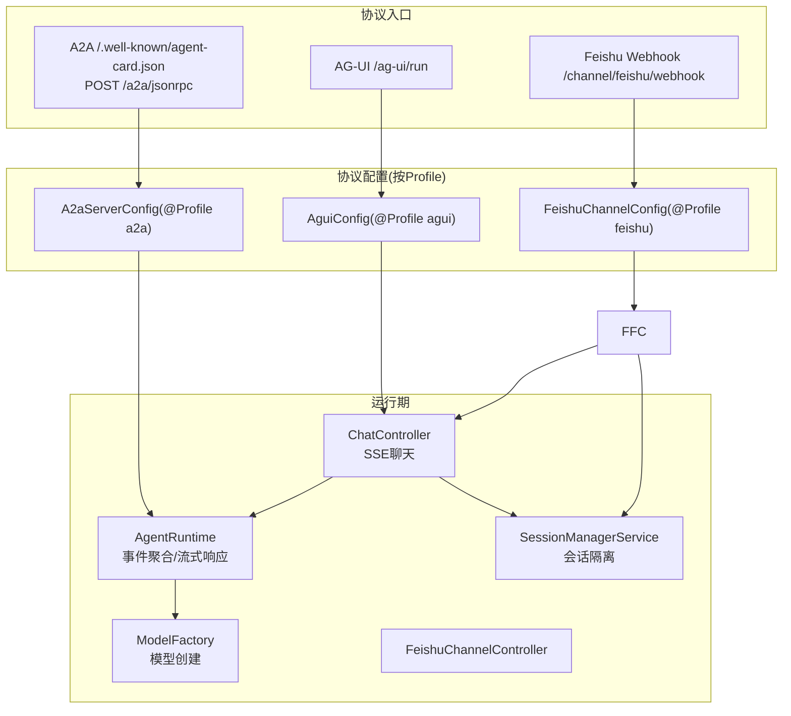
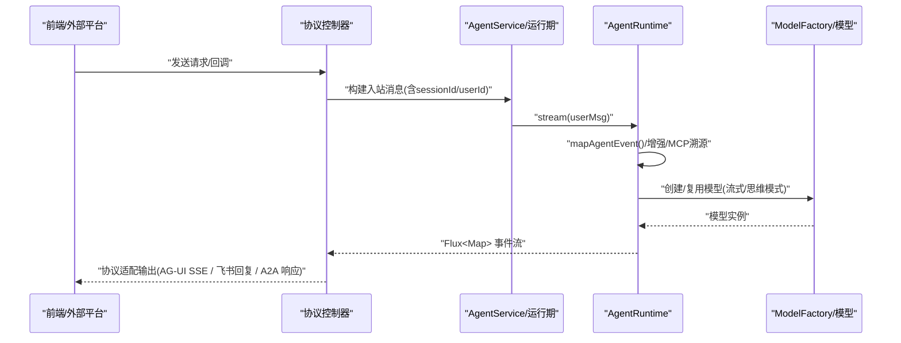
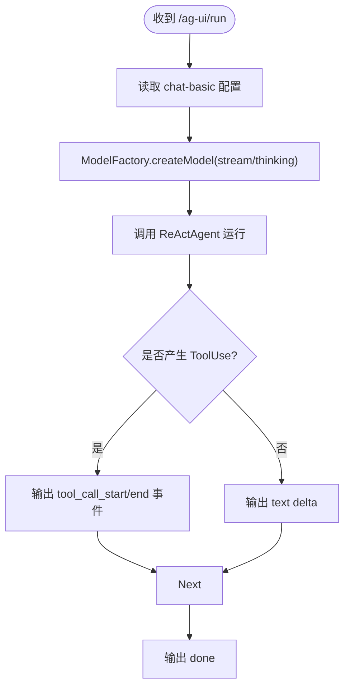
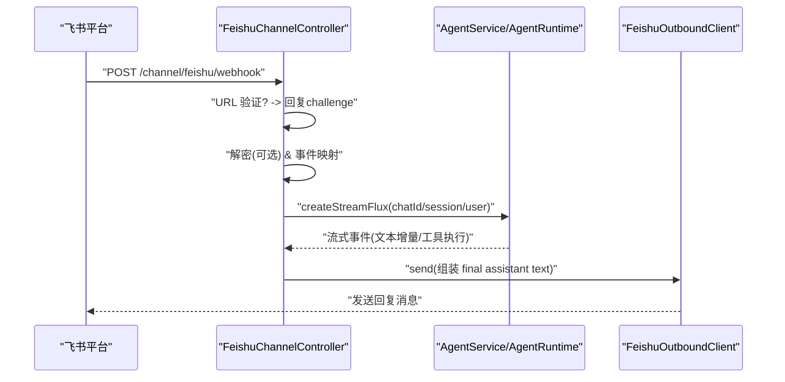
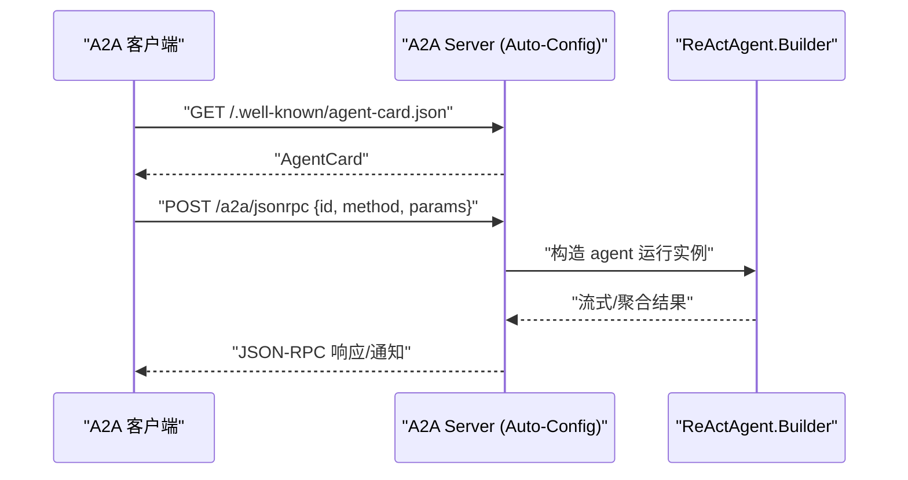
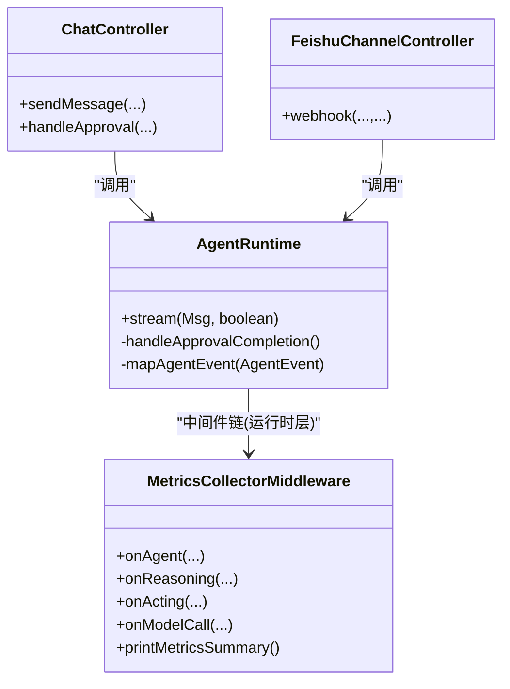
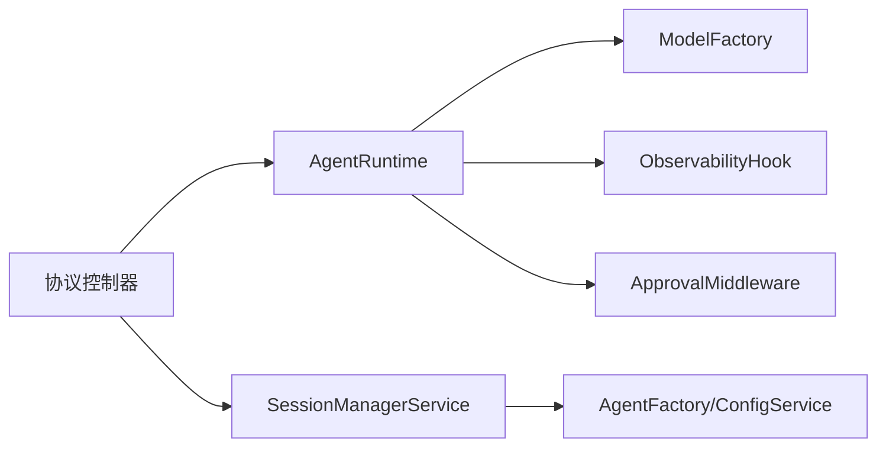

# 协议支持

<cite>
**本文引用的文件**
- [application.yml](file://src/main/resources/application.yml)
- [application-agui.yml](file://src/main/resources/application-agui.yml)
- [application-feishu.yml](file://src/main/resources/application-feishu.yml)
- [application-a2a.yml](file://src/main/resources/application-a2a.yml)
- [AguiConfig.java](file://src/main/java/com/skloda/agentscope/config/AguiConfig.java)
- [FeishuChannelConfig.java](file://src/main/java/com/skloda/agentscope/config/FeishuChannelConfig.java)
- [A2aServerConfig.java](file://src/main/java/com/skloda/agentscope/config/A2aServerConfig.java)
- [ChatController.java](file://src/main/java/com/skloda/agentscope/controller/ChatController.java)
- [FeishuChannelController.java](file://src/main/java/com/skloda/agentscope/controller/FeishuChannelController.java)
- [ModelFactory.java](file://src/main/java/com/skloda/agentscope/model/ModelFactory.java)
- [SessionManagerService.java](file://src/main/java/com/skloda/agentscope/service/SessionManagerService.java)
- [MetricsCollectorMiddleware.java](file://src/main/java/com/skloda/agentscope/middleware/MetricsCollectorMiddleware.java)
- [AgentRuntime.java](file://src/main/java/com/skloda/agentscope/runtime/AgentRuntime.java)
</cite>

## 目录
1. [简介](#简介)
2. [项目结构](#项目结构)
3. [核心组件](#核心组件)
4. [架构总览](#架构总览)
5. [详细组件分析](#详细组件分析)
6. [依赖关系分析](#依赖关系分析)
7. [性能与扩展建议](#性能与扩展建议)
8. [故障排查指南](#故障排查指南)
9. [结论](#结论)
10. [附录](#附录)

## 简介
本仓库以 Spring Boot 为基础，面向 AgentScope v2.0，提供多通道协议接入能力。本次文档聚焦于三类协议的实现与集成：AG-UI 协议（SSE 事件）、飞书 IM Webhook（事件订阅回调）、A2A 协议（Agent Card 发现 + JSON-RPC 任务）。内容涵盖各协议的激活方式（Spring Profile）、端点与配置、事件协议转换、前后端兼容性处理、数据流转策略、统一错误模式以及监控指标采集方案等。

## 项目结构
协议相关的关键代码主要分布在以下模块：
- 配置层：按 Profile 条件装配协议能力
  - agui Profile → 注册 AG-UI Agent
  - feishu Profile → 装配飞书入出站客户端并挂载 Webhook
  - a2a Profile → 暴露 AgentCard 和 JSON-RPC 任务端点
- 控制器层：
  - ChatController：原生 SSE 聊天接口（/chat/send）
  - FeishuChannelController：飞书消息 Webhook（/channel/feishu/webhook）
- 运行时：
  - AgentRuntime：流式事件聚合（合并 Agent 生命周期事件与外部 sink 事件），负责审批恢复、MCP 溯源增强等
  - ModelFactory：统一模型创建（支持自动注入 provider 前缀、流式、思维模式）
- 会话管理：
  - SessionManagerService：基于内存的会话上下文管理与迁移

图表来源
- [AguiConfig.java:17-65](file://src/main/java/com/skloda/agentscope/config/AguiConfig.java#L17-L65)
- [FeishuChannelConfig.java:11-65](file://src/main/java/com/skloda/agentscope/config/FeishuChannelConfig.java#L11-L65)
- [A2aServerConfig.java:15-63](file://src/main/java/com/skloda/agentscope/config/A2aServerConfig.java#L15-L63)
- [ChatController.java:44-153](file://src/main/java/com/skloda/agentscope/controller/ChatController.java#L44-L153)
- [FeishuChannelController.java:31-170](file://src/main/java/com/skloda/agentscope/controller/FeishuChannelController.java#L31-L170)
- [AgentRuntime.java:26-200](file://src/main/java/com/skloda/agentscope/runtime/AgentRuntime.java#L26-L200)
- [ModelFactory.java:13-95](file://src/main/java/com/skloda/agentscope/model/ModelFactory.java#L13-L95)
- [SessionManagerService.java:23-198](file://src/main/java/com/skloda/agentscope/service/SessionManagerService.java#L23-L198)

章节来源
- [application.yml:1-90](file://src/main/resources/application.yml#L1-L90)
- [application-agui.yml:1-21](file://src/main/resources/application-agui.yml#L1-L21)
- [application-feishu.yml:1-26](file://src/main/resources/application-feishu.yml#L1-L26)
- [application-a2a.yml:1-28](file://src/main/resources/application-a2a.yml#L1-L28)

## 核心组件
- AG-UI 协议：通过 @Profile("agui") 将 chat-basic 注册为可被 AG-UI 前端调用的 Agent；路径前缀默认 /ag-ui，最终端点 POST /ag-ui/run，输出 AguiEvent 流（由 starter 自动化处理）。
- 飞书 IM 渠道：@Profile("feishu") 下装配入站/出站客户端，Webhook 接收并处理 URL 验证与消息事件，统一路由到内部 Agent 服务后回写飞书。
- A2A 协议：@Profile("a2a") 暴露 AgentCard 发现及 JSON-RPC 任务接口，使用同一 chat-basic 作为被调用代理，完成跨 Agent 通信演示。
- 运行时与事件：AgentRuntime 对 agent.streamEvents() 进行映射（AgentEventMapper），并在完成阶段触发 HITL 审批或 done 标记；同时合并 EventSink 的多 Agent 协作事件，保证 SSE 流的完整性。
- 模型创建：ModelFactory 统一解析 provider 前缀、流式/思维模式、API Key 来源，确保 AG-UI、A2A、飞书均复用一致模型实例化逻辑。
- 会话隔离：SessionManagerService 依据 sessionId 缓存 ReActAgent 及状态存储后端，支持类型迁移（memory/in-memory/redis/mysql/postgresql）与访问时长维护。

章节来源
- [AguiConfig.java:17-65](file://src/main/java/com/skloda/agentscope/config/AguiConfig.java#L17-L65)
- [FeishuChannelConfig.java:11-65](file://src/main/java/com/skloda/agentscope/config/FeishuChannelConfig.java#L11-L65)
- [A2aServerConfig.java:15-63](file://src/main/java/com/skloda/agentscope/config/A2aServerConfig.java#L15-L63)
- [AgentRuntime.java:67-200](file://src/main/java/com/skloda/agentscope/runtime/AgentRuntime.java#L67-L200)
- [ModelFactory.java:13-95](file://src/main/java/com/skloda/agentscope/model/ModelFactory.java#L13-L95)
- [SessionManagerService.java:23-198](file://src/main/java/com/skloda/agentscope/service/SessionManagerService.java#L23-L198)

## 架构总览
整体采用“多入口、中间统一路由、底层共用运行时”的架构模式：不同协议在各自的 Profile 中启用对应的端点和配置，随后将请求/事件转换为统一的 Agent 输入，进入 AgentRuntime 流式推理，最后根据协议特点输出结果或回调。

图表来源
- [ChatController.java:117-153](file://src/main/java/com/skloda/agentscope/controller/ChatController.java#L117-L153)
- [FeishuChannelController.java:68-170](file://src/main/java/com/skloda/agentscope/controller/FeishuChannelController.java#L68-L170)
- [AgentRuntime.java:67-200](file://src/main/java/com/skloda/agentscope/runtime/AgentRuntime.java#L67-L200)
- [ModelFactory.java:42-56](file://src/main/java/com/skloda/agentscope/model/ModelFactory.java#L42-L56)

## 详细组件分析

### AG-UI 协议（SSE 端点注册、事件协议转换、前端兼容）
- 激活方式：启动参数 --spring.profiles.active=agui
- 配置要点（application-agui.yml）：
  - agentscope.agui.path-prefix=/ag-ui（默认前缀）
  - default-agent-id=chat-basic
  - enable-reasoning/emit-state-events/emit-tool-call-args/run-timeout/server-side-memory 等开关
- 端点与流程：
  - 由 starter 暴露 POST /ag-ui/run，将 AG-UI 的 RunAgentInput 转为内部 Agent 输入，返回标准 AguiEvent 流（28+ 事件类型）
  - 通过 AguiConfig 将 chat-basic 注册为可用 Agent，模型由 ModelFactory 创建，支持流式与思维模式
- 前端兼容性：
  - 提供 agui.html 便于本地调试；生产环境建议使用任何遵循 AG-UI 协议的前端
  - 事件语义严格对齐 AG-UI 规范（thinking/tool_use/text/done 等）
- 数据转换：
  - AG-UI 侧 event -> 内部 AgentEvent；再由 AgentEventMapper 映射为标准 Map；最终序列化为 AguiEvent
- 错误与监控：
  - 流异常时由 runtime/onErrorResume 捕获，降级为 error/done 事件
  - 可在 middleware 层叠加 MetricsCollectorMiddleware 统计 token/耗时/成本

图表来源
- [AguiConfig.java:45-65](file://src/main/java/com/skloda/agentscope/config/AguiConfig.java#L45-L65)
- [ModelFactory.java:42-56](file://src/main/java/com/skloda/agentscope/model/ModelFactory.java#L42-L56)
- [AgentRuntime.java:94-168](file://src/main/java/com/skloda/agentscope/runtime/AgentRuntime.java#L94-L168)
- [application-agui.yml:1-21](file://src/main/resources/application-agui.yml#L1-L21)

章节来源
- [AguiConfig.java:17-65](file://src/main/java/com/skloda/agentscope/config/AguiConfig.java#L17-L65)
- [application-agui.yml:1-21](file://src/main/resources/application-agui.yml#L1-L21)

### 飞书 IM 渠道（URL 验证、消息加密解密、事件映射、会话隔离）
- 激活方式：--spring.profiles.active=feishu
- 配置要点（application-feishu.yml）：
  - app-id/app-secret、verification-token、encrypt-key（可选）
  - callback-path=/channel/feishu/webhook
  - api-base=https://open.feishu.cn/open-apis
  - default-agent-id=chat-basic
- Webhook 流程：
  - 校验并回复 URL 验证 challenge
  - 若开启 encrypt-key，则解密事件体
  - 将飞书事件映射为 InboundMessage（仅处理 im.message.receive_v1 等消息类事件）
  - 以 sessionId="feishu:{chatId}"、userId="feishu:{senderId}" 调用 AgentService/AgentRuntime
  - 收集终端 assistant 文本并通过 FeishuOutboundClient 回调
- 会话隔离：
  - 每个 chatId 对应一个会话，避免不同群组对话串扰
- 安全与兼容：
  - 未匹配的事件/空消息直接忽略并返回空 OK
  - 解析或处理异常也会返回空 OK，保障回调可用性

图表来源
- [FeishuChannelController.java:68-170](file://src/main/java/com/skloda/agentscope/controller/FeishuChannelController.java#L68-L170)
- [application-feishu.yml:1-26](file://src/main/resources/application-feishu.yml#L1-L26)
- [FeishuChannelConfig.java:44-65](file://src/main/java/com/skloda/agentscope/config/FeishuChannelConfig.java#L44-L65)

章节来源
- [FeishuChannelController.java:31-170](file://src/main/java/com/skloda/agentscope/controller/FeishuChannelController.java#L31-L170)
- [FeishuChannelConfig.java:11-65](file://src/main/java/com/skloda/agentscope/config/FeishuChannelConfig.java#L11-L65)
- [application-feishu.yml:1-26](file://src/main/resources/application-feishu.yml#L1-L26)

### A2A 协议（Agent Card 发现、JSON-RPC 任务）
- 激活方式：--spring.profiles.active=a2a，并确保 agentscope.a2a.server.enabled=true
- 配置要点（application-a2a.yml）：
  - 暴露 AgentCard（name/description/version）
  - 启用 jsonrpc transport
- 端点：
  - GET /.well-known/agent-card.json：Agent 能力与元信息发现
  - POST /a2a/jsonrpc：JSON-RPC 任务发送/获取/取消
- 暴露 Agent：
  - A2aServerConfig 暴露 ReActAgent.Builder，auto-config 将其包装为 A2A Server，对外提供上述端点
- 交互语义：
  - 由 client（同应用内 demo runner 或外部 Agent）先拉取 agent card，再以 jsonrpc 发起 task
  - 返回结果遵循 A2A 协议事件模型

图表来源
- [A2aServerConfig.java:15-63](file://src/main/java/com/skloda/agentscope/config/A2aServerConfig.java#L15-L63)
- [application-a2a.yml:1-28](file://src/main/resources/application-a2a.yml#L1-L28)

章节来源
- [A2aServerConfig.java:15-63](file://src/main/java/com/skloda/agentscope/config/A2aServerConfig.java#L15-L63)
- [application-a2a.yml:1-28](file://src/main/resources/application-a2a.yml#L1-L28)

### 协议间数据转换策略、统一错误模式与监控指标
- 数据转换策略：
  - 前端/平台特定协议在各自 Controller 中解耦，统一收敛为内部 Msg / InboundMessage/RunAgentInput 等形式，再交由 AgentRuntime 处理
  - 运行时通过 AgentEventMapper 将内部 AgentEvent 标准化为 SSE Map；各协议再将此 Map 转换为自身协议格式
- 统一错误模式：
  - ChatController：onErrorResume 捕获异常，生成 error/done 成对事件保证前端结束态
  - FeishuChannelController：解析/处理异常统一返回空体 OK，满足第三方回调要求
  - AgentRuntime：聚合 EventSink 并完成，确保下游 Flux 能正确结束
- 监控指标（MetricsCollectorMiddleware）：
  - 统计：模型调用次数、token 用量、工具调用次数/耗时/错误、成本估算
  - 输出：控制台 METRICS 日志，可按需对接系统指标栈
  - 作用位置：位于运行时中间件链路，可覆盖 reasoning/acting/modelCall 等各阶段

图表来源
- [MetricsCollectorMiddleware.java:21-210](file://src/main/java/com/skloda/agentscope/middleware/MetricsCollectorMiddleware.java#L21-L210)
- [AgentRuntime.java:67-200](file://src/main/java/com/skloda/agentscope/runtime/AgentRuntime.java#L67-L200)
- [ChatController.java:117-187](file://src/main/java/com/skloda/agentscope/controller/ChatController.java#L117-L187)
- [FeishuChannelController.java:68-170](file://src/main/java/com/skloda/agentscope/controller/FeishuChannelController.java#L68-L170)

章节来源
- [MetricsCollectorMiddleware.java:21-210](file://src/main/java/com/skloda/agentscope/middleware/MetricsCollectorMiddleware.java#L21-L210)
- [AgentRuntime.java:67-200](file://src/main/java/com/skloda/agentscope/runtime/AgentRuntime.java#L67-L200)
- [ChatController.java:117-187](file://src/main/java/com/skloda/agentscope/controller/ChatController.java#L117-L187)
- [FeishuChannelController.java:68-170](file://src/main/java/com/skloda/agentscope/controller/FeishuChannelController.java#L68-L170)

## 依赖关系分析
- 模块耦合与内聚：
  - 控制器低耦合：仅关注协议解析与适配
  - 运行时高内聚：AgentRuntime 聚合事件、审批恢复、收尾与中断释放资源
  - 模型工厂统一抽象：屏蔽 provider 差异，简化配置
- 直接/间接依赖：
  - AG-UI/Feishu/A2A 控制器均依赖 AgentService/Runtime
  - 运行时依赖 ModelFactory、ObservabilityHook、ApprovalMiddleware、EventSink
  - 会话管理依赖 AgentFactory、AgentConfigService，支撑状态存储切换
- 外部集成点：
  - DashScope 模型（受 application.yml、环境变量影响）
  - 飞书开放平台（Webhook 回调与 Token 获取）
  - A2A 服务端 Auto-Configuration（starter 提供）
- 潜在循环依赖：未发现；各组件职责清晰

图表来源
- [AgentRuntime.java:26-200](file://src/main/java/com/skloda/agentscope/runtime/AgentRuntime.java#L26-L200)
- [ChatController.java:44-187](file://src/main/java/com/skloda/agentscope/controller/ChatController.java#L44-L187)
- [FeishuChannelController.java:53-170](file://src/main/java/com/skloda/agentscope/controller/FeishuChannelController.java#L53-L170)
- [ModelFactory.java:13-95](file://src/main/java/com/skloda/agentscope/model/ModelFactory.java#L13-L95)
- [SessionManagerService.java:23-198](file://src/main/java/com/skloda/agentscope/service/SessionManagerService.java#L23-L198)

章节来源
- [application.yml:16-23](file://src/main/resources/application.yml#L16-L23)

## 性能与扩展建议
- 模型层优化
  - 复用 ModelRegistry 解析的 Model 实例，配合 AgentScope 的连接池/重试机制减少握手开销
  - 合理设置 thinking-budget/enable-thinking，平衡质量与延迟
- 流式体验优化
  - 控制单条事件体积，必要时在前端做防抖与增量渲染
  - 利用 takeUntil(done) 避免无效后续事件
- 会话与存储
  - 默认使用 in-memory 会话，生产建议切换至 Redis/MySQL/PostgreSQL（结合分布式 StateStore Profile）
  - 注意会话存活时间与过期清理策略
- 监控与可观测性
  - 使用 MetricsCollectorMiddleware 收集端到端指标；可扩展上报至 Prometheus/日志系统
  - 对关键路径（模型调用、工具执行、错误分支）增加埋点
- 速率限制与并发
  - 可结合 RateLimitMiddleware 限制每秒事件吞吐或按用户维度限流
  - 针对飞书等平台，注意回调幂等性与重试去重

[本节为通用指导，无具体文件引用]

## 故障排查指南
- AG-UI
  - 现象：前端未收到 done 事件
  - 排查：检查 AgentRuntime 是否在事件结束后完成 EventSink，避免悬挂流；确认路径前缀与 profile 是否正确
- 飞书 IM
  - 现象：无法完成 URL 验证/收不到消息
  - 排查：核对 verification-token、callback-path、公网上可访问地址；确认权限 im:message/im:message:send_as_bot
  - 现象：解密失败
  - 排查：encrypt-key 是否与平台配置一致；非对称加密封装字段是否正确
- A2A
  - 现象：/.well-known/agent-card.json 不生效
  - 排查：是否激活 a2a profile 且 agentscope.a2a.server.enabled=true
  - 现象：JSON-RPC 报错
  - 排查：请求 ID/方法/参数是否合规；查看日志层 io.agentscope.core.a2a 的级别

章节来源
- [Application 排除项配置（A2A auto-config）](file://src/main/resources/application.yml#L16-L23)
- [FeishuChannelController 异常处理](file://src/main/java/com/skloda/agentscope/controller/FeishuChannelController.java#L134-L141)

## 结论
本项目以 Spring Profile 为切面，实现了 AG-UI、飞书 IM、A2A 三套协议的可插拔接入。各协议在控制器层解耦，通过统一运行时与模型工厂汇聚到一致的 Agent 流式执行框架中，既保证了协议间的行为一致性，又具备良好的可观测性与扩展性。配合会话管理、中间件与监控指标，形成了端到端的闭环体系，适用于多种场景下的 Agent 接入与集成。

[本节为总结陈述，无具体文件引用]

## 附录

### 协议激活清单与端点速查
- AG-UI
  - 激活：--spring.profiles.active=agui
  - 端点：POST /ag-ui/run
  - 关键点：path-prefix、default-agent-id、emit-state-events、emit-tool-call-args
- 飞书 IM
  - 激活：--spring.profiles.active=feishu
  - 端点：POST /channel/feishu/webhook
  - 关键点：app-id/app-secret、verification-token、encrypt-key、callback-path
- A2A
  - 激活：--spring.profiles.active=a2a，且 agentscope.a2a.server.enabled=true
  - 端点：GET /.well-known/agent-card.json，POST /a2a/jsonrpc

章节来源
- [application-agui.yml:1-21](file://src/main/resources/application-agui.yml#L1-L21)
- [application-feishu.yml:1-26](file://src/main/resources/application-feishu.yml#L1-L26)
- [application-a2a.yml:1-28](file://src/main/resources/application-a2a.yml#L1-L28)