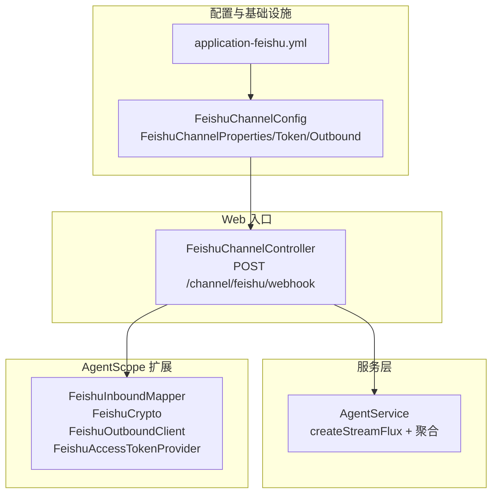
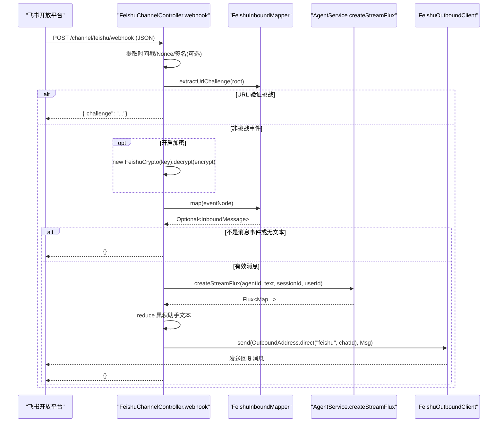
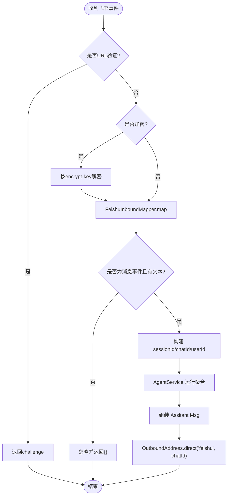
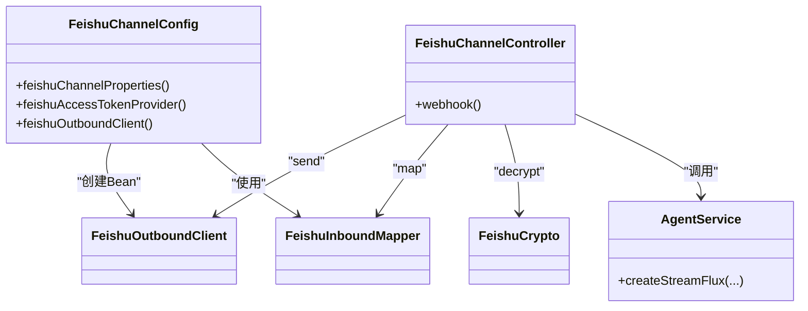

# 飞书 IM 渠道

<cite>
**本文引用的文件**
- [FeishuChannelController.java](file://src/main/java/com/skloda/agentscope/controller/FeishuChannelController.java)
- [FeishuChannelConfig.java](file://src/main/java/com/skloda/agentscope/config/FeishuChannelConfig.java)
- [application-feishu.yml](file://src/main/resources/application-feishu.yml)
- [AgentService.java](file://src/main/java/com/skloda/agentscope/service/AgentService.java)
- [Application.yml](file://src/main/resources/application.yml)
- [pom.xml](file://pom.xml)
</cite>

## 目录
1. [简介](#简介)
2. [项目结构](#项目结构)
3. [核心组件](#核心组件)
4. [架构总览](#架构总览)
5. [详细组件分析](#详细组件分析)
6. [依赖关系分析](#依赖关系分析)
7. [性能与可靠性](#性能与可靠性)
8. [故障排查指南](#故障排查指南)
9. [结论](#结论)
10. [附录：配置与部署](#附录配置与部署)

## 简介
本文档系统化说明项目中“飞书 IM 渠道”（S14）的实现，覆盖 Webhook 回调接口的入站处理、URL 验证挑战、消息加密解密、事件路由策略、会话隔离机制、OutboundAddress 直接消息发送模式，以及从原始 Feishu 事件到 AgentScope Msg 对象的数据转换流程。并给出异常处理策略、重试思路与监控指标建议，最后提供在飞书开放平台上的配置步骤与常见排错清单。

该能力通过 Spring Profile “feishu” 启用，外部暴露的回调端点默认路径为 /channel/feishu/webhook。接收的事件经内部映射后进入统一的 AgentService 执行，并以单条消息回写到飞书会话。

## 项目结构
围绕飞书渠道的相关代码与资源组织如下：
- Controller 层：FeishuChannelController 实现 Webhook 回调接收与应答。
- Config 层：FeishuChannelConfig 装配 Feishu 通道所需的属性、令牌提供器与出站客户端。
- 资源与配置：application-feishu.yml 定义渠道相关键值；Application.yml 管理应用级基础配置。
- Service 层：AgentService 负责将入站消息转换为 AgentScope 运行所需格式，并驱动流式执行聚合回复。
- 依赖声明：pom.xml 引入 agentscope-extensions-channel-common 与 agentscope-extensions-channel-feishu，提供 FeishuInboundMapper、FeishuCrypto、FeishuOutboundClient、FeishuAccessTokenProvider 等运行时能力。

图表来源
- [FeishuChannelController.java:31-44](file://src/main/java/com/skloda/agentscope/controller/FeishuChannelController.java#L31-L44)
- [FeishuChannelConfig.java:11-38](file://src/main/java/com/skloda/agentscope/config/FeishuChannelConfig.java#L11-L38)
- [application-feishu.yml:11-20](file://src/main/resources/application-feishu.yml#L11-L20)

章节来源
- [FeishuChannelController.java:31-170](file://src/main/java/com/skloda/agentscope/controller/FeishuChannelController.java#L31-L170)
- [FeishuChannelConfig.java:40-65](file://src/main/java/com/skloda/agentscope/config/FeishuChannelConfig.java#L40-L65)
- [application-feishu.yml:1-26](file://src/main/resources/application-feishu.yml#L1-L26)
- [pom.xml:122-132](file://pom.xml#L122-L132)

## 核心组件
- 回调控制器（FeishuChannelController）：解析入参 JSON、处理 URL 验证挑战、可选解密、映射为 InboundMessage、提取文本、构建会话上下文、调用 AgentService 并聚合回复、构造 OutboundAddress 并通过出站客户端发送。
- 配置装配（FeishuChannelConfig）：基于配置文件注入 appId/appSecret/token/callback-path/api-base，构建 FeishuChannelProperties、FeishuAccessTokenProvider、FeishuOutboundClient。
- 代理与服务编排（AgentService）：接收文本、会话与用户标识，创建或复用会话上下文，驱动单/多 Agent 运行，合并流式输出为一个最终文本响应。
- AgentScope 扩展（由依赖注入）：
  - FeishuInboundMapper：从原始 Feishu 事件中提取 URL challenge、消息内容、多模态信息与会话标识。
  - FeishuCrypto：根据配置的 encrypt-key 对/解密消息体。
  - FeishuOutboundClient：基于 access token 向飞书 API 发消息。
  - FeishuAccessTokenProvider：封装访问令牌获取逻辑（由扩展包提供）。

章节来源
- [FeishuChannelController.java:46-170](file://src/main/java/com/skloda/agentscope/controller/FeishuChannelController.java#L46-L170)
- [FeishuChannelConfig.java:44-64](file://src/main/java/com/skloda/agentscope/config/FeishuChannelConfig.java#L44-L64)
- [AgentService.java:84-177](file://src/main/java/com/skloda/agentscope/service/AgentService.java#L84-L177)
- [pom.xml:122-132](file://pom.xml#L122-L132)

## 架构总览
下面用序列图描述一次完整的“飞书 IM 消息 -> Agent 回复 -> 飞书回复”的执行链：

图表来源
- [FeishuChannelController.java:68-142](file://src/main/java/com/skloda/agentscope/controller/FeishuChannelController.java#L68-L142)
- [FeishuChannelConfig.java:44-64](file://src/main/java/com/skloda/agentscope/config/FeishuChannelConfig.java#L44-L64)
- [AgentService.java:84-177](file://src/main/java/com/skloda/agentscope/service/AgentService.java#L84-L177)

## 详细组件分析

### Webhook 回调与事件路由策略
- 接收端点：POST /channel/feishu/webhook，可被自定义 path。支持请求头 X-Lark-Request-Timestamp、X-Lark-Request-Nonce、X-Lark-Signature（当前用于兼容扩展，实际由扩展库负责校验）。
- URL 验证挑战：优先尝试从入参中提取 challenge，存在则立即以指定格式返回，完成飞书侧的配置校验。
- 事件类型筛选：仅处理“消息事件”，其余类型将被忽略并返回空体{}。
- 加密解密：若启用了加密且请求体包含 encrypt 字段，则使用配置的 encrypt-key 解密后再处理。
- 路由策略：统一路由到 default-agent-id 对应的 Agent（可通过 application-feishu.yml 配置），由 AgentService 决定实际执行的路径（普通 Agent、Harness、Supervisor/Router 等由后续分支处理）。

章节来源
- [FeishuChannelController.java:68-142](file://src/main/java/com/skloda/agentscope/controller/FeishuChannelController.java#L68-L142)
- [application-feishu.yml:11-20](file://src/main/resources/application-feishu.yml#L11-L20)

### 数据转换：从原始 Feishu 事件到 AgentScope Msg
- 事件到 InboundMessage：使用 FeishuInboundMapper.map(eventNode)，将飞书的原始事件转换为 InboundMessage（包含会话 channel/chat id、发送者 sender id、以及一组 Msg 列表）。
- 文本提取：取第一条 Msg 的纯文本作为主对话内容，无文本时跳过该事件。
- 会话与用户上下文：sessionId = "feishu:" + chatId；userId = "feishu:" + senderId。这样保证会话隔离和审计追踪。
- 出站构造：当 Agent 执行完毕后，将聚合后的文本构造成 AgentScope Msg（role=ASSISTANT，content=TextBlock），随后使用 OutboundAddress.direct("feishu", chatId) 原路回复。

图表来源
- [FeishuChannelController.java:75-137](file://src/main/java/com/skloda/agentscope/controller/FeishuChannelController.java#L75-L137)

章节来源
- [FeishuChannelController.java:75-137](file://src/main/java/com/skloda/agentscope/controller/FeishuChannelController.java#L75-L137)

### 用户消息解析、多模态内容提取与上下文收集
- 解析重点：当前回调聚焦于文本型消息。对于图片/音频等多模态内容，若需要增强，可在 InboundMessage 的 Msg 列表中扩展处理（例如读取附件 URL 并转为 Agent 能识别的结构化输入）。
- 上下文收集：除 chatId/senderId 外，还可结合消息元信息（如 time 等）丰富上下文。当前实现中通过 sessionId/UserId 串起会话与用户维度。
- 多 Agent 支持：通过 AgentService 的分发逻辑，HARNESS 与 ROUTING/Supervisor 场景会被自动路由至对应运行期，屏蔽了差异。

章节来源
- [FeishuChannelController.java:103-120](file://src/main/java/com/skloda/agentscope/controller/FeishuChannelController.java#L103-L120)
- [AgentService.java:140-177](file://src/main/java/com/skloda/agentscope/service/AgentService.java#L140-L177)

### 会话隔离机制（基于 chatId）
- 会话 key：sessionId = "feishu:" + chatId，使不同飞书会话彼此隔离，互不干扰。
- 会话语义：会话内消息历史由底层内存存储或持久化存储（由 memory 配置决定）维护，保障连续对话连贯性。
- 多用户：同一 chatId 内可能多人聊天，AgentService 会基于 SessionManager 维护对应会话状态。如需区分对话人，可在入站映射中补充 sender 相关信息以便下游工具/提示词使用。

章节来源
- [FeishuChannelController.java:110-113](file://src/main/java/com/skloda/agentscope/controller/FeishuChannelController.java#L110-L113)
- [AgentService.java:162-177](file://src/main/java/com/skloda/agentscope/service/AgentService.java#L162-L177)

### OutboundAddress 的直接消息发送模式
- 目标地址：OutboundAddress.direct("feishu", chatId) 表示直接向该 chatId 发起消息。
- 发送内容：构造一个 ASSISTANT 角色的文本 Msg，通过 FeishuOutboundClient 发送到飞书后端。
- 失败容错：当前对发送过程做了 try/catch 并在出错时返回空体，生产环境可扩展为记录失败明细与告警。

章节来源
- [FeishuChannelController.java:121-137](file://src/main/java/com/skloda/agentscope/controller/FeishuChannelController.java#L121-L137)

### 流式事件聚合与终端回复
- AgentService 产出流式事件（文本分片与最终结果等），控制器使用 reduce 策略将其聚合成一段完整文本。
- 过滤规则：保留 text 增量与最终的 agent_result_text，避免中间杂项影响。
- 兜底策略：若聚合结果为空白，则以“(agent returned no reply)”替代，确保前端/IM 看到明确反馈。

章节来源
- [FeishuChannelController.java:117-137](file://src/main/java/com/skloda/agentscope/controller/FeishuChannelController.java#L117-L137)
- [AgentService.java:84-177](file://src/main/java/com/skloda/agentscope/service/AgentService.java#L84-L177)

## 依赖关系分析
- Channel 扩展依赖：项目通过 pom.xml 引入 agentscope-extensions-channel-common 与 agentscope-extensions-channel-feishu，从而获得事件映射、加密、出站能力。
- 组件耦合：
  - Controller 仅依赖扩展接口与 AgentService，保持低耦合。
  - Config 层统一组装依赖，便于 Profile 化开关控制。
  - AgentService 对接运行时工厂，承担路由与聚合职责。
- 可能的循环：本模块未引入反向引用，依赖方向清晰。

图表来源
- [FeishuChannelController.java:31-44](file://src/main/java/com/skloda/agentscope/controller/FeishuChannelController.java#L31-L44)
- [FeishuChannelConfig.java:44-64](file://src/main/java/com/skloda/agentscope/config/FeishuChannelConfig.java#L44-L64)
- [pom.xml:122-132](file://pom.xml#L122-L132)

章节来源
- [pom.xml:122-132](file://pom.xml#L122-L132)

## 性能与可靠性
- 非阻塞 IO：基于 Spring WebFlux/Mono 异步处理，适合高吞吐 IM 回调场景。
- 连接与网络：出站发送走 HTTP，生产建议使用负载均衡与健康检查；必要时在出站客户端层面增加超时与重试策略。
- 幂等与重试：
  - URL 验证挑战无需幂等，尽快返回即可。
  - 消息事件建议结合飞书重试机制（开发者平台通常会对投递失败的 webhook 进行有限次数重试），控制器应确保对重复投递具备幂等性或最终一致。
  - 对于 Agent 执行耗时场景，可在调用处加入超时控制与退避重试（如对出站发送）。
- 资源限制：避免对大附件进行同步解析；如需图片/音视频处理，建议在独立线程或异步管道中处理，减少 Webhook 处理时延。
- 可观测性：在当前日志基础上，可增加业务指标打点（如事件计数、失败率、延迟分位等），便于容量规划与问题定位。

[本节为通用指导，未直接分析具体文件]

## 故障排查指南
- Webhook 无法激活
  - 确认启用 spring.profiles.active=feishu。
  - 核对回调地址是否正确指向 /channel/feishu/webhook。
- URL 验证失败
  - 确认在飞书平台已完成事件订阅并配置回调 URL；若本地调试，通过 ngrok 等工具暴露公网地址。
  - 控制器会在检测到 challenge 时直接返回，检查响应体是否符合要求。
- 收不到消息事件
  - 检查飞书应用的权限是否包含 im:message 与 im:message:send_as_bot。
  - 核对 event subscription 是否订阅 im.message.receive_v1。
- 消息未转发给 Agent
  - 确认 default-agent-id 存在并被加载（默认值为 chat-basic）。
  - 查看日志中的“非消息事件忽略”和“无文本内容跳过”两类 log，排查事件类型与内容。
- 无法发送回复
  - 检查 Access Token 获取是否正常（扩展内部通过 appId/appSecret 获取）。
  - 检查 Outbound 错误日志；若抛出异常，当前实现捕获后返回空体，需关注日志。
- 加密消息处理失败
  - 确认 encrypt-key 配置正确且与飞书平台一致；如开发阶段，可直接留空关闭加密。

章节来源
- [application-feishu.yml:11-20](file://src/main/resources/application-feishu.yml#L11-L20)
- [FeishuChannelController.java:68-142](file://src/main/java/com/skloda/agentscope/controller/FeishuChannelController.java#L68-L142)

## 结论
本项目的飞书 IM 渠道基于 AgentScope 的扩展生态，采用 Profile 化的轻量集成方式，实现了“接收回调—安全校验—事件映射—Agent 执行—出站回复”的全链路闭环。通过基于 chatId 的会话隔离和统一的 AgentService，既保证了体验的一致性，也保留了向多 Agent/高级编排模式演进的空间。生产部署建议配合完善的监控、重试与限流策略，确保高可用与稳定性。

[本节总结性陈述，不包含源码分析]

## 附录：配置与部署

### 在飞书开放平台的配置步骤
- 创建企业自建应用：登录飞书开放平台，创建应用，记录 App ID 与 App Secret。
- 配置事件订阅：添加事件类型 im.message.receive_v1，并设置回调 URL 为 https://<公网域名或ngrok地址>/channel/feishu/webhook。
- 权限申请：申请并开通 im:message 与 im:message:send_as_bot 权限。
- 应用发布与授权：确保应用被相关人或群授予可使用权限。

章节来源
- [application-feishu.yml:1-20](file://src/main/resources/application-feishu.yml#L1-L20)

### 应用配置要点
- 启动 Profile：--spring.profiles.active=feishu
- 关键配置项：
  - app-id / app-secret：从飞书平台获取
  - verification-token：用于事件校验（根据扩展需要）
  - encrypt-key：可选，启用后可对事件载荷加密
  - callback-path：默认 /channel/feishu/webhook
  - api-base：默认 open.feishu.cn 地址
  - default-agent-id：默认 chat-basic
- 端口与模型：
  - 默认端口 8081（见 Application.yml）
  - DashScope Model 配置及 API Key 请遵循应用基础配置

章节来源
- [application-feishu.yml:11-20](file://src/main/resources/application-feishu.yml#L11-L20)
- [Application.yml:1-12](file://src/main/resources/application.yml#L1-L12)
- [Application.yml:26-40](file://src/main/resources/application.yml#L26-L40)

### 部署注意事项
- 公网可达：回调 URL 必须公网可达，开发环境推荐使用 ngrok 或云隧道。
- 安全加固：建议在生产启用 HTTPS 与 TLS，按需启用消息加密与签名校验。
- 环境变量：所有密钥建议通过环境变量注入，避免明文落盘。
- 日志级别：可将 io.agentscope.extensions.channel.feishu 与控制器日志级别调整为 INFO/DEBUG，便于联调。
- 扩缩容：由于回调轻量且无状态，可水平扩容多个实例，配合网关/负载均衡接入。

章节来源
- [application-feishu.yml:21-26](file://src/main/resources/application-feishu.yml#L21-L26)
- [Application.yml:81-89](file://src/main/resources/application.yml#L81-L89)