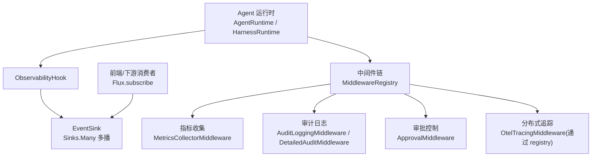
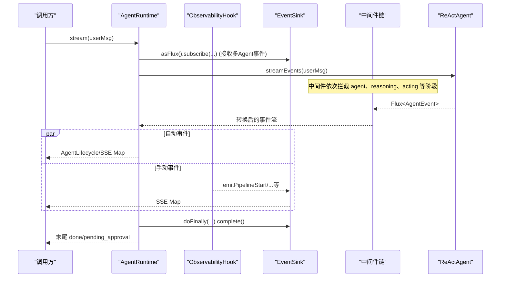
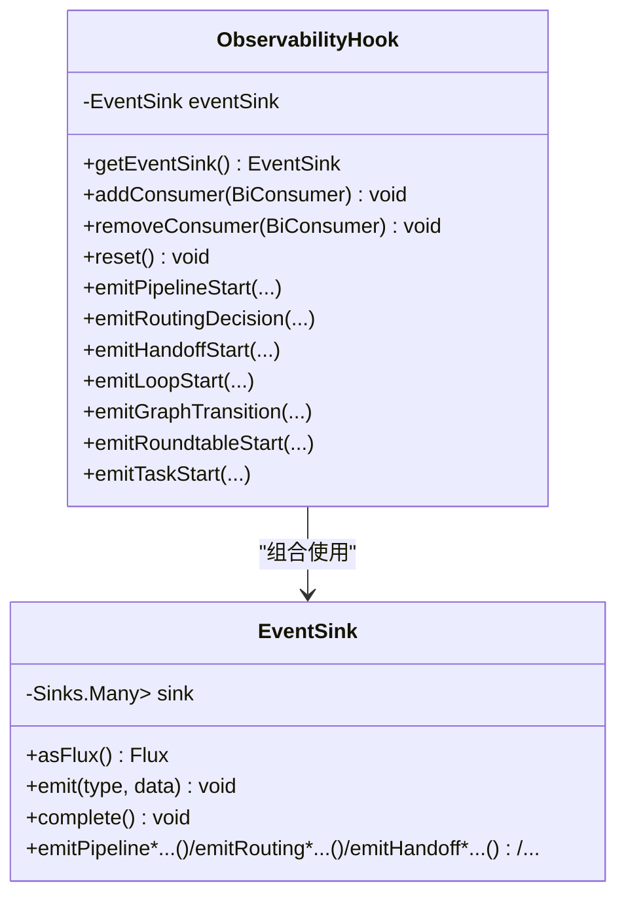
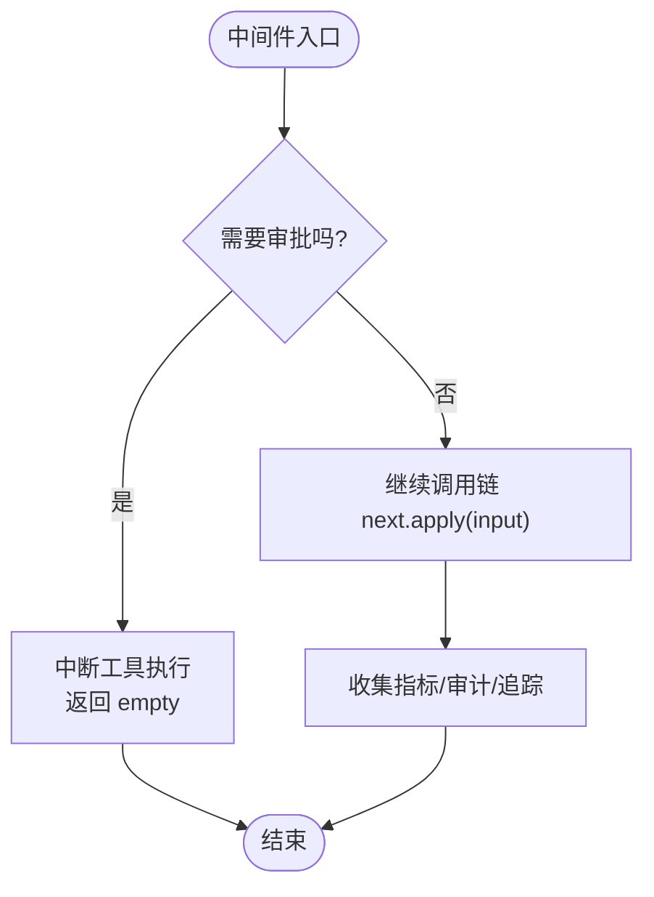
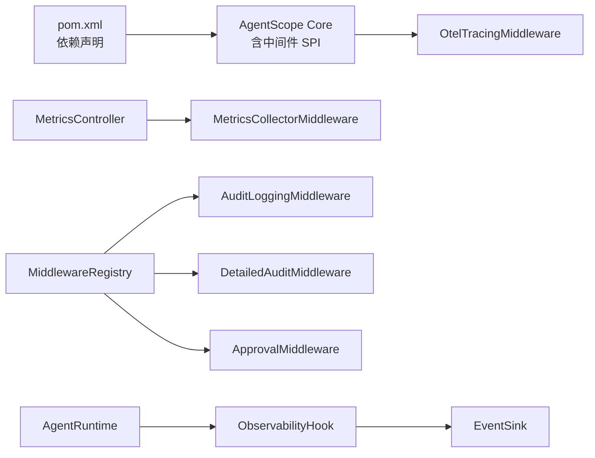

# 可观测性监控

<cite>
**本文引用的文件**
- [ObservabilityHook.java](file://src/main/java/com/skloda/agentscope/hook/ObservabilityHook.java)
- [EventSink.java](file://src/main/java/com/skloda/agentscope/runtime/EventSink.java)
- [AgentRuntime.java](file://src/main/java/com/skloda/agentscope/runtime/AgentRuntime.java)
- [HarnessRuntime.java](file://src/main/java/com/skloda/agentscope/harness/HarnessRuntime.java)
- [MetricsController.java](file://src/main/java/com/skloda/agentscope/controller/MetricsController.java)
- [MetricsCollectorMiddleware.java](file://src/main/java/com/skloda/agentscope/middleware/MetricsCollectorMiddleware.java)
- [AuditLoggingMiddleware.java](file://src/main/java/com/skloda/agentscope/middleware/AuditLoggingMiddleware.java)
- [DetailedAuditMiddleware.java](file://src/main/java/com/skloda/agentscope/middleware/DetailedAuditMiddleware.java)
- [ApprovalMiddleware.java](file://src/main/java/com/skloda/agentscope/middleware/ApprovalMiddleware.java)
- [MiddlewareRegistry.java](file://src/main/java/com/skloda/agentscope/middleware/MiddlewareRegistry.java)
- [agents.yml](file://src/main/resources/config/agents.yml)
- [pom.xml](file://pom.xml)
</cite>

## 目录
1. [简介](#简介)
2. [项目结构与定位](#项目结构与定位)
3. [核心组件总览](#核心组件总览)
4. [架构概览](#架构概览)
5. [详细组件分析](#详细组件分析)
6. [依赖关系分析](#依赖关系分析)
7. [性能与容量规划](#性能与容量规划)
8. [故障排查指南](#故障排查指南)
9. [结论](#结论)

## 简介
本文聚焦 AgentScope 可观测性监控系统，重点说明：
- 从传统 Hook 到事件桥接的过渡：ObservabilityHook 如何桥接到现代 EventSink
- EventSink 的多订阅者分发机制、事件类型、生命周期
- 中间件体系对审批流程、审计日志、指标采集的拦截与处理
- 指标暴露与管理端点
- OpenTelemetry 集成方式（由 AgentScope GA 内置提供）
- 可视化建议、性能基准思路与容量规划建议

## 项目结构与定位
本仓库为 Spring Boot + AgentScope 2.0 的示例应用。可观测性能力主要集中在以下包：
- hook：ObservabilityHook（事件桥接器）
- runtime：EventSink、AgentRuntime、HarnessRuntime（流式事件合并与生命周期管理）
- middleware：各类中间件实现与注册中心（指标收集、审计、速率限制、OpenTelemetry 接入）
- controller：/api/metrics 管理端点

图示来源
- [ObservabilityHook.java:1-67](file://src/main/java/com/skloda/agentscope/hook/ObservabilityHook.java#L1-L67)
- [EventSink.java:1-152](file://src/main/java/com/skloda/agentscope/runtime/EventSink.java#L1-L152)
- [AgentRuntime.java:67-142](file://src/main/java/com/skloda/agentscope/runtime/AgentRuntime.java#L67-L142)
- [HarnessRuntime.java:49-63](file://src/main/java/com/skloda/agentscope/harness/HarnessRuntime.java#L49-L63)
- [MiddlewareRegistry.java:12-55](file://src/main/java/com/skloda/agentscope/middleware/MiddlewareRegistry.java#L12-L55)
- [MetricsCollectorMiddleware.java:31-91](file://src/main/java/com/skloda/agentscope/middleware/MetricsCollectorMiddleware.java#L31-L91)
- [AuditLoggingMiddleware.java:15-68](file://src/main/java/com/skloda/agentscope/middleware/AuditLoggingMiddleware.java#L15-L68)
- [ApprovalMiddleware.java:22-124](file://src/main/java/com/skloda/agentscope/middleware/ApprovalMiddleware.java#L22-L124)

章节来源
- [ObservabilityHook.java:1-67](file://src/main/java/com/skloda/agentscope/hook/ObservabilityHook.java#L1-L67)
- [EventSink.java:1-152](file://src/main/java/com/skloda/agentscope/runtime/EventSink.java#L1-L152)
- [AgentRuntime.java:67-142](file://src/main/java/com/skloda/agentscope/runtime/AgentRuntime.java#L67-L142)
- [HarnessRuntime.java:49-63](file://src/main/java/com/skloda/agentscope/harness/HarnessRuntime.java#L49-L63)

## 核心组件总览
- ObservabilityHook：兼容旧 Hook 消费者的桥接器，统一转向 EventSink 的事件分发；提供发射多种多智能体流程事件的方法
- EventSink：基于 Reactor Sinks.Many 的多播事件总线，提供事件常量、便捷方法、生命周期 complete()
- AgentRuntime：将自动 Agent 生命周期事件（agent.streamEvents）与手动 EventSink 事件合并输出；负责处理审批挂起、完成与资源清理
- HarnessRuntime：HARNESS 模式下的流式运行，复用事件映射逻辑并输出 typed 事件
- MiddlewareRegistry：中间件注册表，集中注册审计、指标、限流、上下文增强、OTEL 追踪等
- MetricsController：对外提供指标打印/重置/状态查询的 REST 接口

章节来源
- [ObservabilityHook.java:16-67](file://src/main/java/com/skloda/agentscope/hook/ObservabilityHook.java#L16-L67)
- [EventSink.java:15-152](file://src/main/java/com/skloda/agentscope/runtime/EventSink.java#L15-L152)
- [AgentRuntime.java:26-142](file://src/main/java/com/skloda/agentscope/runtime/AgentRuntime.java#L26-L142)
- [HarnessRuntime.java:15-74](file://src/main/java/com/skloda/agentscope/harness/HarnessRuntime.java#L15-L74)
- [MiddlewareRegistry.java:12-55](file://src/main/java/com/skloda/agentscope/middleware/MiddlewareRegistry.java#L12-L55)
- [MetricsController.java:12-57](file://src/main/java/com/skloda/agentscope/controller/MetricsController.java#L12-L57)

## 架构概览

图示来源
- [AgentRuntime.java:67-142](file://src/main/java/com/skloda/agentscope/runtime/AgentRuntime.java#L67-L142)
- [ObservabilityHook.java:45-66](file://src/main/java/com/skloda/agentscope/hook/ObservabilityHook.java#L45-L66)
- [EventSink.java:21-37](file://src/main/java/com/skloda/agentscope/runtime/EventSink.java#L21-L37)
- [MetricsCollectorMiddleware.java:50-91](file://src/main/java/com/skloda/agentscope/middleware/MetricsCollectorMiddleware.java#L50-L91)
- [AuditLoggingMiddleware.java:19-68](file://src/main/java/com/skloda/agentscope/middleware/AuditLoggingMiddleware.java#L19-L68)

章节来源
- [AgentRuntime.java:67-142](file://src/main/java/com/skloda/agentscope/runtime/AgentRuntime.java#L67-L142)

## 详细组件分析

### ObservabilityHook 事件桥接架构
- 目标：将旧版 Hook 消费者迁移到以 EventSink 为中心的现代事件通道，保证向后兼容
- 设计要点：
  - 内部持有 EventSink 实例，并提供 addConsumer/removeConsumer/reset
  - 提供一揽子 emitXxx(...) 方法，封装为标准事件常量 + payload + timestamp
  - 支持 pipeline/routing/handoff/loop/graph/roundtable/task 等多智能体协作场景的事件发射
- 与运行时协同：
  - AgentRuntime 会将 EventSink 的 Flux 与 agent.streamEvents 的输出合并
  - 在最终流完成时关闭 EventSink，避免前端悬挂（不再能重复聊天的问题已修复）

图表：类图

图示来源
- [ObservabilityHook.java:16-67](file://src/main/java/com/skloda/agentscope/hook/ObservabilityHook.java#L16-L67)
- [EventSink.java:15-152](file://src/main/java/com/skloda/agentscope/runtime/EventSink.java#L15-L152)

章节来源
- [ObservabilityHook.java:16-67](file://src/main/java/com/skloda/agentscope/hook/ObservabilityHook.java#L16-L67)

### EventSink 多订阅者分发、事件类型与生命周期
- 事件总线：基于 Sinks.many().multicast().onBackpressureBuffer()，支持多个订阅者，背压缓冲
- 事件类型：包含 pipeline_start/step_start/end/end、routing_decision/end、handoff_start/complete、loop_start/end/iteration_result、graph_transition/call、roundtable_start/start/end/message/summary、task_delegate/start/end/aggregate 等
- 生命周期：每个代理会话结束后通过 doFinally(...).complete() 关闭 sink，确保上游消费者收到终止信号

章节来源
- [EventSink.java:15-152](file://src/main/java/com/skloda/agentscope/runtime/EventSink.java#L15-L152)

### AgentRuntime 合并与审批流挂起
- 合并策略：Flux.merge(sinkEvents, agentEventsWithSinkCompletion)，自动事件与手动事件并存
- 关键细节：
  - 清理历史挂起的 ToolUseBlock，避免上下文污染
  - 如果触发 ApprovalMiddleware，则输出 pending_approval 事件并将工具调用信息返回给前端
  - 完成后 close() 释放资源，错误路径也执行清理

章节来源
- [AgentRuntime.java:67-142](file://src/main/java/com/skloda/agentscope/runtime/AgentRuntime.java#L67-L142)

### HarnessRuntime 事件流
- 直接调用 agent.streamEvents(userMsg, runtimeContext)，通过共享 Mapper 转为 Map SSE
- 保持与单 Agent 一致的 typed 事件流体验
- 内置 ObservabilityHook 用于扩展多 Agent 事件

章节来源
- [HarnessRuntime.java:49-63](file://src/main/java/com/skloda/agentscope/harness/HarnessRuntime.java#L49-L63)

### 中间件系统：审批、审计与指标
- 注册中心：MiddlewareRegistry 在启动时注册内置中间件（审计、限流、上下文增强、详细审计、指标、OTEL 追踪）
- 审批流程：ApprovalMiddleware 在 onActing 阶段拦截敏感工具调用，必要时阻断执行并返回 Flux.empty()，随后通过 Runtime 生成 pending_approval
- 审计日志：AuditLoggingMiddleware 记录 Agent、Reasoning、Acting 阶段的关键信息；DetailedAuditMiddleware 提供更细粒度的链路跟踪（traceId）、输入预览、思考过程与文本摘要等
- 指标收集：MetricsCollectorMiddleware 统计 Agent/Tool 调用次数、耗时、Token 与成本估计、错误率等

图示来源
- [ApprovalMiddleware.java:58-77](file://src/main/java/com/skloda/agentscope/middleware/ApprovalMiddleware.java#L58-L77)
- [AuditLoggingMiddleware.java:19-68](file://src/main/java/com/skloda/agentscope/middleware/AuditLoggingMiddleware.java#L19-L68)
- [DetailedAuditMiddleware.java:45-108](file://src/main/java/com/skloda/agentscope/middleware/DetailedAuditMiddleware.java#L45-L108)
- [MetricsCollectorMiddleware.java:50-91](file://src/main/java/com/skloda/agentscope/middleware/MetricsCollectorMiddleware.java#L50-L91)

章节来源
- [MiddlewareRegistry.java:26-40](file://src/main/java/com/skloda/agentscope/middleware/MiddlewareRegistry.java#L26-L40)
- [ApprovalMiddleware.java:22-124](file://src/main/java/com/skloda/agentscope/middleware/ApprovalMiddleware.java#L22-L124)
- [AuditLoggingMiddleware.java:15-68](file://src/main/java/com/skloda/agentscope/middleware/AuditLoggingMiddleware.java#L15-L68)
- [DetailedAuditMiddleware.java:28-108](file://src/main/java/com/skloda/agentscope/middleware/DetailedAuditMiddleware.java#L28-L108)
- [MetricsCollectorMiddleware.java:21-91](file://src/main/java/com/skloda/agentscope/middleware/MetricsCollectorMiddleware.java#L21-L91)

### Prometheus 指标与自定义指标注册
- 现状：当前未引入 Spring Boot Starter Actuator/Prometheus 依赖，亦无 Micrometer 客户端代码
- 指标出口：
  - MetricsController 提供 /api/metrics/print（打印汇总）、/api/metrics/reset（重置）、/api/metrics/status（状态）
  - MetricsCollectorMiddleware 内部维护线程安全聚合容器与计数器，供外部查看
- 建议扩展：
  - 引入 micrometer-registry-prometheus 后，可通过 Actuator /actuator/prometheus 暴露
  - 自定义指标可按“Agent 名/工具名/阶段”分桶，按维度聚合 P95/P99、错误率、token 用量估算

章节来源
- [MetricsController.java:12-57](file://src/main/java/com/skloda/agentscope/controller/MetricsController.java#L12-L57)
- [MetricsCollectorMiddleware.java:186-210](file://src/main/java/com/skloda/agentscope/middleware/MetricsCollectorMiddleware.java#L186-L210)

### OpenTelemetry 集成与分布式追踪
- 集成方式：通过 MiddlewareRegistry 注册 OtelTracingMiddleware 作为中间件（AgentScope GA 内置）
- 启用方式：在 agents.yml 中为 agent/middleware 配置启用 otel-tracing
- 效果：自动注入追踪跨度，与审计、指标数据联动，便于全链路可视化

章节来源
- [MiddlewareRegistry.java:36-39](file://src/main/java/com/skloda/agentscope/middleware/MiddlewareRegistry.java#L36-L39)
- [agents.yml:1765-1765](file://src/main/resources/config/agents.yml#L1765-L1765)

## 依赖关系分析

图示来源
- [pom.xml:28-55](file://pom.xml#L28-L55)
- [MiddlewareRegistry.java:26-40](file://src/main/java/com/skloda/agentscope/middleware/MiddlewareRegistry.java#L26-L40)
- [MetricsController.java:22-37](file://src/main/java/com/skloda/agentscope/controller/MetricsController.java#L22-L37)
- [AgentRuntime.java:94-128](file://src/main/java/com/skloda/agentscope/runtime/AgentRuntime.java#L94-L128)

章节来源
- [pom.xml:28-55](file://pom.xml#L28-L55)

## 性能与容量规划
- 指标采集策略：
  - 基于 ThreadLocal 的上下文隔离，低开销地统计各阶段耗时、工具调用、token 用量与成本估算
  - 聚合结构使用并发容器与原子变量，适合高并发采集
- 事件吞吐：
  - Sinks.Many.multicast().onBackpressureBuffer() 保证订阅者消费不同步时的缓冲能力
  - AgentRuntime 在完成时关闭 sink，避免悬挂
- 后端压力建议：
  - 若后续接入 PromQL 或时序数据库，建议开启采样窗口、限制标签基数（如按 agentName/toolName/phase 等有限维度）
  - 高频事件（如 thinking/text delta）需考虑过滤或下采样，以减少存储与查询压力

## 故障排查指南
- 前端无法收到 “done” 事件：确认 EventSink.complete() 是否被正确调用（AgentRuntime 已通过 doFinally 保证）
- 审批导致请求不执行工具：检查 ApprovalMiddleware 是否被启用；如需恢复，通过 /ag-ui/run 或其他流程继续提交
- 指标不更新：确认对应中间件是否在 agents.yml 中启用；可通过 /api/metrics/print 临时验证聚合结果
- 追踪为空：确认 otel-tracing 是否启用；若使用远端导出，检查环境变量与 SDK 配置（如 endpoint、headers）

章节来源
- [AgentRuntime.java:112-127](file://src/main/java/com/skloda/agentscope/runtime/AgentRuntime.java#L112-L127)
- [ApprovalMiddleware.java:58-77](file://src/main/java/com/skloda/agentscope/middleware/ApprovalMiddleware.java#L58-L77)
- [MetricsController.java:22-40](file://src/main/java/com/skloda/agentscope/controller/MetricsController.java#L22-L40)

## 结论
本项目实现了面向多 Agent 协作的可观测性框架：
- 通过 ObservabilityHook 平滑过渡至 EventSink，统一管理人工与自动事件
- 中间件体系覆盖审计、指标、审批与分布式追踪
- 提供简单可靠的指标管理端点与可扩展的自定义指标机制
- 结合 OpenTelemetry 实现全链路追踪，为可视化与告警打下基础