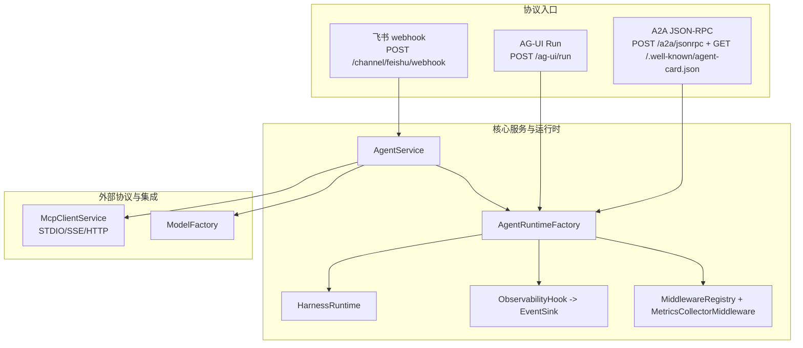
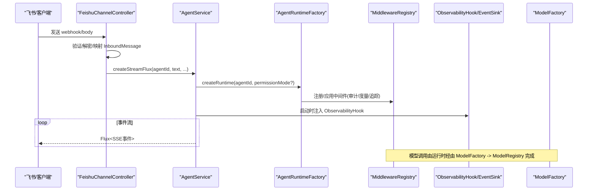
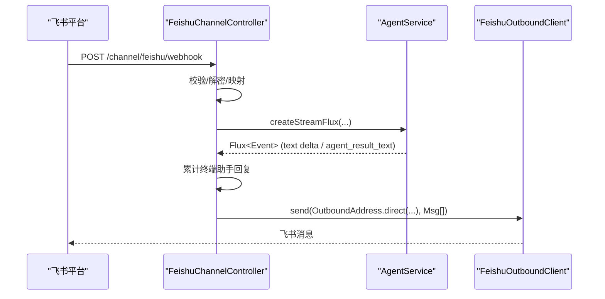
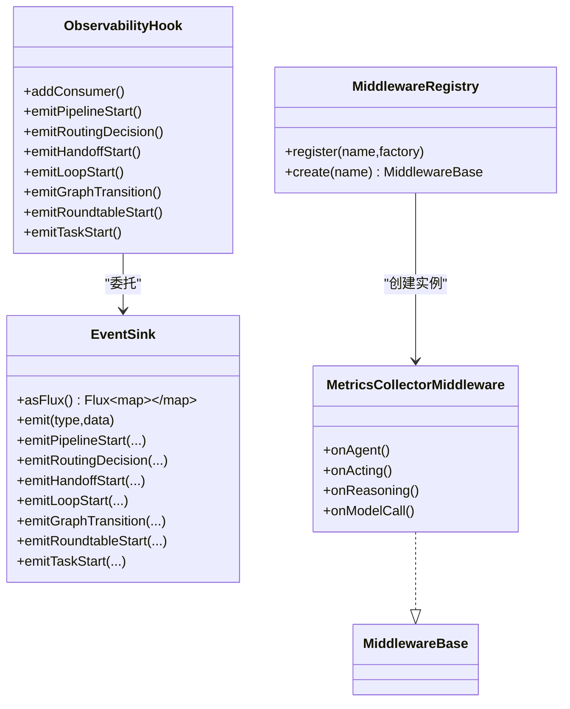
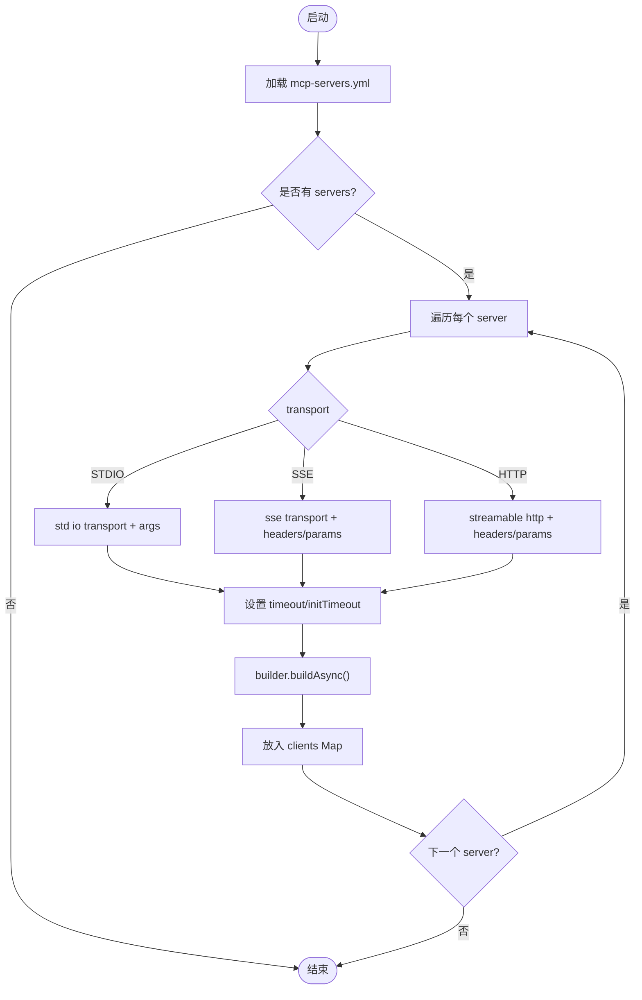
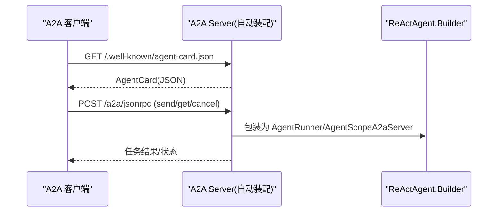
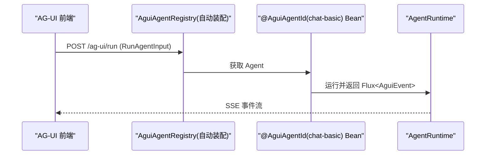
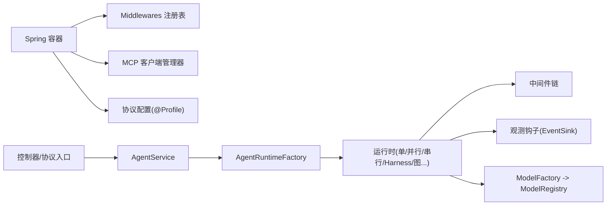

# 外部集成

<cite>
**本文引用的文件**
- [FeishuChannelConfig.java](file://src/main/java/com/skloda/agentscope/config/FeishuChannelConfig.java)
- [FeishuChannelController.java](file://src/main/java/com/skloda/agentscope/controller/FeishuChannelController.java)
- [application-feishu.yml](file://src/main/resources/application-feishu.yml)
- [McpClientService.java](file://src/main/java/com/skloda/agentscope/mcp/McpClientService.java)
- [McpTransport.java](file://src/main/java/com/skloda/agentscope/mcp/McpTransport.java)
- [mcp-servers.yml](file://src/main/resources/config/mcp-servers.yml)
- [ObservabilityHook.java](file://src/main/java/com/skloda/agentscope/hook/ObservabilityHook.java)
- [EventSink.java](file://src/main/java/com/skloda/agentscope/runtime/EventSink.java)
- [MetricsCollectorMiddleware.java](file://src/main/java/com/skloda/agentscope/middleware/MetricsCollectorMiddleware.java)
- [MiddlewareRegistry.java](file://src/main/java/com/skloda/agentscope/middleware/MiddlewareRegistry.java)
- [AgentRuntimeFactory.java](file://src/main/java/com/skloda/agentscope/runtime/AgentRuntimeFactory.java)
- [HarnessRuntime.java](file://src/main/java/com/skloda/agentscope/harness/HarnessRuntime.java)
- [AguiConfig.java](file://src/main/java/com/skloda/agentscope/config/AguiConfig.java)
- [application-agui.yml](file://src/main/resources/application-agui.yml)
- [A2aServerConfig.java](file://src/main/java/com/skloda/agentscope/config/A2aServerConfig.java)
- [application-a2a.yml](file://src/main/resources/application-a2a.yml)
- [ModelFactory.java](file://src/main/java/com/skloda/agentscope/model/ModelFactory.java)
- [AgentService.java](file://src/main/java/com/skloda/agentscope/service/AgentService.java)
- [agents.yml](file://src/main/resources/config/agents.yml)
- [pom.xml](file://pom.xml)
</cite>

## 目录
1. [简介](#简介)
2. [项目结构概览](#项目结构概览)
3. [核心组件总览](#核心组件总览)
4. [架构总览](#架构总览)
5. [详细组件分析](#详细组件分析)
   - [飞书 IM 通道与 Webhook 处理](#飞书-im-通道与-webhook-处理)
   - [模型提供商适配（ModelFactory）](#模型提供商适配-modelfactory)
   - [可观测性与钩子插拔式架构](#可观测性与钩子插拔式架构)
   - [MCP 协议客户端管理](#mcp-协议客户端管理)
   - [A2A 协议的 Agent Card 发现与服务发布](#a2a-协议的-agent-card-发现与服务发布)
   - [AG-UI 协议的实时通信](#ag-ui-协议的实时通信)
6. [依赖关系分析](#依赖关系分析)
7. [性能与可靠性](#性能与可靠性)
8. [第三方服务集成指南](#第三方服务集成指南)
9. [故障排查指南](#故障排查指南)
10. [结论](#结论)
11. [附录](#附录)

## 简介
本文件围绕本项目中“外部系统集成”的技术实现，给出系统化文档。内容涵盖：
- 模型提供商适配器模式
- 可观测性钩子的插拔式架构
- MCP 协议客户端管理
- 飞书 IM Webhook、A2A 协议与 AG-UI 协议的端到端流程
- 重试、错误处理、监控指标的统一策略
- 第三方服务的认证、调用、数据同步、性能调优与企业级能力（服务发现、容错）说明与扩展建议

## 项目结构概览
项目基于 Spring Boot + AgentScope（Java），通过 Profile 隔离不同外部协议（feishu、a2a、agui），使用统一服务层（AgentService）路由到各运行时与中间件，对外暴露多种入口（REST、SSE、协议网关）。

**图示来源**
- [FeishuChannelController.java:68-142](file://src/main/java/com/skloda/agentscope/controller/FeishuChannelController.java#L68-L142)
- [A2aServerConfig.java:50-62](file://src/main/java/com/skloda/agentscope/config/A2aServerConfig.java#L50-L62)
- [AguiConfig.java:50-64](file://src/main/java/com/skloda/agentscope/config/AguiConfig.java#L50-L64)
- [AgentService.java:140-176](file://src/main/java/com/skloda/agentscope/service/AgentService.java#L140-L176)
- [AgentRuntimeFactory.java:41-83](file://src/main/java/com/skloda/agentscope/runtime/AgentRuntimeFactory.java#L41-L83)
- [McpClientService.java:43-90](file://src/main/java/com/skloda/agentscope/mcp/McpClientService.java#L43-L90)
- [ModelFactory.java:42-55](file://src/main/java/com/skloda/agentscope/model/ModelFactory.java#L42-L55)

**章节来源**
- [FeishuChannelController.java:1-170](file://src/main/java/com/skloda/agentscope/controller/FeishuChannelController.java#L1-L170)
- [AgentService.java:1-176](file://src/main/java/com/skloda/agentscope/service/AgentService.java#L1-L176)
- [AgentRuntimeFactory.java:1-180](file://src/main/java/com/skloda/agentscope/runtime/AgentRuntimeFactory.java#L1-L180)

## 核心组件总览
- 模型适配器：ModelFactory 统一封装 ModelRegistry，自动为裸模型名补前缀，集中注入 apiKey、流与思考开关。
- 可观测性钩子：ObservabilityHook 将传统 hook 桥接到新的 EventSink；多 agent 事件由 EventSink 发出，供上层订阅。
- 中间件体系：MiddlewareRegistry 注册内置/扩展中间件；MetricsCollectorMiddleware 收集工具/模型调用耗时与 token 成本。
- 运行时工厂：AgentRuntimeFactory 按 agent 类型创建相应运行时；HarnessRuntime 复用统一的事件映射管线。
- 协议配置：FeishuChannelConfig、A2aServerConfig、AguiConfig 通过 @Profile 启停对应能力。
- MCP 客户端：McpClientService 加载 mcp-servers.yml，维护多个 McpClientWrapper 生命周期并支持环境变量占位替换。

**章节来源**
- [ModelFactory.java:1-95](file://src/main/java/com/skloda/agentscope/model/ModelFactory.java#L1-L95)
- [ObservabilityHook.java:1-67](file://src/main/java/com/skloda/agentscope/hook/ObservabilityHook.java#L1-L67)
- [EventSink.java:1-152](file://src/main/java/com/skloda/agentscope/runtime/EventSink.java#L1-L152)
- [MiddlewareRegistry.java:1-55](file://src/main/java/com/skloda/agentscope/middleware/MiddlewareRegistry.java#L1-L55)
- [MetricsCollectorMiddleware.java:21-200](file://src/main/java/com/skloda/agentscope/middleware/MetricsCollectorMiddleware.java#L21-L200)
- [AgentRuntimeFactory.java:41-180](file://src/main/java/com/skloda/agentscope/runtime/AgentRuntimeFactory.java#L41-L180)
- [HarnessRuntime.java:1-74](file://src/main/java/com/skloda/agentscope/harness/HarnessRuntime.java#L1-L74)

## 架构总览
系统通过协议入口接入，经 AgentService 路由至对应的运行时或 Harness 运行时；所有执行路径均穿过中间件链（含审计、限流、遥测、埋点等）。模型调用通过 ModelFactory 抽象后交由框架注册的具体提供者（如 DashScope）。

**图示来源**
- [FeishuChannelController.java:68-142](file://src/main/java/com/skloda/agentscope/controller/FeishuChannelController.java#L68-L142)
- [AgentService.java:140-176](file://src/main/java/com/skloda/agentscope/service/AgentService.java#L140-L176)
- [AgentRuntimeFactory.java:41-83](file://src/main/java/com/skloda/agentscope/runtime/AgentRuntimeFactory.java#L41-L83)
- [MiddlewareRegistry.java:26-41](file://src/main/java/com/skloda/agentscope/middleware/MiddlewareRegistry.java#L26-L41)
- [ObservabilityHook.java:30-66](file://src/main/java/com/skloda/agentscope/hook/ObservabilityHook.java#L30-L66)
- [ModelFactory.java:42-55](file://src/main/java/com/skloda/agentscope/model/ModelFactory.java#L42-L55)

## 详细组件分析

### 飞书 IM 通道与 Webhook 处理
- 配置与依赖注入：通过 FeishuChannelConfig 在 feishu profile 下注入属性、Token 提供方与出站客户端。回调路径、密钥从 application-feishu.yml 读取。
- Webhook 处理流程：
  - 解析请求体与头部校验头
  - 处理 URL 校验挑战、可选加密解密
  - 转换为 InboundMessage（含默认 agentId）
  - 提取文本并拼接会话 ID（feishu:chatId）、用户 ID（feishu:senderId）
  - 调用 AgentService.createStreamFlux 获取 SSE 流，聚合终端 assistant 文本后通过出站客户端回复
- 错误处理：解析异常与流处理异常均返回 OK 且记录日志，避免重复投递风暴

**图示来源**
- [FeishuChannelController.java:68-142](file://src/main/java/com/skloda/agentscope/controller/FeishuChannelController.java#L68-L142)
- [FeishuChannelConfig.java:44-64](file://src/main/java/com/skloda/agentscope/config/FeishuChannelConfig.java#L44-L64)
- [application-feishu.yml:11-26](file://src/main/resources/application-feishu.yml#L11-L26)

**章节来源**
- [FeishuChannelConfig.java:1-65](file://src/main/java/com/skloda/agentscope/config/FeishuChannelConfig.java#L1-L65)
- [FeishuChannelController.java:31-170](file://src/main/java/com/skloda/agentscope/controller/FeishuChannelController.java#L31-L170)
- [application-feishu.yml:1-26](file://src/main/resources/application-feishu.yml#L1-L26)

### 模型提供商适配器（ModelFactory）
- 职责：统一 ModelRegistry.resolve 调用，自动补 provider 前缀（无冒号前缀则补 dashscope:）
- 配置：apiKey 优先来自配置，其次读取 DASHSCOPE_API_KEY 环境变量
- 特性：构建 ModelCreationContext，设置 stream 与 thinking 标志，注入 Formatter 组件

**章节来源**
- [ModelFactory.java:21-95](file://src/main/java/com/skloda/agentscope/model/ModelFactory.java#L21-L95)
- [pom.xml:28-48](file://pom.xml#L28-L48)

### 可观测性与钩子插拔式架构
- ObservabilityHook：对外的统一观察接口，内部委托给 EventSink；提供管道、路由、传递、循环、图状态、圆桌等多类事件的发射方法
- EventSink：轻量级事件总线，以多播 Sinks.Many 对外暴露 Flux，支持 typed emit* 方法与全局常量
- 中间件机制：MiddlewareRegistry 统一注册/创建 MiddlewareBase；MetricsCollectorMiddleware 收集调用次数、耗时、token、错误率与成本估算
- 运行时集成：AgentRuntimeFactory 与各具体运行时均注入 ObservabilityHook，从而贯穿整个执行路径

**图示来源**
- [ObservabilityHook.java:16-67](file://src/main/java/com/skloda/agentscope/hook/ObservabilityHook.java#L16-L67)
- [EventSink.java:15-152](file://src/main/java/com/skloda/agentscope/runtime/EventSink.java#L15-L152)
- [MetricsCollectorMiddleware.java:21-200](file://src/main/java/com/skloda/agentscope/middleware/MetricsCollectorMiddleware.java#L21-L200)
- [MiddlewareRegistry.java:12-55](file://src/main/java/com/skloda/agentscope/middleware/MiddlewareRegistry.java#L12-L55)

**章节来源**
- [ObservabilityHook.java:1-67](file://src/main/java/com/skloda/agentscope/hook/ObservabilityHook.java#L1-L67)
- [EventSink.java:1-152](file://src/main/java/com/skloda/agentscope/runtime/EventSink.java#L1-L152)
- [MiddlewareRegistry.java:1-55](file://src/main/java/com/skloda/agentscope/middleware/MiddlewareRegistry.java#L1-L55)
- [MetricsCollectorMiddleware.java:1-200](file://src/main/java/com/skloda/agentscope/middleware/MetricsCollectorMiddleware.java#L1-L200)
- [AgentRuntimeFactory.java:129-195](file://src/main/java/com/skloda/agentscope/runtime/AgentRuntimeFactory.java#L129-L195)

### MCP 协议客户端管理
- 配置加载：从 classpath:config/mcp-servers.yml 加载服务器列表，若启用则初始化 McpClientWrapper
- 传输方式：支持 STDIO、SSE、HTTP（StreamableHTTP）三种，依据配置构建并应用超时、初始化超时
- HTTP 增强：headers/queryParams 支持 ${ENV_VAR:defaultValue} 占位符替换
- 生命周期：@PostConstruct 初始化，@PreDestroy 关闭全部客户端；提供 getClient/getAllClients/isActive 查询能力

**图示来源**
- [McpClientService.java:43-144](file://src/main/java/com/skloda/agentscope/mcp/McpClientService.java#L43-L144)
- [mcp-servers.yml:1-29](file://src/main/resources/config/mcp-servers.yml#L1-L29)

**章节来源**
- [McpClientService.java:1-200](file://src/main/java/com/skloda/agentscope/mcp/McpClientService.java#L1-L200)
- [McpTransport.java:1-7](file://src/main/java/com/skloda/agentscope/mcp/McpTransport.java#L1-L7)
- [mcp-servers.yml:1-29](file://src/main/resources/config/mcp-servers.yml#L1-L29)

### A2A 协议的 Agent Card 发现与服务发布
- 当激活 a2a profile 时，A2aServerConfig 导出一个 ReActAgent.Builder，由 starter 自动装配成 A2A 服务
- 对外暴露：GET /.well-known/agent-card.json 用于发现，POST /a2a/jsonrpc 处理任务
- 配置项在 application-a2a.yml：card 元信息、传输开关等

**图示来源**
- [A2aServerConfig.java:50-62](file://src/main/java/com/skloda/agentscope/config/A2aServerConfig.java#L50-L62)
- [application-a2a.yml:12-26](file://src/main/resources/application-a2a.yml#L12-L26)

**章节来源**
- [A2aServerConfig.java:15-63](file://src/main/java/com/skloda/agentscope/config/A2aServerConfig.java#L15-L63)
- [application-a2a.yml:1-26](file://src/main/resources/application-a2a.yml#L1-L26)

### AG-UI 协议的实时通信
- 当激活 agui profile 时，AguiConfig 将 chat-basic agent 注册到 AguiAgentRegistry，使其可通过 AG-UI 入口调用
- 默认路径 /ag-ui/run，支持 path-prefix、默认 agent、推理/状态事件等开关（见 application-agui.yml）
- 与现有 /chat/send SSE 共存互不影响

**图示来源**
- [AguiConfig.java:50-64](file://src/main/java/com/skloda/agentscope/config/AguiConfig.java#L50-L64)
- [application-agui.yml:7-20](file://src/main/resources/application-agui.yml#L7-L20)

**章节来源**
- [AguiConfig.java:17-65](file://src/main/java/com/skloda/agentscope/config/AguiConfig.java#L17-L65)
- [application-agui.yml:1-20](file://src/main/resources/application-agui.yml#L1-L20)

## 依赖关系分析
- 启动期：
  - Spring Boot 加载 application*.yml；按 profile 激活 feishu/a2a/agui
  - 中间件在 MiddlewareRegistry.postConstruct 时自动注册
  - McpClientService.init 在启动时按需加载 MCP 客户端
- 运行期：
  - 任一入口进入后，经 AgentService → AgentRuntimeFactory → 具体运行时
  - 运行时注入 ObservabilityHook（EventSink）和中间件链
  - 模型调用经由 ModelFactory 抽象，统一到 ModelRegistry

**图示来源**
- [MiddlewareRegistry.java:26-41](file://src/main/java/com/skloda/agentscope/middleware/MiddlewareRegistry.java#L26-L41)
- [McpClientService.java:43-90](file://src/main/java/com/skloda/agentscope/mcp/McpClientService.java#L43-L90)
- [AgentRuntimeFactory.java:41-180](file://src/main/java/com/skloda/agentscope/runtime/AgentRuntimeFactory.java#L41-L180)
- [ModelFactory.java:42-55](file://src/main/java/com/skloda/agentscope/model/ModelFactory.java#L42-L55)
- [AgentService.java:140-176](file://src/main/java/com/skloda/agentscope/service/AgentService.java#L140-L176)

## 性能与可靠性
- 指标采集：MetricsCollectorMiddleware 统计每次 agent 调用时长、工具调用次数、token 总量与估计成本，并维护全局/逐 tool/逐 agent 指标
- 可观测性：ObservabilityHook 将关键流程（pipeline/routing/handoff/loop/graph/roundtable/task）事件统一入 EventSink，便于前端调试与分析
- 稳定性：
  - 飞书 Webhook 层对异常进行兜底处理，确保即使处理失败也返回成功响应，避免重放风暴
  - MCP 客户端初始化失败会记录警告但仍继续其他客户端初始化，具备部分可用性
- 可扩展的中间件：可在 MiddlewareRegistry 中增加自定义中间件，对全量调用进行横切拦截（审计/限流/跟踪等）

[本节不直接引用具体代码行]

## 第三方服务集成指南

### 飞书 IM（Webhook 与回发）
- 认证配置：在 application-feishu.yml 填写 app-id/app-secret/verification-token/encrypt-key；或通过环境变量覆盖
- 事件订阅：配置飞书开放平台回调为 /channel/feishu/webhook
- 权限：im:message 与 im:message:send_as_bot
- 数据流：接收 → 解密/解密 → 转为 InboundMessage → 调用 AgentService 处理 → 聚合 assistant 输出 → 通过出站客户端发送回群/私聊

**章节来源**
- [FeishuChannelConfig.java:44-64](file://src/main/java/com/skloda/agentscope/config/FeishuChannelConfig.java#L44-L64)
- [FeishuChannelController.java:68-142](file://src/main/java/com/skloda/agentscope/controller/FeishuChannelController.java#L68-L142)
- [application-feishu.yml:11-26](file://src/main/resources/application-feishu.yml#L11-L26)

### A2A（Agent Card 与服务）
- 开启 a2a profile 后自动生成服务端，对外暴露 agent card 与 JSON-RPC 接口
- 暴露的 agent 来源于 agents.yml 中的 chat-basic（可通过该配置调整 systemPrompt 与模型）
- 可据此对接任意支持 A2A 的客户端

**章节来源**
- [A2aServerConfig.java:50-62](file://src/main/java/com/skloda/agentscope/config/A2aServerConfig.java#L50-L62)
- [application-a2a.yml:12-26](file://src/main/resources/application-a2a.yml#L12-L26)
- [agents.yml:1-29](file://src/main/resources/config/agents.yml#L1-L29)

### AG-UI（实时 SSE）
- 开启 agui profile 后将 chat-basic 注册为 AG-UI 可调用的 Agent
- 路径：/ag-ui/run；可配置 path-prefix、是否推理、是否推状态/工具参数、超时、服务端记忆等
- 前端可使用任意 AG-UI 兼容库或直接浏览器测试页面

**章节来源**
- [AguiConfig.java:50-64](file://src/main/java/com/skloda/agentscope/config/AguiConfig.java#L50-L64)
- [application-agui.yml:7-20](file://src/main/resources/application-agui.yml#L7-L20)

### MCP（工具生态）
- 在 mcp-servers.yml 定义多个服务器，支持本地文件系统等 STDIO 以及远程 SSE/HTTP
- 通过 McpClientService 初始化并暴露客户端，支持在代理上下文中按名称检索调用工具
- 安全：使用 headers 传入 Token，支持 ${ENV_VAR:default} 占位以避免硬编码

**章节来源**
- [mcp-servers.yml:1-29](file://src/main/resources/config/mcp-servers.yml#L1-L29)
- [McpClientService.java:43-180](file://src/main/java/com/skloda/agentscope/mcp/McpClientService.java#L43-L180)

### 模型供应商（DashScope）
- 通过 ModelFactory 统一创建模型实例，provider 自动识别或前置冒号显式指定
- apiKey 优先取自配置，否则回退环境变量 DASHSCOPE_API_KEY
- 通过 pom.xml 引入 agentscope-extensions-model-dashscope

**章节来源**
- [ModelFactory.java:42-55](file://src/main/java/com/skloda/agentscope/model/ModelFactory.java#L42-L55)
- [pom.xml:43-48](file://pom.xml#L43-L48)

## 故障排查指南
- 飞书通道无回复：
  - 检查回调路径与签名、加密 key 配置
  - 查看控制台日志中 “S14: …” 标识的行定位处理阶段
  - 确认默认 agentId 是否正确指向 agents.yml 中存在的 agent
- MCP 客户端不可用：
  - 检查 mcp-servers.yml 中命令/URL 可达性
  - 注意 headers/queryParams 的占位符已正确解析
  - 关注初始化阶段日志与 @PostConstruct 行为
- 指标为空或异常：
  - 确认已启用 metrics-collector 中间件
  - 打印 MetricsCollectorMiddleware 汇总信息，观察 global/tool/agent 维度指标
- A2A/AG-UI 未生效：
  - 确认正确的 Spring profile 已激活（a2a/agui）
  - 检查 application-a2a.yml 或 application-agui.yml 配置项是否合理

**章节来源**
- [FeishuChannelController.java:134-140](file://src/main/java/com/skloda/agentscope/controller/FeishuChannelController.java#L134-L140)
- [McpClientService.java:50-76](file://src/main/java/com/skloda/agentscope/mcp/McpClientService.java#L50-L76)
- [MetricsCollectorMiddleware.java:187-200](file://src/main/java/com/skloda/agentscope/middleware/MetricsCollectorMiddleware.java#L187-L200)

## 结论
本系统在统一的 AgentService 与 RuntimeFactory 之上，实现了多渠道（飞书/A2A/AG-UI）与多协议（MCP）的外部集成。模型侧通过 ModelFactory 屏蔽差异，可观测性通过 Hook + EventSink 解耦输出，中间件提供横切能力。整体具备良好的扩展性与企业级所需的可观测、可运维特性。

[本节不直接引用具体代码行]

## 附录

### 配置清单与关键路径
- 飞书：application-feishu.yml，回调路径 /channel/feishu/webhook
- A2A：application-a2a.yml，卡片与 JSON-RPC 端口/开关
- AG-UI：application-agui.yml，路径前缀 /ag-ui，默认 agent
- 工具生态：config/mcp-servers.yml
- 模型：ModelFactory 与 pom.xml 中 DashScope 扩展依赖
- 中间件：MiddlewareRegistry 内置注册项

**章节来源**
- [application-feishu.yml:11-26](file://src/main/resources/application-feishu.yml#L11-L26)
- [application-a2a.yml:12-26](file://src/main/resources/application-a2a.yml#L12-L26)
- [application-agui.yml:7-20](file://src/main/resources/application-agui.yml#L7-L20)
- [mcp-servers.yml:1-29](file://src/main/resources/config/mcp-servers.yml#L1-L29)
- [ModelFactory.java:42-55](file://src/main/java/com/skloda/agentscope/model/ModelFactory.java#L42-L55)
- [pom.xml:28-48](file://pom.xml#L28-L48)
- [MiddlewareRegistry.java:26-41](file://src/main/java/com/skloda/agentscope/middleware/MiddlewareRegistry.java#L26-L41)