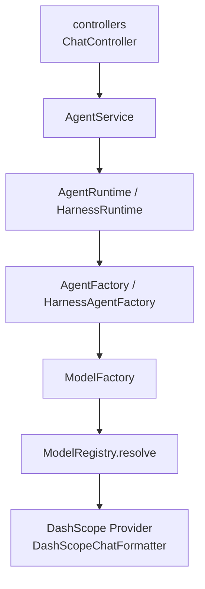
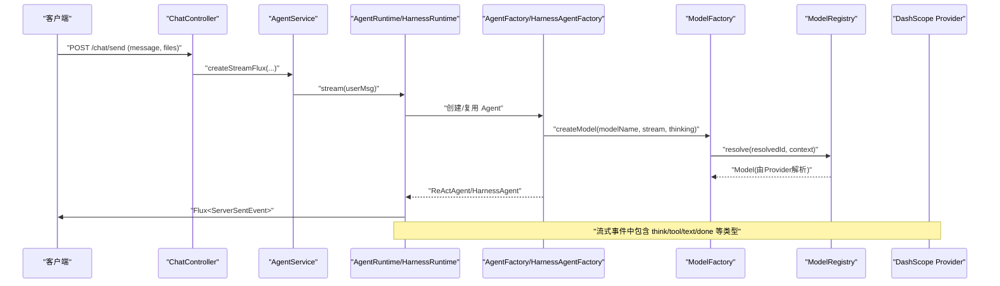
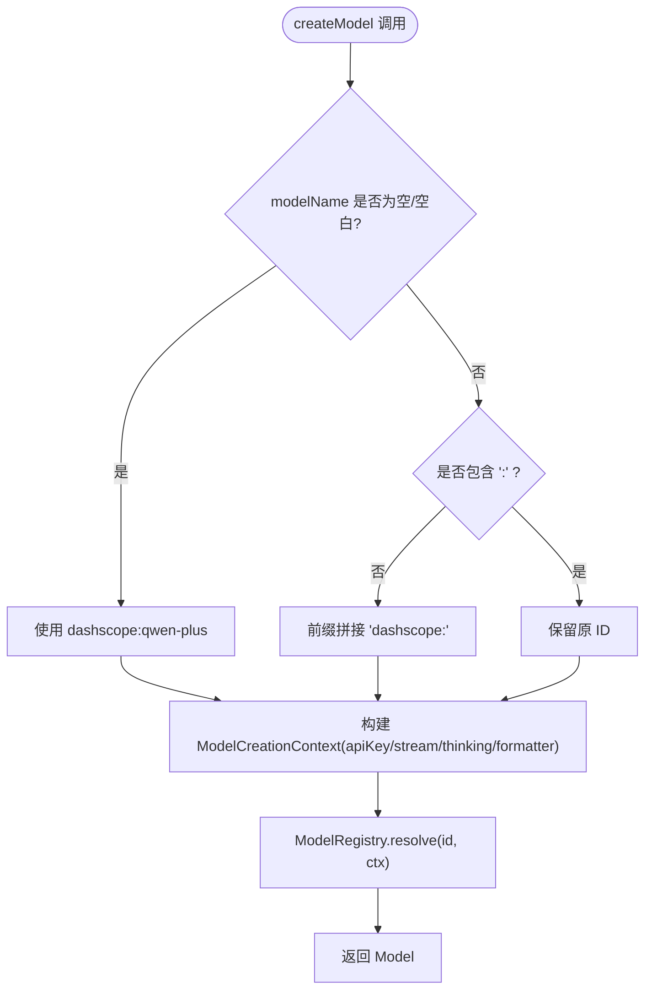
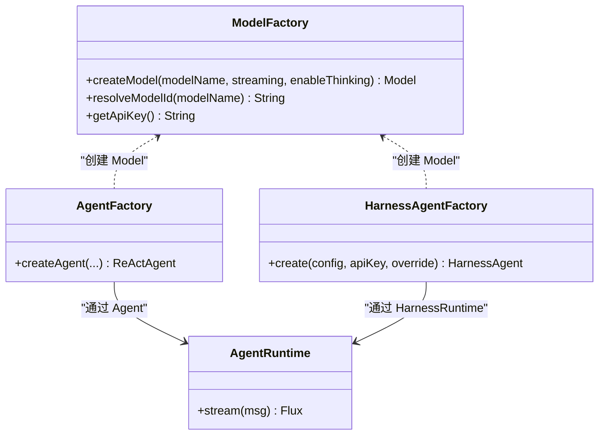

# 模型提供商集成

<cite>
**本文引用的文件列表**
- [ModelFactory.java](file://src/main/java/com/skloda/agentscope/model/ModelFactory.java)
- [application.yml](file://src/main/resources/application.yml)
- [agents.yml](file://src/main/resources/config/agents.yml)
- [AgentFactory.java](file://src/main/java/com/skloda/agentscope/agent/AgentFactory.java)
- [HarnessAgentFactory.java](file://src/main/java/com/skloda/agentscope/harness/HarnessAgentFactory.java)
- [pom.xml](file://pom.xml)
- [AgentRuntime.java](file://src/main/java/com/skloda/agentscope/runtime/AgentRuntime.java)
- [AgentService.java](file://src/main/java/com/skloda/agentscope/service/AgentService.java)
</cite>

## 目录
1. [引言](#引言)
2. [项目结构](#项目结构)
3. [核心组件](#核心组件)
4. [架构总览](#架构总览)
5. [详细组件分析](#详细组件分析)
6. [依赖关系分析](#依赖关系分析)
7. [性能与可调参数](#性能与可调参数)
8. [故障排除指南](#故障排除指南)
9. [结论](#结论)

## 引言
本文件聚焦于本仓库中的“模型提供商集成”设计，围绕以下关键点展开：
- ModelFactory 作为统一模型创建入口点，基于 AgentScope 2.0 的 ModelRegistry 适配器模式。
- DashScope 提供商的配置项、模型ID自动前缀处理（如 qwen-plus）、API 密钥集中管理。
- 流式响应与思维模式的启用机制，及其如何贯穿到运行时与 SSE。
- 多模型支持、重试配置现状与扩展建议、错误处理定位路径、性能优化实践。
- 针对上下文长度、温度等调优参数的最佳实践指导。
- 常见问题诊断与解决方案。

## 项目结构
与本主题相关的代码主要分布在 model、agent、harness、runtime、service 以及 resources 配置中：
- model/ModelFactory：统一通过 ModelRegistry 解析并创建 LLM 模型，屏蔽底层 Provider 细节。
- agent/AgentFactory 与 harness/HarnessAgentFactory：构建 Agent/HarnessAgent 时，均委托 ModelFactory 创建 Model。
- runtime/AgentRuntime：使用 AgentScope 2.0 的 streamEvents 实现原生事件流，对接前端 SSE。
- service/AgentService：会话级路由与流程编排，决定使用哪类运行期（单 Agent、Supervisor 或 Harness）。
- resources/application.yml：集中配置 DashScope API Key、默认模型名、是否流式、是否启用思维模式、思维预算等。
- resources/config/agents.yml：定义各 Agent 的 modelName、streaming、enableThinking 等细粒度开关。
- pom.xml：声明 agentscope-extensions-model-dashscope 依赖，启用 DashScope Provider。

图表来源
- [AgentService.java](file://src/main/java/com/skloda/agentscope/service/AgentService.java)
- [AgentRuntime.java](file://src/main/java/com/skloda/agentscope/runtime/AgentRuntime.java)
- [AgentFactory.java](file://src/main/java/com/skloda/agentscope/agent/AgentFactory.java)
- [HarnessAgentFactory.java](file://src/main/java/com/skloda/agentscope/harness/HarnessAgentFactory.java)
- [ModelFactory.java](file://src/main/java/com/skloda/agentscope/model/ModelFactory.java)

章节来源
- [application.yml:26-43](file://src/main/resources/application.yml#L26-L43)
- [agents.yml:1-200](file://src/main/resources/config/agents.yml#L1-L200)
- [pom.xml:43-48](file://pom.xml#L43-L48)

## 核心组件
- ModelFactory：统一的模型创建入口点。负责：
  - 自动将裸模型名补全为带 provider 前缀的 ID（例如 qwen-plus → dashscope:qwen-plus），缺失提供者时回退至安全默认值。
  - 组装 ModelCreationContext：apiKey（来自应用配置或环境变量 DASHSCOPE_API_KEY）、是否启用 streaming、是否启用 thinking、注册 DashScopeChatFormatter。
  - 调用 ModelRegistry.resolve(resolvedId, context) 得到 Model 实例。
- AgentFactory / HarnessAgentFactory：在构建 ReActAgent 或 HarnessAgent 时，均通过 ModelFactory.createModel(modelName, streaming, enableThinking)。
- AgentRuntime：基于 AgentScope 2.0 的 ReActAgent.streamEvents() 返回事件流，统一映射为 SSE JSON，合并外部事件（EventSink）后向客户端推送。
- AgentService：负责会话维度的路由（普通单 Agent、Supervisor/Router、Harness），并把流式结果串联进工作流记录与历史记录。
- 配置中心 application.yml：集中配置 DashScope provider、默认模型名、API Key、流式开关、思维开关与思考预算；agents.yml 提供每 Agent 维度覆盖。

章节来源
- [ModelFactory.java:21-95](file://src/main/java/com/skloda/agentscope/model/ModelFactory.java#L21-L95)
- [AgentFactory.java:131-143](file://src/main/java/com/skloda/agentscope/agent/AgentFactory.java#L131-L143)
- [HarnessAgentFactory.java:68-72](file://src/main/java/com/skloda/agentscope/harness/HarnessAgentFactory.java#L68-L72)
- [AgentRuntime.java:67-142](file://src/main/java/com/skloda/agentscope/runtime/AgentRuntime.java#L67-L142)
- [AgentService.java:140-176](file://src/main/java/com/skloda/agentscope/service/AgentService.java#L140-L176)
- [application.yml:26-43](file://src/main/resources/application.yml#L26-L43)

## 架构总览
下面的时序图展示了从 HTTP 请求到 Model 创建的完整链路，包括 Stream 启动和事件输出。

图表来源
- [AgentService.java:140-176](file://src/main/java/com/skloda/agentscope/service/AgentService.java#L140-L176)
- [AgentRuntime.java:67-142](file://src/main/java/com/skloda/agentscope/runtime/AgentRuntime.java#L67-L142)
- [ModelFactory.java:42-55](file://src/main/java/com/skloda/agentscope/model/ModelFactory.java#L42-L55)

## 详细组件分析

### 统一模型工厂 ModelFactory
ModelFactory 是模型适配器的核心：
- 模型ID解析策略：
  - 空/空白模型名会回退为 dashscope:qwen-plus，保证最小可用。
  - 不含冒号时使用 dashscope: 前缀，避免 deepseek-v4-flash-0731 等无法匹配提供方命名模式的场景。
- 上下文装配：
  - apiKey：优先取配置项 agentscope.model.dashscope.api-key，否则读环境变量 DASHSCOPE_API_KEY；若未设置则返回 null，交由 Provider 自身读取环境变量。
  - streaming、enableThinking：透传到 ModelCreationContext。
  - 组件：注入 DashScopeChatFormatter，用于消息格式化。
- 模型解析：
  - 通过 ModelRegistry.resolve(resolvedId, context) 获得具体 Model，Provider 注册由 Java SPI 自动完成。

图表来源
- [ModelFactory.java:42-81](file://src/main/java/com/skloda/agentscope/model/ModelFactory.java#L42-L81)

章节来源
- [ModelFactory.java:21-95](file://src/main/java/com/skloda/agentscope/model/ModelFactory.java#L21-L95)
- [agents.yml:1-200](file://src/main/resources/config/agents.yml#L1-L200)
- [application.yml:26-43](file://src/main/resources/application.yml#L26-L43)

### DashScope 提供商配置与密钥管理
- 配置位置：
  - application.yml 的 agentscope.model.dashscope.* 定义了：
    - api-key：默认来自 ${DASHSCOPE_API_KEY}，可被应用属性覆盖。
    - model-name：当前默认 deepseek-v4-flash-0731。
    - stream：true 表示全局默认开启流式。
    - enable-thinking：true 表示全局默认开启思维模式。
    - thinking-budget：思维预算 token 数（如 1024）。
- 密钥优先级（ModelFactory 内部逻辑）：
  - 应用配置 > 环境变量 DASHSCOPE_API_KEY > Provider 自读环境变量（当 ModelFactory 返回 null 时）。
- 多模型支持：
  - 通过 agents.yml 的 modelName 字段指定不同 Agent 使用不同模型名称（可含 provider 前缀或裸名），由 ModelFactory 统一解析与注入。

章节来源
- [application.yml:26-43](file://src/main/resources/application.yml#L26-L43)
- [agents.yml:1-200](file://src/main/resources/config/agents.yml#L1-L200)
- [ModelFactory.java:28-30](file://src/main/java/com/skloda/agentscope/model/ModelFactory.java#L28-L30)
- [ModelFactory.java:83-94](file://src/main/java/com/skloda/agentscope/model/ModelFactory.java#L83-L94)

### 流式响应与思维模式机制
- 流式响应：
  - Application.yml 默认 agentscope.model.dashscope.stream=true。
  - 每个 Agent 可在 agents.yml 中单独设置 streaming=true 以启用该 Agent 的流式输出。
  - 运行时通过 AgentScope 2.0 的 ReActAgent.streamEvents() 产生事件流，由 AgentRuntime 转换为 SSE 逐条发送，提升交互实时性。
- 思维模式：
  - application.yml 中 agentscope.model.dashscope.enable-thinking=true 作为全局默认；thinking-budget=1024 控制思考开销。
  - 各 Agent 可在 agents.yml 中覆盖 enableThinking，配合 ModelFactory.createModel(..., enableThinking) 启用。
  - 典型事件流包括 thinking/think_start/think_end 等事件（由 AgentScope 事件模型驱动），并在事件映射过程中由 AgentEventMapper 转换为前端可用的 SSE 消息。

章节来源
- [application.yml:37-43](file://src/main/resources/application.yml#L37-L43)
- [agents.yml:1-200](file://src/main/resources/config/agents.yml#L1-L200)
- [AgentFactory.java:131-143](file://src/main/java/com/skloda/agentscope/agent/AgentFactory.java#L131-L143)
- [HarnessAgentFactory.java:68-72](file://src/main/java/com/skloda/agentscope/harness/HarnessAgentFactory.java#L68-L72)
- [AgentRuntime.java:67-142](file://src/main/java/com/skloda/agentscope/runtime/AgentRuntime.java#L67-L142)

### 多模型支持与扩展
- 多模型选择策略：
  - 默认模型：application.yml 中 dashscope.model-name（本仓库默认为 deepseek-v4-flash-0731）。
  - Agent 级别覆盖：agents.yml 中每个 Agent 自定义 modelName（支持裸名或带前缀）。
  - 通过 ModelFactory 自动加前缀规则与 ModelRegistry 解析，使同一应用可灵活切换后端模型。
- 新增 Provider（概念说明）：
  - 在 ModelFactory 中增强 resolveModelId 的前缀识别与默认 Provider 逻辑，即可扩展到其他模型厂商；当前已内置 DashScope 能力并通过 SPI 自动注册。

章节来源
- [application.yml:32-38](file://src/main/resources/application.yml#L32-L38)
- [agents.yml:1-200](file://src/main/resources/config/agents.yml#L1-L200)
- [ModelFactory.java:66-81](file://src/main/java/com/skloda/agentscope/model/ModelFactory.java#L66-L81)

### 重试机制与错误处理
- 当前状态：
  - 仓库中未发现对 ModelFactory 或下游模型调用层的通用重试封装。若需幂等接口上的重试（如网络抖动导致临时失败），建议在调用处引入响应式重试（例如 Reactor retry 相关算子），并根据业务语义设定最大重试次数与退避策略。
- 错误传播：
  - AgentRuntime 对 stream 事件的处理会记录错误并关闭流（doOnError 回调），便于上层感知异常。
  - 对长时间挂起的流或中断场景，运行时会在新的请求开始前提清理“悬垂的待执行工具调用”，避免脏数据污染对话历史。

章节来源
- [AgentRuntime.java:128-142](file://src/main/java/com/skloda/agentscope/runtime/AgentRuntime.java#L128-L142)
- [AgentRuntime.java:82-92](file://src/main/java/com/skloda/agentscope/runtime/AgentRuntime.java#L82-L92)

## 依赖关系分析
- Maven 依赖：
  - agentscope-spring-boot-starter、agentscope-core、agentscope-harness 构成基础能力。
  - agentscope-extensions-model-dashscope 引入 DashScope 模型 Provider，使其可被 ModelRegistry 识别与解析。
- 运行时耦合：
  - AgentFactory / HarnessAgentFactory 强依赖 ModelFactory，从而将模型创建解耦为单一职责。
  - AgentService 根据 Agent 类型与配置路由到不同的运行器，但全部经由 AgentRuntime 输出统一的事件格式（SSE）。

图表来源
- [ModelFactory.java:42-81](file://src/main/java/com/skloda/agentscope/model/ModelFactory.java#L42-L81)
- [AgentFactory.java:131-143](file://src/main/java/com/skloda/agentscope/agent/AgentFactory.java#L131-L143)
- [HarnessAgentFactory.java:68-72](file://src/main/java/com/skloda/agentscope/harness/HarnessAgentFactory.java#L68-L72)
- [AgentRuntime.java:67-142](file://src/main/java/com/skloda/agentscope/runtime/AgentRuntime.java#L67-L142)

章节来源
- [pom.xml:43-48](file://pom.xml#L43-L48)

## 性能与可调参数
- 流式响应（stream）：
  - 全局默认：application.yml 的 agentscope.model.dashscope.stream=true。
  - Agent 维度：agents.yml 的 streaming=true 可在每个 Agent 上开启。
  - 收益：降低首字延迟，改善交互体验；适合长文本生成、思考过程展示。
- 思维模式（enableThinking / thinking-budget）：
  - 全局默认开启，thinking-budget 可按任务复杂度和成本权衡调整。
  - 适合需要更深推理的场景；过大会增加耗时与成本。
- 上下文长度与消息量：
  - 建议在系统提示词与历史消息间保持平衡：精简 System Prompt，合理使用压缩/轮转策略，以避免超出模型上下文限制并减少不必要的计算。
- 采样参数（temperature/top_p 等）：
  - temperature：越低越稳定一致，越高越发散有创意。根据任务类型调参，如写作创意可适当提高，事实回答适当降低。
  - top_p：与 temperature 共同影响多样性，通常与 temperature 协同调优。
- 其他建议：
  - 对于批量化或对延迟敏感的场景，可结合缓存、批量请求与合适的超时重试，以提升吞吐与稳定性。

[本节为通用性能指导，不直接引用具体代码文件]

## 故障排除指南
- 连接失败 / 鉴权失败：
  - 检查环境变量 DASHSCOPE_API_KEY 是否正确设置，或 application.yml 中 agentscope.model.dashscope.api-key 是否覆盖生效。
  - 确认 ModelFactory 的 getApiKey 获取路径：先应用配置、再环境变量。
- 模型解析错误：
  - 若使用无前缀的模型名（如 deepseek-v4-flash-0731），确保其会被自动加上 dashscope: 前缀；必要时显式传入带前缀的 ID。
  - 检查 agents.yml 中 modelName 是否填写正确。
- 流式输出挂起/未结束：
  - 检查 AgentRuntime 是否在流结束时完成 EventSink，避免前端“只能聊一次”的状态。
  - 若出现“待执行工具调用残留”导致后续会话被污染，确认新请求开始时的清理逻辑生效。
- 调试日志与观察：
  - 开启 io.agentscope 级别日志，观察 ModelRegistry 解析与流事件输出。
  - 前端可通过 SSE 事件类型（如 thinking、tool_start、text、done、pending_approval）辅助排查问题阶段。

章节来源
- [application.yml:32-43](file://src/main/resources/application.yml#L32-L43)
- [ModelFactory.java:83-94](file://src/main/java/com/skloda/agentscope/model/ModelFactory.java#L83-L94)
- [ModelFactory.java:73-81](file://src/main/java/com/skloda/agentscope/model/ModelFactory.java#L73-L81)
- [AgentRuntime.java:82-92](file://src/main/java/com/skloda/agentscope/runtime/AgentRuntime.java#L82-L92)
- [AgentRuntime.java:128-142](file://src/main/java/com/skloda/agentscope/runtime/AgentRuntime.java#L128-L142)

## 结论
本项目通过 ModelFactory 实现对 AgentScope 2.0 的 ModelRegistry 的统一适配，将模型创建、Provider 前缀处理、API Key 管理与流式/思维模式配置集中在一个高内聚的组件内。配合 application.yml 的集中配置与 agents.yml 的细粒度覆盖，既能满足多模型、多 Agent 的灵活需求，又保持了运行时代码的低耦合与一致性。对于生产环境，建议在此基础上补充统一的超时与重试策略、完善监控埋点，并结合业务特性持续优化上下文长度与采样参数，以达到更好的响应速度、成本控制与用户体验。