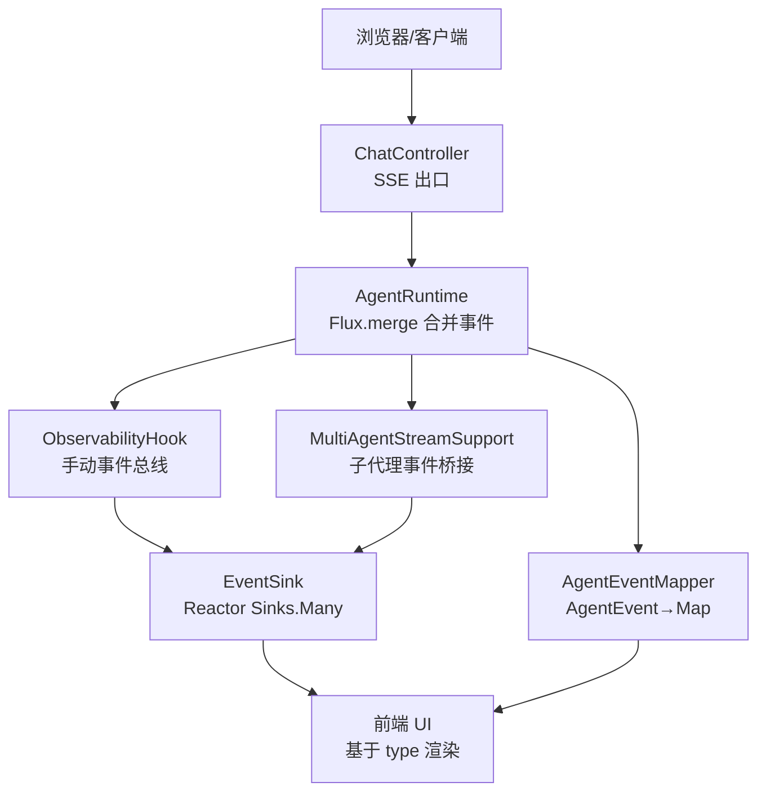
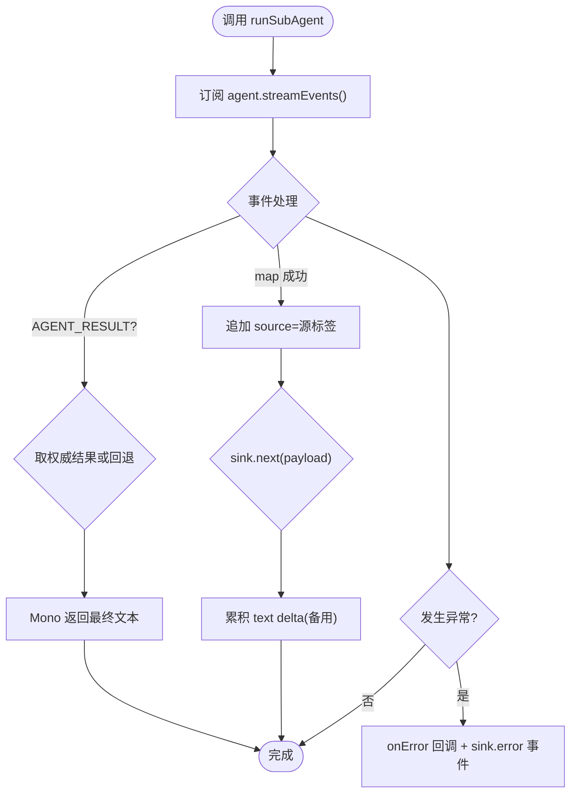
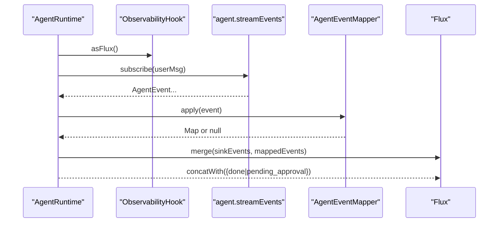
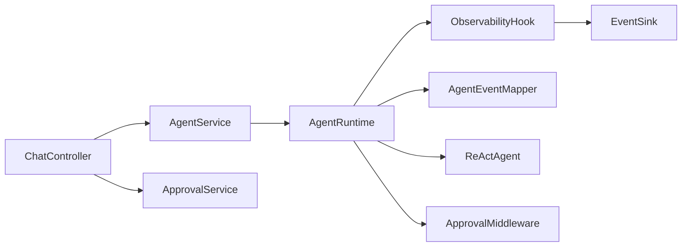

# 事件处理系统

<cite>
**本文引用的文件**
- [MultiAgentStreamSupport.java](file://src/main/java/com/skloda/agentscope/runtime/MultiAgentStreamSupport.java)
- [ObservabilityHook.java](file://src/main/java/com/skloda/agentscope/hook/ObservabilityHook.java)
- [AgentEventMapper.java](file://src/main/java/com/skloda/agentscope/runtime/AgentEventMapper.java)
- [ChatEvent.java](file://src/main/java/com/skloda/agentscope/model/ChatEvent.java)
- [StreamingAgentRuntime.java](file://src/main/java/com/skloda/agentscope/runtime/StreamingAgentRuntime.java)
- [AgentRuntime.java](file://src/main/java/com/skloda/agentscope/runtime/AgentRuntime.java)
- [EventSink.java](file://src/main/java/com/skloda/agentscope/runtime/EventSink.java)
- [ChatController.java](file://src/main/java/com/skloda/agentscope/controller/ChatController.java)
- [ApprovalMiddleware.java](file://src/main/java/com/skloda/agentscope/middleware/ApprovalMiddleware.java)
- [ApprovalService.java](file://src/main/java/com/skloda/agentscope/service/ApprovalService.java)
- [SessionManagerService.java](file://src/main/java/com/skloda/agentscope/service/SessionManagerService.java)
- [MetricsCollectorMiddleware.java](file://src/main/java/com/skloda/agentscope/middleware/MetricsCollectorMiddleware.java)
</cite>

## 目录
1. [简介](#简介)
2. [项目结构](#项目结构)
3. [核心组件](#核心组件)
4. [架构总览](#架构总览)
5. [详细组件分析](#详细组件分析)
6. [依赖关系分析](#依赖关系分析)
7. [性能考量](#性能考量)
8. [故障排查指南](#故障排查指南)
9. [结论](#结论)

## 简介
本技术文档围绕事件处理系统展开，重点解析以下能力：
- MultiAgentStreamSupport 的事件分发机制：流式事件转发、事件映射、源标签标注。
- ObservabilityHook 可观测性框架：手动聚合多代理事件。
- AgentEventMapper 事件转换机制：统一的 SSE 协议载荷（Map）。
- ChatEvent 事件模型：SSE 完成与错误事件。
- 组件间通信协议：SSE 流式传输、事件聚合、错误传播。
- 调试、监控与治理：高性能处理模式与企业级方案建议。

## 项目结构
事件处理系统位于 runtime、hook、controller、service、middleware 等包中，形成清晰的“请求入口 → 运行时 → 事件桥接 → 前端 SSE”通道。下图展示了关键文件之间的职责划分和交互。



图示来源
- [ChatController.java:122-153](file://src/main/java/com/skloda/agentscope/controller/ChatController.java#L122-L153)
- [AgentRuntime.java:79-142](file://src/main/java/com/skloda/agentscope/runtime/AgentRuntime.java#L79-L142)
- [ObservabilityHook.java:30-35](file://src/main/java/com/skloda/agentscope/hook/ObservabilityHook.java#L30-L35)
- [EventSink.java:19-33](file://src/main/java/com/skloda/agentscope/runtime/EventSink.java#L19-L33)
- [AgentEventMapper.java:64-105](file://src/main/java/com/skloda/agentscope/runtime/AgentEventMapper.java#L64-L105)
- [MultiAgentStreamSupport.java:74-118](file://src/main/java/com/skloda/agentscope/runtime/MultiAgentStreamSupport.java#L74-L118)

章节来源
- [ChatController.java:122-153](file://src/main/java/com/skloda/agentscope/controller/ChatController.java#L122-L153)
- [AgentRuntime.java:79-142](file://src/main/java/com/skloda/agentscope/runtime/AgentRuntime.java#L79-L142)
- [StreamingAgentRuntime.java:12-20](file://src/main/java/com/skloda/agentscope/runtime/StreamingAgentRuntime.java#L12-L20)

## 核心组件
- MultiAgentStreamSupport：统一抽取文本、运行子代理并桥接其生命周期事件至 SSE Sink；为每个转发事件附加 source 标签以区分来源。
- ObservabilityHook：封装 EventSink 作为多代理事件总线，暴露 typed emit* 方法供管线/路由/交接/循环/图状态/圆桌/任务等场景使用。
- AgentEventMapper：将 AgentScope 原生 30+ AgentEvent 转换为前端可读的 Map 类型事件载荷，对不需要展示的空事件返回 null 并丢弃。
- ChatEvent：定义后端统一返回的 SSE 结束事件（done）与错误事件（error）。
- AgentRuntime：组合 agent.streamEvents 与 EventSink 产生的两类事件，通过 Flux.merge 合并成单一流；在结束时补充 done/pending_approval。
- EventSink：基于 Reactor Sinks.Many 的多播事件总线，提供强类型常量与便捷 emitXxx 接口。
- ChatController：HTTP 请求入口，将运行时的 Map 事件序列化为 ServerSentEvent<String> 推送到前端；负责 takeUntil(done)、错误兜底。

章节来源
- [MultiAgentStreamSupport.java:17-38](file://src/main/java/com/skloda/agentscope/runtime/MultiAgentStreamSupport.java#L17-L38)
- [ObservabilityHook.java:11-35](file://src/main/java/com/skloda/agentscope/hook/ObservabilityHook.java#L11-L35)
- [AgentEventMapper.java:39-105](file://src/main/java/com/skloda/agentscope/runtime/AgentEventMapper.java#L39-L105)
- [ChatEvent.java:6-39](file://src/main/java/com/skloda/agentscope/model/ChatEvent.java#L6-L39)
- [AgentRuntime.java:26-45](file://src/main/java/com/skloda/agentscope/runtime/AgentRuntime.java#L26-L45)
- [EventSink.java:11-62](file://src/main/java/com/skloda/agentscope/runtime/EventSink.java#L11-L62)
- [ChatController.java:44-153](file://src/main/java/com/skloda/agentscope/controller/ChatController.java#L44-L153)

## 架构总览
整体流程遵循“请求进入 → 创建流 → 自动/手动事件汇聚 → 序列化输出 → 前端消费”的模式，并通过中间件扩展审计/指标/审批等横切关注点。

```mermaid
sequenceDiagram
    participant C as "客户端"
    participant Ctrl as "ChatController"
    participant RT as "AgentRuntime"
    participant Hk as "ObservabilityHook"
    participant SN as "EventSink"
    participant MR as "AgentEventMapper"
    participant FE as "前端"

    C->>Ctrl: POST /chat/send {message}
    Ctrl->>RT: stream(userMsg)
    RT->>RT: Flux.merge(hook.asFlux(), agent.streamEvents)
    RT->>MR: map(AgentEvent)
    Hk->>SN: emit(xxx)
    MR-->>RT: Map{type,...}
    SN-->>RT: Map{type,...}
    RT-->>Ctrl: Flux<Map>
    Ctrl-->>FE: SSE {data: stringified Map}
    Note over Ctrl,FE: 遇 'done' 停止; 遇 'pending_approval' 等待审批
```

图示来源
- [ChatController.java:122-153](file://src/main/java/com/skloda/agentscope/controller/ChatController.java#L122-L153)
- [AgentRuntime.java:94-128](file://src/main/java/com/skloda/agentscope/runtime/AgentRuntime.java#L94-L128)
- [ObservabilityHook.java:30-35](file://src/main/java/com/skloda/agentscope/hook/ObservabilityHook.java#L30-L35)
- [EventSink.java:19-33](file://src/main/java/com/skloda/agentscope/runtime/EventSink.java#L19-L33)
- [AgentEventMapper.java:64-105](file://src/main/java/com/skloda/agentscope/runtime/AgentEventMapper.java#L64-L105)

## 详细组件分析

### 组件A：MultiAgentStreamSupport（子代理事件桥接器）
- 职责：为子代理调用提供同步链式编排（Mono<String> 返回最终文本），同时将生命周期事件（thinking/tool/text/delta/result）以 Map 形式推入外部 FluxSink 并打 source 标签。
- 文本还原策略：优先从 AGENT_RESULT 提取 Msg 文本；否则回退到累积 text delta。
- 错误传播：捕获异常，回调 onError，同时向 sink 发出一个 error 类型的事件以保证前端感知失败。



图示来源
- [MultiAgentStreamSupport.java:74-118](file://src/main/java/com/skloda/agentscope/runtime/MultiAgentStreamSupport.java#L74-L118)

章节来源
- [MultiAgentStreamSupport.java:43-118](file://src/main/java/com/skloda/agentscope/runtime/MultiAgentStreamSupport.java#L43-L118)

### 组件B：ObservabilityHook（可观测性桥）
- 桥接到 EventSink，对外暴露 typed emit* 接口用于发布管线、路由、交接、循环、图状态、圆桌与任务等事件。
- addConsumer 可将所有事件转交给下游（便于日志、指标、告警等）。

章节来源
- [ObservabilityHook.java:11-67](file://src/main/java/com/skloda/agentscope/hook/ObservabilityHook.java#L11-L67)

### 组件C：AgentEventMapper（事件转换器）
- 将 30+ 种 AgentEventType 转换为前端友好 JSON（Map），对无需展示的类型（如 block 边界）返回 null 并被丢弃。
- 对 tool_start 增加 MCP 溯源字段（isMcp/mcpName）由上层补充，Mapper 本身保持纯函数无状态。
- 异常保护：映射出错时产出统一的 error payload，避免抛出中断上游流。

章节来源
- [AgentEventMapper.java:39-105](file://src/main/java/com/skloda/agentscope/runtime/AgentEventMapper.java#L39-L105)

### 组件D：ChatEvent（统一事件模型）
- done：表示流结束；error：包含人类可读的错误消息。用于后端统一收尾与异常提示。

章节来源
- [ChatEvent.java:6-39](file://src/main/java/com/skloda/agentscope/model/ChatEvent.java#L6-L39)

### 组件E：AgentRuntime（运行时聚合器）
- 合并两类事件流：来自 EventSink 的手动事件与来自 agent.streamEvents 的自动事件。
- 在完成后追加 pending_approval 或 done 事件；取消/完成时执行 close 释放资源。
- Approval Resume：按用户是否传入拒绝消息决定 resume 输入，继续产生一致的生命周期事件。



图示来源
- [AgentRuntime.java:79-168](file://src/main/java/com/skloda/agentscope/runtime/AgentRuntime.java#L79-L168)

章节来源
- [AgentRuntime.java:67-183](file://src/main/java/com/skloda/agentscope/runtime/AgentRuntime.java#L67-L183)

### 组件F：EventSink（事件总线）
- 基于 Reactor Sinks.Many.multicast 的高性能并发广播。
- 提供常量与便捷方法，保证事件命名一致、数据完整，并带 timestamp 辅助排查。

章节来源
- [EventSink.java:11-152](file://src/main/java/com/skloda/agentscope/runtime/EventSink.java#L11-L152)

### 组件G：ChatController（SSE 网关）
- 接收请求后调用服务构建 Flux<Map>，并以 ServerSentEvent<String> 序列化推送给前端。
- 通过 takeUntil(isDoneEvent) 精确终止流；遇到未处理的异常时回退为统一的 error+SSE done。

章节来源
- [ChatController.java:44-189](file://src/main/java/com/skloda/agentscope/controller/ChatController.java#L44-L189)

## 依赖关系分析
- ChatController 依赖 AgentService/SessionManagerService 建立会话与运行时；运行时依赖 ObservabilityHook 与 ReActAgent；Hook 依赖 EventSink；运行时通过 AgentEventMapper 转换事件；MultiAgentStreamSupport 通过 FluxSink 注入外部事件。
- 审批流：ApprovalMiddleware 在 onActing 阶段拦截敏感工具调用并设置 pending；AgentRuntime 检测并下发 pending_approval；ApprovalService 暂存待审实例并提供清理。



图示来源
- [ChatController.java:54-69](file://src/main/java/com/skloda/agentscope/controller/ChatController.java#L54-L69)
- [AgentRuntime.java:33-65](file://src/main/java/com/skloda/agentscope/runtime/AgentRuntime.java#L33-L65)
- [ApprovalMiddleware.java:42-124](file://src/main/java/com/skloda/agentscope/middleware/ApprovalMiddleware.java#L42-L124)
- [ApprovalService.java:17-76](file://src/main/java/com/skloda/agentscope/service/ApprovalService.java#L17-L76)

章节来源
- [ApprovalMiddleware.java:42-124](file://src/main/java/com/skloda/agentscope/middleware/ApprovalMiddleware.java#L42-L124)
- [ApprovalService.java:17-76](file://src/main/java/com/skloda/agentscope/service/ApprovalService.java#L17-L76)

## 性能考量
- 流式聚合：使用 Flux.merge 合并非阻塞事件流，减少内存拷贝与上下文切换开销。
- 丢弃空事件：AgentEventMapper 对仅用于协调的块边界事件返回 null，降低前端渲染负担。
- 背压缓冲：EventSink 使用 onBackpressureBuffer，防止快速生产慢消费时丢事件或反压崩溃。
- 原子文本归因：在 MultiAgentStreamSupport 中以 AtomicReference 记录权威结果和累积文本，避免重复计算。
- 中间件指标：MetricsCollectorMiddleware 采集工具耗时、token 用量、错误率等，支持成本估算与全局统计，便于优化瓶颈。

建议实践
- 尽量保持 Mapper 无状态与幂等，确保高吞吐。
- 为复杂子流程（如 pipeline/debate）拆分步骤，配合 EventSink typed emits，降低单步负载。
- 对大响应流增加节流/分页，避免前端卡顿。
- 使用 SessionManagerService 管理长会话与状态存储迁移，结合超时清理与冷热分离。

章节来源
- [AgentRuntime.java:94-142](file://src/main/java/com/skloda/agentscope/runtime/AgentRuntime.java#L94-L142)
- [EventSink.java:19-33](file://src/main/java/com/skloda/agentscope/runtime/EventSink.java#L19-L33)
- [MultiAgentStreamSupport.java:74-118](file://src/main/java/com/skloda/agentscope/runtime/MultiAgentStreamSupport.java#L74-L118)
- [MetricsCollectorMiddleware.java:31-201](file://src/main/java/com/skloda/agentscope/middleware/MetricsCollectorMiddleware.java#L31-L201)
- [SessionManagerService.java:75-145](file://src/main/java/com/skloda/agentscope/service/SessionManagerService.java#L75-L145)

## 故障排查指南
常见问题与定位路径：
- 流不结束
  - 现象：前端一直 isStreaming，无法再次发送。
  - 排查：检查 AgentRuntime 是否在 doFinally 中 complete EventSink；确认 chat 控制器是否正确 takeUntil('done')。
- 丢失子代理事件或来源不明
  - 现象：多个子代理事件混在一起难以区分。
  - 排查：确保 MultiAgentStreamSupport.runSubAgent 传入 sourceLabel，并查看每条事件是否携带 "source"。
- 审批卡住
  - 现象：出现 pending_approval 但无人工点击审批，后续无动作。
  - 排查：确认 ApprovalService 是否登记；是否被调度任务过期清理；审批 API 是否正常调通。
- 前端收到错误或空白
  - 现象：一次性错误事件然后结束。
  - 排查：检查 ChatController 的 onErrorResume 及内部序列化；观察 AgentRuntime/streamEvents 是否有异常并正确传播。
- 指标缺失或不准确
  - 现象：工具耗时、token 统计为空或偏差。
  - 排查：检查 MetricsCollectorMiddleware 是否在 onModelCall/onActing 中正确计数；确认全局锁 updateMin/updateMax 的 CAS 逻辑。

参考实现路径
- [AgentRuntime.java:125-142](file://src/main/java/com/skloda/agentscope/runtime/AgentRuntime.java#L125-L142)
- [MultiAgentStreamSupport.java:74-118](file://src/main/java/com/skloda/agentscope/runtime/MultiAgentStreamSupport.java#L74-L118)
- [ApprovalService.java:59-76](file://src/main/java/com/skloda/agentscope/service/ApprovalService.java#L59-L76)
- [ChatController.java:147-152](file://src/main/java/com/skloda/agentscope/controller/ChatController.java#L147-L152)
- [MetricsCollectorMiddleware.java:164-201](file://src/main/java/com/skloda/agentscope/middleware/MetricsCollectorMiddleware.java#L164-L201)

章节来源
- [AgentRuntime.java:125-142](file://src/main/java/com/skloda/agentscope/runtime/AgentRuntime.java#L125-L142)
- [ApprovalService.java:59-76](file://src/main/java/com/skloda/agentscope/service/ApprovalService.java#L59-L76)
- [ChatController.java:147-152](file://src/main/java/com/skloda/agentscope/controller/ChatController.java#L147-L152)
- [MetricsCollectorMiddleware.java:164-201](file://src/main/java/com/skloda/agentscope/middleware/MetricsCollectorMiddleware.java#L164-L201)

## 结论
该系统以 Reactor 响应式流为核心，将自动生命周期事件与人工管线事件在统一通道中合并，并通过类型化映射与源标签标注，实现了前后端解耦的高内聚低耦合事件协议。通过中间件体系与可扩展的观察者钩子，系统在可观测性、安全性、性能方面均具备良好扩展面。建议在企业环境中结合审计、限流、采样与分布式追踪完善治理闭环，确保大规模多代理协作的稳定性与可维护性。