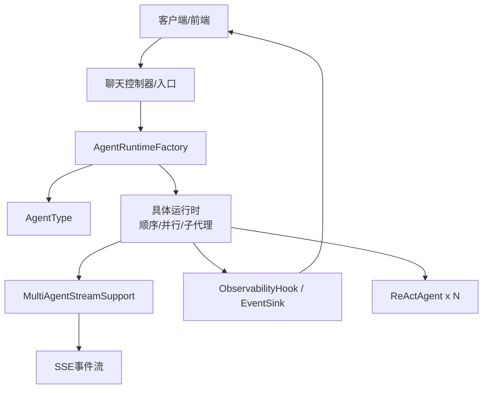
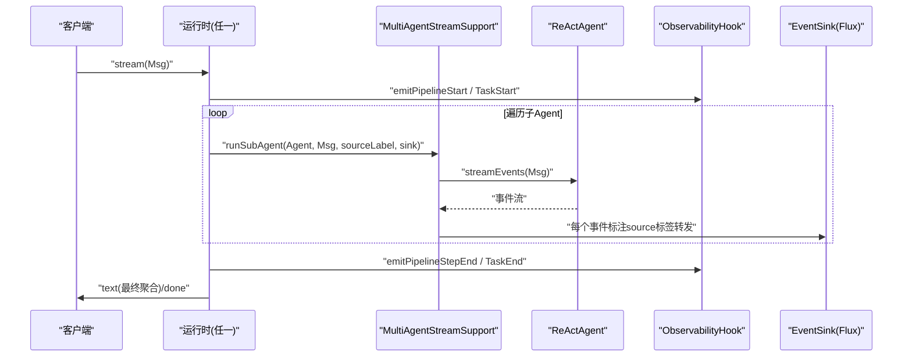
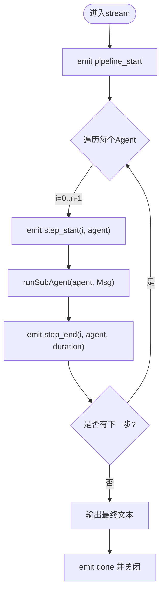
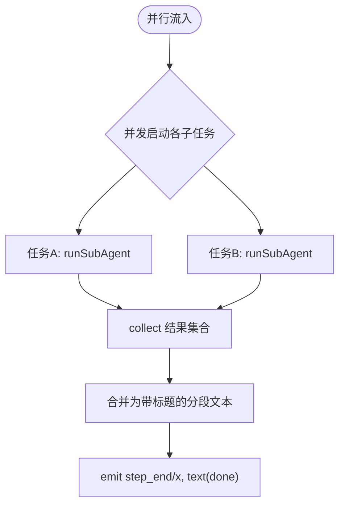
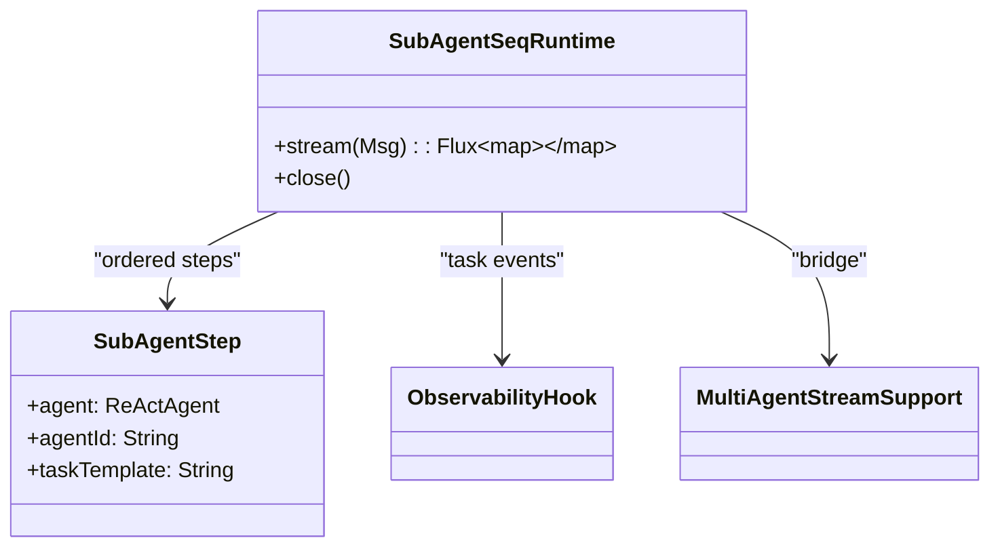
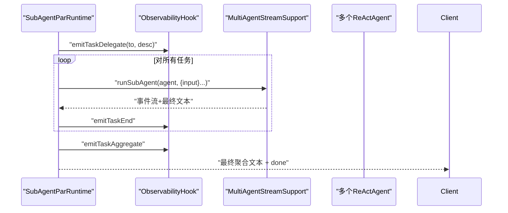
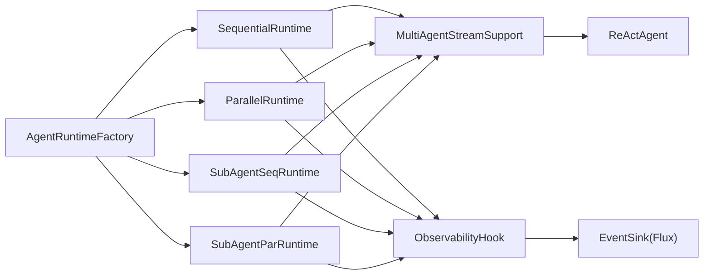

# 协作模式详解

<cite>
**本文引用的文件列表**
- [SequentialRuntime.java](file://src/main/java/com/skloda/agentscope/runtime/SequentialRuntime.java)
- [ParallelRuntime.java](file://src/main/java/com/skloda/agentscope/runtime/ParallelRuntime.java)
- [SubAgentSeqRuntime.java](file://src/main/java/com/skloda/agentscope/runtime/SubAgentSeqRuntime.java)
- [SubAgentParRuntime.java](file://src/main/java/com/skloda/agentscope/runtime/SubAgentParRuntime.java)
- [MultiAgentStreamSupport.java](file://src/main/java/com/skloda/agentscope/runtime/MultiAgentStreamSupport.java)
- [ObservabilityHook.java](file://src/main/java/com/skloda/agentscope/hook/ObservabilityHook.java)
- [EventSink.java](file://src/main/java/com/skloda/agentscope/runtime/EventSink.java)
- [AgentType.java](file://src/main/java/com/skloda/agentscope/agent/AgentType.java)
- [AgentRuntimeFactory.java](file://src/main/java/com/skloda/agentscope/runtime/AgentRuntimeFactory.java)
- [agents.yml](file://src/main/resources/config/agents.yml)
- [AGENTS.md](file://AGENTS.md)
- [SequentialRuntimeTest.java](file://src/test/java/com/skloda/agentscope/runtime/SequentialRuntimeTest.java)
- [ParallelRuntimeTest.java](file://src/test/java/com/skloda/agentscope/runtime/ParallelRuntimeTest.java)
</cite>

## 目录
1. 简介
2. 项目结构
3. 核心组件
4. 架构总览
5. 详细组件分析
6. 依赖分析
7. 性能考量
8. 故障排查指南
9. 结论
10. 附录

## 简介
本技术文档聚焦于本项目中多智能体协作模式的实现与使用，覆盖以下四种运行时模式：
- 顺序流水线（Sequential Runtime）
- 并行流水线（Parallel Runtime）
- 顺序子代理（SubAgent Seq Runtime）
- 并行子代理（SubAgent Par Runtime）

这些模式通过统一的事件驱动与流式输出，将多个 Agent 的“思考、工具调用、文本增量、结果”等事件实时广播至前端调试面板，并以结构化方式完成编排、聚合与收尾。它们可被配置化地组合到单个 Agent 中，便于在对话式应用中灵活编排复杂业务流程。

## 项目结构
与协作模式密切相关的代码位于 runtime 包与 hook 包内：
- 运行时（runtime）：实现各协作流程的编排（顺序/并行/子代理），并桥接 AgentScope 的流式事件到统一的 Flux 通道。
- 可观测性（hook）：暴露事件发射接口并接入底层 EventSink，用于调试面板和链路追踪。
- 工厂与类型：通过 AgentType 枚举与 AgentRuntimeFactory 按配置构造对应运行时。
- 配置：agents.yml 中声明不同类型的 agentId 以启用不同协作模式。

图表来源
- [AgentRuntimeFactory.java:41-126](file://src/main/java/com/skloda/agentscope/runtime/AgentRuntimeFactory.java#L41-L126)
- [SequentialRuntime.java:15-99](file://src/main/java/com/skloda/agentscope/runtime/SequentialRuntime.java#L15-L99)
- [ParallelRuntime.java:16-106](file://src/main/java/com/skloda/agentscope/runtime/ParallelRuntime.java#L16-L106)
- [SubAgentSeqRuntime.java:15-106](file://src/main/java/com/skloda/agentscope/runtime/SubAgentSeqRuntime.java#L15-L106)
- [SubAgentParRuntime.java:15-104](file://src/main/java/com/skloda/agentscope/runtime/SubAgentParRuntime.java#L15-L104)
- [MultiAgentStreamSupport.java:17-119](file://src/main/java/com/skloda/agentscope/runtime/MultiAgentStreamSupport.java#L17-L119)
- [ObservabilityHook.java:11-67](file://src/main/java/com/skloda/agentscope/hook/ObservabilityHook.java#L11-L67)
- [EventSink.java:11-152](file://src/main/java/com/skloda/agentscope/runtime/EventSink.java#L11-L152)

章节来源
- [AgentType.java:3-26](file://src/main/java/com/skloda/agentscope/agent/AgentType.java#L3-L26)
- [AgentRuntimeFactory.java:41-126](file://src/main/java/com/skloda/agentscope/runtime/AgentRuntimeFactory.java#L41-L126)
- [agents.yml:1193-1333](file://src/main/resources/config/agents.yml#L1193-L1333)
- [AGENTS.md](file://AGENTS.md)

## 核心组件
- 流式桥接 MultiAgentStreamSupport：负责将 Agent 的 streamEvents 逐个事件转发到前端，同时提取最终文本供上游串联或聚合；错误时产出 error 事件并回退为空串以避免中断整体流。
- 可观测钩子 ObservabilityHook：封装 EventSink，提供 pipeline/task 生命周期方法，如开始、步骤起止、聚合结束、异常路径等，统一对外发送事件。
- 事件总线 EventSink：轻量级 Reactor Sinks 多路复用器，将结构化 Map 事件广播为 Flux。
- 运行时实现：
  - SequentialRuntime：依次调用 Agent，前一步输出作为下一步输入（链式平铺）。
  - ParallelRuntime：并发执行所有 Agent，合并结果为带标题的分段汇总。
  - SubAgentSeqRuntime：基于模板的任务链，支持 {input} 与 {prevOutput} 变量传递。
  - SubAgentParRuntime：并发派发多个独立任务，统一聚合输出。

章节来源
- [MultiAgentStreamSupport.java:17-119](file://src/main/java/com/skloda/agentscope/runtime/MultiAgentStreamSupport.java#L17-L119)
- [ObservabilityHook.java:11-67](file://src/main/java/com/skloda/agentscope/hook/ObservabilityHook.java#L11-L67)
- [EventSink.java:11-152](file://src/main/java/com/skloda/agentscope/runtime/EventSink.java#L11-L152)
- [SequentialRuntime.java:15-99](file://src/main/java/com/skloda/agentscope/runtime/SequentialRuntime.java#L15-L99)
- [ParallelRuntime.java:16-106](file://src/main/java/com/skloda/agentscope/runtime/ParallelRuntime.java#L16-L106)
- [SubAgentSeqRuntime.java:15-106](file://src/main/java/com/skloda/agentscope/runtime/SubAgentSeqRuntime.java#L15-L106)
- [SubAgentParRuntime.java:15-104](file://src/main/java/com/skloda/agentscope/runtime/SubAgentParRuntime.java#L15-L104)

## 架构总览
各模式共享统一的数据面与控制面：
- 数据面：用户消息 -> 运行时 -> 子Agent -> MultiAgentStreamSupport（事件桥接）-> EventSink（Flux）-> 前端 SSE。
- 控制面：ObservabilityHook 发出 pipeline_start/step_start/step_end/end 或 task_delegate/start/end/aggregate 等事件，用于前端可视化及监控。

图表来源
- [SequentialRuntime.java:37-89](file://src/main/java/com/skloda/agentscope/runtime/SequentialRuntime.java#L37-L89)
- [ParallelRuntime.java:38-95](file://src/main/java/com/skloda/agentscope/runtime/ParallelRuntime.java#L38-L95)
- [SubAgentSeqRuntime.java:37-93](file://src/main/java/com/skloda/agentscope/runtime/SubAgentSeqRuntime.java#L37-L93)
- [SubAgentParRuntime.java:37-91](file://src/main/java/com/skloda/agentscope/runtime/SubAgentParRuntime.java#L37-L91)
- [MultiAgentStreamSupport.java:59-118](file://src/main/java/com/skloda/agentscope/runtime/MultiAgentStreamSupport.java#L59-L118)
- [ObservabilityHook.java:45-67](file://src/main/java/com/skloda/agentscope/hook/ObservabilityHook.java#L45-L67)
- [EventSink.java:65-152](file://src/main/java/com/skloda/agentscope/runtime/EventSink.java#L65-L152)

## 详细组件分析

### 顺序流水线（Sequential Runtime）
- 适用场景
  - 步骤严格依赖前序输出的处理流水线，如分步信息抽取后做校验再汇总。
  - 需要保持确定的执行顺序和上下文传递。
- 配置方式
  - agents.yml 中为该 Agent 指定 type 为 SEQUENTIAL，并在其子配置中定义参与流水线的 Agent 列表。
  - 由 AgentRuntimeFactory 根据 AgentType 创建 SequentialRuntime。
- 执行流程
  - 发射 pipeline_start → 依序对每个 Agent 发射 step_start → 通过 MultiAgentStreamSupport 运行并转发子事件 → 统计耗时，发射 step_end → 将当前步输出注入下一步。
  - 全部完成后，发射最终 text 与 done。
- 数据流转
  - 每步的输出通过 Mono.chain 串联，前一步文本作为下一步输入；文本增量事件通过 EventSink 直接推送前端。
- 示例与断言
  - 单元测试验证了 step_start/step_end 完整周期，以及最终 text/done 事件顺序。

图表来源
- [SequentialRuntime.java:37-89](file://src/main/java/com/skloda/agentscope/runtime/SequentialRuntime.java#L37-L89)

章节来源
- [SequentialRuntime.java:15-99](file://src/main/java/com/skloda/agentscope/runtime/SequentialRuntime.java#L15-L99)
- [SequentialRuntimeTest.java:32-94](file://src/test/java/com/skloda/agentscope/runtime/SequentialRuntimeTest.java#L32-L94)
- [agents.yml:1193-1212](file://src/main/resources/config/agents.yml#L1193-L1212)
- [AgentRuntimeFactory.java:47-61](file://src/main/java/com/skloda/agentscope/runtime/AgentRuntimeFactory.java#L47-L61)

### 并行流水线（Parallel Runtime）
- 适用场景
  - 多 Agent 独立分析同一输入的场景，如多源对比、多视角评审。
  - 降低端到端时延，充分利用并发能力。
- 配置方式
  - agents.yml 中该 Agent 的 type 设为 PARALLEL。
  - AgentRuntimeFactory 会创建 ParallelRuntime。
- 执行流程
  - 发射 pipeline_start → 为每个 Agent 并发构建 Mono 并通过 MultiAgentStreamSupport 运行 → collectList 汇总结果 → 以分段标题格式生成最终文本 → 发射 step_end、最终 text 与 done。
- 数据流转
  - 多路事件汇入同一 sink；每个事件带有 source 标签区分来源。最终结果按 agentId 分段拼接。
- 示例与断言
  - 单测确保两个 Agent 的增量文本都能到达前端，且最终文本包含各 Agent 的结果。

图表来源
- [ParallelRuntime.java:38-95](file://src/main/java/com/skloda/agentscope/runtime/ParallelRuntime.java#L38-L95)

章节来源
- [ParallelRuntime.java:16-106](file://src/main/java/com/skloda/agentscope/runtime/ParallelRuntime.java#L16-L106)
- [ParallelRuntimeTest.java:29-70](file://src/test/java/com/skloda/agentscope/runtime/ParallelRuntimeTest.java#L29-L70)
- [agents.yml:1213-1308](file://src/main/resources/config/agents.yml#L1213-L1308)
- [AgentRuntimeFactory.java:47-61](file://src/main/java/com/skloda/agentscope/runtime/AgentRuntimeFactory.java#L47-L61)

### 顺序子代理（SubAgent Seq Runtime）
- 适用场景
  - 任务拆分为若干有序阶段，每个阶段以模板接收上一阶段输出，适合“撰写-审查-修订”类工作流。
- 配置方式
  - agents.yml 中该 Agent type 为 SUBAGENT_SEQ，并为每个步骤配置 agentId、agent、taskTemplate（支持 {input}/{prevOutput}）。
  - 运行时使用 SubAgentStep 记录每步的 Agent、ID 与模板。
- 执行流程
  - 提取原始输入文本，形成 Mono<String> chain，逐阶将 {input} 和 {prevOutput} 替换进模板，生成任务消息交给 Agent 运行。
  - 每步完成后输出 task_result，并推进 next 步骤；最后汇聚最终文本。
- 事件模型
  - emitTaskDelegate/TaskStart/TaskEnd，结束时 emitTaskAggregate。

图表来源
- [SubAgentSeqRuntime.java:15-106](file://src/main/java/com/skloda/agentscope/runtime/SubAgentSeqRuntime.java#L15-L106)
- [ObservabilityHook.java:63-66](file://src/main/java/com/skloda/agentscope/hook/ObservabilityHook.java#L63-L66)

章节来源
- [SubAgentSeqRuntime.java:15-106](file://src/main/java/com/skloda/agentscope/runtime/SubAgentSeqRuntime.java#L15-L106)
- [agents.yml:1309-1332](file://src/main/resources/config/agents.yml#L1309-L1332)
- [AgentRuntimeFactory.java:47-61](file://src/main/java/com/skloda/agentscope/runtime/AgentRuntimeFactory.java#L47-L61)

### 并行子代理（SubAgent Par Runtime）
- 适用场景
  - 同一输入下多个独立专家角色并行分析，如“调研、策略优化、ROI测算”。
- 配置方式
  - agents.yml 中该 Agent type 为 SUBAGENT_PAR，并为每个任务配置 agentId、agent、taskDescription（支持 {input}）。
- 执行流程
  - 对每个任务下发任务委托事件，构建任务消息并发运行；收集所有结果后以分段格式输出；结束后聚合任务数。
- 事件模型
  - emitTaskDelegate/TaskStart/TaskEnd，结束时 emitTaskAggregate。

图表来源
- [SubAgentParRuntime.java:37-91](file://src/main/java/com/skloda/agentscope/runtime/SubAgentParRuntime.java#L37-L91)
- [ObservabilityHook.java:63-66](file://src/main/java/com/skloda/agentscope/hook/ObservabilityHook.java#L63-L66)

章节来源
- [SubAgentParRuntime.java:15-104](file://src/main/java/com/skloda/agentscope/runtime/SubAgentParRuntime.java#L15-L104)
- [agents.yml:1333-...](file://src/main/resources/config/agents.yml#L1333-L...) 
- [AgentRuntimeFactory.java:47-61](file://src/main/java/com/skloda/agentscope/runtime/AgentRuntimeFactory.java#L47-L61)

### 可观测性与事件模型
- 事件种类
  - Pipeline：pipeline_start/step_start/step_end/end
  - Task：task_delegate/task_start/task_end/task_aggregate
  - 其余用于 Routing/Handoff/Loop/Graph/Roundtable 等高级模式（本仓库中用于扩展）。
- 作用
  - 支撑调试面板、进度展示、性能度量、异常定位等。
- 实现
  - ObservabilityHook 提供便捷方法与 EventSink 绑定；运行时在关键节点调用以产生事件。

章节来源
- [ObservabilityHook.java:45-67](file://src/main/java/com/skloda/agentscope/hook/ObservabilityHook.java#L45-L67)
- [EventSink.java:65-152](file://src/main/java/com/skloda/agentscope/runtime/EventSink.java#L65-L152)

## 依赖分析
- 耦合关系
  - 四个运行时均依赖 MultiAgentStreamSupport 进行事件桥接与最终文本提取，降低了各自对事件细节的重复实现。
  - 都依赖 ObservabilityHook 来生产可观测事件，解耦具体事件载体。
  - 通过 AgentRuntimeFactory 依据 AgentType 选择正确运行时，使配置与实现解耦。
- 外部依赖
  - Reactor Flux/Mono：实现非阻塞流水线。
  - AgentScope 2.0 的 ReActAgent.streamEvents：获取细粒度事件流与最终结果。

图表来源
- [AgentRuntimeFactory.java:41-126](file://src/main/java/com/skloda/agentscope/runtime/AgentRuntimeFactory.java#L41-L126)
- [SequentialRuntime.java:15-99](file://src/main/java/com/skloda/agentscope/runtime/SequentialRuntime.java#L15-L99)
- [ParallelRuntime.java:16-106](file://src/main/java/com/skloda/agentscope/runtime/ParallelRuntime.java#L16-L106)
- [SubAgentSeqRuntime.java:15-106](file://src/main/java/com/skloda/agentscope/runtime/SubAgentSeqRuntime.java#L15-L106)
- [SubAgentParRuntime.java:15-104](file://src/main/java/com/skloda/agentscope/runtime/SubAgentParRuntime.java#L15-L104)
- [MultiAgentStreamSupport.java:17-119](file://src/main/java/com/skloda/agentscope/runtime/MultiAgentStreamSupport.java#L17-L119)
- [ObservabilityHook.java:11-67](file://src/main/java/com/skloda/agentscope/hook/ObservabilityHook.java#L11-L67)
- [EventSink.java:11-152](file://src/main/java/com/skloda/agentscope/runtime/EventSink.java#L11-L152)

## 性能考量
- 顺序流水线
  - 时延：近似各步骤耗时之和；但能保障严格的上下文依赖与可解释的步骤推进。
  - 吞吐：受限于最慢的一步。
  - 建议：步骤间有强依赖时使用；尽量将耗时操作放在独立的单步中以减少整体串行瓶颈。
- 并行流水线
  - 时延：大致取决于最长分支；总体时延通常更低。
  - 风险：结果不可预知排序；不适合强依赖场景。
  - 建议：适合多源并行检索/评估，避免对结果的顺序假设。
- 子代理模式
  - 顺序子代理：适合逐步精化的工作流（如草稿→审核→修正），依赖上下文渐进增强。
  - 并行子代理：适合独立专家并行分析，提升产出速度；建议在结果侧做好分隔与归纳。
- 事件风暴
  - MultiAgentStreamSupport 会将每个子事件的思考/工具/文本增量转给前端；大规模 Agent 时注意前端渲染压力。可在业务层对事件进行采样或缓冲。

[本节为通用指导，无特定文件分析]

## 故障排查指南
- 常见症状与定位
  - 前端收不到任何事件：检查是否在运行时的入口处调用了 emitPipelineStart/task_start，并确认 EventSink 已订阅（默认在 stream 中被合并）。
  - 子步骤不推进：顺序流水线依赖上一步的最终文本；如果下游 Agent 未产出 AGENT_RESULT，会退化为累积文本，仍需保证下游返回了非空文本。
  - 错误中断：MultiAgentStreamSupport.runSubAgent 遇到异常会产出 error 事件，并将 finalText 置为空字符串继续后续编排，若整条链失败则以 error 事件上报后完成。
- 检查清单
  - 确认 agents.yml 的 type 与意图匹配。
  - 确认 AgentRuntimeFactory 正确路由到目标运行时。
  - 打开观察：查看 pipeline_task/pipeline_step 系列事件是否成对出现（start/end）。
- 相关源码位置
  - 错误处理与事件：[MultiAgentStreamSupport.java:110-117](file://src/main/java/com/skloda/agentscope/runtime/MultiAgentStreamSupport.java#L110-L117)
  - 生命周期事件：[ObservabilityHook.java:45-67](file://src/main/java/com/skloda/agentscope/hook/ObservabilityHook.java#L45-L67)

章节来源
- [MultiAgentStreamSupport.java:110-117](file://src/main/java/com/skloda/agentscope/runtime/MultiAgentStreamSupport.java#L110-L117)
- [ObservabilityHook.java:45-67](file://src/main/java/com/skloda/agentscope/hook/ObservabilityHook.java#L45-L67)

## 结论
- 顺序流水线强调可控与可追踪，适合严格的前后依赖链路；并行流水线提升吞吐，适合多源并行任务。
- 子代理模式在顺序/并行两种形态下分别强化了“逐步精化”和“专家并行”两类典型企业场景。
- 通过统一的事件通道和运行时抽象，既保证了实现的简洁性与一致性，也提供了面向前端的富交互体验。
- 在生产中需根据业务对时序、依赖、吞吐的要求选择合适的模式，并结合事件采样与资源限流策略。

[本节总结性内容，无特定文件分析]

## 附录

### 使用示例（配置层面）
- 顺序流水线
  - 在 agents.yml 中将某 Agent 的 type 设置为 SEQUENTIAL，并列出需要执行的子 Agent。参考路径：[agents.yml:1193-1212](file://src/main/resources/config/agents.yml#L1193-L1212)
- 并行流水线
  - 设置 type 为 PARALLEL。参考路径：[agents.yml:1213-1308](file://src/main/resources/config/agents.yml#L1213-L1308)
- 顺序子代理
  - 设置 type 为 SUBAGENT_SEQ，并为每个步骤配置 agentId/agent/taskTemplate。参考路径：[agents.yml:1309-1332](file://src/main/resources/config/agents.yml#L1309-L1332)
- 并行子代理
  - 设置 type 为 SUBAGENT_PAR，并为每个任务配置 agentId/agent/taskDescription。参考路径：[agents.yml:1333-...](file://src/main/resources/config/agents.yml#L1333-L...)

### API/事件契约要点
- 运行时 stream(Msg)
  - 返回值：Flux<Map<String, Object>>，事件含 type/text/source/agentId/pipelineId 等字段。
- 关键事件
  - 流水线：pipeline_start/step_start/step_end/end
  - 任务：task_delegate/start/end/aggregate
- 事件由 ObservabilityHook/EventSink 发出，并由 ChatController/前端 SSE 管道消费。详见：[AGENTS.md](file://AGENTS.md)

章节来源
- [agents.yml:1193-1333](file://src/main/resources/config/agents.yml#L1193-L1333)
- [AGENTS.md](file://AGENTS.md)

### 运行时选择与创建（源码）
- AgentRuntimeFactory 通过 switch 根据 AgentType 创建对应运行时，并注入权限、会话、中间件等能力。参考：
  - [AgentRuntimeFactory.java:41-126](file://src/main/java/com/skloda/agentscope/runtime/AgentRuntimeFactory.java#L41-L126)

章节来源
- [AgentRuntimeFactory.java:41-126](file://src/main/java/com/skloda/agentscope/runtime/AgentRuntimeFactory.java#L41-L126)