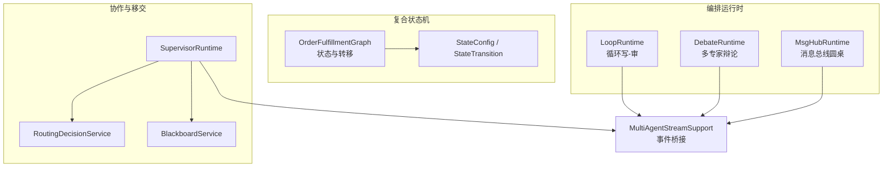
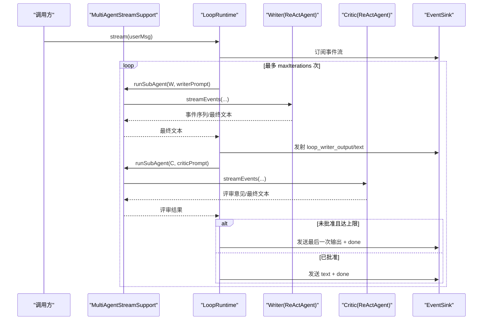
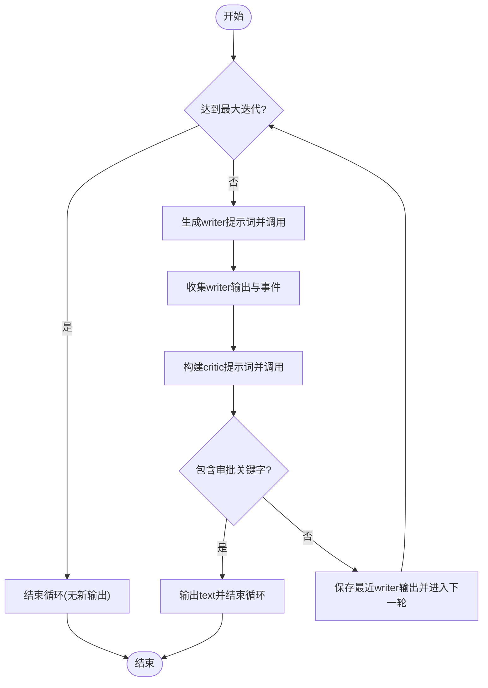
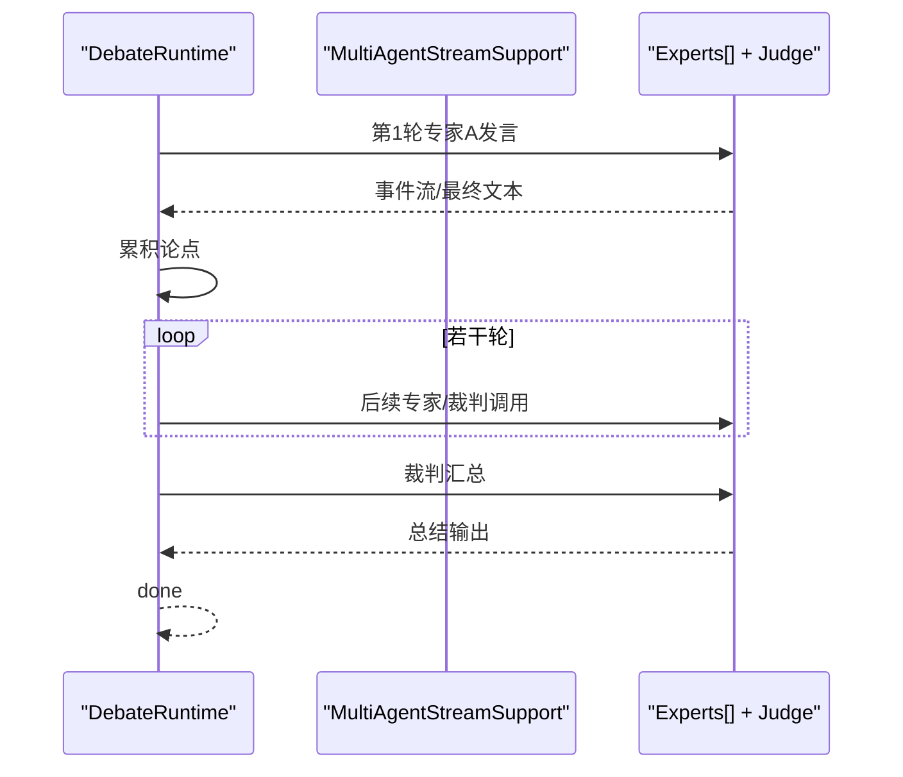
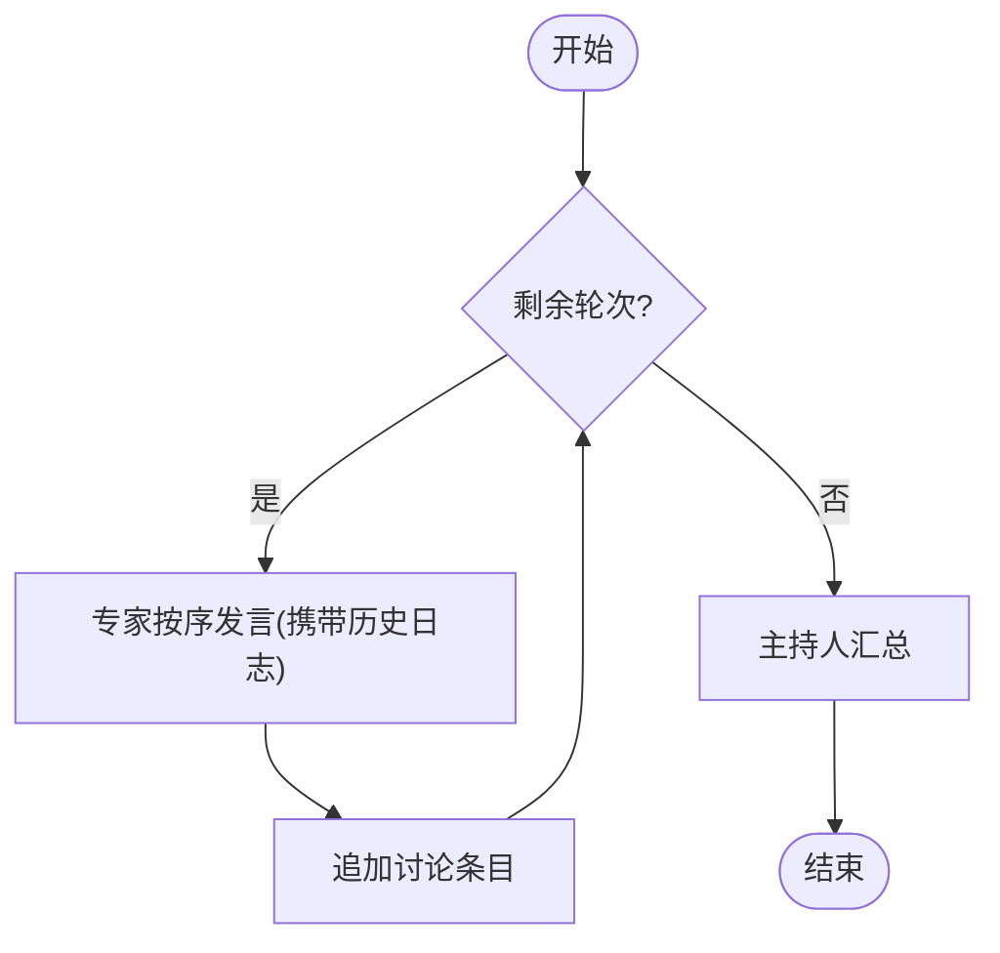
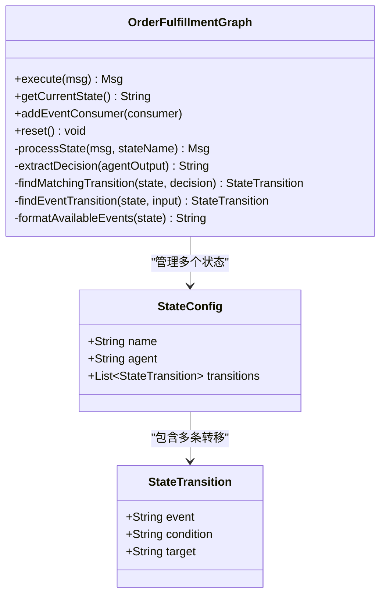
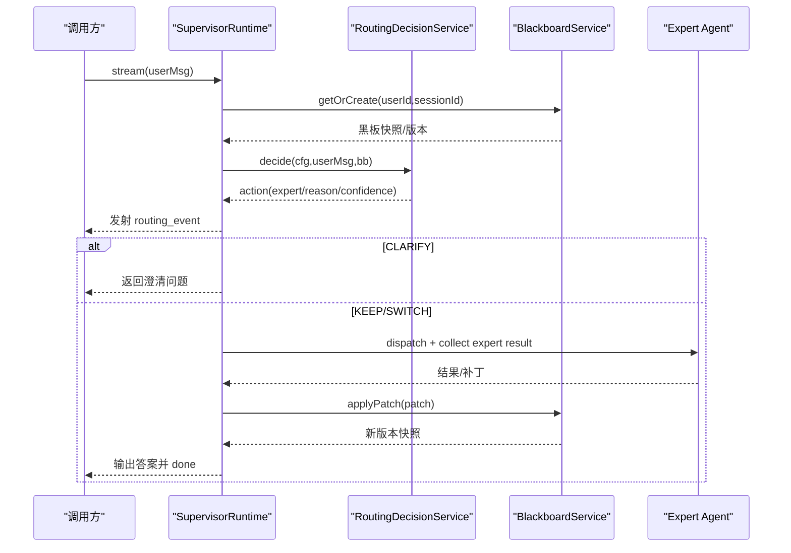
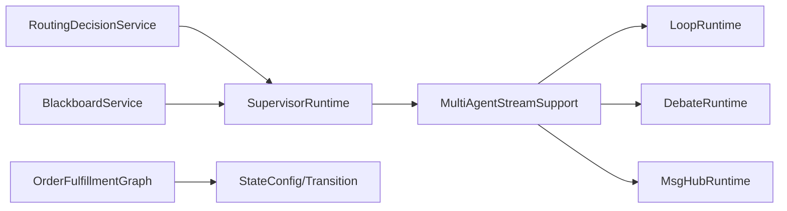

# 复杂工作流模式

<cite>
**本文引用的文件列表**
- [OrderFulfillmentGraph.java](file://src/main/java/com/skloda/agentscope/composite/graph/OrderFulfillmentGraph.java)
- [LoopRuntime.java](file://src/main/java/com/skloda/agentscope/runtime/LoopRuntime.java)
- [DebateRuntime.java](file://src/main/java/com/skloda/agentscope/runtime/DebateRuntime.java)
- [MsgHubRuntime.java](file://src/main/java/com/skloda/agentscope/runtime/MsgHubRuntime.java)
- [MultiAgentStreamSupport.java](file://src/main/java/com/skloda/agentscope/runtime/MultiAgentStreamSupport.java)
- [HandoffTrigger.java](file://src/main/java/com/skloda/agentscope/agent/HandoffTrigger.java)
- [StateConfig.java](file://src/main/java/com/skloda/agentscope/agent/StateConfig.java)
- [StateTransition.java](file://src/main/java/com/skloda/agentscope/agent/StateTransition.java)
- [RoutingDecisionService.java](file://src/main/java/com/skloda/agentscope/blackboard/RoutingDecisionService.java)
- [BlackboardService.java](file://src/main/java/com/skloda/agentscope/blackboard/BlackboardService.java)
- [SupervisorRuntime.java](file://src/main/java/com/skloda/agentscope/blackboard/SupervisorRuntime.java)
</cite>

## 目录
1. [引言](#引言)
2. [项目结构](#项目结构)
3. [核心组件](#核心组件)
4. [架构总览](#架构总览)
5. [详细组件分析](#详细组件分析)
6. [依赖关系分析](#依赖关系分析)
7. [性能考虑](#性能考虑)
8. [故障排查指南](#故障排查指南)
9. [结论](#结论)

## 引言
本文件聚焦企业级复杂工作流模式的高级技术文档，系统性说明以下能力：条件分支与循环控制（LoopRuntime）、辩论与多轮协商（DebateRuntime）、消息总线式多专家圆桌（MsgHubRuntime）、订单履行状态机（OrderFulfillmentGraph），以及基于共享黑板的 Agent 交接（HandoffTrigger + RoutingDecisionService + BlackboardService）。文档提供代码级流程图、时序图与依赖图，结合重试、超时、并发与错误恢复等实战策略，帮助读者在业务中落地稳定可靠的复杂编排。

[无小节来源；本节为总体概述]

## 项目结构
- 运行时编排位于 runtime 包：顺序/并行/子 Agent 调度、循环（LoopRuntime）、辩论（DebateRuntime）、消息总线（MsgHubRuntime）等。
- 复合状态图位于 composite/graph：以 OrderFulfillmentGraph 为代表，承载 LLM 驱动的状态转移和事件别名路由。
- 协作与权限位于 blackboard 包：通过共享黑板 SessionBlackboard、路由决策服务 RoutingDecisionService 与 SupervisorRuntime 实现可控交接与上下文隔离。
- 通用辅助工具 MultiAgentStreamSupport 统一了 Sub-Agent 事件转发与最终文本收敛，确保前端 SSE 体验一致。

**图示来源**
- [LoopRuntime.java:14-67](file://src/main/java/com/skloda/agentscope/runtime/LoopRuntime.java#L14-L67)
- [DebateRuntime.java:16-107](file://src/main/java/com/skloda/agentscope/runtime/DebateRuntime.java#L16-L107)
- [MsgHubRuntime.java:16-119](file://src/main/java/com/skloda/agentscope/runtime/MsgHubRuntime.java#L16-L119)
- [OrderFulfillmentGraph.java:17-102](file://src/main/java/com/skloda/agentscope/composite/graph/OrderFulfillmentGraph.java#L17-L102)
- [SupervisorRuntime.java:29-156](file://src/main/java/com/skloda/agentscope/blackboard/SupervisorRuntime.java#L29-L156)
- [RoutingDecisionService.java:14-63](file://src/main/java/com/skloda/agentscope/blackboard/RoutingDecisionService.java#L14-L63)
- [BlackboardService.java:18-40](file://src/main/java/com/skloda/agentscope/blackboard/BlackboardService.java#L18-L40)
- [MultiAgentStreamSupport.java:17-35](file://src/main/java/com/skloda/agentscope/runtime/MultiAgentStreamSupport.java#L17-L35)

**章节来源**
- [LoopRuntime.java:14-67](file://src/main/java/com/skloda/agentscope/runtime/LoopRuntime.java#L14-L67)
- [DebateRuntime.java:16-107](file://src/main/java/com/skloda/agentscope/runtime/DebateRuntime.java#L16-L107)
- [MsgHubRuntime.java:16-119](file://src/main/java/com/skloda/agentscope/runtime/MsgHubRuntime.java#L16-L119)
- [OrderFulfillmentGraph.java:17-102](file://src/main/java/com/skloda/agentscope/composite/graph/OrderFulfillmentGraph.java#L17-L102)
- [SupervisorRuntime.java:29-156](file://src/main/java/com/skloda/agentscope/blackboard/SupervisorRuntime.java#L29-L156)

## 核心组件
- 循环模式（LoopRuntime）：迭代“撰写→评审”直到通过或到达最大迭代次数；关键点是最终输出与完成事件的稳定发出。
- 辩论模式（DebateRuntime）：多专家分轮发言，最后由裁判综合输出；强调完整辩论记录的累积与裁判总结。
- 消息总线模式（MsgHubRuntime）：多专家跨轮次阅读历史、按序表达，主持人最后汇总；适合需要长期记忆与逐步沉淀的场景。
- 订单履行图（OrderFulfillmentGraph）：状态由配置定义，LLM 决策或用户事件触发状态迁移，支持关键词到中文事件别名映射。
- 交接机制（HandoffTrigger + RoutingDecisionService + BlackboardService + SupervisorRuntime）：基于规则或 LLM 的路由决策，将请求在专家之间安全交接，维护会话级共享黑板上下文。

**章节来源**
- [LoopRuntime.java:52-166](file://src/main/java/com/skloda/agentscope/runtime/LoopRuntime.java#L52-L166)
- [DebateRuntime.java:44-141](file://src/main/java/com/skloda/agentscope/runtime/DebateRuntime.java#L44-L141)
- [MsgHubRuntime.java:45-153](file://src/main/java/com/skloda/agentscope/runtime/MsgHubRuntime.java#L45-L153)
- [OrderFulfillmentGraph.java:39-157](file://src/main/java/com/skloda/agentscope/composite/graph/OrderFulfillmentGraph.java#L39-L157)
- [RoutingDecisionService.java:48-137](file://src/main/java/com/skloda/agentscope/blackboard/RoutingDecisionService.java#L48-L137)
- [BlackboardService.java:96-134](file://src/main/java/com/skloda/agentscope/blackboard/BlackboardService.java#L96-L134)
- [SupervisorRuntime.java:129-156](file://src/main/java/com/skloda/agentscope/blackboard/SupervisorRuntime.java#L129-L156)

## 架构总览
- 所有多 Agent 运行时通过 MultiAgentStreamSupport 将底层 AgentEvent 转换并转发至前端 SSE，保证统一的 source 标签与最终文本解析。
- LoopRuntime/DebateRuntime/MsgHubRuntime 均构建 Flux 流并在错误、取消、完成时释放资源、关闭 EventSink。
- OrderFulfillmentGraph 以状态为核心，通过“LLM 决策提取+条件匹配”或“事件匹配+别名替换”推进工作流。
- SupervisorRuntime 使用会话级 ReentrantLock 保证路由-分发-写入串行化，避免竞态；共享黑板版本控制防止覆盖冲突。

**图示来源**
- [LoopRuntime.java:52-135](file://src/main/java/com/skloda/agentscope/runtime/LoopRuntime.java#L52-L135)
- [MultiAgentStreamSupport.java:74-118](file://src/main/java/com/skloda/agentscope/runtime/MultiAgentStreamSupport.java#L74-L118)

**章节来源**
- [LoopRuntime.java:52-166](file://src/main/java/com/skloda/agentscope/runtime/LoopRuntime.java#L52-L166)
- [MultiAgentStreamSupport.java:74-118](file://src/main/java/com/skloda/agentscope/runtime/MultiAgentStreamSupport.java#L74-L118)

## 详细组件分析

### 循环模式：LoopRuntime
- 设计要点
  - 使用 Mono flatMap 链替代嵌套 subscribe，避免并发争用与丢数问题。
  - 达到最大迭代时仍输出最后一份最佳文本，保障用户体验。
  - 审批关键字集用于快速判定是否继续循环。
- 数据流
  - 每次“写→审”后记录输出与评审；若通过则立即终止并输出正文，否则进入下一轮。
- 异常与生命周期
  - 在 doFinally/close 中完成 EventSink，保证取消场景下的正确回收。

**图示来源**
- [LoopRuntime.java:73-135](file://src/main/java/com/skloda/agentscope/runtime/LoopRuntime.java#L73-L135)
- [LoopRuntime.java:154-160](file://src/main/java/com/skloda/agentscope/runtime/LoopRuntime.java#L154-L160)

**章节来源**
- [LoopRuntime.java:52-166](file://src/main/java/com/skloda/agentscope/runtime/LoopRuntime.java#L52-L166)

### 辩论模式：DebateRuntime
- 设计要点
  - 多专家分轮发言，每轮追加到讨论上下文；最后由裁判聚合所有论据进行总结。
  - 通过 MultiAgentStreamSupport 将所有参与者事件（思考、工具、文本）原样转发，保持前端可观测性。
- 数据流
  - 逐专家累加论点 → 构建裁判输入 → 输出总结 → done。
- 异常处理
  - 捕获错误并发送 error/done 事件，保证流完整性。

**图示来源**
- [DebateRuntime.java:44-107](file://src/main/java/com/skloda/agentscope/runtime/DebateRuntime.java#L44-L107)

**章节来源**
- [DebateRuntime.java:44-141](file://src/main/java/com/skloda/agentscope/runtime/DebateRuntime.java#L44-L141)

### 消息总线模式：MsgHubRuntime
- 设计要点
  - 多专家多轮讨论，每轮前读取累计讨论日志；主持人最后给出全面总结。
  - 同样基于 MultiAgentStreamSupport，实现低耦合的事件桥接。
- 数据流
  - 逐轮遍历专家 → 更新日志 → 主持人总结 → done。
- 特点
  - 相比 DebateRuntime，更适合需长期上下文沉淀的议题。

**图示来源**
- [MsgHubRuntime.java:45-119](file://src/main/java/com/skloda/agentscope/runtime/MsgHubRuntime.java#L45-L119)
- [MsgHubRuntime.java:121-147](file://src/main/java/com/skloda/agentscope/runtime/MsgHubRuntime.java#L121-L147)

**章节来源**
- [MsgHubRuntime.java:45-153](file://src/main/java/com/skloda/agentscope/runtime/MsgHubRuntime.java#L45-L153)

### 订单履行状态机：OrderFulfillmentGraph
- 设计与职责
  - 状态配置 StateConfig 描述名称、可选关联 Agent、转移规则；转移 StateTransition 包含 event/condition/target。
  - 有两种路径驱动：有 Agent 的状态由 LLM 决策决定下一个状态；无 Agent 的状态根据用户输入事件匹配转移。
- 关键技术
  - 状态决策提取：从 LLM 输出中提取“【决策:xxx】”标记，未命中时回退为整段文本的小写匹配。
  - 转移条件匹配：在状态的所有转移中寻找 condition 包含决策的子串匹配；未命中时使用首个转移作为默认。
  - 事件别名处理：内置英文到中文动词的映射（如 submit/提交、review/审核 等），提高用户友好度。
  - 事件消费者：可通过回调接收 graph_transition 等内部事件，便于审计与可视化。

**图示来源**
- [OrderFulfillmentGraph.java:24-188](file://src/main/java/com/skloda/agentscope/composite/graph/OrderFulfillmentGraph.java#L24-L188)
- [StateConfig.java:9-17](file://src/main/java/com/skloda/agentscope/agent/StateConfig.java#L9-L17)
- [StateTransition.java:9-16](file://src/main/java/com/skloda/agentscope/agent/StateTransition.java#L9-L16)

**章节来源**
- [OrderFulfillmentGraph.java:39-157](file://src/main/java/com/skloda/agentscope/composite/graph/OrderFulfillmentGraph.java#L39-L157)
- [StateConfig.java:9-17](file://src/main/java/com/skloda/agentscope/agent/StateConfig.java#L9-L17)
- [StateTransition.java:9-16](file://src/main/java/com/skloda/agentscope/agent/StateTransition.java#L9-L16)

### Agent 交接（HandoffTrigger）与协作运行（SupervisorRuntime）
- 交接触发器 HandoffTrigger
  - 类型包含意图（INTENT）与显式切换（EXPLICIT）；匹配时对关键词进行大小写无关匹配。
- 路由策略 RoutingDecisionService
  - “rule”策略下优先级：EXPLICIT 触发 > INTENT 多匹配优先切到其他专家 > 不匹配则 KEEP/CLARIFY 或首专家兜底。
  - “llm”策略预留 Hook，当前版本退回 rule 以避免外部模型强依赖。
- 共享黑板 BlackboardService
  - 使用 per-(userId,sessionId) 的 ReentrantLock 串行化读写；持久化键默认为 shared_blackboard；版本单调递增。
  - applyPatch 为唯一写入通道，避免专家直接修改导致的并发问题。
- 监督运行时 SupervisorRuntime
  - 每轮先读黑板快照、计算路由决策、发射 routing_event；按 KEEP/SWITCH/CLARIFY 执行，专家结果以补丁形式合并到黑板。
  - 对来自专家的某些事件做过滤（例如 raw text/json），避免干扰前端渲染或误结束。

**图示来源**
- [SupervisorRuntime.java:129-156](file://src/main/java/com/skloda/agentscope/blackboard/SupervisorRuntime.java#L129-L156)
- [SupervisorRuntime.java:158-194](file://src/main/java/com/skloda/agentscope/blackboard/SupervisorRuntime.java#L158-L194)
- [RoutingDecisionService.java:48-137](file://src/main/java/com/skloda/agentscope/blackboard/RoutingDecisionService.java#L48-L137)
- [BlackboardService.java:96-134](file://src/main/java/com/skloda/agentscope/blackboard/BlackboardService.java#L96-L134)
- [HandoffTrigger.java:19-25](file://src/main/java/com/skloda/agentscope/agent/HandoffTrigger.java#L19-L25)

**章节来源**
- [HandoffTrigger.java:10-26](file://src/main/java/com/skloda/agentscope/agent/HandoffTrigger.java#L10-L26)
- [RoutingDecisionService.java:48-200](file://src/main/java/com/skloda/agentscope/blackboard/RoutingDecisionService.java#L48-L200)
- [BlackboardService.java:96-134](file://src/main/java/com/skloda/agentscope/blackboard/BlackboardService.java#L96-L134)
- [SupervisorRuntime.java:129-156](file://src/main/java/com/skloda/agentscope/blackboard/SupervisorRuntime.java#L129-L156)

## 依赖关系分析
- 内聚与耦合
  - 多运行时强依赖 MultiAgentStreamSupport 完成事件转发与最终文本收敛，降低重复实现成本。
  - SupervisorRuntime 与 RoutingDecisionService、BlackboardService 形成松耦合的服务组合；路由决策纯函数化，增强可测性。
  - OrderFulfillmentGraph 仅依赖配置对象与 ReActAgent，关注点集中于状态与转移逻辑。
- 直接与间接依赖
  - LoopRuntime/DebateRuntime/MsgHubRuntime 间接依赖 AgentEventMapper（通过 MultiAgentStreamSupport）进行事件映射。
  - SupervisorRuntime 间接依赖 ObservabilityHook 的事件输出体系，便于全局追踪。
- 潜在环路
  - 各运行时均为单向消费型流，不互相引用，避免循环依赖。

**图示来源**
- [MultiAgentStreamSupport.java:74-118](file://src/main/java/com/skloda/agentscope/runtime/MultiAgentStreamSupport.java#L74-L118)
- [SupervisorRuntime.java:129-156](file://src/main/java/com/skloda/agentscope/blackboard/SupervisorRuntime.java#L129-L156)
- [OrderFulfillmentGraph.java:24-188](file://src/main/java/com/skloda/agentscope/composite/graph/OrderFulfillmentGraph.java#L24-L188)

**章节来源**
- [MultiAgentStreamSupport.java:74-118](file://src/main/java/com/skloda/agentscope/runtime/MultiAgentStreamSupport.java#L74-L118)
- [SupervisorRuntime.java:129-156](file://src/main/java/com/skloda/agentscope/blackboard/SupervisorRuntime.java#L129-L156)
- [OrderFulfillmentGraph.java:24-188](file://src/main/java/com/skloda/agentscope/composite/graph/OrderFulfillmentGraph.java#L24-L188)

## 性能考虑
- 流式处理
  - 使用 Flux.create 与 doFinally 管理背压与资源清理；取消即回收 EventSink。
- 并发模型
  - 多步子 Agent 调用通过 Mono flatMap/then 串联，避免嵌套 subscribe 引发的乱序与竞争。
- 同步边界
  - SupervisorRuntime 以 boundedElastic 调度阻塞调用，同时以 ReentrantLock 序列化关键段。
- 缓存与复制
  - BlackboardService 每次返回深拷贝快照，减少并发读取风险；写入前重建可变副本。

[无小节来源；本节为通用优化指导]

## 故障排查指南
- 常见问题定位
  - 循环未结束：检查审批关键字集合与评审输出是否命中；关注最大迭代出口分支是否有输出。
  - 对话丢失：确认 MultiAgentStreamSupport 是否正确标注 source 并最终收敛了 text。
  - 状态停滞：核对 OrderFulfillmentGraph 的条件字符串是否与 LLM 输出一致；必要时增加 event 别名或使用更宽松的匹配策略。
  - 路由抖动：观察 supervisor 的 routing_event；核对 HandoffTrigger 的关键词与 EXPLICIT/INTENT 优先级。
- 日志与观测
  - 使用 ObservabilityHook 的钩子输出 loop/debate/routing 事件；配合前端调试面板定位断点。
- 常见错误恢复
  - 子 Agent 失败：MultiAgentStreamSupport 会发送 error 事件并通过 onContinue 恢复，上层可根据业务决定是否重试。
  - 并发覆盖：BlackboardService 的版本号与锁能检测越权覆盖；发生冲突时建议重入并读取最新版本后再应用补丁。

**章节来源**
- [LoopRuntime.java:52-166](file://src/main/java/com/skloda/agentscope/runtime/LoopRuntime.java#L52-L166)
- [DebateRuntime.java:44-107](file://src/main/java/com/skloda/agentscope/runtime/DebateRuntime.java#L44-L107)
- [MsgHubRuntime.java:45-119](file://src/main/java/com/skloda/agentscope/runtime/MsgHubRuntime.java#L45-L119)
- [OrderFulfillmentGraph.java:115-157](file://src/main/java/com/skloda/agentscope/composite/graph/OrderFulfillmentGraph.java#L115-L157)
- [SupervisorRuntime.java:87-89](file://src/main/java/com/skloda/agentscope/blackboard/SupervisorRuntime.java#L87-L89)
- [BlackboardService.java:121-134](file://src/main/java/com/skloda/agentscope/blackboard/BlackboardService.java#L121-L134)

## 结论
该代码库提供了面向企业级复杂场景的工作流基石：以循环、辩论与消息总线三类高级编排模式覆盖“写-审-改”“多方协商”“共识沉淀”的典型需求；以 OrderFulfillmentGraph 实现“智能决策 + 事件驱动”的可扩展状态机；以 SupervisorRuntime + BlackboardService + RoutingDecisionService 构建了具备权限与安全边界的 Agent 交接体系。通过 MultiAgentStreamSupport 实现统一事件模型，既保证了可扩展性，也确保了端到端流式体验的一致性与可观测性。在此基础上，结合重试、超时与并发策略，可在真实生产环境中稳定落地复杂的业务流程。

[无小节来源；本节为总结性内容]