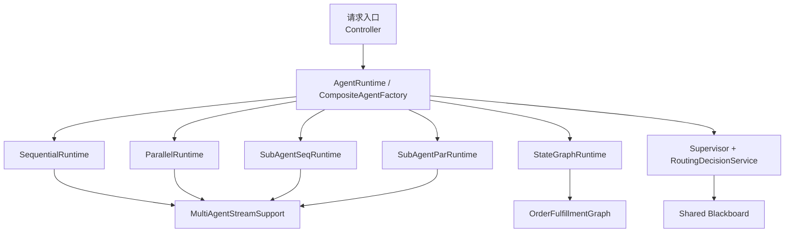
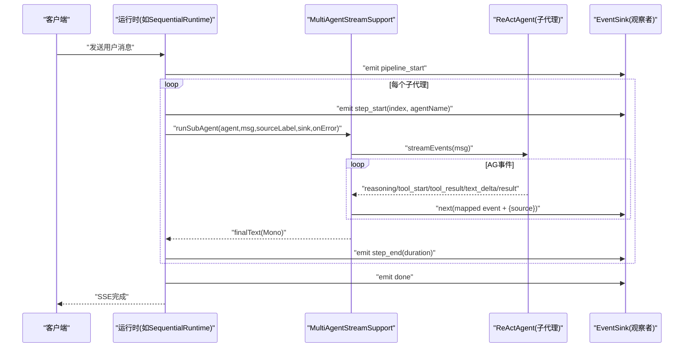
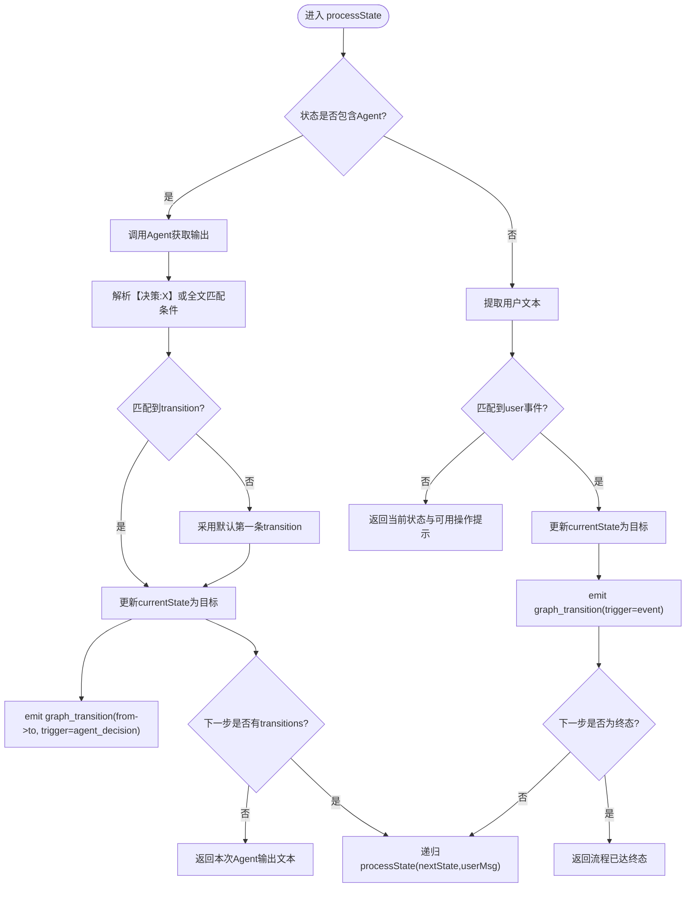
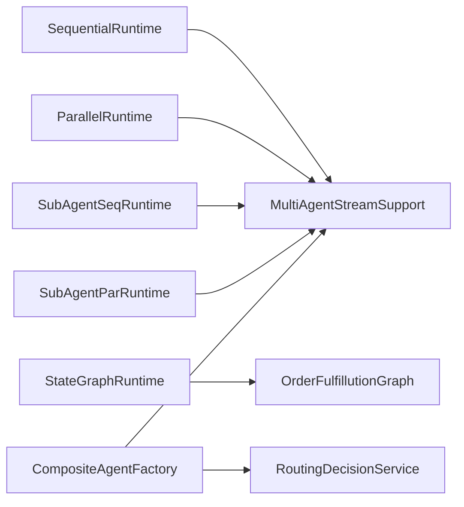

# 多智能体协作

<cite>
**引用文件列表**
- [MultiAgentStreamSupport.java](file://src/main/java/com/skloda/agentscope/runtime/MultiAgentStreamSupport.java)
- [StateGraphRuntime.java](file://src/main/java/com/skloda/agentscope/runtime/StateGraphRuntime.java)
- [OrderFulfillmentGraph.java](file://src/main/java/com/skloda/agentscope/composite/graph/OrderFulfillmentGraph.java)
- [CompositeAgentFactory.java](file://src/main/java/com/skloda/agentscope/composite/CompositeAgentFactory.java)
- [SequentialRuntime.java](file://src/main/java/com/skloda/agentscope/runtime/SequentialRuntime.java)
- [ParallelRuntime.java](file://src/main/java/com/skloda/agentscope/runtime/ParallelRuntime.java)
- [SubAgentSeqRuntime.java](file://src/main/java/com/skloda/agentscope/runtime/SubAgentSeqRuntime.java)
- [SubAgentParRuntime.java](file://src/main/java/com/skloda/agentscope/runtime/SubAgentParRuntime.java)
- [RoutingDecisionService.java](file://src/main/java/com/skloda/agentscope/blackboard/RoutingDecisionService.java)
- [ApplicationConfiguration.java](file://src/main/resources/application.yml)
</cite>

## 目录
1. [引言](#引言)
2. [项目结构](#项目结构)
3. [核心组件](#核心组件)
4. [架构总览](#架构总览)
5. [关键组件深度分析](#关键组件深度分析)
6. [依赖关系分析](#依赖关系分析)
7. [性能考量](#性能考量)
8. [故障排查指南](#故障排查指南)
9. [结论](#结论)
10. [附录](#附录)

## 引言
本文档面向工程与产品同学，系统梳理仓库中“多智能体协作”的设计与实现。围绕以下高级协作模式展开：
- 流水线执行（Sequential Pipeline）
- 智能路由（Intelligent Routing）
- Agent 交接（Agent Handoffs）
- 状态图执行（StateGraph）
- 子任务编排（SubAgent 顺序/并行）

重点剖析 CompositeAgentFactory 的编排能力、MultiAgentStreamSupport 的事件分发机制、以及 StateGraphRuntime 的状态推进流程；并以订单履行工作流为例，说明条件分支、并行处理、错误恢复与企业级集成模式的落地方式。

## 项目结构
代码采用按功能域分层的组织方式：
- agent：配置模型、调度开关、触发策略等
- composite：多智能体组合、状态机编排
- blackboard：共享黑板、路由决策、专家调用封装
- runtime：各运行时的流式编排与事件转发（顺序、并行、循环、消息枢纽、状态图、子任务等）
- controller/model/tool/hook：请求接入、模型接入、工具注册、可观测性钩子
- resources：应用与环境配置（包括 SSE 默认端口与调试日志级别）

图表来源
- [CompositeAgentFactory.java:44-191](file://src/main/java/com/skloda/agentscope/composite/CompositeAgentFactory.java#L44-L191)
- [SequentialRuntime.java:37-88](file://src/main/java/com/skloda/agentscope/runtime/SequentialRuntime.java#L37-L88)
- [ParallelRuntime.java:38-94](file://src/main/java/com/skloda/agentscope/runtime/ParallelRuntime.java#L38-L94)
- [SubAgentSeqRuntime.java:37-92](file://src/main/java/com/skloda/agentscope/runtime/SubAgentSeqRuntime.java#L37-L92)
- [SubAgentParRuntime.java:37-89](file://src/main/java/com/skloda/agentscope/runtime/SubAgentParRuntime.java#L37-L89)
- [StateGraphRuntime.java:30-63](file://src/main/java/com/skloda/agentscope/runtime/StateGraphRuntime.java#L30-L63)
- [RoutingDecisionService.java:48-160](file://src/main/java/com/skloda/agentscope/blackboard/RoutingDecisionService.java#L48-L160)
- [OrderFulfillmentGraph.java:39-101](file://src/main/java/com/skloda/agentscope/composite/graph/OrderFulfillmentGraph.java#L39-L101)

章节来源
- [application.yml:1-90](file://src/main/resources/application.yml#L1-L90)

## 核心组件
- MultiAgentStreamSupport：统一从 ReActAgent 的事件流中提取文本与将每个中间事件转换为 SSE；当子代理出错时向上游发出 error 类型事件并返回空串以便上游继续或结束流程。
- SequentialRuntime / ParallelRuntime：分别以顺序与并发方式执行一组 ReActAgent，并将阶段开始/结束、结果与完成事件推送到 EventSink。
- SubAgentSeqRuntime / SubAgentParRuntime：以“子任务模板”驱动串行或并行的子代理执行，输出聚合后再完成。
- StateGraphRuntime + OrderFulfillmentGraph：基于状态图的有界执行引擎，节点可由 LLM 决策或由用户输入事件驱动；通过 hook.getEventSink().asFlux() 将观察事件与业务事件合并流式输出。
- CompositeAgentFactory：根据配置创建单智能体、路由型智能体、状态图智能体以及子智能体集合，统一装配 toolkit、模型和状态存储。
- RoutingDecisionService：规则为主的路由器，支持 EXPLICIT/INTENT 两类触发，维护当前活跃专家，必要时要求澄清或切换到目标专家。

章节来源
- [MultiAgentStreamSupport.java:43-118](file://src/main/java/com/skloda/agentscope/runtime/MultiAgentStreamSupport.java#L43-L118)
- [SequentialRuntime.java:37-88](file://src/main/java/com/skloda/agentscope/runtime/SequentialRuntime.java#L37-L88)
- [ParallelRuntime.java:38-94](file://src/main/java/com/skloda/agentscope/runtime/ParallelRuntime.java#L38-L94)
- [SubAgentSeqRuntime.java:37-92](file://src/main/java/com/skloda/agentscope/runtime/SubAgentSeqRuntime.java#L37-L92)
- [SubAgentParRuntime.java:37-89](file://src/main/java/com/skloda/agentscope/runtime/SubAgentParRuntime.java#L37-L89)
- [StateGraphRuntime.java:13-73](file://src/main/java/com/skloda/agentscope/runtime/StateGraphRuntime.java#L13-L73)
- [OrderFulfillmentGraph.java:24-101](file://src/main/java/com/skloda/agentscope/composite/graph/OrderFulfillmentGraph.java#L24-L101)
- [CompositeAgentFactory.java:97-191](file://src/main/java/com/skloda/agentscope/composite/CompositeAgentFactory.java#L97-L191)
- [RoutingDecisionService.java:48-160](file://src/main/java/com/skloda/agentscope/blackboard/RoutingDecisionService.java#L48-L160)

## 架构总览
整体数据流：Controller/Channel 接入 → Runtime 编排 → Agent/Graph/Blackboard 执行 → EventSink 合并 → SSE 推送到前端。关键特性：
- 统一的事件桥接层：所有子代理的中间事件通过同一 sink 广播，带 source 标注便于前端区分来源。
- 可观测性：ObservabilityHook 发射 pipeline_start/end、step_start/end、task_start/end、agent_call、transition 等事件，便于可视化与排障。
- 路由与交接：ROUTING/HANDOFFS 使用规则路由（可扩展为 LLM 路由），在 Shared Blackboard 上维护专家上下文，保证跨专家的语义一致性。
- 状态机执行：StateGraphRuntime 结合 OrderFulfillmentGraph 提供显式的“状态-转移”控制面，既支持用户命令触发的确定转移，也支持 LLM 判定驱动的复杂跳转。

图表来源
- [SequentialRuntime.java:37-88](file://src/main/java/com/skloda/agentscope/runtime/SequentialRuntime.java#L37-L88)
- [MultiAgentStreamSupport.java:74-118](file://src/main/java/com/skloda/agentscope/runtime/MultiAgentStreamSupport.java#L74-L118)
- [ParallelRuntime.java:38-94](file://src/main/java/com/skloda/agentscope/runtime/ParallelRuntime.java#L38-L94)

## 关键组件深度分析

### 1) 事件分发与子代理桥接：MultiAgentStreamSupport
职责
- extractText：从 Msg 的内容块中提取拼接后的文本，作为最终结果回传依据。
- runSubAgent：以 streamEvents 桥接子代理，把生命周期事件映射为 SSE 事件（type/source/content 等），并在结束时产出 finalText（优先取 AgentResultEvent，否则退回累计文本）。
- 错误收敛：若子代理异常，调用 onError 回调，向 sink 推送 error 事件，并返回空字符串避免阻断上游。

复杂度
- 时间复杂度 O(N) 遍历内容块，事件流一次扫描；内存占用 O(D) 累计文本缓冲区。

优化点
- 对于超大文本场景可按需限制累计长度或使用流式截断以减少内存压力。

错误处理
- 子代理事件流异常时，通过 onerrorResume 发送 error 事件并安全返回 Mono.just("")，保障链路稳定性。

适用场景
- 任何需要把“流式思考过程+工具调用+结果”统一暴露给前端的编排器（顺序/并行/子任务/状态图）。

章节来源
- [MultiAgentStreamSupport.java:43-118](file://src/main/java/com/skloda/agentscope/runtime/MultiAgentStreamSupport.java#L43-L118)

### 2) 顺序流水线：SequentialRuntime
行为
- emit pipeline_start，依次将上一子代理的输出注入下一个子代理的 Msg.textContent。
- 每步 emit step_start/step_end 及步骤结果摘要，最终输出完整文本并 emit done。

并发与资源
- 严格顺序执行，无并发风险；适合强耦合步骤、需保留全部历史的任务。

性能特征
- 端到端延迟由各步延迟之和决定；I/O 密集时可考虑拆分更小步或在下游使用缓存/批处理。

章节来源
- [SequentialRuntime.java:37-88](file://src/main/java/com/skloda/agentscope/runtime/SequentialRuntime.java#L37-L88)

### 3) 并行流水线：ParallelRuntime
行为
- 并发调度多个子代理执行同一条用户消息。
- 每个任务独立产生 step_event，结束后收集列表合并为结构化输出（按 agentId 分隔）。

并发与资源
- 共享 fluxSink 写入，注意 sink.next 的线程安全性由 Reactor 保证。
- 适用于对延迟敏感、子任务相对独立的场景（例如多维度检索/多视角推理）。

性能特征
- 吞吐提升取决于可用 CPU 与外部服务容量；应关注外部 API 限流。

章节来源
- [ParallelRuntime.java:38-94](file://src/main/java/com/skloda/agentscope/runtime/ParallelRuntime.java#L38-L94)

### 4) 子任务编排：SubAgentSeqRuntime / SubAgentParRuntime
行为
- 序列模式：将 {input}/{prevOutput} 模板填充后传给下一子代理，最后汇总；并发模式：将同一 input 广播给各子代理，再合并。
- 每个任务 emit task_start/end 及 aggregated 统计事件。

设计要点
- 将业务逻辑抽象为“任务模板”，便于复用与配置化；适合复杂工作流的横向拆解。

章节来源
- [SubAgentSeqRuntime.java:37-92](file://src/main/java/com/skloda/agentscope/runtime/SubAgentSeqRuntime.java#L37-L92)
- [SubAgentParRuntime.java:37-89](file://src/main/java/com/skloda/agentscope/runtime/SubAgentParRuntime.java#L37-L89)

### 5) 状态图执行器：StateGraphRuntime + OrderFulfillmentGraph
工作流程
- 构造时注册事件消费者，使状态转移事件能透传到可观测性层。
- execute(userMsg) 进入 processState(stateName)，分为两种路径：
  - 若状态包含 Agent：调用该状态的 ReActAgent，解析“【决策:X】”以匹配转移到下一个状态；若无匹配则采用默认第一条过渡。
  - 若不包含 Agent：按用户输入的事件关键字做确定性迁移；未知事件时返回当前可用操作提示。
- 到达终态（无后续 transition）时直接返回完成消息；同时 emit graph_agent_call/graph_transition 等事件。
- StateGraphRuntime 会将 Graph 产生的业务事件与 ObservabilityHook 的观察事件通过 Flux.merge 合流，最终 emit text/done/error。

关键点
- 事件语义明确：graph_agent_call、graph_transition(fromState/toState/trigger)。
- 中文事件别名：提交/审核/支付/发货/重试 等关键词支持。
- 可重置：reset() 回到初始状态。

图表来源
- [OrderFulfillmentGraph.java:39-101](file://src/main/java/com/skloda/agentscope/composite/graph/OrderFulfillmentGraph.java#L39-L101)
- [StateGraphRuntime.java:30-63](file://src/main/java/com/skloda/agentscope/runtime/StateGraphRuntime.java#L30-L63)

章节来源
- [OrderFulfillmentGraph.java:39-187](file://src/main/java/com/skloda/agentscope/composite/graph/OrderFulfillmentGraph.java#L39-L187)
- [StateGraphRuntime.java:13-73](file://src/main/java/com/skloda/agentscope/runtime/StateGraphRuntime.java#L13-L73)

### 6) 智能路由与Agent交接：RoutingDecisionService + CompositeAgentFactory.createRoutingAgent
路由策略
- 默认“rule”策略：EXPLICIT 优先（用户明确要求转交）→ 其次 INTENT 意图命中（命中且不同于 activeExpert 则 SWITCH）→ 无命中时，若有 activeExpert 则 KEEP 或 CLARIFY → 首轮无 activeExpert 则默认路由到首个子代理。
- “llm”策略：预留扩展点；在本版本会退回到 rule 逻辑以避免在无模型调用下阻塞。

工厂创建
- createRoutingAgent：为每个子代理构建 ReActAgent（禁用工具调用，仅用于领域推理），通过 SubAgentTool 暴露为工具名，并由主代理的 toolkit 进行动态调度。

交互效果
- 用户输入被路由到最相关的专家；专家结果可以回溯到共享上下文中，从而实现交接后不重复提问。

章节来源
- [RoutingDecisionService.java:48-160](file://src/main/java/com/skloda/agentscope/blackboard/RoutingDecisionService.java#L48-L160)
- [CompositeAgentFactory.java:115-191](file://src/main/java/com/skloda/agentscope/composite/CompositeAgentFactory.java#L115-L191)

### 7) 编排工厂：CompositeAgentFactory
职责
- SINGLE：委派给 AgentFactory，支持权限模式与审批中间件。
- ROUTING：动态构建 SubAgentTool 集合，主 Agent 通过工具选择并调用合适的专家。
- STATE_GRAPH：基于 StateConfig 装配状态对应的 ReActAgent，并返回 OrderFulfillmentGraph，供 StateGraphRuntime 驱动。

可配置项
- 子代理信息、描述、模型与流式选项等；状态机的 states 与 transitions 决定执行边界。

章节来源
- [CompositeAgentFactory.java:59-113](file://src/main/java/com/skloda/agentscope/composite/CompositeAgentFactory.java#L59-L113)
- [CompositeAgentFactory.java:115-191](file://src/main/java/com/skloda/agentscope/composite/CompositeAgentFactory.java#L115-L191)

## 依赖关系分析
- 流式运行时（Sequential/Parallel/SubAgent*）依赖 MultiAgentStreamSupport 作为统一的子代理调用与事件转发基础设施。
- StateGraphRuntime 依赖 OrderFulfillmentGraph 实现具体执行逻辑，并通过 ObservabilityHook 向外广播状态转移。
- RoutingDecisionService 依赖 AgentConfig 中的路由配置与黑白板快照（调用方负责传入），保持纯函数式计算。
- CompositeAgentFactory 依赖 AgentConfigService/ModelFactory 完成模型与配置的实例化，并统一注册工具。

图表来源
- [SequentialRuntime.java:37-88](file://src/main/java/com/skloda/agentscope/runtime/SequentialRuntime.java#L37-L88)
- [ParallelRuntime.java:38-94](file://src/main/java/com/skloda/agentscope/runtime/ParallelRuntime.java#L38-L94)
- [SubAgentSeqRuntime.java:37-92](file://src/main/java/com/skloda/agentscope/runtime/SubAgentSeqRuntime.java#L37-L92)
- [SubAgentParRuntime.java:37-89](file://src/main/java/com/skloda/agentscope/runtime/SubAgentParRuntime.java#L37-L89)
- [StateGraphRuntime.java:30-63](file://src/main/java/com/skloda/agentscope/runtime/StateGraphRuntime.java#L30-L63)
- [CompositeAgentFactory.java:115-191](file://src/main/java/com/skloda/agentscope/composite/CompositeAgentFactory.java#L115-L191)
- [RoutingDecisionService.java:48-160](file://src/main/java/com/skloda/agentscope/blackboard/RoutingDecisionService.java#L48-L160)

## 性能考量
- 顺序流水线会增加总耗时（叠加各步耗时），但在可控性与审计价值上有优势；对于高延迟的外部服务，建议使用缓存或批量请求。
- 并行流水线受限于 CPU/IO 与下游服务的并发限额，应避免“扇出风暴”。建议在网关层增加令牌桶/并发上限。
- 子代理事件流转换成本较低，但大量文本 delta 会增大内存带宽；可按需限制文本长度或采样频率。
- 状态机图建议尽量扁平化状态，减少深层递归；可通过“子流程”模式拆分复杂状态。

## 故障排查指南
常见现象与定位要点
- 只收到 done，没有中间事件：检查 MultiAgentStreamSupport.runSubAgent 中事件映射是否为空；确认上游 sink 未提前关闭。
- 子代理报 error：MultiAgentStreamSupport 会把 error 事件推送到 sink，同时返回空串继续；查看 error 事件的 message 字段定位根因。
- 顺序流水线卡住：确认上一步输出非空且不为极短占位；必要时增加步骤间的超时与短路。
- 状态图无法前进：确认状态配置中存在对应 event/condition；用户输入可能缺少匹配词。对于含 Agent 的状态，请检查 Agent 回复是否包含期望的“【决策:X】”格式。

定位手段
- 开启 io.agentscope 的 DEBUG 日志级别，结合 EventSink 输出的 type、source、data 字段定位。
- 在 StateGraphRuntime 中记录 durationMs，辅助判断瓶颈在哪一步。
- 在 CompositeAgentFactory.createRoutingAgent 创建的子代理中确保启用合理的 model/stream 参数。

章节来源
- [MultiAgentStreamSupport.java:74-118](file://src/main/java/com/skloda/agentscope/runtime/MultiAgentStreamSupport.java#L74-L118)
- [StateGraphRuntime.java:30-63](file://src/main/java/com/skloda/agentscope/runtime/StateGraphRuntime.java#L30-L63)
- [application.yml:81-90](file://src/main/resources/application.yml#L81-L90)

## 结论
本仓库在多智能体协作方面提供了清晰的分层架构与丰富的执行模式：
- 通过 MultiAgentStreamSupport 实现了统一的事件桥接与错误收敛。
- 顺序与并行流水线覆盖多数线性与发散任务。
- 子任务模板让复杂流程解耦并可复用。
- 状态图执行器提供可验证、可回滚、可视化的强约束流程控制。
- 路由与交接基于规则策略，保证跨专家的一致上下文与最小切换成本。
生产落地建议优先从顺序流水线+状态图切入，逐步引入并行与智能路由，配合可观测性埋点持续调优性能与稳定性。

## 附录
- 典型事件命名规范
  - pipeline_start/pipeline_step_start/pipeline_step_end/pipeline_end
  - task_start/task_end/task_aggregate
  - graph_agent_call/graph_transition
  - text/error/done
- 常用运行参数
  - 默认监听端口：8081
  - 流式与思维模式：application.yml 中的 agentscope.model.* 配置
  - 日志级别：root/io.agentscope 等

章节来源
- [application.yml:1-40](file://src/main/resources/application.yml#L1-L40)