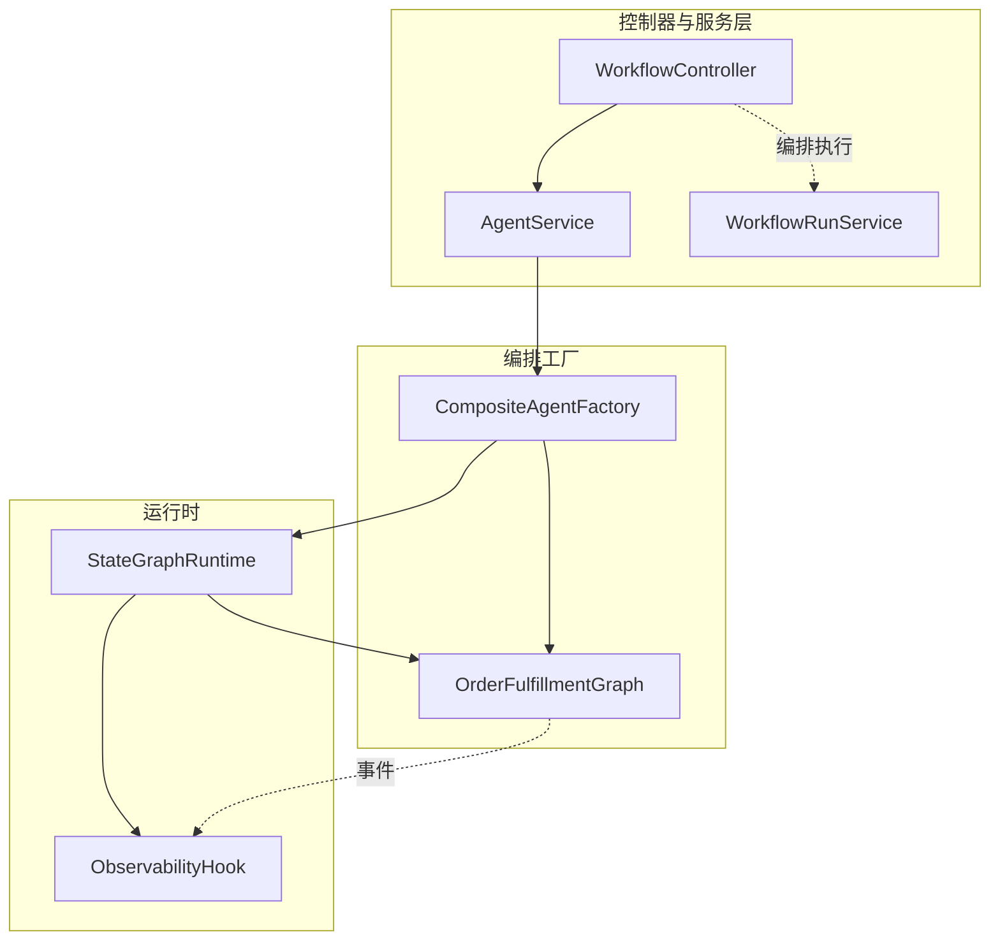
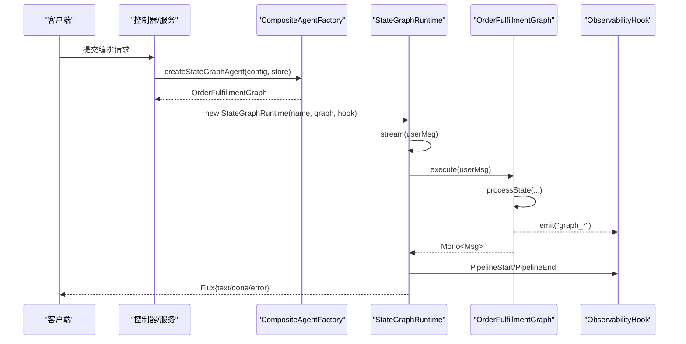
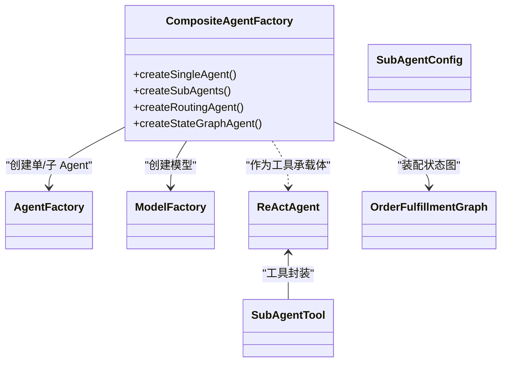
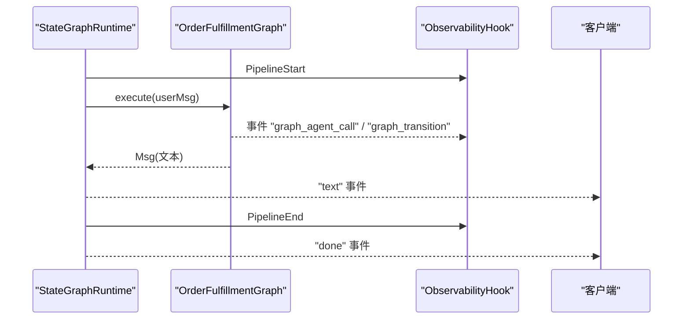
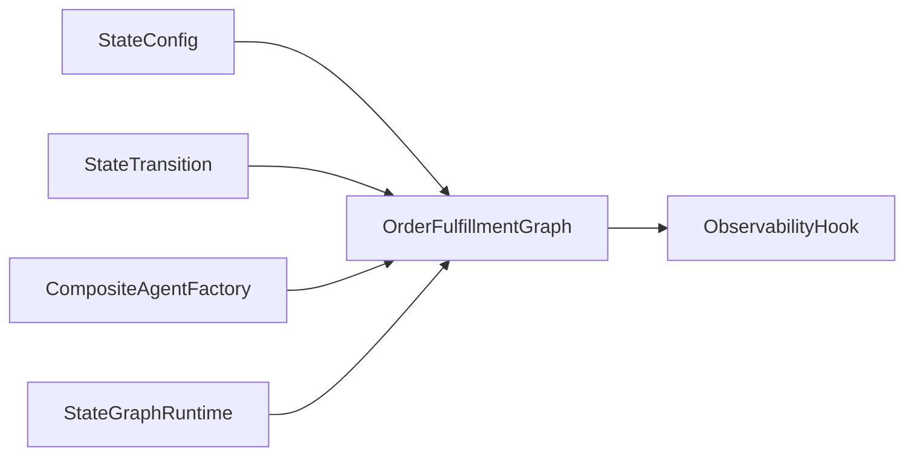
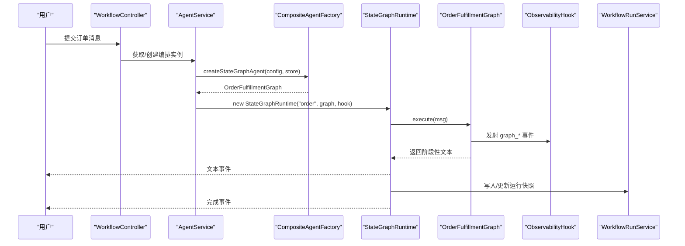

# 编排引擎

<cite>
**本文引用的文件**   
- [CompositeAgentFactory.java](file://src/main/java/com/skloda/agentscope/composite/CompositeAgentFactory.java)
- [OrderFulfillmentGraph.java](file://src/main/java/com/skloda/agentscope/composite/graph/OrderFulfillmentGraph.java)
- [StateGraphRuntime.java](file://src/main/java/com/skloda/agentscope/runtime/StateGraphRuntime.java)
- [StateConfig.java](file://src/main/java/com/skloda/agentscope/agent/StateConfig.java)
- [StateTransition.java](file://src/main/java/com/skloda/agentscope/agent/StateTransition.java)
- [AgentService.java](file://src/main/java/com/skloda/agentscope/service/AgentService.java)
- [WorkflowController.java](file://src/main/java/com/skloda/agentscope/controller/WorkflowController.java)
- [WorkflowRunService.java](file://src/main/java/com/skloda/agentscope/service/WorkflowRunService.java)
- [WorkflowRunSnapshot.java](file://src/main/java/com/skloda/agentscope/model/WorkflowRunSnapshot.java)
- [ObservabilityHook.java](file://src/main/java/com/skloda/agentscope/hook/ObservabilityHook.java)
- [StateGraphRuntimeTest.java](file://src/test/java/com/skloda/agentscope/runtime/StateGraphRuntimeTest.java)
- [OrderFulfillmentGraphTest.java](file://src/test/java/com/skloda/agentscope/composite/graph/OrderFulfillmentGraphTest.java)
- [StateConfigTest.java](file://src/test/java/com/skloda/agentscope/agent/StateConfigTest.java)
- [StateTransitionTest.java](file://src/test/java/com/skloda/agentscope/agent/StateTransitionTest.java)
</cite>

## 目录
1. [简介](#简介)
2. [项目结构与入口](#项目结构与入口)
3. [核心组件](#核心组件)
4. [架构总览](#架构总览)
5. [详细组件分析](#详细组件分析)
6. [依赖与耦合关系分析](#依赖与耦合关系分析)
7. [性能与可扩展性考量](#性能与可扩展性考量)
8. [故障诊断与常见问题](#故障诊断与常见问题)
9. [订单履行案例研究](#订单履行案例研究)
10. [结论](#结论)

## 简介
本技术文档聚焦于编排引擎的 Agent 编排能力，围绕 CompositeAgentFactory 的工厂模式、OrderFulfillmentGraph 的状态机工作流、StateGraphRuntime 的响应式状态执行，以及 StateConfig/StateTransition 的数据模型进行系统化说明。本文通过代码级图示、调用时序与数据流图，帮助用户理解如何基于状态机驱动多 Agent 协作，完成复杂企业流程编排。

## 项目结构与入口
编排相关代码位于：
- composite: 组合与状态图编排
- runtime: 运行期流式执行与事件桥接
- agent: 状态配置数据结构
- controller/service/model: 外部请求到编排的执行封装与快照持久化



图表来源
- [CompositeAgentFactory.java:97-113](file://src/main/java/com/skloda/agentscope/composite/CompositeAgentFactory.java#L97-L113)
- [OrderFulfillmentGraph.java:22-102](file://src/main/java/com/skloda/agentscope/composite/graph/OrderFulfillmentGraph.java#L22-L102)
- [StateGraphRuntime.java:13-74](file://src/main/java/com/skloda/agentscope/runtime/StateGraphRuntime.java#L13-L74)
- [WorkflowController.java](file://src/main/java/com/skloda/agentscope/controller/WorkflowController.java)
- [WorkflowRunService.java](file://src/main/java/com/skloda/agentscope/service/WorkflowRunService.java)

章节来源
- [CompositeAgentFactory.java:33-113](file://src/main/java/com/skloda/agentscope/composite/CompositeAgentFactory.java#L33-L113)
- [WorkflowController.java](file://src/main/java/com/skloda/agentscope/controller/WorkflowController.java)
- [WorkflowRunService.java](file://src/main/java/com/skloda/agentscope/service/WorkflowRunService.java)

## 核心组件
- CompositeAgentFactory
  - 负责按 Agent 类型创建单代理、路由型代理、子代理列表以及 STATE_GRAPH 类型的状态图编排 Agent
  - ROUTING/HANDOFFS 使用 SubAgentTool 实现动态分派
  - STATE_GRAPH 将一组 StateConfig 与可选的 ReActAgent 绑定为 OrderFulfillmentGraph
- OrderFulfillmentGraph
  - 以当前状态为中心的状态机，支持“LLM 决策驱动”和“用户事件触发”两类转移
  - 维护 currentState 并递归推进直至终态或无可用动作
  - 产生 graph_agent_call/graph_transition 等事件，供可观测性与前端可视化消费
- StateGraphRuntime
  - 实现 StreamingAgentRuntime，将 OrderFulfillmentGraph 的执行包装为 Flux<Map> 流式输出
  - 注入 ObservabilityHook，使编排过程中的中间事件也能统一对外暴露
- StateConfig/StateTransition
  - 描述状态及其转移规则（event/condition/target）
  - 条件分支用于自动流转，事件用于交互式触发

章节来源
- [StateConfig.java](file://src/main/java/com/skloda/agentscope/agent/StateConfig.java)
- [StateTransition.java](file://src/main/java/com/skloda/agentscope/agent/StateTransition.java)
- [CompositeAgentFactory.java:86-113](file://src/main/java/com/skloda/agentscope/composite/CompositeAgentFactory.java#L86-L113)
- [OrderFulfillmentGraph.java:22-187](file://src/main/java/com/skloda/agentscope/composite/graph/OrderFulfillmentGraph.java#L22-L187)
- [StateGraphRuntime.java:13-74](file://src/main/java/com/skloda/agentscope/runtime/StateGraphRuntime.java#L13-L74)

## 架构总览
编排引擎由“配置定义 + 工厂装配 + 状态机执行 + 流式可观测”四层构成：
- 配置定义：StateConfig/StateTransition 定义业务流转
- 工厂装配：CompositeAgentFactory 根据配置组装 ReActAgent 实例与状态图
- 状态机执行：OrderFulfillmentGraph 驱动状态流转，结合 LLM 推理与事件匹配
- 流式可观测：StateGraphRuntime 统一输出 text/done/error 及 hook 事件



图表来源
- [CompositeAgentFactory.java:97-113](file://src/main/java/com/skloda/agentscope/composite/CompositeAgentFactory.java#L97-L113)
- [StateGraphRuntime.java:29-74](file://src/main/java/com/skloda/agentscope/runtime/StateGraphRuntime.java#L29-L74)
- [OrderFulfillmentGraph.java:39-102](file://src/main/java/com/skloda/agentscope/composite/graph/OrderFulfillmentGraph.java#L39-L102)

## 详细组件分析

### CompositeAgentFactory：Agent 工厂与编排装配
职责
- 创建 SINGLE/ROUTING/HANDOFFS/STATE_GRAPH 类 Agent
- 对 ROUTING，将多个 SubAgentConfig 注册为 SubAgentTool，主 Agent 以“只读工具”方式分派给对应子 Agent
- 对 STATE_GRAPH，构建 ReActAgent 与状态的映射，返回 OrderFulfillmentGraph

关键点
- ROUTING Agent 构造时使用独立 Toolkit 与每个子 Agent 的 SubAgentTool；避免子 Agent 内部工具干扰主 Agent
- STATE_GRAPH Agent 可为每个状态提供独立会话隔离的 AgentStateStore，从而保证状态机内各步骤上下文不串扰
- 若状态未提供 Agent，则仅支持事件驱动的用户交互路径

章节来源
- [CompositeAgentFactory.java:59-191](file://src/main/java/com/skloda/agentscope/composite/CompositeAgentFactory.java#L59-L191)

#### 类关系图


图表来源
- [CompositeAgentFactory.java:59-191](file://src/main/java/com/skloda/agentscope/composite/CompositeAgentFactory.java#L59-L191)

### OrderFulfillmentGraph：状态机与工作流
能力
- 维护 currentState，初始为首个状态
- 当某状态绑定有 Agent：以“LLM 决策”判断转移目标；从 Agent 输出中提取“决策片段”并与 transitions.condition 匹配
- 当状态未绑定 Agent：从用户输入文本中匹配 transitions.event（含中英别名），走事件驱动转移
- 若无可用转移，返回提示文案与可用操作列表
- 事件广播：graph_agent_call、graph_transition，便于 UI 可视化与链路追踪

复杂度
- 时间复杂度：每步状态处理遍历 transitions 列表，O(N_transitions)
- 空间复杂度：状态映射与 Agent 缓存 O(N_states)，递归深度取决于最长路径

容错
- 未知状态直接返回“未知状态”提示
- null/空 transitions 安全处理

章节来源
- [OrderFulfillmentGraph.java:22-187](file://src/main/java/com/skloda/agentscope/composite/graph/OrderFulfillmentGraph.java#L22-L187)

#### 流程图（单次调用）
```mermaid
flowchart TD
  Start(["进入 processState"]) --> FindState["查找状态配置"]
  FindState -->|不存在| Unknown["返回 '未知状态' 提示"]
  FindState --> HasAgent{"状态是否绑定 Agent?"}
  HasAgent -- 是 --> CallAgent["调用绑定 Agent"]
  CallAgent --> Extract["提取 LLM 决策文本"]
  Extract --> Match["按 condition 匹配目标转移"]
  Match -->|匹配成功| EmitTrans1["发出 graph_transition (agent_decision)"]
  EmitTrans1 --> NextOrDone1{"下一状态是否有可用转移?"}
  NextOrDone1 -- 否|是(无) | Return1["返回文本结果"]
  NextOrDone1 -- 是|是(有) | Recurse1["递归调用下一阶段"]
  HasAgent -- 否 --> UserEvent["解析用户输入事件"]
  UserEvent --> MatchEvent{"能否匹配 event 转移?"}
  MatchEvent -- 否|是|否 -> ShowAvail["返回 '当前状态+可用操作'"]
  MatchEvent -- 是 -> EmitTrans2["发出 graph_transition (event)"]
  EmitTrans2 --> NextOrDone2{"下一状态是否有可用转移?"}
  NextOrDone2 -- 否|是|无 -> Return2["返回文本结果"]
  NextOrDone2 -- 是|是|有 -> Recurse2["递归调用下一阶段"]
  Recurse1 --> End
  Recurse2 --> End
  Return1 --> End(["结束"])
  Return2 --> End
```

图表来源
- [OrderFulfillmentGraph.java:43-102](file://src/main/java/com/skloda/agentscope/composite/graph/OrderFulfillmentGraph.java#L43-L102)

### StateGraphRuntime：流式运行器与可观测性集成
职责
- 将 OrderFulfillmentGraph.execute 的输出转为 Stream 事件
- 将 Hook 的事件（graph_agent_call、graph_transition）与文本事件合并后推送至客户端
- 统一上报 PipelineStart/End，并在错误时发出 error 事件

特性
- 异常兜底：捕获异常并下发 error 事件，确保流不悬挂
- 资源回收：close 完成 EventSink，避免资源泄漏

章节来源
- [StateGraphRuntime.java:13-74](file://src/main/java/com/skloda/agentscope/runtime/StateGraphRuntime.java#L13-L74)
- [StateGraphRuntimeTest.java:69-117](file://src/test/java/com/skloda/agentscope/runtime/StateGraphRuntimeTest.java#L69-L117)

#### 时序图（流式执行）


图表来源
- [StateGraphRuntime.java:29-74](file://src/main/java/com/skloda/agentscope/runtime/StateGraphRuntime.java#L29-L74)
- [OrderFulfillmentGraph.java:39-102](file://src/main/java/com/skloda/agentscope/composite/graph/OrderFulfillmentGraph.java#L39-L102)

### StateConfig 与 StateTransition：状态配置与转移语义
设计要点
- StateConfig：定义状态名、绑定 Agent（可选）、转移表
- StateTransition：
  - event：用户事件关键词触发转移
  - condition：LLM 输出中包含关键字则自动转移
  - target：转移目标状态

扩展点
- 可在未来为 transition 增加 priority/order 控制优先级
- 可扩展更多事件别名机制以提升自然语言交互鲁棒性

章节来源
- [StateConfig.java](file://src/main/java/com/skloda/agentscope/agent/StateConfig.java)
- [StateTransition.java](file://src/main/java/com/skloda/agentscope/agent/StateTransition.java)
- [StateConfigTest.java](file://src/test/java/com/skloda/agentscope/agent/StateConfigTest.java)
- [StateTransitionTest.java](file://src/test/java/com/skloda/agentscope/agent/StateTransitionTest.java)

## 依赖与耦合关系分析
- 低耦合：StateConfig/StateTransition 纯数据，不依赖具体执行逻辑
- 清晰边界：CompositeAgentFactory 仅负责装配；OrderFulfillmentGraph 专注状态机；StateGraphRuntime 专注流式化与可观测性
- 可替换实现：OrderFulfillmentGraph 可通过接口抽象实现不同策略（如并行/重试等）
- 事件解耦：graph_* 事件经 ObservabilityHook 暴露，便于跨模块订阅



图表来源
- [CompositeAgentFactory.java:97-113](file://src/main/java/com/skloda/agentscope/composite/CompositeAgentFactory.java#L97-L113)
- [OrderFulfillmentGraph.java:22-102](file://src/main/java/com/skloda/agentscope/composite/graph/OrderFulfillmentGraph.java#L22-L102)
- [StateGraphRuntime.java:13-37](file://src/main/java/com/skloda/agentscope/runtime/StateGraphRuntime.java#L13-L37)

章节来源
- [CompositeAgentFactory.java:86-191](file://src/main/java/com/skloda/agentscope/composite/CompositeAgentFactory.java#L86-L191)
- [OrderFulfillmentGraph.java:22-187](file://src/main/java/com/skloda/agentscope/composite/graph/OrderFulfillmentGraph.java#L22-L187)
- [StateGraphRuntime.java:13-74](file://src/main/java/com/skloda/agentscope/runtime/StateGraphRuntime.java#L13-L74)

## 性能与可扩展性考量
- 时间复杂度：每状态转移评估 transitions 集合 O(N_transitions)；典型业务链 N_transitions 较小
- 内存占用：每个绑定的 ReActAgent 会携带独立会话状态；注意复用 AgentStateStore 以降低开销
- 流式友好：StateGraphRuntime 通过 Flux 持续推送文本，减少长尾延迟
- 可扩展方向
  - 在 OrderFulfillmentGraph 中引入任务阶段级别的重试/补偿（见案例）
  - 增加 Transition 优先级与守卫函数，提升判定确定性
  - 用分布式 AgentStateStore 替代 InMemory 实现会话持久化

[本节提供通用指导，不直接引用具体文件]

## 故障诊断与常见问题
常见问题与定位
- 未知状态
  - 现象：execute 返回包含“未知状态”的文本
  - 原因：currentState 不在 states 配置列表
  - 参考
    - [OrderFulfillmentGraph.java:43-47](file://src/main/java/com/skloda/agentscope/composite/graph/OrderFulfillmentGraph.java#L43-L47)
- 无可用操作
  - 现象：返回“当前状态 + 可用操作”
  - 原因：用户输入无法匹配任何 event；或条件判定不命中
  - 参考
    - [OrderFulfillmentGraph.java:78-85](file://src/main/java/com/skloda/agentscope/composite/graph/OrderFulfillmentGraph.java#L78-L85)
    - [OrderFulfillmentGraphTest.java:69-85](file://src/test/java/com/skloda/agentscope/composite/graph/OrderFulfillmentGraphTest.java#L69-L85)
- 事件消费者为空
  - 现象：UI 看不到 graph_* 事件
  - 排查：确认 StateGraphRuntime 已订阅钩子事件；检查 ObservabilityHook 是否在正确上下文中初始化
  - 参考
    - [StateGraphRuntime.java:24-27](file://src/main/java/com/skloda/agentscope/runtime/StateGraphRuntime.java#L24-L27)
- 流未终止或悬挂
  - 现象：长时间无 done 事件
  - 排查：检查 graph.execute 是否返回 Mono.empty/Mono.error，确认 close() 被调用
  - 参考
    - [StateGraphRuntimeTest.java:55-66](file://src/test/java/com/skloda/agentscope/runtime/StateGraphRuntimeTest.java#L55-L66)

章节来源
- [OrderFulfillmentGraph.java:43-102](file://src/main/java/com/skloda/agentscope/composite/graph/OrderFulfillmentGraph.java#L43-L102)
- [StateGraphRuntimeTest.java:55-66](file://src/test/java/com/skloda/agentscope/runtime/StateGraphRuntimeTest.java#L55-L66)
- [StateGraphRuntimeTest.java:69-117](file://src/test/java/com/skloda/agentscope/runtime/StateGraphRuntimeTest.java#L69-L117)

## 订单履行案例研究
场景目标
- 演示一个端到端的企业流程：下单→审核→支付→发货→完成
- 混合使用“LLM 自动决策”与“用户事件驱动”的双模状态机
- 结合可观测性与运行快照，满足审计与回滚要求

设计与实现
- 状态模型
  - CREATED：订单创建，支持“submit”事件转入 SUBMITTED
  - SUBMITTED：审核中，可由 LLM 决策批准/拒绝，或通过“review”事件推进
  - PAID：支付完成，支持“ship”事件转 SHIPPED
  - SHIPPED/DONE：终态
- 事件与条件
  - 事件：submit/review/pay/ship（内置中文别名：提交/审核/支付/发货）
  - 条件：可从 LLM 文本中提取关键词决定转移（如包含“批准/拒绝”）
- 事件流与可观测
  - 每次转移发送 graph_transition，包含 from/to/trigger
  - 若某状态绑定 Agent，发送 graph_agent_call
- 运行期封装
  - StateGraphRuntime 将上述过程以 Flux 事件形式输出，并统一上报 pipeline start/end
- 持久化与回滚
  - 使用 WorkflowRunService/WorkflowRunSnapshot 保存各阶段的 state/transitions 快照
  - 发生异常或需要回滚时，恢复到最近一次成功快照状态

调用序列


图表来源
- [OrderFulfillmentGraph.java:39-102](file://src/main/java/com/skloda/agentscope/composite/graph/OrderFulfillmentGraph.java#L39-L102)
- [StateGraphRuntime.java:29-74](file://src/main/java/com/skloda/agentscope/runtime/StateGraphRuntime.java#L29-L74)
- [WorkflowRunService.java](file://src/main/java/com/skloda/agentscope/service/WorkflowRunService.java)
- [WorkflowRunSnapshot.java](file://src/main/java/com/skloda/agentscope/model/WorkflowRunSnapshot.java)

异常与回滚
- 异常情况
  - 事件无法匹配时返回“可用操作”，由用户重试或修正
  - 流执行中出现异常时，runtime 发出 error 事件，停止后续推进
- 回滚建议
  - 在每步成功完成后写快照；失败时回滚至前一快照
  - 将 graph_transition 日志中的 from/to 记录入审计系统，便于事后复盘

可观测性
- 通过 EventSink 收集 graph_agent_call/graph_transition/pipeline 指标
- 可将指标导出至外部监控平台，支撑容量规划与瓶颈定位

测试用例
- 事件驱动多步流转：submit → pay → ship，验证最终状态与事件
- 中文别名识别：提交/支付/发货等同语义词
- 空状态/空转移的安全返回
- StateGraphRuntime 流事件包含 text/done，且错误时包含 error

章节来源
- [OrderFulfillmentGraphTest.java:37-191](file://src/test/java/com/skloda/agentscope/composite/graph/OrderFulfillmentGraphTest.java#L37-L191)
- [StateGraphRuntimeTest.java:45-117](file://src/test/java/com/skloda/agentscope/runtime/StateGraphRuntimeTest.java#L45-L117)
- [WorkflowRunSnapshot.java](file://src/main/java/com/skloda/agentscope/model/WorkflowRunSnapshot.java)
- [WorkflowRunService.java](file://src/main/java/com/skloda/agentscope/service/WorkflowRunService.java)

## 结论
本编排引擎通过清晰的职责分层将“配置—装配—执行—观测”解耦：StateConfig/StateTransition 表达业务流转意图；CompositeAgentFactory 将其装配为可运行的 OrderFulfillmentGraph；StateGraphRuntime 提供统一的流式界面与可观测性集成。对于订单履行等复杂场景，该方案同时支持 LLM 决策与用户事件驱动，具备较好的弹性与可观察性，并可配合快照与日志机制实现可靠的事件驱动业务流程编排。