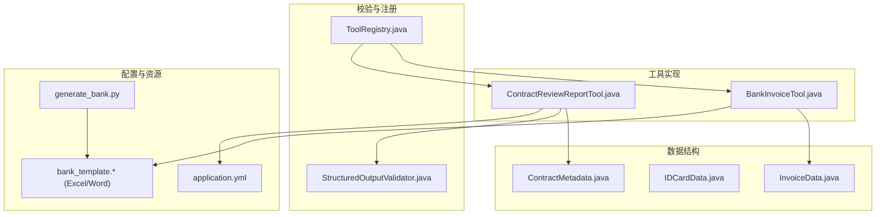
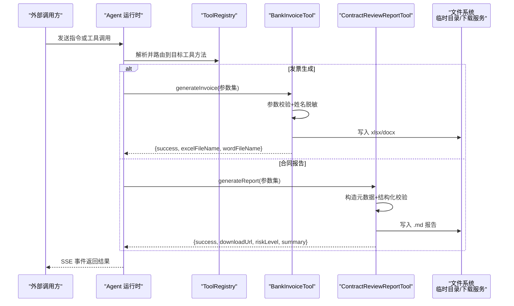
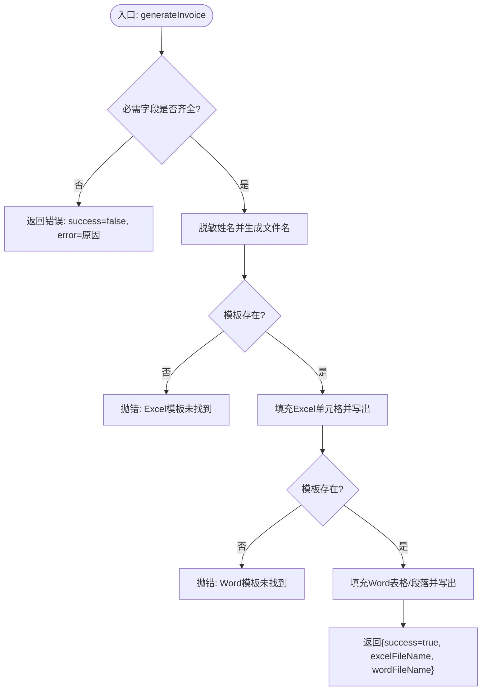
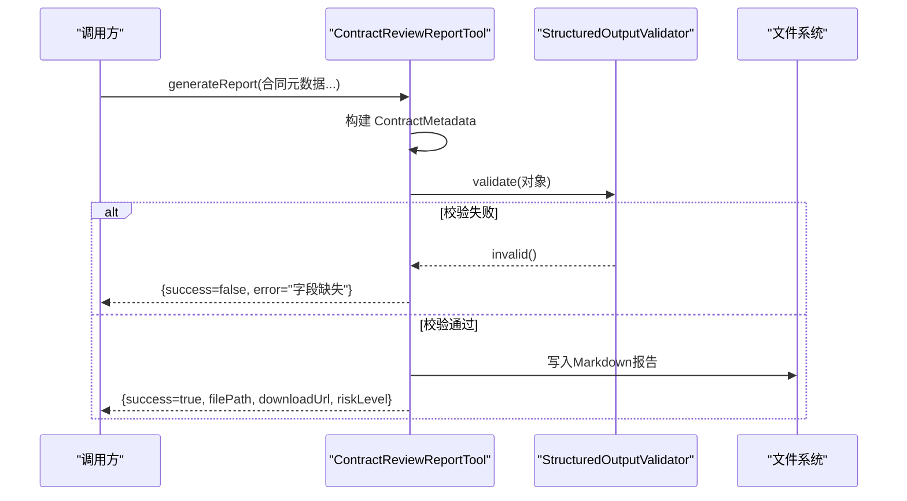
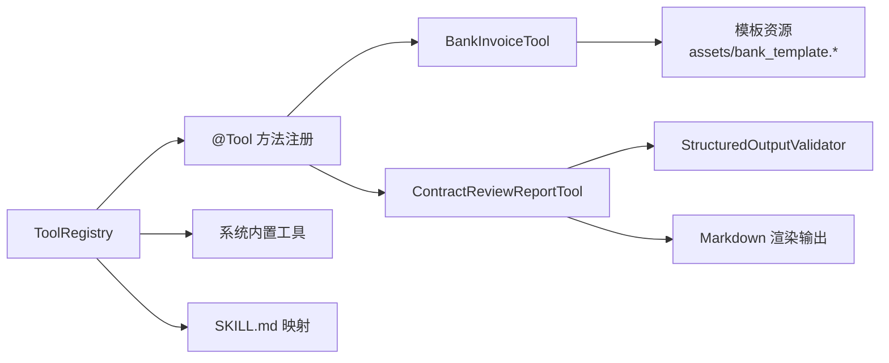

# 业务工具

<cite>
**本文件中引用的文件**
- [BankInvoiceTool.java](file://src/main/java/com/skloda/agentscope/tool/BankInvoiceTool.java)
- [ContractReviewReportTool.java](file://src/main/java/com/skloda/agentscope/tool/ContractReviewReportTool.java)
- [InvoiceData.java](file://src/main/java/com/skloda/agentscope/schema/InvoiceData.java)
- [IDCardData.java](file://src/main/java/com/skloda/agentscope/schema/IDCardData.java)
- [ContractMetadata.java](file://src/main/java/com/skloda/agentscope/schema/ContractMetadata.java)
- [StructuredOutputValidator.java](file://src/main/java/com/skloda/agentscope/runtime/StructuredOutputValidator.java)
- [ToolRegistry.java](file://src/main/java/com/skloda/agentscope/tool/ToolRegistry.java)
- [application.yml](file://src/main/resources/application.yml)
- [SKILL.md（bank_invoice_java）](file://src/main/resources/skills/bank_invoice_java/SKILL.md)
- [SKILL.md（bank_invoice）](file://src/main/resources/skills/bank_invoice/SKILL.md)
- [generate_bank.py](file://src/main/resources/skills/bank_invoice/scripts/generate_bank.py)
- [BankInvoiceToolTest.java](file://src/test/java/com/skloda/agentscope/tool/BankInvoiceToolTest.java)
- [ContractReviewReportToolTest.java](file://src/test/java/com/skloda/agentscope/tool/ContractReviewReportToolTest.java)
- [KnowledgeProperties.java](file://src/main/java/com/skloda/agentscope/service/KnowledgeProperties.java)
- [README.md](file://README.md)
</cite>

## 目录
1. [简介](#简介)
2. [项目结构](#项目结构)
3. [核心组件](#核心组件)
4. [架构总览](#架构总览)
5. [组件详细分析](#组件详细分析)
6. [依赖关系分析](#依赖关系分析)
7. [性能考虑](#性能考虑)
8. [故障排查指南](#故障排查指南)
9. [结论](#结论)
10. [附录](#附录)

## 简介
本文档面向企业级 Agent 系统中的“业务工具”子系统，围绕两类典型工具进行深入技术说明：
- 银行发票生成工具：基于 Excel/Word 模板填充、个人敏感信息脱敏、文件名自动生成及业务参数校验，输出可下载文件。
- 合同审查报告工具：将结构化元数据渲染为 Markdown 报告，完成基本验证与安全输出控制，并提供下载链接。

此外，文档说明了业务工具与系统其他组件的集成点（配置管理、模板资源、输出存储、权限与安全）、部署配置建议、性能调优要点和故障诊断流程，并配套业务流程图与使用示例。

**章节来源**
- [README.md:147-167](file://README.md#L147-L167)

## 项目结构
业务工具位于 agent 的工具层，通过注解方式暴露为工具方法，由工具注册中心自动发现并注入到 Agent 运行时。相关资产包括：
- 工具实现：BankInvoiceTool、ContractReviewReportTool
- 结构化数据模型：InvoiceData、IDCardData、ContractMetadata
- 校验器：StructuredOutputValidator
- 工具注册与技能映射：ToolRegistry 扫描 @Tool 注解与 SKILL.md frontmatter
- 配置文件：application.yml 定义模型、工具开关、会话与知识等
- 模板与脚本：bank_invoice_java/assets 下的 bank_template.xlsx/docx；bank_invoice/scripts/generate_bank.py（Python 版辅助生成）

**图表来源**
- [BankInvoiceTool.java:52-166](file://src/main/java/com/skloda/agentscope/tool/BankInvoiceTool.java#L52-L166)
- [ContractReviewReportTool.java:31-86](file://src/main/java/com/skloda/agentscope/tool/ContractReviewReportTool.java#L31-L86)
- [InvoiceData.java:8-37](file://src/main/java/com/skloda/agentscope/schema/InvoiceData.java#L8-L37)
- [IDCardData.java:6-19](file://src/main/java/com/skloda/agentscope/schema/IDCardData.java#L6-L19)
- [ContractMetadata.java:8-43](file://src/main/java/com/skloda/agentscope/schema/ContractMetadata.java#L8-L43)
- [StructuredOutputValidator.java:16-99](file://src/main/java/com/skloda/agentscope/runtime/StructuredOutputValidator.java#L16-L99)
- [ToolRegistry.java:71-200](file://src/main/java/com/skloda/agentscope/tool/ToolRegistry.java#L71-L200)
- [application.yml:1-90](file://src/main/resources/application.yml#L1-L90)
- [SKILL.md（bank_invoice_java）:24-25](file://src/main/resources/skills/bank_invoice_java/SKILL.md#L24-L25)
- [SKILL.md（bank_invoice）:25-26](file://src/main/resources/skills/bank_invoice/SKILL.md#L25-L26)
- [generate_bank.py:217-218](file://src/main/resources/skills/bank_invoice/scripts/generate_bank.py#L217-L218)

**章节来源**
- [application.yml:25-90](file://src/main/resources/application.yml#L25-L90)
- [ToolRegistry.java:30-44](file://src/main/java/com/skloda/agentscope/tool/ToolRegistry.java#L30-L44)

## 核心组件
本节聚焦两类业务工具的输入、处理与输出机制，以及安全与校验策略。

- 银行发票生成工具（BankInvoiceTool）
  - 功能：读取 Excel/Word 模板，填充实例数据后输出两个文件（xlsx 与 docx）。
  - 关键路径：从 classpath 加载模板、写入系统临时目录下的 agentscope-uploads 子目录。
  - 敏感信息保护：对姓名进行脱敏（首字符保留，其余替换为占位符），用于文件名生成。
  - 文件名规则：前缀 + 脱敏姓名 + 日期 + 流水号 + 扩展名。
  - 业务校验：必填字段校验（如客户姓名、身份证号、流水号等）；失败时返回错误提示。
  
- 合同审查报告工具（ContractReviewReportTool）
  - 功能：接收扁平化的合同元数据，构建 ContractMetadata 对象并进行结构化校验。
  - 模板处理：将元数据渲染为 Markdown 文本，保存至临时目录，同时提供 /chat/download?fileId=... 下载链接。
  - 格式输出：支持金额与币种组合、风险等级、摘要等字段的格式化与默认值填充。
  - 安全输出：统一错误消息封装，避免原始异常泄露。

**章节来源**
- [BankInvoiceTool.java:24-47](file://src/main/java/com/skloda/agentscope/tool/BankInvoiceTool.java#L24-L47)
- [BankInvoiceTool.java:52-166](file://src/main/java/com/skloda/agentscope/tool/BankInvoiceTool.java#L52-L166)
- [ContractReviewReportTool.java:31-86](file://src/main/java/com/skloda/agentscope/tool/ContractReviewReportTool.java#L31-L86)
- [ContractReviewReportTool.java:105-166](file://src/main/java/com/skloda/agentscope/tool/ContractReviewReportTool.java#L105-L166)

## 架构总览
业务工具在企业系统中承担“输入→验证→模板处理→输出→访问”的闭环。Agent 运行时通过 ToolRegistry 自动发现并注册工具方法，调用时执行校验与文件生成，最终通过统一的文件下载服务对外暴露。

**图表来源**
- [ToolRegistry.java:71-118](file://src/main/java/com/skloda/agentscope/tool/ToolRegistry.java#L71-L118)
- [BankInvoiceTool.java:194-220](file://src/main/java/com/skloda/agentscope/tool/BankInvoiceTool.java#L194-L220)
- [ContractReviewReportTool.java:31-86](file://src/main/java/com/skloda/agentscope/tool/ContractReviewReportTool.java#L31-L86)

## 组件详细分析

### BankInvoiceTool：银行发票生成工具
- 模板资源：Excel/Word 模板存放于 skills/bank_invoice_java/assets 下，运行期通过 classpath 加载。若缺失则抛出自定义异常。
- Excel 生成流程：
  - 从模板工作簿读取第一个 sheet 的第 2 行作为数据起始行，按列映射填入客户基本信息及财务字段。
  - 空单元格安全创建并设置字符串值，避免空指针。
  - 写入输出目录（System.getProperty("java.io.tmpdir") + "/agentscope-uploads"），并记录成功日志。
- Word 生成流程：
  - 打开模板文档，定位首个表格，按行列坐标填充联系人、邮箱、发票金额、费用类型等。
  - 查找段落中包含特定标记（提交日期：）并清空 runs 后写回新时间。
  - 同样保存至指定输出目录。
- 敏感信息与命名：
  - 姓名脱敏：首字符保留，后续字符用占位符替代，保证文件名不包含完整真实姓名。
  - 文件名模式：以银行名称前缀、脱敏姓名、日期、流水号、扩展名组成。
- 业务参数校验：
  - 必填项包含客户姓名、身份证号、流水号等；任一为空将返回错误结果。
  - 测试用例覆盖空值拒绝与文件生成的双场景。

**图表来源**
- [BankInvoiceTool.java:52-166](file://src/main/java/com/skloda/agentscope/tool/BankInvoiceTool.java#L52-L166)

**章节来源**
- [BankInvoiceTool.java:52-97](file://src/main/java/com/skloda/agentscope/tool/BankInvoiceTool.java#L52-L97)
- [BankInvoiceTool.java:114-166](file://src/main/java/com/skloda/agentscope/tool/BankInvoiceTool.java#L114-L166)
- [BankInvoiceTool.java:194-220](file://src/main/java/com/skloda/agentscope/tool/BankInvoiceTool.java#L194-L220)
- [BankInvoiceToolTest.java:19-58](file://src/test/java/com/skloda/agentscope/tool/BankInvoiceToolTest.java#L19-L58)

### ContractReviewReportTool：合同审查报告工具
- 输入参数：合同标题、编号、双方名称、生效/到期日、金额/币种、关键条款摘要、风险摘要、总体风险等级、综合摘要等。
- 数据处理：
  - 组装 ContractMetadata 对象，并以 List 形式嵌入条目（例如关键条款、风险与建议）。
  - 通过 StructuredOutputValidator 对结构化数据进行必填字段校验。
- 输出处理：
  - 将对象渲染为 Markdown 文本，含基本信息、风险、条款与建议板块。
  - 保存至临时目录，返回成功标志、文件路径、URL 下载链接及风险等级等。
- 安全性：
  - 统一错误包装，不直接抛出异常堆栈，避免泄露内部细节。
  - URL 使用编码后的文件名，便于浏览器正确下载。

**图表来源**
- [ContractReviewReportTool.java:31-86](file://src/main/java/com/skloda/agentscope/tool/ContractReviewReportTool.java#L31-L86)
- [ContractReviewReportTool.java:105-166](file://src/main/java/com/skloda/agentscope/tool/ContractReviewReportTool.java#L105-L166)
- [StructuredOutputValidator.java:16-99](file://src/main/java/com/skloda/agentscope/runtime/StructuredOutputValidator.java#L16-L99)
- [ContractReviewReportToolTest.java:19-57](file://src/test/java/com/skloda/agentscope/tool/ContractReviewReportToolTest.java#L19-L57)

**章节来源**
- [ContractReviewReportTool.java:31-86](file://src/main/java/com/skloda/agentscope/tool/ContractReviewReportTool.java#L31-L86)
- [ContractReviewReportTool.java:105-166](file://src/main/java/com/skloda/agentscope/tool/ContractReviewReportTool.java#L105-L166)

## 依赖关系分析
- 工具注册机制：
  - ToolRegistry 启动时扫描 com.skloda.agentscope.tool 包，提取所有带 @Tool 的方法并注册为可用工具函数。
  - 同时扫描 framework 内置工具类（文件读写、Shell 命令等），若扫描失败则显式加载。
  - 解析 skills/*/SKILL.md 的 YAML frontmatter，建立“技能名 → 工具列表”的映射，并在 ToolRegistry 中登记技能别名，便于上层按技能调度。
- 资源与配置：
  - application.yml 开启工具能力、配置会话存储路径、模型 provider 等。
  - 知识库属性 KnowledgeProperties 在应用启动时可启用本地索引与分割策略。
- 模板资源：
  - bank_invoice_java/assets/bank_template.xlsx/docx 被工具代码引用，缺少时会报错。
  - Python 脚本版本用于演示或兼容旧路径（skills/bank_invoice/scripts/generate_bank.py）。

**图表来源**
- [ToolRegistry.java:71-200](file://src/main/java/com/skloda/agentscope/tool/ToolRegistry.java#L71-L200)
- [BankInvoiceTool.java:52-166](file://src/main/java/com/skloda/agentscope/tool/BankInvoiceTool.java#L52-L166)
- [ContractReviewReportTool.java:31-86](file://src/main/java/com/skloda/agentscope/tool/ContractReviewReportTool.java#L31-L86)

**章节来源**
- [ToolRegistry.java:71-200](file://src/main/java/com/skloda/agentscope/tool/ToolRegistry.java#L71-L200)
- [KnowledgeProperties.java:8-21](file://src/main/java/com/skloda/agentscope/service/KnowledgeProperties.java#L8-L21)

## 性能考虑
- I/O 优化：
  - Excel/Word 模板流式加载，使用 try-with-resources 关闭流，避免内存泄漏。
  - 输出目录固定为系统临时目录的统一子目录，减少随机路径带来的开销，便于缓存与清理。
- 校验前置：
  - 参数校验在入参阶段尽早返回错误，降低无效模板处理开销。
- 渲染成本：
  - Markdown 报告渲染采用 StringBuilder 顺序追加，避免多次字符串拼接导致的分配与拷贝。
- 并发安全：
  - ToolRegistry 使用并发容器维护注册表，适合多线程环境下高频工具调度。
- 可观测性：
  - 关键日志记录模板路径、文件生成结果与异常，便于生产排障。

[无具体文件分析引用]

## 故障排查指南
- 模板缺失问题
  - 现象：工具抛出异常，提示 Excel/Word 模板文件未找到。
  - 原因：classpath 下 skills/bank_invoice_java/assets 中的模板不存在或被移除。
  - 处理：确保模板存在于指定路径并在打包时将 resources 包含进入 classpath。
- 参数校验失败
  - 现象：返回 success=false 并附带错误信息（如必填字段缺失）。
  - 原因：调用端未传入必要参数或传值为空。
  - 处理：依据错误提示补齐字段；参考单元测试用例检查参数组合。
- 文件写入失败
  - 现象：工具无法写出文件或返回路径无效。
  - 原因：临时目录不可写、权限不足、磁盘空间不足。
  - 处理：调整目录权限或更换输出路径；关注 JVM 启动参数的 java.io.tmpdir 配置。
- 下载链接不可用
  - 现象：downloadUrl 无法获取文件。
  - 原因：前端与服务端的 fileId/fileName 不一致或未持久化到期望目录。
  - 处理：确认文件生成位置与后端下载端点的映射逻辑一致。

**章节来源**
- [BankInvoiceTool.java:57-61](file://src/main/java/com/skloda/agentscope/tool/BankInvoiceTool.java#L57-L61)
- [BankInvoiceTool.java:117-121](file://src/main/java/com/skloda/agentscope/tool/BankInvoiceTool.java#L117-L121)
- [BankInvoiceToolTest.java:19-41](file://src/test/java/com/skloda/agentscope/tool/BankInvoiceToolTest.java#L19-L41)
- [ContractReviewReportToolTest.java:19-28](file://src/test/java/com/skloda/agentscope/tool/ContractReviewReportToolTest.java#L19-L28)

## 结论
本项目通过标准化的工具层设计与清晰的资源、配置边界，实现了可复用的银行业务工具与合同审查报告生成能力。其优势在于：
- 模板驱动的高可扩展性：新增模板只需补充 assets，无需改动核心逻辑。
- 强校验与数据安全：严格参数校验、敏感信息脱敏、统一错误封装。
- 易集成与易用性：自动发现与注册工具，Agent 运行时无缝接入，API 简洁明确。

建议在正式上线前完善：
- 模板资源的自动化校验与监控告警
- 输出文件的持久化策略与生命周期管理
- 更严格的权限控制与会话隔离（结合已有的中间件与权限上下文）
- 性能压测与内存占用评估

[无具体文件分析引用]

## 附录

### 配置文件与模板资源管理
- 应用配置
  - 启用工具、设置会话存储、知识索引与模型配置等，详见 application.yml。
- 模板资源
  - Excel/Word 模板位于 skills/bank_invoice_java/assets，Python 脚本版本位于 skills/bank_invoice/scripts。
  - SKILL.md 的 frontmatter 定义了技能名称、描述与工具集合，供 ToolRegistry 动态绑定。
- 知识库
  - KnowledgeProperties 配置本地知识库路径、向量模型维度、分片策略与是否启动自索引等。

**章节来源**
- [application.yml:1-90](file://src/main/resources/application.yml#L1-L90)
- [SKILL.md（bank_invoice_java）:24-25](file://src/main/resources/skills/bank_invoice_java/SKILL.md#L24-L25)
- [SKILL.md（bank_invoice）:25-26](file://src/main/resources/skills/bank_invoice/SKILL.md#L25-L26)
- [KnowledgeProperties.java:8-21](file://src/main/java/com/skloda/agentscope/service/KnowledgeProperties.java#L8-L21)

### 安全特性与最佳实践
- 输入验证
  - 工具入口进行必填字段校验，快速失败，防止非法数据进入模板处理链。
  - 结构化输出经 Validator 统一校验，避免脏数据进入报告渲染。
- 权限与数据隔离
  - 建议结合系统现有的权限上下文（如 PermissionContextFactory）在工具执行前后注入操作主体身份，实施细粒度访问控制。
  - 输出文件建议按用户会话隔离目录（当前统一置于临时目录的子文件夹），在生产环境进一步细化权限与配额。
- 数据安全
  - 文件名脱敏、敏感信息不在模板内明文落盘（仅在内存填充）。
  - 错误响应封装，不泄露内部异常或路径等细节。

**章节来源**
- [BankInvoiceTool.java:24-47](file://src/main/java/com/skloda/agentscope/tool/BankInvoiceTool.java#L24-L47)
- [ContractReviewReportTool.java:73-85](file://src/main/java/com/skloda/agentscope/tool/ContractReviewReportTool.java#L73-L85)

### 部署配置与运行
- 启动要求
  - Java 17+、Maven 3.9+，配置 DashScope API Key（环境变量 DASHSCOPE_API_KEY 或 application.yml）。
- 启动与访问
  - 使用 Maven 插件或直接 jar 启动，默认监听端口见 application.yml。
- 资源与环境
  - 确保打包时 include resources：skills 目录下的模板与脚本会被随应用分发。
  - 若变更模板路径或输出目录，需在代码与部署环境中同步调整。

**章节来源**
- [README.md:63-92](file://README.md#L63-L92)
- [application.yml:1-24](file://src/main/resources/application.yml#L1-L24)

### 使用场景示例
- 银行发票生成
  - 输入：客户姓名、身份证号、手机号、邮箱、合同号、借据号、放款日期、贷款总额、银行放款金额、费用类型、发票金额、流水号。
  - 输出：excelFileName、wordFileName，并可在临时目录下查看生成的文件。
  - 行为：参数缺失将拒绝生成；姓名在文件名中会被脱敏。
- 合同审查报告生成
  - 输入：合同基本信息、关键条款与风险提示、风险等级、摘要等。
  - 输出：report markdown、filePath、downloadUrl、riskLevel。
  - 行为：结构化数据不完整将返回错误；渲染内容不含机密字段且格式化友好。

**章节来源**
- [README.md:147-167](file://README.md#L147-L167)
- [BankInvoiceToolTest.java:19-58](file://src/test/java/com/skloda/agentscope/tool/BankInvoiceToolTest.java#L19-L58)
- [ContractReviewReportToolTest.java:19-57](file://src/test/java/com/skloda/agentscope/tool/ContractReviewReportToolTest.java#L19-L57)