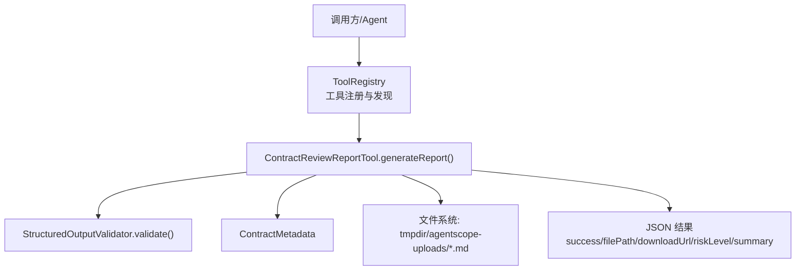
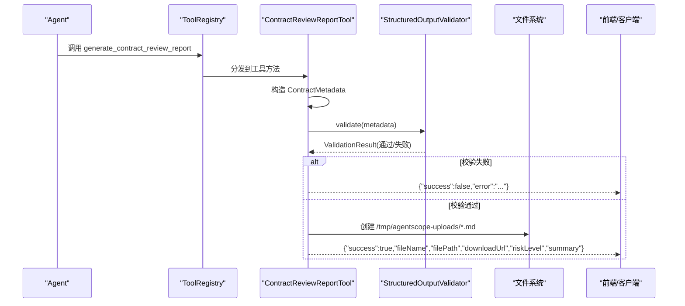
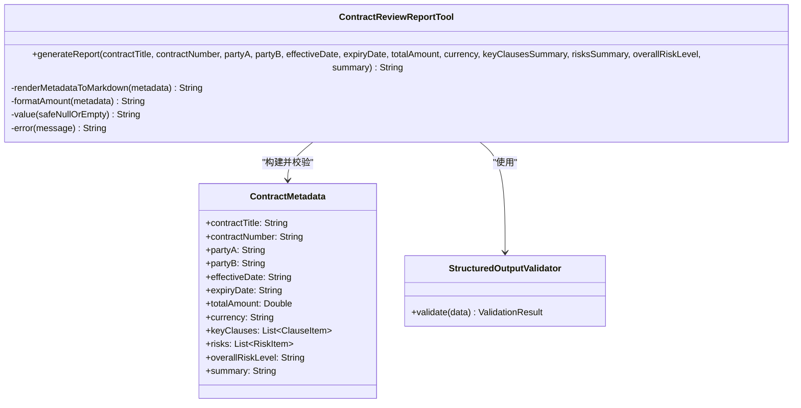
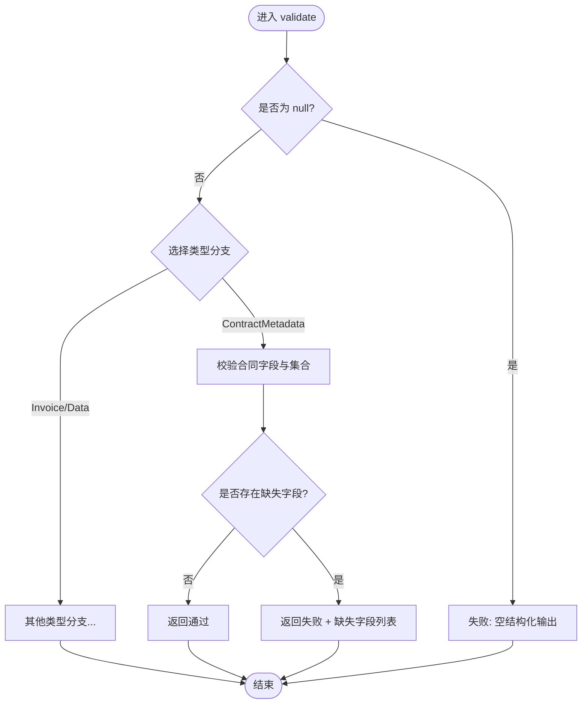
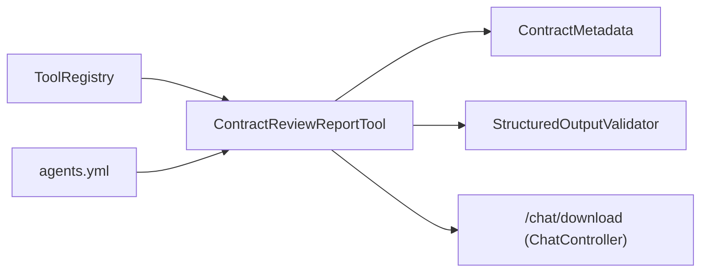

# 合同审查报告工具

<cite>
**本文件引用的来源文件**
- [ContractReviewReportTool.java](file://src/main/java/com/skloda/agentscope/tool/ContractReviewReportTool.java)
- [ContractMetadata.java](file://src/main/java/com/skloda/agentscope/schema/ContractMetadata.java)
- [StructuredOutputValidator.java](file://src/main/java/com/skloda/agentscope/runtime/StructuredOutputValidator.java)
- [ToolRegistry.java](file://src/main/java/com/skloda/agentscope/tool/ToolRegistry.java)
- [agents.yml](file://src/main/resources/config/agents.yml)
- [ChatController.java](file://src/main/java/com/skloda/agentscope/controller/ChatController.java)
- [ContractReviewReportToolTest.java](file://src/test/java/com/skloda/agentscope/tool/ContractReviewReportToolTest.java)
- [ContractMetadataTest.java](file://src/test/java/com/skloda/agentscope/schema/ContractMetadataTest.java)
- [pom.xml](file://pom.xml)
</cite>

## 目录
1. [简介](#简介)
2. [项目结构](#项目结构)
3. [核心组件](#核心组件)
4. [架构总览](#架构总览)
5. [详细组件分析](#详细组件分析)
6. [依赖关系分析](#依赖关系分析)
7. [性能与可伸缩性](#性能与可伸缩性)
8. [故障排查指南](#故障排查指南)
9. [结论](#结论)
10. [附录：使用示例与最佳实践](#附录使用示例与最佳实践)

## 简介
本项目实现了一个基于 AgentScope 的工具：合同审查报告工具。该工具接收扁平化的合同审查字段，构建结构化数据模型，进行严格的结构化输出验证，生成可下载的 Markdown 格式合同审查报告，并返回下载链接、风险等级和审查摘要。工具通过 @Tool 注解注册为 Agent 可调用的工具，并可通过审批中间件配置为需要人工审批后执行的关键操作。

## 项目结构
- 工具类位于 tool 包中，使用 AgentScope 的 @Tool/@ToolParam 注解声明对外 API。
- 数据模型位于 schema 包中，定义 ContractMetadata 及其子项 ClauseItem 和 RiskItem。
- 验证器位于 runtime 包中，提供对 ContractMetadata 的结构化输出校验能力。
- Agent 配置集中在 resources/config/agents.yml，明确启用 userTools、approvalTools 以及工作流提示词。
- 工具注册由 ToolRegistry 自动发现并通过 Spring 上下文实例化工具类。
- 前端脚本在 static/scripts/chat.js 中有对该工具的审批展示特化处理逻辑（仅说明集成存在）。
- 测试用例覆盖工具的参数缺失校验、Markdown 文件生成路径及内容片段。

**图表来源**
- [ToolRegistry.java:71-120](file://src/main/java/com/skloda/agentscope/tool/ToolRegistry.java#L71-L120)
- [ContractReviewReportTool.java:31-85](file://src/main/java/com/skloda/agentscope/tool/ContractReviewReportTool.java#L31-L85)
- [ContractMetadata.java:8-43](file://src/main/java/com/skloda/agentscope/schema/ContractMetadata.java#L8-L43)
- [StructuredOutputValidator.java:16-58](file://src/main/java/com/skloda/agentscope/runtime/StructuredOutputValidator.java#L16-L58)

**章节来源**
- [ContractReviewReportTool.java:20-165](file://src/main/java/com/skloda/agentscope/tool/ContractReviewReportTool.java#L20-L165)
- [ToolRegistry.java:23-200](file://src/main/java/com/skloda/agentscope/tool/ToolRegistry.java#L23-L200)
- [agents.yml:410-435](file://src/main/resources/config/agents.yml#L410-L435)

## 核心组件
- ContractReviewReportTool：工具主入口，负责参数收集、校验、渲染、落盘、返回 JSON 响应。
- ContractMetadata：结构化输出数据载体，包含基本信息、关键条款列表、风险与建议列表、总体风险等级与摘要。
- StructuredOutputValidator：轻量级结构化输出校验器，针对 InvoiceData、IDCardData、ContractMetadata 三类数据执行必填校验。
- ToolRegistry：自动扫描 @Tool 方法，注册工具并支持 Skill 映射，保证运行时工具可用。
- agents.yml：定义 Agent 使用策略，包括启用 generate_contract_review_report 作为 userTools 且加入 approvalTools 以触发审批。

**章节来源**
- [ContractReviewReportTool.java:23-165](file://src/main/java/com/skloda/agentscope/tool/ContractReviewReportTool.java#L23-L165)
- [ContractMetadata.java:8-43](file://src/main/java/com/skloda/agentscope/schema/ContractMetadata.java#L8-L43)
- [StructuredOutputValidator.java:14-99](file://src/main/java/com/skloda/agentscope/runtime/StructuredOutputValidator.java#L14-L99)
- [ToolRegistry.java:71-120](file://src/main/java/com/skloda/agentscope/tool/ToolRegistry.java#L71-L120)
- [agents.yml:410-435](file://src/main/resources/config/agents.yml#L410-L435)

## 架构总览
下图展示了从 Agent 配置到工具执行、校验与文件落盘的完整链路。Agent 在用户指令触发下，经由工具路由调用 generate_contract_review_report，工具内部组装 ContractMetadata，提交给 StructuredOutputValidator 完成结构化校验；通过后写入临时目录下的 Markdown 文件并构造 JSON 结果，同时通过 Web 下载端点暴露文件访问。

**图表来源**
- [ContractReviewReportTool.java:31-85](file://src/main/java/com/skloda/agentscope/tool/ContractReviewReportTool.java#L31-L85)
- [StructuredOutputValidator.java:16-58](file://src/main/java/com/skloda/agentscope/runtime/StructuredOutputValidator.java#L16-L58)

## 详细组件分析

### ContractReviewReportTool（工具主类）
- 职责
  - 接收扁平参数：合同标题、编号、双方主体、生效/到期日期、金额/币种、关键条款摘要、风险摘要、总体风险等级、审查摘要。
  - 将参数装配成 ContractMetadata，并构造 keyClauses、risks 两条默认条目用于最终报告填充。
  - 通过 StructuredOutputValidator 进行结构化输出校验。
  - 将报告以 UTF-8 写入 java.io.tmpdir/agentscope-uploads 目录下按时间命名的 .md 文件。
  - 返回 JSON：成功时包含 fileName、filePath、downloadUrl（URL 编码）、riskLevel、summary；失败时包含 success=false 及错误信息。
  - 异常保护：捕获异常并以统一错误 JSON 返回。
- 设计要点
  - 金额显示采用“金额+币种”拼接，支持空币种情况回退为空字符串。
  - 模板渲染为简易 StringBuilder 组装 Markdown，关键字段空值统一替换为“未提供”，避免空行或无意义占位符。
  - 下载 URL 为相对路径 “/chat/download?fileId=...” 并由 URLEncoder 做安全编码。
- 复杂度
  - 时间复杂度 O(n)，n 为条款和风险条目数，主要为字符串拼接和文件 I/O。
  - 空间复杂度 O(n)，受输出 Markdown 长度影响。
- 错误处理
  - 校验失败：返回带 error 信息的失败 JSON。
  - IO/序列化异常：统一捕获并转换为错误 JSON，便于上层容错与重试。

**图表来源**
- [ContractReviewReportTool.java:31-165](file://src/main/java/com/skloda/agentscope/tool/ContractReviewReportTool.java#L31-L165)
- [ContractMetadata.java:8-43](file://src/main/java/com/skloda/agentscope/schema/ContractMetadata.java#L8-L43)
- [StructuredOutputValidator.java:16-58](file://src/main/java/com/skloda/agentscope/runtime/StructuredOutputValidator.java#L16-L58)

**章节来源**
- [ContractReviewReportTool.java:20-165](file://src/main/java/com/skloda/agentscope/tool/ContractReviewReportTool.java#L20-L165)

### StructuredOutputValidator（结构化输出校验）
- 校验规则
  - 拒绝 null 对象。
  - 针对 ContractMetadata：要求 contractTitle、partyA、partyB 非空文本；keyClauses 和 risks 为非空集合；overallRiskLevel 和 summary 为非空文本。
  - 通用字段类型约束：文本非空白、数值非空、集合非空。
- 扩展性
  - 基于 instanceof 分支支持多类型数据校验；新增 Schema 时需补充对应分支。
- 返回值
  - ValidationResult 包含 valid 标志、缺失字段列表与消息。

**图表来源**
- [StructuredOutputValidator.java:16-58](file://src/main/java/com/skloda/agentscope/runtime/StructuredOutputValidator.java#L16-L58)

**章节来源**
- [StructuredOutputValidator.java:14-99](file://src/main/java/com/skloda/agentscope/runtime/StructuredOutputValidator.java#L14-L99)

### ContractMetadata（数据模型）
- 关键字段
  - 基础信息：contractTitle、contractNumber、partyA、partyB、effectiveDate、expiryDate、totalAmount、currency、signingDate、signingLocation。
  - 结构化集合：keyClauses（条款项列表）、risks（风险项列表）。
  - 综合判断：overallRiskLevel（LOW/MEDIUM/HIGH/CRITICAL）、summary（审查摘要）。
- 嵌套子项
  - ClauseItem：title、summary、category（PAYMENT/DELIVERY/LIABILITY/TERMINATION/CONFIDENTIALITY/OTHER）。
  - RiskItem：clause、description、severity（同风险等级枚举含义）、recommendation。

**章节来源**
- [ContractMetadata.java:8-43](file://src/main/java/com/skloda/agentscope/schema/ContractMetadata.java#L8-L43)
- [ContractMetadataTest.java:11-157](file://src/test/java/com/skloda/agentscope/schema/ContractMetadataTest.java#L11-L157)

### 工具注册与 Agent 配置
- 工具注册
  - ToolRegistry 自动扫描 com.skloda.agentscope.tool 包中的 @Tool 注解方法，并将工具名绑定到类实例 Supplier 上，确保 Agent 可以调用 generate_contract_review_report。
- Agent 配置
  - agents.yml 中定义了任务型 Agent（task-document-analysis）以及其他相关 Agent，其中包含 generate_contract_review_report 作为 userTools，并在特定 Agent 中将此工具加入 approvalTools，以要求在执行前触发人工审批。

**章节来源**
- [ToolRegistry.java:71-120](file://src/main/java/com/skloda/agentscope/tool/ToolRegistry.java#L71-L120)
- [agents.yml:410-435](file://src/main/resources/config/agents.yml#L410-L435)

## 依赖关系分析
- 外部依赖
  - Jackson ObjectMapper：JSON 序列化。
  - Java 标准库：NIO Path、URLEncoder、DateTimeFormatter、Collections。
  - AgentScope 框架：@Tool、@ToolParam、Tool 执行框架。
- 内部依赖
  - Schema：ContractMetadata。
  - Runtime：StructuredOutputValidator。
  - Registry：ToolRegistry（运行期动态注册）。
  - 配置：agents.yml（工具启用与审批策略）。
  - 控制器：ChatController 提供下载接口 /chat/download（工具返回 downloadUrl 指向该端点）。

**图表来源**
- [ToolRegistry.java:71-120](file://src/main/java/com/skloda/agentscope/tool/ToolRegistry.java#L71-L120)
- [ContractReviewReportTool.java:31-85](file://src/main/java/com/skloda/agentscope/tool/ContractReviewReportTool.java#L31-L85)
- [agents.yml:410-435](file://src/main/resources/config/agents.yml#L410-L435)

**章节来源**
- [ToolRegistry.java:23-200](file://src/main/java/com/skloda/agentscope/tool/ToolRegistry.java#L23-L200)
- [pom.xml:28-188](file://pom.xml#L28-L188)

## 性能与可伸缩性
- I/O 性能
  - 单次请求生成单个 Markdown 文件，使用 StringBuilder 顺序写入，适合小中型合同体量；若后续引入大合同分段读取与分页渲染，可考虑流式构建并分片落盘。
- 内存占用
  - 主要内存开销来自 Markdown 文本构建与 JSON 序列化产物；当前设计线性增长，建议限制输入摘要长度以避免内存峰值。
- 并发与安全
  - 工具内使用临时目录聚合多个文件，需确保进程内并发安全的目录创建与文件名去重（已使用时间戳命名，实际生产建议结合 UUID）。
  - 下载 URL 对 fileId 做了 URL 编码，降低非法字符注入风险。
- 可扩展性
  - 校验器可按新增 Schema 类型快速扩展；Markdown 渲染逻辑可按主题或业务需求增加段落模板。

[本节为一般性性能讨论，不直接引用具体代码]

## 故障排查指南
- 常见错误
  - 缺少必填字段：如 missing partyA/partyB/keyClauses/risks/overallRiskLevel/summary。
  - 金额或日期为空：渲染时会显示“未提供”，不影响生成，但建议补全以提升可读性。
  - 文件无法写入：检查 java.io.tmpdir 权限、磁盘空间是否充足。
- 定位方法
  - 查看工具日志输出的错误堆栈（记录于应用日志）。
  - 确认 agents.yml 是否正确将该工具列入 userTools 与 approvalTools（若启用了审批）。
  - 校验返回 JSON 中 success=false 的 error 消息。
- 恢复措施
  - 补齐缺失字段后重试。
  - 确保 /chat/download 接口可用（由 ChatController 提供），并传入正确的 fileId。
  - 如仍报 IO 异常，清理临时目录并重试。

**章节来源**
- [ContractReviewReportTool.java:61-85](file://src/main/java/com/skloda/agentscope/tool/ContractReviewReportTool.java#L61-L85)
- [ContractReviewReportToolTest.java:19-57](file://src/test/java/com/skloda/agentscope/tool/ContractReviewReportToolTest.java#L19-L57)

## 结论
合同审查报告工具围绕“结构化数据→严格校验→可视化报告→可下载资产”的主路径构建，具备清晰的职责边界、可靠的错误处理机制与可观测的集成点（ToolRegistry、agents.yml 审批策略）。其轻量、易扩展的实现方式，使得未来可增加更丰富的报表样式、更细粒度的校验规则和更强大的数据源接入。

[本节为总结性内容，不直接引用具体代码]

## 附录：使用示例与最佳实践

### 工具用法要点
- 参数传递
  - 必需字段：contractTitle、partyA、partyB、keyClausesSummary、risksSummary、overallRiskLevel、summary。
  - 可选字段：contractNumber、effectiveDate、expiryDate、totalAmount、currency。
  - 金额/币种：若 totalAmount 为 null，不会报错，渲染显示“未提供”。
  - 风险等级：LOW、MEDIUM、HIGH、CRITICAL（任意字符串均可校验通过，建议按约定使用）。
- 返回结果解析
  - success=true：包含 fileName、filePath、downloadUrl、riskLevel、summary。
  - success=false：包含 error 提示信息（例如缺字段）。
- Agent 集成
  - 在 agents.yml 中将该工具加入 userTools；如启用审批，加入 approvalTools 以强制人工确认后再写文件。
  - 工具名：generate_contract_review_report。

**章节来源**
- [ContractReviewReportTool.java:31-85](file://src/main/java/com/skloda/agentscope/tool/ContractReviewReportTool.java#L31-L85)
- [agents.yml:410-435](file://src/main/resources/config/agents.yml#L410-L435)

### 结构化数据设计与渲染
- 数据结构
  - ContractMetadata 聚合基础信息与两类核心列表：keyClauses（条款摘要）与 risks（风险与建议）。
  - 每条风险建议都包含 severity（严重度）、description（描述）和 recommendation（建议）。
- Markdown 渲染逻辑
  - 标题区块：合同基本信息、总体风险、关键条款、风险与建议。
  - 金额显示：总金额+币种（空币种则仅为金额），空值统一显示“未提供”。
  - 列表渲染：以 Markdown 无序列表组织条款与风险，提升可读性。

**章节来源**
- [ContractMetadata.java:8-43](file://src/main/java/com/skloda/agentscope/schema/ContractMetadata.java#L8-L43)
- [ContractReviewReportTool.java:105-157](file://src/main/java/com/skloda/agentscope/tool/ContractReviewReportTool.java#L105-L157)

### 集成审批与前端展示
- 审批配置
  - 在 agents.yml 中将 generate_contract_review_report 添加至 approvalTools，即可在流程中触发人工审批。
- 前端处理
  - 前端 chat.js 针对该工具名称做审批摘要的特殊渲染，提升审核体验。

**章节来源**
- [agents.yml:410-435](file://src/main/resources/config/agents.yml#L410-L435)
- [static/scripts/chat.js:998-1065](file://src/main/resources/static/scripts/chat.js#L998-L1065)

### 测试断言与质量保障
- 单元测试覆盖了两大场景：
  - 缺失必要字段时，返回 success=false 且 error 包含缺失字段名。
  - 正常路径生成 Markdown 文件，路径正确且内容包含预期片段（标题、合同名、风险描述等）。
- 数据模型测试覆盖了构造、字段赋值与枚举取值范围。

**章节来源**
- [ContractReviewReportToolTest.java:19-57](file://src/test/java/com/skloda/agentscope/tool/ContractReviewReportToolTest.java#L19-L57)
- [ContractMetadataTest.java:11-157](file://src/test/java/com/skloda/agentscope/schema/ContractMetadataTest.java#L11-L157)