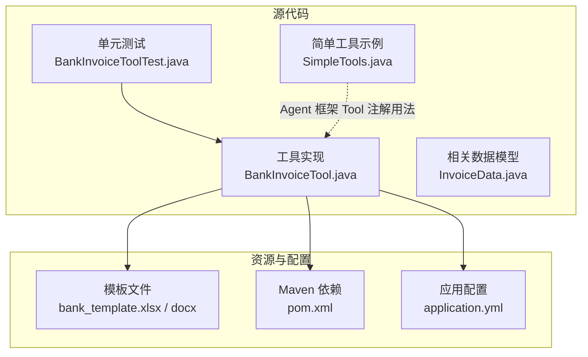
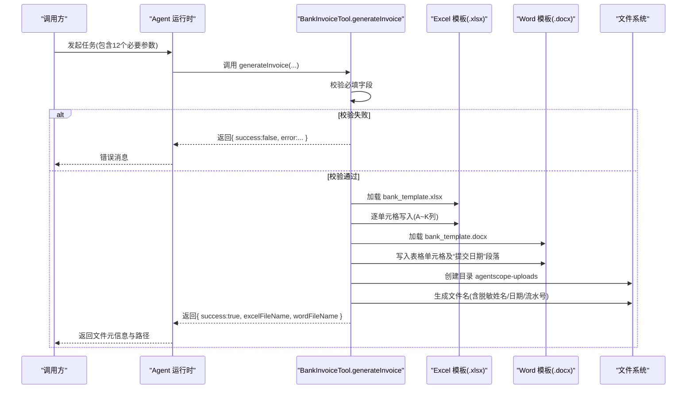
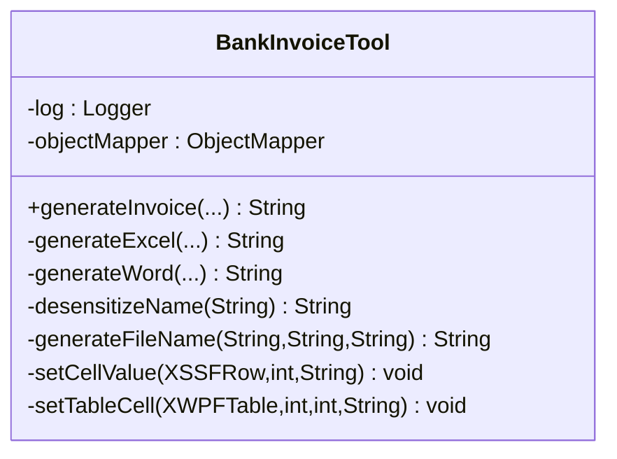
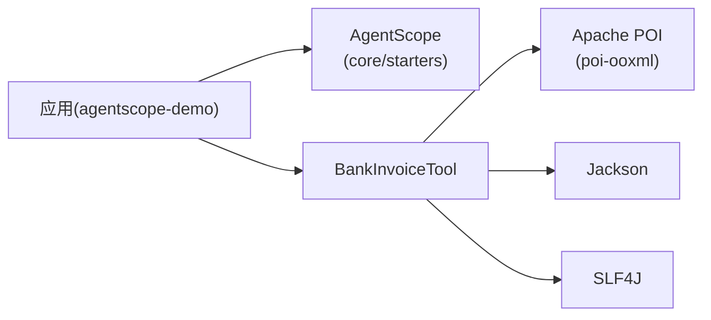

# 银行发票生成工具

<cite>
**本文引用的文件**
- [BankInvoiceTool.java](file://src/main/java/com/skloda/agentscope/tool/BankInvoiceTool.java)
- [BankInvoiceToolTest.java](file://src/test/java/com/skloda/agentscope/tool/BankInvoiceToolTest.java)
- [InvoiceData.java](file://src/main/java/com/skloda/agentscope/schema/InvoiceData.java)
- [SimpleTools.java](file://src/main/java/com/skloda/agentscope/tool/SimpleTools.java)
- [pom.xml](file://pom.xml)
- [application.yml](file://src/main/resources/application.yml)
- [README.md](file://README.md)
</cite>

## 目录
1. [简介](#简介)
2. [项目结构](#项目结构)
3. [核心组件](#核心组件)
4. [架构总览](#架构总览)
5. [详细组件分析](#详细组件分析)
6. [依赖关系分析](#依赖关系分析)
7. [性能考虑](#性能考虑)
8. [故障排除指南](#故障排除指南)
9. [结论](#结论)
10. [附录：调用示例与参数说明](#附录调用示例与参数说明)

## 简介
银行发票生成工具是一个面向 AgentScope 的 Java 工具方法，用于基于预置模板自动生成 Excel（.xlsx）和 Word（.docx）两类发票文件，同时支持对个人敏感信息进行脱敏处理并规范文件名生成。其目标是为“XX银行”场景提供安全、可追溯、易集成的自动化票据文件产出能力。

主要特性
- 双格式输出：基于 Apache POI 的 XSSFWorkbook 和 XWPFDocument 分别生成 .xlsx 与 .docx
- 姓名脱敏：保留首字符，其余替换为“某”，并在文件名中体现
- 自动日期：Word 提交日期使用当前日期；Excel 文件名采用两位年月日
- 固定输出目录：统一写入到 java.io.tmpdir/agentscope-uploads
- AgentScope 工具集成：通过 @Tool/@ToolParam 暴露工具方法，供 Agent 编排调用

## 项目结构
围绕该工具的相关代码和资源位于以下位置：
- 工具实现：src/main/java/com/skloda/agentscope/tool/BankInvoiceTool.java
- 单元测试：src/test/java/com/skloda/agentscope/tool/BankInvoiceToolTest.java
- 数据结构（相关）：src/main/java/com/skloda/agentscope/schema/InvoiceData.java
- 依赖声明：pom.xml
- 应用配置：src/main/resources/application.yml
- 模板资源路径：skills/bank_invoice_java/assets/{bank_template.xlsx,bank_template.docx}
- 其他工具参考（AgentScope 用法）：src/main/java/com/skloda/agentscope/tool/SimpleTools.java

图表来源
- [BankInvoiceTool.java:1-200](file://src/main/java/com/skloda/agentscope/tool/BankInvoiceTool.java#L1-L200)
- [BankInvoiceToolTest.java:1-60](file://src/test/java/com/skloda/agentscope/tool/BankInvoiceToolTest.java#L1-L60)
- [InvoiceData.java:1-38](file://src/main/java/com/skloda/agentscope/schema/InvoiceData.java#L1-L38)
- [SimpleTools.java:1-45](file://src/main/java/com/skloda/agentscope/tool/SimpleTools.java#L1-L45)
- [pom.xml:76-81](file://pom.xml#L76-L81)
- [application.yml:1-90](file://src/main/resources/application.yml#L1-L90)

章节来源
- [BankInvoiceTool.java:1-200](file://src/main/java/com/skloda/agentscope/tool/BankInvoiceTool.java#L1-L200)
- [BankInvoiceToolTest.java:1-60](file://src/test/java/com/skloda/agentscope/tool/BankInvoiceToolTest.java#L1-L60)
- [InvoiceData.java:1-38](file://src/main/java/com/skloda/agentscope/schema/InvoiceData.java#L1-L38)
- [SimpleTools.java:1-45](file://src/main/java/com/skloda/agentscope/tool/SimpleTools.java#L1-L45)
- [pom.xml:76-81](file://pom.xml#L76-L81)
- [application.yml:1-90](file://src/main/resources/application.yml#L1-L90)

## 核心组件
- BankInvoiceTool：封装模板加载、数据填充、文件落盘、异常与日志记录，并通过 @Tool(name="generate_bank_invoice") 暴露给 Agent 系统调用。
- 模板资源：resources/skills/bank_invoice_java/assets 下的 .xlsx/.docx 模板文件，用于注入固定表头、样式与表格结构。
- AgentScope 集成：遵循 @Tool/@ToolParam 注解规范，由 Agent 运行时在工具注册中心发现并调用。
- 输出管理：统一输出目录 java.io.tmpdir/agentscope-uploads，按规则生成唯一文件名并持久化。

章节来源
- [BankInvoiceTool.java:19-200](file://src/main/java/com/skloda/agentscope/tool/BankInvoiceTool.java#L19-L200)
- [application.yml:1-90](file://src/main/resources/application.yml#L1-L90)

## 架构总览
下图展示一次“生成银行发票”的典型调用流程：外部客户端 → Agent → 工具方法 → 模板解析 → 文件输出。

图表来源
- [BankInvoiceTool.java:49-98](file://src/main/java/com/skloda/agentscope/tool/BankInvoiceTool.java#L49-L98)
- [BankInvoiceTool.java:111-166](file://src/main/java/com/skloda/agentscope/tool/BankInvoiceTool.java#L111-L166)
- [BankInvoiceToolTest.java:43-58](file://src/test/java/com/skloda/agentscope/tool/BankInvoiceToolTest.java#L43-L58)

## 详细组件分析

### BankInvoiceTool：实现要点
- 个人信息脱敏
  - 规则：保留姓名首字符，其余用“某”替代；单字符时追加一个“某”；空值回退为“某某某”。
- 文件名生成规则
  - 形式：XX银行_{脱敏姓名}_{YYMMDD}_{流水号}.{扩展名}
  - 日期：两位年月日；扩展名根据输出类型 xlsx/docx。
- Excel 模板填充（Apache POI XSSFWorkbook）
  - 模板路径：skills/bank_invoice_java/assets/bank_template.xlsx
  - 写入行：第2行（索引1），列 A-K 对应客户姓名、身份证号、电话、合同号、借据号、放款日期、贷款总额、银行放款金额、费用类型、发票金额、邮箱。
  - 空白列保护：若单元格不存在则创建后写入，避免空指针。
- Word 模板填充（Apache POI XWPFDocument）
  - 模板路径：skills/bank_invoice_java/assets/bank_template.docx
  - 写入表格：读取第一个表格，对指定行列单元格的段落进行清理并重写文本，避免残留格式导致渲染异常。
  - 提交日期：定位包含“提交日期：”的段落，清空原有 run 并插入新段落内容。
- 文件输出路径管理
  - 根目录：java.io.tmpdir
  - 子目录：agentscope-uploads（按需创建）
  - 文件名：严格遵循脱敏+日期+流水号规则，确保同一批订单不会产生命名冲突。
- 异常与日志
  - 缺失模板或 Word 无表格时抛出特定 IllegalStateException，便于定位问题。
  - 单元格/表格边界不足时记录警告日志并跳过填充，保证主流程健壮性。
  - 文件写入完成后记录成功日志，包含最终输出路径。
- 工具注解与参数
  - 方法：@Tool(name = "generate_bank_invoice", description = "...")
  - 入参：12 个 @ToolParam 标注的必要参数（详见附录）。

章节来源
- [BankInvoiceTool.java:24-47](file://src/main/java/com/skloda/agentscope/tool/BankInvoiceTool.java#L24-L47)
- [BankInvoiceTool.java:49-98](file://src/main/java/com/skloda/agentscope/tool/BankInvoiceTool.java#L49-L98)
- [BankInvoiceTool.java:111-166](file://src/main/java/com/skloda/agentscope/tool/BankInvoiceTool.java#L111-L166)
- [BankInvoiceTool.java:168-192](file://src/main/java/com/skloda/agentscope/tool/BankInvoiceTool.java#L168-L192)
- [BankInvoiceTool.java:194-200](file://src/main/java/com/skloda/agentscope/tool/BankInvoiceTool.java#L194-L200)

#### 类与方法关系图

图表来源
- [BankInvoiceTool.java:15-200](file://src/main/java/com/skloda/agentscope/tool/BankInvoiceTool.java#L15-L200)

### 数据映射策略
- Excel 写入顺序：A~K 列分别对应 客户姓名/身份证号/联系电话/合同号/借据号/放款日期/贷款总额/银行放款金额/费用类型/发票金额/邮箱。
- Word 写入位置：
  - 表格 [行1,列1]：名称（客户姓名）
  - 表格 [行1,列3]：纳税人识别号（此处传入身份证号）
  - 表格 [行4,列1]：联系人及电话（姓名+空格+电话拼接）
  - 表格 [行4,列3]：邮箱
  - 表格 [行8,列1]：发票金额
  - 表格 [行9,列1]：费用类型
- 段落替换：
  - “提交日期：”所在段落将被重写为“提交日期：YYYY-MM-DD”。

章节来源
- [BankInvoiceTool.java:67-83](file://src/main/java/com/skloda/agentscope/tool/BankInvoiceTool.java#L67-L83)
- [BankInvoiceTool.java:132-151](file://src/main/java/com/skloda/agentscope/tool/BankInvoiceTool.java#L132-L151)

### 安全性与数据安全
- 姓名脱敏：所有生成的文件名中的姓名均进行脱敏，避免直接外泄完整姓名。
- 单元格安全写入：未找到单元格则动态创建后再赋值，避免潜在的空引用；对 Word 段落先清空再写入，防止模板遗留内容泄露。
- 输入校验：测试覆盖了必填项为空时的拒绝行为（如姓名、身份证、流水号）。

章节来源
- [BankInvoiceTool.java:24-47](file://src/main/java/com/skloda/agentscope/tool/BankInvoiceTool.java#L24-L47)
- [BankInvoiceTool.java:100-109](file://src/main/java/com/skloda/agentscope/tool/BankInvoiceTool.java#L100-L109)
- [BankInvoiceTool.java:168-192](file://src/main/java/com/skloda/agentscope/tool/BankInvoiceTool.java#L168-L192)
- [BankInvoiceToolTest.java:19-41](file://src/test/java/com/skloda/agentscope/tool/BankInvoiceToolTest.java#L19-L41)

### 模板文件加载机制
- 从 Classpath 加载：通过 getClassLoader().getResourceAsStream() 读取 skills/bank_invoice_java/assets 下的模板文件。
- 缺失处理：若模板流为空，立即抛出带有明确提示的异常（包含具体资源路径），快速定位缺失问题。
- 打开方式：
  - Excel：XSSFWorkbook 读取 .xlsx
  - Word：XWPFDocument 读取 .docx

章节来源
- [BankInvoiceTool.java:52-64](file://src/main/java/com/skloda/agentscope/tool/BankInvoiceTool.java#L52-L64)
- [BankInvoiceTool.java:114-124](file://src/main/java/com/skloda/agentscope/tool/BankInvoiceTool.java#L114-L124)

### 与 AgentScope 集成方式
- 注解规范
  - 工具方法使用 @Tool 注解暴露 name 与 description，便于 Agent 发现并调用。
  - 参数使用 @ToolParam 声明 name 与 description，驱动生成正确的 schema 并参与推理。
- 典型调用
  - Agent 在推理过程中识别意图后，调用 generate_bank_invoice，将所需12个参数传入。
  - 工具执行后以字符串形式返回 JSON 结果（success/false 或 success/true 带文件名字段）。
- 参考其它工具
  - SimpleTools 展示了类似的 @Tool/@ToolParam 用法，有助于理解通用模式。

章节来源
- [BankInvoiceTool.java:194-200](file://src/main/java/com/skloda/agentscope/tool/BankInvoiceTool.java#L194-L200)
- [SimpleTools.java:12-44](file://src/main/java/com/skloda/agentscope/tool/SimpleTools.java#L12-L44)

## 依赖关系分析
关键依赖与职责
- Apache POI（poi-ooxml）：读写 .xlsx 与 .docx，分别支撑 XSSFWorkbook 与 XWPFDocument。
- AgentScope（starter/core/harness/...）：提供 @Tool 等注解、工具发现机制、SSE 通信与 Agent 运行时。
- Jackson：序列化/反序列化工具，在测试中用于解析工具返回的 JSON 结果。
- SLF4J：统一日志门面，工具内部通过 LoggerFactory 输出运行日志。

图表来源
- [pom.xml:28-41](file://pom.xml#L28-L41)
- [pom.xml:76-81](file://pom.xml#L76-L81)
- [BankInvoiceTool.java:1-22](file://src/main/java/com/skloda/agentscope/tool/BankInvoiceTool.java#L1-L22)

章节来源
- [pom.xml:28-41](file://pom.xml#L28-L41)
- [pom.xml:76-81](file://pom.xml#L76-L81)
- [BankInvoiceTool.java:1-22](file://src/main/java/com/skloda/agentscope/tool/BankInvoiceTool.java#L1-L22)

## 性能考虑
- 模板复用策略
  - 当前实现每次调用都读取 Classpath 模板并新建工作簿/文档对象，适用于低频调用。高频场景建议将模板对象缓存于 Bean 生命周期中（注意并发安全的只读复用）。
- 批量生成优化
  - 若需要批量生成 Excel，建议在单次会话中多次填充同一个 Workbook，减少 IO 与开销。
- I/O 与临时目录
  - 输出路径在 tmpdir 下，注意容器或服务器磁盘容量监控；必要时可在上层做清理策略。
- Word 段落处理
  - 删除段落内 runs 的操作采用逆向遍历移除，已具备基础效率优化意识，可进一步抽取为工具方法以减少重复逻辑。
- 大文件内存占用
  - 大型 Word/Excel 会导致 JVM 堆增长。可对输入参数做限长限制，或对模板行数设定上限以避免内存抖动。

[本节为通用性能建议，不直接分析具体文件]

## 故障排除指南
常见问题与处理方法
- 模板文件未找到
  - 现象：抛出包含具体资源路径的异常
  - 排查：确认 Classpath 中存在 skills/bank_invoice_java/assets/bank_template.{xlsx,docx}
- Word 模板缺少表格
  - 现象：抛出明确指出“未找到表格”的异常
  - 排查：确保模板文件中至少存在一个表格，且表格结构与预期一致
- 表格行列越界
  - 现象：控制台记录警告日志并跳过设置该单元格
  - 排查：检查模板表格行数/列数是否与代码中固定行列一致
- 必填参数缺失
  - 现象：返回 success=false，并附带 error 字段说明缺什么字段（姓名/身份证/流水号）
  - 排查：依据错误信息补齐参数后重试
- 输出文件未生效
  - 现象：未见预期的 .xlsx/.docx
  - 排查：确认应用可用写权限到 java.io.tmpdir/agentscope-uploads，并检查同名文件是否被后续进程覆盖

章节来源
- [BankInvoiceTool.java:52-64](file://src/main/java/com/skloda/agentscope/tool/BankInvoiceTool.java#L52-L64)
- [BankInvoiceTool.java:117-130](file://src/main/java/com/skloda/agentscope/tool/BankInvoiceTool.java#L117-L130)
- [BankInvoiceTool.java:171-192](file://src/main/java/com/skloda/agentscope/tool/BankInvoiceTool.java#L171-L192)
- [BankInvoiceToolTest.java:19-41](file://src/test/java/com/skloda/agentscope/tool/BankInvoiceToolTest.java#L19-L41)

## 结论
BankInvoiceTool 提供了稳定、可追溯的“银行发票”文档生成能力，通过严谨的输入校验、个人敏感信息脱敏、安全的模板填充策略与明确的异常日志，适配 Agent 驱动的自动化生产场景。配合 AgentScope 的工具注解规范，易于扩展和集成。建议在高吞吐环境下引入模板缓存与分批写出版本，进一步增强鲁棒性与性能。

[本节为总结性内容，不直接分析具体文件]

## 附录：调用示例与参数说明
工具方法
- 名称：generate_bank_invoice
- 入口：BankInvoiceTool.generateInvoice(...)

请求参数（共12个必填项）
- name：客户姓名（必填，不能为空，将用于脱敏并出现在文件名）
- idCard：身份证号（必填，用于 Word 模板纳税人识别号字段）
- phone：联系电话（必填，用于 Excel C 列与 Word 联系人及电话字段）
- email：邮箱（必填，用于 Excel K 列与 Word 邮箱字段）
- contract：合同号（必填，用于 Excel D 列）
- loan：借据号（必填，用于 Excel E 列）
- date：放款日期（必填，用于 Excel F 列）
- amount：贷款总额（必填，用于 Excel G 列）
- bankAmount：银行放款金额（必填，用于 Excel H 列）
- feeType：费用类型（必填，用于 Excel I 列与 Word 费用类型字段）
- invoice：发票金额（必填，用于 Excel J 列与 Word 发票金额字段）
- serial：流水号（必填，不能为空，用于文件名区分与追踪）

返回值格式（字符串形式的 JSON）
- 失败：{"success":false,"error":"错误原因"}
- 成功：{"success":true,"excelFileName":"xx","wordFileName":"yy"}
  - excelFileName 与 wordFileName 表示相对于 java.io.tmpdir/agentscope-uploads 的文件名，例如 XX银行_张某某_YYMMDD_serial.xlsx / .docx

调用示意
- 客户端/Agent 调用 generate_bank_invoice，并传递上述12个参数
- 工具方法校验通过后，读取模板、写入数据、落盘输出
- 返回上述 JSON；调用方可据此下载或使用生成的文件

典型错误场景
- 任一必填参数为空：返回 success=false，error 指出具体缺失字段
- 模板缺失或损坏：抛出异常，提示具体缺失资源路径
- Word 模板无表格：抛出异常，提示模板表格缺失
- 系统临时目录不可写：IO 异常，需检查环境与权限

版本与兼容性
- AgentScope 版本：2.0.0 GA（项目中另有 RC/2.0.2 升级记录）
- Apache POI 版本：5.5.1
- Spring Boot 版本：3.5.14
- Java 版本：17

章节来源
- [BankInvoiceTool.java:194-200](file://src/main/java/com/skloda/agentscope/tool/BankInvoiceTool.java#L194-L200)
- [BankInvoiceToolTest.java:19-58](file://src/test/java/com/skloda/agentscope/tool/BankInvoiceToolTest.java#L19-L58)
- [pom.xml:25-81](file://pom.xml#L25-L81)