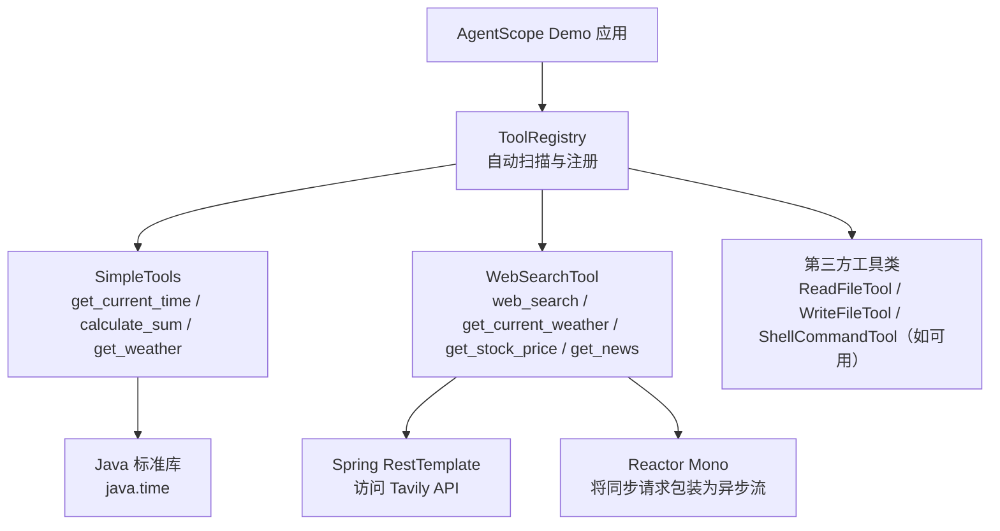
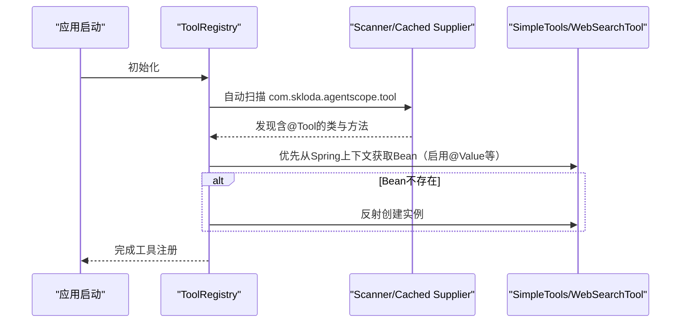
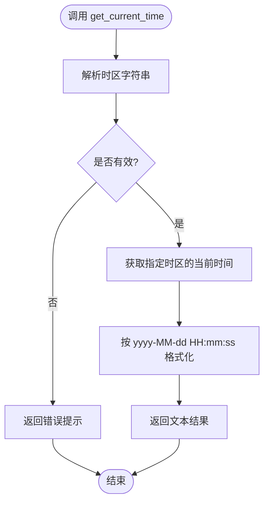
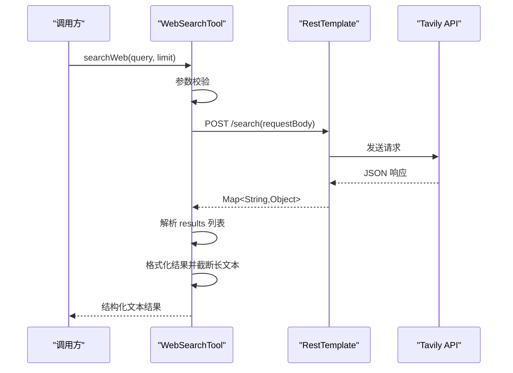
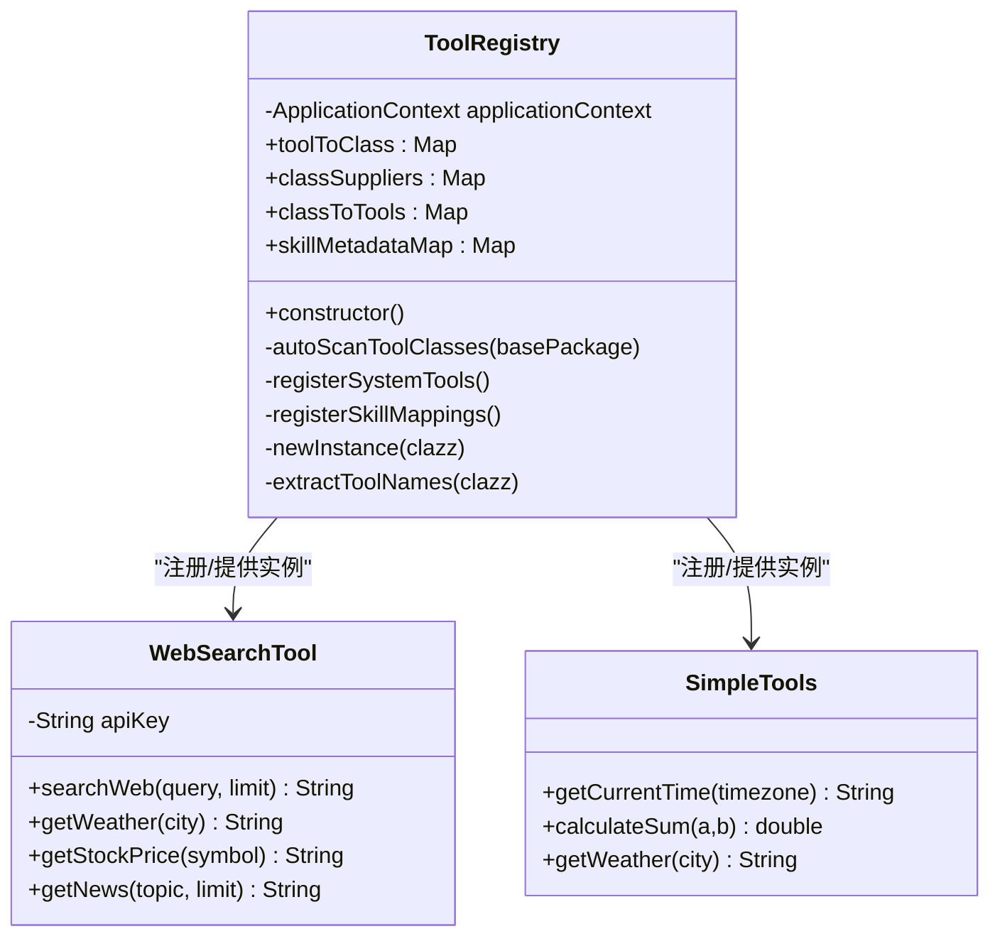

# 内置工具集

<cite>
**本文引用的文件 **
- [SimpleTools.java](file://src/main/java/com/skloda/agentscope/tool/SimpleTools.java)
- [WebSearchTool.java](file://src/main/java/com/skloda/agentscope/tool/WebSearchTool.java)
- [ToolRegistry.java](file://src/main/java/com/skloda/agentscope/tool/ToolRegistry.java)
- [application.yml](file://src/main/resources/application.yml)
- [SKILL.md（示例：bank_invoice）](file://src/main/resources/skills/bank_invoice/SKILL.md)
- [BankInvoiceTool.java](file://src/main/java/com/skloda/agentscope/tool/BankInvoiceTool.java)
- [AgentScopeDemoApplication.java](file://src/main/java/com/skloda/agentscope/AgentScopeDemoApplication.java)
- [SimpleToolsTest.java](file://src/test/java/com/skloda/agentscope/tool/SimpleToolsTest.java)
- [WebSearchToolTest.java](file://src/test/java/com/skloda/agentscope/tool/WebSearchToolTest.java)
</cite>

## 目录
1. [简介](#简介)
2. [项目结构](#项目结构)
3. [核心组件](#核心组件)
4. [架构总览](#架构总览)
5. [详细组件分析](#详细组件分析)
6. [依赖关系分析](#依赖关系分析)
7. [性能考虑](#性能考虑)
8. [故障排除指南](#故障排除指南)
9. [结论](#结论)
10. [附录](#附录)

## 简介
本技术文档聚焦于内置工具集的完整实现与运行机制，围绕以下目标展开：
- 详解 SimpleTools 中的基础工具：get_current_time、calculate_sum、get_weather 的实现要点与时区、格式化、模拟数据行为。
- 深入剖析 WebSearchTool 的网络搜索能力：Tavily API 集成、同步阻塞包装为 Reactor Mono、参数校验、错误处理、结果解析与格式优化。
- 阐释工具的声明周期管理、配置注入（@Value）、异常处理策略与在 ToolRegistry 中注册机制。
- 提供使用示例、配置选项与常见问题排查方法。

该实现基于 Spring Boot 容器管理（Component/@Value），并通过 AgentScope 的工具注解体系暴露工具给上层 Agent 调用。

## 项目结构
工具集位于 tool 包下，按职责拆分：
- SimpleTools：基础本地计算与时间、天气模拟等轻量工具
- WebSearchTool：网络搜索与实时信息聚合，封装 Tavily API
- ToolRegistry：自动扫描并注册用户自定义工具与框架系统工具，支持 Skill 元数据映射
- 资源与测试：SKILL.md、单元测试等辅助材料与验证用例

图表来源
- [ToolRegistry.java:30-44](file://src/main/java/com/skloda/agentscope/tool/ToolRegistry.java#L30-L44)
- [WebSearchTool.java:20-134](file://src/main/java/com/skloda/agentscope/tool/WebSearchTool.java#L20-L134)
- [SimpleTools.java:12-44](file://src/main/java/com/skloda/agentscope/tool/SimpleTools.java#L12-L44)

小节来源
- [application.yml:1-35](file://src/main/resources/application.yml#L1-L35)

## 核心组件
- SimpleTools：提供三个轻量工具
  - get_current_time：根据传入时区获取当前时间并格式化输出；对非法时区捕获异常并返回友好提示
  - calculate_sum：对两个数值求和，支持正负与小数
  - get_weather：根据城市名返回预设的模拟天气信息；未知城市返回兜底消息
- WebSearchTool：通过 Tavily API 执行网络搜索，并提供多个便捷入口：
  - web_search：统一搜索入口，负责参数校验、构建请求体、调用 API、解析响应、格式化展示
  - get_current_weather / get_stock_price / get_news：复用 web_search，构造自然语言查询
- ToolRegistry：生命周期内完成工具类扫描、实例化、系统工具注册及 SKILL.md 到工具的映射

小节来源
- [SimpleTools.java:14-43](file://src/main/java/com/skloda/agentscope/tool/SimpleTools.java#L14-L43)
- [WebSearchTool.java:25-133](file://src/main/java/com/skloda/agentscope/tool/WebSearchTool.java#L25-L133)
- [ToolRegistry.java:30-44](file://src/main/java/com/skloda/agentscope/tool/ToolRegistry.java#L30-L44)

## 架构总览
工具在启动期被 ToolRegistry 自动发现与注册。用户工具类只要包含 @Tool 标注的方法即可被扫描到。框架同时尝试扫描内置的系统工具，若不可达则回退为显式注册路径。工具的生命周期由 Spring 容器管理，依赖项可通过 @Value/@Autowired 注入。

图表来源
- [ToolRegistry.java:71-121](file://src/main/java/com/skloda/agentscope/tool/ToolRegistry.java#L71-L121)

## 详细组件分析

### SimpleTools 工具实现
- 时间获取与格式化
  - 根据时区字符串解析 ZoneId，获取 LocalDateTime，并以固定格式输出
  - 异常分支对非法时区返回明确的错误提示
- 数值计算
  - 直接返回两数之和，类型设计为 double，便于整数与小数通用
- 天气模拟
  - 维护一份已知城市的天气映射，未命中则给出兜底文案
  - 该方法抛出 InterruptedException 用于配合某些调度场景（实际内部无休眠，但保留接口约定）

适用场景
- 快速演示或无需外部依赖的基础能力：时间戳、简单计算、本地占位天气

图表来源
- [SimpleTools.java:14-25](file://src/main/java/com/skloda/agentscope/tool/SimpleTools.java#L14-L25)

小节来源
- [SimpleTools.java:14-43](file://src/main/java/com/skloda/agentscope/tool/SimpleTools.java#L14-L43)
- [SimpleToolsTest.java:12-39](file://src/test/java/com/skloda/agentscope/tool/SimpleToolsTest.java#L12-L39)

### WebSearchTool 网络搜索与实时信息服务
- 配置注入与依赖
  - tavily.api-key 使用 @Value 注入，提供默认值，便于本地开发
  - RestTemplate 作为 HTTP 客户端，Mono.fromCallable + block 将同步调用包装为 Reactor 流
- 参数校验
  - query 不能为空
  - limit 非空且在(0,10]范围内，否则回退为 5
- API 请求与响应
  - 请求端点固定为 https://api.tavily.com/search
  - 请求体包含 api_key、query、max_results、search_depth、include_answer、include_raw_content
  - 响应体期望包含 results 数组，每项包含 title、url、content、score
- 结果格式化
  - 组装标题与链接列表、相关性分数
  - 内容过长时截断至 200 字符后加省略号，避免过大响应
- 便捷入口
  - get_current_weather/get_stock_price/get_news 均通过组合 web_search 的自然语言查询来工作

错误处理
- 请求结果为 null 或未找到 results 时返回明确提示
- 异常捕获并记录日志，同时返回友好的失败文本

图表来源
- [WebSearchTool.java:30-133](file://src/main/java/com/skloda/agentscope/tool/WebSearchTool.java#L30-L133)

小节来源
- [WebSearchTool.java:25-133](file://src/main/java/com/skloda/agentscope/tool/WebSearchTool.java#L25-L133)
- [WebSearchToolTest.java:9-62](file://src/test/java/com/skloda/agentscope/tool/WebSearchToolTest.java#L9-L62)

### ToolRegistry 生命周期与依赖注入
- 自动扫描
  - 扫描指定包下所有类，筛选出含有 @Tool 注解方法的类进行注册
- Spring 优先注入
  - 尝试从 ApplicationContext 获取已管理的 Bean（支持 @Value 等注入），找不到才走反射实例化
- 系统工具注册
  - 先尝试自动扫描框架包 io.agentscope.core.tool.*
  - 若不可用，回退到显式 Class.forName 方式注册 ReadFileTool、WriteFileTool、ShellCommandTool
- 技能映射
  - 扫描 classpath:skills/*/SKILL.md，读取 frontmatter 中的 name/description/tools
  - 将技能名映射到一个 Supplier（通常复用已有工具的类供应商），以便上层以“技能”维度组织与调用

依赖注入
- WebSearchTool 通过 @Value 注入 API Key，体现了配置与实现的解耦
- ToolRegistry 在创建工具实例时优先使用 Spring Bean，确保依赖链正常生效

图表来源
- [ToolRegistry.java:23-44](file://src/main/java/com/skloda/agentscope/tool/ToolRegistry.java#L23-L44)
- [WebSearchTool.java:20-33](file://src/main/java/com/skloda/agentscope/tool/WebSearchTool.java#L20-L33)
- [SimpleTools.java:12-43](file://src/main/java/com/skloda/agentscope/tool/SimpleTools.java#L12-L43)

小节来源
- [ToolRegistry.java:71-199](file://src/main/java/com/skloda/agentscope/tool/ToolRegistry.java#L71-L199)

### SKILL.md 到工具的映射
- 通过读取 skills 目录下 SKILL.md 的 YAML frontmatter，建立“技能名称 → 工具集合”的映射
- 以示例 bank_invoice 技能为例，说明技能的描述、用途、参数与输出规范

小节来源
- [SKILL.md（示例：bank_invoice）:1-110](file://src/main/resources/skills/bank_invoice/SKILL.md#L1-L110)
- [BankInvoiceTool.java:15-50](file://src/main/java/com/skloda/agentscope/tool/BankInvoiceTool.java#L15-L50)

## 依赖关系分析
- 运行时依赖
  - Java 标准库 time/timezone：时间计算与时区转换
  - Spring Web RestTemplate：HTTP 客户端，调用 Tavily
  - Project Reactor Mono：将同步请求包装为异步可订阅流（此处通过 block 即时等待）
  - SLF4J：日志记录
- 装配依赖
  - Spring ApplicationContext：工具实例管理与依赖注入
  - AgentScope 框架：@Tool 注解用于暴露工具方法签名与元信息
- 配置文件
  - application.yml 暴露了模型、记忆、工具开关、会话等全局配置

可能的循环与风险
- WebSearchTool 依赖 Spring Bean 与外部环境（Tavily API），需关注网络波动与密钥缺失情况
- ToolRegistry 使用反射，存在潜在的 ClassNotFoundException，已做日志与跳过处理

小节来源
- [WebSearchTool.java:5-12](file://src/main/java/com/skloda/agentscope/tool/WebSearchTool.java#L5-L12)
- [ToolRegistry.java:30-121](file://src/main/java/com/skloda/agentscope/tool/ToolRegistry.java#L30-L121)
- [application.yml:25-79](file://src/main/resources/application.yml#L25-L79)

## 性能考虑
- 网络延迟与超时
  - RestTemplate 默认无超时设置，生产环境建议结合 RestTemplateBuilder 或 HttpClient 配置合理的连接/读取超时与重试策略
- 并发与背压
  - 当前搜索使用 Mono.fromCallable 后 block 同步阻塞，适合工具调用的语义但会占用线程；在高并发下建议引入真正异步的 WebClient/RestClient 以实现非阻塞
- 结果大小控制
  - 已限制 max_results 且对内容长度进行截断，避免响应过大影响渲染与传输
- 缓存
  - 对频繁查询（如热门新闻或天气）可引入本地缓存以减少外部调用

[本节为通用性能建议，不直接引用具体代码行]

## 故障排除指南
- 无法搜索或返回失败
  - 检查 tavily.api-key 是否正确注入（环境变量或配置文件）
  - 确认网络可达性，以及 Tavily API 服务状态
  - 查看日志中是否有网络异常或解析异常堆栈
- 结果为空或未找到相关结果
  - 调整查询词或使用更具体的关键词
  - 确认 limit 设置为 1..10 的合理范围
- 时区异常或无效时区
  - 使用标准 IANA 时区命名（例如 Asia/Shanghai、America/New_York），避免非法名称
- 工具未注册/不可用
  - 确认工具类所在包被扫描
  - 若通过 Spring 容器管理，确保类被标记为 @Component 或由 ToolRegistry 扫描发现
  - 检查日志中是否存在类加载失败的警告

小节来源
- [WebSearchTool.java:25-37](file://src/main/java/com/skloda/agentscope/tool/WebSearchTool.java#L25-L37)
- [SimpleTools.java:17-24](file://src/main/java/com/skloda/agentscope/tool/SimpleTools.java#L17-L24)
- [ToolRegistry.java:92-119](file://src/main/java/com/skloda/agentscope/tool/ToolRegistry.java#L92-L119)

## 结论
本项目内置工具集实现了从基础功能（时间、计算、模拟天气）到高级能力（通过网络检索最新信息的搜索工具）的覆盖。通过 ToolRegistry 的自动发现与注册机制，结合 Spring 容器的依赖注入，实现了工具与框架的深度集成。对于对外部 API 的调用，当前采用同步封装模式，便于工具语义；但在高并发生产环境中应进一步向非阻塞方案演进。此外，完善的环境配置、日志记录与异常反馈为问题定位提供了便利。

## 附录

### 配置清单
- tavily.api-key：用于调用 Tavily API 的密钥，支持默认值注入
- agentscope.tools.enabled：控制工具是否启用
- 其他模型、内存、会话等全局配置可根据需要开启或关闭

小节来源
- [application.yml:25-79](file://src/main/resources/application.yml#L25-L79)

### 使用示例
- 获取当前时间
  - 参数：timezone（IANA 时区）
  - 示例行为：传入 Asia/Shanghai 返回格式化时间字符串
- 求和
  - 参数：a、b（数值）
  - 示例行为：返回 a + b
- 获取天气
  - 参数：city（城市名）
  - 示例行为：已知城市返回对应天气；未知城市返回兜底文案
- 网络搜索
  - 参数：query（必选）、limit（可选，1..10）
  - 示例行为：返回结构化摘要列表
- 快捷入口
  - get_current_weather/get_stock_price/get_news：基于 query 派生的搜索

小节来源
- [SimpleTools.java:14-43](file://src/main/java/com/skloda/agentscope/tool/SimpleTools.java#L14-L43)
- [WebSearchTool.java:30-133](file://src/main/java/com/skloda/agentscope/tool/WebSearchTool.java#L30-L133)
- [SimpleToolsTest.java:12-39](file://src/test/java/com/skloda/agentscope/tool/SimpleToolsTest.java#L12-L39)
- [WebSearchToolTest.java:9-62](file://src/test/java/com/skloda/agentscope/tool/WebSearchToolTest.java#L9-L62)