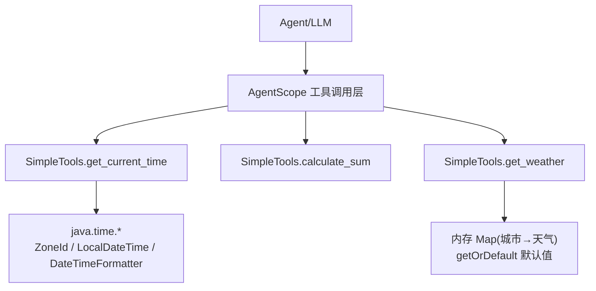
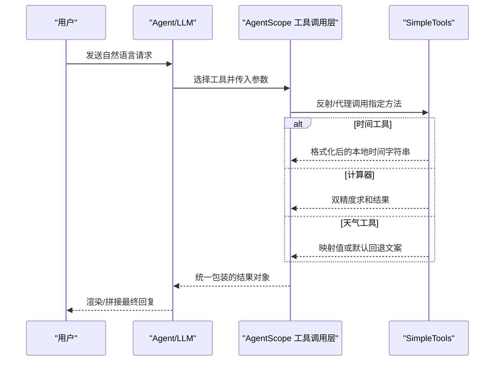
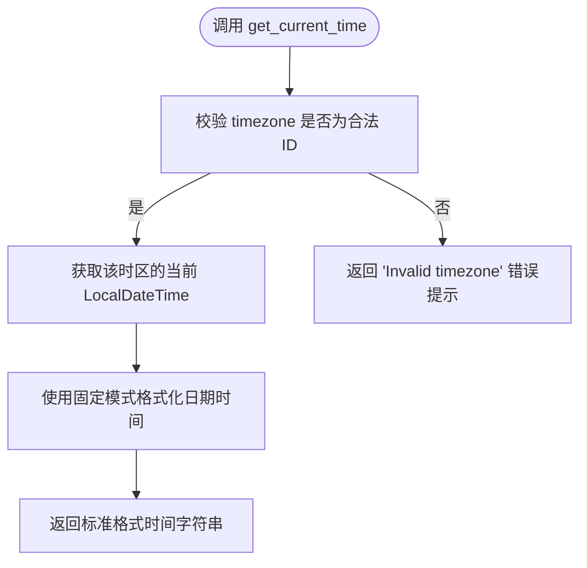
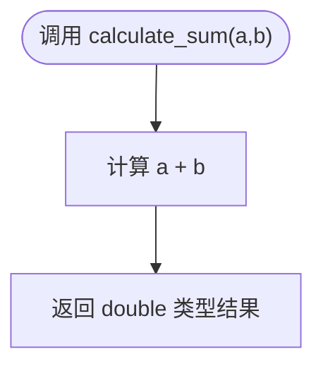
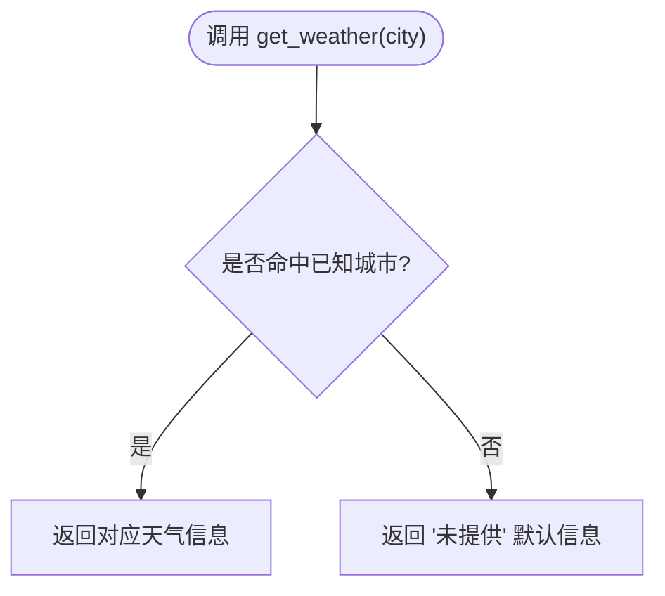

# 基础工具

<cite>
**本文引用的文件**
- [src/main/java/com/skloda/agentscope/tool/SimpleTools.java](file://src/main/java/com/skloda/agentscope/tool/SimpleTools.java)
- [src/test/java/com/skloda/agentscope/tool/SimpleToolsTest.java](file://src/test/java/com/skloda/agentscope/tool/SimpleToolsTest.java)
- [pom.xml](file://pom.xml)
- [README.md](file://README.md)
- [AGENTS.md](file://AGENTS.md)
</cite>

## 目录
1. 引言
2. 项目结构
3. 核心组件
4. 架构总览
5. 详细组件分析
6. 依赖关系分析
7. 性能与稳定性考虑
8. 故障排除指南
9. 结论
10. 附录：使用示例、参数说明与回归测试参考

## 引言
本技术文档聚焦 AgentScope Java Demo 中的基础工具集，对 SimpleTools 类进行代码级深度分析。围绕三个基础工具方法展开：
- get_current_time：基于 Java Time API 的本地时间与时区格式化
- calculate_sum：双精度数值求和，关注参数类型与返回值精度
- get_weather：静态映射的模拟天气查询，含未知城市默认回退逻辑

同时说明每个工具的 @Tool 注解配置、@ToolParam 参数定义、异常处理策略与错误信息返回；并从工程角度解释工具的生命周期管理、Spring 容器注入机制（以项目既有的 Spring Boot 上下文为承载）以及在 Agent 调用链中的作用方式。文末提供使用示例、参数说明与问题定位清单。

## 项目结构
该项目采用 Spring Boot 3 + AgentScope（Java）实现，工具通过带元数据的 POJO 方法暴露给智能体调度器，运行时由框架完成参数解析、类型转换、执行与结果封装。SimpleTools 位于 tool 包中，配合测试用例与 README/AGENTS 文档共同构成可验证的最小工具集示例。

图示为概念性流程，不绑定具体源码行号。

## 核心组件
SimpleTools 包含三个被 @Tool 标注的方法，作为最小化的“演示工具”。其关键点如下：
- 方法级别通过 @Tool 声明名称与描述，使 Agent 能够发现和调用
- 参数使用 @ToolParam(name, description) 暴露给上层，便于生成 Schema/提示词
- 异常与边界条件分别处理：时间工具捕获非法时区并返回人类可读的错误文案；计算器直接计算；天气工具通过地图查找并提供未命中时的默认文案

这些设计保障了简单、可控且可观测的工具行为。

章节来源
- [src/main/java/com/skloda/agentscope/tool/SimpleTools.java:12-44](file://src/main/java/com/skloda/agentscope/tool/SimpleTools.java#L12-L44)
- [src/test/java/com/skloda/agentscope/tool/SimpleToolsTest.java:8-40](file://src/test/java/com/skloda/agentscope/tool/SimpleToolsTest.java#L8-L40)
- [pom.xml:20-41](file://pom.xml#L20-L41)
- [README.md:96-109](file://README.md#L96-L109)
- [AGENTS.md:关于 Tool 注册的说明段落](file://AGENTS.md)

## 架构总览
在 AgentScope 的调用链中，工具本质上是具备签名与元数据的普通 POJO 方法。调用链大致为：
1. 上层 Agent/任务生成或选择要调用的工具名与参数
2. AgentScope 根据 @Tool/@ToolParam 解析工具元数据，构造入参并执行
3. 执行结果以统一形式返回给 Agent，进入后续输出或下一环节

SimpleTools 作为一组“无外部依赖”的基础工具，适合用于校验工具注册链路、调试参数序列化和响应格式。

图示为概念性时序，不代表特定文件实现细节。

## 详细组件分析

### get_current_time：时间转换与时区处理
- 功能目标：根据输入的时区名称，返回该时区的当前时间（固定格式 yyyy-MM-dd HH:mm:ss）
- 关键步骤
  - 将输入字符串转换为 java.time.ZoneId，失败时捕获异常并返回人类可理解的错误提示
  - 获取指定时区下的 LocalDateTime 当前时刻
  - 使用固定模式的 DateTimeFormatter 格式化输出
- 复杂度：常量时间 O(1)，仅涉及时间读取与格式化
- 健壮性：对非法时区给出友好错误信息，不会抛出向上堆栈
- 精度与表现：日期时间以字符串形式返回，不受数值精度影响
- 与框架集成：被 @Tool 标注并通过 @ToolParam 声明 name/description，便于 Agent 自动生成调用契约与提示

图示来源于 SimpleTools 的时间处理逻辑路径。

章节来源
- [src/main/java/com/skloda/agentscope/tool/SimpleTools.java:14-25](file://src/main/java/com/skloda/agentscope/tool/SimpleTools.java#L14-L25)
- [src/test/java/com/skloda/agentscope/tool/SimpleToolsTest.java:28-39](file://src/test/java/com/skloda/agentscope/tool/SimpleToolsTest.java#L28-L39)

### calculate_sum：数值计算与返回值精度
- 功能目标：计算两个 double 类型参数的和
- 关键要点
  - 参数类型为 double，兼容整数、小数、正负数，符合常见“求和”语义
  - 返回值类型为 double，保持原始精度表达
  - 无外部副作用，纯函数式实现
- 测试覆盖：正向（不同符号组合）、浮点（含小数）均已在单元测试中验证
- 复杂度：O(1)
- 注意事项：由于底层为 IEEE 754 double，极端场景下可能出现微小舍入误差，但在常规业务范围内可接受

章节来源
- [src/main/java/com/skloda/agentscope/tool/SimpleTools.java:27-32](file://src/main/java/com/skloda/agentscope/tool/SimpleTools.java#L27-L32)
- [src/test/java/com/skloda/agentscope/tool/SimpleToolsTest.java:12-16](file://src/test/java/com/skloda/agentscope/tool/SimpleToolsTest.java#L12-L16)

### get_weather：模拟天气数据服务
- 功能目标：根据城市英文名称返回预置的天气信息；不存在时返回默认回退信息
- 关键实现
  - 使用 Map 维护已知城市到天气信息的映射
  - 使用 getOrDefault 在键不存在时返回“未为该城市提供信息”的文案
- 行为特征：同步返回；不依赖外部网络或服务
- 扩展性：可通过注入配置或数据库替换内嵌映射，但当前版本为完全内存静态映射
- 复杂度：平均 O(1)

章节来源
- [src/main/java/com/skloda/agentscope/tool/SimpleTools.java:34-43](file://src/main/java/com/skloda/agentscope/tool/SimpleTools.java#L34-L43)
- [src/test/java/com/skloda/agentscope/tool/SimpleToolsTest.java:18-26](file://src/test/java/com/skloda/agentscope/tool/SimpleToolsTest.java#L18-L26)

### 工具注解与参数定义
- @Tool(name, description)：为每个方法暴露工具名与描述，供 Agent 发现与生成调用协议
- @ToolParam(name, description)：对每个入参提供显式命名与描述，有利于构建结构化 Prompt 与参数校验/提示
- 三者均位于工具方法及其参数上，构成最小粒度的工具契约

章节来源
- [src/main/java/com/skloda/agentscope/tool/SimpleTools.java:14-43](file://src/main/java/com/skloda/agentscope/tool/SimpleTools.java#L14-L43)

### 生命周期管理与依赖注入
- 容器角色：项目在 Spring Boot 环境中运行，工具类作为普通 POJO，实际注册与调用由 AgentScope 框架完成
- 注册机制：项目 README/AGENTS 中明确“工具是带有 @Tool 注解方法的 POJO”，并由框架在启动时扫描、注册（详见项目约定）
- 注入方式：SimpleTools 为无状态、无外部依赖的工具集合，通常不需要手动实例化或 DI；如确需自定义依赖，可在 Spring 容器中将其声明为 Bean，并在合适位置交由框架注册使用
- 执行模型：工具方法均为同步执行，适用于轻量操作；如需耗时逻辑，建议评估异步或流式方案

章节来源
- [README.md:96-109](file://README.md#L96-L109)
- [AGENTS.md:关于 Tool 注册与 POJO 注解的说明](file://AGENTS.md)
- [pom.xml:20-41](file://pom.xml#L20-L41)

## 依赖关系分析
- 框架依赖：pom.xml 引入 agentscope-core 等依赖，提供 @Tool/@ToolParam 能力与运行时工具调度
- JDK 依赖：SimpleTools 仅使用 java.time 相关类（ZoneId、LocalDateTime、DateTimeFormatter），属于 JDK 内置库
- 第三方库：SimpleTools 未引入额外第三方依赖，保证工具的可移植性与低耦合

章节来源
- [pom.xml:20-41](file://pom.xml#L20-L41)
- [src/main/java/com/skloda/agentscope/tool/SimpleTools.java:6-10](file://src/main/java/com/skloda/agentscope/tool/SimpleTools.java#L6-L10)

## 性能与稳定性考虑
- 时间工具：只读取系统时钟并格式化，开销极低；异常路径确保快速返回友好提示
- 求和工具：纯计算，O(1)，CPU 成本可忽略
- 天气工具：基于内存 Map 的 O(1) 查找；在高并发下仍稳定；若未来数据增长，可考虑替换为缓存层或远端服务
- 线程安全：SimpleTools 无可变状态，天然线程安全
- 资源占用：无网络连接、IO 或外部系统调用，资源消耗极低

[本节为通用指导，不直接分析具体文件]

## 故障排除指南
- 获取当前时间为空/报错
  - 检查 timezone 是否为 IANA 标准时区 ID（例如 Asia/Shanghai）
  - 若非法，工具将返回“无效时区”的错误提示；请核对大小写与地区编码
  - 参考：get_current_time 的异常捕获分支
- 求和结果不符合预期
  - 确认传入类型为 double；当需要高精度财务计算时，建议使用 BigDecimal 而非 double
  - 参考：calculate_sum 的双精度语义与测试用例范围
- 天气信息未命中
  - 目前仅支持少数几个城市的硬编码映射；不在列表时会返回默认提示信息
  - 如需新增城市，可在映射中添加新条目或替换为配置/数据库源
  - 参考：get_weather 的默认回退逻辑

章节来源
- [src/main/java/com/skloda/agentscope/tool/SimpleTools.java:14-43](file://src/main/java/com/skloda/agentscope/tool/SimpleTools.java#L14-L43)
- [src/test/java/com/skloda/agentscope/tool/SimpleToolsTest.java:12-39](file://src/test/java/com/skloda/agentscope/tool/SimpleToolsTest.java#L12-L39)

## 结论
SimpleTools 提供了三个高度自包含、职责单一的基础工具，覆盖了“时间”“计算”“模拟服务”三类典型场景。通过 @Tool/@ToolParam 与完善的异常/默认值策略，它们在 Agent 调用链中充当了稳定的“最小可用单元”。对于复杂业务，建议在保留此模式的基础上，逐步替换静态数据为外部数据源，并对数值精度需求较高的场景采用更合适的数值类型。

[本节总结性陈述，不直接引用具体文件]

## 附录：使用示例、参数说明与回归测试参考
- get_current_time
  - 作用：返回指定时区的当前时间（yyyy-MM-dd HH:mm:ss）
  - 参数：timezone（字符串，IANA 时区 ID）
  - 返回值：格式化后的时间字符串；非法时区返回错误提示
  - 参考实现位置：SimpleTools 中 get_current_time 所在行范围
- calculate_sum
  - 作用：计算两个数字之和
  - 参数：a、b（double）
  - 返回值：双精度和；注意浮点数舍入特性
  - 参考实现位置：SimpleTools 中 calculate_sum 所在行范围
- get_weather
  - 作用：根据英文城市名查询天气（静态数据）
  - 参数：city（字符串）
  - 返回值：匹配的城市天气文案；未匹配则返回“未提供”提示
  - 参考实现位置：SimpleTools 中 get_weather 所在行范围
- 运行与观察
  - 可结合 README 中的 “Tool Calling” 示例，通过 Agent 对话触发上述工具
  - 测试用例涵盖三种工具的关键路径，可作为行为回归依据

章节来源
- [README.md:96-109](file://README.md#L96-L109)
- [src/test/java/com/skloda/agentscope/tool/SimpleToolsTest.java:8-40](file://src/test/java/com/skloda/agentscope/tool/SimpleToolsTest.java#L8-L40)
- [src/main/java/com/skloda/agentscope/tool/SimpleTools.java:12-44](file://src/main/java/com/skloda/agentscope/tool/SimpleTools.java#L12-L44)