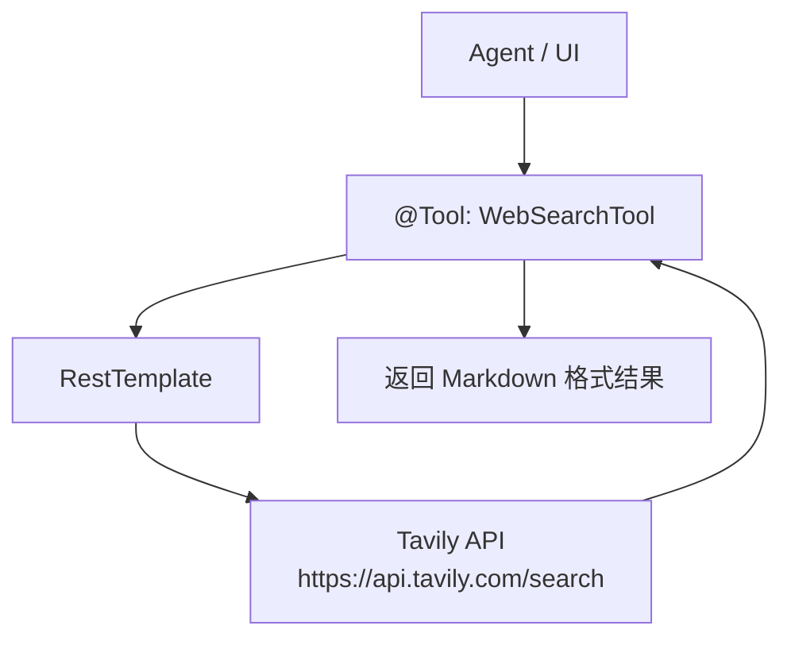
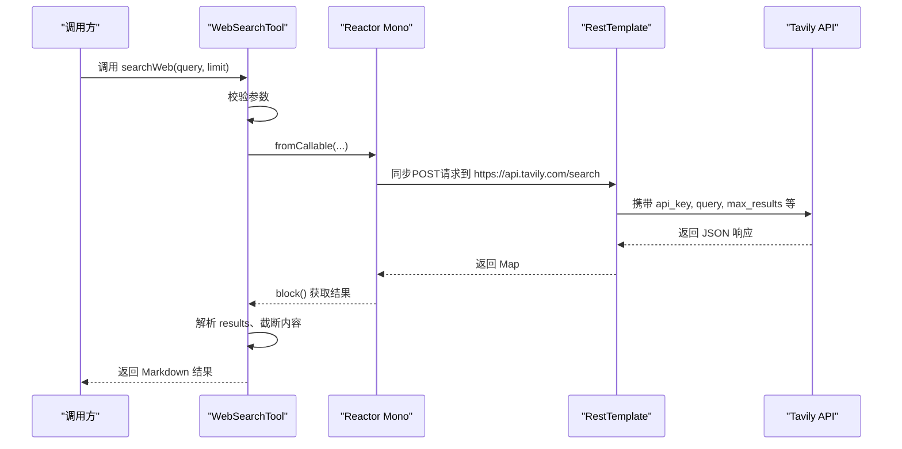
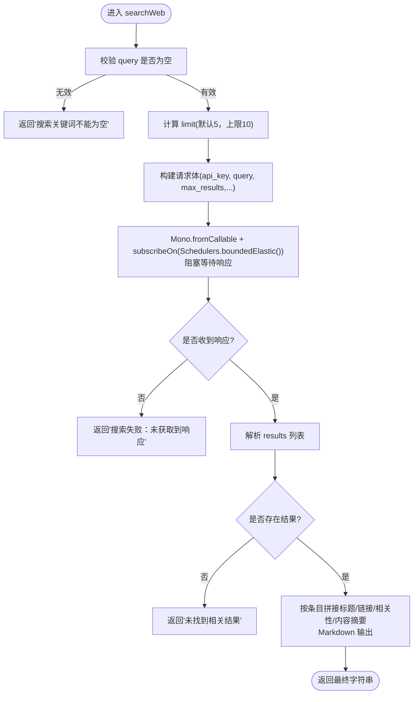
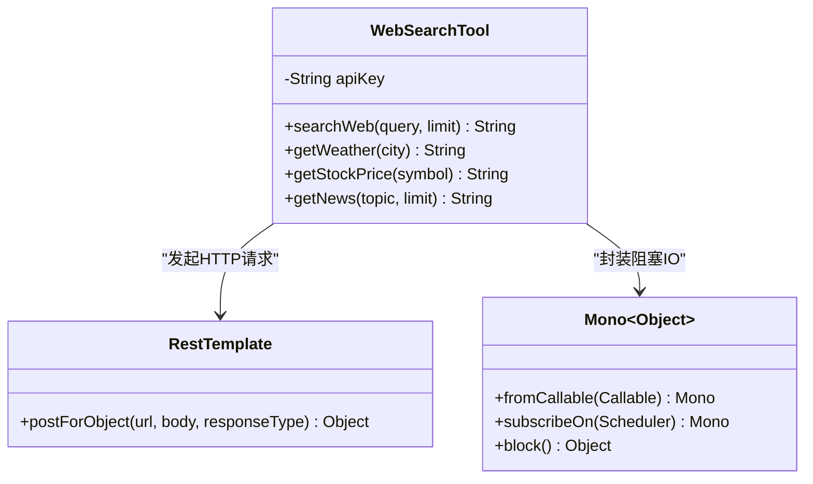

# 网络搜索工具

<cite>
**本文引用的文件**
- [WebSearchTool.java](file://src/main/java/com/skloda/agentscope/tool/WebSearchTool.java)
- [WebSearchToolTest.java](file://src/test/java/com/skloda/agentscope/tool/WebSearchToolTest.java)
- [application.yml](file://src/main/resources/application.yml)
- [pom.xml](file://pom.xml)
</cite>

## 目录
1. [简介](#简介)
2. [项目结构](#项目结构)
3. [核心组件](#核心组件)
4. [架构总览](#架构总览)
5. [详细组件分析](#详细组件分析)
6. [依赖关系分析](#依赖关系分析)
7. [性能考量](#性能考量)
8. [故障排查指南](#故障排查指南)
9. [结论](#结论)
10. [附录：配置与使用示例](#附录配置与使用示例)

## 简介
本技术文档面向 AgentScope 项目的“网络搜索工具”，围绕 WebSearchTool 类展开，系统阐述其与 Tavily API 的集成方式、基于 Reactor 的异步请求架构（Mono + Schedulers）、参数校验与错误处理策略、以及响应数据格式化输出。同时说明天气、股票、新闻等高级工具的封装与优化，并给出完整的网络搜索流程、配置注入机制和最佳实践建议。

## 项目结构
该能力位于 Java 模块的 tool 层，以 Spring Boot 组件形式暴露为 @Tool，供 Agent 在运行期发现与调用；网络请求通过 Spring 提供的 RestTemplate 发起，并结合 Project Reactor 进行线程切换与非阻塞化编排。配置文件由 application.yml 管理应用级设置，工具自身的密钥读取走 Spring 的 @Value 注解。

图表来源
- [WebSearchTool.java:30-99](file://src/main/java/com/skloda/agentscope/tool/WebSearchTool.java#L30-L99)

小节来源
- [WebSearchTool.java:1-134](file://src/main/java/com/skloda/agentscope/tool/WebSearchTool.java#L1-L134)
- [application.yml:1-89](file://src/main/resources/application.yml#L1-L89)
- [pom.xml:57-61](file://pom.xml#L57-L61)

## 核心组件
- 工具类：WebSearchTool
  - 提供 web_search、get_current_weather、get_stock_price、get_news 四个工具方法，统一委托到核心搜索逻辑或直接构造查询参数后复用 searchWeb。
  - 内置对空参数与边界 limit 的校验，避免无意义的网络请求。
  - 通过 RestTemplate 发起 POST 请求至 Tavily 搜索接口，并以 Mono.fromCallable + subscribeOn(Schedulers.boundedElastic()) 将阻塞 IO 切换到弹性线程池执行，再 block 等待结果。
  - 解析 JSON 响应体中的 results 列表，截断长内容并格式化为结构化 Markdown 文本输出。
- 依赖注入：apiKey 通过 @Value("${tavily.api-key:默认值}") 注入，便于通过环境变量或配置中心覆盖。
- 异步与并发：利用 Project Reactor 的非阻塞抽象隔离外部 HTTP 阻塞操作，降低对主事件循环的影响。

小节来源
- [WebSearchTool.java:21-134](file://src/main/java/com/skloda/agentscope/tool/WebSearchTool.java#L21-L134)
- [pom.xml:57-61](file://pom.xml#L57-L61)

## 架构总览
web_search 工具的工作流如下：

图表来源
- [WebSearchTool.java:30-99](file://src/main/java/com/skloda/agentscope/tool/WebSearchTool.java#L30-L99)

小节来源
- [WebSearchTool.java:30-99](file://src/main/java/com/skloda/agentscope/tool/WebSearchTool.java#L30-L99)

## 详细组件分析

### web_search：通用网络搜索
- 输入参数
  - query：搜索关键词或问题，必填且不能为空串或仅空白字符。
  - limit：返回条数，限制范围 (1..10]，未指定或超出范围时回退默认值。
- 核心流程
  - 构建请求体：包含 api_key、query、max_results、search_depth、include_answer、include_raw_content 等字段。
  - 异步封装与执行：以 Mono.fromCallable 包裹阻塞式 postForObject，并在 Elastic 调度器上执行，再阻塞等待结果。
  - 响应解析：从响应对象中取 results 列表，逐项提取 title、url、content、score 并渲染为 Markdown 片段。
  - 安全与健壮性：内容为过长时截断，异常捕获并记录日志，返回友好提示字符串。
- 复杂度
  - 时间：主要耗时在 I/O（REST 调用），内部解析为 O(n)。
  - 空间：O(n) 存储临时结果对象及拼接字符串。

图表来源
- [WebSearchTool.java:30-99](file://src/main/java/com/skloda/agentscope/tool/WebSearchTool.java#L30-L99)

小节来源
- [WebSearchTool.java:30-99](file://src/main/java/com/skloda/agentscope/tool/WebSearchTool.java#L30-L99)

### get_current_weather：当前天气
- 功能：针对城市名称组装“今日天气”的查询，委托给 searchWeb。
- 参数验证：city 非空；空值直接返回错误提示。
- 体验优化：固定 limit=3，聚焦高相关性结果。

小节来源
- [WebSearchTool.java:102-112](file://src/main/java/com/skloda/agentscope/tool/WebSearchTool.java#L102-L112)

### get_stock_price：股票价格
- 功能：针对股票代码或公司名构造“今天股票价格”查询，委托给 searchWeb。
- 参数验证：symbol 非空；空值返回错误提示。
- 体验优化：limit=3。

小节来源
- [WebSearchTool.java:114-124](file://src/main/java/com/skloda/agentscope/tool/WebSearchTool.java#L114-L124)

### get_news：最新新闻
- 功能：可选主题 topic 聚合“最新新闻”语义；默认主题为“今日最新新闻”。
- 参数验证：topic 为空则使用默认主题；limit 传入则生效，否则默认5。
- 实现策略：统一委派 searchWeb 执行。

小节来源
- [WebSearchTool.java:126-133](file://src/main/java/com/skloda/agentscope/tool/WebSearchTool.java#L126-L133)

### 响应数据格式化与展示优化
- 输出格式：Markdown，包含结果标题与链接列表、相关性分数、内容摘要（超长截取）。
- 可读性：每条结果前缀序号、链接可点击、摘要控制长度，保证信息密度。
- 可扩展：未来可支持图片预览、站点图标或更丰富的摘要生成。

小节来源
- [WebSearchTool.java:64-94](file://src/main/java/com/skloda/agentscope/tool/WebSearchTool.java#L64-L94)

## 依赖关系分析
- Reactor 与线程模型
  - 通过 Mono.fromCallable + subscribeOn(Schedulers.boundedElastic()) 将阻塞的网络 I/O 移出常规线程，降低对应用线程池压力。
  - 注意：虽然外层使用了 Reactor，但仍调用了 block()，整体仍是同步阻塞调用模式；适用于工具方法对外表现为同步字符串返回的场景。
- 网络客户端
  - Spring RestTemplate 用于发送 JSON 请求；依赖 spring-boot-starter-web 自动装配。
- 第三方服务
  - Tavily Search API：统一通过 POST 调用；请求载荷包含鉴权 key 与搜索参数；响应载荷含 results 列表。

图表来源
- [WebSearchTool.java:25-58](file://src/main/java/com/skloda/agentscope/tool/WebSearchTool.java#L25-L58)
- [pom.xml:57-61](file://pom.xml#L57-L61)

小节来源
- [WebSearchTool.java:25-58](file://src/main/java/com/skloda/agentscope/tool/WebSearchTool.java#L25-L58)
- [pom.xml:57-61](file://pom.xml#L57-L61)

## 性能考量
- 网络 I/O 是主要瓶颈：Tavily API 延迟受地区与配额影响；建议在高并发场景引入连接池、重试与超时配置。
- 线程调度：当前使用 boundedElastic 执行阻塞调用，能缓解线程竞争；若后续改为纯响应式调用，可进一步移除 block 提升吞吐。
- 结果大小控制：内容摘要已裁剪到合理长度，减少传输与渲染成本。
- 限流与降级：结合业务侧限流策略与缓存热点查询（如常见“今日天气/新闻”）可降低外网依赖。
- 资源释放：RestTemplate 实例应共享而非每次新建，当前代码使用成员变量可实现单例内复用。

[本节为通用指导，不引用具体文件]

## 故障排查指南
- 参数校验错误
  - 现象：返回“搜索关键词不能为空”“城市名称不能为空”“股票代码不能为空”。
  - 原因：入参为空或仅空白字符；请检查上游 Agent 是否正确拼装了必要参数。
- 网络请求失败
  - 现象：返回“搜索失败：未获取到响应”或“搜索失败：异常信息”。
  - 可能原因：
    - tavily.api-key 缺失或无效；检查 @Value 注入值与环境变量。
    - 网络不可达或防火墙策略拦截。
    - 服务端返回非预期结构导致解析异常。
  - 建议：
    - 开启对应日志级别，查看错误堆栈。
    - 确认 RestTemplate 是否有代理配置或超时设定（可按需增强）。
- 结果为空
  - 现象：返回“未找到相关结果”。
  - 建议：调整关键词、放宽搜索条件或分页/增加数量。

小节来源
- [WebSearchTool.java:35-39](file://src/main/java/com/skloda/agentscope/tool/WebSearchTool.java#L35-L39)
- [WebSearchTool.java:60-73](file://src/main/java/com/skloda/agentscope/tool/WebSearchTool.java#L60-L73)
- [WebSearchTool.java:96-99](file://src/main/java/com/skloda/agentscope/tool/WebSearchTool.java#L96-L99)

## 结论
WebSearchTool 以简洁稳定的方式将 Tavily API 整合进 AgentScope 的工具生态：通过参数严格校验、统一的网络调用封装、友好的结果呈现以及基本的异常兜底策略，满足了新闻、天气、股票等多场景的信息检索需求。在当前同步阻塞调用模型下，已能在日常使用中稳定工作；未来可考虑纯响应式改造、连接池调优与缓存机制以进一步提升鲁棒性与吞吐。

[本节为总结性内容，不引用具体文件]

## 附录：配置与使用示例
- API Key 配置
  - 注入位置：@Value("${tavily.api-key:默认值}")，可通过环境变量或配置中心覆盖。
  - 应用配置：application.yml 定义了应用级配置项（如端口、多部分上传上限、日志等级等），API Key 的具体取值由注入点决定。
- 构建与运行
  - 项目使用 Spring Boot Maven 插件打包与运行；依赖中包含 spring-boot-starter-web，提供 RestTemplate 支持。
- 典型使用路径
  - Agent/前端通过工具名 web_search 触发，传入 query 与可选 limit。
  - 天气、股票、新闻工具分别通过 get_current_weather、get_stock_price、get_news 包装调用，内部转为搜索查询词。

小节来源
- [WebSearchTool.java:25-28](file://src/main/java/com/skloda/agentscope/tool/WebSearchTool.java#L25-L28)
- [application.yml:3-12](file://src/main/resources/application.yml#L3-L12)
- [pom.xml:57-61](file://pom.xml#L57-L61)