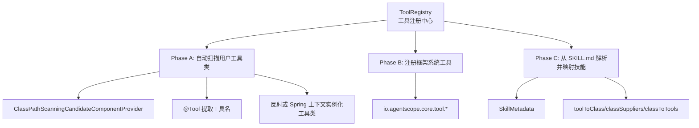
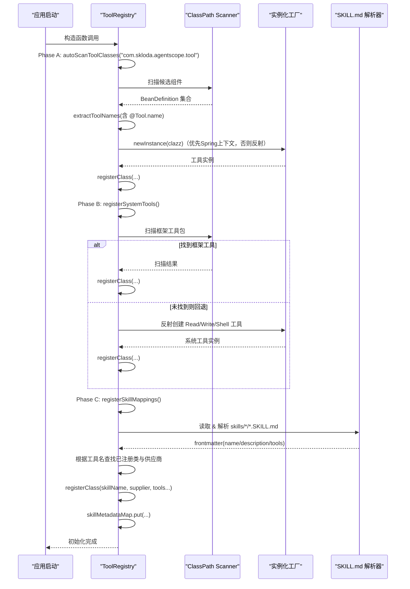
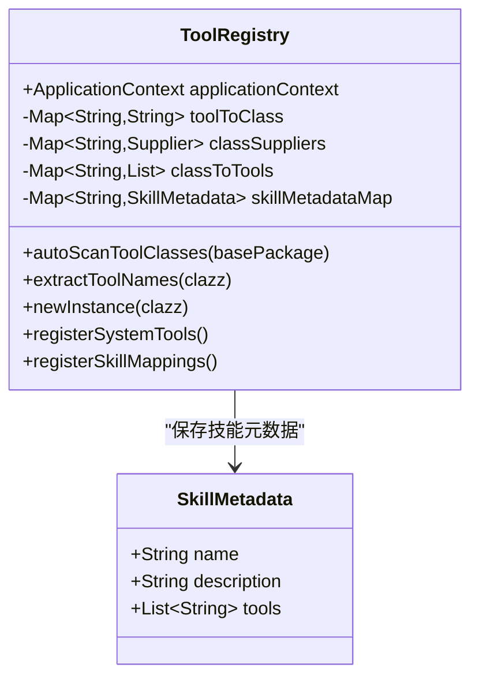
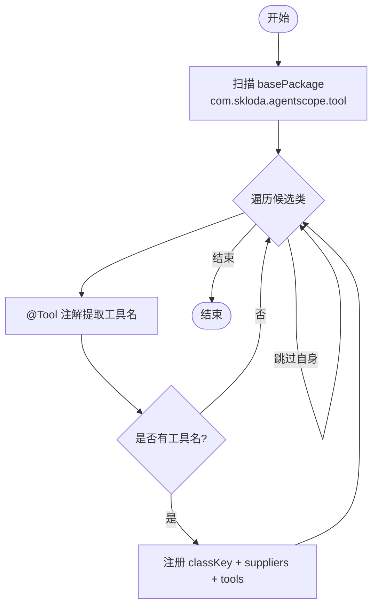
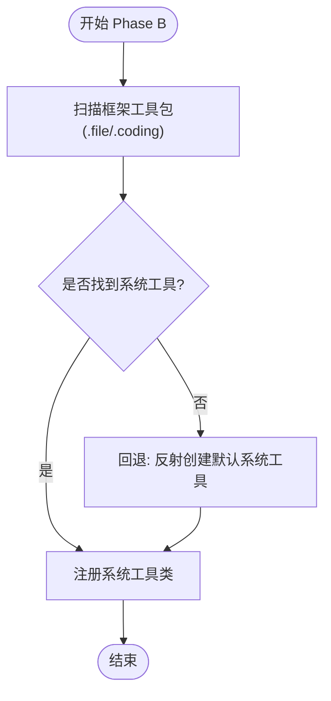
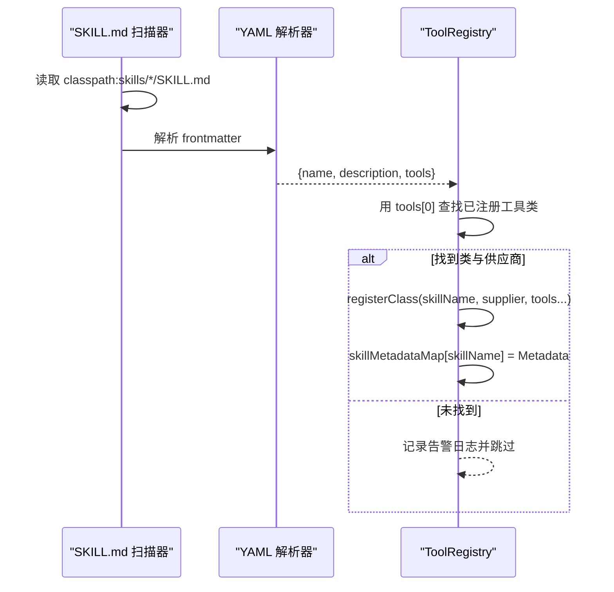
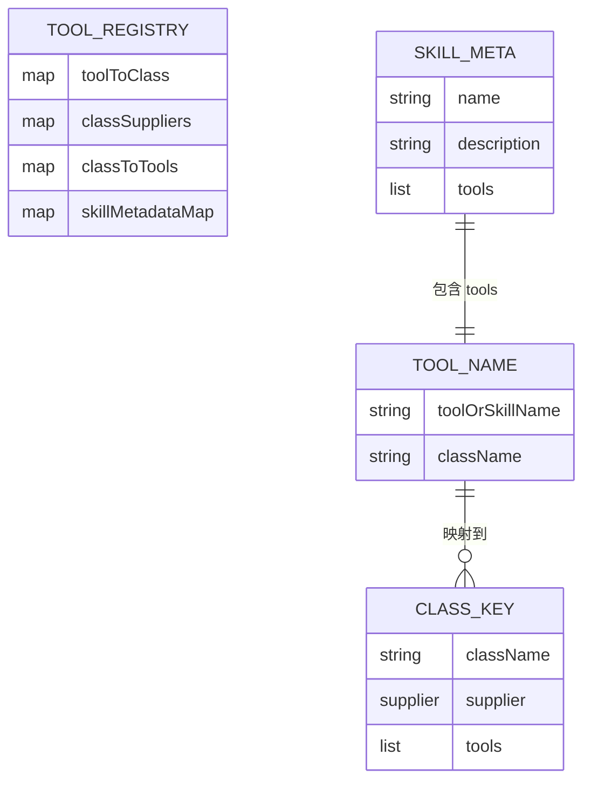
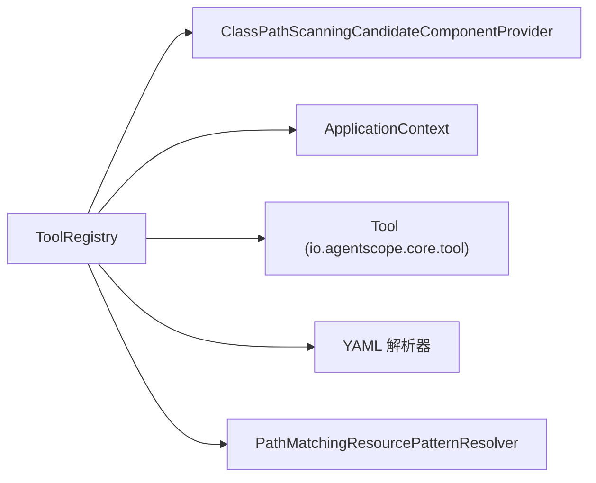

# 工具注册中心

<cite>
**本文引用的文件**
- [src/main/java/com/skloda/agentscope/tool/ToolRegistry.java](file://src/main/java/com/skloda/agentscope/tool/ToolRegistry.java)
- [src/main/java/com/skloda/agentscope/tool/SimpleTools.java](file://src/main/java/com/skloda/agentscope/tool/SimpleTools.java)
- [src/main/java/com/skloda/agentscope/tool/BankInvoiceTool.java](file://src/main/java/com/skloda/agentscope/tool/BankInvoiceTool.java)
- [src/main/resources/skills/bank_invoice_java/SKILL.md](file://src/main/resources/skills/bank_invoice_java/SKILL.md)
</cite>

## 目录
1. [简介](#简介)
2. [项目结构](#项目结构)
3. [核心组件](#核心组件)
4. [架构总览](#架构总览)
5. [详细组件分析](#详细组件分析)
6. [依赖关系分析](#依赖关系分析)
7. [性能考量](#性能考量)
8. [故障排查指南](#故障排查指南)
9. [结论](#结论)
10. [附录](#附录)

## 简介
本文件围绕工具注册中心（ToolRegistry）展开，系统化说明其三阶段工具发现机制与技能元数据处理机制。重点包括：
- Phase A：用户工具类自动扫描（基于 @Tool 注解）
- Phase B：AgentScope 内置系统工具注册
- Phase C：从 SKILL.md frontmatter 动态加载技能到工具的映射
并结合数据结构设计、反射实例化、分类管理与流程图、时序图，帮助读者全面理解工具注册流程及扩展点。

## 项目结构
- ToolRegistry 是工具注册中心，位于 tool 包中，负责发现、分类、缓存并维护三类工具来源：用户工具类、框架系统工具、技能映射。
- 示例工具类位于同包下：SimpleTools、BankInvoiceTool 等，使用 @Tool 注解暴露方法为工具接口。
- 技能描述文件位于 resources/skills/ 下，以 SKILL.md 形式声明 name、description、tools 等 frontmatter，供 Phase C 解析。

图表来源
- [src/main/java/com/skloda/agentscope/tool/ToolRegistry.java:33-43](file://src/main/java/com/skloda/agentscope/tool/ToolRegistry.java#L33-L43)
- [src/main/java/com/skloda/agentscope/tool/ToolRegistry.java:73-121](file://src/main/java/com/skloda/agentscope/tool/ToolRegistry.java#L73-L121)
- [src/main/java/com/skloda/agentscope/tool/ToolRegistry.java:125-151](file://src/main/java/com/skloda/agentscope/tool/ToolRegistry.java#L125-L151)
- [src/main/java/com/skloda/agentscope/tool/ToolRegistry.java:155-199](file://src/main/java/com/skloda/agentscope/tool/ToolRegistry.java#L155-L199)

章节来源
- [src/main/java/com/skloda/agentscope/tool/ToolRegistry.java:23-69](file://src/main/java/com/skloda/agentscope/tool/ToolRegistry.java#L23-L69)
- [src/main/resources/skills/bank_invoice_java/SKILL.md:1-4](file://src/main/resources/skills/bank_invoice_java/SKILL.md#L1-L4)

## 核心组件
- ToolRegistry：三阶段工具注册协调器，维护映射与缓存。
- SkillMetadata：技能元数据载体（name、description、tools）。
- 内部数据结构：
  - toolToClass：工具名→类名（字符串键）的映射
  - classSuppliers：类名（字符串键）→对象供应商（Supplier）映射，延迟实例化工具类实例
  - classToTools：类名→其提供的工具名列表
  - skillMetadataMap：技能名→SkillMetadata 映射

章节来源
- [src/main/java/com/skloda/agentscope/tool/ToolRegistry.java:52-69](file://src/main/java/com/skloda/agentscope/tool/ToolRegistry.java#L52-L69)

## 架构总览
ToolRegistry 在构造时按固定顺序执行三个阶段，完成工具注册：
1. Phase A：通过 ClassPathScanningCandidateComponentProvider 扫描基础包 com.skloda.agentscope.tool，提取每个类的 @Tool 方法名，注册该类及其工具。
2. Phase B：尝试通过同样方式扫描 AgentScope 内置工具包 io.agentscope.core.tool.file 和 .coding；若未发现则回退到显式类名反射注册 ReadFileTool、WriteFileTool、ShellCommandTool。
3. Phase C：扫描 classpath:skills/*/SKILL.md，解析 frontmatter 获取技能的 name/description/tools，并根据 tools[0] 所对应的工具名反查已注册的类名与供应商，将技能名也注册为一个“工具键”，复用该供应商，同时记录 SkillMetadata。

图表来源
- [src/main/java/com/skloda/agentscope/tool/ToolRegistry.java:33-43](file://src/main/java/com/skloda/agentscope/tool/ToolRegistry.java#L33-L43)
- [src/main/java/com/skloda/agentscope/tool/ToolRegistry.java:73-121](file://src/main/java/com/skloda/agentscope/tool/ToolRegistry.java#L73-L121)
- [src/main/java/com/skloda/agentscope/tool/ToolRegistry.java:125-151](file://src/main/java/com/skloda/agentscope/tool/ToolRegistry.java#L125-L151)
- [src/main/java/com/skloda/agentscope/tool/ToolRegistry.java:155-199](file://src/main/java/com/skloda/agentscope/tool/ToolRegistry.java#L155-L199)

## 详细组件分析

### ToolRegistry 类结构与职责
- 生命周期：构造期间一次性完成三个阶段的工具注册，并打印注册统计信息。
- 核心字段：
  - toolToClass：维护“工具名 → 类名”的双向索引之一，便于由工具名定位实现类
  - classSuppliers：维护“类名 → 对象供应商”，延迟构建具体工具实例，避免不必要的对象创建
  - classToTools：维护“类名 → 工具名集合”，支持一个类提供多个工具
  - skillMetadataMap：存储从 SKILL.md 解析的技能元数据，供上层消费（如 AgentConfigService）展示能力菜单
- 关键策略：
  - 工具实例化优先从 Spring 容器取 Bean（以便支持 @Value/@Autowired），不可用时回退至反射 new 实例
  - 系统工具采用“先扫描后回退”的策略，确保在无完整 classpath 时仍可使用常用系统工具

章节来源
- [src/main/java/com/skloda/agentscope/tool/ToolRegistry.java:23-69](file://src/main/java/com/skloda/agentscope/tool/ToolRegistry.java#L23-L69)
- [src/main/java/com/skloda/agentscope/tool/ToolRegistry.java:109-121](file://src/main/java/com/skloda/agentscope/tool/ToolRegistry.java#L109-L121)
- [src/main/java/com/skloda/agentscope/tool/ToolRegistry.java:125-151](file://src/main/java/com/skloda/agentscope/tool/ToolRegistry.java#L125-L151)

图表来源
- [src/main/java/com/skloda/agentscope/tool/ToolRegistry.java:23-69](file://src/main/java/com/skloda/agentscope/tool/ToolRegistry.java#L23-L69)

### Phase A：用户工具类自动扫描与注册
- 扫描入口：basePackage = "com.skloda.agentscope.tool"
- 使用 ClassPathScanningCandidateComponentProvider，对所有类开放扫描
- 对于每个候选类：
  - 跳过自身（ToolRegistry.class）
  - 提取方法上的 @Tool 注解名称，收集工具名列表
  - 如果存在工具名，则以类名为 key 注册：
    - toolToClass：工具名 → 类名
    - classSuppliers：类名 → Supplier<Object>（延迟实例化）
    - classToTools：类名 → List<String>
- 实例化逻辑：优先通过 ApplicationContext.getBean(clazz) 获取（支持依赖注入），失败则反射构造

图表来源
- [src/main/java/com/skloda/agentscope/tool/ToolRegistry.java:73-96](file://src/main/java/com/skloda/agentscope/tool/ToolRegistry.java#L73-L96)
- [src/main/java/com/skloda/agentscope/tool/ToolRegistry.java:98-107](file://src/main/java/com/skloda/agentscope/tool/ToolRegistry.java#L98-L107)
- [src/main/java/com/skloda/agentscope/tool/ToolRegistry.java:109-121](file://src/main/java/com/skloda/agentscope/tool/ToolRegistry.java#L109-L121)

章节来源
- [src/main/java/com/skloda/agentscope/tool/ToolRegistry.java:73-121](file://src/main/java/com/skloda/agentscope/tool/ToolRegistry.java#L73-L121)
- [src/main/java/com/skloda/agentscope/tool/SimpleTools.java:12-43](file://src/main/java/com/skloda/agentscope/tool/SimpleTools.java#L12-L43)
- [src/main/java/com/skloda/agentscope/tool/BankInvoiceTool.java:194-198](file://src/main/java/com/skloda/agentscope/tool/BankInvoiceTool.java#L194-L198)

### Phase B：AgentScope 内置系统工具注册
- 首先尝试通过相同扫描机制，搜索 io.agentscope.core.tool.file 与 .coding 包下的工具类
- 若扫描到工具类，直接注册
- 若为空，回退到反射读取明确类名并注册：ReadFileTool、WriteFileTool、ShellCommandTool
- 该策略兼顾灵活性与鲁棒性

图表来源
- [src/main/java/com/skloda/agentscope/tool/ToolRegistry.java:125-151](file://src/main/java/com/skloda/agentscope/tool/ToolRegistry.java#L125-L151)

章节来源
- [src/main/java/com/skloda/agentscope/tool/ToolRegistry.java:125-151](file://src/main/java/com/skloda/agentscope/tool/ToolRegistry.java#L125-L151)

### Phase C：动态技能映射加载（SKILL.md frontmatter）
- 资源路径：classpath:skills/*/SKILL.md
- 解析 frontmatter（YAML），提取 name、description、tools
- 校验必要字段：name 与 tools 非空
- 根据 tools 中的第一个工具名反向查询已注册的类名与供应商：
  - toolToClass.get(toolName) → className
  - classSuppliers.get(className) → supplier
- 将技能名本身作为新的“工具键”注册，复用同一供应商并绑定所有 tools（用于 UI 菜单或调用）
- 记录 SkillMetadata 到 skillMetadataMap，供上层服务使用

图表来源
- [src/main/java/com/skloda/agentscope/tool/ToolRegistry.java:155-199](file://src/main/java/com/skloda/agentscope/tool/ToolRegistry.java#L155-L199)
- [src/main/resources/skills/bank_invoice_java/SKILL.md:1-4](file://src/main/resources/skills/bank_invoice_java/SKILL.md#L1-L4)

章节来源
- [src/main/java/com/skloda/agentscope/tool/ToolRegistry.java:155-199](file://src/main/java/com/skloda/agentscope/tool/ToolRegistry.java#L155-L199)
- [src/main/resources/skills/bank_invoice_java/SKILL.md:1-4](file://src/main/resources/skills/bank_invoice_java/SKILL.md#L1-L4)

### 工具分类管理的数据结构
- toolToClass：以“工具函数名（或技能名）→ 类名（字符串键）”的形式建立索引，便于快速逆向查找工具归属
- classSuppliers：以“类名 → Supplier”的形式缓存实例化逻辑，惰性生成对象，降低启动开销
- classToTools：以“类名 → 工具名列表”的聚合关系，表示某工具类对外提供的所有工具
- skillMetadataMap：以“技能名 → SkillMetadata”的元数据登记，便于上层展示和校验

图表来源
- [src/main/java/com/skloda/agentscope/tool/ToolRegistry.java:52-69](file://src/main/java/com/skloda/agentscope/tool/ToolRegistry.java#L52-L69)

### @Tool 注解提取与反射实例化机制
- 注解提取：遍历目标类的方法，使用 getAnnotation(Tool.class)，过滤 name 非空的工具
- 实例化策略：优先从 Spring 上下文获取 Bean，若失败则走反射 new 实例；异常时抛出包装运行时异常
- 优势：既支持 Spring 依赖注入，又在早期阶段或特殊场景保证可用

章节来源
- [src/main/java/com/skloda/agentscope/tool/ToolRegistry.java:98-107](file://src/main/java/com/skloda/agentscope/tool/ToolRegistry.java#L98-L107)
- [src/main/java/com/skloda/agentscope/tool/ToolRegistry.java:109-121](file://src/main/java/com/skloda/agentscope/tool/ToolRegistry.java#L109-L121)
- [src/main/java/com/skloda/agentscope/tool/SimpleTools.java:12-43](file://src/main/java/com/skloda/agentscope/tool/SimpleTools.java#L12-L43)

## 依赖关系分析
- Spring 集成：使用 ClassPathScanningCandidateComponentProvider 进行类扫描；通过 ApplicationContext 获取 Bean（支持依赖注入）
- AgentScope 核心：依赖 io.agentscope.core.tool.Tool 注解定义工具方法契约
- YAML 解析：snakeyaml 用于解析 SKILL.md frontmatter
- 文件系统资源：PathMatchingResourcePatternResolver 扫描 classpath 资源

图表来源
- [src/main/java/com/skloda/agentscope/tool/ToolRegistry.java:6-21](file://src/main/java/com/skloda/agentscope/tool/ToolRegistry.java#L6-L21)
- [src/main/java/com/skloda/agentscope/tool/ToolRegistry.java:73-96](file://src/main/java/com/skloda/agentscope/tool/ToolRegistry.java#L73-L96)
- [src/main/java/com/skloda/agentscope/tool/ToolRegistry.java:155-199](file://src/main/java/com/skloda/agentscope/tool/ToolRegistry.java#L155-L199)

章节来源
- [src/main/java/com/skloda/agentscope/tool/ToolRegistry.java:6-21](file://src/main/java/com/skloda/agentscope/tool/ToolRegistry.java#L6-L21)

## 性能考量
- 延迟实例化：通过 Supplier 缓存创建逻辑，按需构建工具实例，避免启动时全量实例化带来的内存与时间开销
- 首次访问优化：第一阶段已完成类扫描与工具名注册，后续只需解析 supplier，提升响应速度
- 资源扫描成本：扫描 basePackage 与框架包属于一次性开销；建议仅扫描必要的包，减少无关节点扫描
- 回退策略：系统工具在未扫描到的情况下通过反射注册，避免额外依赖引入的成本
- 并发安全：使用 ConcurrentHashMap 保证多读写环境下的线程安全

## 故障排查指南
- 技能映射失效
  - 检查 SKILL.md 的 frontmatter 是否包含有效 name 与 tools；缺失将被跳过并记录告警
  - 确认 tools[0] 已在 phase A/B 中被成功注册；否则无法映射技能到具体类与供应商
- 工具未出现在能力清单
  - 确认工具类所在包已被纳入 Phase A 扫描范围
  - 确认方法上确实标注了 @Tool 且 name 非空
- 系统工具不可用
  - 若框架工具扫描为空，会回退到显式类名反射注册；若反射失败则会告警并忽略
- 工具类依赖注入失败
  - 优先从 Spring 上下文获取 Bean；若失败则回退反射构造
  - 若仍失败，检查工具类是否存在无参构造器，并确保依赖可注入

章节来源
- [src/main/java/com/skloda/agentscope/tool/ToolRegistry.java:92-94](file://src/main/java/com/skloda/agentscope/tool/ToolRegistry.java#L92-L94)
- [src/main/java/com/skloda/agentscope/tool/ToolRegistry.java:118-121](file://src/main/java/com/skloda/agentscope/tool/ToolRegistry.java#L118-L121)
- [src/main/java/com/skloda/agentscope/tool/ToolRegistry.java:169-192](file://src/main/java/com/skloda/agentscope/tool/ToolRegistry.java#L169-L192)
- [src/main/java/com/skloda/agentscope/tool/ToolRegistry.java:146-149](file://src/main/java/com/skloda/agentscope/tool/ToolRegistry.java#L146-L149)

## 结论
ToolRegistry 通过三阶段工具发现机制，将用户自定义工具、框架系统工具与 SKILL.md 技能描述有机整合，形成统一的工具注册与服务提供面。其通过 ClassPath 扫描、@Tool 注解提取、Supplier 延迟实例化、多维度映射表等设计，实现了可扩展、健壮且易用的工具生态注册中心。配合清晰的错误日志与回退策略，能够在不同运行环境下稳定工作。

## 附录
- 配置示例（基于仓库现有 SKILL.md 与工具类）
  - 在 resources/skills/bank_invoice_java/SKILL.md 中定义 name、description、tools，即可被 Phase C 解析并映射到 BankInvoiceTool 提供的 generate_bank_invoice 工具
  - SimpleTools 提供了若干演示工具（例如获取当前时间、求和、天气查询），均在 Phase A 自动注册

章节来源
- [src/main/resources/skills/bank_invoice_java/SKILL.md:1-4](file://src/main/resources/skills/bank_invoice_java/SKILL.md#L1-L4)
- [src/main/java/com/skloda/agentscope/tool/SimpleTools.java:12-43](file://src/main/java/com/skloda/agentscope/tool/SimpleTools.java#L12-L43)
- [src/main/java/com/skloda/agentscope/tool/BankInvoiceTool.java:194-198](file://src/main/java/com/skloda/agentscope/tool/BankInvoiceTool.java#L194-L198)