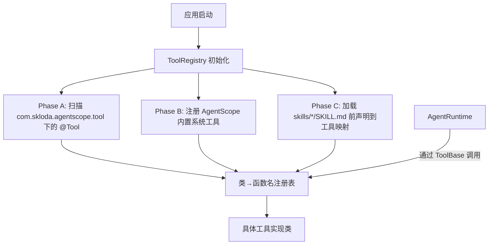
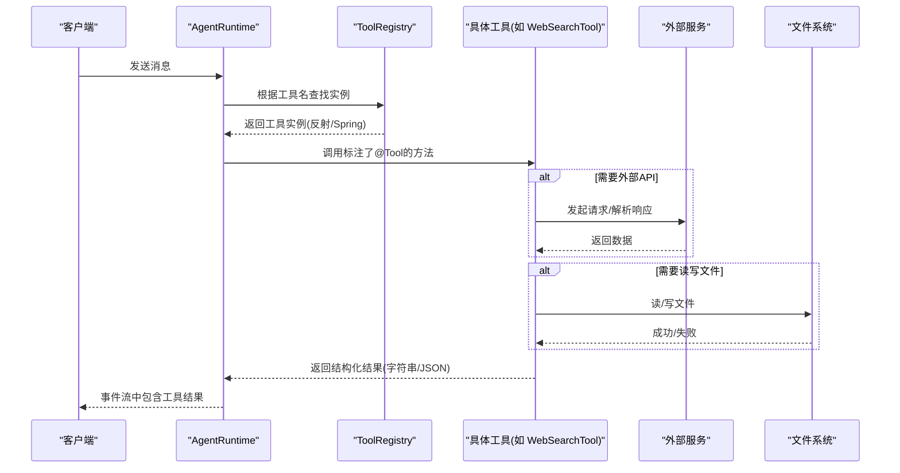
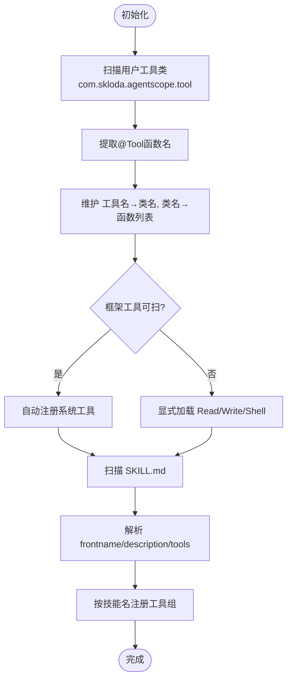
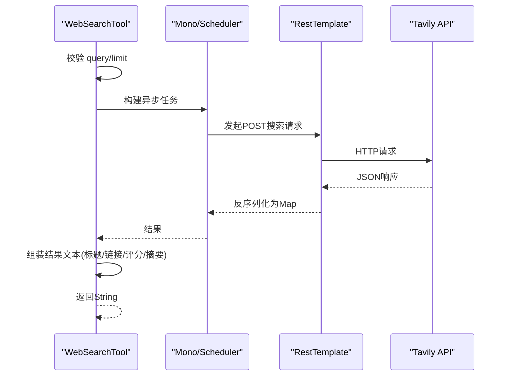
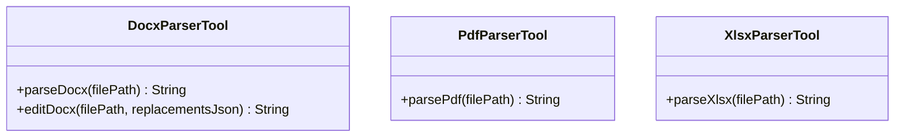
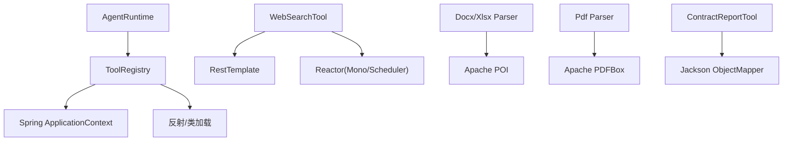

# 工具系统

<cite>
**本文引用的文件**
- [ToolRegistry.java](file://src/main/java/com/skloda/agentscope/tool/ToolRegistry.java)
- [SimpleTools.java](file://src/main/java/com/skloda/agentscope/tool/SimpleTools.java)
- [WebSearchTool.java](file://src/main/java/com/skloda/agentscope/tool/WebSearchTool.java)
- [DocxParserTool.java](file://src/main/java/com/skloda/agentscope/tool/DocxParserTool.java)
- [PdfParserTool.java](file://src/main/java/com/skloda/agentscope/tool/PdfParserTool.java)
- [XlsxParserTool.java](file://src/main/java/com/skloda/agentscope/tool/XlsxParserTool.java)
- [BankInvoiceTool.java](file://src/main/java/com/skloda/agentscope/tool/BankInvoiceTool.java)
- [ContractReviewReportTool.java](file://src/main/java/com/skloda/agentscope/tool/ContractReviewReportTool.java)
- [AgentRuntime.java](file://src/main/java/com/skloda/agentscope/runtime/AgentRuntime.java)
- [application.yml](file://src/main/resources/application.yml)
- [WebSearchToolTest.java](file://src/test/java/com/skloda/agentscope/tool/WebSearchToolTest.java)
- [DocxParserToolTest.java](file://src/test/java/com/skloda/agentscope/tool/DocxParserToolTest.java)
- [SimpleToolsTest.java](file://src/test/java/com/skloda/agentscope/tool/SimpleToolsTest.java)
</cite>

## 目录
1. [简介](#简介)
2. [项目结构（工具子系统）](#项目结构工具子系统)
3. [核心组件](#核心组件)
4. [架构总览](#架构总览)
5. [详细组件分析](#详细组件分析)
6. [依赖关系分析](#依赖关系分析)
7. [性能考虑](#性能考虑)
8. [故障排查指南](#故障排查指南)
9. [结论](#结论)
10. [附录：自定义工具开发指南](#附录自定义工具开发指南)

## 简介
本技术文档围绕 AgentScope 集成中的“工具系统”展开，聚焦于工具的注册机制、发现与分类管理、动态加载原理，以及对内置文件系统操作、网络搜索、文档解析等工具的深入实现分析。同时给出 @Tool 注解的工作机制说明、参数校验与异常处理、返回值序列化方式，以及自定义工具从编写到测试、部署的全流程指南，并补充企业级安全限制、资源管理与性能优化建议。

## 项目结构（工具子系统）
工具子系统位于 com.skloda.agentscope.tool 包中，包含通用工具、特定领域工具及一个统一的工具注册中心。关键入口和职责如下：
- 工具注册与发现：ToolRegistry（三阶段初始化：自动扫描用户工具类、内置系统工具、技能映射）
- 简易工具集：SimpleTools（时间查询、计算、模拟天气等示例）
- 网络搜索：WebSearchTool（基于第三方 API 的聚合搜索与结果格式化）
- 文档解析：DocxParserTool、PdfParserTool、XlsxParserTool（基于 Apache POI/PDFBox）
- 业务工具：BankInvoiceTool（生成发票 Excel/Word）、ContractReviewReportTool（生成审查报告 Markdown）
- 运行时接入：AgentRuntime（在 AgentScope 运行时以流式事件方式调用工具）
- 配置开关：application.yml（启用内置工具、模型等）

图表来源
- [ToolRegistry.java:23-44](file://src/main/java/com/skloda/agentscope/tool/ToolRegistry.java#L23-L44)
- [AgentRuntime.java:68-100](file://src/main/java/com/skloda/agentscope/runtime/AgentRuntime.java#L68-L100)

章节来源
- [ToolRegistry.java:23-44](file://src/main/java/com/skloda/agentscope/tool/ToolRegistry.java#L23-L44)
- [application.yml:51-54](file://src/main/resources/application.yml#L51-L54)

## 核心组件
- ToolRegistry：统一登记与查找工具实例，支持反射创建与 Spring 容器注入；提供技能（skill）与工具名称的多对一映射能力。
- SimpleTools：基础工具集合，演示 @Tool + @ToolParam 的使用方式和返回结构化文本。
- WebSearchTool：对外部网络搜索 API 的封装，含参数校验、限流策略控制、响应组装。
- DocxParserTool / PdfParserTool / XlsxParserTool：面向 Word、PDF、Excel 的解析与编辑能力。
- BankInvoiceTool：面向金融场景的模板填充与文件输出。
- ContractReviewReportTool：将结构化数据渲染为可下载的报告文件。

章节来源
- [SimpleTools.java:12-44](file://src/main/java/com/skloda/agentscope/tool/SimpleTools.java#L12-L44)
- [WebSearchTool.java:20-134](file://src/main/java/com/skloda/agentscope/tool/WebSearchTool.java#L20-L134)
- [DocxParserTool.java:17-127](file://src/main/java/com/skloda/agentscope/tool/DocxParserTool.java#L17-L127)
- [PdfParserTool.java:15-71](file://src/main/java/com/skloda/agentscope/tool/PdfParserTool.java#L15-L71)
- [XlsxParserTool.java:13-107](file://src/main/java/com/skloda/agentscope/tool/XlsxParserTool.java#L13-L107)
- [BankInvoiceTool.java:19-211](file://src/main/java/com/skloda/agentscope/tool/BankInvoiceTool.java#L19-L211)
- [ContractReviewReportTool.java:23-166](file://src/main/java/com/skloda/agentscope/tool/ContractReviewReportTool.java#L23-L166)

## 架构总览
工具系统的生命周期包括“注册-发现-解析-执行-回传”五步。注册与发现由 ToolRegistry 完成；运行时由 AgentRuntime 驱动；具体工具负责 IO、网络或计算逻辑；返回值为字符串或 JSON 字符串，供上层统一处理。

图表来源
- [AgentRuntime.java:68-100](file://src/main/java/com/skloda/agentscope/runtime/AgentRuntime.java#L68-L100)
- [ToolRegistry.java:71-121](file://src/main/java/com/skloda/agentscope/tool/ToolRegistry.java#L71-L121)
- [WebSearchTool.java:30-134](file://src/main/java/com/skloda/agentscope/tool/WebSearchTool.java#L30-L134)

## 详细组件分析

### 注册机制与发现算法
- Phase A：基于 classpath 扫描 com.skloda.agentscope.tool，使用反射提取方法上带有 @Tool 注解且 name 非空的方法，生成“工具名 → 类名”与“类名 → 工具名列表”，并缓存 Supplier。
- Phase B：优先尝试自动扫描框架内置工具包；若不可用则显式加载常用系统工具类（读取/写入文件、Shell 命令）进行注册。
- Phase C：扫描 classpath:skills/*/SKILL.md，解析 YAML frontmatter 提取 name/description/tools，找到对应类的 Supplier 后以 skill 名为键再注册，形成“技能名 → 多个工具名”的能力分组。

关键点
- 工具实例化优先走 Spring 容器获取（利于 @Value/@Autowired），回退到无参构造函数反射实例化。
- 注册过程幂等性依赖 Map 覆盖语义；日志用于追踪注册规模。

图表来源
- [ToolRegistry.java:71-96](file://src/main/java/com/skloda/agentscope/tool/ToolRegistry.java#L71-L96)
- [ToolRegistry.java:125-150](file://src/main/java/com/skloda/agentscope/tool/ToolRegistry.java#L125-L150)
- [ToolRegistry.java:155-199](file://src/main/java/com/skloda/agentscope/tool/ToolRegistry.java#L155-L199)

章节来源
- [ToolRegistry.java:23-44](file://src/main/java/com/skloda/agentscope/tool/ToolRegistry.java#L23-L44)
- [ToolRegistry.java:71-121](file://src/main/java/com/skloda/agentscope/tool/ToolRegistry.java#L71-L121)
- [ToolRegistry.java:125-199](file://src/main/java/com/skloda/agentscope/tool/ToolRegistry.java#L125-L199)

### 注解、参数验证与返回序列化
- @Tool 与 @ToolParam：在方法签名处声明工具名、描述，参数通过 name/description 标注，便于 LLM 推理时理解入参与约束。
- 输入校验：各工具在入口处进行空值、空白检查（如网络搜索为空则直接返回错误提示），避免无效网络请求与 NPE。
- 异常处理：捕获 IO、网络异常后记录日志并返回友好错误信息或结构化 JSON 字段，确保流式传输稳定。
- 返回值序列化：多数工具直接返回字符串；对于复杂对象（如 DOCX 编辑、合同报告），采用 Jackson ObjectMapper 序列化为 JSON 字符串，方便上层解析与展示。

章节来源
- [SimpleTools.java:12-44](file://src/main/java/com/skloda/agentscope/tool/SimpleTools.java#L12-L44)
- [WebSearchTool.java:30-134](file://src/main/java/com/skloda/agentscope/tool/WebSearchTool.java#L30-L134)
- [DocxParserTool.java:60-127](file://src/main/java/com/skloda/agentscope/tool/DocxParserTool.java#L60-L127)
- [ContractReviewReportTool.java:31-86](file://src/main/java/com/skloda/agentscope/tool/ContractReviewReportTool.java#L31-L86)

### 内置工具详解

#### 文件系统操作（系统工具）
- 功能：通过 AgentScope 提供的系统工具（ReadFileTool、WriteFileTool、ShellCommandTool）完成文件 I/O 与命令执行。
- 注册：在注册第二阶段尝试自动扫描框架工具包；若不可用则通过类全限定名显式加载并注册。
- 风险：命令执行需在生产环境严格管控，建议使用沙箱与白名单。

章节来源
- [ToolRegistry.java:125-150](file://src/main/java/com/skloda/agentscope/tool/ToolRegistry.java#L125-L150)

#### 网络搜索工具（WebSearchTool）
- 能力：web_search、get_current_weather、get_stock_price、get_news。
- 实现要点：
  - 参数校验：query/city/symbol/topic 为空时直接返回错误提示。
  - 并发：使用 Mono.fromCallable + Schedulers.boundedElastic 包裹同步 RestTemplate 调用，避免阻塞主线程。
  - 限流与安全：searchLimit 限定最大返回数；超时与异常归一化错误消息。
  - 结果格式：构造可读性强的结果块，包含标题、链接、相关性分数、摘要截断。
- 测试：单元测试覆盖空输入拒绝、默认话题与默认条数、以及子方法委派行为。

图表来源
- [WebSearchTool.java:30-134](file://src/main/java/com/skloda/agentscope/tool/WebSearchTool.java#L30-L134)

章节来源
- [WebSearchTool.java:20-134](file://src/main/java/com/skloda/agentscope/tool/WebSearchTool.java#L20-L134)
- [WebSearchToolTest.java:7-63](file://src/test/java/com/skloda/agentscope/tool/WebSearchToolTest.java#L7-L63)

#### 文档解析工具
- DocxParserTool：
  - parse_docx：遍历段落、表格，保留标题层级与列表缩进。
  - edit_docx：接收 JSON 替换规则，批量替换占位符并写出新文件，返回 JSON 结果（包含 success、outputFilePath、replacementsMade）。
  - 容错：空内容文件、IO 异常返回错误提示。
- PdfParserTool：
  - parse_pdf：读取元信息与全文，当页数大于3时分页输出，页眉标注页码。
- XlsxParserTool：
  - parse_xlsx：逐 Sheet 输出 sheet 名、表头、行数据，日期类型转为格式化字符串，空单元格显示 blank。

图表来源
- [DocxParserTool.java:24-127](file://src/main/java/com/skloda/agentscope/tool/DocxParserTool.java#L24-L127)
- [PdfParserTool.java:19-71](file://src/main/java/com/skloda/agentscope/tool/PdfParserTool.java#L19-L71)
- [XlsxParserTool.java:17-107](file://src/main/java/com/skloda/agentscope/tool/XlsxParserTool.java#L17-L107)

章节来源
- [DocxParserTool.java:17-127](file://src/main/java/com/skloda/agentscope/tool/DocxParserTool.java#L17-L127)
- [PdfParserTool.java:15-71](file://src/main/java/com/skloda/agentscope/tool/PdfParserTool.java#L15-L71)
- [XlsxParserTool.java:13-107](file://src/main/java/com/skloda/agentscope/tool/XlsxParserTool.java#L13-L107)
- [DocxParserToolTest.java:18-90](file://src/test/java/com/skloda/agentscope/tool/DocxParserToolTest.java#L18-L90)

#### 业务工具
- BankInvoiceTool：
  - generate_bank_invoice：根据银行发票模板填充数据，生成 .xlsx 与 .docx，输出至临时目录 agentscope-uploads，文件名包含脱敏姓名与流水号。
  - 安全：姓名自动脱敏，路径与文件名规范生成。
- ContractReviewReportTool：
  - generate_contract_review_report：接收扁平化审查字段，校验后渲染为 Markdown 报告，输出到临时目录并提供下载 URL。
  - 校验：使用 StructuredOutputValidator 进行结构化数据校验，错误以 JSON 形式返回。

章节来源
- [BankInvoiceTool.java:19-211](file://src/main/java/com/skloda/agentscope/tool/BankInvoiceTool.java#L19-L211)
- [ContractReviewReportTool.java:23-166](file://src/main/java/com/skloda/agentscope/tool/ContractReviewReportTool.java#L23-L166)

### @Tool 注解工作机制（代码层面）
- 标注位置：放在目标工具类的方法上，配合 @ToolParam 描述入参。
- 发现方式：ToolRegistry 利用反射读取所有带 @Tool(name 非空) 的方法名，完成工具名到实现的映射。
- 生命周期：ToolRegistry 初始化时完成注册；运行时由 AgentRuntime 通过工具名检索并调用。

图表来源
- [ToolRegistry.java:71-121](file://src/main/java/com/skloda/agentscope/tool/ToolRegistry.java#L71-L121)
- [AgentRuntime.java:68-100](file://src/main/java/com/skloda/agentscope/runtime/AgentRuntime.java#L68-L100)

## 依赖关系分析
- 组件耦合度低：工具类之间解耦，各自专注单一职责（网络、文件、解析、报告等）。
- 依赖方向：AgentRuntime 依赖 ToolRegistry；ToolRegistry 依赖反射与 Spring ApplicationContext；工具类依赖第三方库（Apache POI、PDFBox、Reactor、Jackson）。
- 外部依赖：
  - Apache POI（DOCX/XLSX）：文档读写
  - Apache PDFBox（PDF）：文本提取
  - Reactor（Mono/Flux/Schedulers）：异步编排
  - Jackson（ObjectMapper）：JSON 序列化
  - RestTemplate：HTTP 调用

图表来源
- [ToolRegistry.java:71-121](file://src/main/java/com/skloda/agentscope/tool/ToolRegistry.java#L71-L121)
- [WebSearchTool.java:30-134](file://src/main/java/com/skloda/agentscope/tool/WebSearchTool.java#L30-L134)
- [DocxParserTool.java:24-127](file://src/main/java/com/skloda/agentscope/tool/DocxParserTool.java#L24-L127)
- [PdfParserTool.java:19-71](file://src/main/java/com/skloda/agentscope/tool/PdfParserTool.java#L19-L71)
- [ContractReviewReportTool.java:31-86](file://src/main/java/com/skloda/agentscope/tool/ContractReviewReportTool.java#L31-L86)

章节来源
- [application.yml:25-54](file://src/main/resources/application.yml#L25-L54)

## 性能考虑
- 网络访问
  - 使用 boundedElastic 调度器包装同步 HTTP 调用，减少阻塞。
  - 限制单次返回条数，防止大响应导致内存峰值。
- 文档解析
  - 大文件分片读取（PDF 按页处理），降低一次性内存占用。
  - 表格/段落迭代时及时关闭流，避免资源泄漏。
- 序列化
  - 仅在必要时使用 Jackson 序列化复杂对象，普通工具直接返回字符串以减少开销。
- I/O 路径
  - 输出目录固定到临时空间（如 agentscope-uploads），便于清理与配额管理。

[本节为通用建议，不直接分析具体文件]

## 故障排查指南
- 搜索为空或失败
  - 现象：返回“搜索关键词不能为空”或“搜索失败”。
  - 定位：检查入参是否为空或空白；查看网络层异常堆栈；确认 API Key 是否有效。
  - 参考：[WebSearchTool.java:30-99](file://src/main/java/com/skloda/agentscope/tool/WebSearchTool.java#L30-L99)、[WebSearchToolTest.java:9-28](file://src/test/java/com/skloda/agentscope/tool/WebSearchToolTest.java#L9-L28)
- 解析失败或文件不存在
  - 现象：返回 “Error parsing ...” 或 “Source file not found”。
  - 定位：检查路径是否存在；观察 IOException 日志；确认文件内容与解析器兼容。
  - 参考：[DocxParserTool.java:53-56](file://src/main/java/com/skloda/agentscope/tool/DocxParserTool.java#L53-L56)、[DocxParserToolTest.java:37-42](file://src/test/java/com/skloda/agentscope/tool/DocxParserToolTest.java#L37-L42)
- 工具未生效
  - 现象：Agent 无法调用期望的工具。
  - 定位：检查 ToolRegistry 日志中的注册数量；确认 SKILL.md 中 tools 列表已包含目标工具；确认 Spring Bean 可用性。
  - 参考：[ToolRegistry.java:23-44](file://src/main/java/com/skloda/agentscope/tool/ToolRegistry.java#L23-L44)、[ToolRegistry.java:155-199](file://src/main/java/com/skloda/agentscope/tool/ToolRegistry.java#L155-L199)

章节来源
- [WebSearchTool.java:30-99](file://src/main/java/com/skloda/agentscope/tool/WebSearchTool.java#L30-L99)
- [DocxParserTool.java:53-56](file://src/main/java/com/skloda/agentscope/tool/DocxParserTool.java#L53-L56)
- [ToolRegistry.java:23-44](file://src/main/java/com/skloda/agentscope/tool/ToolRegistry.java#L23-L44)
- [ToolRegistry.java:155-199](file://src/main/java/com/skloda/agentscope/tool/ToolRegistry.java#L155-L199)

## 结论
本工具系统以 ToolRegistry 为核心，结合 @Tool 注解驱动的工具发现与分类管理，实现了多源工具的统一调度与扩展。通过分阶段的注册策略，既能快速接入自有工具，也能复用框架内置系统与技能组合。网络与文件型工具均具备完善的参数校验与异常处理，保证稳定性。建议在扩展新工具时遵循统一的参数描述、错误返回与日志规范，并结合单元测试保障质量。

[本节为总结性内容，不直接分析具体文件]

## 附录：自定义工具开发指南

### 编写规范
- 工具方法
  - 使用 @Tool(name, description) 标注方法名与用途。
  - 每个入参使用 @ToolParam(name, description) 清晰描述，便于 LLM 正确推理。
- 入参校验
  - 在服务内部尽早进行空值/格式校验，并返回友好的提示信息。
- 返回值
  - 简单工具返回字符串即可；复杂结果使用 Jackson 序列化为 JSON 字符串。
- 异常处理
  - 捕获 IO、网络异常并落盘日志，向上返回结构化错误信息。

### 单元测试建议
- 覆盖边界条件：空入参、非法字符、超长输入等。
- 覆盖正常路径：至少一种合法输入，断言预期输出格式与关键字段。
- 对依赖外部资源的工具，可通过子类重写外部方法或使用桩对象模拟。
  - 示例参见 [WebSearchToolTest.java](file://src/test/java/com/skloda/agentscope/tool/WebSearchToolTest.java#L7-L63) 的 Recording 模式。
  - 文件工具可借助 @TempDir 创建临时文件进行测试，见 [DocxParserToolTest.java](file://src/test/java/com/skloda/agentscope/tool/DocxParserToolTest.java#L18-L90)。

### 发布与部署
- 工具类放入 com.skloda.agentscope.tool 包下，保证被 classpath 扫描发现。
- 如需技能化组织，创建 skills/<tool-group>/SKILL.md 并在 frontmatter 中列出 tools 列表。
- 在 application.yml 确保 tools.enabled=true 以启用内置工具。
- 重启应用后，查看启动日志中注册的工具数量，确认注册成功。

章节来源
- [application.yml:51-54](file://src/main/resources/application.yml#L51-L54)
- [WebSearchToolTest.java:7-63](file://src/test/java/com/skloda/agentscope/tool/WebSearchToolTest.java#L7-L63)
- [DocxParserToolTest.java:18-90](file://src/test/java/com/skloda/agentscope/tool/DocxParserToolTest.java#L18-L90)
- [ToolRegistry.java:155-199](file://src/main/java/com/skloda/agentscope/tool/ToolRegistry.java#L155-L199)