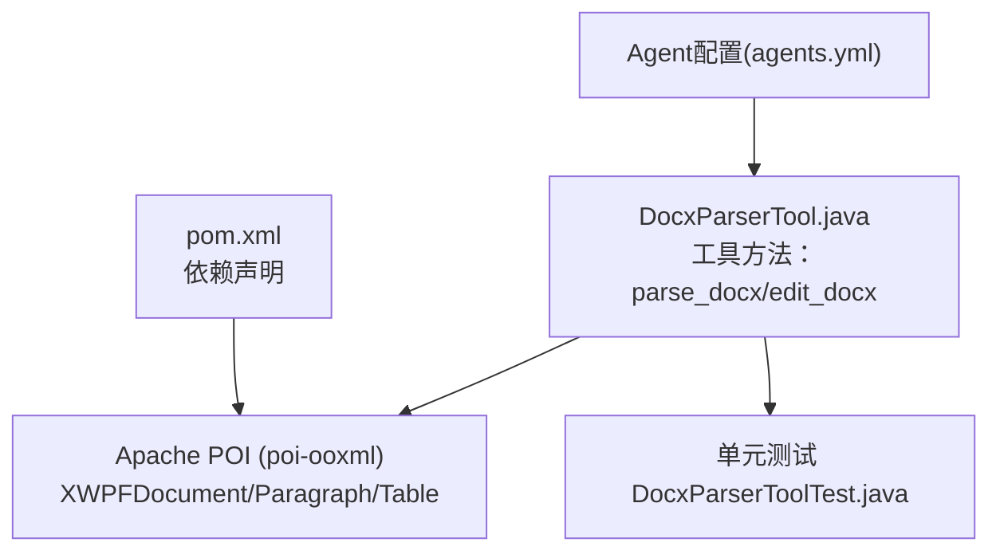
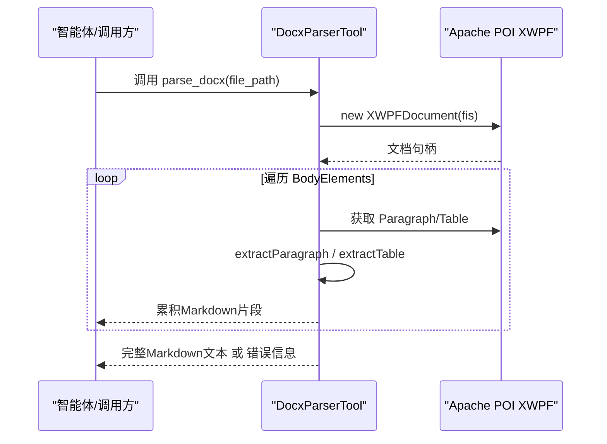
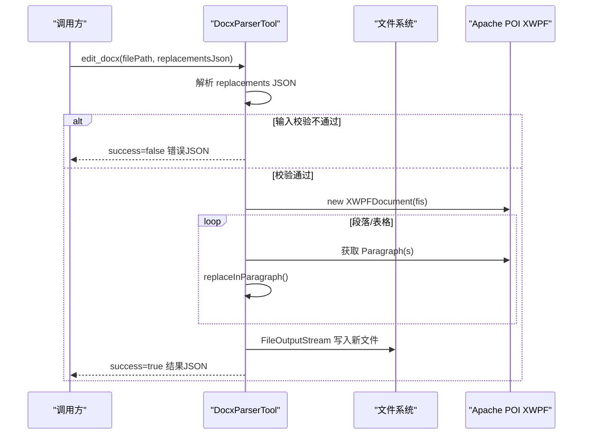
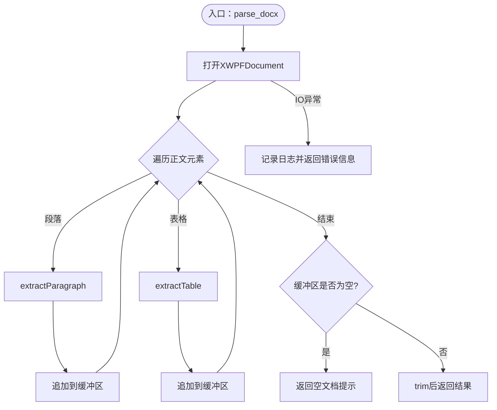
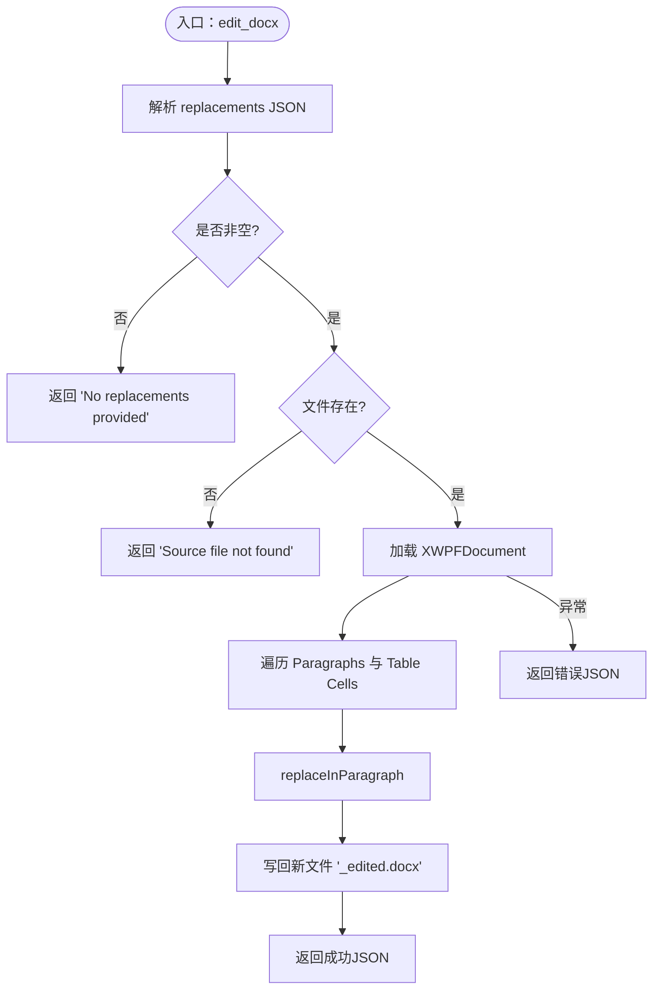
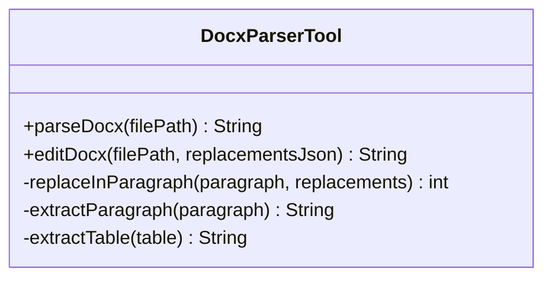
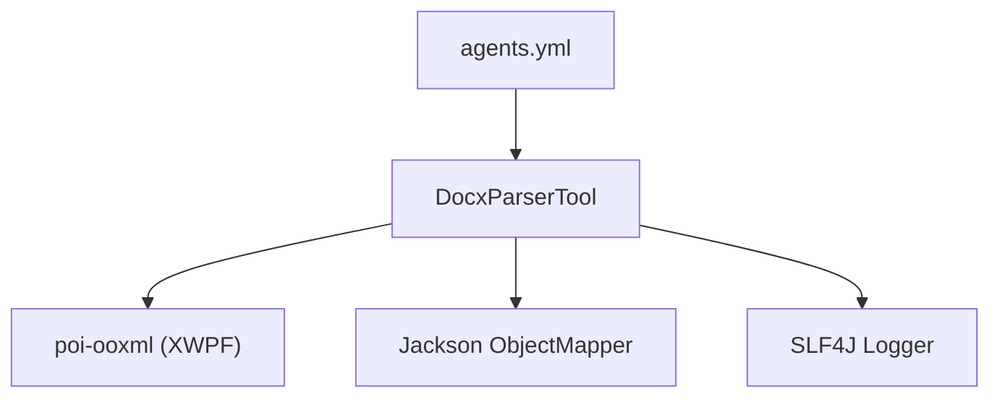

# DOCX文档解析与编辑工具

<cite>
**本文引用的文件**
- [DocxParserTool.java](file://src/main/java/com/skloda/agentscope/tool/DocxParserTool.java)
- [pom.xml](file://pom.xml)
- [DocxParserToolTest.java](file://src/test/java/com/skloda/agentscope/tool/DocxParserToolTest.java)
- [AGENTS.md](file://AGENTS.md)
- [agents.yml](file://src/main/resources/config/agents.yml)
</cite>

## 目录
1. [简介](#简介)
2. [项目结构](#项目结构)
3. [核心组件](#核心组件)
4. [架构总览](#架构总览)
5. [详细组件分析](#详细组件分析)
6. [依赖关系分析](#依赖关系分析)
7. [性能考量](#性能考量)
8. [故障排查指南](#故障排查指南)
9. [结论](#结论)
10. [附录：API接口文档](#附录api接口文档)

## 简介
本工具基于 Apache POI 的 XWPFDocument 提供 DOCX 文档的读取与编辑能力。核心包含两个工具方法：
- parse_docx：解析 .docx 文件，按段落、标题、表格、列表顺序提取内容，并将 Word 段落样式映射为 Markdown 文本，便于后续理解或处理。
- edit_docx：在 .docx 中以占位符进行替换（例如 {{name}}），支持正文和表格内替换，完成后将结果保存到带有 _edited 后缀的新文件中，返回操作结果 JSON。

工具作为 AgentScope 的工具类被注册，并可在 task-document-analysis 与 bank-invoice 等智能体工作流中调用。

**章节来源**
- [DocxParserTool.java:17-127](file://src/main/java/com/skloda/agentscope/tool/DocxParserTool.java#L17-L127)
- [agents.yml:62-91](file://src/main/resources/config/agents.yml#L62-L91)
- [agents.yml:92-170](file://src/main/resources/config/agents.yml#L92-L170)

## 项目结构
该项目为 Spring Boot + AgentScope 演示工程，DOCX 相关能力集中在工具层 tool 包中，通过 Apache POI 直接读写 XWPFDocument。测试覆盖基本用例，配置文件展示了工具如何暴露给智能体使用。

**图表来源**
- [DocxParserTool.java:1-17](file://src/main/java/com/skloda/agentscope/tool/DocxParserTool.java#L1-L17)
- [DocxParserTool.java:24-57](file://src/main/java/com/skloda/agentscope/tool/DocxParserTool.java#L24-L57)
- [DocxParserTool.java:59-127](file://src/main/java/com/skloda/agentscope/tool/DocxParserTool.java#L59-L127)
- [pom.xml:76-81](file://pom.xml#L76-L81)

**章节来源**
- [pom.xml:76-81](file://pom.xml#L76-L81)
- [DocxParserToolTest.java:18-90](file://src/test/java/com/skloda/agentscope/tool/DocxParserToolTest.java#L18-L90)
- [agents.yml:62-91](file://src/main/resources/config/agents.yml#L62-L91)

## 核心组件
- 工具类：DocxParserTool
  - parse_docx：读取 XWPFDocument，遍历正文元素，识别段落与表格，提取文本并按结构化规则输出为 Markdown。
  - edit_docx：基于 JSON 占位符映射替换正文和表格中的文字，生成新文件并返回成功/失败 JSON。

关键数据对象：
- ReplacementRecord：描述 placeholder 与 value 的配对，用于解析 replacements JSON。

错误与空文档处理：
- 文件不可读时返回错误消息字符串。
- 无正文内容时返回“文档为空”的提示。
- edit_docx：无替换项、源文件不存在、异常均返回 JSON 格式的错误信息。

样式与结构化提取：
- 段落样式 Heading1~Heading4 映射为 #、##、###、####。
- 列表通过 numFmt 与 numIlvl 层级缩进并以 “- ” 前缀表示无序列表。
- 表格每行以 Markdown 管道表形式拼接。

**章节来源**
- [DocxParserTool.java:17-57](file://src/main/java/com/skloda/agentscope/tool/DocxParserTool.java#L17-L57)
- [DocxParserTool.java:59-127](file://src/main/java/com/skloda/agentscope/tool/DocxParserTool.java#L59-L127)
- [DocxParserTool.java:157-203](file://src/main/java/com/skloda/agentscope/tool/DocxParserTool.java#L157-L203)

## 架构总览
该功能采用“工具方法即服务”的模式：上层智能体按需调用工具，底层由 Apache POI 完成真实文档读写；工具对外仅暴露参数与返回字符串，保持契约清晰。

**图表来源**
- [DocxParserTool.java:24-57](file://src/main/java/com/skloda/agentscope/tool/DocxParserTool.java#L24-L57)
- [DocxParserTool.java:157-203](file://src/main/java/com/skloda/agentscope/tool/DocxParserTool.java#L157-L203)

**图表来源**
- [DocxParserTool.java:59-127](file://src/main/java/com/skloda/agentscope/tool/DocxParserTool.java#L59-L127)

## 详细组件分析

### parse_docx：段落、表格、列表提取与样式映射
- 遍历 XWPFDocument 的 body elements，区分段落与表格分别处理。
- 段落提取：
  - 获取段落文本与样式，样式为 Heading1..4 时，转化为 Markdown 标题。
  - 若检测到编号（numFmt）且记录层级（numIlvl），则以层级缩进的无序列表项输出。
- 表格提取：
  - 逐行构建文本串，列间用 “ | ” 分隔，形成 Markdown 表格的一行。
- 空内容与异常：
  - 若整个文档未产生有效内容，返回“文档为空”的提示。
  - IO异常捕获后返回“解析失败”的错误消息。

**图表来源**
- [DocxParserTool.java:24-57](file://src/main/java/com/skloda/agentscope/tool/DocxParserTool.java#L24-L57)
- [DocxParserTool.java:157-203](file://src/main/java/com/skloda/agentscope/tool/DocxParserTool.java#L157-L203)

**章节来源**
- [DocxParserTool.java:24-57](file://src/main/java/com/skloda/agentscope/tool/DocxParserTool.java#L24-L57)
- [DocxParserTool.java:157-203](file://src/main/java/com/skloda/agentscope/tool/DocxParserTool.java#L157-L203)

### edit_docx：占位符替换机制、JSON参数解析与修改流程
- JSON参数解析：replacements 字段为数组，每个对象包含 placeholder 与 value；使用 ObjectMapper 反序列化为 ReplacementRecord 列表。
- 文件校验：检查源文件是否存在，不存在返回错误 JSON。
- 文档遍历与替换：
  - 遍历所有段落与表格单元格内的段落。
  - 对每个段落执行替换逻辑：匹配第一个可替换的 placeholder 后，清空原 runs 并写入新文本，确保样式与运行对象重置，避免冲突。
- 保存与返回：
  - 输出文件名为原文件名加 “_edited.docx”。
  - 返回包含 success、outputFilePath、replacementsMade、message 的结构化 JSON。

**图表来源**
- [DocxParserTool.java:59-127](file://src/main/java/com/skloda/agentscope/tool/DocxParserTool.java#L59-L127)
- [DocxParserTool.java:129-155](file://src/main/java/com/skloda/agentscope/tool/DocxParserTool.java#L129-L155)

**章节来源**
- [DocxParserTool.java:59-127](file://src/main/java/com/skloda/agentscope/tool/DocxParserTool.java#L59-L127)
- [DocxParserTool.java:129-155](file://src/main/java/com/skloda/agentscope/tool/DocxParserTool.java#L129-L155)

### 文档结构分析方法
- 正文元素遍历：对 document.getBodyElements() 逐一判断类型（段落、表格），依次提取。
- 表格数据处理：逐行逐列拼接单元格文本，以 “ | ” 分割单元格，形成表格行。
- 段落样式映射：通过段落 style（Heading1..4）映射为 Markdown 标题；通过 numFmt/numIlvl 判断是否为列表并计算缩进层级。

**图表来源**
- [DocxParserTool.java:24-57](file://src/main/java/com/skloda/agentscope/tool/DocxParserTool.java#L24-L57)
- [DocxParserTool.java:59-127](file://src/main/java/com/skloda/agentscope/tool/DocxParserTool.java#L59-L127)
- [DocxParserTool.java:129-203](file://src/main/java/com/skloda/agentscope/tool/DocxParserTool.java#L129-L203)

**章节来源**
- [DocxParserTool.java:24-57](file://src/main/java/com/skloda/agentscope/tool/DocxParserTool.java#L24-L57)
- [DocxParserTool.java:157-203](file://src/main/java/com/skloda/agentscope/tool/DocxParserTool.java#L157-L203)

## 依赖关系分析
- Apache POI：通过 pom.xml 引入 poi-ooxml，实现 XWPFDocument 的读写。
- Jackson：用于转换 replacements JSON。
- SLF4J：记录日志，帮助定位问题。
- AgentScope工具注册：工具以 @Tool 注解暴露方法，并被 Agents 配置文件启用（task-document-analysis、bank-invoice）。

**图表来源**
- [pom.xml:76-81](file://pom.xml#L76-L81)
- [DocxParserTool.java:3-9](file://src/main/java/com/skloda/agentscope/tool/DocxParserTool.java#L3-L9)
- [agents.yml:62-91](file://src/main/resources/config/agents.yml#L62-L91)
- [agents.yml:147-157](file://src/main/resources/config/agents.yml#L147-L157)

**章节来源**
- [pom.xml:76-81](file://pom.xml#L76-L81)
- [DocxParserTool.java:3-9](file://src/main/java/com/skloda/agentscope/tool/DocxParserTool.java#L3-L9)
- [agents.yml:62-91](file://src/main/resources/config/agents.yml#L62-L91)
- [agents.yml:147-157](file://src/main/resources/config/agents.yml#L147-L157)

## 性能考量
- 大文档内存占用：XWPFDocument 会一次性将文档对象模型载入内存，对于超大文档可能引发内存压力。建议在外部对输入文件大小进行限制，或在批处理场景分段处理。
- 替换效率：当前实现先取整段文本匹配 placeholder，再进行 runs 清除与新 run 写入，时间复杂度近似 O(N*M)，其中 N 为段落数，M 为替换项数量。如需优化，可对段落构建哈希索引或使用更高效的文本查找算法。
- 表格处理：逐行逐列拼接字符串，适用于常规文档；对复杂嵌套表格建议评估兼容性后再扩展。
- I/O路径：输出为同目录下的同名 _edited.docx，若并发编辑同一源文件需注意文件名冲突风险。

[本节为通用性能讨论，不涉及具体代码]

## 故障排查指南
- 文件不存在或未找到：edit_docx 在源文件检测失败时会返回包含 “Source file not found” 的错误 JSON。
- 无有效内容：parse_docx 若未提取到任何段落或表格，返回“文档为空”的提示。
- 输入校验失败：edit_docx 当 replacements 为空时返回 “No replacements provided” 的 JSON。
- IO异常：解析或写入期间发生 IOException/其他异常，均返回带错误信息的 JSON，同时内部会记录日志以便回溯。

**章节来源**
- [DocxParserTool.java:47-56](file://src/main/java/com/skloda/agentscope/tool/DocxParserTool.java#L47-L56)
- [DocxParserTool.java:67-81](file://src/main/java/com/skloda/agentscope/tool/DocxParserTool.java#L67-L81)
- [DocxParserTool.java:122-126](file://src/main/java/com/skloda/agentscope/tool/DocxParserTool.java#L122-L126)

## 结论
该 DOCX 工具基于 Apache POI 实现了简洁稳定的解析与编辑能力：
- parse_docx 通过样式与列表标记将其转为可读的 Markdown，便于后续分析与处理。
- edit_docx 以 JSON 占位符替换为核心，覆盖正文与表格常见场景，适合模板批量填充。
结合 AgentScope 工具机制，这两个方法可以嵌入多种智能体流程，提高自动化处理能力。

[本节总结不直接分析具体文件]

## 附录：API接口文档

### parse_docx
- 作用：解析 .docx 文件，返回包含标题、段落、表格、列表结构的 Markdown 文本。
- 参数：
  - filePath：绝对路径字符串，指向待解析的 .docx 文件。
- 返回值：
  - 正常：包含文档内容的字符串。
  - 空文档：提示文档空的字符串。
  - 解析错误：错误字符串，包含异常信息。

使用示例（概念性描述）：
- 传入一个含标题和表格的 .docx 文件路径，获得带 Markdown 结构的文档文本，可用于检索、摘要或展示。

**章节来源**
- [DocxParserTool.java:24-57](file://src/main/java/com/skloda/agentscope/tool/DocxParserTool.java#L24-L57)
- [DocxParserToolTest.java:27-42](file://src/test/java/com/skloda/agentscope/tool/DocxParserToolTest.java#L27-L42)

### edit_docx
- 作用：按占位符替换 .docx 中文本，保存到新文件并返回操作结果。
- 参数：
  - filePath：绝对路径字符串，指向源 .docx 文件。
  - replacements：JSON 字符串，形如 [ {"placeholder":"{{name}}","value":"张三"} ]。
- 返回值：
  - 成功：包含 success、outputFilePath、replacementsMade、message 的 JSON。
  - 失败：包含 success=false 及 message 的 JSON（例如无替换项、文件不存在、异常）。
- 行为说明：
  - 遍历段落与表格单元格中的段落，匹配并替换 placeholder。
  - 输出文件名为原文件名加 _edited.docx。

使用示例（概念性描述）：
- 对一个含 {{name}} 的模板 .docx 文件，传 replacement 将占位符替换为实际值，成功后下载生成的 _edited.docx 查看结果。

**章节来源**
- [DocxParserTool.java:59-127](file://src/main/java/com/skloda/agentscope/tool/DocxParserTool.java#L59-L127)
- [DocxParserToolTest.java:44-72](file://src/test/java/com/skloda/agentscope/tool/DocxParserToolTest.java#L44-L72)