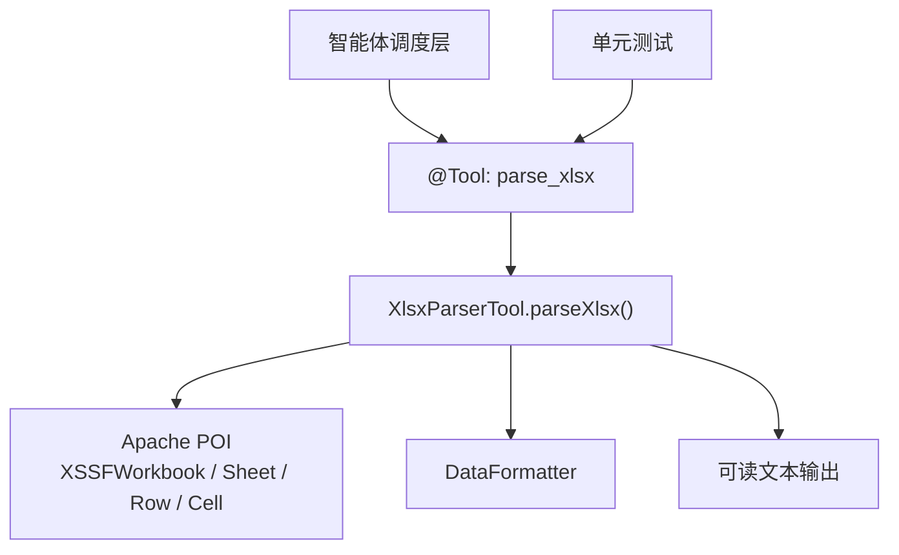
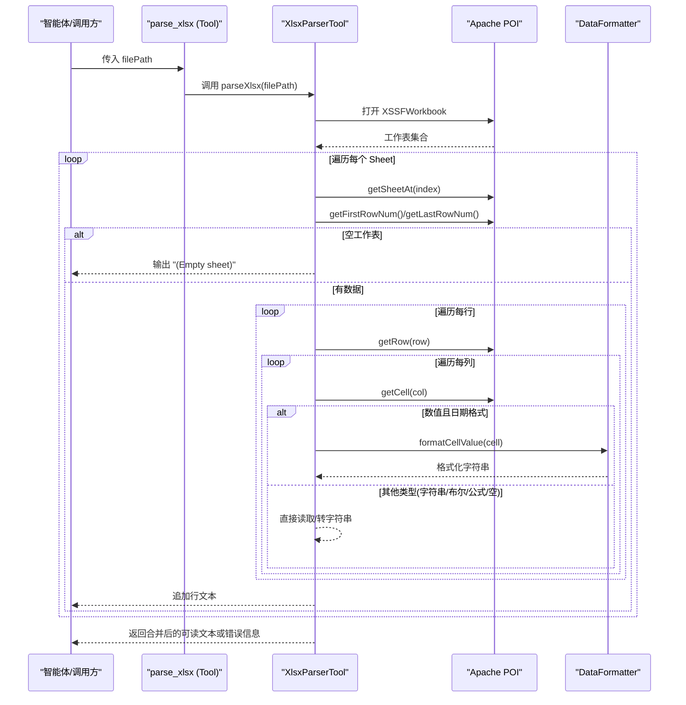
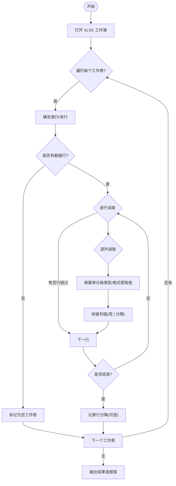
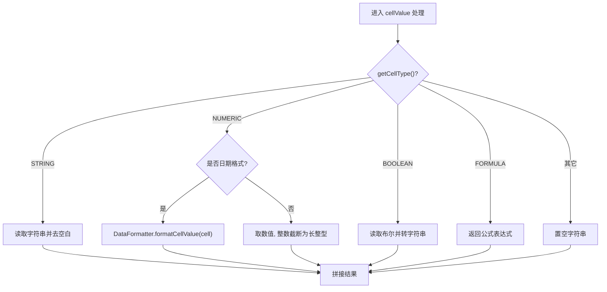
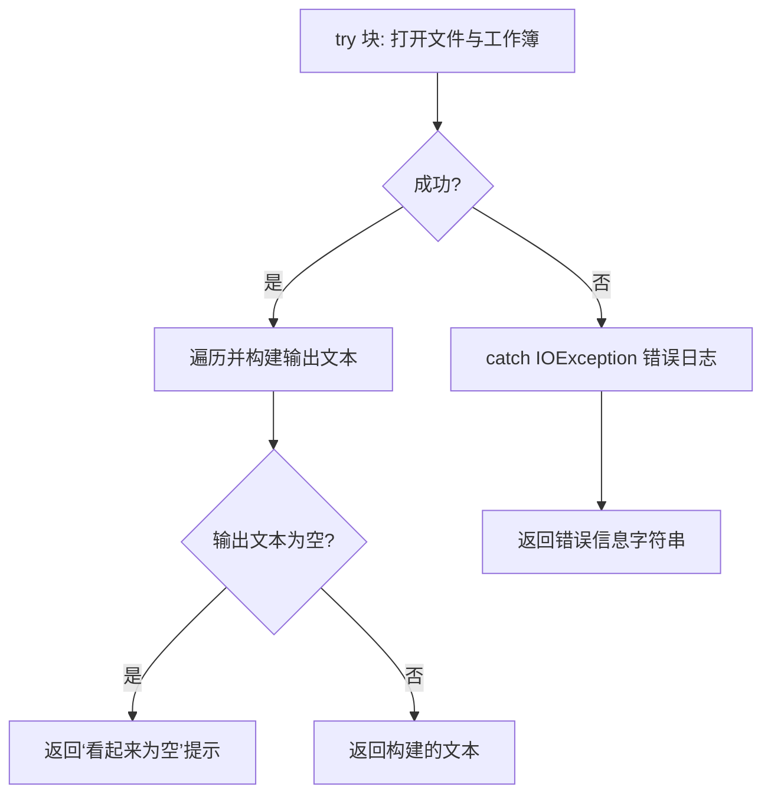
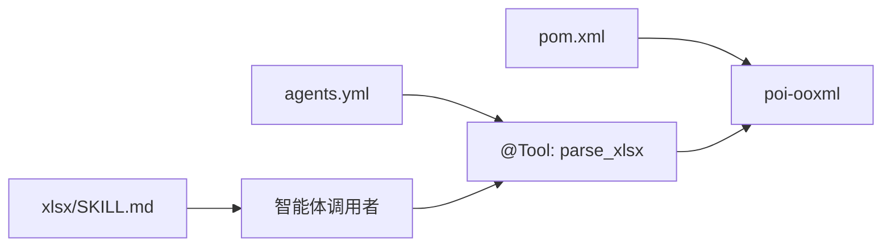

# Excel工作簿解析工具

<cite>
**本文引用的文件**
- [XlsxParserTool.java](file://src/main/java/com/skloda/agentscope/tool/XlsxParserTool.java)
- [XlsxParserToolTest.java](file://src/test/java/com/skloda/agentscope/tool/XlsxParserToolTest.java)
- [agents.yml](file://src/main/resources/config/agents.yml)
- [SKILL.md](file://src/main/resources/skills/xlsx/SKILL.md)
- [pom.xml](file://pom.xml)
</cite>

## 目录
1. [简介](#简介)
2. [项目结构与依赖](#项目结构与依赖)
3. [核心组件](#核心组件)
4. [架构总览](#架构总览)
5. [详细组件分析](#详细组件分析)
6. [依赖关系分析](#依赖关系分析)
7. [性能与可扩展性](#性能与可扩展性)
8. [故障诊断指南](#故障诊断指南)
9. [API参考](#api参考)
10. [实际应用示例](#实际应用示例)
11. [结论](#结论)

## 简介
本技术文档围绕基于 Apache POI 的 Excel（xlsx）工作簿解析工具，系统化阐述其实现原理、数据流与工程用法。工具以 AgentScope 的 @Tool 注解暴露为可被智能体调用的方法 parse_xlsx，通过 Apache POI 的 XSSFWorkbook/DataFormatter 等 API 对多工作表进行遍历、类型识别（字符串、数字、布尔、公式）、日期时间格式化、空单元格/空工作表处理与错误返回。该工具在任务型 Agent 中被注册并随 skill 配置启用，支持对复杂表格的数据提取、汇总与分析。

## 项目结构与依赖
- 解析入口位于 Java 工具的 parse_xlsx 方法内；测试用例覆盖数据类型与异常路径。
- 通过 Maven 引入 Apache POI OOXML（poi-ooxml）依赖，提供 xlsx 解析能力。
- 工具作为 AgentScope Tool 使用，结合 agents.yml 中“Task Agent”的 skills 和 userTools 配置，自动参与文档分析工作流。
- skill 定义明确了 parse_xlsx 的参数、返回值与使用方式，便于智能体调用。

图示来源
- [XlsxParserTool.java:1-107](file://src/main/java/com/skloda/agentscope/tool/XlsxParserTool.java#L1-L107)
- [XlsxParserToolTest.java:1-54](file://src/test/java/com/skloda/agentscope/tool/XlsxParserToolTest.java#L1-L54)
- [SKILL.md:1-43](file://src/main/resources/skills/xlsx/SKILL.md#L1-L43)
- [agents.yml:62-88](file://src/main/resources/config/agents.yml#L62-L88)
- [pom.xml:76-81](file://pom.xml#L76-L81)

章节来源
- [XlsxParserTool.java:1-107](file://src/main/java/com/skloda/agentscope/tool/XlsxParserTool.java#L1-L107)
- [XlsxParserToolTest.java:1-54](file://src/test/java/com/skloda/agentscope/tool/XlsxParserToolTest.java#L1-L54)
- [pom.xml:76-81](file://pom.xml#L76-L81)
- [agents.yml:62-88](file://src/main/resources/config/agents.yml#L62-L88)
- [SKILL.md:1-43](file://src/main/resources/skills/xlsx/SKILL.md#L1-L43)

## 核心组件
- XlsxParserTool：对外暴露 parse_xlsx，完成读取 .xlsx、遍历工作表/行/列、类型识别、格式化、构建可读文本输出与错误处理。
- DataFormatter：用于按单元格格式字符串化内容（尤其日期/时间），统一显示样式。
- Apache POI XSSFB 相关对象：
  - XSSFWorkbook：加载 xlsx
  - Sheet：按索引访问工作表
  - Row：行迭代
  - Cell：单元格取值、类型判断、公式获取

章节来源
- [XlsxParserTool.java:1-107](file://src/main/java/com/skloda/agentscope/tool/XlsxParserTool.java#L1-L107)

## 架构总览
从调用到输出的主要流程如下：

图示来源
- [XlsxParserTool.java:17-105](file://src/main/java/com/skloda/agentscope/tool/XlsxParserTool.java#L17-L105)

章节来源
- [XlsxParserTool.java:17-105](file://src/main/java/com/skloda/agentscope/tool/XlsxParserTool.java#L17-L105)

## 详细组件分析

### 多工作表遍历机制
- 先获取 XSSFWorkbook，随后依次取得所有 Sheet。
- 对于每个 Sheet，先写入表名与分隔标记，再计算首尾行号。
- 若 lastRow < 0（无数据行），直接标记为“(Empty sheet)”。
- 对每一行执行空引用跳过；对列范围 from firstCellNum to lastCellNum 遍历。
- 行与列之间的分隔符采用固定 “ | ”，空白单元格以 “(blank)” 表示。

图示来源
- [XlsxParserTool.java:23-99](file://src/main/java/com/skloda/agentscope/tool/XlsxParserTool.java#L23-L99)

章节来源
- [XlsxParserTool.java:23-99](file://src/main/java/com/skloda/agentscope/tool/XlsxParserTool.java#L23-L99)

### 数据类型识别与格式化
- 字符串：直接 trim 去除两端空白后使用。
- 数字：
  - 若 DateUtil 判定为日期格式，则交由 DataFormatter 按单元格格式生成字符串。
  - 否则，数值若为整数值（小数部分为0）则转为长整数字符串，避免不必要的小数精度展示。
- 布尔：按 boolean 转字符串。
- 公式：保留公式表达式本身，未做求值与缓存。
- 空单元格：以 “(blank)” 占位，保持对齐展示。

图示来源
- [XlsxParserTool.java:54-83](file://src/main/java/com/skloda/agentscope/tool/XlsxParserTool.java#L54-L83)
- [XlsxParserTool.java:61-75](file://src/main/java/com/skloda/agentscope/tool/XlsxParserTool.java#L61-L75)

章节来源
- [XlsxParserTool.java:54-83](file://src/main/java/com/skloda/agentscope/tool/XlsxParserTool.java#L54-L83)
- [XlsxParserTool.java:61-75](file://src/main/java/com/skloda/agentscope/tool/XlsxParserTool.java#L61-L75)

### 日期与时间格式化处理
- 对数值型单元格检测 DateUtil 是否为日期格式。若是，则通过 DataFormatter 依据单元格自身格式化为人类可读的时间字符串。
- 若为非日期的普通数值，优先呈现整型样式（如整数不显示多余小数），保证常见财务/ID 字段展示清晰。

章节来源
- [XlsxParserTool.java:61-71](file://src/main/java/com/skloda/agentscope/tool/XlsxParserTool.java#L61-L71)

### 空工作表检测与空单元格处理
- 空工作表：当 lastRow < 0 时直接提示“(Empty sheet)”，并继续后续表格。
- 空行：跳过 null 行，避免无效计算。
- 空单元格：显示为 “(blank)”，保持表格行列对齐与可读性。

章节来源
- [XlsxParserTool.java:36-47](file://src/main/java/com/skloda/agentscope/tool/XlsxParserTool.java#L36-L47)
- [XlsxParserTool.java:79-83](file://src/main/java/com/skloda/agentscope/tool/XlsxParserTool.java#L79-L83)

### 错误处理与日志
- IO 异常捕获：若无法打开文件或读取失败，将记录错误日志并返回包含错误消息的可读字符串。
- 空结果保护：如果最终文本构造为空，则返回提示信息，表明电子表格看起来为空。

图示来源
- [XlsxParserTool.java:23-105](file://src/main/java/com/skloda/agentscope/tool/XlsxParserTool.java#L23-L105)

章节来源
- [XlsxParserTool.java:23-105](file://src/main/java/com/skloda/agentscope/tool/XlsxParserTool.java#L23-L105)

### DataFormatter 使用策略说明
- 场景：所有带日期/时间格式的数值单元格均通过 DataFormatter 格式化，以确保与用户在 Excel 中看到的显示一致。
- 非日期数值：未使用格式化，而是直接数值处理（整型截断）。这有助于提升性能并保持简洁显示。
- 如需扩展自定义格式策略，可在 NUMERIC 分支中加入额外规则与缓存，减少重复格式化开销。

章节来源
- [XlsxParserTool.java:61-71](file://src/main/java/com/skloda/agentscope/tool/XlsxParserTool.java#L61-L71)

### 与Agent/技能的集成
- agents.yml 将 task-document-analysis Agent 关联 xlsx skill，并将 parse_xlsx 注册为该 Agent 的用户工具之一。
- SKILL.md 明确声明了 parse_xlsx 的目的、参数、返回值和使用步骤，辅助智能体理解如何正确调用。

章节来源
- [agents.yml:72-81](file://src/main/resources/config/agents.yml#L72-L81)
- [SKILL.md:1-43](file://src/main/resources/skills/xlsx/SKILL.md#L1-L43)

## 依赖关系分析
- 运行时依赖：Apache POI（poi-ooxml）提供 xlsx 解析能力。
- 工具框架：AgentScope 的 @Tool/@ToolParam 注解驱动工具自动发现与绑定。
- 上层编排：agents.yml 中 Agent 与 skill/userTools 的配置，使得任务型 Agent 能够按需调用 parse_xlsx。
- 测试验证：XlsxParserToolTest 使用临时 xlsx 文件验证各类型单元格的提取行为与缺失文件的错误路径。

图示来源
- [pom.xml:76-81](file://pom.xml#L76-L81)
- [agents.yml:72-81](file://src/main/resources/config/agents.yml#L72-L81)
- [SKILL.md:1-43](file://src/main/resources/skills/xlsx/SKILL.md#L1-L43)
- [XlsxParserTool.java:1-20](file://src/main/java/com/skloda/agentscope/tool/XlsxParserTool.java#L1-L20)

章节来源
- [pom.xml:76-81](file://pom.xml#L76-L81)
- [agents.yml:72-81](file://src/main/resources/config/agents.yml#L72-L81)
- [SKILL.md:1-43](file://src/main/resources/skills/xlsx/SKILL.md#L1-L43)
- [XlsxParserTool.java:1-20](file://src/main/java/com/skloda/agentscope/tool/XlsxParserTool.java#L1-L20)

## 性能与可扩展性
- 时间与空间复杂度
  - 典型 O(R*C)，其中 R 为最大行索引，C 为列区间长度。对大型工作簿，建议限制列范围或使用只读模型降低内存占用。
  - 当前实现仅读取显示内容与公式字符串，不进行公式求值，避免了昂贵的计算过程，有利于控制耗时。
- 优化建议
  - 缓存 DataFormatter：若大量单元格需格式化，可按需复用实例或局部缓存，降低创建开销（当前已单表内复用）。
  - 提前裁剪：可对空行/空列进行快速跳过以减少不必要的 getCell 操作。
  - 流式读取：针对超大工作簿，可使用 Apache POI Streaming API（SXSSF）以降低内存占用。
  - 并发安全：当前实现线程安全但不应跨线程共享同一资源；每次调用独立打开关闭资源，天然互斥。
- 大型工作簿最佳实践
  - 优先确认必要区域（例如仅前若干页/若干列），或在业务侧预先拆分大文件。
  - 对含海量公式的模板，必要时预计算以避免解析阶段求值带来的抖动（当前并未求值，所以影响较小）。

[本节提供一般性指导，无需特定文件引用]

## 故障诊断指南
- 常见问题与现象
  - 文件不存在/路径非法：返回包含错误信息的字符串，并在后端日志记录异常堆栈。
  - 电子表格为空：返回“看起来为空”的提示文本。
  - 空工作表：显示“(Empty sheet)”并继续处理其余工作表。
  - 空单元格：显示“(blank)”以保持对齐。
- 定位与验证
  - 检查日志中是否出现 IO 异常及对应文件路径。
  - 用最小化 xlsx（仅首行头与一行数据）复测，逐步增加复杂类型（日期、公式、布尔、数字）验证行为。
  - 对照测试用例关注：标题行、数值整数/浮点、布尔、公式等场景。

章节来源
- [XlsxParserTool.java:36-47](file://src/main/java/com/skloda/agentscope/tool/XlsxParserTool.java#L36-L47)
- [XlsxParserTool.java:89-91](file://src/main/java/com/skloda/agentscope/tool/XlsxParserTool.java#L89-L91)
- [XlsxParserTool.java:96-98](file://src/main/java/com/skloda/agentscope/tool/XlsxParserTool.java#L96-L98)
- [XlsxParserToolTest.java:20-52](file://src/test/java/com/skloda/agentscope/tool/XlsxParserToolTest.java#L20-L52)

## API参考
- 工具名称：parse_xlsx
- 作用：解析 .xlsx 文件，提取工作表名称、首行标题、行数据与单元格类型；返回可读文本。
- 参数
  - filePath(String, 必填): 服务器上的绝对路径。
- 返回
  - String: 可读文本，包含每个工作表的标题、数据行与“(blank)”占位的空单元格。若工作簿为空则返回空内容提示；若 IO 失败则返回错误信息。
- 行为约定
  - 空工作表显示为“(Empty sheet)”。
  - 行与列之间采用固定分隔符，便于下游消费方分割。
  - 日期时间按单元格原始格式输出。
  - 未对公式进行求值，仅返回公式表达式字符串。
- 异常与错误
  - IO 异常将被捕获并以“Error parsing XLSX file: …”形式的字符串返回，同时在后端记录错误日志。

章节来源
- [XlsxParserTool.java:17-20](file://src/main/java/com/skloda/agentscope/tool/XlsxParserTool.java#L17-L20)
- [XlsxParserTool.java:100-105](file://src/main/java/com/skloda/agentscope/tool/XlsxParserTool.java#L100-L105)
- [SKILL.md:15-27](file://src/main/resources/skills/xlsx/SKILL.md#L15-L27)
- [agents.yml:78-81](file://src/main/resources/config/agents.yml#L78-L81)

## 实际应用示例
- 基本使用步骤
  1) 确保目标 Agent 的 skills 包含 xlsx，并将 parse_xlsx 加入 userTools。
  2) 上传 .xlsx 文件至服务器指定位置，获得文件绝对路径。
  3) 智能体调用 parse_xlsx 工具，传入 filePath。
  4) 根据返回的结构化文本进行总结、抽取、对比或导出。
- 验证要点
  - 覆盖空工作表、混合数据类型（字符串/数字/布尔/公式）、日期格式单元格。
  - 校验空单元格以“(blank)”占位、行间以“ | ”分隔，便于程序解析。
- 注意事项
  - 若需公式实际求值结果，需在调用方另行安排计算逻辑（工具默认不计算）。
  - 极大批量数据建议限制读取范围或分文件处理。

章节来源
- [SKILL.md:28-43](file://src/main/resources/skills/xlsx/SKILL.md#L28-L43)
- [XlsxParserToolTest.java:20-52](file://src/test/java/com/skloda/agentscope/tool/XlsxParserToolTest.java#L20-L52)

## 结论
本工具基于 Apache POI 提供了稳定可靠的 xlsx 解析能力，覆盖了多工作表遍历、常见数据类型识别、日期时间格式化、空数据处理与异常恢复，并以 AgentScope 的 Tool 规范融入智能体工作流。凭借清晰的输出格式与可扩展的格式化策略，它能够在数据分析、报表摘要与批量抽取等场景中发挥重要作用。对超大规模工作簿可通过流式读取、区域裁剪等方式进一步优化性能与内存占用。