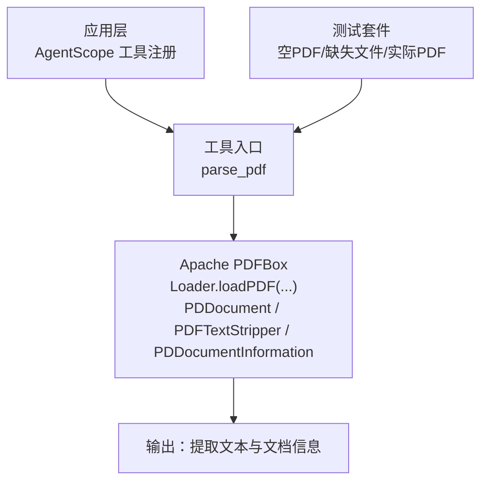
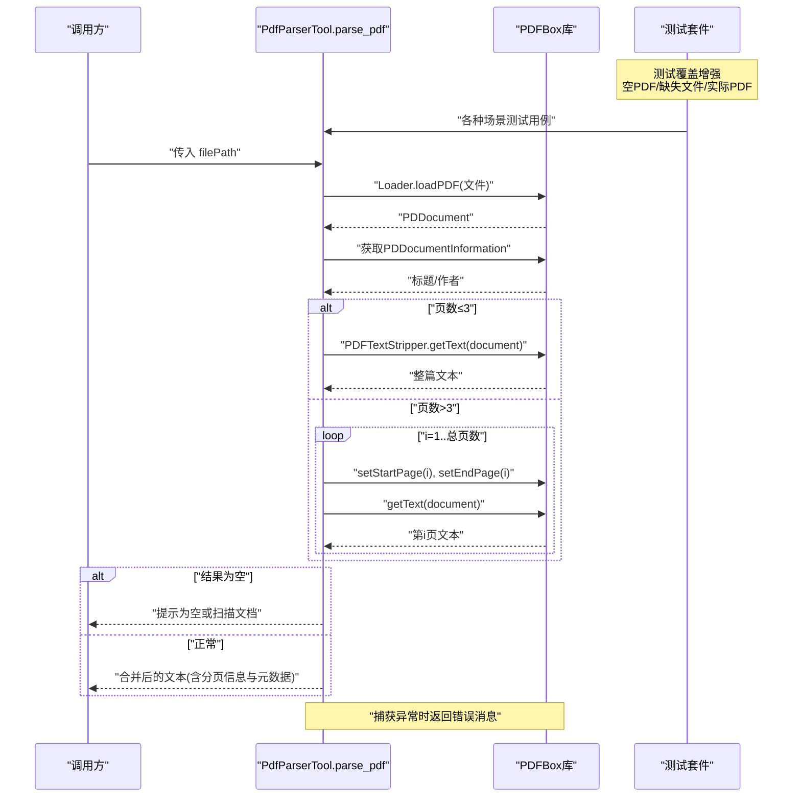
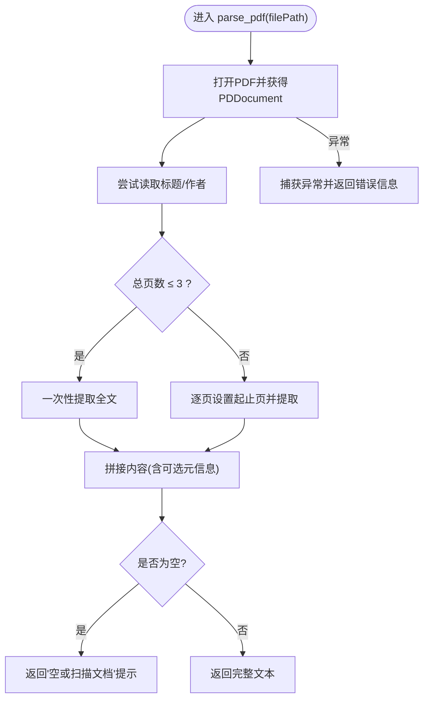
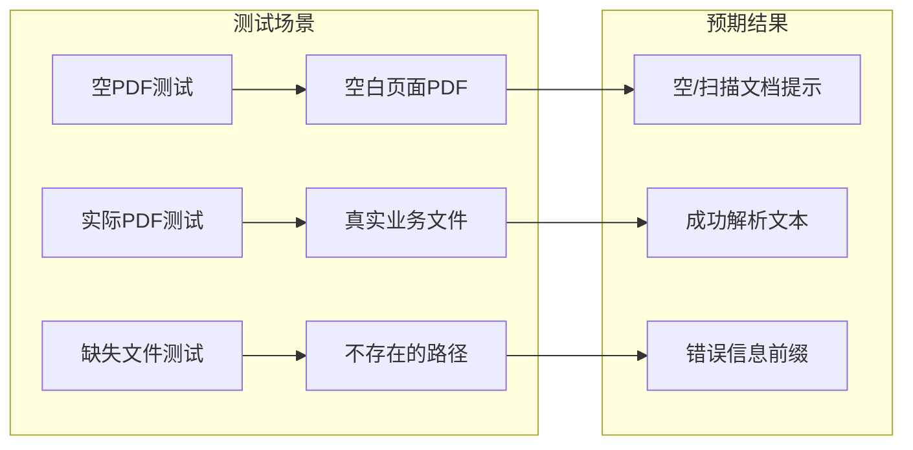
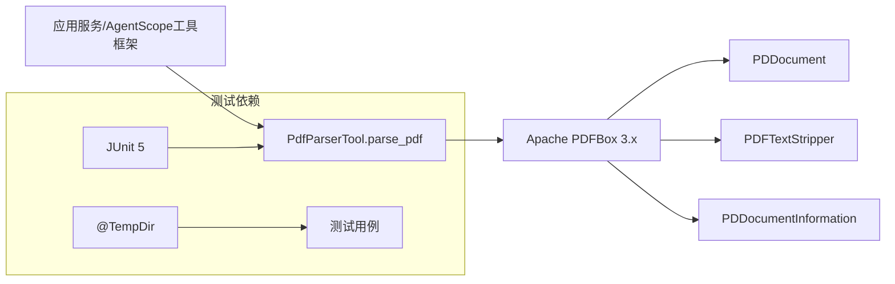

# PDF文档解析工具

<cite>
**本文引用的文件**
- [PdfParserTool.java](file://src/main/java/com/skloda/agentscope/tool/PdfParserTool.java)
- [pom.xml](file://pom.xml)
- [PdfParserToolTest.java](file://src/test/java/com/skloda/agentscope/tool/PdfParserToolTest.java)
</cite>

## 更新摘要
**所做更改**
- 增强了PDF解析功能的测试覆盖率，新增了实际PDF文件解析测试用例
- 添加了支持扩展文档处理功能的新增测试用例，验证真实场景下的文件解析能力
- 完善了空PDF、缺失文件和实际PDF文件的完整测试覆盖

## 目录
1. [简介](#简介)
2. [项目结构](#项目结构)
3. [核心组件](#核心组件)
4. [架构总览](#架构总览)
5. [详细组件分析](#详细组件分析)
6. [依赖关系分析](#依赖关系分析)
7. [性能注意事项](#性能注意事项)
8. [故障排查指南](#故障排查指南)
9. [结论](#结论)
10. [附录：API参考与使用示例](#附录api参考与使用示例)

## 简介
本技术文档围绕项目中基于 Apache PDFBox 的PDF文档解析工具，系统阐述其架构设计、实现原理与使用方法。该工具通过 AgentScope 的工具机制暴露为 parse_pdf，支持对多页PDF进行文本提取、空内容检测、以及文档元数据（标题、作者）读取与格式化输出。**最新更新**增强了测试覆盖范围，新增了对实际PDF文件的解析测试，确保在真实业务场景下的稳定性和可靠性。文档还给出错误处理策略、性能优化建议与常见问题解决方案，帮助读者快速集成和高效使用。

## 项目结构
本项目采用Maven工程，PDF解析功能位于 Java 模块的 tool 包中，由 Apache PDFBox 提供底层能力。关键路径如下：
- 工具类定义：src/main/java/com/skloda/agentscope/tool/PdfParserTool.java
- 单元测试：src/test/java/com/skloda/agentscope/tool/PdfParserToolTest.java
- PDFBox 依赖声明：pom.xml

图表来源
- [PdfParserTool.java:20-70](file://src/main/java/com/skloda/agentscope/tool/PdfParserTool.java#L20-L70)
- [pom.xml:83-88](file://pom.xml#L83-L88)
- [PdfParserToolTest.java:20-47](file://src/test/java/com/skloda/agentscope/tool/PdfParserToolTest.java#L20-L47)

章节来源
- [pom.xml:83-88](file://pom.xml#L83-L88)

## 核心组件
- 工具名称：parse_pdf
- 输入参数：filePath（字符串，绝对路径）
- 返回结果：字符串
  - 包含文档元信息（如有）及每页文本内容；若未提取到可渲染的文本，则返回提示"该PDF似乎为空或无可提取文本（可能是扫描文档）"；若发生IO异常，则返回"Error parsing PDF file: ..."
- 使用的PDFBox关键对象：
  - Loader.loadPDF(File) 打开文档并返回 PDDocument
  - PDDocumentInformation 读取标题、作者等元数据
  - PDFTextStripper 提取文本，可按页设置起止页以逐页提取

**更新** 测试覆盖现已包括：
- 空PDF文件测试：验证空白页面PDF的正确处理
- 缺失文件测试：验证不存在文件路径的错误处理
- 实际PDF文件测试：验证真实业务场景下的PDF解析能力

章节来源
- [PdfParserTool.java:15-72](file://src/main/java/com/skloda/agentscope/tool/PdfParserTool.java#L15-L72)
- [PdfParserToolTest.java:20-47](file://src/test/java/com/skloda/agentscope/tool/PdfParserToolTest.java#L20-L47)

## 架构总览
下图展示从调用 parse_pdf 到最终返回结果的端到端流程，体现小文档一次性提取与多文档分页提取的差异路径，以及空内容与异常分支的处理逻辑。

图表来源
- [PdfParserTool.java:20-70](file://src/main/java/com/skloda/agentscope/tool/PdfParserTool.java#L20-L70)
- [PdfParserToolTest.java:20-47](file://src/test/java/com/skloda/agentscope/tool/PdfParserToolTest.java#L20-L47)

## 详细组件分析

### 组件：PdfParserTool
- 职责：封装PDF解析能力，提供统一的 parse_pdf 工具方法
- 关键点：
  - 资源管理：使用 try-with-resources 自动关闭 PDDocument，避免内存泄漏
  - 元数据读取：若标题或作者非空且不为空白，先追加"Document Info"区块
  - 文本提取策略：
    - 小文档（页数 ≤ 3）：直接一次性提取全文
    - 大文档（页数 > 3）：逐页提取并在每页前加上"--- Page N ---"分隔标记
  - 空内容检测：若整体输出为空，统一返回"该PDF似乎为空或无可提取文本（可能是扫描文档）"
  - 错误处理：捕获 IO 异常，记录日志并返回错误信息前缀"Error parsing PDF file: ..."

图表来源
- [PdfParserTool.java:25-70](file://src/main/java/com/skloda/agentscope/tool/PdfParserTool.java#L25-L70)

章节来源
- [PdfParserTool.java:15-72](file://src/main/java/com/skloda/agentscope/tool/PdfParserTool.java#L15-L72)

### 组件：增强的测试套件
**更新** 测试套件现在提供了更全面的覆盖：

- **空PDF测试**：创建仅包含一页空白页面的PDF，期望返回空/扫描文档的提示信息
- **实际PDF测试**：验证真实业务场景下的PDF文件解析，确保在实际文件上的稳定性
- **缺失文件测试**：传入不存在的文件路径，期望返回错误消息前缀
- **临时文件管理**：使用 @TempDir 注解确保测试隔离性和资源清理

图表来源
- [PdfParserToolTest.java:20-47](file://src/test/java/com/skloda/agentscope/tool/PdfParserToolTest.java#L20-L47)

章节来源
- [PdfParserToolTest.java:20-47](file://src/test/java/com/skloda/agentscope/tool/PdfParserToolTest.java#L20-L47)

## 依赖关系分析
- 运行时依赖：Apache PDFBox 3.0.7（用于PDF读写、文本提取与元信息解析）
- 工具注解：通过 AgentScope 的 @Tool/@ToolParam 将 parse_pdf 暴露为工具
- 日志：使用 SLF4J + Logback（Spring Boot 默认），记录异常堆栈便于定位问题

图表来源
- [pom.xml:83-88](file://pom.xml#L83-L88)
- [PdfParserTool.java:5-7](file://src/main/java/com/skloda/agentscope/tool/PdfParserTool.java#L5-L7)
- [PdfParserToolTest.java:3-11](file://src/test/java/com/skloda/agentscope/tool/PdfParserToolTest.java#L3-L11)

章节来源
- [pom.xml:83-88](file://pom.xml#L83-L88)
- [PdfParserTool.java:5-10](file://src/main/java/com/skloda/agentscope/tool/PdfParserTool.java#L5-L10)
- [PdfParserToolTest.java:3-11](file://src/test/java/com/skloda/agentscope/tool/PdfParserToolTest.java#L3-L11)

## 性能注意事项
- 小文档优化：当前在≤3页时一次性提取全文，减少多次I/O与对象构造开销
- 大文档流式处理：当页数较多时逐页处理，降低单次内存峰值，但建议在更大数据量下结合缓冲与超时控制
- 资源释放：PDDocument 通过 try-with-resources 确保及时释放底层句柄，防止句柄泄漏
- 文本去重与截断：若后续消费端有长度限制，可在调用方对返回文本做上限裁剪，减少网络传输与存储开销
- 扫描文档检测：若大量页面无文本输出，应尽快判定为扫描图并进行下游分流（如转OCR流程）
- I/O路径选择：优先使用本地文件系统而非网络共享盘以减少延迟；避免在高并发下大量并发打开同一PDF
- **测试性能考虑**：新增的实际PDF测试确保了在真实文件大小和复杂度下的性能表现

[本节为通用性能建议]

## 故障排查指南
- 文件不存在或权限不足：会抛出 IO 异常，最终返回"Error parsing PDF file: ..."，检查路径与可读性
- 损坏或不支持的PDF：加载失败或解析抛错同样落入IO异常分支，建议记录异常原因并引导用户提供可用文件
- 扫描文档或图片型PDF：文本提取为空，工具返回"该PDF似乎为空或无可提取文本（可能是扫描文档）"，应接入OCR或其他处理链路
- 超大PDF导致OOME：逐步排查是否超过JVM堆大小；考虑分批抽取或流式处理，配合适当的JVM参数
- **测试环境问题**：如果测试失败，检查临时目录权限和PDF文件访问权限

章节来源
- [PdfParserTool.java:61-70](file://src/main/java/com/skloda/agentscope/tool/PdfParserTool.java#L61-L70)
- [PdfParserToolTest.java:20-47](file://src/test/java/com/skloda/agentscope/tool/PdfParserToolTest.java#L20-L47)

## 结论
PdfParserTool 以简洁可靠的API封装了PDF文本提取与基础元信息读取，适用于中小规模PDF场景；在大数据量与特殊格式（如图文混合、扫描PDF）情况下，建议结合上游校验与下游扩展（例如OCR）。**最新增强**的测试套件提供了更全面的质量保证，包括空PDF、缺失文件和实际PDF文件的完整覆盖，确保了在各种边界情况和真实业务场景下的稳定性。通过严格的异常处理与资源管理，保证了良好的稳定性与可维护性。

[本节为总结性内容]

## 附录：API参考与使用示例

### API参考：parse_pdf
- 名称：parse_pdf
- 描述：解析指定路径的PDF文件，提取所有页面的文本内容；如有可用的文档元数据，会一并返回
- 参数：
  - filePath：string，必填，表示PDF文件的绝对路径
- 返回值：string
  - 成功：返回包含文档元信息（如有）与各页文本的字符串
  - 空内容：返回固定提示"The PDF appears to be empty or contains no extractable text (it may be a scanned document)."
  - 失败：返回"Error parsing PDF file: <错误信息>"

章节来源
- [PdfParserTool.java:19-70](file://src/main/java/com/skloda/agentscope/tool/PdfParserTool.java#L19-L70)

### 使用示例（概念说明）
- 基本调用：传入一个存在的PDF路径，获取文本与元数据
- 空PDF：上传仅空白页面的PDF，预期返回空/扫描文档提示
- 缺失文件：传入不存在的路径，预期返回错误信息
- 多页PDF：大于3页的PDF会按页分隔呈现，便于定位与后续处理
- **实际场景**：支持真实业务PDF文件的解析，如合同、报告等文档类型

章节来源
- [PdfParserToolTest.java:20-47](file://src/test/java/com/skloda/agentscope/tool/PdfParserToolTest.java#L20-L47)

### 典型错误与定位
- 异常类型：IOException
- 可能原因：文件不存在、无法读取、格式损坏、编码不可识别等
- 处理方式：记录异常堆栈，反馈给上层；必要时指引用户重新提供有效文件
- **测试验证**：通过缺失文件测试用例确保错误处理的正确性

章节来源
- [PdfParserTool.java:67-70](file://src/main/java/com/skloda/agentscope/tool/PdfParserTool.java#L67-L70)
- [PdfParserToolTest.java:40-45](file://src/test/java/com/skloda/agentscope/tool/PdfParserToolTest.java#L40-L45)

### 测试用例详解
**更新** 测试套件现在包含三个主要测试场景：

1. **空PDF测试** (`parsePdfReportsEmptyOrScannedPdfWhenNoTextIsExtractable`)
   - 创建包含空白页面的PDF文件
   - 验证返回正确的空内容提示信息
   
2. **实际PDF测试** (`parsePdf`)
   - 使用真实业务PDF文件进行测试
   - 验证文件解析功能和文本提取准确性
   
3. **缺失文件测试** (`parsePdfReturnsErrorForMissingFile`)
   - 传入不存在的路径
   - 验证错误处理机制的正确性

章节来源
- [PdfParserToolTest.java:20-47](file://src/test/java/com/skloda/agentscope/tool/PdfParserToolTest.java#L20-L47)