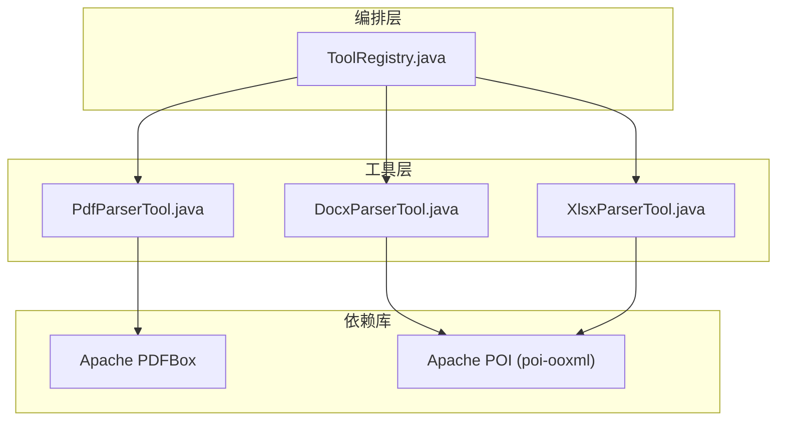
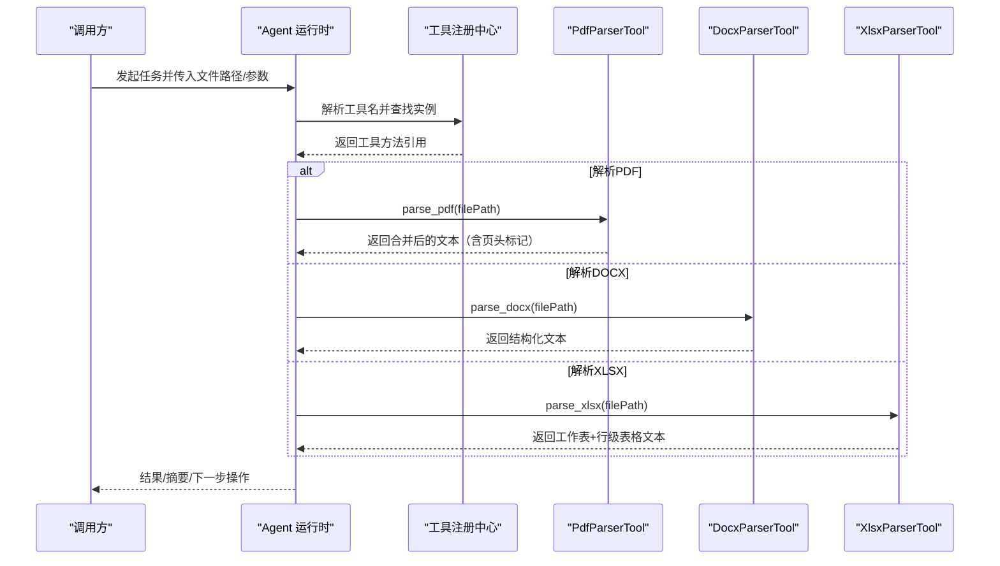
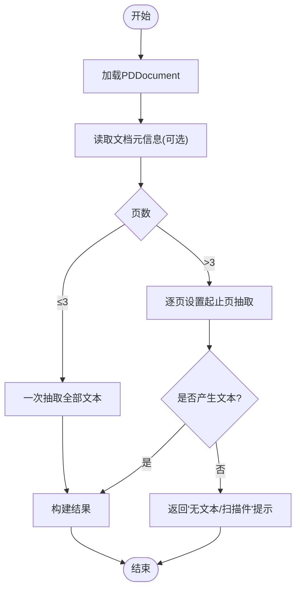
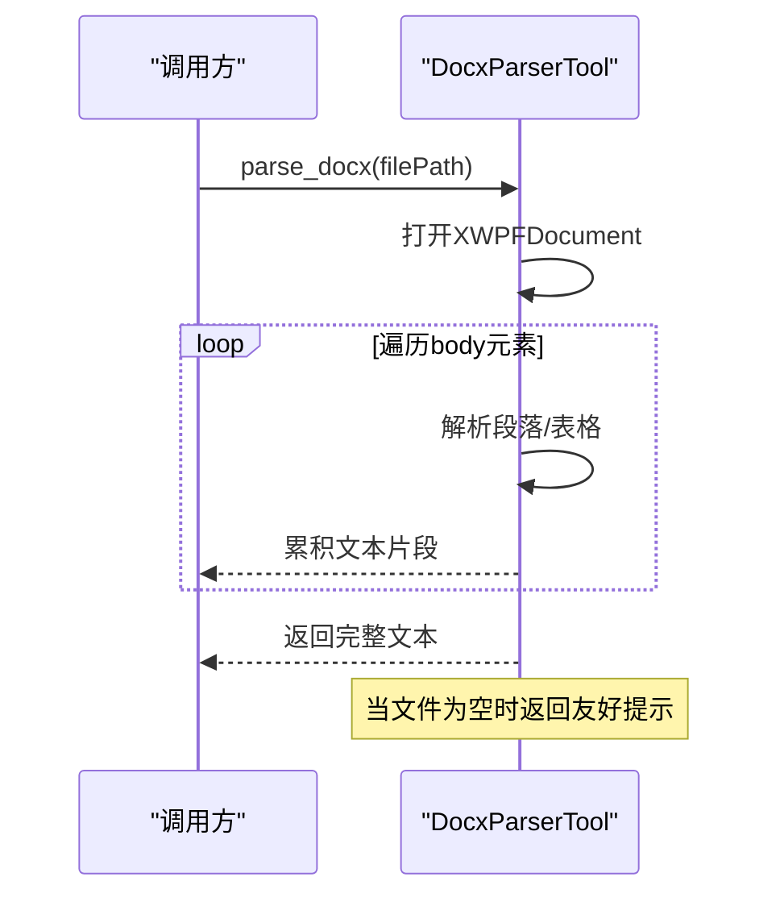
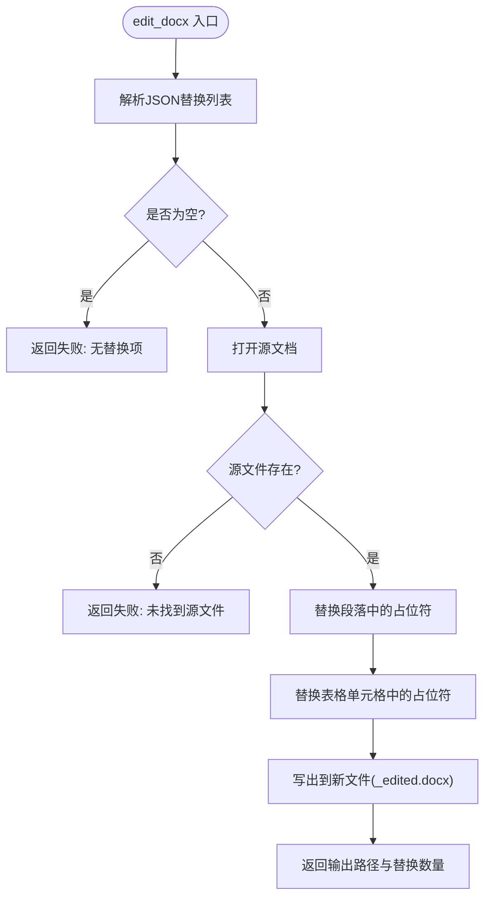
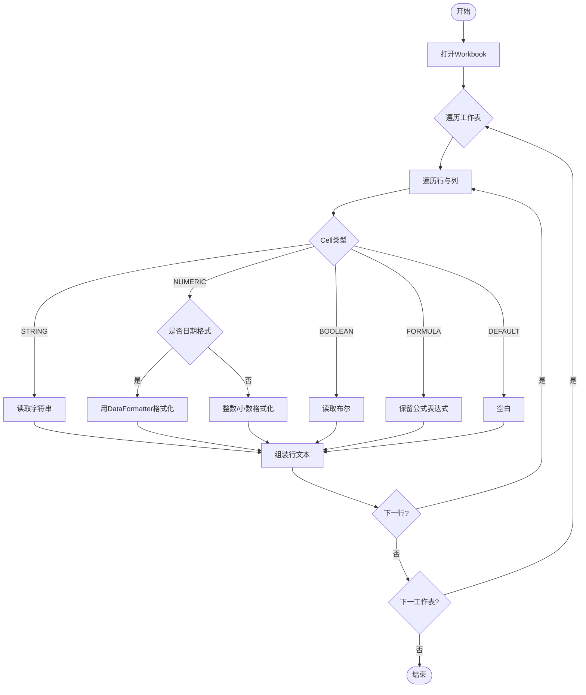
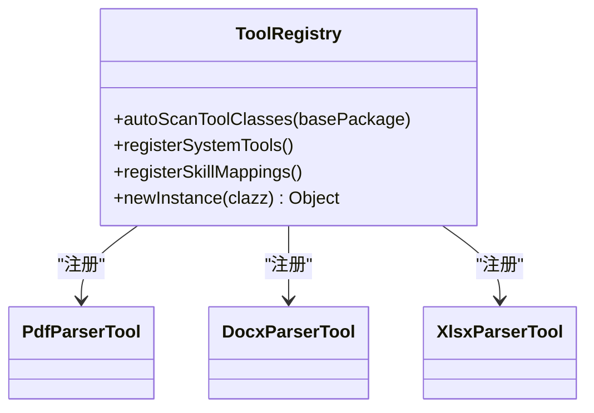
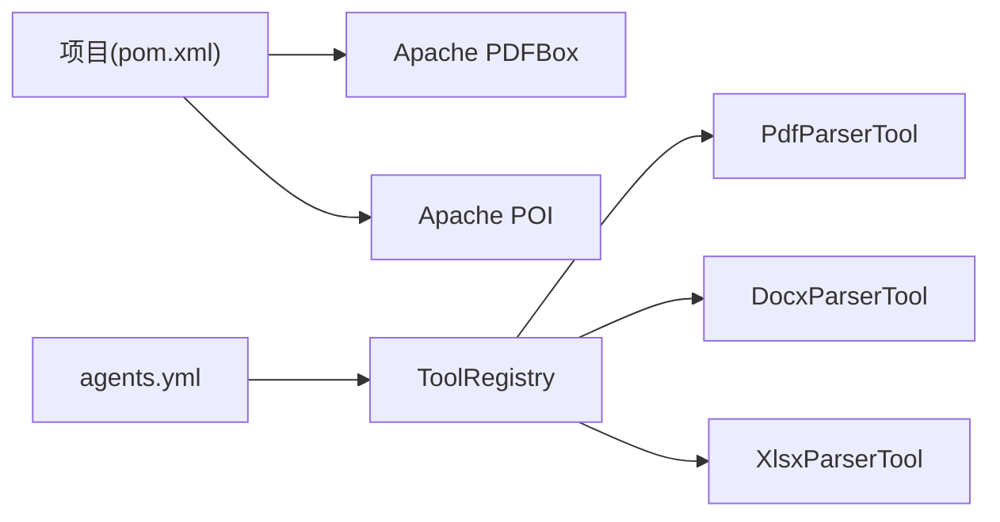

# 文档处理工具

<cite>
**本文引用的文件**
- [PdfParserTool.java](file://src/main/java/com/skloda/agentscope/tool/PdfParserTool.java)
- [DocxParserTool.java](file://src/main/java/com/skloda/agentscope/tool/DocxParserTool.java)
- [XlsxParserTool.java](file://src/main/java/com/skloda/agentscope/tool/XlsxParserTool.java)
- [ToolRegistry.java](file://src/main/java/com/skloda/agentscope/tool/ToolRegistry.java)
- [SimpleTools.java](file://src/main/java/com/skloda/agentscope/tool/SimpleTools.java)
- [pom.xml](file://pom.xml)
- [PdfParserToolTest.java](file://src/test/java/com/skloda/agentscope/tool/PdfParserToolTest.java)
- [DocxParserToolTest.java](file://src/test/java/com/skloda/agentscope/tool/DocxParserToolTest.java)
- [XlsxParserToolTest.java](file://src/test/java/com/skloda/agentscope/tool/XlsxParserToolTest.java)
- [agents.yml](file://src/main/resources/config/agents.yml)
</cite>

## 目录
1. [简介](#简介)
2. [项目结构](#项目结构)
3. [核心组件](#核心组件)
4. [架构总览](#架构总览)
5. [详细组件分析](#详细组件分析)
6. [依赖关系分析](#依赖关系分析)
7. [性能考量](#性能考量)
8. [故障排查指南](#故障排查指南)
9. [结论](#结论)
10. [附录：API 参考与使用示例](#附录api-参考与使用示例)

## 简介
本技术文档聚焦于文档处理工具的实现与最佳实践，围绕三类常见企业文档格式提供解析能力：
- PDF：基于 Apache PDFBox 的文本抽取、文档元数据读取与多页内容分段。
- DOCX：基于 Apache POI 的结构化解析，涵盖段落、标题、列表与表格提取；并提供模板变量替换编辑能力。
- XLSX：基于 Apache POI 的工作簿读取、单元格类型识别（字符串、数字、日期、布尔、公式）及行列格式化输出。

同时说明各工具的注册方式、错误处理机制、性能优化策略与大文件处理能力建议，给出 API 用法、常见问题与自定义扩展指引，帮助快速集成到 Agent 工作流中。

## 项目结构
与文档处理相关的核心实现位于工具类包下，外部通过 Tool 注解暴露为可用能力，并通过统一的工具注册机制装配到 Agent 运行环境中。

图表来源
- [PdfParserTool.java:1-72](file://src/main/java/com/skloda/agentscope/tool/PdfParserTool.java#L1-L72)
- [DocxParserTool.java:1-200](file://src/main/java/com/skloda/agentscope/tool/DocxParserTool.java#L1-L200)
- [XlsxParserTool.java:1-107](file://src/main/java/com/skloda/agentscope/tool/XlsxParserTool.java#L1-L107)
- [ToolRegistry.java:23-44](file://src/main/java/com/skloda/agentscope/tool/ToolRegistry.java#L23-L44)
- [pom.xml:76-88](file://pom.xml#L76-L88)

章节来源
- [pom.xml:28-188](file://pom.xml#L28-L188)

## 核心组件
- PDF 解析器：提供按页或整篇文本抽取，并附带文档元数据（如标题、作者）。
- DOCX 解析与编辑器：结构化提取段落、标题、列表和表格；支持以占位符替换进行文档模板编辑。
- XLSX 解析器：遍历所有工作表与单元格，统一转换为可读字符串，保持日期与数值格式。
- 工具注册中心：自动扫描含 @Tool 的方法，将工具暴露为 Agent 可调用函数；并支持从 SKILL.md 动态绑定技能名到工具集合。

章节来源
- [PdfParserTool.java:15-72](file://src/main/java/com/skloda/agentscope/tool/PdfParserTool.java#L15-L72)
- [DocxParserTool.java:17-200](file://src/main/java/com/skloda/agentscope/tool/DocxParserTool.java#L17-L200)
- [XlsxParserTool.java:13-107](file://src/main/java/com/skloda/agentscope/tool/XlsxParserTool.java#L13-L107)
- [ToolRegistry.java:71-122](file://src/main/java/com/skloda/agentscope/tool/ToolRegistry.java#L71-L122)

## 架构总览
下图展示了从 Agent 配置到具体解析工具调用的端到端流程：Agent 在配置中声明“用户工具”，工具由注册器自动发现并暴露给 Agent 运行时，再由 LLM 调度执行文档解析。

图表来源
- [ToolRegistry.java:33-44](file://src/main/java/com/skloda/agentscope/tool/ToolRegistry.java#L33-L44)
- [agents.yml:62-90](file://src/main/resources/config/agents.yml#L62-L90)
- [PdfParserTool.java:19-72](file://src/main/java/com/skloda/agentscope/tool/PdfParserTool.java#L19-L72)
- [DocxParserTool.java:24-57](file://src/main/java/com/skloda/agentscope/tool/DocxParserTool.java#L24-L57)
- [XlsxParserTool.java:17-107](file://src/main/java/com/skloda/agentscope/tool/XlsxParserTool.java#L17-L107)

## 详细组件分析

### PDF 解析器（Apache PDFBox）
- 能力边界
  - 抽取全文或按页分段输出，大于三页时使用页码分隔便于阅读。
  - 若无法抽取文本，提示可能为扫描件或未包含文本的 PDF。
  - 提取基础元信息（标题、作者）并前置显示。
- 关键流程
  - 使用 PDDocument 加载文件，获取页面数。
  - 通过 PDFTextStripper 生成纯文本；多页循环设置起始与结束页。
  - 空结果时输出友好提示，否则返回拼接后的文本。
- 错误与异常
  - IO 异常捕获后，返回明确的错误消息字符串。
  - 资源使用 try-with-resources 自动关闭文档，避免泄露。
- 性能与大文件
  - 大文档采用逐页抓取，降低单次内存占用峰值。
  - 建议对超大 PDF 增加超时控制与分片处理，避免阻塞 Agent 主线程。

图表来源
- [PdfParserTool.java:25-65](file://src/main/java/com/skloda/agentscope/tool/PdfParserTool.java#L25-L65)
- [PdfParserTool.java:67-70](file://src/main/java/com/skloda/agentscope/tool/PdfParserTool.java#L67-L70)

章节来源
- [PdfParserTool.java:1-72](file://src/main/java/com/skloda/agentscope/tool/PdfParserTool.java#L1-L72)

#### API 参考与示例
- 方法名：parse_pdf
- 参数：filePath（绝对路径）
- 返回：包含元信息与文本的内容字符串；无文本时返回特定提示。
- 使用建议：上传后传服务端暂存路径；如需结构化解析，可将返回串交给 LLM 做二次归纳。

章节来源
- [PdfParserTool.java:19-70](file://src/main/java/com/skloda/agentscope/tool/PdfParserTool.java#L19-L70)
- [PdfParserToolTest.java:20-37](file://src/test/java/com/skloda/agentscope/tool/PdfParserToolTest.java#L20-L37)

---

### DOCX 解析与编辑（Apache POI）
- 能力边界
  - 解析段落、编号列表与标题层级（Heading1~4），将结构转换为 Markdown 风格标识。
  - 解析表格，输出为管道分隔的行结构。
  - 模板编辑：通过 JSON 数组指定“占位符→值”映射，批量替换段落与表格中的占位符，输出带 _edited 后缀的新文件。
- 关键流程
  - 读取 XWPFDocument，遍历 BodyElements：段落或表格分别处理。
  - 根据段落样式或编号信息生成前缀标识。
  - 编辑器先校验输入，再遍历段落与表格单元逐个替换并保存新文件。
- 错误与健壮性
  - 读取失败、源文件不存在、替换为空等场景均有明确反馈。
  - 解析与写入过程均使用 try-with-resources 保证 I/O 资源释放。
- 性能与大文件
  - 遍历文档元素线性复杂度；对超大文档可考虑分页/分块解析策略。
  - 模板编辑会复制并改写文档，注意磁盘空间与副本命名冲突。

图表来源
- [DocxParserTool.java:24-57](file://src/main/java/com/skloda/agentscope/tool/DocxParserTool.java#L24-L57)
- [DocxParserTool.java:157-200](file://src/main/java/com/skloda/agentscope/tool/DocxParserTool.java#L157-L200)

图表来源
- [DocxParserTool.java:59-127](file://src/main/java/com/skloda/agentscope/tool/DocxParserTool.java#L59-L127)
- [DocxParserTool.java:129-155](file://src/main/java/com/skloda/agentscope/tool/DocxParserTool.java#L129-L155)

章节来源
- [DocxParserTool.java:17-200](file://src/main/java/com/skloda/agentscope/tool/DocxParserTool.java#L17-L200)
- [DocxParserToolTest.java:27-89](file://src/test/java/com/skloda/agentscope/tool/DocxParserToolTest.java#L27-L89)

#### API 参考与示例
- 方法名：parse_docx
  - 参数：filePath（绝对路径）
  - 返回：带有结构与样式的文本字符串；空文档返回友好提示。
- 方法名：edit_docx
  - 参数：filePath、replacementsJson（JSON 数组，字段 placeholder/value）
  - 返回：JSON 字符串，包含 success、outputFilePath、replacementsMade、message 等字段。
- 使用建议：编辑器会保留占位符所在段落原有的运行（Run）结构，并在替换后重建新 Run。

章节来源
- [DocxParserTool.java:59-127](file://src/main/java/com/skloda/agentscope/tool/DocxParserTool.java#L59-L127)

---

### XLSX 解析（Apache POI）
- 能力边界
  - 读取所有工作表名称与行数，输出“表名 → 行”的可读结构。
  - 支持字符串、数字（整数/小数）、布尔、日期以及公式原文；空白单元格统一展示。
  - 通过 DataFormatter 保持日期等类型的显示格式。
- 关键流程
  - 遍历 Workbook.Sheet，再以 Row 与 Cell 粒度读取并格式化。
  - 对首行与中间区域插入分隔符便于人类阅读。
- 错误与健壮性
  - 文件缺失或 IO 异常时会返回错误消息字符串。
  - 空表格时返回“空表格”的提示。
- 性能与大文件
  - 全量载入到内存，适合中小规模电子表格。对超大文件可采用 SXSSF 流式模式（需扩展实现）。

图表来源
- [XlsxParserTool.java:17-106](file://src/main/java/com/skloda/agentscope/tool/XlsxParserTool.java#L17-L106)

章节来源
- [XlsxParserTool.java:1-107](file://src/main/java/com/skloda/agentscope/tool/XlsxParserTool.java#L1-L107)
- [XlsxParserToolTest.java:20-52](file://src/test/java/com/skloda/agentscope/tool/XlsxParserToolTest.java#L20-L52)

#### API 参考与示例
- 方法名：parse_xlsx
  - 参数：filePath（绝对路径）
  - 返回：工作表汇总与行级数据文本；空表格返回提示。
- 使用建议：结合 LLM 对表格内容进行归纳、趋势分析与摘要。

章节来源
- [XlsxParserTool.java:17-106](file://src/main/java/com/skloda/agentscope/tool/XlsxParserTool.java#L17-L106)

---

### 工具注册与装配（ToolRegistry）
- 自动扫描：从指定包扫描所有标注了 @Tool 方法的类，并提取方法名作为工具名。
- 系统工具补充：若框架工具不可被类路径扫描发现，则回退到反射直接注册系统内置工具。
- 技能绑定：读取 classpath 下的 skills/*/SKILL.md 的前置 YAML，将“技能名”绑定到一组工具方法名。
- 实例创建：优先从 Spring 上下文获取 Bean，否则通过反射构造实例。

图表来源
- [ToolRegistry.java:23-44](file://src/main/java/com/skloda/agentscope/tool/ToolRegistry.java#L23-L44)
- [ToolRegistry.java:71-122](file://src/main/java/com/skloda/agentscope/tool/ToolRegistry.java#L71-L122)

章节来源
- [ToolRegistry.java:23-199](file://src/main/java/com/skloda/agentscope/tool/ToolRegistry.java#L23-L199)

## 依赖关系分析
- PDF 解析依赖 Apache PDFBox（版本 3.x）。
- DOCX/XLSX 解析依赖 Apache POI 的 poi-ooxml（版本 5.x）。
- 工具通过 Spring Boot + AgentScope 暴露为 Agent 可调方法；Agent 配置文件启用对应工具与技能。

图表来源
- [pom.xml:76-88](file://pom.xml#L76-L88)
- [agents.yml:62-90](file://src/main/resources/config/agents.yml#L62-L90)
- [ToolRegistry.java:33-44](file://src/main/java/com/skloda/agentscope/tool/ToolRegistry.java#L33-L44)

章节来源
- [pom.xml:76-88](file://pom.xml#L76-L88)
- [agents.yml:62-90](file://src/main/resources/config/agents.yml#L62-L90)

## 性能考量
- 批处理与分页
  - PDF：已对大于三页的文档进行逐页读取；对超大 PDF 可增加异步队列与分片消费。
  - XLSX：当前为全量载入；建议对大表使用流式 POI（SXSSFWorkbook）以降低堆内存。
- 对象重用
  - PDFTextStripper 可按页重复使用，已在实现中复用。
  - 对大量 DOCX 解析可考虑缓存已解析的段落索引以减少重复计算。
- I/O 安全
  - 所有文件访问均在 try-with-resources 中完成，避免句柄泄漏。
- CPU/并发
  - 工具方法默认单线程同步；对于并发调用，建议在上层加限流/队列，防止 OOM 与 GC 抖动。

[本节为通用优化建议，无需文件引用]

## 故障排查指南
- “PDF 似乎为空或扫描件”
  - 现象：解析后返回提示文本。
  - 排查：确认 PDF 是否嵌入 OCR 文本或为图片型扫描；必要时接入 OCR 服务后再解析。
  - 验证参考：空页 PDF 测试断言预期提示。
- “缺失文件或IO错误”
  - 现象：返回“Error parsing ...”的错误消息。
  - 排查：检查文件路径与权限；确保临时目录可写、容量充足。
- DOCX 编辑失败
  - 现象：返回 success=false 的原因信息。
  - 排查：检查 JSON 格式是否正确、目标路径是否可写、是否存在同名输出文件覆盖问题。
- XLSX 公式未计算
  - 现象：公式单元格返回公式文本。
  - 说明：当前设计为返回原始公式；如需计算结果需自行评估使用 EvaluationListener 或离线计算。

章节来源
- [PdfParserTool.java:61-70](file://src/main/java/com/skloda/agentscope/tool/PdfParserTool.java#L61-L70)
- [DocxParserTool.java:53-57](file://src/main/java/com/skloda/agentscope/tool/DocxParserTool.java#L53-L57)
- [XlsxParserTool.java:102-105](file://src/main/java/com/skloda/agentscope/tool/XlsxParserTool.java#L102-L105)
- [PdfParserToolTest.java:20-37](file://src/test/java/com/skloda/agentscope/tool/PdfParserToolTest.java#L20-L37)
- [DocxParserToolTest.java:27-72](file://src/test/java/com/skloda/agentscope/tool/DocxParserToolTest.java#L27-L72)
- [XlsxParserToolTest.java:20-52](file://src/test/java/com/skloda/agentscope/tool/XlsxParserToolTest.java#L20-L52)

## 结论
本项目在 AgentScope 基础上提供了开箱即用的三大文档解析工具：
- PDF 以轻量逐页抽取为核心，兼顾元数据，易于接入后续 NLP 流水线。
- DOCX 在解析基础上增加了模板变量替换编辑，满足生产场景常见报告自动化需求。
- XLSX 对常用单元格类型做了兼容转换，配合 LLM 可进行数据洞察。
整体通过 ToolRegistry 统一管理、agents.yml 集中编排，具备良好的可扩展性与维护性。建议在大数据量场景引入流式处理与异步任务拆分，以获得更稳健的性能表现。

[本节为总结，无需文件引用]

## 附录：API 参考与使用示例
- PDF
  - 工具名：parse_pdf
  - 入参：filePath
  - 出参：包含元信息与文本的字符串；无文本时返回友好提示。
  - 使用示例：上传 PDF 至服务器临时目录，将返回路径传给工具，获得可阅读的全文本以便总结。
- DOCX
  - 工具名：parse_docx
  - 入参：filePath
  - 出参：结构化文本（标题、段落、列表、表格）。
  - 工具名：edit_docx
  - 入参：filePath、replacementsJson
  - 出参：JSON，包含 success、outputFilePath、replacementsMade、message。
  - 使用示例：准备模板文档，用 JSON 定义占位符替换规则，调用 edit_docx 生成新文件下载。
- XLSX
  - 工具名：parse_xlsx
  - 入参：filePath
  - 出参：工作表与行列的可视化文本，便于人工阅读与机器理解。
  - 使用示例：上传业务报表，调用 parse_xlsx 后交由 LLM 做趋势分析与要点提炼。

章节来源
- [agents.yml:62-90](file://src/main/resources/config/agents.yml#L62-L90)
- [SimpleTools.java:12-44](file://src/main/java/com/skloda/agentscope/tool/SimpleTools.java#L12-L44)