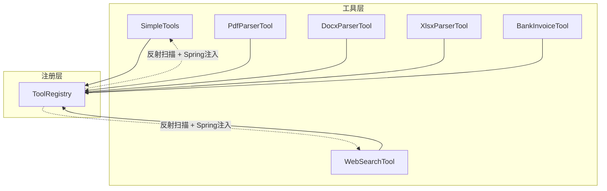
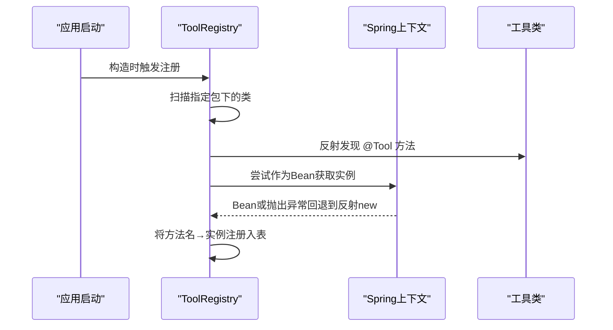
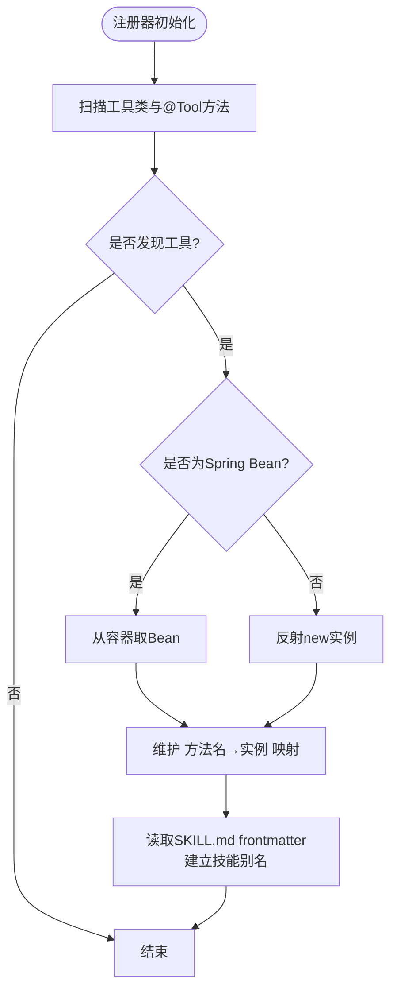
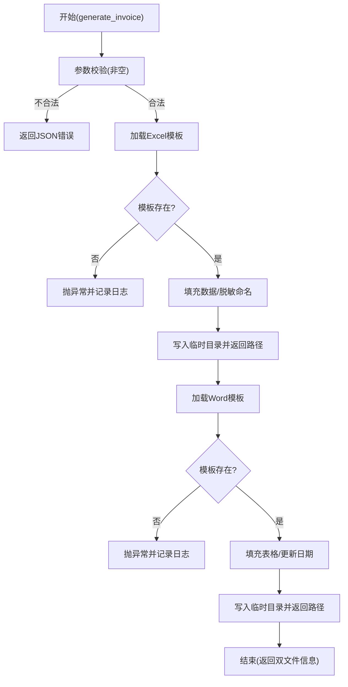
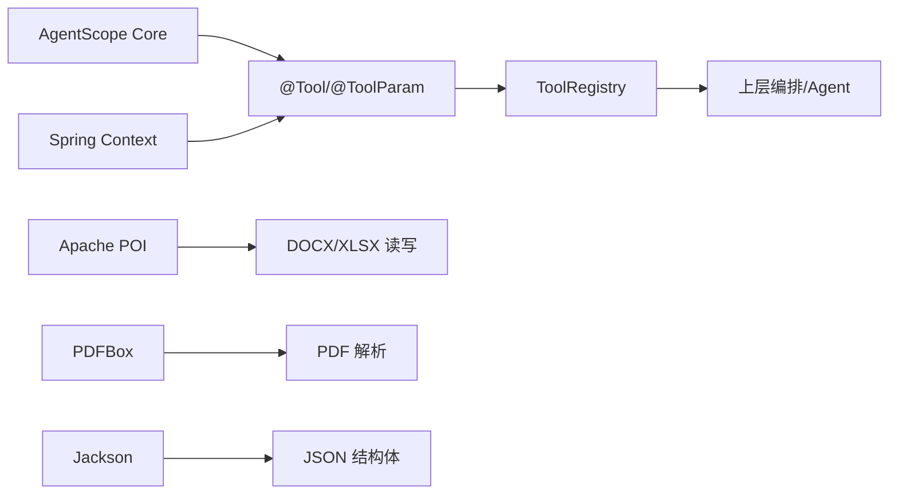

# 自定义工具开发

<cite>
**本文引用的文件**
- [SimpleTools.java](file://src/main/java/com/skloda/agentscope/tool/SimpleTools.java)
- [ToolRegistry.java](file://src/main/java/com/skloda/agentscope/tool/ToolRegistry.java)
- [WebSearchTool.java](file://src/main/java/com/skloda/agentscope/tool/WebSearchTool.java)
- [BankInvoiceTool.java](file://src/main/java/com/skloda/agentscope/tool/BankInvoiceTool.java)
- [PdfParserTool.java](file://src/main/java/com/skloda/agentscope/tool/PdfParserTool.java)
- [DocxParserTool.java](file://src/main/java/com/skloda/agentscope/tool/DocxParserTool.java)
- [XlsxParserTool.java](file://src/main/java/com/skloda/agentscope/tool/XlsxParserTool.java)
- [SimpleToolsTest.java](file://src/test/java/com/skloda/agentscope/tool/SimpleToolsTest.java)
- [WebSearchToolTest.java](file://src/test/java/com/skloda/agentscope/tool/WebSearchToolTest.java)
- [BankInvoiceToolTest.java](file://src/test/java/com/skloda/agentscope/tool/BankInvoiceToolTest.java)
- [PdfParserToolTest.java](file://src/test/java/com/skloda/agentscope/tool/PdfParserToolTest.java)
</cite>

## 目录
1. [引言](#引言)
2. [项目结构](#项目结构)
3. [核心组件](#核心组件)
4. [架构总览](#架构总览)
5. [详细组件分析](#详细组件分析)
6. [依赖分析](#依赖分析)
7. [性能考虑](#性能考虑)
8. [故障排查指南](#故障排查指南)
9. [结论](#结论)
10. [附录：工具发布与版本管理最佳实践](#附录工具发布与版本管理最佳实践)

## 引言
本指南面向希望在 AgentScope Java 工程中开发“自定义工具”的开发者。文档从 @Tool 与 @ToolParam 注解使用、工具类编写规范、测试策略、生命周期管理与资源清理、性能优化，到工具发布与版本化实践，结合仓库中真实实现（注册器、简单计算、PDF/DOCX/XLSX解析、网络搜索、票据生成）进行逐步讲解，确保读者可以快速上手并掌握工程化标准。

## 项目结构
工具子系统集中在 tool 包下，包括：
- 注解使用示例与基础能力：SimpleTools
- 动态发现与注册：ToolRegistry
- 领域工具：WebSearchTool、PdfParserTool、DocxParserTool、XlsxParserTool、BankInvoiceTool

图示来源
- [SimpleTools.java:1-44](file://src/main/java/com/skloda/agentscope/tool/SimpleTools.java#L1-L44)
- [WebSearchTool.java:1-134](file://src/main/java/com/skloda/agentscope/tool/WebSearchTool.java#L1-L134)
- [PdfParserTool.java:1-72](file://src/main/java/com/skloda/agentscope/tool/PdfParserTool.java#L1-L72)
- [DocxParserTool.java:1-L128](file://src/main/java/com/skloda/agentscope/tool/DocxParserTool.java#L1-L128)
- [XlsxParserTool.java:1-L107](file://src/main/java/com/skloda/agentscope/tool/XlsxParserTool.java#L1-L107)
- [BankInvoiceTool.java:1-L199](file://src/main/java/com/skloda/agentscope/tool/BankInvoiceTool.java#L1-L199)
- [ToolRegistry.java:23-L200](file://src/main/java/com/skloda/agentscope/tool/ToolRegistry.java#L23-L200)

章节来源
- [SimpleTools.java:1-44](file://src/main/java/com/skloda/agentscope/tool/SimpleTools.java#L1-L44)
- [ToolRegistry.java:23-L200](file://src/main/java/com/skloda/agentscope/tool/ToolRegistry.java#L23-L200)

## 核心组件
- ToolRegistry：负责自动发现带有 @Tool 注解的方法、注册系统内置工具、以及根据 SKILL.md frontmatter 动态建立技能到工具的映射。支持通过 Spring ApplicationContext 优先获取 Bean 实例（从而启用依赖注入）。
- SimpleTools：展示 @Tool/@ToolParam 的典型用法，提供当前时间、求和、天气查询等演示工具方法。
- WebSearchTool：对外部网络服务的封装工具，包含参数校验与限流策略。
- 文档解析工具：PdfParserTool、DocxParserTool、XlsxParserTool 分别封装 PDF/Word/Excel 解析能力。
- BankInvoiceTool：基于模板生成 Excel/Word 发票文件的复合工具，含敏感信息脱敏与路径输出。

章节来源
- [ToolRegistry.java:23-L200](file://src/main/java/com/skloda/agentscope/tool/ToolRegistry.java#L23-L200)
- [SimpleTools.java:1-44](file://src/main/java/com/skloda/agentscope/tool/SimpleTools.java#L1-L44)
- [WebSearchTool.java:1-L134](file://src/main/java/com/skloda/agentscope/tool/WebSearchTool.java#L1-L134)
- [PdfParserTool.java:1-L72](file://src/main/java/com/skloda/agentscope/tool/PdfParserTool.java#L1-L72)
- [DocxParserTool.java:1-L128](file://src/main/java/com/skloda/agentscope/tool/DocxParserTool.java#L1-L128)
- [XlsxParserTool.java:1-L107](file://src/main/java/com/skloda/agentscope/tool/XlsxParserTool.java#L1-L107)
- [BankInvoiceTool.java:1-L199](file://src/main/java/com/skloda/agentscope/tool/BankInvoiceTool.java#L1-L199)

## 架构总览
工具加载与调用链路如下：
1) 启动时 ToolRegistry 初始化，自动扫描指定包下的所有类，发现 @Tool 注解标注的方法并登记到运行期地图。
2) 若工具类是 Spring Bean，优先通过 ApplicationContext 获取，以启用依赖注入（如配置项注入、HTTP 客户端注入）。
3) 运行时由上层编排（Agent/Harness/业务控制器）按工具名查找实例与方法并执行。

图示来源
- [ToolRegistry.java:73-L121](file://src/main/java/com/skloda/agentscope/tool/ToolRegistry.java#L73-L121)

章节来源
- [ToolRegistry.java:73-L121](file://src/main/java/com/skloda/agentscope/tool/ToolRegistry.java#L73-L121)

## 详细组件分析

### 注解使用指南：@Tool 与 @ToolParam
- @Tool 注解用于标记工具方法，需提供 name（唯一工具名）和 description（AI/用户可读的功能描述）。
- @ToolParam 用于方法参数，建议为每个参数设置清晰的 name 与 description，便于框架生成参数提示和验证提示。

在代码库中的体现
- 简单工具示例：时间、求和、天气
  - 名称、描述清晰、参数命名规范、可选参数默认值处理
- 网络搜索工具：参数为空即快速返回错误消息，避免无效网络调用
- 文档解析工具：统一以 filePath 作为输入，类型安全、边界条件明确
- 票据生成工具：多参强约束，缺失时以 JSON 形式返回失败原因

章节来源
- [SimpleTools.java:14-L43](file://src/main/java/com/skloda/agentscope/tool/SimpleTools.java#L14-L43)
- [WebSearchTool.java:30-L133](file://src/main/java/com/skloda/agentscope/tool/WebSearchTool.java#L30-L133)
- [PdfParserTool.java:19-L22](file://src/main/java/com/skloda/agentscope/tool/PdfParserTool.java#L19-L22)
- [DocxParserTool.java:24-L127](file://src/main/java/com/skloda/agentscope/tool/DocxParserTool.java#L24-L127)
- [XlsxParserTool.java:17-L107](file://src/main/java/com/skloda/agentscope/tool/XlsxParserTool.java#L17-L107)
- [BankInvoiceTool.java:194-L199](file://src/main/java/com/skloda/agentscope/tool/BankInvoiceTool.java#L194-L199)

### 工具类编写规范
- 单一职责：一个工具类聚焦一种业务能力（如解析、生成、搜索）。
- 幂等与无状态：尽可能设计为无状态方法；如需外部客户端（如 HTTP），通过构造函数或 Spring 注入。
- 参数校验：在方法入口处尽早校验必填参数和取值范围，失败直接返回明确的错误消息或结构化结果。
- 异常处理：捕获受检异常并转为友好的返回值；对于不可恢复错误记录日志。
- 日志记录：使用 SLF4J，对关键节点（入口、输出路径、异常）打点。
- I/O 资源管理：使用 try-with-resources，确保流对象与临时文件及时释放。
- 线程安全：工具方法应避免共享可变状态；若需缓存，建议使用线程安全容器。
- 可测试性：尽量将副作用（文件读写、网络请求）下沉到可替换的接口或适配器，便于单元测试。

章节来源
- [WebSearchTool.java:35-L133](file://src/main/java/com/skloda/agentscope/tool/WebSearchTool.java#L35-L133)
- [PdfParserTool.java:22-L71](file://src/main/java/com/skloda/agentscope/tool/PdfParserTool.java#L22-L71)
- [DocxParserTool.java:27-L127](file://src/main/java/com/skloda/agentscope/tool/DocxParserTool.java#L27-L127)
- [XlsxParserTool.java:19-L107](file://src/main/java/com/skloda/agentscope/tool/XlsxParserTool.java#L19-L107)
- [BankInvoiceTool.java:57-L192](file://src/main/java/com/skloda/agentscope/tool/BankInvoiceTool.java#L57-L192)
- [ToolRegistry.java:109-L121](file://src/main/java/com/skloda/agentscope/tool/ToolRegistry.java#L109-L121)

### 工具的生命周期与注册流程
- 自动发现：ToolRegistry 启动时遍历指定包，提取 @Tool 方法与工具类元信息。
- 依赖注入：优先通过 Spring 容器获取工具 Bean；不存在则回退反射构造。
- 扩展机制：可通过 SKILL.md frontmatter 将多个工具聚合为一个“技能”，并在注册表中建立别名映射。

图示来源
- [ToolRegistry.java:73-L121](file://src/main/java/com/skloda/agentscope/tool/ToolRegistry.java#L73-L121)
- [ToolRegistry.java:155-L200](file://src/main/java/com/skloda/agentscope/tool/ToolRegistry.java#L155-L200)

章节来源
- [ToolRegistry.java:73-L200](file://src/main/java/com/skloda/agentscope/tool/ToolRegistry.java#L73-L200)

### 参数定义与最佳实践
- 参数命名：name 使用简短、小写、具语义的字符串（如 query、limit、filePath）。
- 参数描述：description 要说明输入的含义、取值范围、单位、示例（例如城市名为英文首字母大写）。
- 必填/可选：必填参数在方法内空检查；可选参数给出合理默认值。
- 复杂度与体积：复杂参数（如JSON数组）应尽量以清晰的结构传递，并提供校验与错误定位。
- 典型实践参考
  - 限制数量上限（网络搜索 limit ≤ 10）
  - 空串/空白过滤（query/city/symbol）
  - JSON 序列化的结构体传入与反序列化校验

章节来源
- [SimpleTools.java:15-L43](file://src/main/java/com/skloda/agentscope/tool/SimpleTools.java#L15-L43)
- [WebSearchTool.java:31-L133](file://src/main/java/com/skloda/agentscope/tool/WebSearchTool.java#L31-L133)
- [DocxParserTool.java:59-L127](file://src/main/java/com/skloda/agentscope/tool/DocxParserTool.java#L59-L127)

### 复杂业务工具示例：票据生成
- 能力：基于模板生成 Excel 与 Word 发票文件，输出至系统临时目录并返回文件名。
- 特性：
  - 敏感信息脱敏：对文件名中的姓名进行脱敏，符合合规要求
  - 模板资源加载：从 classpath 读模板并写入目标路径
  - 异常安全：模板缺失、表格结构异常有明确告警与错误路径
- 关键点：I/O 资源用 try-with-resources；失败时记录必要上下文。

图示来源
- [BankInvoiceTool.java:52-L166](file://src/main/java/com/skloda/agentscope/tool/BankInvoiceTool.java#L52-L166)
- [BankInvoiceTool.java:194-L199](file://src/main/java/com/skloda/agentscope/tool/BankInvoiceTool.java#L194-L199)

章节来源
- [BankInvoiceTool.java:52-L166](file://src/main/java/com/skloda/agentscope/tool/BankInvoiceTool.java#L52-L166)
- [BankInvoiceTool.java:194-L199](file://src/main/java/com/skloda/agentscope/tool/BankInvoiceTool.java#L194-L199)

### 工具测试方法与实践
- 单元测试要点
  - 覆盖正常路径与典型异常路径（空参数、非法输入、资源缺失）
  - 借助临时目录/临时文件隔离 I/O
  - 对网络依赖采用子类重写或 Mock，避免真实网络调用
- 示例
  - 计算器/时间/天气：断言返回值或格式
  - 网络搜索：白名单校验与委派调用
  - 票据生成：断言输出的文件名与存在性
  - PDF 解析：空PDF与缺失文件的分支覆盖

章节来源
- [SimpleToolsTest.java:10-L39](file://src/test/java/com/skloda/agentscope/tool/SimpleToolsTest.java#L10-L39)
- [WebSearchToolTest.java:9-L63](file://src/test/java/com/skloda/agentscope/tool/WebSearchToolTest.java#L9-L63)
- [BankInvoiceToolTest.java:19-L58](file://src/test/java/com/skloda/agentscope/tool/BankInvoiceToolTest.java#L19-L58)
- [PdfParserToolTest.java:20-L37](file://src/test/java/com/skloda/agentscope/tool/PdfParserToolTest.java#L20-L37)

## 依赖分析
- 框架依赖
  - AgentScope core（Tool/ToolParam）用于声明式工具定义与运行期注册
  - Spring Boot（ApplicationContext、@Value）用于依赖注入与环境变量配置
  - Reactor（Mono/boundedElastic）用于受限的异步阻塞调用包装
- 第三方库
  - Apache POI（XWPF/XSSF）用于 DOCX/XLSX 读写
  - Apache PDFBox 用于 PDF 文本提取
  - Jackson 用于 JSON 序列化/反序列化（在编辑 Docx 场景）
- 内部耦合
  - ToolRegistry 与工具类的松耦合：通过方法名反射绑定，新增工具无需修改注册逻辑
  - 技能到工具映射通过 SKILL.md frontmatter 解耦业务编排

图示来源
- [ToolRegistry.java:23-L200](file://src/main/java/com/skloda/agentscope/tool/ToolRegistry.java#L23-L200)
- [WebSearchTool.java:1-L134](file://src/main/java/com/skloda/agentscope/tool/WebSearchTool.java#L1-L134)
- [DocxParserTool.java:1-L128](file://src/main/java/com/skloda/agentscope/tool/DocxParserTool.java#L1-L128)
- [PdfParserTool.java:1-L72](file://src/main/java/com/skloda/agentscope/tool/PdfParserTool.java#L1-L72)
- [XlsxParserTool.java:1-L107](file://src/main/java/com/skloda/agentscope/tool/XlsxParserTool.java#L1-L107)

章节来源
- [ToolRegistry.java:23-L200](file://src/main/java/com/skloda/agentscope/tool/ToolRegistry.java#L23-L200)
- [WebSearchTool.java:1-L134](file://src/main/java/com/skloda/agentscope/tool/WebSearchTool.java#L1-L134)

## 性能考虑
- 参数预校验：减少不必要的网络与磁盘 IO（如空查询直接返回）
- 资源复用：对外部客户端（RestTemplate/数据库连接）应注入而非每次创建
- 大文件处理：分页/分段处理，避免一次性构建超大字符串（如按页读取PDF/Excel）
- 异步与并发：必要时使用受限线程池执行阻塞IO，注意背压与超时控制
- 缓存策略：可配置的热键（如热门城市天气）减少重复外部调用
- 日志开关：生产环境降低 DEBUG，保留 warn/error 级日志以减少开销

[本节为通用指导，未直接分析具体文件]

## 故障排查指南
- 工具未被识别
  - 检查工具类所在包是否在自动扫描范围内
  - 检查方法是否使用 @Tool 注解且 name 非空
  - 检查是否存在类装载异常（ClassNotFoundException）
- 注入失败
  - 若期望 Spring 注入却回退反射 new，确认容器是否正确装配 Bean
  - 查看 @Value 配置项是否生效
- 文件操作失败
  - 确认 classpath 下的模板资源存在
  - 临时目录是否有写入权限
- 网络调用失败
  - 校验 API Key 与网络连通性
  - 关注限流与重试策略，确保超时与降级处理

章节来源
- [ToolRegistry.java:92-L95](file://src/main/java/com/skloda/agentscope/tool/ToolRegistry.java#L92-L95)
- [ToolRegistry.java:147-L149](file://src/main/java/com/skloda/agentscope/tool/ToolRegistry.java#L147-L149)
- [WebSearchTool.java:96-L133](file://src/main/java/com/skloda/agentscope/tool/WebSearchTool.java#L96-L133)
- [BankInvoiceTool.java:57-L61](file://src/main/java/com/skloda/agentscope/tool/BankInvoiceTool.java#L57-L61)
- [PdfParserTool.java:67-L71](file://src/main/java/com/skloda/agentscope/tool/PdfParserTool.java#L67-L71)

## 结论
本指南围绕 AgentScope 的 @Tool/@ToolParam 注解与 ToolRegistry 的自动注册机制，总结了从简单工具到复杂业务工具的完整开发路线。强调参数校验、异常安全、资源管理、日志记录与可测试性等工程实践，并结合网络搜索、文档解析与票据生成三种典型场景提供了落地范式。按此规范开发与测试，可显著提升工具的可维护性、可观测性与复用性。

[本节为总结性内容，未直接分析具体文件]

## 附录：工具发布与版本管理最佳实践
- 版本化命名
  - 工具名保持稳定（@Tool.name），向后兼容变更通过版本号或能力开关演进
  - 在 SKILL.md frontmatter 中标注工具集版本，便于上游编排方消费
- 变更管控
  - 增加新参数：保持可选并与旧版兼容
  - 删除参数：废弃旧签名，保留过渡期并行实现，再迁移
- 配置管理
  - 使用 @Value 注入敏感信息（如 API Key），避免硬编码
  - 区分开发/生产环境，配置开关与限流策略
- 可观测性
  - 关键路径埋点日志与指标上报（如工具调用次数、耗时、失败率）
- 质量门禁
  - 全量单元测试+关键路径集成测试
  - 对文件与网络依赖的测试必须离线可用（Mock/Stub）

[本节为通用指导，未直接分析具体文件]