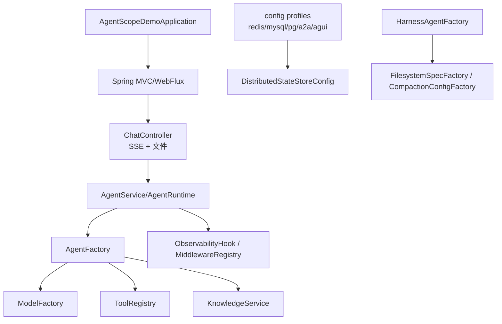
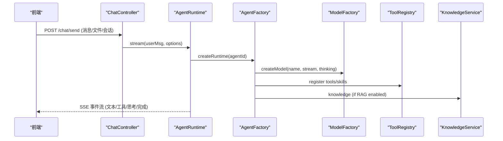
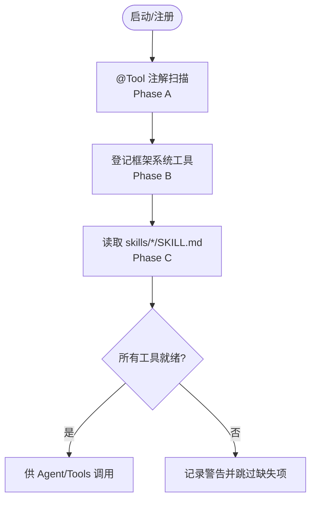
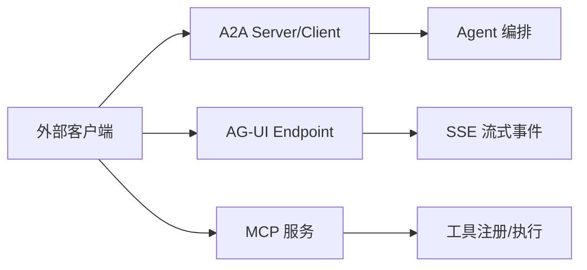
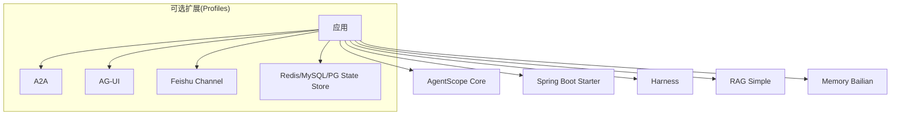

# 开发指南

<cite>
**本文引用的文件**   
- [pom.xml](file://pom.xml)
- [README.md](file://README.md)
- [AGENTS.md](file://AGENTS.md)
- [CLAUDE.md](file://CLAUDE.md)
- [ROADMAP.md](file://ROADMAP.md)
- [application.yml](file://src/main/resources/application.yml)
- [AgentScopeDemoApplication.java](file://src/main/java/com/skloda/agentscope/AgentScopeDemoApplication.java)
- [ChatController.java](file://src/main/java/com/skloda/agentscope/controller/ChatController.java)
- [AgentFactory.java](file://src/main/java/com/skloda/agentscope/agent/AgentFactory.java)
- [ModelFactory.java](file://src/main/java/com/skloda/agentscope/model/ModelFactory.java)
- [ToolRegistry.java](file://src/main/java/com/skloda/agentscope/tool/ToolRegistry.java)
- [MiddlewareRegistry.java](file://src/main/java/com/skloda/agentscope/middleware/MiddlewareRegistry.java)
- [KnowledgeService.java](file://src/main/java/com/skloda/agentscope/service/KnowledgeService.java)
- [DistributedStateStoreConfig.java](file://src/main/java/com/skloda/agentscope/config/DistributedStateStoreConfig.java)
- [HarnessAgentFactory.java](file://src/main/java/com/skloda/agentscope/harness/HarnessAgentFactory.java)
</cite>

## 目录
1. [简介](#简介)
2. [项目结构](#项目结构)
3. [核心组件](#核心组件)
4. [架构总览](#架构总览)
5. [详细组件分析](#详细组件分析)
6. [依赖分析](#依赖分析)
7. [性能考虑](#性能考虑)
8. [故障排查指南](#故障排查指南)
9. [结论](#结论)
10. [附录](#附录)

## 简介
本项目是一个基于 AgentScope（Java 2.0 GA）的演示应用，支持多种智能体类型、工具调用、文档解析、多模态交互、RAG 知识库以及多智能体协作。它提供响应式 SSE 聊天界面、会话管理、可扩展的工具与技能注册机制、可插拔中间件与分布式状态存储能力，并包含 Harness 模式以启用沙箱、计划模式、任务清单、分层记忆等高级特性。

## 项目结构
- 技术栈：Spring Boot 3.5.14 + Java 17，AgentScope 2.x 全套扩展。
- 入口类负责启动 Spring Boot 上下文并打印服务端口。
- Web 层通过 Controller 暴露 SSE 流式接口与文件上传/下载。
- 核心构建位于工厂层：统一模型创建、智能体装配、工具/技能/中间件集成。
- 运行期封装了事件映射与合并逻辑，保证前端接收一致的事件流。
- 配置以 YAML 为主，区分默认与 profile（如 redis/mysql/postgresql/a2a/agui/feishu）。
- 资源目录中提供了模板工作区、SKILL.md 示例、静态前端页面。

**章节来源**
- [pom.xml:1-12](file://pom.xml#L1-L12)
- [AgentScopeDemoApplication.java:11-35](file://src/main/java/com/skloda/agentscope/AgentScopeDemoApplication.java#L11-L35)
- [ChatController.java:47-153](file://src/main/java/com/skloda/agentscope/controller/ChatController.java#L47-L153)
- [application.yml:3-89](file://src/main/resources/application.yml#L3-L89)

## 核心组件
- 模型工厂 ModelFactory：统一通过 ModelRegistry 解析与创建模型实例，自动补充 provider 前缀和上下文（apiKey、stream、thinking、格式化器）。
- 智能体工厂 AgentFactory：按配置装配 ReActAgent，注入工具、技能、MCP、RAG、中间件、长期记忆与权限上下文；可选分布式 AgentStateStore。
- 运行时 AgentRuntime：桥接 agent.streamEvents 生命周期事件与 EventSink 的手动多智能体事件，统一转换为 SSE。
- 工具与服务 ToolRegistry / KnowledgeService：工具/技能扫描注册；知识库后台索引与管理。
- 中间件 MiddlewareRegistry：内置审计、限流、上下文增强、指标、OTel 追踪等中间件注册表。
- Harness 工厂 HarnessAgentFactory：组装 HarnessAgent，支持沙箱文件系统、压缩、任务清单、计划模式、分层记忆、权限、SkillRepository、上下文文件等。
- 分布式状态存储 DistributedStateStoreConfig：通过 Spring Profile 切换 Redis/MySQL/PostgreSQL 后端。

**章节来源**
- [ModelFactory.java:13-95](file://src/main/java/com/skloda/agentscope/model/ModelFactory.java#L13-L95)
- [AgentFactory.java:36-200](file://src/main/java/com/skloda/agentscope/agent/AgentFactory.java#L36-L200)
- [ChatController.java:117-153](file://src/main/java/com/skloda/agentscope/controller/ChatController.java#L117-L153)
- [ToolRegistry.java:23-44](file://src/main/java/com/skloda/agentscope/tool/ToolRegistry.java#L23-L44)
- [KnowledgeService.java:39-180](file://src/main/java/com/skloda/agentscope/service/KnowledgeService.java#L39-L180)
- [MiddlewareRegistry.java:12-55](file://src/main/java/com/skloda/agentscope/middleware/MiddlewareRegistry.java#L12-L55)
- [HarnessAgentFactory.java:22-120](file://src/main/java/com/skloda/agentscope/harness/HarnessAgentFactory.java#L22-L120)
- [DistributedStateStoreConfig.java:18-118](file://src/main/java/com/skloda/agentscope/config/DistributedStateStoreConfig.java#L18-L118)

## 架构总览
应用采用“配置驱动 + 工厂装配 + 流式事件”的模式：
- 启动时加载 agents.yml 等配置。
- 通过 ModelFactory 获取模型。
- 通过 AgentFactory 或 HarnessAgentFactory 组装智能体。
- 通过 ChatController 暴露 SSE 接口，前端接收实时事件。
- 运行时将框架自带事件与自定义事件（EventSink）合并为统一的流。

**图示来源**
- [ChatController.java:117-153](file://src/main/java/com/skloda/agentscope/controller/ChatController.java#L117-L153)
- [AgentFactory.java:131-200](file://src/main/java/com/skloda/agentscope/agent/AgentFactory.java#L131-L200)
- [ModelFactory.java:42-55](file://src/main/java/com/skloda/agentscope/model/ModelFactory.java#L42-L55)
- [ToolRegistry.java:71-44](file://src/main/java/com/skloda/agentscope/tool/ToolRegistry.java#L71-L44)
- [KnowledgeService.java:91-180](file://src/main/java/com/skloda/agentscope/service/KnowledgeService.java#L91-L180)

## 详细组件分析

### 编码规范与命名约定
- 包组织：按领域划分（agent/model/runtime/controller/service/tool/middleware/config 等），保持内聚、低耦合。
- 类与成员命名：使用驼峰，职责单一类名明确（如 AgentFactory、ToolRegistry）。
- 配置命名：YAML 中使用小写短横线（kebab-case），例如 agents.yml 中的 agentId。
- 常量与日志：使用 Logger 进行结构化信息记录，避免直接 System.out。
- API 设计：REST + SSE；方法返回 Flux 表示流式数据；错误处理使用统一事件模型。

**章节来源**
- [README.md:169-205](file://README.md#L169-L205)
- [AGENTS.md:106-164](file://AGENTS.md#L106-L164)

### 设计模式与实践
- 工厂模式：ModelFactory、AgentFactory、HarnessAgentFactory 封装复杂对象创建。
- 注册中心/查找表：ToolRegistry、MiddlewareRegistry 维护 name→Supplier/Factory 的映射。
- 策略模式：运行时根据类型选择 Sequential/Parallel/Loop/Debate 等策略实现。
- 观察者/事件驱动：AgentEvent + EventSink + SSE 前端消费。
- 装饰器/中间件：可组合中间件对请求执行链进行横切增强。
- 模板方法/Builder：各类 Config（HarnessConfig 等）通过 Builder 聚合。

**章节来源**
- [ToolRegistry.java:71-44](file://src/main/java/com/skloda/agentscope/tool/ToolRegistry.java#L71-L44)
- [MiddlewareRegistry.java:26-41](file://src/main/java/com/skloda/agentscope/middleware/MiddlewareRegistry.java#L26-L41)
- [AgentFactory.java:131-200](file://src/main/java/com/skloda/agentscope/agent/AgentFactory.java#L131-L200)
- [HarnessAgentFactory.java:73-120](file://src/main/java/com/skloda/agentscope/harness/HarnessAgentFactory.java#L73-L120)

### 自定义工具开发流程
- 在 tool 包下定义 POJO 并使用 @Tool/@ToolParam 注解。
- ToolRegistry 启动时会扫描 com.skloda.agentscope.tool 下的具体类（Phase A），以及框架系统工具（Phase B）。
- SKILL.md 的 frontmatter 可用于把 skill 名称映射到已注册的 @Tool 方法集合（Phase C）。
- 如需新增第三方或内部工具，只需放入被扫描路径或显式注册。

**图示来源**
- [ToolRegistry.java:23-44](file://src/main/java/com/skloda/agentscope/tool/ToolRegistry.java#L23-L44)
- [ToolRegistry.java:71-151](file://src/main/java/com/skloda/agentscope/tool/ToolRegistry.java#L71-L151)
- [ToolRegistry.java:155-199](file://src/main/java/com/skloda/agentscope/tool/ToolRegistry.java#L155-L199)

**章节来源**
- [ToolRegistry.java:71-199](file://src/main/java/com/skloda/agentscope/tool/ToolRegistry.java#L71-L199)
- [AGENTS.md:47-57](file://AGENTS.md#L47-L57)

### 技能系统扩展机制
- SKILL.md 放置在 src/main/resources/skills/<skill-name>/ 目录下，frontmatter 声明 name/description/tools。
- ToolRegistry 自动发现并映射 skill 名称到对应工具类（由其中任意一个工具的 class 推导）。
- 支持 ClasspathSkillRepository；未来可扩展 FileSystem/Git/DB Skill Repository。

**章节来源**
- [ToolRegistry.java:155-199](file://src/main/java/com/skloda/agentscope/tool/ToolRegistry.java#L155-L199)
- [AGENTS.md:27-40](file://AGENTS.md#L27-L40)

### 插件/集成（MCP/A2A/AG-UI/Channel）
- MCP：通过 McpClientService 管理外部服务端，结合 ToolGroupConfig 分组注册工具。
- A2A：通过 a2a-server/client starter 暴露 AgentCard/JSON-RPC 端点（需激活 profile）。
- AG-UI：暴露 /ag-ui/run SSE 端点（需激活 profile）。
- Channel：支持飞书 Webhook（需激活 profile）。

**章节来源**
- [pom.xml:104-144](file://pom.xml#L104-L144)
- [application.yml:19-24](file://src/main/resources/application.yml#L19-L24)
- [AGENTS.md:166-178](file://AGENTS.md#L166-L178)

### 代码组织结构与包划分原则
- controller：对外 HTTP/SSE 接口
- service：业务编排与存储
- agent/model：智能体配置与模型抽象
- runtime：执行上下文与事件流合并
- tool：工具实现与注册
- middleware：横切关注点（审计、限流、指标、上下文、追踪）
- config：环境相关的配置与 Profile
- harness：高级特性（沙箱、记忆、计划、任务清单、权限、技能库）

**章节来源**
- [AGENTS.md:106-164](file://AGENTS.md#L106-L164)
- [pom.xml:28-187](file://pom.xml#L28-L187)

### 调试技巧
- 前端调试面板：展示时间线、Token 统计、工具调用、思考过程、多智能体事件等。
- 后端日志：调整 logging.level.io.agentscope 为 DEBUG 观察更多细节。
- 事件追踪：利用 OTel 中间件串联 traceId。
- HITL 审批：可在 UI 中触发 Approve/Reject 恢复代理执行。

**章节来源**
- [README.md:39-62](file://README.md#L39-L62)
- [application.yml:81-89](file://src/main/resources/application.yml#L81-L89)
- [ChatController.java:157-186](file://src/main/java/com/skloda/agentscope/controller/ChatController.java#L157-L186)
- [MiddlewareRegistry.java:26-41](file://src/main/java/com/skloda/agentscope/middleware/MiddlewareRegistry.java#L26-L41)

### 性能分析方法
- SSE 流式响应：避免大对象阻塞，逐步推送文本与事件。
- 压缩与上下文裁剪：Harness 中启用 compaction、toolResultEviction 减少上下文膨胀。
- 并行与并发：合理使用并行策略、异步背景索引（知识检索）。
- 指标采集：Metrics 中间件收集关键指标（耗时、QPS、错误率）。

**章节来源**
- [HarnessAgentFactory.java:105-120](file://src/main/java/com/skloda/agentscope/harness/HarnessAgentFactory.java#L105-L120)
- [KnowledgeService.java:91-138](file://src/main/java/com/skloda/agentscope/service/KnowledgeService.java#L91-L138)
- [MiddlewareRegistry.java:26-41](file://src/main/java/com/skloda/agentscope/middleware/MiddlewareRegistry.java#L26-L41)

### 常见问题与排查思路
- 流未结束：确认 EventSink 是否正确关闭，merge 流是否最终完成。
- 文件上传失败：检查最大文件大小/请求大小配置。
- RAG 不命中：确认 embedding model 维度与 chunk 配置。
- 分布式存储不可用：核对 profile 与连接参数。

**章节来源**
- [application.yml:9-12](file://src/main/resources/application.yml#L9-L12)
- [DistributedStateStoreConfig.java:18-45](file://src/main/java/com/skloda/agentscope/config/DistributedStateStoreConfig.java#L18-L45)
- [KnowledgeService.java:91-138](file://src/main/java/com/skloda/agentscope/service/KnowledgeService.java#L91-L138)

### 贡献指南与版本发布（实践建议）
- 新建 Agent：在 agents.yml 添加配置；必要时注册新工具或 SKILL.md；重启后 UI 可见。
- 代码审查：遵循包职责清晰、函数单一职责、日志完整、异常统一转事件。
- 测试：单元与集成测试覆盖关键流程（SSE 流、审批、工具调用、RAG）。
- 版本演进：跟踪 ROADMAP 中的阶段性目标（S1-S16 已全部实施）。
- 发布：维护 pom.xml 的版本与依赖，确保依赖版本与 AgentScope GA 对齐。

**章节来源**
- [AGENTS.md:27-40](file://AGENTS.md#L27-L40)
- [ROADMAP.md:1-7](file://ROADMAP.md#L1-L7)
- [pom.xml:14-26](file://pom.xml#L14-L26)

### 团队协作最佳实践与知识分享
- 变更同步：以 Feature Branch + PR 方式提交变更，配合自动化测试。
- 知识库：保持 SKILL.md 描述更新，便于自动发现。
- 会议/复盘：对重大重构（如 S12-S15 协议集成）做经验分享。

[本节为通用实践说明，不涉及具体代码]

## 依赖分析
- 核心依赖：spring-boot-starter-web/thymeleaf、agentscope-spring-boot-starter、agentscope-core、dashscope extensions、harness、rag-simple、memory-bailian。
- 条件依赖：redis/mysql/postgresql（state store）、a2a-server/client/starter、channel-feishu、agui starter（profile 控制）。
- 构建产物：Spring Boot Maven Plugin 打包可执行应用。

**图示来源**
- [pom.xml:28-187](file://pom.xml#L28-L187)

**章节来源**
- [pom.xml:28-187](file://pom.xml#L28-L187)

## 性能考虑
- 启用响应式流式传输以降低首屏延迟。
- 使用上下文压缩与结果淘汰避免内存暴涨。
- 合理设置 RAG 检索上限与分数阈值，提升命中率与速度。
- 按需开启中间件，仅在需要时启用指标与追踪以避免额外开销。
- 分布式状态存储在高可用场景下提升容错与水平扩展能力。

[本节为通用指导，不涉及具体文件分析]

## 故障排查指南
- 启动问题：检查 application.yml 的端口、API Key 与 exclude 的配置。
- SSE 卡住：确保 EventSink 在流完成后关闭；检查 doFinally/concatWith 逻辑。
- 审批卡死：确认 PendingApproval 是否在超时前被批准或拒绝，并重放流事件。
- 知识索引失败：校验文件格式与嵌入模型维度一致性。
- 分布式存储错误：核对各 profile 的连接串与驱动配置。

**章节来源**
- [application.yml:3-24](file://src/main/resources/application.yml#L3-L24)
- [ChatController.java:117-186](file://src/main/java/com/skloda/agentscope/controller/ChatController.java#L117-L186)
- [KnowledgeService.java:91-180](file://src/main/java/com/skloda/agentscope/service/KnowledgeService.java#L91-L180)
- [DistributedStateStoreConfig.java:43-118](file://src/main/java/com/skloda/agentscope/config/DistributedStateStoreConfig.java#L43-L118)

## 结论
该项目以清晰的架构与模块化为基石，借助 AgentScope 的强大生态实现了从基础对话到复杂多智能体协作的全链路能力。通过工厂与注册机制、SSE 事件流、可插拔中间件与分布式状态，开发者可以高效地扩展工具、技能与工作流，并在生产环境中稳定运行。

## 附录
- 快速开始与环境要求见 README。
- 更深入的架构与演进路线见 AGENTS.md、CLAUDE.md、ROADMAP.md。
- 配置文件参考 application.yml。

**章节来源**
- [README.md:63-92](file://README.md#L63-L92)
- [AGENTS.md:9-23](file://AGENTS.md#L9-L23)
- [CLAUDE.md:9-23](file://CLAUDE.md#L9-L23)
- [application.yml:3-89](file://src/main/resources/application.yml#L3-L89)