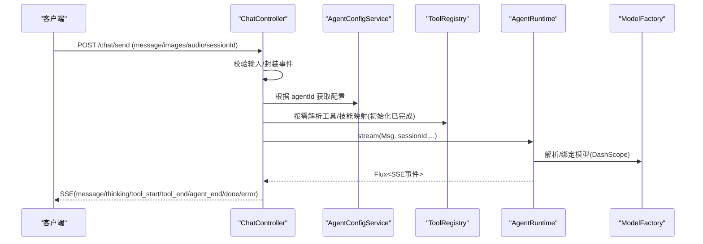
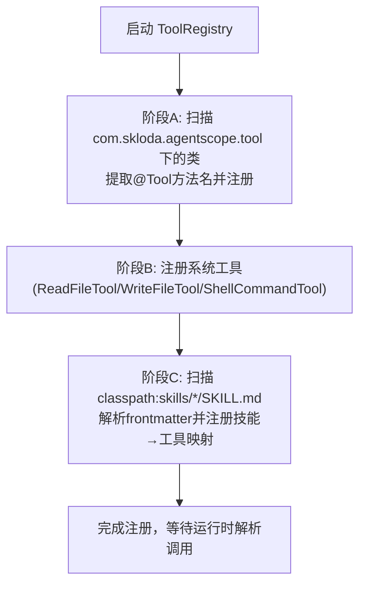
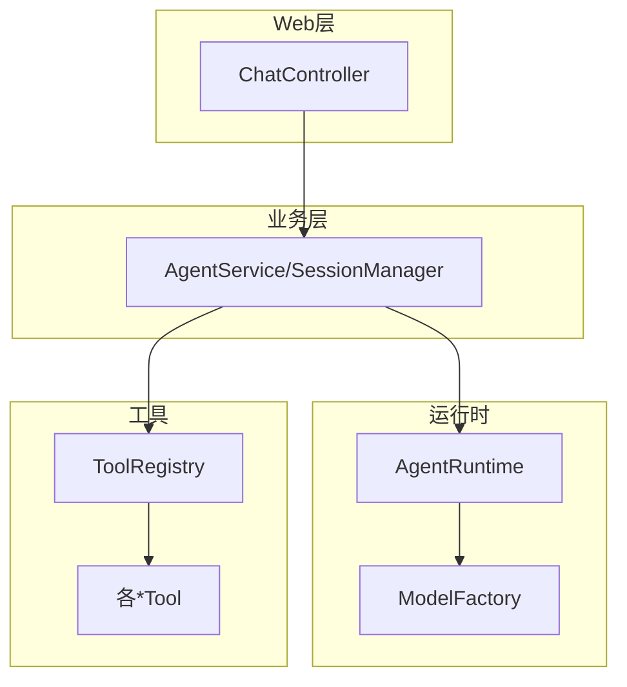

# 开发规范

<cite>
**本文件中引用的文件**
- [pom.xml](file://pom.xml)
- [application.yml](file://src/main/resources/application.yml)
- [agents.yml](file://src/main/resources/config/agents.yml)
- [AGENTS.md](file://AGENTS.md)
- [CLAUDE.md](file://CLAUDE.md)
- [README.md](file://README.md)
- [ToolRegistry.java](file://src/main/java/com/skloda/agentscope/tool/ToolRegistry.java)
- [AgentConfigService.java](file://src/main/java/com/skloda/agentscope/agent/AgentConfigService.java)
- [ChatController.java](file://src/main/java/com/skloda/agentscope/controller/ChatController.java)
</cite>

## 目录
1. [引言](#引言)
2. [项目结构与约定](#项目结构与约定)
3. [核心组件与职责划分](#核心组件与职责划分)
4. [架构总览](#架构总览)
5. [详细组件分析](#详细组件分析)
6. [依赖关系分析](#依赖关系分析)
7. [性能注意事项](#性能注意事项)
8. [故障排查指南](#故障排查指南)
9. [结论](#结论)
10. [附录](#附录)

## 引言
本文档旨在为 AgentScope Demo 项目建立统一的开发规范，覆盖 Java 编码风格、命名约定、包组织原则；AgentScope 框架使用规范（包括注解工具、参数标注、异常处理）；配置文件组织与环境变量管理；Git 工作流与分支策略；代码审查清单与质量标准。目标是在保持高性能响应式流的基础上，保证代码可维护性、可测试性与可扩展性。

## 项目结构与约定
- 技术栈：Spring Boot 3.5.14 + Java 17，AgentScope 2.0.x。项目通过 Maven 构建与运行，默认端口为应用配置中的服务器端口，启动需设置 DashScope API Key 环境变量。
- 包组织：
  - controller：HTTP 接口入口（SSE 聊天、文件上传等）。
  - service：业务编排（Agent 路由、会话管理等）。
  - agent：Agent 配置实体与加载服务（YAML 定义驱动）。
  - runtime：Agent 运行时、事件映射与多智能体流支撑。
  - harness：Harness Agent 工厂与运行时配置。
  - tool：工具类注册与实现（基于 @Tool/@ToolParam 的 POJO 方法）。
  - middleware：中间件（审批、审计、限流、上下文增强等）。
  - config：按功能模块划分的配置类（A2A、Feishu、Agui、分布式状态存储）。
  - mcp：MCP 客户端与服务配置封装。
  - permission：权限上下文构造器。
  - model：请求/事件/模型抽象与统一入口。
  - hook：可观测性桥接 EventSink。
  - composite：复合 Agent 模式与状态图。
  - schema：结构化输出数据模型。
- 资源文件：
  - application.yml：基础运行配置、日志级别、AgentScope 模型与知识索引、MCP 开关等。
  - config/agents.yml：Agent 定义（ID、类型、系统提示词、模型、技能、用户工具/系统工具、RAG 开关等）。
  - harness-agents.yml：Harness Agent 配置（执行模式、文件系统、压缩、记忆、计划、任务列表、技能自学习等）。
  - skills/*：技能描述及素材/脚本（通过 SKILL.md frontmatter 动态注册工具绑定）。
- 入口与端点：
  - Web 入口 GET / 返回前端页面。
  - POST /chat/send 发送消息并流式返回 SSE。
  - POST /chat/upload 文件上传。
  - GET /.well-known/agent-card.json 与 POST /a2a/jsonrpc 由 profile a2a 暴露。
  - POST /ag-ui/run 由 profile agui 暴露。

章节来源
- [pom.xml:1-26](file://pom.xml#L1-L26)
- [application.yml:1-90](file://src/main/resources/application.yml#L1-L90)
- [agents.yml:1-200](file://src/main/resources/config/agents.yml#L1-L200)
- [AGENTS.md:25-100](file://AGENTS.md#L25-L100)
- [CLAUDE.md:25-120](file://CLAUDE.md#L25-L120)
- [README.md:63-85](file://README.md#L63-L85)

## 核心组件与职责划分
- ToolRegistry：负责自动扫描并注册 @Tool 标注的工具类与系统内置工具，解析 SKILL.md frontmatter 完成技能到工具的映射，提供运行时工具实例化与管理。
- AgentConfigService：读取 agents.yml 与 harness-agents.yml，组装 Agent 配置；提供工具信息与技能信息反射查询能力；加载技能描述。
- ChatController：Web 层入口，封装 SSE 事件序列化、错误包装；接收聊天请求，调用 AgentService/AI Runtime 生成流式事件；支持文件与多媒体输入。
- ModelFactory（未在本节展开详述）：统一创建 LLM 模型（DashScope provider 自动注册），注入 apiKey/stream/enableThinking 等上下文。
- Runtime 家族：AgentRuntime 等负责将 AgentEvent 映射为统一 SSE 数据结构，合并多智能体事件（EventSink）。

章节来源
- [ToolRegistry.java:1-L200](file://src/main/java/com/skloda/agentscope/tool/ToolRegistry.java#L1-L200)
- [AgentConfigService.java:1-L199](file://src/main/java/com/skloda/agentscope/agent/AgentConfigService.java#L1-L199)
- [ChatController.java:44-L210](file://src/main/java/com/skloda/agentscope/controller/ChatController.java#L44-L210)

## 架构总览
下图展示了请求从控制器进入，经由 Agent 配置与运行时，最终通过 AgentScope 事件流返回给前端的整体流程，包含工具注册与 SKILL 映射。

图表来源
- [ChatController.java:122-L153](file://src/main/java/com/skloda/agentscope/controller/ChatController.java#L122-L153)
- [AgentConfigService.java:41-L76](file://src/main/java/com/skloda/agentscope/agent/AgentConfigService.java#L41-L76)
- [ToolRegistry.java:30-L96](file://src/main/java/com/skloda/agentscope/tool/ToolRegistry.java#L30-L96)
- [application.yml:26-L43](file://src/main/resources/application.yml#L26-L43)

## 详细组件分析

### 工具与技能注册规范（@Tool/@ToolParam 与 SKILL.md）
- 使用规范：
  - 在工具类中用 @Tool 标注可调用的方法；为每个参数标注 @ToolParam(name, description)，用于运行时参数校验与文档导出。
  - 工具类置于 com.skloda.agentscope.tool 包下，由 ToolRegistry 自动扫描发现。
  - 系统工具（如文件读写、Shell命令）通过 ToolRegistry 第二阶段自动/显式注册，无需手动重复定义。
- 技能绑定：
  - 在 resources/skills/<skillName>/SKILL.md 中使用 frontmatter 声明 name、description、tools 数组；ToolRegistry 会在第三阶段解析并将技能名映射到对应工具集合。
  - 新增技能或工具后需确保 SKILL.md 中 tools 列表指向已注册的 @Tool 方法名。
- 典型示例路径：
  - PDF 解析工具参考：[PdfParserTool.java:19-L21](file://src/main/java/com/skloda/agentscope/tool/PdfParserTool.java#L19-L21)
  - Word 解析/编辑工具参考：[DocxParserTool.java:24-L62](file://src/main/java/com/skloda/agentscope/tool/DocxParserTool.java#L24-L62)
  - 银行发票生成工具：[BankInvoiceTool.java:194-L211](file://src/main/java/com/skloda/agentscope/tool/BankInvoiceTool.java#L194-L211)
  - 网页搜索/天气/股票/新闻工具：[WebSearchTool.java:30-L33](file://src/main/java/com/skloda/agentscope/tool/WebSearchTool.java#L30-L33)

图表来源
- [ToolRegistry.java:30-L96](file://src/main/java/com/skloda/agentscope/tool/ToolRegistry.java#L30-L96)
- [ToolRegistry.java:125-L151](file://src/main/java/com/skloda/agentscope/tool/ToolRegistry.java#L125-L151)
- [ToolRegistry.java:155-L199](file://src/main/java/com/skloda/agentscope/tool/ToolRegistry.java#L155-L199)

章节来源
- [ToolRegistry.java:1-L200](file://src/main/java/com/skloda/agentscope/tool/ToolRegistry.java#L1-L200)
- [AGENTS.md:46-L58](file://AGENTS.md#L46-L58)
- [CLAUDE.md:48-L59](file://CLAUDE.md#L48-L59)

### 配置组织与环境变量
- 应用主配置 application.yml：
  - server.port：服务端口。
  - spring.servlet.multipart：限制最大文件与请求大小。
  - agentscope.model.dashscope.*：provider、api-key、model-name、stream、enable-thinking、thinking-budget。
  - agentscope.memory.type/max-history。
  - agentscope.knowledge.enabled/path/embedding-model/chunk-size/overlap-size/split-strategy/auto-index-on-startup。
  - agentscope.mcp.demo.enabled/startup-timeout/port。
  - logging.level 调整日志级别（io.agentscope、com.msxf.agentscope）。
- Agent 配置 agents.yml：
  - 以 agentId 为唯一标识，定义 category、name、description、systemPrompt、modelName、streaming、enableThinking、skills[]、userTools[]、systemTools[]。
  - RAG 相关开关 ragEnabled、ragRetrieveLimit、ragScoreThreshold。
  - samplePrompts 用于演示与预期行为断言。
- Harness 配置 harness-agents.yml（未在本文件内展示具体条目，但在 AGENTS.md 中说明其承载 HarnessAgent 的 17+ 项能力配置，如 executionMode、filesystemMode、compaction、memory、plan、taskListEnabled、skillLearning、permissionConfig、sandbox 等）。

环境与安全建议：
- API Key 必须通过环境变量 DASHSCOPE_API_KEY 传入，避免硬编码入仓库；可通过 application.yml 占位符 ${DASHSCOPE_API_KEY} 或 Spring Profile + -D 方式覆盖。
- 知识库索引与持久化路径使用相对/用户目录，结合部署环境做好隔离与备份策略。

章节来源
- [application.yml:1-L90](file://src/main/resources/application.yml#L1-L90)
- [agents.yml:1-L200](file://src/main/resources/config/agents.yml#L1-L200)
- [AGENTS.md:27-L40](file://AGENTS.md#L27-L40)

### 会话、流式事件与中间件
- ChatController 负责：
  - 接收消息并校验（文本/图片/音频任一存在）。
  - 使用 AgentService 构建流式 Flux 并通过 ServerSentEvent 返回。
  - 统一错误包装为 ChatEvent.error，并在 onErrorResume 中断流。
  - HITL 审批回调：批准则继续执行工具；拒绝则注入拒绝原因消息并恢复。
- 运行时事件（AgentEvent 到 SSE Map）：
  - 生命周期事件：AGENT_START → LLM_START → REASONING_DELTA → LLM_END → TOOL_CALL_START → TOOL_CALL_END → TEXT_BLOCK_DELTA → AGENT_END。
  - 多智能体事件（经 EventSink）：pipeline/routing/handoff/loop/stategraph/msghub/subagent-task。
- 中间件能力：
  - 审批（ApprovalMiddleware）、审计（AuditLogging/DetailedAudit）、上下文增强（ContextEnrichment）、度量采集（MetricsCollector）、限流（RateLimit）。
  - 扩展点以 MiddlewareRegistry 为中心，便于按需启用。

章节来源
- [ChatController.java:77-L153](file://src/main/java/com/skloda/agentscope/controller/ChatController.java#L77-L153)
- [ChatController.java:155-L200](file://src/main/java/com/skloda/agentscope/controller/ChatController.java#L155-L200)
- [CLAUDE.md:83-L133](file://CLAUDE.md#L83-L133)

### 单元测试与质量基线（现状）
- 本项目包含大量针对 Agent 配置、运行时、工具、控制器等的 JUnit 5 测试用例，当前以断言与集成校验为主，遵循清晰单一职责的测试命名。
- 覆盖率建议：
  - 关键工具类、Agent 配置与运行时映射逻辑应达到 >= 80% 语句覆盖率。
  - 网络/I/O 操作（文件解析、外部 API 调用）建议通过 Mock/TestDouble 隔离，保证稳定可重复。
  - 端到端场景（多智能体协作、SSE 事件流）建议在测试套件中以收敛的最小真实依赖进行集成验证。
- 回归要求：涉及事件类型、SSE 契约、工具签名变更后，需要同步更新或补充对应的单测。

章节来源
- [CLAUDE.md:7-L8](file://CLAUDE.md#L7-L8)
- [README.md:5-L33](file://README.md#L5-L33)

## 依赖关系分析
- 构建期依赖与版本锁定：
  - Spring Boot 3.5.14（父 POM 管理）。
  - AgentScope 全家桶 2.0.x（core、spring-boot-starter、harness、extensions-a2a/channel/agui 等）。
  - Apache POI/PDFBox、JDBC 驱动、Reactor Test、Spring Boot Test。
- 关键引入关系示意（概念级）：
  - Controller 依赖 Service 与 Runtime。
  - Service 依赖 Agent 配置与 Runtime。
  - Runtime 依赖 ModelFactory 与 AgentScope 的事件流。
  - ToolRegistry 被所有需要工具的 Agent 消费。

## 性能注意事项
- 流式优先：尽可能使用 Reactor Flux/ServerSentEvent 实现增量输出，避免阻塞调用。
- 大文件上传：合理设置 multipart.max-file-size/request-size，结合异步/分片下载。
- 知识索引：auto-index-on-startup 适合小规模知识库；大规模建议使用后台任务与独立索引服务。
- 模型流式与思考预算：开启 streaming 与 enable-thinking 时，适当配置 thinking-budget 控制延迟与成本。
- 事件映射：AgentEventMapper 统一转换，注意不要在其中加入阻塞 I/O。
- 多智能体协作：并发 Fanout 需评估下游能力与限流策略。

## 故障排查指南
- 常见异常与定位：
  - 序列化失败：ChatController.onErrorResume 会捕获并转换为错误事件，检查对象字段与注解是否一致。
  - 工具不可用：ToolRegistry 日志会打印未发现的工具或技能映射警告，核对 SKILL.md frontmatter 与 @Tool.name。
  - 配置加载失败：AgentConfigService 抛出不合法状态异常，确认 YAML 语法与必填字段。
  - Agent/模型配置错误：检查 application.yml 与 agents.yml 的 modelName/provider/stream 一致性。
- 日志与建议：
  - 提高 io.agentscope 与 com.msxf.agentscope 日志级别至 DEBUG，配合时间戳与线程名快速定位。
  - 针对长耗时链路，记录事件序列（start/end）以计算耗时分布。

章节来源
- [ChatController.java:111-L153](file://src/main/java/com/skloda/agentscope/controller/ChatController.java#L111-L153)
- [Application Logging in application.yml:82-L90](file://src/main/resources/application.yml#L82-L90)

## 结论
本规范围绕 AgentScope 2.0 的事件驱动与流式架构，确立了工具与技能的注册方式、配置组织、SSE 事件契约与可观测实践。通过在工具层严格使用 @Tool/@ToolParam、在控制器层统一错误封装与流式返回，可在保障性能的同时提升可维护性与可调试性。建议团队在此基础上补充 CI 覆盖率门禁与变更评审卡点，持续巩固质量基线。

## 附录

### Git 工作流与提交规范（建议）
- 分支模型：
  - main：生产可用分支。
  - develop：集成分支。
  - feature/*：新功能。
  - fix/*：缺陷修复。
  - hotfix/*：线上紧急修复。
- 提交信息格式：
  - 类型: 主题（英文动词开头，尽量简洁）
  - 可附加影响范围与问题编号
  - 示例：feat(tool): add generate_contract_review_report and params
  - 示例：fix(agent): resolve duplicate agentId during config load
- 分支策略：
  - 特性合并前须通过静态检查与本地单测。
  - PR 合并需至少一人审阅，必要时附加自动化检查（build/test/lint）。
- 标签与版本：
  - 采用语义化版本发布，打 tag 并记录变更记录。

### 代码审查检查清单
- 设计
  - 是否符合分层与单一职责？是否有过度耦合？
  - 是否使用了合适的 AgentScope 原语（工具、技能、流式事件）？
- 实现
  - 工具与方法是否完善 @Tool/@ToolParam？
  - 配置项是否可外化且具备安全的环境变量支持？
  - 是否对 IO/网络做了超时、重试与降级策略？
- 测试
  - 新增/修改逻辑是否覆盖了正常与异常路径？
  - 外部依赖是否进行了 Mock 或隔离？
- 可维护性
  - 命名是否遵循驼峰和领域语义？
  - 日志与错误信息是否足够诊断问题？
  - 是否需要新增或更新文档（agents.yml、SKILL.md、CHANGELOG）？

### 质量标准与覆盖率基准（建议）
- 单测覆盖率：核心模块 >= 80%，对外 API/事件映射 >= 90%。
- 集成测试：关键端到端场景（聊天、工具调用、文件解析）至少一条收敛用例。
- 性能基准：P95 接口时延与吞吐在典型环境下满足 SLA。
- 稳定性：CI 全量通过，无 Regression。