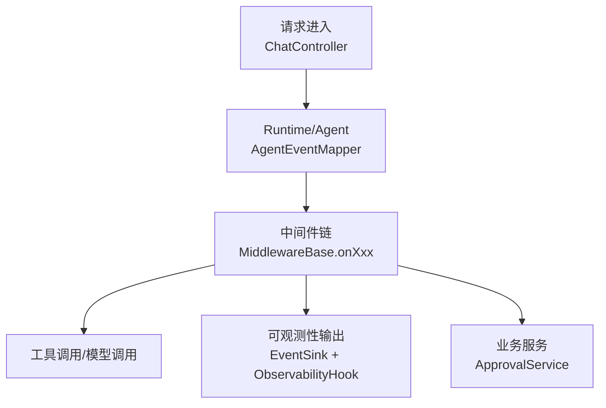
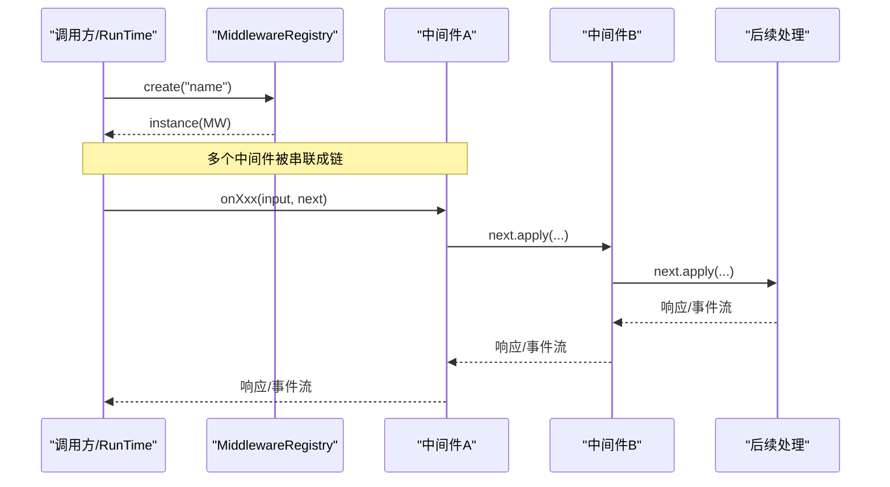
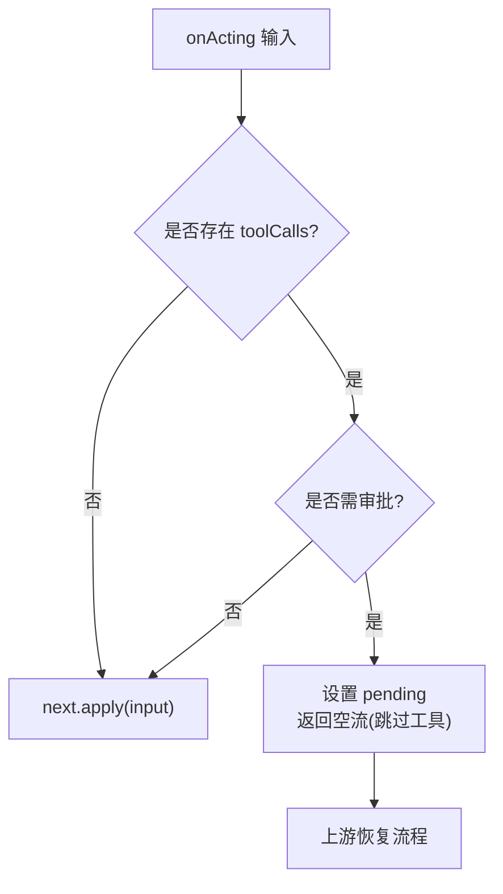
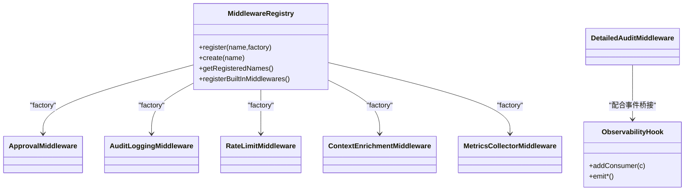

# 中间件与插件开发

<cite>
**本文引用的文件**
- [MiddlewareRegistry.java](file://src/main/java/com/skloda/agentscope/middleware/MiddlewareRegistry.java)
- [ApprovalMiddleware.java](file://src/main/java/com/skloda/agentscope/middleware/ApprovalMiddleware.java)
- [AuditLoggingMiddleware.java](file://src/main/java/com/skloda/agentscope/middleware/AuditLoggingMiddleware.java)
- [RateLimitMiddleware.java](file://src/main/java/com/skloda/agentscope/middleware/RateLimitMiddleware.java)
- [ContextEnrichmentMiddleware.java](file://src/main/java/com/skloda/agentscope/middleware/ContextEnrichmentMiddleware.java)
- [MetricsCollectorMiddleware.java](file://src/main/java/com/skloda/agentscope/middleware/MetricsCollectorMiddleware.java)
- [DetailedAuditMiddleware.java](file://src/main/java/com/skloda/agentscope/middleware/DetailedAuditMiddleware.java)
- [ObservabilityHook.java](file://src/main/java/com/skloda/agentscope/hook/ObservabilityHook.java)
- [ApprovalService.java](file://src/main/java/com/skloda/agentscope/service/ApprovalService.java)
- [AgentEventMapper.java](file://src/main/java/com/skloda/agentscope/runtime/AgentEventMapper.java)
- [ModelFactory.java](file://src/main/java/com/skloda/agentscope/model/ModelFactory.java)
- [MiddlewareRegistryTest.java](file://src/test/java/com/skloda/agentscope/middleware/MiddlewareRegistryTest.java)
- [ApprovalMiddlewareTest.java](file://src/test/java/com/skloda/agentscope/middleware/ApprovalMiddlewareTest.java)
- [AuditLoggingMiddlewareTest.java](file://src/test/java/com/skloda/agentscope/middleware/AuditLoggingMiddlewareTest.java)
- [RateLimitMiddlewareTest.java](file://src/test/java/com/skloda/agentscope/middleware/RateLimitMiddlewareTest.java)
- [ContextEnrichmentMiddlewareTest.java](file://src/test/java/com/skloda/agentscope/middleware/ContextEnrichmentMiddlewareTest.java)
- [ObservabilityHookLifecycleTest.java](file://src/test/java/com/skloda/agentscope/hook/ObservabilityHookLifecycleTest.java)
</cite>

## 目录
1. [引言](#引言)
2. [项目结构](#项目结构)
3. [核心组件](#核心组件)
4. [架构总览](#架构总览)
5. [详细组件分析](#详细组件分析)
6. [依赖关系分析](#依赖关系分析)
7. [性能考量](#性能考量)
8. [故障诊断指南](#故障诊断指南)
9. [结论](#结论)
10. [附录：API与配置](#附录api与配置)

## 引言
本文面向希望在 AgentScope 中开发与集成“中间件”和“可观测性钩子”的工程师，系统讲解仓库中的 MiddlewareRegistry 设计模式、中间件生命周期管理、执行链构建方式；提供审批、审计日志、限流等中间件的实现要点与测试策略；说明 ObservabilityHook 的事件桥接能力；并对插件化、SPI 动态发现与依赖注入进行架构层面解读。内容兼顾可读性与深入度，帮助读者快速掌握本仓库的扩展点并安全落地。

## 项目结构
围绕中间件与事件的可观测性，本项目在以下包组织代码：
- middleware: 中间件注册表与各阶段拦截实现
- hook: 可观测性桥接（从手动事件到 EventSink）
- runtime/model: 运行时事件转换、模型统一创建入口
- service: 业务流程服务（如审批服务）
- test: 针对各中间件、注册表、钩子的单元测试

图示来源
- [ObservabilityHook.java:1-67](file://src/main/java/com/skloda/agentscope/hook/ObservabilityHook.java#L1-L67)
- [DetailedAuditMiddleware.java:40-108](file://src/main/java/com/skloda/agentscope/middleware/DetailedAuditMiddleware.java#L40-L108)
- [ModelFactory.java:未展开读取，仅引用命名](file://src/main/java/com/skloda/agentscope/model/ModelFactory.java)

章节来源
- [ObservabilityHook.java:1-67](file://src/main/java/com/skloda/agentscope/hook/ObservabilityHook.java#L1-L67)
- [DetailedAuditMiddleware.java:40-108](file://src/main/java/com/skloda/agentscope/middleware/DetailedAuditMiddleware.java#L40-L108)

## 核心组件
- 中间件注册表 MiddlewareRegistry: 以名称→工厂映射维护内置/扩展中间件，并在应用启动时自动注册；提供 create(name) 实例化与清单查询。
- 中间件接口 MiddlewareBase(框架提供): onAgent / onReasoning / onActing / onModelCall / onSystemPrompt 五个阶段拦截点。
- 具体中间件:
  - ApprovalMiddleware: 在 onActing 阶段检查工具调用是否需审批，如需则返回空流跳过实际工具执行，并暴露待批数据。
  - AuditLoggingMiddleware: 对 agent/reasoning/acting 三阶段进行耗时与关键信息打印。
  - RateLimitMiddleware: 在 onModelCall 阶段做滑动窗口限流，超限直接返回空流不继续下游。
  - ContextEnrichmentMiddleware: 在 onSystemPrompt 阶段拼接当前时间等上下文到提示词。
  - MetricsCollectorMiddleware: 统计工具时长、模型用量、错误率，估算成本，输出汇总。
  - DetailedAuditMiddleware: 带 TraceId 的全链路审计，捕获 thinking/text/tool 事件片段，完整记录起止与结果。
- 可观测性钩子 ObservabilityHook: 封装 EventSink，暴露 emitPipeline/Step/End/Routing/Handoff/Loop/Graph/Roundtable/Task 系列方法，供多智能体场景手工广播事件。

章节来源
- [MiddlewareRegistry.java:12-55](file://src/main/java/com/skloda/agentscope/middleware/MiddlewareRegistry.java#L12-L55)
- [ApprovalMiddleware.java:22-123](file://src/main/java/com/skloda/agentscope/middleware/ApprovalMiddleware.java#L22-L123)
- [AuditLoggingMiddleware.java:15-68](file://src/main/java/com/skloda/agentscope/middleware/AuditLoggingMiddleware.java#L15-L68)
- [RateLimitMiddleware.java:16-52](file://src/main/java/com/skloda/agentscope/middleware/RateLimitMiddleware.java#L16-L52)
- [ContextEnrichmentMiddleware.java:13-27](file://src/main/java/com/skloda/agentscope/middleware/ContextEnrichmentMiddleware.java#L13-L27)
- [MetricsCollectorMiddleware.java:31-200](file://src/main/java/com/skloda/agentscope/middleware/MetricsCollectorMiddleware.java#L31-L200)
- [DetailedAuditMiddleware.java:28-220](file://src/main/java/com/skloda/agentscope/middleware/DetailedAuditMiddleware.java#L28-L220)
- [ObservabilityHook.java:16-67](file://src/main/java/com/skloda/agentscope/hook/ObservabilityHook.java#L16-L67)

## 架构总览
中间件机制本质是基于 Reactor 的“过滤器链”。每个中间件实现 Framework 提供的 MiddlewareBase，并以 Function<..., Flux<...>> next 为下一步调用入口。执行顺序由调用方（或外部编排）将多个中间件串联，形成立即可插拔的拦截链。注册表负责按名查找中间件实例，便于配置驱动启用。

图示来源
- [MiddlewareRegistry.java:18-49](file://src/main/java/com/skloda/agentscope/middleware/MiddlewareRegistry.java#L18-L49)
- [DetailedAuditMiddleware.java:45-108](file://src/main/java/com/skloda/agentscope/middleware/DetailedAuditMiddleware.java#L45-L108)

## 详细组件分析

### 1. 中间件注册表与工厂模式
- 设计要点
  - 使用线程安全/有序容器 LinkedHashMap 维护“名称→Supplier”的映射，延迟创建实例。
  - PostConstruct 自动注册内置中间件，保证应用启动后立刻可用。
  - create(name) 按名称反射式获取 Supplier 并实例化，未知名称返回 null 便于上层容错。
- 适用场景
  - 通过配置开关中间件集合（仅加载所需），降低运行时开销。
  - 解耦上游对具体实现的感知，利于扩展第三方中间件。

章节来源
- [MiddlewareRegistry.java:12-55](file://src/main/java/com/skloda/agentscope/middleware/MiddlewareRegistry.java#L12-L55)
- [MiddlewareRegistryTest.java:15-53](file://src/test/java/com/skloda/agentscope/middleware/MiddlewareRegistryTest.java#L15-L53)

### 2. 审批中间件（ApprovalMiddleware）
- 功能职责
  - 在 onActing 阶段检查工具调用是否需要审批。
  - 当需要时，标记状态并记录待审批的工具列表，返回空流从而“跳过工具执行”，由外层流程接管（例如前端展示审批按钮，再由服务恢复）。
- 关键点
  - 支持“全局必须审批”或“指定工具名单”两种策略。
  - 暴露 isApprovalTriggered()、getPendingToolUseBlocks()、getPendingToolCallsForSse() 等对外 API 供 UI/服务端读取待审项。
- 测试要点
  - 覆盖“无工具调用不触发”“工具不在白名单不触发”“匹配工具或全局强制触发”“null 参数鲁棒性”“多工具全部捕获”等分支。

图示来源
- [ApprovalMiddleware.java:58-77](file://src/main/java/com/skloda/agentscope/middleware/ApprovalMiddleware.java#L58-L77)
- [ApprovalMiddlewareTest.java:16-151](file://src/test/java/com/skloda/agentscope/middleware/ApprovalMiddlewareTest.java#L16-L151)

章节来源
- [ApprovalMiddleware.java:22-123](file://src/main/java/com/skloda/agentscope/middleware/ApprovalMiddleware.java#L22-L123)
- [ApprovalMiddlewareTest.java:16-151](file://src/test/java/com/skloda/agentscope/middleware/ApprovalMiddlewareTest.java#L16-L151)

### 3. 审计日志中间件（AuditLoggingMiddleware）
- 功能职责
  - 对三个主要阶段(onAgent/onReasoning/onActing)分别输出起止耗时、消息数量、工具调用预览。
  - 异常路径记录 error 日志。
- 注意点
  - 使用 System.nanoTime() 计算耗时，避免时钟漂移。
  - 日志级别合理控制，避免线上过大吞吐。

章节来源
- [AuditLoggingMiddleware.java:15-68](file://src/main/java/com/skloda/agentscope/middleware/AuditLoggingMiddleware.java#L15-L68)
- [AuditLoggingMiddlewareTest.java:23-75](file://src/test/java/com/skloda/agentscope/middleware/AuditLoggingMiddlewareTest.java#L23-L75)

### 4. 限流中间件（RateLimitMiddleware）
- 功能职责
  - 在 onModelCall 阶段基于队列维护最近一分钟的调用次数，超出阈值直接返回空流，拒绝继续下游模型调用。
- 算法特性
  - 时间窗口滚动清理旧时间戳，O(N) 清理但总体高效。
  - 简单且无锁（同单线程事件流内运行）的计数与判断。

章节来源
- [RateLimitMiddleware.java:16-52](file://src/main/java/com/skloda/agentscope/middleware/RateLimitMiddleware.java#L16-L52)
- [RateLimitMiddlewareTest.java:14-49](file://src/test/java/com/skloda/agentscope/middleware/RateLimitMiddlewareTest.java#L14-L49)

### 5. 上下文增强中间件（ContextEnrichmentMiddleware）
- 功能职责
  - 在 onSystemPrompt 阶段在原提示词基础上附加 <context> 区块（含时间、用户身份示例），不修改原字符串，返回新字符串。
- 用途
  - 将运行时上下文注入给 LLM，提高意图理解能力。

章节来源
- [ContextEnrichmentMiddleware.java:13-27](file://src/main/java/com/skloda/agentscope/middleware/ContextEnrichmentMiddleware.java#L13-L27)
- [ContextEnrichmentMiddlewareTest.java:8-31](file://src/test/java/com/skloda/agentscope/middleware/ContextEnrichmentMiddlewareTest.java#L8-L31)

### 6. 度量采集中间件（MetricsCollectorMiddleware）
- 功能职责
  - 在 onAgent/onReasoning/onActing/onModelCall 四阶段收集：
    - 工具调用次数/时延/错误次数，按工具维度聚合。
    - 模型 token 总量及估算成本。
    - Agent 级指标（调用数/总时长/最大最小值）。
- 线程与并发
  - 使用 ThreadLocal 持有上下文，用 AtomicInteger/AtomicLong 与 ConcurrentHashMap 聚合全局指标。

章节来源
- [MetricsCollectorMiddleware.java:31-200](file://src/main/java/com/skloda/agentscope/middleware/MetricsCollectorMiddleware.java#L31-L200)

### 7. 全链路审计中间件（DetailedAuditMiddleware）
- 功能职责
  - 引入 TraceId，记录完整的开始/结束日志。
  - 逐条捕获 thinking/text/tool 相关事件片段（截断过长文本防 OOM）。
  - 统计 reasoning rounds、tool calls、text blocks 等计数。
- 价值
  - 为复杂 ReAct/工具链提供“端到端”可追踪审计能力，配合上层的 EventSink 输出。

章节来源
- [DetailedAuditMiddleware.java:28-220](file://src/main/java/com/skloda/agentscope/middleware/DetailedAuditMiddleware.java#L28-L220)

### 8. 可观测性钩子（ObservabilityHook）
- 设计要点
  - 作为旧有 Hook 消费者与新 EventSink 之间的桥接。
  - 通过 addConsumer(BiConsumer) 订阅事件流，按 type 分发到回调。
  - 暴露 emit* 系列方法用于多智能体场景的手工事件上报（pipeline/routing/handoff/loop/graph/roundtable/task 等）。
- 与运行时结合
  - 运行时事件（如 model call/end）由 AgentStream/AgentEventMapper 统一转换为 SSE 格式；多智能体事件通过 ObservabilityHook -> EventSink 汇入同一流。

章节来源
- [ObservabilityHook.java:16-67](file://src/main/java/com/skloda/agentscope/hook/ObservabilityHook.java#L16-L67)
- [ObservabilityHookLifecycleTest.java:21-116](file://src/test/java/com/skloda/agentscope/hook/ObservabilityHookLifecycleTest.java#L21-L116)

## 依赖关系分析
中间件通过框架提供的 MiddlewareBase 与 AgentEvent/Reactor Flux/Mono 发生弱耦合交互；注册表仅依赖工厂 Supplier 完成延迟实例化；具体中间件之间相互独立，可按需拼装。

图示来源
- [MiddlewareRegistry.java:12-55](file://src/main/java/com/skloda/agentscope/middleware/MiddlewareRegistry.java#L12-L55)
- [ObservabilityHook.java:16-67](file://src/main/java/com/skloda/agentscope/hook/ObservabilityHook.java#L16-L67)

章节来源
- [MiddlewareRegistry.java:12-55](file://src/main/java/com/skloda/agentscope/middleware/MiddlewareRegistry.java#L12-L55)
- [ObservabilityHook.java:16-67](file://src/main/java/com/skloda/agentscope/hook/ObservabilityHook.java#L16-L67)

## 性能考量
- 中间件选择与顺序
  - 将轻量中间件（上下文注入、基础审计）放在前面，耗时或重逻辑（详细审计、度量）按需放置，减少不必要的 I/O。
- 空流短路
  - 限流/审批在命中条件时直接返回空流，避免无谓下游开销。
- 资源控制
  - 详细审计中对长文本采样/截断，避免内存放大；度量聚合使用原子变量+ConcurrentMap，避免竞争热点。
- 并发与线程局部
  - 度量使用 ThreadLocal 隔离上下文；注意及时 remove 防止内存泄漏。
- 日志策略
  - 生产环境谨慎开启高吞吐审计日志，建议分级开关、采样输出。

[本节为通用指导，不绑定特定文件]

## 故障诊断指南
- 中间件未生效
  - 检查注册表是否正确 register/registerBuiltInMiddlewares；确认 create 的名称与配置一致。
  - 参考：[MiddlewareRegistryTest](file://src/test/java/com/skloda/agentscope/middleware/MiddlewareRegistryTest.java#L15-L53)
- 审批无法触发
  - 若工具列表为空或名称不匹配，不会触发；确认 approvalTools 与策略。
  - 参考：[ApprovalMiddlewareTest](file://src/test/java/com/skloda/agentscope/middleware/ApprovalMiddlewareTest.java#L16-L151)
- 限流过紧导致拒绝
  - 调大 RateLimitMiddleware 上限或优化下游重试退避。
  - 参考：[RateLimitMiddlewareTest](file://src/test/java/com/skloda/agentscope/middleware/RateLimitMiddlewareTest.java#L14-L49)
- 事件丢失/未到达
  - 确认 ObservabilityHook 已 addConsumer 接收；确保 emit* 调用在正确的执行上下文。
  - 参考：[ObservabilityHookLifecycleTest](file://src/test/java/com/skloda/agentscope/hook/ObservabilityHookLifecycleTest.java#L21-L116)
- 性能抖动/内存占用高
  - 检查详细审计对大对象的写入频次；度量是否忘记移除 ThreadLocal；考虑采样与缓冲落盘。

章节来源
- [MiddlewareRegistryTest.java:15-53](file://src/test/java/com/skloda/agentscope/middleware/MiddlewareRegistryTest.java#L15-L53)
- [ApprovalMiddlewareTest.java:16-151](file://src/test/java/com/skloda/agentscope/middleware/ApprovalMiddlewareTest.java#L16-L151)
- [RateLimitMiddlewareTest.java:14-49](file://src/test/java/com/skloda/agentscope/middleware/RateLimitMiddlewareTest.java#L14-L49)
- [ObservabilityHookLifecycleTest.java:21-116](file://src/test/java/com/skloda/agentscope/hook/ObservabilityHookLifecycleTest.java#L21-L116)

## 结论
本项目通过 MiddlewareRegistry 集中管理中间件工厂，结合框架 MiddlewareBase 五阶段拦截点，实现了高度可扩展与低侵入的横切能力（审计、限流、审批、度量、上下文注入、OTel 链路追踪）。ObservabilityHook 则为多智能体场景提供了统一的事件发射通道，便于与上层可视化、调试面板对接。基于清晰的中间件契约与完善的单元测试，团队可以快速、安全地迭代扩展更多中间件与观察能力。

[本节为总结，不绑定特定文件]

## 附录：API与配置
- 常用入口
  - 注册表：MiddlewareRegistry.register/getRegisteredNames/create
  - 审批：ApprovalMiddleware.isApprovalTriggered()/getPendingToolCallsForSse()
  - 钩子：ObservabilityHook.addConsumer()/emit* 系列
- 配置建议
  - 通过配置选择性启用中间件（如仅开启 audit-logging、rate-limit），减少非必需开销。
  - 细粒度调整限流阈值、审计采样比例、度量精度。

章节来源
- [MiddlewareRegistry.java:18-55](file://src/main/java/com/skloda/agentscope/middleware/MiddlewareRegistry.java#L18-L55)
- [ApprovalMiddleware.java:103-123](file://src/main/java/com/skloda/agentscope/middleware/ApprovalMiddleware.java#L103-L123)
- [ObservabilityHook.java:30-67](file://src/main/java/com/skloda/agentscope/hook/ObservabilityHook.java#L30-L67)