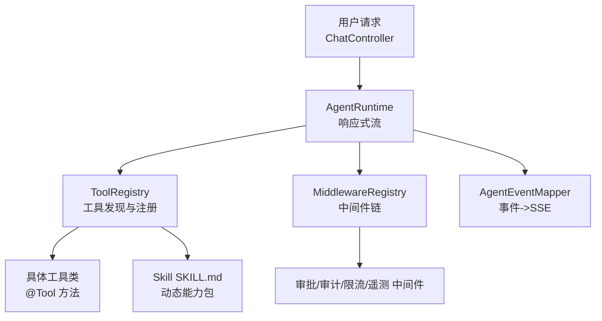
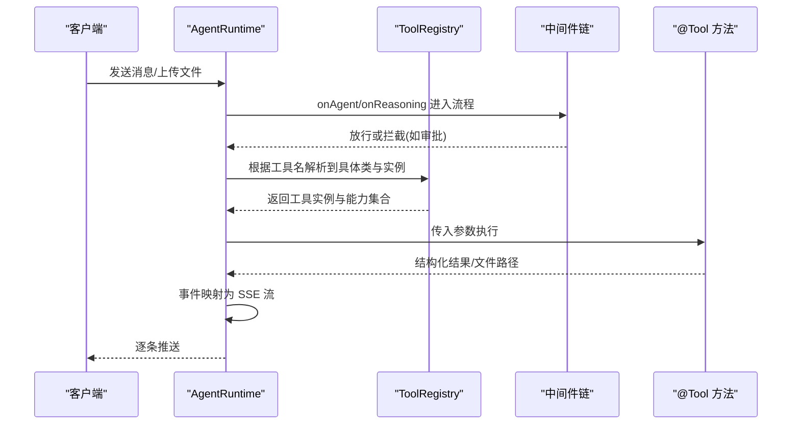
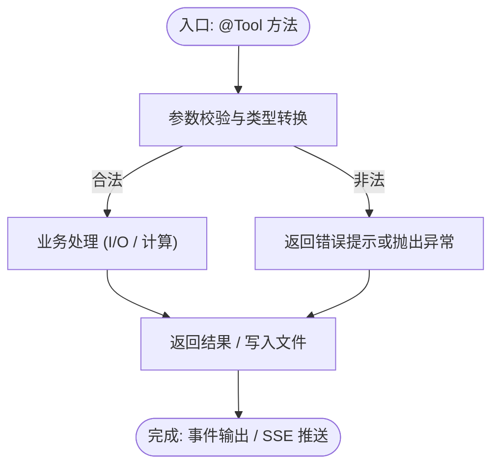
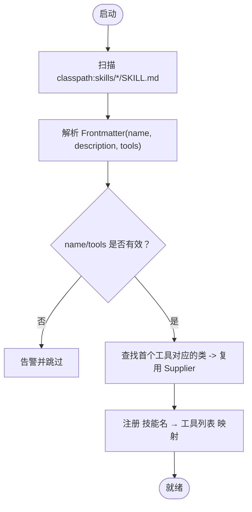
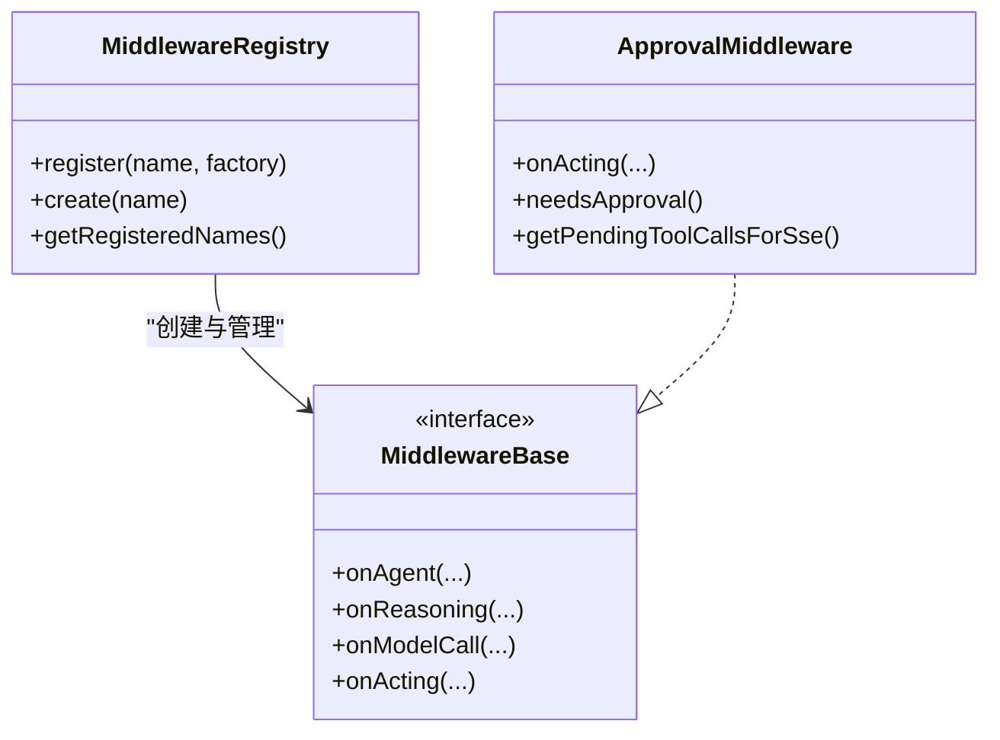
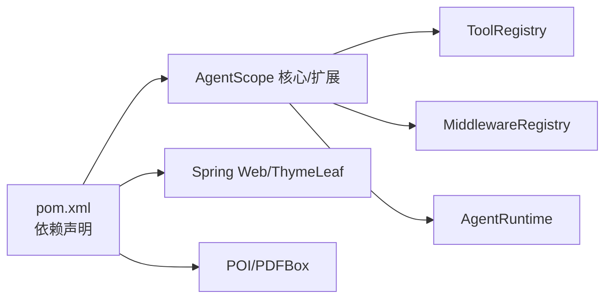

# 扩展开发

<cite>
**本文引用的文件**
- [pom.xml](file://pom.xml)
- [SimpleTools.java](file://src/main/java/com/skloda/agentscope/tool/SimpleTools.java)
- [DocxParserTool.java](file://src/main/java/com/skloda/agentscope/tool/DocxParserTool.java)
- [PdfParserTool.java](file://src/main/java/com/skloda/agentscope/tool/PdfParserTool.java)
- [XlsxParserTool.java](file://src/main/java/com/skloda/agentscope/tool/XlsxParserTool.java)
- [BankInvoiceTool.java](file://src/main/java/com/skloda/agentscope/tool/BankInvoiceTool.java)
- [ToolRegistry.java](file://src/main/java/com/skloda/agentscope/tool/ToolRegistry.java)
- [SKILL.md（docx）](file://src/main/resources/skills/docx/SKILL.md)
- [SKILL.md（pdf）](file://src/main/resources/skills/pdf/SKILL.md)
- [SKILL.md（xlsx）](file://src/main/resources/skills/xlsx/SKILL.md)
- [MiddlewareRegistry.java](file://src/main/java/com/skloda/agentscope/middleware/MiddlewareRegistry.java)
- [ApprovalMiddleware.java](file://src/main/java/com/skloda/agentscope/middleware/ApprovalMiddleware.java)
- [AgentRuntime.java](file://src/main/java/com/skloda/agentscope/runtime/AgentRuntime.java)
- [agents.yml](file://src/main/resources/config/agents.yml)
- [harness-agents.yml](file://src/main/resources/config/harness-agents.yml)
</cite>

## 目录
1. 引言
2. 项目结构
3. 核心组件
4. 架构总览
5. 详细组件解析
6. 依赖分析
7. 性能考虑
8. 故障排查指南
9. 结论
10. 附录

## 引言
本指南面向希望基于 AgentScope 扩展能力的开发者，聚焦以下目标：
- 如何开发自定义工具：注解使用、参数与错误处理、异步实现要点。
- 技能系统扩展：SKILL.md 规范、注册与动态加载机制。
- 插件式架构：中间件开发、事件处理器、观察者模式在运行时中的应用。
- 从简单工具到复杂多模态工具的完整实践示例。
- 工具分类管理、权限控制、性能优化、技能版本与依赖管理策略。

本项目采用 Spring Boot 3 + Java 17 与 AgentScope 2.0+，通过注解与约定优于配置的方式快速装配工具和技能；同时提供中间件与事件管线支撑可观测性、审批流等扩展点。

## 项目结构
与扩展相关的代码组织要点：
- 工具：位于 tool 包，所有带特定注解的方法会被自动发现并注册为可用函数。
- 技能：位于 resources/skills，按“技能名/SKILL.md”存放元信息与使用说明，启动时自动扫描。
- 中间件：位于 middleware 包，实现统一接口并在注册表中登记，用于在执行链上拦截与增强。
- 运行时：位于 runtime 包，将工具、中间件与事件映射结合，形成响应式流式输出。

图示来源
- [ToolRegistry.java:23-43](file://src/main/java/com/skloda/agentscope/tool/ToolRegistry.java#L23-L43)
- [MiddlewareRegistry.java:18-41](file://src/main/java/com/skloda/agentscope/middleware/MiddlewareRegistry.java#L18-L41)
- [AgentRuntime.java:1-20](file://src/main/java/com/skloda/agentscope/runtime/AgentRuntime.java#L1-L20)

章节来源
- [pom.xml:1-188](file://pom.xml#L1-L188)

## 核心组件
- 工具注册中心（ToolRegistry）
  - 扫描项目自带工具包与框架内置工具，建立“工具名→类名→实例化供应器”的映射。
  - 动态解析 SKILL.md 的 frontmatter，将“技能名”映射到一组“工具列表”，从而以“技能”为粒度组合工具。
  - 保证并发安全与懒加载，提高冷启动效率与可扩展性。

- 中间件注册中心（MiddlewareRegistry）
  - 集中维护中间件名称到工厂的映射，支持应用内扩展与第三方集成。
  - 预置审计、限流、上下文增强、指标采集、OpenTelemetry 遥测等常见横切关注点。

- 审批中间件（ApprovalMiddleware）
  - 在工具调用前进行审查拦截，支持细粒度的工具白名单与全局开关，配合外部审批流实现人机协同（HITL）。

- 运行时（AgentRuntime）
  - 封装工具执行、事件生成、SSE 推送与清理逻辑；兼容代理式调用与多 Agent 协作事件的合并输出。
  - 在必要阶段注入 MCP 溯源信息、剔除历史未决工具调用，避免对话污染。

章节来源
- [ToolRegistry.java:30-43](file://src/main/java/com/skloda/agentscope/tool/ToolRegistry.java#L30-L43)
- [MiddlewareRegistry.java:26-41](file://src/main/java/com/skloda/agentscope/middleware/MiddlewareRegistry.java#L26-L41)
- [ApprovalMiddleware.java:42-77](file://src/main/java/com/skloda/agentscope/middleware/ApprovalMiddleware.java#L42-L77)
- [AgentRuntime.java:82-190](file://src/main/java/com/skloda/agentscope/runtime/AgentRuntime.java#L82-L190)

## 架构总览
工具与技能的装配以及中间件的拦截共同构成可扩展的执行平面。

图示来源
- [ToolRegistry.java:73-107](file://src/main/java/com/skloda/agentscope/tool/ToolRegistry.java#L73-L107)
- [ApprovalMiddleware.java:58-77](file://src/main/java/com/skloda/agentscope/middleware/ApprovalMiddleware.java#L58-L77)
- [AgentRuntime.java:146-190](file://src/main/java/com/skloda/agentscope/runtime/AgentRuntime.java#L146-L190)

## 详细组件解析

### 自定义工具开发
- 基本步骤
  - 在指定包下新增工具类，并使用注解标注可调用的方法。
  - 通过工具描述与参数描述向 LLM 暴露清晰的能力契约。
  - 将工具类放入工具扫描范围内，启动后自动注册。

- 参数与校验
  - 对每个参数提供描述，便于 LLM 理解并正确传参。
  - 输入合法性检查建议在工具方法内部进行，返回明确的消息字符串或使用异常让上层捕获。

- 错误处理
  - I/O 异常、模板缺失、路径越界等场景要给出明确的失败消息。
  - 对大文件或复杂处理建议记录日志，便于定位问题。

- 异步工具实现
  - 若工具需要长耗时任务，建议使用异步 API 与响应式编程配合 Runtime 的事件流。
  - 确保事件可观测性，必要时发出 start/end 事件，以便前端进度展示。

参考示例路径
- [SimpleTools.java:12-43](file://src/main/java/com/skloda/agentscope/tool/SimpleTools.java#L12-L43)
- [DocxParserTool.java:24-126](file://src/main/java/com/skloda/agentscope/tool/DocxParserTool.java#L24-L126)
- [PdfParserTool.java:19-71](file://src/main/java/com/skloda/agentscope/tool/PdfParserTool.java#L19-L71)
- [XlsxParserTool.java:17-107](file://src/main/java/com/skloda/agentscope/tool/XlsxParserTool.java#L17-L107)

章节来源
- [ToolRegistry.java:73-107](file://src/main/java/com/skloda/agentscope/tool/ToolRegistry.java#L73-L107)
- [DocxParserTool.java:24-126](file://src/main/java/com/skloda/agentscope/tool/DocxParserTool.java#L24-L126)
- [PdfParserTool.java:19-71](file://src/main/java/com/skloda/agentscope/tool/PdfParserTool.java#L19-L71)
- [XlsxParserTool.java:17-107](file://src/main/java/com/skloda/agentscope/tool/XlsxParserTool.java#L17-L107)

### 技能系统（SKILL.md）扩展
- 文件格式
  - 首段为 YAML Frontmatter，包含 name、description、tools 等键。
  - tools 字段为“已注册工具名列表”，用以将该技能与一组工具绑定。
- 动态加载
  - 启动时扫描 classpath:skills/*/SKILL.md，解析 frontmatter 并建立“技能名→工具列表”的映射。
  - 首个工具对应的类被用作“技能代表类”，并通过相同 Supplier 复用实例。
- 推荐组织方式
  - 一个技能对应一个目录（例如 docx、pdf、xlsx），SKILL.md 说明用途与触发时机。
  - 技能之间尽量保持职责单一，避免一个技能耦合过多无关工具。

参考示例路径
- [SKILL.md（docx）:1-38](file://src/main/resources/skills/docx/SKILL.md#L1-L38)
- [SKILL.md（pdf）:1-35](file://src/main/resources/skills/pdf/SKILL.md#L1-L35)
- [SKILL.md（xlsx）:1-43](file://src/main/resources/skills/xlsx/SKILL.md#L1-L43)
- [ToolRegistry.java:155-199](file://src/main/java/com/skloda/agentscope/tool/ToolRegistry.java#L155-L199)

图示来源
- [ToolRegistry.java:155-199](file://src/main/java/com/skloda/agentscope/tool/ToolRegistry.java#L155-L199)

章节来源
- [ToolRegistry.java:155-199](file://src/main/java/com/skloda/agentscope/tool/ToolRegistry.java#L155-L199)
- [SKILL.md（docx）:1-38](file://src/main/resources/skills/docx/SKILL.md#L1-L38)
- [SKILL.md（pdf）:1-35](file://src/main/resources/skills/pdf/SKILL.md#L1-L35)
- [SKILL.md（xlsx）:1-43](file://src/main/resources/skills/xlsx/SKILL.md#L1-L43)

### 插件式架构：中间件、事件处理器与观察者模式
- 中间件开发
  - 实现统一中间件接口，覆盖关键生命周期：onAgent、onReasoning、onModelCall、onActing 等。
  - 在 MiddlewareRegistry 中注册，命名建议用短横线分隔的业务名词。
- 观察者/事件
  - AgentRuntime 在运行过程中产生多种事件（thinking、tool_start、tool_end、text 等），经 Mapper 转为 SSE 事件给前端。
  - 中间件可在不同阶段观察/修改行为，例如审批中间件在 onActing 中拦截敏感工具调用。

参考示例路径
- [MiddlewareRegistry.java:26-41](file://src/main/java/com/skloda/agentscope/middleware/MiddlewareRegistry.java#L26-L41)
- [ApprovalMiddleware.java:58-124](file://src/main/java/com/skloda/agentscope/middleware/ApprovalMiddleware.java#L58-L124)
- [AgentRuntime.java:146-204](file://src/main/java/com/skloda/agentscope/runtime/AgentRuntime.java#L146-L204)

图示来源
- [MiddlewareRegistry.java:18-54](file://src/main/java/com/skloda/agentscope/middleware/MiddlewareRegistry.java#L18-L54)
- [ApprovalMiddleware.java:42-124](file://src/main/java/com/skloda/agentscope/middleware/ApprovalMiddleware.java#L42-L124)

章节来源
- [MiddlewareRegistry.java:18-54](file://src/main/java/com/skloda/agentscope/middleware/MiddlewareRegistry.java#L18-L54)
- [ApprovalMiddleware.java:42-124](file://src/main/java/com/skloda/agentscope/middleware/ApprovalMiddleware.java#L42-L124)
- [AgentRuntime.java:146-204](file://src/main/java/com/skloda/agentscope/runtime/AgentRuntime.java#L146-L204)

### 从简单工具到复杂多模态工具：完整示例
- 简单工具
  - 时间获取、简单计算、模拟查询。适合演示注解与参数描述的用法。

- 文档解析类工具
  - 解析 .docx/.xlsx/.pdf，提取文本与结构信息，适合“读取—理解—摘要—问答”工作流。
  - 注意异常捕获与空内容分支，保证健壮性。

- 多模态/生产级工具
  - 发票生成工具演示模板驱动的文件生成与脱敏规则，涉及 Excel/Word 模板读取、表格填充、路径安全与日志。
  - 可作为“数据入库—模板渲染—产物归档”的多步工作流范例。

参考示例路径
- [SimpleTools.java:12-43](file://src/main/java/com/skloda/agentscope/tool/SimpleTools.java#L12-L43)
- [DocxParserTool.java:24-126](file://src/main/java/com/skloda/agentscope/tool/DocxParserTool.java#L24-L126)
- [PdfParserTool.java:19-71](file://src/main/java/com/skloda/agentscope/tool/PdfParserTool.java#L19-L71)
- [XlsxParserTool.java:17-107](file://src/main/java/com/skloda/agentscope/tool/XlsxParserTool.java#L17-L107)
- [BankInvoiceTool.java:24-203](file://src/main/java/com/skloda/agentscope/tool/BankInvoiceTool.java#L24-L203)

章节来源
- [BankInvoiceTool.java:24-203](file://src/main/java/com/skloda/agentscope/tool/BankInvoiceTool.java#L24-L203)

### 工具分类管理与权限控制
- 工具分类
  - 通过“技能”将一组相关工具包装成更高语义的“能力块”，如“文档分析技能”“财务票据技能”。
  - 在前端菜单或 UI 层可按技能分组呈现，降低 LLM 决策负担。

- 权限控制
  - 使用中间件实现对高危工具的审批拦截，支持按工具名清单或全局开启。
  - 将审批状态以事件下发至前端，人工确认后继续执行。

参考示例路径
- [ToolRegistry.java:155-199](file://src/main/java/com/skloda/agentscope/tool/ToolRegistry.java#L155-L199)
- [ApprovalMiddleware.java:42-124](file://src/main/java/com/skloda/agentscope/middleware/ApprovalMiddleware.java#L42-L124)

章节来源
- [ToolRegistry.java:155-199](file://src/main/java/com/skloda/agentscope/tool/ToolRegistry.java#L155-L199)
- [ApprovalMiddleware.java:42-124](file://src/main/java/com/skloda/agentscope/middleware/ApprovalMiddleware.java#L42-L124)

### 异步与流式处理的扩展要点
- 流式事件
  - 工具执行期间可通过事件通知前端进度，完成后输出最终结果。
- 资源管理
  - 大文件/网络调用需合理设置超时与重试策略，释放临时文件，避免内存泄漏。
- 稳定性
  - 使用中间件做统一的幂等、限流、监控埋点；在运行时侧清理历史残留状态，避免对话污染。

章节来源
- [AgentRuntime.java:146-204](file://src/main/java/com/skloda/agentscope/runtime/AgentRuntime.java#L146-L204)

## 依赖分析
- 构建与依赖
  - 基于 Spring Boot 3.5.14、Java 17 与 AgentScope 2.0+ 生态，引入 Web、Thymeleaf、Apache POI、PDFBox、A2A、AG-UI、Redis/MySQL/Postgres 等可选扩展。

- 运行时关系
  - ToolRegistry 依赖 Spring ApplicationContext 扫描与反射；
  - MiddlewareRegistry 通过工厂模式管理中间件实例；
  - AgentRuntime 串联工具与中间件，统一输出事件流。

图示来源
- [pom.xml:28-188](file://pom.xml#L28-L188)
- [ToolRegistry.java:23-43](file://src/main/java/com/skloda/agentscope/tool/ToolRegistry.java#L23-L43)
- [MiddlewareRegistry.java:18-41](file://src/main/java/com/skloda/agentscope/middleware/MiddlewareRegistry.java#L18-L41)

章节来源
- [pom.xml:28-188](file://pom.xml#L28-L188)

## 性能考虑
- 启动阶段
  - 按需加载：先扫描工具，再解析技能映射，避免全量初始化带来的开销。
  - 减少反射热点：对高频工具实例化可考虑缓存或预取。

- 运行期
  - 流式输出：尽可能早地推送增量事件，降低前端感知延迟。
  - I/O 优化：使用缓冲、分页读取、合理的文件分片与临时目录隔离。
  - 并发：对 CPU 密集任务使用线程池，对 I/O 密集型使用响应式编排。

- 可观测性
  - 利用 OpenTelemetry、指标采集中间件进行端到端追踪，定位瓶颈。

[本节提供通用指导，不直接分析具体文件]

## 故障排查指南
- 常见问题
  - 工具未被发现：确认包路径在扫描范围、方法是否正确注解、名称唯一且非空。
  - 技能无法启用：检查 SKILL.md 的 frontmatter 是否包含 name/tools，并确保 tools 引用的是已注册工具名。
  - 审批一直触发：检查中间件配置的工具白名单与全局开关。
  - 资源泄漏：确认文件句柄/工作簿/文档关闭，及时清理临时目录。

- 定位方法
  - 打开调试日志级别，观察中间件注册、工具注册与技能映射过程。
  - 结合事件流中的 tool_start/tool_end 判断问题发生在哪一步。

章节来源
- [ToolRegistry.java:73-107](file://src/main/java/com/skloda/agentscope/tool/ToolRegistry.java#L73-L107)
- [ToolRegistry.java:155-199](file://src/main/java/com/skloda/agentscope/tool/ToolRegistry.java#L155-L199)
- [ApprovalMiddleware.java:58-77](file://src/main/java/com/skloda/agentscope/middleware/ApprovalMiddleware.java#L58-L77)
- [AgentRuntime.java:146-204](file://src/main/java/com/skloda/agentscope/runtime/AgentRuntime.java#L146-L204)

## 结论
本项目提供了以注解驱动的“工具-技能-中间件”三位一体扩展体系：
- 工具：以最小成本暴露能力，配合清晰的参数与错误返回即可接入。
- 技能：通过 SKILL.md 以“业务能力”为单元聚合工具，提升可维护性与可发现性。
- 中间件与事件：实现横切关注点与可观测性，支撑合规与运维。
按照本文指引，你可以从零开始构建从单点到复杂的多模态工作流，并以插件化方式持续演进。

[本节为总结，不直接分析具体文件]

## 附录

### 附录A：添加新工具与技能的快速清单
- 新建工具类与方法，添加注解与参数描述。
- 如需技能包，新增 skills/<your-skill>/SKILL.md，填写 name/description/tools。
- 重启应用验证：工具出现在工具列表，技能作为能力组可用。

章节来源
- [ToolRegistry.java:73-107](file://src/main/java/com/skloda/agentscope/tool/ToolRegistry.java#L73-L107)
- [ToolRegistry.java:155-199](file://src/main/java/com/skloda/agentscope/tool/ToolRegistry.java#L155-L199)

### 附录B：常用配置文件位置
- 单一 Agent 配置：agents.yml
- Harness 多 Agent 配置：harness-agents.yml

章节来源
- [agents.yml](file://src/main/resources/config/agents.yml)
- [harness-agents.yml](file://src/main/resources/config/harness-agents.yml)

### 附录C：版本与依赖对齐建议
- 锁定 agentscope 版本号，保持 core、harness、extensions 一致。
- 对平台能力（A2A、AG-UI、通道 IM）通过 Profile 按需启用，减小攻击面。
- 对第三方 I/O 库（POI/PDFBox）保持最低可用版本，避免不兼容升级风险。

章节来源
- [pom.xml:20-33](file://pom.xml#L20-L33)
- [pom.xml:104-167](file://pom.xml#L104-L167)