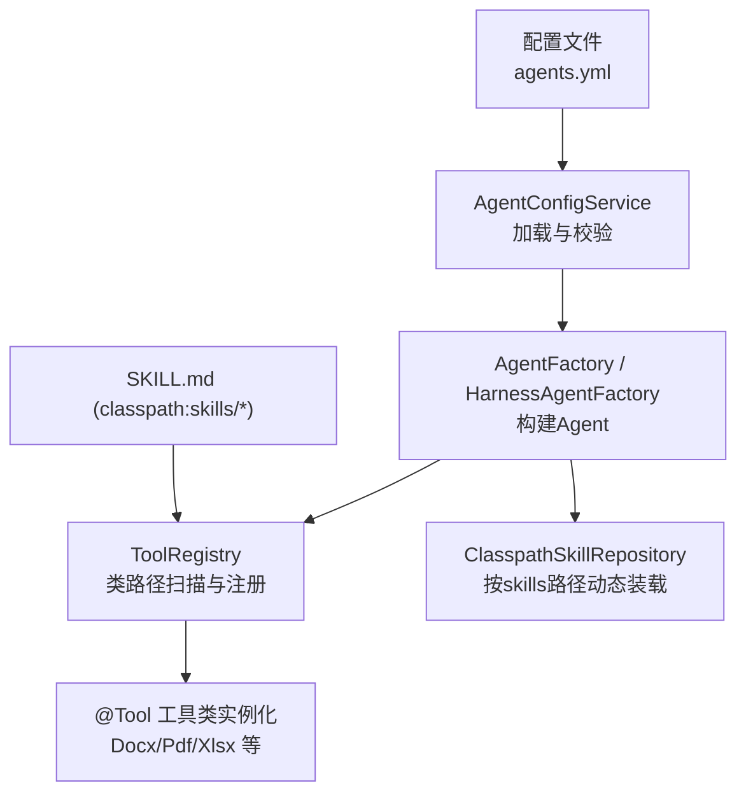
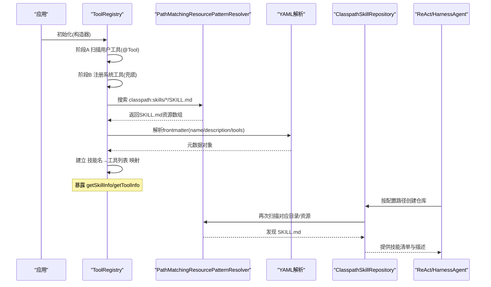
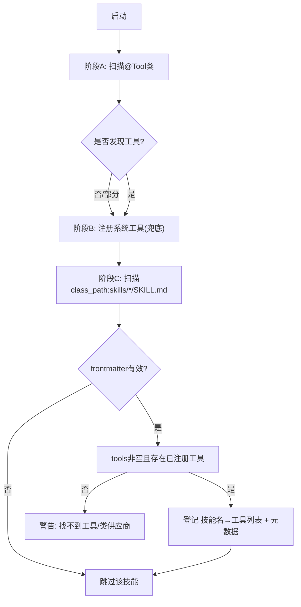
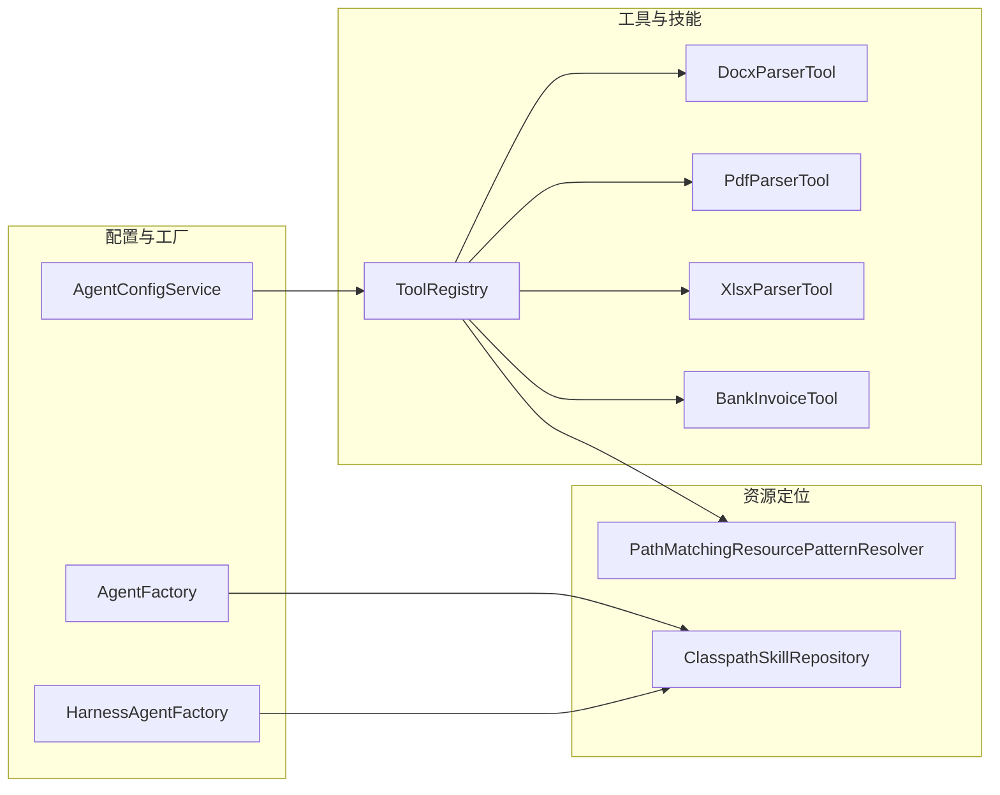

# 技能系统架构

<cite>
**本文引用的文件**
- [ToolRegistry.java](file://src/main/java/com/skloda/agentscope/tool/ToolRegistry.java)
- [AgentFactory.java](file://src/main/java/com/skloda/agentscope/agent/AgentFactory.java)
- [HarnessAgentFactory.java](file://src/main/java/com/skloda/agentscope/harness/HarnessAgentFactory.java)
- [AgentConfigService.java](file://src/main/java/com/skloda/agentscope/agent/AgentConfigService.java)
- [application.yml](file://src/main/resources/application.yml)
- [agents.yml](file://src/main/resources/config/agents.yml)
- [PdfParserTool.java](file://src/main/java/com/skloda/agentscope/tool/PdfParserTool.java)
- [DocxParserTool.java](file://src/main/java/com/skloda/agentscope/tool/DocxParserTool.java)
- [XlsxParserTool.java](file://src/main/java/com/skloda/agentscope/tool/XlsxParserTool.java)
- [BankInvoiceTool.java](file://src/main/java/com/skloda/agentscope/tool/BankInvoiceTool.java)
- [SKILL.md（docx）](file://src/main/resources/skills/docx/SKILL.md)
- [SKILL.md（pdf）](file://src/main/resources/skills/pdf/SKILL.md)
- [SKILL.md（xlsx）](file://src/main/resources/skills/xlsx/SKILL.md)
- [SKILL.md（bank_invoice_java）](file://src/main/resources/skills/bank_invoice_java/SKILL.md)
- [SKILL.md（cli-anything-agentscope）](file://skills/cli-anything-agentscope/SKILL.md)
</cite>

## 目录
1. [简介](#简介)
2. [项目结构](#项目结构)
3. [核心组件](#核心组件)
4. [架构总览](#架构总览)
5. [详细组件分析](#详细组件分析)
6. [依赖关系分析](#依赖关系分析)
7. [性能与可靠性考量](#性能与可靠性考量)
8. [故障排查指南](#故障排查指南)
9. [结论](#结论)
10. [附录：开发流程与最佳实践](#附录：开发流程与最佳实践)

## 简介
本文件面向“技能系统”的深度技术文档，聚焦如下目标：
- SKILL.md 文件格式规范：YAML frontmatter 结构与字段含义、如何组织元数据。
- 技能注册机制：基于 Spring 的类路径扫描与工具类自动发现、动态加载流程。
- 技能与工具的映射关系：一对多映射、依赖解析、版本兼容性策略。
- 技能发现机制：Spring ResourcePatternResolver 的文件扫描方式、扫描路径与缓存设计要点。
- 完整技能开发生命周期：从编写 SKILL.md 到服务注册再到 Agent/Harness 使用的端到端流程。
- 技能管理：启用禁用、版本管理思路、冲突解决策略。
- 实战：对 docx、pdf、xlsx 技能的源码级分析与扩展方法。

## 项目结构
本项目采用分层+按领域模块组织的方式：
- 工具与技能
  - 工具实现位于 tool 包下，通过 @Tool 注解暴露能力；由 ToolRegistry 统一扫描与注册。
  - 技能描述位于 resources/skills 等位置，每个技能一个子目录并以 SKILL.md 命名。
- 配置与运行时
  - agents.yml 定义 Agent 及关联的 skills/tools。
  - Application 启动时构造工具注册中心与技能映射。
  - AgentFactory/HarnessAgentFactory 负责装配 ReActAgent/HarnessAgent，并注入 ClasspathSkillRepository。
- 前端资源与模板位于 resources/static、resources/harness-templates 等目录。



图表来源
- [agents.yml:62-90](file://src/main/resources/config/agents.yml#L62-L90)
- [ToolRegistry.java:73-96](file://src/main/java/com/skloda/agentscope/tool/ToolRegistry.java#L73-L96)
- [AgentFactory.java:296-314](file://src/main/java/com/skloda/agentscope/agent/AgentFactory.java#L296-L314)
- [HarnessAgentFactory.java:192-196](file://src/main/java/com/skloda/agentscope/harness/HarnessAgentFactory.java#L192-L196)

章节来源
- [agents.yml:1-200](file://src/main/resources/config/agents.yml#L1-L200)
- [application.yml:1-12](file://src/main/resources/application.yml#L1-L12)
- [ToolRegistry.java:23-44](file://src/main/java/com/skloda/agentscope/tool/ToolRegistry.java#L23-L44)

## 核心组件
- ToolRegistry：统一负责工具类的自动发现、系统内置工具的注册、以及从 SKILL.md 中动态建立“技能名→工具列表”的映射。
- AgentConfigService：从 agents.yml 加载 Agent 配置，并基于 ToolRegistry 提供的 SkillMetadata 导出技能的名称、描述和绑定工具。
- AgentFactory / HarnessAgentFactory：根据配置创建运行时实体，并将 ClasspathSkillRepository 注入，用于在 Agent 运行时动态加载指定路径下的技能。
- 具体工具实现：PdfParserTool、DocxParserTool、XlsxParserTool、BankInvoiceTool 等，各自以 @Tool 注解暴露可被 Agent 调用的函数。

章节来源
- [ToolRegistry.java:23-44](file://src/main/java/com/skloda/agentscope/tool/ToolRegistry.java#L23-L44)
- [AgentConfigService.java:78-135](file://src/main/java/com/skloda/agentscope/agent/AgentConfigService.java#L78-L135)
- [AgentFactory.java:296-314](file://src/main/java/com/skloda/agentscope/agent/AgentFactory.java#L296-L314)
- [HarnessAgentFactory.java:192-196](file://src/main/java/com/skloda/agentscope/harness/HarnessAgentFactory.java#L192-L196)
- [PdfParserTool.java:15-72](file://src/main/java/com/skloda/agentscope/tool/PdfParserTool.java#L15-L72)
- [DocxParserTool.java:17-127](file://src/main/java/com/skloda/agentscope/tool/DocxParserTool.java#L17-L127)
- [XlsxParserTool.java:13-107](file://src/main/java/com/skloda/agentscope/tool/XlsxParserTool.java#L13-L107)

## 架构总览
技能系统在启动期完成三层工作：
1) 工具类扫描与注册：扫描 com.skloda.agentscope.tool 以及框架内置工具包，收集所有带 @Tool 的方法，建立“工具名 → 工具类键”映射。
2) 系统工具回退：若框架类路径未提供工具类，则以显式反射方式注册 ReadFileTool/WriteFileTool/ShellCommandTool 等内置工具。
3) 技能-工具映射：使用 Spring 的 PathMatchingResourcePatternResolver 扫描 classpath:skills/*/SKILL.md，解析 YAML frontmatter，将 name/description/tools 注册到全局注册表，并提供技能信息查询接口。

运行期，Agent/Harness 装配 ClasspathSkillRepository，按 agent 或 harness 配置的 skill path 加载 SKILL.md，从而实现“运行时动态挂载技能”。



图表来源
- [ToolRegistry.java:73-199](file://src/main/java/com/skloda/agentscope/tool/ToolRegistry.java#L73-L199)
- [AgentConfigService.java:78-135](file://src/main/java/com/skloda/agentscope/agent/AgentConfigService.java#L78-L135)
- [AgentFactory.java:296-314](file://src/main/java/com/skloda/agent/AgentFactory.java#L296-L314)
- [HarnessAgentFactory.java:192-196](file://src/main/java/com/skloda/agentscope/harness/HarnessAgentFactory.java#L192-L196)

章节来源
- [ToolRegistry.java:73-199](file://src/main/java/com/skloda/agentscope/tool/ToolRegistry.java#L73-L199)
- [AgentFactory.java:296-314](file://src/main/java/com/skloda/agentscope/agent/AgentFactory.java#L296-L314)
- [HarnessAgentFactory.java:192-196](file://src/main/java/com/skloda/agentscope/harness/HarnessAgentFactory.java#L192-L196)

## 详细组件分析

### 组件一：ToolRegistry（注册中心）
职责
- 阶段A：类路径扫描 com.skloda.agentscope.tool 下所有工具类，提取 @Tool 方法名，并记录“类键→工具名集合”映射。
- 阶段B：尝试扫描框架内置工具包，失败则反射注册 ReadFileTool/WriteFileTool/ShellCommandTool。
- 阶段C：扫描 resources/skills 目录下所有 SKILL.md，解析 frontmatter，建立“技能名→工具名列表”的映射，同时缓存技能描述以供查询。

数据结构
- toolToClass：工具名（含技能名）→ 类键
- classSuppliers：类键 → Supplier<Object>（支持先从 Spring 容器取 Bean，否则反射创建）
- classToTools：类键 → 工具名列表
- skillMetadataMap：技能名 → {name, description, tools}

映射规则
- 若 SKILL.md 声明的 tools 为空或缺少 name，则跳过该技能。
- 首个工具对应的 className 将被用于查找供应商实例，作为技能的“代表类”，并登记为技能可用工具列表。



图表来源
- [ToolRegistry.java:73-96](file://src/main/java/com/skloda/agentscope/tool/ToolRegistry.java#L73-L96)
- [ToolRegistry.java:125-151](file://src/main/java/com/skloda/agentscope/tool/ToolRegistry.java#L125-L151)
- [ToolRegistry.java:155-199](file://src/main/java/com/skloda/agentscope/tool/ToolRegistry.java#L155-L199)

章节来源
- [ToolRegistry.java:23-199](file://src/main/java/com/skloda/agentscope/tool/ToolRegistry.java#L23-L199)

### 组件二：SKILL.md 文件格式规范
- 位置：resources/skills/<技能名>/SKILL.md 或 harness 自定义路径下的 skills 目录。
- YAML frontmatter（必需）
  - name：字符串，技能唯一标识，必须存在。
  - description：字符串，技能用途与触发场景说明。
  - tools：字符串数组，列出该技能可调用的 @Tool 方法名（如 parse_docx）。至少一项，且需已在注册表中可用。
- Markdown 正文：人类可读的技能说明、参数、示例、注意事项等。

示例路径
- docx 技能：[SKILL.md（docx）](file://src/main/resources/skills/docx/SKILL.md)
- pdf 技能：[SKILL.md（pdf）](file://src/main/resources/skills/pdf/SKILL.md)
- xlsx 技能：[SKILL.md（xlsx）](file://src/main/resources/skills/xlsx/SKILL.md)
- bank_invoice_java 技能：[SKILL.md（bank_invoice_java）](file://src/main/resources/skills/bank_invoice_java/SKILL.md)
- 命令行技能：[SKILL.md（cli-anything-agentscope）](file://skills/cli-anything-agentscope/SKILL.md)

章节来源
- [SKILL.md（docx）](file://src/main/resources/skills/docx/SKILL.md)
- [SKILL.md（pdf）](file://src/main/resources/skills/pdf/SKILL.md)
- [SKILL.md（xlsx）](file://src/main/resources/skills/xlsx/SKILL.md)
- [SKILL.md（bank_invoice_java）](file://src/main/resources/skills/bank_invoice_java/SKILL.md)
- [SKILL.md（cli-anything-agentscope）](file://skills/cli-anything-agentscope/SKILL.md)

### 组件三：技能与工具的映射关系
- 一对多映射：一个技能可声明多个 tools，共享同一工具类（例如多个工具来自 DocxParserTool）。
- 依赖解析：注册阶段先确保工具已被注册，再建立技能-工具映射；若某个工具不存在则告警并跳过该技能。
- 版本兼容性：当前实现不引入 version 字段；可通过重命名技能名（如 v1/v2）或覆盖已有技能名进行演进，建议结合 Git 标签与发布说明。
- 运行时绑定：Agent/Harness 通过 ClasspathSkillRepository 按路径加载 SKILL.md 并对外暴露技能信息，便于 Agent 选择合适的能力。

章节来源
- [ToolRegistry.java:155-199](file://src/main/java/com/skloda/agentscope/tool/ToolRegistry.java#L155-L199)
- [AgentConfigService.java:78-135](file://src/main/java/com/skloda/agentscope/agent/AgentConfigService.java#L78-L135)
- [AgentFactory.java:296-314](file://src/main/java/com/skloda/agentscope/agent/AgentFactory.java#L296-L314)
- [HarnessAgentFactory.java:192-196](file://src/main/java/com/skloda/agentscope/harness/HarnessAgentFactory.java#L192-L196)

### 组件四：技能发现机制
- 扫描入口：PathMatchingResourcePatternResolver.getResources("classpath:skills/*/SKILL.md")。
- 文件扫描算法：基于 Spring Resource 的模式匹配，遍历 classpath 下符合 patterns 的资源；在 JAR 环境下也可正常工作（测试中验证了 JAR 内资源读取）。
- 缓存策略：ToolRegistry 维护内存中的 skillMetadataMap；ClasspathSkillRepository 内部也会缓存读取结果以避免重复 IO（实现由第三方库管理）。

章节来源
- [ToolRegistry.java:155-199](file://src/main/java/com/skloda/agentscope/tool/ToolRegistry.java#L155-L199)
- [AgentFactory.java:296-314](file://src/main/java/com/skloda/agentscope/agent/AgentFactory.java#L296-L314)
- [HarnessAgentFactory.java:192-196](file://src/main/java/com/skloda/agentscope/harness/HarnessAgentFactory.java#L192-L196)

### 组件五：从 SKILL.md 到服务注册的完整流程
步骤
1. 开发者在 resources/skills/xxx 新增 SKILL.md，声明 name/description/tools。
2. 工具类以 @Tool 注解暴露函数（或在框架工具包中已存在）。
3. 启动时 ToolRegistry 扫描并注册工具，同时注册技能-工具映射。
4. Agent/Harness 启动时通过 ClasspathSkillRepository 加载对应路径下 SKILL.md 并对外提供技能清单。
5. agents.yml 中引用技能（skills: []），并在 userTools/systemTools 中声明需要暴露的工具名以便 Agent 调用。

```mermaid
sequenceDiagram
    Dev as "开发者"
    Repo as "Skills目录"
    TR as "ToolRegistry"
    AgS as "AgentConfigService"
    AF as "AgentFactory/HarnessAgentFactory"
    UI as "Agent/前端"

    Dev->>Repo: 编写/更新SKILL.md
    Repo-->>TR: classpath:skills/*/SKILL.md
    TR->>TR: 解析frontmatter, 登记映射
    AGS->>TR: 获取技能描述与工具
    AF->>AF: 配置skillRepository
    UI->>AgS: 请求技能信息(getSkillInfo)
    AgS-->>UI: 返回{description, tools[]}
```

图表来源
- [AgentConfigService.java:78-135](file://src/main/java/com/skloda/agentscope/agent/AgentConfigService.java#L78-L135)
- [ToolRegistry.java:155-199](file://src/main/java/com/skloda/agentscope/tool/ToolRegistry.java#L155-L199)
- [AgentFactory.java:296-314](file://src/main/java/com/skloda/agentscope/agent/AgentFactory.java#L296-L314)
- [HarnessAgentFactory.java:192-196](file://src/main/java/com/skloda/agentscope/harness/HarnessAgentFactory.java#L192-L196)

章节来源
- [agents.yml:62-90](file://src/main/resources/config/agents.yml#L62-L90)
- [ToolRegistry.java:73-199](file://src/main/java/com/skloda/agentscope/tool/ToolRegistry.java#L73-L199)
- [AgentFactory.java:296-314](file://src/main/java/com/skloda/agentscope/agent/AgentFactory.java#L296-L314)

### 组件六：现有技能的源码分析与扩展

#### Docx 技能（parse_docx/edit_docx）
- 能力：读取 DOCX 全量文本（保留标题层级、表格、列表结构），并支持占位符替换生成新文件。
- 扩展点
  - 增加新的 @Tool 方法来拓展编辑能力（如段落样式处理、页眉页脚、批注等）。
  - SKILL.md 中补充工具说明与示例，便于 LLM 正确理解。
- 风险点
  - 大文档时内存占用高，建议分批处理或限制长度。
  - 格式异常输入应返回明确错误信息。

章节来源
- [DocxParserTool.java:17-127](file://src/main/java/com/skloda/agentscope/tool/DocxParserTool.java#L17-L127)
- [SKILL.md（docx）](file://src/main/resources/skills/docx/SKILL.md)

#### PDF 技能（parse_pdf）
- 能力：逐页提取文本，包含文档元信息，若内容为空则给出友好提示。
- 扩展点
  - 支持 OCR 扫描型 PDF（外部库集成）。
  - 输出结构化摘要（目录/超链接/表格）。
- 风险点
  - 超大 PDF 或加密/受保护文件可能失败，需增强错误诊断。

章节来源
- [PdfParserTool.java:15-72](file://src/main/java/com/skloda/agentscope/tool/PdfParserTool.java#L15-L72)
- [SKILL.md（pdf）](file://src/main/resources/skills/pdf/SKILL.md)

#### XLSX 技能（parse_xlsx）
- 能力：读取多 Sheet，格式化数字/日期/布尔/公式类型，生成易读文本。
- 扩展点
  - 选择性导出指定区域、列过滤、条件高亮。
  - 输出 CSV/JSON。
- 风险点
  - 海量数据行时应流式处理以避免 OOM。

章节来源
- [XlsxParserTool.java:13-107](file://src/main/java/com/skloda/agentscope/tool/XlsxParserTool.java#L13-L107)
- [SKILL.md（xlsx）](file://src/main/resources/skills/xlsx/SKILL.md)

#### 银行发票技能（generate_bank_invoice）
- 能力：基于模板生成 Excel 与 Word 发票文件，自动脱敏文件名，追加提交日期。
- 扩展点
  - 支持更多模板、字段校验、审批流。
- 风险点
  - 缺少必填字段时尽早反馈；模板路径/权限需安全校验。

章节来源
- [BankInvoiceTool.java:194-211](file://src/main/java/com/skloda/agentscope/tool/BankInvoiceTool.java#L194-L211)
- [SKILL.md（bank_invoice_java）](file://src/main/resources/skills/bank_invoice_java/SKILL.md)
- [agents.yml:92-169](file://src/main/resources/config/agents.yml#L92-L169)

## 依赖关系分析


图表来源
- [ToolRegistry.java:73-96](file://src/main/java/com/skloda/agentscope/tool/ToolRegistry.java#L73-L96)
- [AgentConfigService.java:78-135](file://src/main/java/com/skloda/agentscope/agent/AgentConfigService.java#L78-L135)
- [AgentFactory.java:296-314](file://src/main/java/com/skloda/agentscope/agent/AgentFactory.java#L296-L314)
- [HarnessAgentFactory.java:192-196](file://src/main/java/com/skloda/agentscope/harness/HarnessAgentFactory.java#L192-L196)

章节来源
- [ToolRegistry.java:73-199](file://src/main/java/com/skloda/agentscope/tool/ToolRegistry.java#L73-L199)
- [AgentConfigService.java:78-135](file://src/main/java/com/skloda/agentscope/agent/AgentConfigService.java#L78-L135)
- [AgentFactory.java:296-314](file://src/main/java/com/skloda/agentscope/agent/AgentFactory.java#L296-L314)
- [HarnessAgentFactory.java:192-196](file://src/main/java/com/skloda/agentscope/harness/HarnessAgentFactory.java#L192-L196)

## 性能与可靠性考量
- I/O 成本
  - 启动期扫描 SKILL.md 与工具类属于一次性开销；生产环境建议开启缓存或利用静态资源打包减少重复解析。
  - 大文档解析应避免全量驻留内存，必要时分块处理或使用流式 API。
- 并发与安全
  - 工具类实例可能通过 Spring Bean 复用或反射创建；对于有状态的工具需保证线程安全或每次请求新建。
  - 文件路径访问需进行安全校验，防止路径穿越与越权访问。
- 容错与可观测
  - 缺失工具或未注册技能时应有明确日志，避免静默失败。
  - 关键路径加埋点（扫描耗时、解析失败次数等），便于监控与排障。
- 可扩展性
  - 建议在未来版本为 SKILL.md 增加 version 字段，并建立向后兼容规则（如仅允许小版本变更）。

[本节为通用指导，无需代码引用]

## 故障排查指南
常见问题与建议
- 技能未被识别
  - 检查 SKILL.md 的 frontmatter 中 name 与 tools 是否为空。
  - 确认 tools 指定的 @Tool 名称已在工具注册表中可用。
  - 核对 PathMatchingResourcePatternResolver 的扫描路径是否符合 classpath:skills/*/SKILL.md。
- 工具不可用
  - 查看 ToolRegistry 启动日志中是否成功自动扫描到工具类。
  - 若依赖框架内置工具但类路径未发现，请检查相关依赖是否引入。
- Agent/Harness 未加载技能
  - 确认 AgentFactory/HarnessAgentFactory 是否正确设置 ClasspathSkillRepository 的 skill path。
  - 确认 agents.yml 或 harness 配置中 skills[] 列表是否存在。
- 大文档处理失败
  - 观察日志是否出现 OOM 或 I/O 异常。
  - 考虑限制文件大小/页数，或将解析结果转存为中间格式后再做分析。

章节来源
- [ToolRegistry.java:125-199](file://src/main/java/com/skloda/agentscope/tool/ToolRegistry.java#L125-L199)
- [AgentFactory.java:296-314](file://src/main/java/com/skloda/agentscope/agent/AgentFactory.java#L296-L314)
- [HarnessAgentFactory.java:192-196](file://src/main/java/com/skloda/agentscope/harness/HarnessAgentFactory.java#L192-L196)
- [application.yml:6-12](file://src/main/resources/application.yml#L6-L12)

## 结论
该项目构建了以 ToolRegistry 为核心的技能注册中心与以 SKILL.md 为核心的能力声明体系。通过 Spring 的类路径扫描与模式匹配，实现了对工具与技能的高内聚低耦合管理；结合 AgentFactory/HarnessAgentFactory 的 ClasspathSkillRepository，实现了运行期的动态技能装配。现有 docx/pdf/xlsx 等技能覆盖了常见办公文档场景，具备良好扩展性，可按需持续丰富能力与质量保障机制。

[本节总结性内容，无需代码引用]

## 附录：开发流程与最佳实践

### 新增一个技能的步骤
1. 编写 SKILL.md（resources/skills/<your_skill>/SKILL.md），填写 name、description、tools。
2. 在 tool 包下实现对应的工具类与方法，标注 @Tool/@ToolParam。
3. 启动项目后验证 ToolRegistry 是否成功扫描到工具和技能。
4. 在 agents.yml 中将该技能加入 skills 列表，并在 userTools/systemTools 中暴露工具名。
5. 如需在 Harness 模式下加载，请确保 HarnessConfig.skillPath 指向正确的 skills 路径。

参考文件
- [agents.yml:62-90](file://src/main/resources/config/agents.yml#L62-L90)
- [ToolRegistry.java:73-199](file://src/main/java/com/skloda/agentscope/tool/ToolRegistry.java#L73-L199)

### 技能启用/禁用策略
- 启用：在 agents.yml 或 harness 配置中加入技能名；保持 SKILL.md 与工具可用性。
- 禁用：移除 agents 配置中的技能条目，或删除/移动 SKILL.md。
- 灰度发布：建议使用命名空间前缀（如 feat/xxx、v1/xxx），逐步迁移后清理旧名称。

章节来源
- [agents.yml:62-90](file://src/main/resources/config/agents.yml#L62-L90)
- [ToolRegistry.java:155-199](file://src/main/java/com/skloda/agentscope/tool/ToolRegistry.java#L155-L199)

### 版本管理与冲突解决
- 版本建议：为 SKILL.md 增加可选的 version 字段（当前未使用），配合 Git tag 管理发布。
- 冲突解决：当两个技能提供同名工具时，以后者优先注册为准；建议通过技能名隔离工具作用域或在 SKILL.md 中限定最小可用工具集。

章节来源
- [ToolRegistry.java:155-199](file://src/main/java/com/skloda/agentscope/tool/ToolRegistry.java#L155-L199)