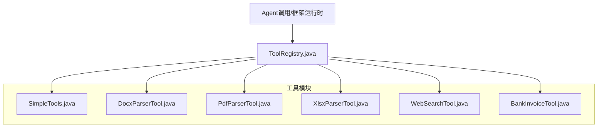
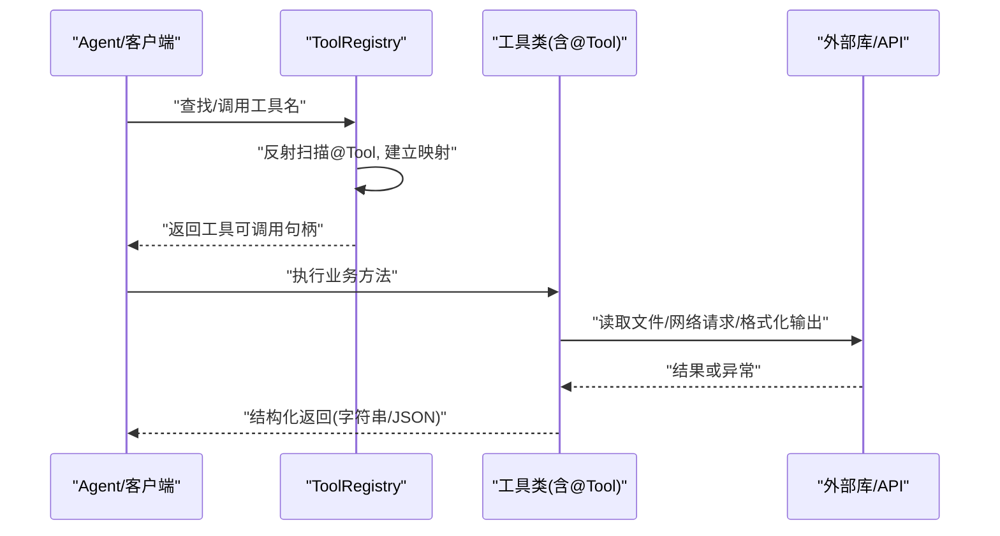
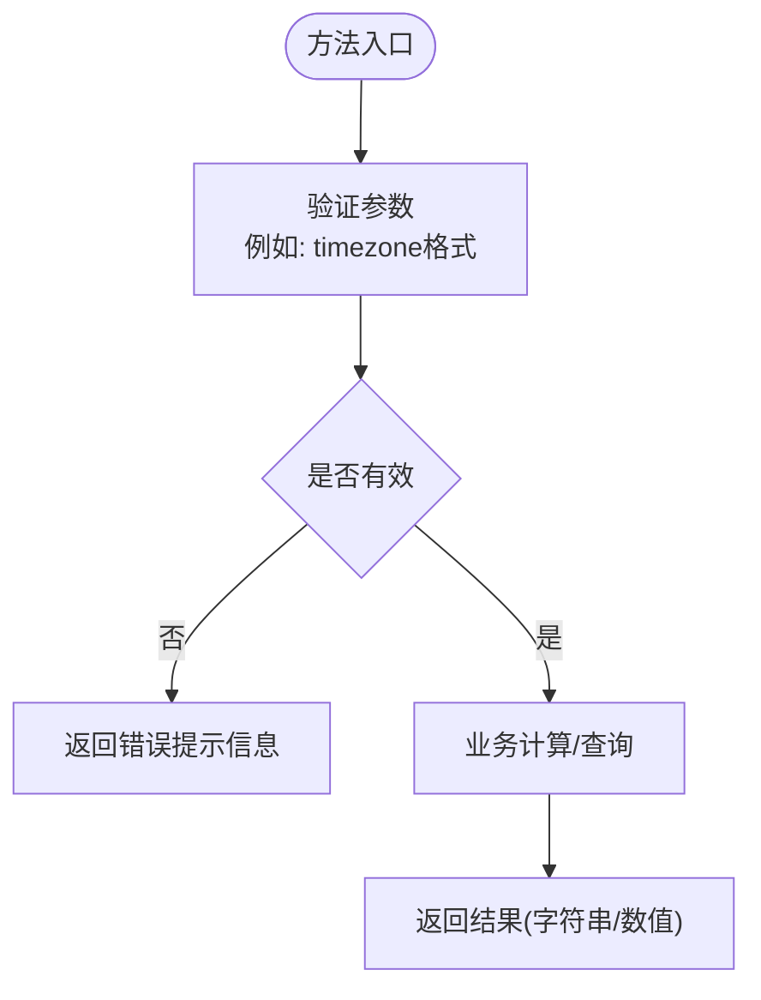
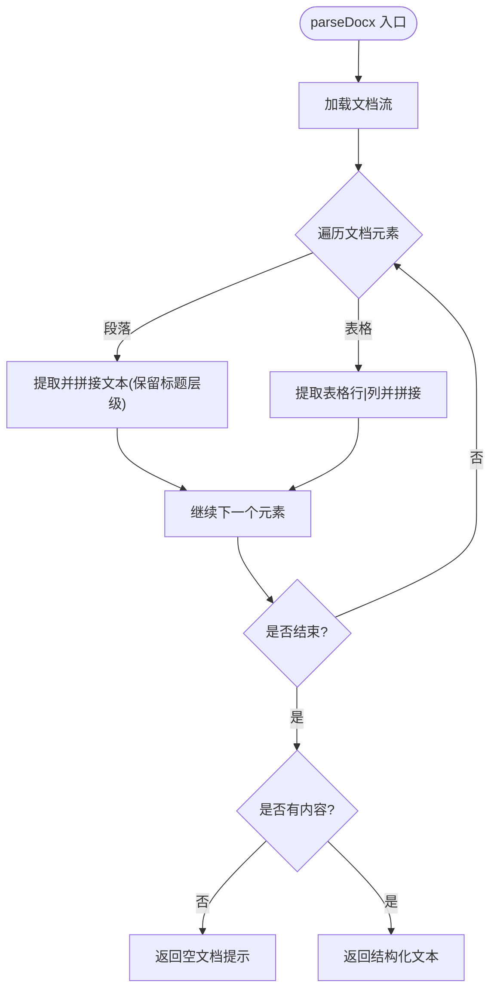
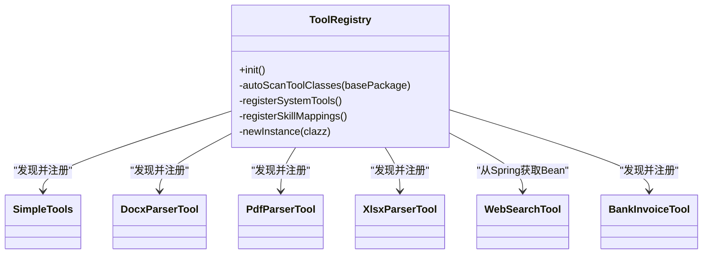

# 自定义工具开发

<cite>
**本文引用的文件**
- [SimpleTools.java](file://src/main/java/com/skloda/agentscope/tool/SimpleTools.java)
- [DocxParserTool.java](file://src/main/java/com/skloda/agentscope/tool/DocxParserTool.java)
- [PdfParserTool.java](file://src/main/java/com/skloda/agentscope/tool/PdfParserTool.java)
- [XlsxParserTool.java](file://src/main/java/com/skloda/agentscope/tool/XlsxParserTool.java)
- [WebSearchTool.java](file://src/main/java/com/skloda/agentscope/tool/WebSearchTool.java)
- [BankInvoiceTool.java](file://src/main/java/com/skloda/agentscope/tool/BankInvoiceTool.java)
- [ToolRegistry.java](file://src/main/java/com/skloda/agentscope/tool/ToolRegistry.java)
- [SimpleToolsTest.java](file://src/test/java/com/skloda/agentscope/tool/SimpleToolsTest.java)
- [DocxParserToolTest.java](file://src/test/java/com/skloda/agentscope/tool/DocxParserToolTest.java)
- [PdfParserToolTest.java](file://src/test/java/com/skloda/agentscope/tool/PdfParserToolTest.java)
- [WebSearchToolTest.java](file://src/test/java/com/skloda/agentscope/tool/WebSearchToolTest.java)
</cite>

## 目录
1. [引言](#引言)
2. [项目结构](#项目结构)
3. [核心组件](#核心组件)
4. [架构总览](#架构总览)
5. [详细组件分析](#详细组件分析)
6. [依赖关系分析](#依赖关系分析)
7. [性能注意事项](#性能注意事项)
8. [故障排查指南](#故障排查指南)
9. [结论](#结论)
10. [附录](#附录)

## 引言
本指南面向需要在 AgentScope 环境中开发与集成自定义工具的工程师，系统讲解 @Tool 与 @ToolParam 注解的使用规范、参数约定、返回值处理模式；给出从“简单计算器”到“多模态文档解析（DOCX/PDF）”的完整实现样例；涵盖异步/响应式模式（Reactive）、错误与超时处理策略；提供调试技巧（日志、异常、性能监控）与最佳实践（命名、校验、资源管理、线程安全）。所有示例与分析均基于项目现有工具代码与测试。

## 项目结构
- 工具类集中在 com.skloda.agentscope.tool 包：
  - SimpleTools：基础演示工具（时间查询、求和、天气）
  - DocxParserTool / PdfParserTool / XlsxParserTool：常见文件格式解析
  - WebSearchTool：网络搜索等对外部 API 的封装（Spring @Component）
  - BankInvoiceTool：发票生成（Excel/Word）
  - ToolRegistry：自动发现并注册 @Tool 方法，并支持通过 SKILL.md 映射动态能力

图表来源
- [ToolRegistry.java:71-96](file://src/main/java/com/skloda/agentscope/tool/ToolRegistry.java#L71-L96)
- [ToolRegistry.java:155-199](file://src/main/java/com/skloda/agentscope/tool/ToolRegistry.java#L155-L199)

章节来源
- [ToolRegistry.java:23-44](file://src/main/java/com/skloda/agentscope/tool/ToolRegistry.java#L23-L44)

## 核心组件
- @Tool 注解：标注在类方法上，暴露为可调用的工具函数，需提供 name、description，便于运行时识别与展示。
- @ToolParam 注解：标注于方法参数，定义名称、描述；用于构建参数 Schema，驱动 LLM/前端提示与校验。
- ToolRegistry：扫描 com.skloda.agentscope.tool 包中带有 @Tool 的方法，注册为可用工具；并可从 Spring 容器获取 Bean（以支持依赖注入），同时支持 SKILL.md 动态能力绑定。

章节来源
- [SimpleTools.java:12-43](file://src/main/java/com/skloda/agentscope/tool/SimpleTools.java#L12-L43)
- [ToolRegistry.java:71-121](file://src/main/java/com/skloda/agentscope/tool/ToolRegistry.java#L71-L121)

## 架构总览
下图展示了从 Agent 发起调用到具体工具执行的端到端流程，以及 ToolRegistry 的自动装配过程。

图表来源
- [ToolRegistry.java:71-96](file://src/main/java/com/skloda/agentscope/tool/ToolRegistry.java#L71-L96)
- [ToolRegistry.java:109-121](file://src/main/java/com/skloda/agentscope/tool/ToolRegistry.java#L109-L121)
- [WebSearchTool.java:30-99](file://src/main/java/com/skloda/agentscope/tool/WebSearchTool.java#L30-L99)

## 详细组件分析

### 1) 基础工具：SimpleTools（计算、时间、天气）
- 使用 @Tool 声明方法名与说明，使用 @ToolParam 为每个参数提供 name/description。
- 返回值类型以 String/double 为主，保持轻量；对异常进行内部捕获并返回友好提示（如无效时区），避免调用方崩溃。
- 适合初学者理解注解使用规范、参数传递与基础错误处理。

图表来源
- [SimpleTools.java:14-31](file://src/main/java/com/skloda/agentscope/tool/SimpleTools.java#L14-L31)

章节来源
- [SimpleTools.java:12-43](file://src/main/java/com/skloda/agentscope/tool/SimpleTools.java#L12-L43)
- [SimpleToolsTest.java:8-40](file://src/test/java/com/skloda/agentscope/tool/SimpleToolsTest.java#L8-L40)

### 2) DOCX 解析与编辑：DocxParserTool
- 目标：抽取 DOCX 文本（段落、表格、列表、标题层级），并以结构化文本形式返回；支持根据占位符替换内容并另存新文件。
- 关键点：
  - @Tool 方法 parseDocx/editDocx，参数通过 @ToolParam 描述（filePath、replacements JSON）。
  - 使用 try-with-resources 管理 IO 资源；捕获 IO 异常并返回错误信息。
  - editDocx 将 replacements 序列化为记录对象，遍历段落/表格执行替换，写入新文件并输出 JSON 结果。
- 复杂度：I/O 密集；段落与表格遍历的线性复杂度 O(N)。

图表来源
- [DocxParserTool.java:24-56](file://src/main/java/com/skloda/agentscope/tool/DocxParserTool.java#L24-L56)

章节来源
- [DocxParserTool.java:17-127](file://src/main/java/com/skloda/agentscope/tool/DocxParserTool.java#L17-L127)
- [DocxParserToolTest.java:22-89](file://src/test/java/com/skloda/agentscope/tool/DocxParserToolTest.java#L22-L89)

### 3) PDF 解析：PdfParserTool
- 目标：抽取全部页面文本，并在大页数时分页输出；当文档为空/仅图像时返回特定提示。
- 关键点：
  - 使用 PDFBox 读取元数据与文本；小页数一次性读取，超过阈值逐页读取以控制内存。
  - 统一通过字符串返回，错误路径返回“Error parsing PDF file...”前缀以便调用方区分。
- 复杂度和性能：按页面 I/O 线性扩展；分页策略降低大文档峰值内存。

章节来源
- [PdfParserTool.java:15-71](file://src/main/java/com/skloda/agentscope/tool/PdfParserTool.java#L15-L71)
- [PdfParserToolTest.java:13-38](file://src/test/java/com/skloda/agentscope/tool/PdfParserToolTest.java#L13-L38)

### 4) XLSX 解析：XlsxParserTool
- 目标：输出表格 sheet 名称、表头与每行数据（兼容数字/日期/布尔/公式）。
- 关键点：
  - 利用 DataFormatter 正确呈现单元格值；跳过空行/空单元格。
  - 采用 try-with-resources 避免资源泄露；IO 异常转为用户可读的错误消息。

章节来源
- [XlsxParserTool.java:13-106](file://src/main/java/com/skloda/agentscope/tool/XlsxParserTool.java#L13-L106)

### 5) 网络检索：WebSearchTool（含响应式阻塞桥接、参数校验）
- 目标：封装 Tavily 搜索接口，提供搜索、天气、股票、新闻等便捷工具。
- 关键点：
  - @Component 注册为 Spring Bean，便于通过 @Value 注入配置。
  - 对外部 HTTP 调用采用 Mono.fromCallable + block() 的简捷方式实现“同步语义下的线程池隔离”，并通过受调度的 boundedElastic 线程执行以避免阻塞事件循环。
  - 参数校验：query/city/symbol 为空则直接返回提示信息；limit 限制范围保护后端。
  - 统一 JSON/字符串结果，便于前端/Agent 消费；网络异常记录日志并返回错误文案。
- 注意：block() 在调度器下执行，避免主线程阻塞，但仍是同步风格的包装；如需纯异步流式，应改为直接返回 Flux/Mono。

章节来源
- [WebSearchTool.java:17-134](file://src/main/java/com/skloda/agentscope/tool/WebSearchTool.java#L17-L134)
- [WebSearchToolTest.java:7-63](file://src/test/java/com/skloda/agentscope/tool/WebSearchToolTest.java#L7-L63)

### 6) 发票生成：BankInvoiceTool
- 目标：依据模板生成 Excel 与 Word 文件；文件名包含脱敏后的姓名、日期与流水号；自动更新“提交日期”。
- 关键点：
  - 从 classpath 加载模板，写文件至系统临时目录的子文件夹；IO 使用 try-with-resources。
  - 敏感字段（姓名）脱敏规则明确，保障隐私。
  - 表格/单元格更新逻辑健壮性较好，含行数/列数边界检查与日志告警。
- 复杂性与风险：模板不可用将抛出未检测异常（ IllegalStateException ），需要上层捕获或在注册阶段做可用性校验。

章节来源
- [BankInvoiceTool.java:19-198](file://src/main/java/com/skloda/agentscope/tool/BankInvoiceTool.java#L19-L198)

## 依赖关系分析
- ToolRegistry 承担工具注册中心角色：
  - 自动扫描 com.skloda.agentscope.tool 下含 @Tool 的类，收集方法级 @Tool.name 形成映射。
  - 优先从 Spring ApplicationContext 获取 Bean（支持 @Value/@Autowired），否则反射构造。
  - 额外支持从 classpath skills/*/SKILL.md 解析 frontmatter，将 skill name → 已有 tool class 的多工具集合进行关联。

图表来源
- [ToolRegistry.java:71-121](file://src/main/java/com/skloda/agentscope/tool/ToolRegistry.java#L71-L121)
- [ToolRegistry.java:155-199](file://src/main/java/com/skloda/agentscope/tool/ToolRegistry.java#L155-L199)

章节来源
- [ToolRegistry.java:23-44](file://src/main/java/com/skloda/agentscope/tool/ToolRegistry.java#L23-L44)
- [ToolRegistry.java:71-96](file://src/main/java/com/skloda/agentscope/tool/ToolRegistry.java#L71-L96)

## 性能注意事项
- 大文档处理
  - PDF 解析采用“小文档整读，大文档分页读取”的策略，减少内存峰值。建议在更高版本中结合流式或分页增量处理进一步提升吞吐。
  - DOCX/XLSX 使用 Apache POI，遍历时尽量避免创建大量对象，复用缓冲与迭代器。
- 并发与线程
  - WebSearchTool 通过 Mono + block() 配合 boundedElastic 线程池隔离网络请求，防止阻塞主事件循环；建议在高并发场景评估线程池大小与背压策略。
- I/O 资源管理
  - 广泛使用 try-with-resources 确保文件流关闭，减少资源泄露风险。
- 序列化与格式化
  - JSON 解析尽量早失败（空列表即短路），对超长内容做截断以减少传输开销。

[本节为通用指导，无直接文件引用]

## 故障排查指南
- 常见错误定位
  - “文件不存在/无法读取”：检查传入 filePath 是否为绝对路径、文件是否存在；查看日志中的错误前缀（例如“Error parsing DOCX file:”“Error parsing PDF file:”）。
  - “模板缺失”：BankInvoiceTool 依赖 classpath 模板，若部署包未包含对应 assets，会抛出未检查异常；可在启动期增加存在性检查或更友好的失败提示。
  - “网络异常/超时”：WebSearchTool 捕获异常返回错误文案；可增加重试、超时与降级策略（例如回退到缓存或默认结果）。
- 日志与观测
  - 工具内部统一通过 SLF4J 记录关键步骤与异常堆栈；建议开启 DEBUG 级别观察详细流程。
  - 针对耗时操作，可加入入/出统计（起止时间、结果长度等）用于性能监控。
- 单测定位
  - 参考各工具类对应的 Test 类：断言成功路径、异常分支、边界条件（空输入、超大输入、非法输入等）。

章节来源
- [SimpleToolsTest.java:8-40](file://src/test/java/com/skloda/agentscope/tool/SimpleToolsTest.java#L8-L40)
- [DocxParserToolTest.java:22-89](file://src/test/java/com/skloda/agentscope/tool/DocxParserToolTest.java#L22-L89)
- [PdfParserToolTest.java:13-38](file://src/test/java/com/skloda/agentscope/tool/PdfParserToolTest.java#L13-L38)
- [WebSearchToolTest.java:7-63](file://src/test/java/com/skloda/agentscope/tool/WebSearchToolTest.java#L7-L63)

## 结论
本项目展示了如何在 AgentScope 中使用 @Tool/@ToolParam 快速定义可被 LLM/Agent 调用的能力。通过 ToolRegistry 的自动发现与 SKILL.md 映射，实现了“即插即用”的工具生态。文档解析类工具体现了对资源管理、错误恢复与用户体验（错误提示、结构化输出）的重视；WebSearchTool 展示了将 Reactive 与同步语义结合的常用模式。建议在此基础上进一步引入严格的参数校验、超时控制、可观测指标与完善的回归测试，以提升工具的可维护性与稳定性。

[本节为总结，无直接文件引用]

## 附录

### A. @Tool 与 @ToolParam 使用要点
- 注解位置：标注在类的方法上，表示一个工具能力。
- 常用属性：
  - name：唯一且具象化的标识，便于 Agent 选择调用。
  - description：说明该工具用途，帮助 Agent 理解何时调用。
- 参数约束：
  - @ToolParam(name, description)：name 用于参数键，description 用于生成参数 Schema 与提示。
  - 类型建议：基础类型与集合优先；复杂对象可转为 JSON 字符串，由工具内部反序列化。
- 返回值：
  - 推荐字符串或 JSON 字符串，便于跨语言/前后端消费；复杂对象建议使用统一的结构体/JSON。
- 错误处理：
  - 工具内统一捕获异常并转换为明确的用户可读信息；必要时附带原因摘要。
- 资源与并发：
  - 任何 I/O 必须显式关闭资源；对外部依赖（网络/文件/DB）合理设置超时与重试。
  - 同步实现需避免阻塞主线程；长耗时任务应置于专用线程池或由框架调度。

章节来源
- [SimpleTools.java:12-43](file://src/main/java/com/skloda/agentscope/tool/SimpleTools.java#L12-L43)
- [ToolRegistry.java:98-107](file://src/main/java/com/skloda/agentscope/tool/ToolRegistry.java#L98-L107)
- [ToolRegistry.java:109-121](file://src/main/java/com/skloda/agentscope/tool/ToolRegistry.java#L109-L121)

### B. 开发最佳实践清单
- 命名规范
  - name 使用动词+名词风格（如 parse_docx、get_weather），简洁明了。
  - description 聚焦“做什么”“需要什么”，减少歧义。
- 参数校验
  - 方法入口先进行基本校验（空值、格式、范围）；失败时尽早返回明确的错误提示。
- 资源管理
  - 使用 try-with-resources 保证文件/网络连接及时释放；对大文件分块处理。
- 线程与异步
  - 网络/磁盘等阻塞操作放在受控线程池；如需流式，优先考虑 Reactor（Flux/Mono）。
  - WebSearchTool 当前采用 block() + boundedElastic 的折中方案；可按需迁移到纯异步。
- 可观测性
  - 关键步骤打点日志（入参摘要、耗时、结果规模）；异常堆栈完整记录。
- 可测试性
  - 覆盖正常、边界、异常用例；对 IO 相关逻辑使用临时文件或 Mock。

[本节为通用指导，无直接文件引用]