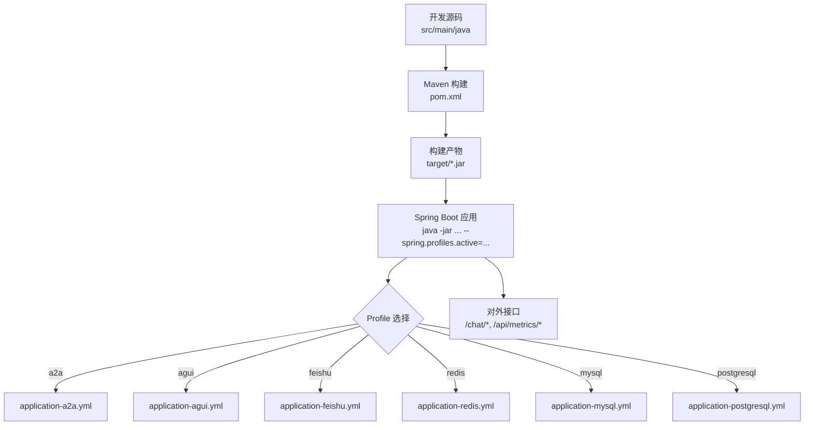
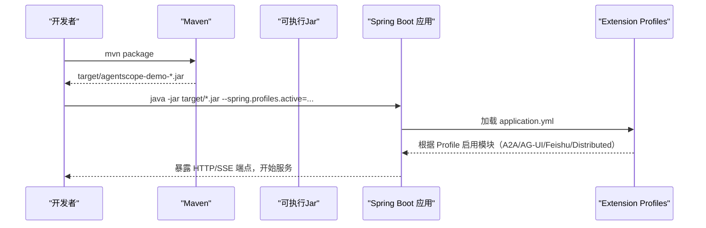
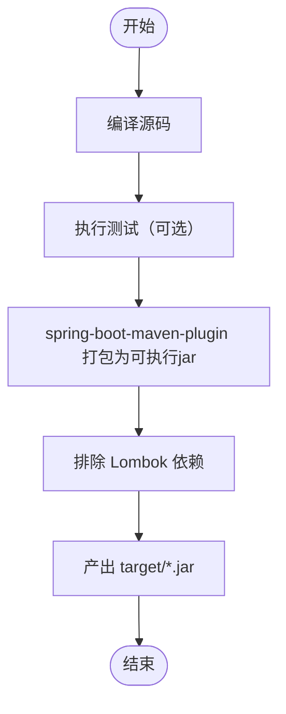
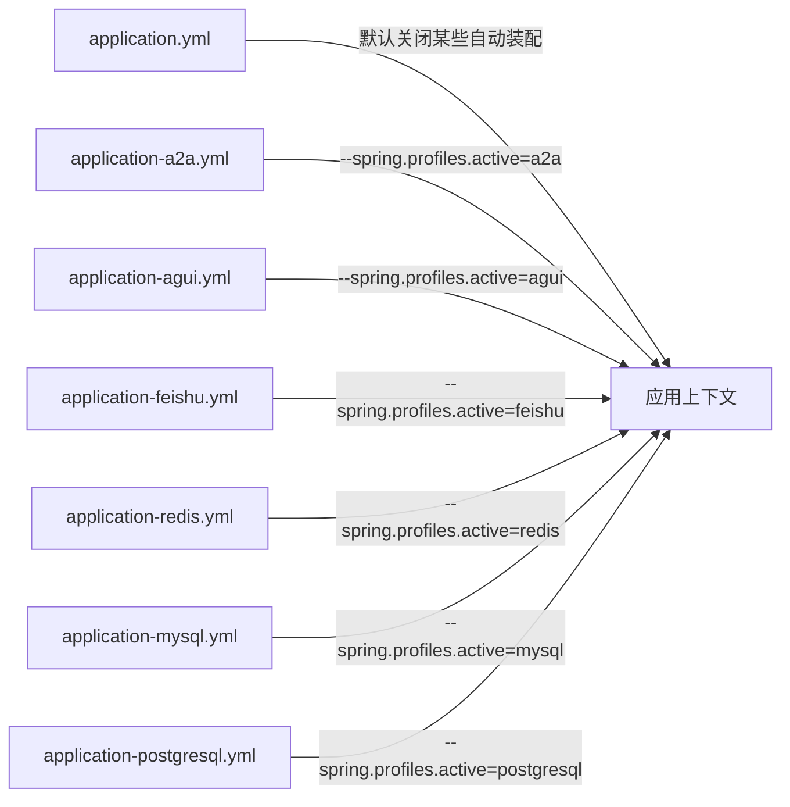
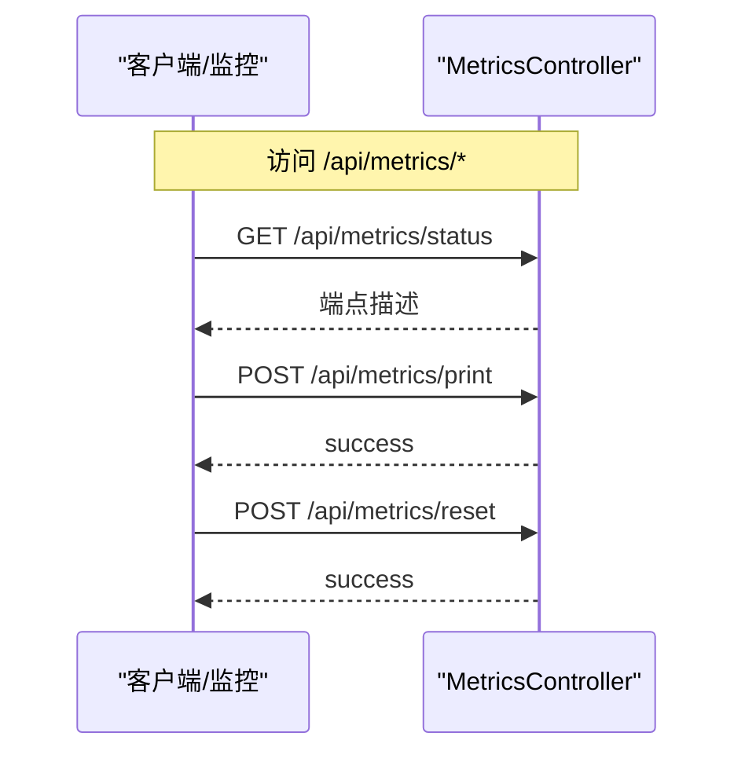
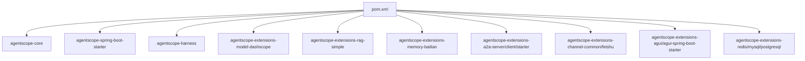

# 构建与部署

<cite>
**本文引用的文件**
- [pom.xml](file://pom.xml)
- [application.yml](file://src/main/resources/application.yml)
- [application-a2a.yml](file://src/main/resources/application-a2a.yml)
- [application-agui.yml](file://src/main/resources/application-agui.yml)
- [application-feishu.yml](file://src/main/resources/application-feishu.yml)
- [application-redis.yml](file://src/main/resources/application-redis.yml)
- [application-mysql.yml](file://src/main/resources/application-mysql.yml)
- [application-postgresql.yml](file://src/main/resources/application-postgresql.yml)
- [MetricsController.java](file://src/main/java/com/skloda/agentscope/controller/MetricsController.java)
- [README.md](file://README.md)
- [AGENTS.md](file://AGENTS.md)
- [ROADMAP.md](file://ROADMAP.md)
</cite>

## 目录
1. [简介](#简介)
2. [项目结构（构建相关）](#项目结构构建相关)
3. [核心组件（构建、配置、运行）](#核心组件构建配置运行)
4. [架构总览（构建到运行）](#架构总览构建到运行)
5. [详细组件分析](#详细组件分析)
6. [依赖分析](#依赖分析)
7. [性能考虑](#性能考虑)
8. [故障排查指南](#故障排查指南)
9. [结论](#结论)
10. [附录](#附录)

## 简介
本指南聚焦本项目的 Maven 构建、多环境配置与容器化可部署能力，覆盖从构建产物、依赖管理、多环境启动，到 Docker 镜像构建建议、环境变量管理、CI/CD 流水线实践建议、生产发布策略以及可观测性与健康检查的配置建议。项目基于 Spring Boot 3 + Java 17 + AgentScope 生态，已内置多种 profile 以启用不同能力集。

## 项目结构（构建相关）
- 构建与依赖：Maven POM 定义了父工程、Java 版本、统一版本号管理与插件编排；Spring Boot Maven Plugin 用于可执行 jar 打包。
- 多环境配置：resources 下提供 application.yml 为主配置，并通过多个 application-*.yml 通过 Spring Profile 激活功能模块（A2A、AG-UI、飞书渠道、分布式会话存储等）。
- 应用信息：入口类位于主包根路径，控制器暴露 /api/metrics 与聊天相关端点；README 与 AGENTS.md 中给出基础运行与端口等信息。

**图表来源**
- [pom.xml:190-267](file://pom.xml#L190-L267)
- [application.yml:1-90](file://src/main/resources/application.yml#L1-L90)
- [application-a2a.yml:1-28](file://src/main/resources/application-a2a.yml#L1-L28)
- [application-agui.yml:1-21](file://src/main/resources/application-agui.yml#L1-L21)
- [application-feishu.yml:1-26](file://src/main/resources/application-feishu.yml#L1-L26)
- [application-redis.yml:1-17](file://src/main/resources/application-redis.yml#L1-L17)
- [application-mysql.yml:1-18](file://src/main/resources/application-mysql.yml#L1-L18)
- [application-postgresql.yml:1-18](file://src/main/resources/application-postgresql.yml#L1-L18)

**章节来源**
- [pom.xml:1-267](file://pom.xml#L1-L267)
- [README.md:63-92](file://README.md#L63-L92)
- [AGENTS.md:170-179](file://AGENTS.md#L170-L179)

## 核心组件（构建、配置、运行）
- Maven 构建
  - 使用 spring-boot-maven-plugin 生成可执行 jar。
  - maven-compiler-plugin 固定编译器版本与注解处理器版本。
  - jacoco-maven-plugin 用于测试覆盖率（如需在 CI 集成）。
  - 依赖通过 properties 集中管理 agentscope.version，便于升级与一致性维护。
- 多环境配置
  - 默认 application.yml 关闭 DataSource 自动装配及 A2A 自动装配，保证最小化启动。
  - 各 extension/profile 通过 application-*.yml 提供，运行时通过 --spring.profiles.active 组合启用（可同时组合如 a2a,agui 等）。
  - 敏感配置通过环境变量注入，例如 DASHSCOPE_API_KEY、数据库连接信息、飞书凭据等。
- 运行方式
  - 本地开发：mvn spring-boot:run 或 java -jar。
  - 指定 Profile：--spring.profiles.active=xxx[,yyy]。
  - 端口、日志级别等通过 application.yml 或外部化配置。

**章节来源**
- [pom.xml:20-267](file://pom.xml#L20-L267)
- [application.yml:6-24](file://src/main/resources/application.yml#L6-L24)
- [application-a2a.yml:1-28](file://src/main/resources/application-a2a.yml#L1-L28)
- [application-agui.yml:1-21](file://src/main/resources/application-agui.yml#L1-L21)
- [application-feishu.yml:1-26](file://src/main/resources/application-feishu.yml#L1-L26)
- [application-redis.yml:1-17](file://src/main/resources/application-redis.yml#L1-L17)
- [application-mysql.yml:1-18](file://src/main/resources/application-mysql.yml#L1-L18)
- [application-postgresql.yml:1-18](file://src/main/resources/application-postgresql.yml#L1-L18)
- [README.md:63-92](file://README.md#L63-L92)

## 架构总览（构建到运行）
下图展示了从源码到运行期的关键阶段，包括构建、打包、依赖注入与 profile 驱动的功能开关。

**图表来源**
- [pom.xml:190-267](file://pom.xml#L190-L267)
- [application.yml:1-90](file://src/main/resources/application.yml#L1-L90)
- [application-a2a.yml:1-28](file://src/main/resources/application-a2a.yml#L1-L28)
- [application-agui.yml:1-21](file://src/main/resources/application-agui.yml#L1-L21)
- [application-feishu.yml:1-26](file://src/main/resources/application-feishu.yml#L1-L26)
- [application-redis.yml:1-17](file://src/main/resources/application-redis.yml#L1-L17)
- [application-mysql.yml:1-18](file://src/main/resources/application-mysql.yml#L1-L18)
- [application-postgresql.yml:1-18](file://src/main/resources/application-postgresql.yml#L1-L18)

## 详细组件分析

### 组件 A：Maven 构建与插件配置
- spring-boot-maven-plugin：将应用打包为可执行单文件 jar，并排除编译期 Lombok。
- maven-compiler-plugin：固定 Java 编译工具链版本与注解处理器版本，确保一致构建。
- jacoco-maven-plugin：用于生成单元测试覆盖率报告（可在 CI 集成）。
- 统一的版本管理：agentscope.version 作为常量提升可维护性。

**图表来源**
- [pom.xml:190-267](file://pom.xml#L190-L267)

**章节来源**
- [pom.xml:20-267](file://pom.xml#L20-L267)

### 组件 B：多环境配置与 Profile 体系
- 默认配置：关闭 DataSource 自动装配与 A2A 自动装配，使默认启动尽可能轻量且无需数据库。
- A2A（S12）：启用后注册 A2A 服务端，暴露 AgentCard 发现与 JSON-RPC 任务接口。
- AG-UI（S15）：启用后将 chat-basic 注册到 AG-UI 协议并可被调用。
- 飞书渠道（S14）：启用后暴露 IM webhook 回调接口。
- 分布式会话存储（S13）：支持 Redis、MySQL、PostgreSQL 三种后端，分别通过独立 profile 提供 bean，AgentFactory 会在相应 profile 激活时优先使用。

**图表来源**
- [application.yml:6-24](file://src/main/resources/application.yml#L6-L24)
- [application-a2a.yml:1-28](file://src/main/resources/application-a2a.yml#L1-L28)
- [application-agui.yml:1-21](file://src/main/resources/application-agui.yml#L1-L21)
- [application-feishu.yml:1-26](file://src/main/resources/application-feishu.yml#L1-L26)
- [application-redis.yml:1-17](file://src/main/resources/application-redis.yml#L1-L17)
- [application-mysql.yml:1-18](file://src/main/resources/application-mysql.yml#L1-L18)
- [application-postgresql.yml:1-18](file://src/main/resources/application-postgresql.yml#L1-L18)

**章节来源**
- [application.yml:1-90](file://src/main/resources/application.yml#L1-L90)
- [application-a2a.yml:1-28](file://src/main/resources/application-a2a.yml#L1-L28)
- [application-agui.yml:1-21](file://src/main/resources/application-agui.yml#L1-L21)
- [application-feishu.yml:1-26](file://src/main/resources/application-feishu.yml#L1-L26)
- [application-redis.yml:1-17](file://src/main/resources/application-redis.yml#L1-L17)
- [application-mysql.yml:1-18](file://src/main/resources/application-mysql.yml#L1-L18)
- [application-postgresql.yml:1-18](file://src/main/resources/application-postgresql.yml#L1-L18)

### 组件 C：环境变量与敏感信息管理
- 模型密钥：DASHSCOPE_API_KEY 通过系统环境变量注入，供 DashScope provider 读取。
- 飞书凭据：app-id/app-secret/verification-token/encrypt-key 通过环境变量注入。
- 数据库连接：MySQL/PostgreSQL 的 JDBC URL、用户名密码通过环境变量注入。
- 存储地址：会话持久化目录由 user.home 扩展，避免硬编码绝对路径。

**章节来源**
- [application.yml:26-80](file://src/main/resources/application.yml#L26-L80)
- [application-feishu.yml:1-26](file://src/main/resources/application-feishu.yml#L1-L26)
- [application-mysql.yml:1-18](file://src/main/resources/application-mysql.yml#L1-L18)
- [application-postgresql.yml:1-18](file://src/main/resources/application-postgresql.yml#L1-L18)

### 组件 D：监控与中间件指标端点
- /api/metrics
  - GET /api/metrics/status：返回该端点描述列表，便于自助发现。
  - POST /api/metrics/print：输出聚合指标至控制台。
  - POST /api/metrics/reset：重置所有指标。
- 日志：logging 配置项可统一控制 root 及各包日志级别。

**图表来源**
- [MetricsController.java:15-56](file://src/main/java/com/skloda/agentscope/controller/MetricsController.java#L15-L56)

**章节来源**
- [MetricsController.java:1-57](file://src/main/java/com/skloda/agentscope/controller/MetricsController.java#L1-L57)
- [application.yml:81-90](file://src/main/resources/application.yml#L81-L90)

## 依赖分析
- 版本治理：通过 <properties> 统一管理 agentscope 版本，降低升级成本。
- 扩展按需启用：S12(S12)、S13、S14、S15 等功能通过 pom.xml 引入依赖、配合 application-*.yml 与 profile 控制激活时机，减少默认启动体积与风险。
- 第三方组件：Apache POI/PDFBox 用于文档解析；ReactTest 与 SpringBootTest 用于测试。

**图表来源**
- [pom.xml:28-188](file://pom.xml#L28-L188)

**章节来源**
- [pom.xml:20-188](file://pom.xml#L20-L188)

## 性能考虑
- 资源上限：建议根据实例规格调整 JVM 堆大小与 GC 参数（-Xms/-Xmx 等），并结合容器资源限制进行调优。
- 并发与流式：应用大量采用响应式 SSE 事件流，需关注上游网关与反向代理的连接超时、缓冲设置，避免大对象阻塞。
- 文件上传：multipart 最大请求大小与文件尺寸已在默认配置设定，可按业务需要调整。
- 缓存与会话：默认使用内存态，若启用 Redis/MySQL/Postgres 则需关注外部依赖的性能与延迟。

[本节提供通用优化建议，无特定代码片段引用]

## 故障排查指南
- 启动失败：确认 DASHSCOPE_API_KEY 是否已正确注入，或按 README 指定方式传入；开启 debug 日志辅助定位。
- 功能未生效：核对 --spring.profiles.active 是否正确携带对应 profile，并确认相关依赖已引入。
- 接口不通：检查端口（默认 8081）与防火墙/安全组策略，浏览器访问根路径确认 UI 可用。
- 指标异常：调用 /api/metrics/print 观察控制台输出；必要时 /api/metrics/reset 重置指标再复测。

**章节来源**
- [README.md:63-92](file://README.md#L63-L92)
- [application.yml:81-90](file://src/main/resources/application.yml#L81-L90)
- [MetricsController.java:1-57](file://src/main/java/com/skloda/agentscope/controller/MetricsController.java#L1-L57)

## 结论
该项目采用“POM 统一管理 + Spring Profile 功能裁剪”的组合模式，实现了可配置、可扩展的构建与运行方式。结合合理的 JVM 与容器资源配置，可平滑落地到不同环境。当前实现已具备基础的可观测性与可运维能力；在更复杂的场景中，建议补齐健康检查端点（Actuator）、完善 CI/CD 流水线并与企业级配置中心集成，以提升自动化与治理水平。

[本节总结性陈述，不直接引用具体文件]

## 附录

### A. Maven 构建命令与环境
- 编译：mvn compile
- 打包：mvn package
- 运行：mvn spring-boot:run 或 java -jar
- 指定 Profile：--spring.profiles.active=a2a,agui,...（可组合）

**章节来源**
- [pom.xml:190-267](file://pom.xml#L190-L267)
- [README.md:63-92](file://README.md#L63-L92)

### B. 多环境示例
- A2A 服务端：--spring.profiles.active=a2a
- AG-UI 协议：--spring.profiles.active=agui
- 飞书 IM 回调：--spring.profiles.active=feishu
- 分布式会话存储（Redis）：--spring.profiles.active=redis
- 分布式会话存储（MySQL）：--spring.profiles.active=mysql
- 分布式会话存储（PostgreSQL）：--spring.profiles.active=postgresql

**章节来源**
- [application-a2a.yml:1-28](file://src/main/resources/application-a2a.yml#L1-L28)
- [application-agui.yml:1-21](file://src/main/resources/application-agui.yml#L1-L21)
- [application-feishu.yml:1-26](file://src/main/resources/application-feishu.yml#L1-L26)
- [application-redis.yml:1-17](file://src/main/resources/application-redis.yml#L1-L17)
- [application-mysql.yml:1-18](file://src/main/resources/application-mysql.yml#L1-L18)
- [application-postgresql.yml:1-18](file://src/main/resources/application-postgresql.yml#L1-L18)

### C. 容器化建议（无现成 Dockerfile 时的落地步骤）
由于仓库中未发现显式的 Dockerfile，建议按以下方案构造镜像：
- 使用 JDK 17 基础镜像（如 eclipse-temurin:17-jre）
- 安装 Maven 或通过多阶段构建：第一阶段构建 jar，第二阶段仅拷贝 jar 启动
- 挂载/注入环境变量：
  - DASHSCOPE_API_KEY、数据库/Redis 连接串、飞书相关 Key
- 健康检查：可基于 Actuator 添加 /actuator/health，或复用现有 /api/metrics/status 进行探活
- 资源限制：在编排层设置 CPU/内存限制，匹配 JVM 参数

[本节为通用建议，不映射具体源码文件]

### D. 环境变量清单（来自配置文件）
- 模型与服务
  - DASHSCOPE_API_KEY：DashScope 模型 API Key
- 飞书通道
  - FEISHU_APP_ID、FEISHU_APP_SECRET、FEISHU_VERIFICATION_TOKEN、FEISHU_ENCRYPT_KEY
- 分布式会话存储
  - MYSQL_URL、MYSQL_USER、MYSQL_PASSWORD
  - REDIS_URL
- 其他
  - 会话保存目录可由 ${user.home} 扩展
  - 可通过 VM 参数传递端口或其他系统属性

**章节来源**
- [application.yml:26-80](file://src/main/resources/application.yml#L26-L80)
- [application-feishu.yml:1-26](file://src/main/resources/application-feishu.yml#L1-L26)
- [application-redis.yml:1-17](file://src/main/resources/application-redis.yml#L1-L17)
- [application-mysql.yml:1-18](file://src/main/resources/application-mysql.yml#L1-L18)

### E. 对外端口与端点
- Web 端口：默认 8081
- 聊天与文件：详见项目说明
- 指标端点：/api/metrics/status、/api/metrics/print、/api/metrics/reset

**章节来源**
- [application.yml:3-5](file://src/main/resources/application.yml#L3-L5)
- [AGENTS.md:170-179](file://AGENTS.md#L170-L179)
- [MetricsController.java:15-56](file://src/main/java/com/skloda/agentscope/controller/MetricsController.java#L15-L56)

### F. 计划与现状（参考路线图）
- 路线图指出当前已集成多项扩展（A2A、Channel、AG-UI、分布式状态存储），均以 profile-gated 方式接入。
- 后续可继续补齐可观测性与生产化能力（如 Actuator 健康检查、OTel、灰度/蓝绿策略对接等）。

**章节来源**
- [ROADMAP.md:40-40](file://ROADMAP.md#L40-L40)