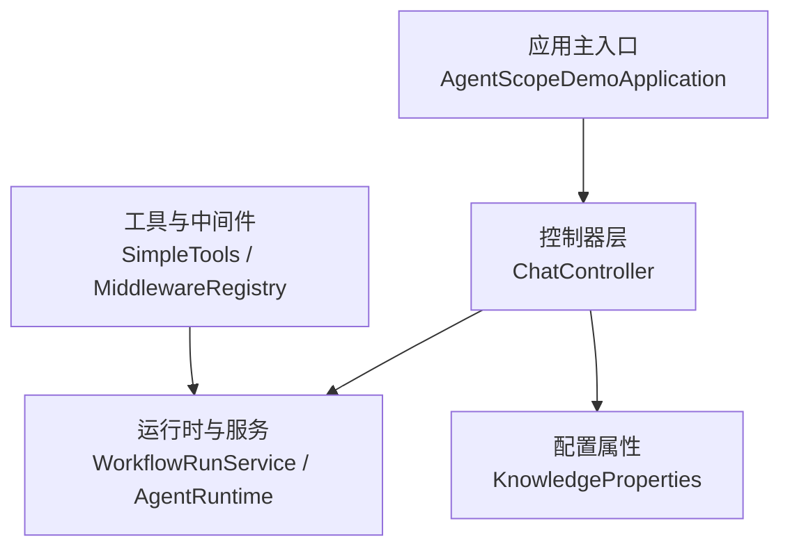
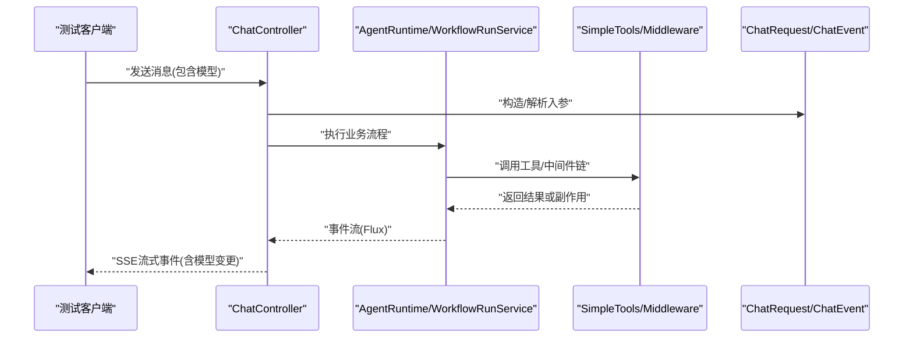

# 单元测试

<cite>
**本文引用的文件**
- [pom.xml](file://pom.xml)
- [AgentScopeDemoApplication.java](file://src/main/java/com/skloda/agentscope/AgentScopeDemoApplication.java)
- [ChatController.java](file://src/main/java/com/skloda/agentscope/controller/ChatController.java)
- [KnowledgeProperties.java](file://src/main/java/com/skloda/agentscope/service/KnowledgeProperties.java)
- [WorkflowRunService.java](file://src/main/java/com/skloda/agentscope/service/WorkflowRunService.java)
- [McpServerConfig.java](file://src/main/java/com/skloda/agentscope/mcp/McpServerConfig.java)
- [ChatRequest.java](file://src/main/java/com/skloda/agentscope/model/ChatRequest.java)
- [ChatEvent.java](file://src/main/java/com/skloda/agentscope/model/ChatEvent.java)
- [SimpleTools.java](file://src/main/java/com/skloda/agentscope/tool/SimpleTools.java)
- [ApprovalMiddleware.java](file://src/main/java/com/skloda/agentscope/middleware/ApprovalMiddleware.java)
- [MiddlewareRegistry.java](file://src/main/java/com/skloda/agentscope/middleware/MiddlewareRegistry.java)
- [OrderFulfillmentGraphTest.java](file://src/test/java/com/skloda/agentscope/composite/graph/OrderFulfillmentGraphTest.java)
- [KnowledgePropertiesTest.java](file://src/test/java/com/skloda/agentscope/service/KnowledgePropertiesTest.java)
- [WorkflowRunServiceTest.java](file://src/test/java/com/skloda/agentscope/service/WorkflowRunServiceTest.java)
- [McpServerConfigTest.java](file://src/test/java/com/skloda/agentscope/mcp/McpServerConfigTest.java)
- [ChatRequestTest.java](file://src/test/java/com/skloda/agentscope/model/ChatRequestTest.java)
- [ChatEventTest.java](file://src/test/java/com/skloda/agentscope/model/ChatEventTest.java)
- [SimpleToolsTest.java](file://src/test/java/com/skloda/agentscope/tool/SimpleToolsTest.java)
- [ApprovalMiddlewareTest.java](file://src/test/java/com/skloda/agentscope/middleware/ApprovalMiddlewareTest.java)
- [MiddlewareRegistryTest.java](file://src/test/java/com/skloda/agentscope/middleware/MiddlewareRegistryTest.java)
</cite>

## 目录
1. [简介](#简介)
2. [项目结构](#项目结构)
3. [核心组件](#核心组件)
4. [架构总览](#架构总览)
5. [详细组件分析](#详细组件分析)
6. [依赖关系分析](#依赖关系分析)
7. [性能考虑](#性能考虑)
8. [故障排查指南](#故障排查指南)
9. [结论](#结论)

## 简介
本指南聚焦于基于 JUnit 5 的单元测试最佳实践，结合本项目的实际测试代码与业务场景，系统讲解：
- JUnit 5 框架用法：@Test、断言 API（assertEquals、assertTrue 等）、测试生命周期管理。
- Mock 策略：使用 @Mock、@InjectMocks 进行依赖注入与外部服务调用模拟。
- 典型类测试示例：简单工具类、配置类、消息模型。
- 用例设计模式：边界条件、异常处理、参数验证。
- 命名约定与测试组织方式。
- 异步与并发测试策略（基于 Reactor 的流式响应）。

## 项目结构
本项目的测试位于 src/test/java 下，按功能包名映射到被测代码。核心测试依赖由 Maven 引入 Spring Boot Test 和 Reactor Test。测试组织遵循“与被测源码同包同名”的原则，便于定位与维护。

- 关键测试依赖在构建文件中声明，确保所有测试能够运行并支持 @SpringBootTest、MockMvc、Reactor 断言等能力。
- 测试资源配置文件为 application-test.yml，可在不同测试中按需覆盖默认配置。

图表来源
- [AgentScopeDemoApplication.java](file://src/main/java/com/skloda/agentscope/AgentScopeDemoApplication.java)
- [ChatController.java](file://src/main/java/com/skloda/agentscope/controller/ChatController.java)
- [WorkflowRunService.java](file://src/main/java/com/skloda/agentscope/service/WorkflowRunService.java)
- [KnowledgeProperties.java](file://src/main/java/com/skloda/agentscope/service/KnowledgeProperties.java)
- [SimpleTools.java](file://src/main/java/com/skloda/agentscope/tool/SimpleTools.java)
- [MiddlewareRegistry.java](file://src/main/java/com/skloda/agentscope/middleware/MiddlewareRegistry.java)

章节来源
- [pom.xml:175-187](file://pom.xml#L175-L187)
- [src/test/resources/application-test.yml](file://src/test/resources/application-test.yml)

## 核心组件
以下组件在本项目中具有代表性且被广泛测试，适合作为单测设计的参考对象：
- 控制器：ChatController，暴露聊天、文件上传、SSE 流等接口。
- 服务与运行时：WorkflowRunService、AgentRuntime，承载业务流程与事件驱动。
- 配置类：KnowledgeProperties，承载知识库相关配置项，适合属性校验测试。
- 工具与中间件：SimpleTools、MiddlewareRegistry，体现纯逻辑与扩展点可插拔特性，适合 Mock 与组合行为测试。
- 模型：ChatRequest、ChatEvent、MultiModalMessage，作为输入输出契约，适合边界与合法性测试。

章节来源
- [ChatController.java](file://src/main/java/com/skloda/agentscope/controller/ChatController.java)
- [WorkflowRunService.java](file://src/main/java/com/skloda/agentscope/service/WorkflowRunService.java)
- [KnowledgeProperties.java](file://src/main/java/com/skloda/agentscope/service/KnowledgeProperties.java)
- [SimpleTools.java](file://src/main/java/com/skloda/agentscope/tool/SimpleTools.java)
- [MiddlewareRegistry.java](file://src/main/java/com/skloda/agentscope/middleware/MiddlewareRegistry.java)
- [ChatRequest.java](file://src/main/java/com/skloda/agentscope/model/ChatRequest.java)
- [ChatEvent.java](file://src/main/java/com/skloda/agentscope/model/ChatEvent.java)

## 架构总览
下图展示了从请求进入到流式响应的整体链路，以及测试切入点（Mock 控制器依赖、验证输出事件、拦截器/中间件行为等）。

图表来源
- [ChatController.java](file://src/main/java/com/skloda/agentscope/controller/ChatController.java)
- [WorkflowRunService.java](file://src/main/java/com/skloda/agentscope/service/WorkflowRunService.java)
- [SimpleTools.java](file://src/main/java/com/skloda/agentscope/tool/SimpleTools.java)
- [MiddlewareRegistry.java](file://src/main/java/com/skloda/agentscope/middleware/MiddlewareRegistry.java)
- [ChatRequest.java](file://src/main/java/com/skloda/agentscope/model/ChatRequest.java)
- [ChatEvent.java](file://src/main/java/com/skloda/agentscope/model/ChatEvent.java)

## 详细组件分析

### 工具类单测：SimpleTools
- 目标：验证无外部依赖的纯函数/轻量工具方法的行为正确性。
- 方法要点：
  - 对输入边界进行测试：空字符串、空白、极限长度、特殊字符。
  - 返回值一致性：同一输入多次调用应稳定输出。
  - 失败路径：非法参数抛出预期异常时，使用 assertThrows 或 @Test(expected=...) 的方式（JUnit 5推荐前者）。
- 测试建议：
  - 每个职责拆分为独立用例，保证失败信息可读性强。
  - 复杂分支可采用表格驱动用例增强可维护性。

章节来源
- [SimpleTools.java](file://src/main/java/com/skloda/agentscope/tool/SimpleTools.java)
- [SimpleToolsTest.java](file://src/test/java/com/skloda/agentscope/tool/SimpleToolsTest.java)

### 配置类单测：KnowledgeProperties
- 目标：验证属性加载、默认值与校验规则是否符合预期。
- 方法要点：
  - 通过 @SpringBootTest + 指定 application-test.yml，隔离不同环境配置。
  - 利用 Mockito 的 @MockBean 或 @ConfigurationPropertiesTest 风格替换外部配置源。
  - 对缺失/越界/类型不匹配的配置，断言启动期或访问期行为符合预期。
- 测试建议：
  - 将属性分组拆分测试类，分别覆盖“基本项”、“高级选项”、“必填项”。
  - 使用 assertTrue/Assertions.assertTrue 验证布尔标志；assertEquals 验证具体值。

章节来源
- [KnowledgeProperties.java](file://src/main/java/com/skloda/agentscope/service/KnowledgeProperties.java)
- [KnowledgePropertiesTest.java](file://src/test/java/com/skloda/agentscope/service/KnowledgePropertiesTest.java)

### 消息模型单测：ChatRequest / ChatEvent
- 目标：确保模型的不变式、序列化/反序列化及状态转换一致。
- 方法要点：
  - 对必填字段进行 null 与空集合检测。
  - 对枚举/状态字段做合法取值与非法取值断言。
  - 对集合字段进行容量边界（0、1、大量元素）测试。
  - 如需涉及 JSON 编解码，配合 @JsonTest 或使用 Jackson 自测片段。
- 测试建议：
  - 以“用例描述+前置数据+断言”三要素组织方法名，突出意图。
  - 将公共数据抽取到测试夹具（Fixture）中减少重复。

章节来源
- [ChatRequest.java](file://src/main/java/com/skloda/agentscope/model/ChatRequest.java)
- [ChatEvent.java](file://src/main/java/com/skloda/agentscope/model/ChatEvent.java)
- [ChatRequestTest.java](file://src/test/java/com/skloda/agentscope/model/ChatRequestTest.java)
- [ChatEventTest.java](file://src/test/java/com/skloda/agentscope/model/ChatEventTest.java)

### 控制器单测（含异步/流式）：ChatController
- 目标：验证 HTTP 请求路由、请求体校验、SSE 流式事件输出。
- 方法要点：
  - 使用 Spring MVC 测试框架（MockMvc）或 WebTestClient 发起请求。
  - 对于 SSE 响应，基于 Reactor Test 的 StepVerifier 收集并断言事件序列。
  - 通过 @MockBean 将底层运行时与外部依赖替换为可控桩对象。
  - 断言错误码、错误消息结构及异常传播路径。
- 测试建议：
  - 成功路径与错误路径各至少一组。
  - 并发压力可通过多次调用并行请求观察稳定性，但需控制速率避免抖动。

章节来源
- [ChatController.java](file://src/main/java/com/skloda/agentscope/controller/ChatController.java)

### 中间件与注册表：ApprovalMiddleware 与 MiddlewareRegistry
- 目标：验证中间件的横切行为（审批、审计、限流）以及注册表的增删改查。
- 方法要点：
  - 对中间件链执行前后进行断言（如上下文是否被修改、日志是否记录）。
  - 对注册表覆盖、幂等性、并发安全（必要时加并发用例）进行验证。
  - 通过 @ExtendWith(SpringExtension.class) 与 @MockBean 配合装配 Bean。
- 测试建议：
  - 将每种中间件拆分为独立测试类，避免相互影响。
  - 用数据驱动的表驱动用例集中表达多种参数组合。

章节来源
- [ApprovalMiddleware.java](file://src/main/java/com/skloda/agentscope/middleware/ApprovalMiddleware.java)
- [MiddlewareRegistry.java](file://src/main/java/com/skloda/agentscope/middleware/MiddlewareRegistry.java)
- [ApprovalMiddlewareTest.java](file://src/test/java/com/skloda/agentscope/middleware/ApprovalMiddlewareTest.java)
- [MiddlewareRegistryTest.java](file://src/test/java/com/skloda/agentscope/middleware/MiddlewareRegistryTest.java)

### 运行时/编排：OrderFulfillmentGraph（复杂流程）
- 目标：验证状态图/工作流的状态迁移、分支路径与收敛条件。
- 方法要点：
  - 为每条关键路径编写用例，覆盖成功、回退、终止。
  - 对外部依赖进行 Mock，仅关注流转逻辑正确性。
  - 对并发执行的分支注意竞态条件与最终一致性断言。
- 测试建议：
  - 针对复杂图结构，采用可视化辅助绘制流程图以便回溯。

章节来源
- [OrderFulfillmentGraphTest.java](file://src/test/java/com/skloda/agentscope/composite/graph/OrderFulfillmentGraphTest.java)

## 依赖关系分析
- 测试依赖：
  - Spring Boot Test：提供 @SpringBootTest、MockMvc、WebTestClient、@MockBean 等。
  - Reactor Test：StepVerifier 用于断言 Flux/Mono 的事件序列与错误路径。
- 常用注解：
  - @Test：定义测试用例。
  - @Mock：创建 Mock 实例。
  - @InjectMocks：自动将 @Mock 注入被测对象构造函数/Setter。
  - @BeforeAll/@AfterAll、@BeforeEach/@AfterEach：测试生命周期管理。
  - @ParameterizedTest：数据驱动，减少重复用例。
  - @DisplayName：用例说明，提升可读性。
- 推荐实践：
  - 每个测试方法只断言一个职责，失败时能快速定位问题。
  - 通过夹具与工厂方法集中管理构造数据，保持一致性。

章节来源
- [pom.xml:175-187](file://pom.xml#L175-L187)

## 性能考虑
- 控制测试数据规模：避免在单元测试中构造过大数据集导致执行缓慢。
- Mock 耗时 IO：数据库、HTTP、文件系统调用一律使用 Mock，保持测试快速、稳定。
- 复用资源：在 @BeforeAll 中初始化只读配置或共享夹具，在 @AfterAll 中释放。
- 异步流：尽量使用 StepVerifier 的超时与顺序断言，避免睡眠等待导致不稳定。
- 并发测试：谨慎开启，优先保证确定性；确需并发场景时使用并发屏障与原子断言收集结果。

## 故障排查指南
- 测试无法启动：
  - 检查依赖是否完整，确认 Spring Boot Test 版本兼容性与 Java 版本。
  - 如遇缺少 Bean，优先用 @MockBean 替换或提供 TestConfiguration。
- 断言失败：
  - 优先打印对比期望与实际，逐步缩小范围。
  - 对复杂对象，借助比较忽略字段或自定义比较器。
- SSE/流式响应问题：
  - 使用 StepVerifier.expectNextCount、expectError、verifyComplete 等断言位置事件。
  - 注意背压与缓冲导致的时序差异，必要时调整超时与调试级别。

章节来源
- [pom.xml:175-187](file://pom.xml#L175-L187)

## 结论
- 以“小而专注”的单元测试为核心，配合 Mock 与数据驱动，能够稳定地保障工具、配置、模型与控制器等组件的正确性。
- 对基于 Reactor 的流式 API，统一采用 StepVerifier 进行事件与错误断言，既简洁又强约束。
- 良好的命名与组织结构是长期维护的关键：用例描述清晰、断言明确、夹具复用充分。