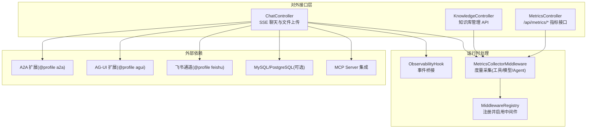
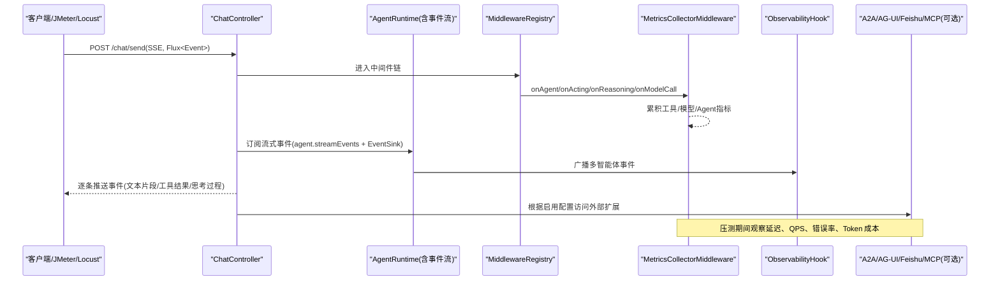
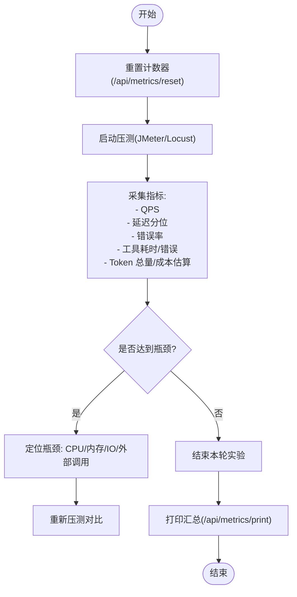

# 性能测试

<cite>
**本文引用的文件**
- [pom.xml](file://pom.xml)
- [README.md](file://README.md)
- [AgentScopeDemoApplication.java](file://src/main/java/com/skloda/agentscope/AgentScopeDemoApplication.java)
- [application.yml](file://src/main/resources/application.yml)
- [application-mysql.yml](file://src/main/resources/application-mysql.yml)
- [application-postgresql.yml](file://src/main/resources/application-postgresql.yml)
- [application-a2a.yml](file://src/main/resources/application-a2a.yml)
- [application-agui.yml](file://src/main/resources/application-agui.yml)
- [application-feishu.yml](file://src/main/resources/application-feishu.yml)
- [MetricsCollectorMiddleware.java](file://src/main/java/com/skloda/agentscope/middleware/MetricsCollectorMiddleware.java)
- [MetricsController.java](file://src/main/java/com/skloda/agentscope/controller/MetricsController.java)
- [ObservabilityHook.java](file://src/main/java/com/skloda/agentscope/hook/ObservabilityHook.java)
- [MiddlewareRegistry.java](file://src/main/java/com/skloda/agentscope/middleware/MiddlewareRegistry.java)
- [ChatController.java](file://src/main/java/com/skloda/agentscope/controller/ChatController.java)
- [KnowledgeController.java](file://src/main/java/com/skloda/agentscope/controller/KnowledgeController.java)
- [ToolRegistry.java](file://src/main/java/com/skloda/agentscope/tool/ToolRegistry.java)
- [McpClientService.java](file://src/main/java/com/skloda/agentscope/mcp/McpClientService.java)
- [RateLimitMiddleware.java](file://src/main/java/com/skloda/agentscope/middleware/RateLimitMiddleware.java)
</cite>

## 目录
1. [简介](#简介)
2. [项目结构（与性能测试相关）](#项目结构与性能测试相关)
3. [核心组件](#核心组件)
4. [架构总览](#架构总览)
5. [详细组件分析](#详细组件分析)
6. [依赖关系分析](#依赖关系分析)
7. [性能考虑](#性能考虑)
8. [故障排查指南](#故障排查指南)
9. [结论](#结论)
10. [附录：压测实战脚本与实践清单](#附录压测实战脚本与实践清单)

## 简介
本指南面向在 AgentScope Demo 应用上进行性能与稳定性验证的工程团队，聚焦如下目标：
- 明确压力测试工具（Apache JMeter、Locust 等）在该项目中的使用方法与注意事项。
- 给出负载测试策略：并发建模、渐进加压、长稳试验设计与执行要点。
- 建立关键接口的性能基准对比与回归检测流程。
- 覆盖内存性能：内存泄漏检测、GC 行为分析与资源使用监控。
- 提供指标采集方案：应用内中间件指标、系统级指标、业务指标的收集与上报路径。
- 输出基于测试结果的性能优化建议与调优实践。

该文档既可作为快速上手手册，也可作为团队统一执行规范参考。

## 项目结构（与性能测试相关）
从工程视角看，以下位置对性能测试最相关：
- HTTP 入口与流式响应：控制器（如 /chat/send 的 SSE 接口），影响吞吐与延迟基线。
- 指标聚合中间件：内置 MetricsCollectorMiddleware，可统计模型调用、工具调用耗时、错误率与估算成本。
- 指标查询端点：/api/metrics/* 暴露打印与重置能力，便于压测前后对比。
- 可观测钩子：ObservabilityHook 桥接事件输出，利于前端或后端消费多智能体生命周期事件。
- 配置中心：application*.yml 统一控制日志等级、服务端口等，是压测环境一致性保障的关键。

图表来源
- [ChatController.java](file://src/main/java/com/skloda/agentscope/controller/ChatController.java)
- [KnowledgeController.java](file://src/main/java/com/skloda/agentscope/controller/KnowledgeController.java)
- [MetricsController.java](file://src/main/java/com/skloda/agentscope/controller/MetricsController.java)
- [ObservabilityHook.java](file://src/main/java/com/skloda/agentscope/hook/ObservabilityHook.java)
- [MiddlewareRegistry.java](file://src/main/java/com/skloda/agentscope/middleware/MiddlewareRegistry.java)
- [application.yml](file://src/main/resources/application.yml)

章节来源
- [application.yml:1-24](file://src/main/resources/application.yml#L1-L24)
- [application.yml:81-90](file://src/main/resources/application.yml#L81-L90)

## 核心组件
- 指标采集中间件：按工具粒度记录调用次数、平均/最小/最大耗时、错误次数；按 Agent 维度汇总时长；追踪 LLM 用量并估算成本。
- 指标管理控制器：提供 /api/metrics/print 打印汇总日志；/api/metrics/reset 清零计数器；/api/metrics/status 列出可用接口。
- 事件可观测钩子：封装管道、路由、交接、循环、图状态转移、圆桌等多种多智能体事件的发射器，为压测时的事件回放与可视化提供基础。
- 请求限流中间件：用于保护后端不被突发流量击垮，在压测中常配合“阶梯式”或“限制并发”策略使用。

章节来源
- [MetricsCollectorMiddleware.java:21-90](file://src/main/java/com/skloda/agentscope/middleware/MetricsCollectorMiddleware.java#L21-L90)
- [MetricsController.java:15-57](file://src/main/java/com/skloda/agentscope/controller/MetricsController.java#L15-L57)
- [ObservabilityHook.java:16-67](file://src/main/java/com/skloda/agentscope/hook/ObservabilityHook.java#L16-L67)
- [RateLimitMiddleware.java](file://src/main/java/com/skloda/agentscope/middleware/RateLimitMiddleware.java)

## 架构总览
下图展示了在压测场景下，一次典型聊天请求的调用链与各性能观测点在系统中的分布。

图表来源
- [ChatController.java](file://src/main/java/com/skloda/agentscope/controller/ChatController.java)
- [MiddlewareRegistry.java](file://src/main/java/com/skloda/agentscope/middleware/MiddlewareRegistry.java)
- [MetricsCollectorMiddleware.java:50-162](file://src/main/java/com/skloda/agentscope/middleware/MetricsCollectorMiddleware.java#L50-L162)
- [ObservabilityHook.java:45-67](file://src/main/java/com/skloda/agentscope/hook/ObservabilityHook.java#L45-L67)

## 详细组件分析

### 指标采集与暴露（MetricsCollectorMiddleware + MetricsController）
- 关键能力
  - 在 onAgent 阶段记录 Agent 级别总时长、调用次数。
  - 在 onActing 阶段记录工具调用次数、平均/最小/最大耗时与错误计数。
  - 在 onModelCall 阶段累计 Token 用量，并据此估算费用。
  - 在 /api/metrics/* 暴露查询、重置接口，支持压测前后归零与快照打印。
- 压测用途
  - 以单次 /chat/send 为原子单元，拉通 QPS、P95/P99 延迟、错误率、Token 总量及成本估算。
  - 结合不同 agentId 切换，进行“单 Agent”与“多 Agent 协作”模式下的吞吐差异对比。
  - 通过 reset 做断点式统计，便于分段报告。

图表来源
- [MetricsController.java:22-41](file://src/main/java/com/skloda/agentscope/controller/MetricsController.java#L22-L41)
- [MetricsCollectorMiddleware.java:187-240](file://src/main/java/com/skloda/agentscope/middleware/MetricsCollectorMiddleware.java#L187-L240)

章节来源
- [MetricsCollectorMiddleware.java:31-162](file://src/main/java/com/skloda/agentscope/middleware/MetricsCollectorMiddleware.java#L31-L162)
- [MetricsController.java:15-57](file://src/main/java/com/skloda/agentscope/controller/MetricsController.java#L15-L57)

### 多智能体事件可观测性（ObservabilityHook）
- 作用：将 Pipeline、Routing、Handoff、Loop、Graph、Task 等多类事件集中发射，便于压测阶段回溯链路细节与事件时序。
- 压测用途：在多 Agent 场景中，用以评估各阶段耗时占比与事件风暴风险，辅助判断并行/串行策略对吞吐与延迟的影响。

章节来源
- [ObservabilityHook.java:16-67](file://src/main/java/com/skloda/agentscope/hook/ObservabilityHook.java#L16-L67)

### 控制器与外部扩展接入点
- ChatController：SSE 流式对话与文件上传的主入口，压测中常作为主要被测端点。
- KnowledgeController：知识检索/入库等接口，适合做独立基准对比与回归检测。
- 外部扩展（A2A/AG-UI/Feishu/MCP）：按 profile 启停，可在不同组合下评估网络与协议开销。

章节来源
- [ChatController.java](file://src/main/java/com/skloda/agentscope/controller/ChatController.java)
- [KnowledgeController.java](file://src/main/java/com/skloda/agentscope/controller/KnowledgeController.java)
- [application.yml:16-24](file://src/main/resources/application.yml#L16-L24)

## 依赖关系分析
- 中间件注册：通过 MiddlewareRegistry 动态注册，包括 metrics-collector 等关键中间件。
- 数据源与环境：默认不启用 DataSource；通过 MySQL/PostgreSQL profile 可选启用，从而评估持久化层对端到端延迟的影响。
- 日志与可观测：application.yml 中为 METRICS 日志设定级别，保证指标输出与系统日志同机可读。

章节来源
- [MiddlewareRegistry.java](file://src/main/java/com/skloda/agentscope/middleware/MiddlewareRegistry.java)
- [application-mysql.yml:14-18](file://src/main/resources/application-mysql.yml#L14-L18)
- [application-postgresql.yml:15-19](file://src/main/resources/application-postgresql.yml#L15-L19)
- [application.yml:81-90](file://src/main/resources/application.yml#L81-L90)

## 性能考虑

### 负载测试策略
- 多用户并发访问
  - 以 /chat/send 为主被测接口，按用户会话（不同 sessionId/agentId）构造请求集合，避免共享状态放大干扰。
  - 合理设置线程池与会话复用，使压测工具侧尽量贴近真实网络形态。
- 渐进式增加负载
  - Ramp-up：逐步提高并发数，观察 P95/P99 延迟、错误率拐点。
  - 稳定态：在拐点附近持续运行一定时间（如 10-20 分钟），评估长期抖动。
- 长时间稳定性测试
  - 使用较低并发进行 4-8 小时甚至更久运行，关注内存、线程、FD/GC 趋势，识别慢泄漏与资源耗尽。
- 混合场景
  - 将聊天、知识库检索、文件上传三类请求按业务比例混合，体现真实生产的工作负载画像。

提示：
- 借助 /api/metrics/reset 在每个阶段前归零指标，以获得无偏的段间对比。
- 使用不同 agentId 组合，对比单 Agent、路由、流水线等模式的性能特征。

### 性能基准与回归检测
- 关键接口
  - /chat/send：SSE 流式接口，是性能基线核心。
  - /knowledge/*：知识检索与索引维护。
  - /ag-ui/run 与 /channel/feishu/webhook：按需启用时的额外负载路径。
- 回归检测
  - 定义阈值：例如 P95 ≤ x ms、错误率 ≤ y%、每分钟 Token ≤ z。
  - 将上述阈值加入 CI（例如使用 JUnit 的断言或压测后的自动化校验脚本），防止性能退化逃逸。
- 趋势分析
  - 收集每轮压测结果与指标快照（包含 Token、成本、错误率、耗时分布），绘制趋势图；异常波动即触发告警。

### 内存性能与 GC
- 内存泄漏检测
  - 开启堆转储与元空间分析，观察大对象、缓存增长趋势；重点关注本地内存、临时 IO 缓冲区。
- GC 行为分析
  - 调整 JVM 参数（垃圾收集器、年轻/老年代大小、晋升阈值），以 GC 停顿和回收频率为优化目标。
- 资源使用监控
  - 压测期同步采集 CPU、线程数、FD、网络 I/O、JVM 内存池、GC 曲线与指标日志，形成多维对比视图。

### 监控指标体系
- 应用指标
  - 工具调用次数、平均/最小/最大耗时、错误次数。
  - Agent 维度调用次数、总时长、延迟分位。
  - LLM 用量（Tokens）与成本估算。
- 系统指标
  - CPU、内存、磁盘 I/O、网络 I/O、上下文切换、FD、线程数。
- 业务指标
  - 会话数、每会话消息数、文件上传成功率、知识索引任务完成数。

章节来源
- [MetricsCollectorMiddleware.java:36-50](file://src/main/java/com/skloda/agentscope/middleware/MetricsCollectorMiddleware.java#L36-L50)
- [MetricsCollectorMiddleware.java:61-90](file://src/main/java/com/skloda/agentscope/middleware/MetricsCollectorMiddleware.java#L61-L90)
- [MetricsCollectorMiddleware.java:144-162](file://src/main/java/com/skloda/agentscope/middleware/MetricsCollectorMiddleware.java#L144-L162)
- [MetricsController.java:22-41](file://src/main/java/com/skloda/agentscope/controller/MetricsController.java#L22-L41)

### 性能优化建议与调优实践
- 架构层
  - 合理拆分长链路：将复杂多 Agent 协作拆分为短步骤或异步批处理，降低单次请求延迟。
  - 使用中间件做降级/短路：超时、熔断、限流（RateLimitMiddleware）组合，提升弹性。
- 代码层
  - 减少字符串拼接与大对象创建；复用解析器实例；批量 IO。
  - 限制上下文长度（context/window），控制输入规模。
- 依赖层
  - 外部工具（PDF/Word/XLSX 解析）、向量检索、远程模型调用，均可能成为瓶颈，建议缓存热点、合并请求。
- 运行时
  - 针对高吞吐场景适当增大线程池、连接池与工作目录；针对延迟敏感场景缩短超时与重试上限。
  - 合理配置 logging 级别与采样，避免日志成为 IO 瓶颈。

[本节为通用指导，不直接分析具体文件]

## 故障排查指南
- 现象：延迟飙升或 QPS 上不去
  - 使用 /api/metrics/print 获取当前汇总，重点检查工具耗时、错误数突增；必要时执行 /api/metrics/reset 后复现。
- 现象：错误率升高
  - 关注外部依赖（A2A/AG-UI/Feishu/MCP）与数据库（若启用 mysql/postgresql），比对各自日志级别与错误码。
- 现象：内存持续增长
  - 抓取堆转储，定位超大对象或泄漏点；结合 GC 日志分析回收效率，调整 JVM 参数。

章节来源
- [MetricsController.java:22-41](file://src/main/java/com/skloda/agentscope/controller/MetricsController.java#L22-L41)
- [application-mysql.yml:14-18](file://src/main/resources/application-mysql.yml#L14-L18)
- [application-postgresql.yml:15-19](file://src/main/resources/application-postgresql.yml#L15-L19)

## 结论
本指南结合项目内置的指标采集与可观测能力，给出了从负载建模、压测执行到回归检测与趋势分析的完整闭环方法。依托 /api/metrics/* 与 ObservabilityHook，团队可以在不侵入业务的前提下，完成对 chat/knowledge/ag-ui/feishu 等路径的多维性能评估，并形成持续的优化与回归机制。

## 附录：压测实战脚本与实践清单

### Apache JMeter 实践要点
- 计划设计
  - 场景：单 Agent 聊天、多 Agent 协作、知识库检索、文件上传。
  - 负荷：逐步加压（Ramp-Up）、稳定态（Hold Steady）、衰减（Tear-Down）。
  - 断言：响应码 2xx、关键字匹配、SSE 首包时间。
- 配置要点
  - 线程组：并发度、Ramp-Up 周期、循环次数。
  - 前置处理器：生成唯一 sessionId/userId 等变量；读取配置中的 API Key（注意数据安全）。
  - 监听器：Summary/View Results Tree（调试）+ CSV 聚合（生产用）。
- 报告口径
  - 记录 QPS、TPS、P90/P95/P99、错误率、失败样本详情。
  - 同步导出 /api/metrics/print 的汇总，形成压测前后对比。

### Locust 实践要点
- 需求说明
  - 以 Python 脚本描述用户行为，支持分布式负载。
  - 可对 /chat/send 发起 SSE 请求（建议使用异步客户端或专用 SSE 库），并在断开后重试。
- 场景编写
  - 用户流程：登录/选择 Agent → 发送消息 → 处理流事件 → 结束。
  - 统计：自定义 TaskSet 中的时间、错误与业务指标。
- 发布与报告
  - 通过 Web UI 或导出 CSV 进行横向对比；结合 /api/metrics/reset 做阶段隔离。

### 压测环境与参数基线
- 服务器规格、JVM 参数（G1/ZGC）、线程池大小、文件大小限制（multipart）、DB 配置（如启用）等需在测试报告中固化。
- 环境变量：API Key、Model Name、Streaming/Thinking 开关等，确保多次压测一致性。

章节来源
- [application.yml:1-24](file://src/main/resources/application.yml#L1-L24)
- [application.yml:81-90](file://src/main/resources/application.yml#L81-L90)

### 基准测试与回归检测模板
- 基准集
  - 标准 Prompt 集：简单问答、工具调用、多模态理解、RAG 问答、文件解析。
  - 固定负载模板：N 并发 × T 分钟 × 比例混合。
- 回归规则
  - 阈值：P95 ≤ 基线 × 系数；错误率 ≤ 阈值；成本/Token 增长率可控。
  - 自动化：在 CI 中集成 JMeter/Locust 执行与断言，不达标即阻断。
- 趋势分析
  - 指标看板：延迟分位、错误率、Token/成本、工具耗时 Top N，形成时间序列视图。

[本节为通用指导，不直接分析具体文件]

### 监控落地清单
- 启动期
  - 确认服务端口与 profile 配置；验证 /api/metrics/status 可达。
- 压测期
  - 同步采集系统指标、JVM 指标、日志（包含 METRICS）与接口指标。
- 结束后
  - 导出最终快照，整理对比，定位问题并归档。

[本节为通用指导，不直接分析具体文件]