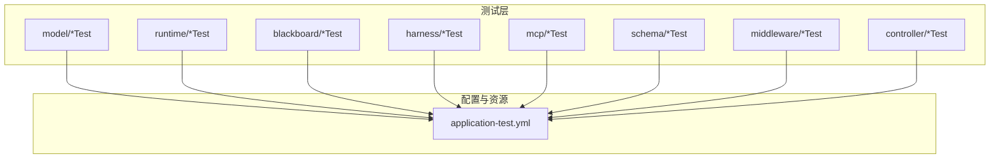
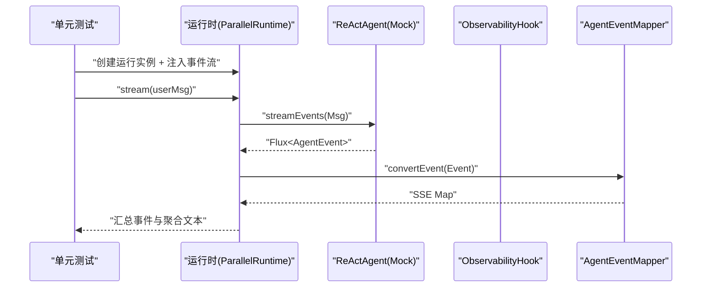
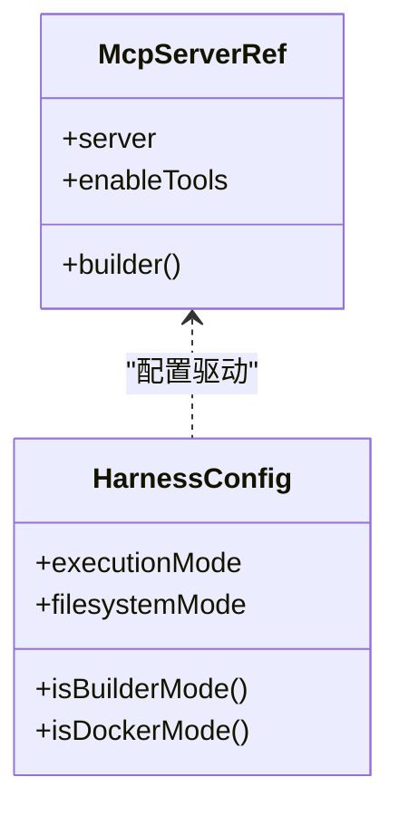
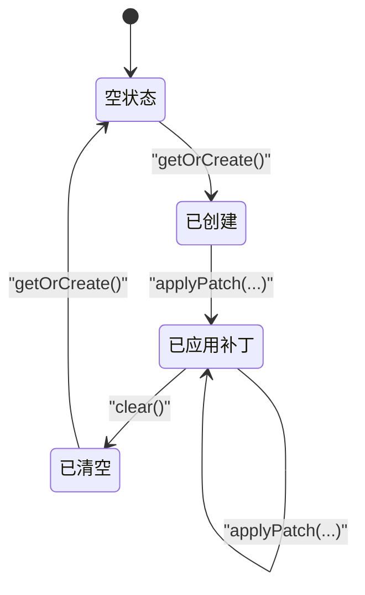
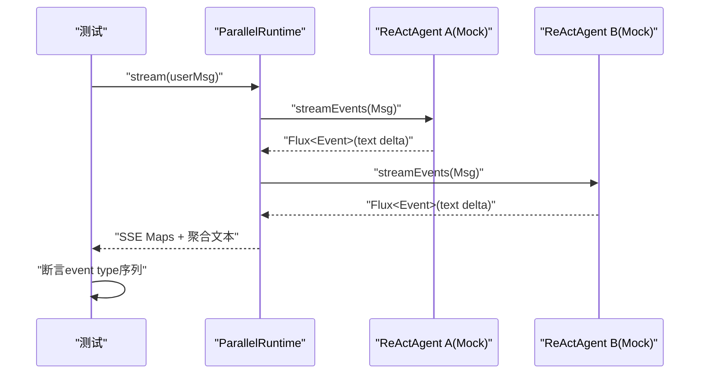
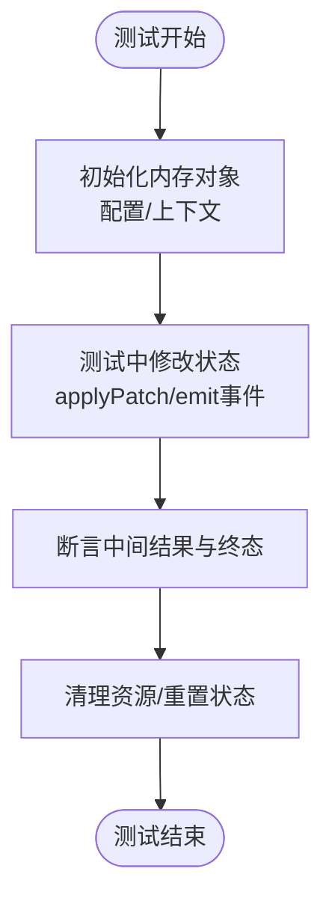
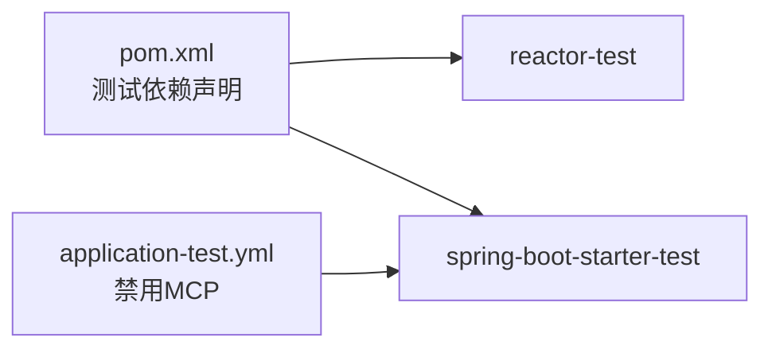

# 内存测试数据

<cite>
**本文引用的文件**
- [ChatRequestTest.java](file://src/test/java/com/skloda/agentscope/model/ChatRequestTest.java)
- [HarnessRuntimeTest.java](file://src/test/java/com/skloda/agentscope/harness/HarnessRuntimeTest.java)
- [BlackboardServiceTest.java](file://src/test/java/com/skloda/agentscope/blackboard/BlackboardServiceTest.java)
- [ParallelRuntimeTest.java](file://src/test/java/com/skloda/agentscope/runtime/ParallelRuntimeTest.java)
- [StructuredOutputAgentRuntimeTest.java](file://src/test/java/com/skloda/agentscope/runtime/StructuredOutputAgentRuntimeTest.java)
- [RateLimitMiddlewareTest.java](file://src/test/java/com/skloda/agentscope/middleware/RateLimitMiddlewareTest.java)
- [OrderFulfillmentGraphTest.java](file://src/test/java/com/skloda/agentscope/composite/graph/OrderFulfillmentGraphTest.java)
- [McpServerRefTest.java](file://src/test/java/com/skloda/agentscope/mcp/McpServerRefTest.java)
- [HarnessConfig.java](file://src/main/java/com/skloda/agentscope/agent/HarnessConfig.java)
- [ChatRequest.java](file://src/main/java/com/skloda/agentscope/model/ChatRequest.java)
- [InvoiceData.java](file://src/main/java/com/skloda/agentscope/schema/InvoiceData.java)
- [application-test.yml](file://src/test/resources/application-test.yml)
- [pom.xml](file://pom.xml)
</cite>

## 目录
1. [简介](#简介)
2. [项目结构](#项目结构)
3. [核心组件](#核心组件)
4. [架构总览](#架构总览)
5. [详细组件分析](#详细组件分析)
6. [依赖分析](#依赖分析)
7. [性能考量](#性能考量)
8. [故障排查指南](#故障排查指南)
9. [结论](#结论)
10. [附录](#附录)

## 简介
本文件聚焦本仓库中的“内存测试数据”体系，围绕以下目标给出系统化说明与可操作指导：
- 内存对象构建：使用建造者模式构建复杂配置、在测试中采用Mock隔离外部依赖、以状态机用例覆盖关键流转。
- 测试工具类设计：封装单元测试助手、数据生成器、工厂方法以提升可读性与复用度。
- 异步数据测试：针对Reactor流（Flux/Mono）的测试数据构造与事件流断言、并发场景下的内存一致性验证。
- 序列化测试：基于JSON/XML的场景化校验、格式约束与版本兼容性策略。
- 基准与性能：内存占用测量、GC压力与大数据对象处理测试思路。
- 生命周期管理：测试前初始化、测试中变更、测试后清理的统一方案。

上述内容均以仓库现有测试实践为依据进行总结与提炼，便于团队在新增或改造测试时保持一致的工程风格与质量基线。

## 项目结构
从测试目录看，测试按功能域划分：agent、blackboard、harness、controller、runtime、middleware、mcp、schema、service、tool等；测试资源集中在src/test/resources下，包含测试配置文件。

图表来源
- [application-test.yml:1-9](file://src/test/resources/application-test.yml#L1-L9)

章节来源
- [application-test.yml:1-9](file://src/test/resources/application-test.yml#L1-L9)

## 核心组件
本仓库通过若干测试样例体现了“内存测试数据”的关键能力：
- 数据对象的建造者与配置：如MCP服务器引用配置的Builder，以及Harness配置的多层嵌套结构。
- Mock与内存态替换：在并行运行时和结构化输出场景中，通过Mock代理ReActAgent并注入期望的事件流。
- 状态机与事件序列断言：对黑板（Blackboard）的版本号单调递增、跨会话隔离、补丁生效等状态变迁进行断言。
- 异步事件流的测试：使用StepVerifier与collectList.block组合对Flux/Mono结果做时序与完整性检查。
- 结构化数据的契约验证：对Schema对象（如发票数据）执行修复/重试流程的事件覆盖与最终数据校验。

章节来源
- [McpServerRefTest.java:11-22](file://src/test/java/com/skloda/agentscope/mcp/McpServerRefTest.java#L11-L22)
- [BlackboardServiceTest.java:22-67](file://src/test/java/com/skloda/agentscope/blackboard/BlackboardServiceTest.java#L22-L67)
- [ParallelRuntimeTest.java:29-60](file://src/test/java/com/skloda/agentscope/runtime/ParallelRuntimeTest.java#L29-L60)
- [RateLimitMiddlewareTest.java:20-49](file://src/test/java/com/skloda/agentscope/middleware/RateLimitMiddlewareTest.java#L20-L49)
- [StructuredOutputAgentRuntimeTest.java:25-67](file://src/test/java/com/skloda/agentscope/runtime/StructuredOutputAgentRuntimeTest.java#L25-L67)

## 架构总览
测试数据在多个层次被使用：请求模型、运行时、中间件、黑板、MCP服务配置等。下图展示了典型调用链及测试点映射。

图表来源
- [ParallelRuntimeTest.java:31-42](file://src/test/java/com/skloda/agentscope/runtime/ParallelRuntimeTest.java#L31-L42)

## 详细组件分析

### 1. 内存数据对象构建（建造者模式与Mock）
- 建造者模式的典型实践：MCP服务器引用通过builder()设置server与enableTools，便于在测试中拼装最小可用对象。该模式可扩展用于更复杂的Agent/Harness配置。
- HarnessConfig作为多层嵌套的配置对象，其默认值与模式判断在测试中得到覆盖，确保构建正确。
- 测试中常用“局部Mock”仅对被测对象的外部依赖打桩，保证测试快速稳定。

图表来源
- [McpServerRefTest.java:11-22](file://src/test/java/com/skloda/agentscope/mcp/McpServerRefTest.java#L11-L22)
- [HarnessRuntimeTest.java:16-28](file://src/test/java/com/skloda/agentscope/harness/HarnessRuntimeTest.java#L16-L28)
- [HarnessConfig.java:11-46](file://src/main/java/com/skloda/agentscope/agent/HarnessConfig.java#L11-L46)

章节来源
- [McpServerRefTest.java:11-22](file://src/test/java/com/skloda/agentscope/mcp/McpServerRefTest.java#L11-L22)
- [HarnessRuntimeTest.java:16-28](file://src/test/java/com/skloda/agentscope/harness/HarnessRuntimeTest.java#L16-L28)
- [HarnessConfig.java:11-133](file://src/main/java/com/skloda/agentscope/agent/HarnessConfig.java#L11-L133)

### 2. 数据对象的状态机测试（黑板示例）
黑板（Blackboard）具备明确的状态与版本：初始版本为0，每次patch应用版本单调递增；支持跨用户/会话隔离、删除键、不可变视图等语义。以下流程覆盖核心状态转移。

图表来源
- [BlackboardServiceTest.java:27-166](file://src/test/java/com/skloda/agentscope/blackboard/BlackboardServiceTest.java#L27-L166)

章节来源
- [BlackboardServiceTest.java:27-166](file://src/test/java/com/skloda/agentscope/blackboard/BlackboardServiceTest.java#L27-L166)

### 3. 测试工具类设计（助手、生成器、工厂方法）
- 单元测试助手：在本仓内体现为在测试类中集中定义私有辅助方法（例如生成消息、事件Delta），避免重复构造样板代码。
- 数据生成器：针对请求/响应/Schema对象提供最小参数构造（例如ImageFile/AudioFile、InvoiceItem），使测试更易读。
- 工厂方法：利用各模块提供的builder()入口（如McpServerRef.builder()）在测试中按需装配。

章节来源
- [ParallelRuntimeTest.java:62-69](file://src/test/java/com/skloda/agentscope/runtime/ParallelRuntimeTest.java#L62-L69)
- [ChatRequestTest.java:20-46](file://src/test/java/com/skloda/agentscope/model/ChatRequestTest.java#L20-L46)
- [McpServerRefTest.java:11-22](file://src/test/java/com/skloda/agentscope/mcp/McpServerRefTest.java#L11-L22)

### 4. 异步数据测试（Flux/Mono、事件流、并发一致性）
- Flux事件流测试：通过collectList().block()收集全部事件，断言特定事件类型与顺序，并验证聚合结果（如并行子代理的消息合并）。
- Mono校验：结合StepVerifier对中间件的限流行为做“完成/不完成”的断言。
- 并发一致性：并行运行时同时启动多个子代理的事件流，校验最终事件集合的一致性（包含start/end/done/聚合内容）。

图表来源
- [ParallelRuntimeTest.java:31-60](file://src/test/java/com/skloda/agentscope/runtime/ParallelRuntimeTest.java#L31-L60)

章节来源
- [ParallelRuntimeTest.java:29-60](file://src/test/java/com/skloda/agentscope/runtime/ParallelRuntimeTest.java#L29-L60)
- [RateLimitMiddlewareTest.java:20-49](file://src/test/java/com/skloda/agentscope/middleware/RateLimitMiddlewareTest.java#L20-L49)
- [OrderFulfillmentGraphTest.java:40-45](file://src/test/java/com/skloda/agentscope/composite/graph/OrderFulfillmentGraphTest.java#L40-L45)

### 5. 序列化测试（JSON/XML、格式校验、版本兼容）
- 对于JSON/XML等结构化数据：建议为每个关键Schema编写“合法/非法输入+边界值”的用例，覆盖必填字段、可选字段、数值范围、枚举值。
- 格式校验规则：断言反序列化失败时抛出的异常类型与错误信息关键字，以及成功路径的字段映射是否符合契约。
- 版本兼容性：为新旧字段组合编写迁移用例，验证旧版读取时的fallback逻辑与新版扩展字段的正确解析。

实践中可在测试中：
- 准备合法JSON字符串→反序列化为对象→比对字段。
- 故意引入缺失字段/非法枚举→断言异常。
- 加入废弃字段→断言仍能被忽略或被兼容处理。

[本节为通用实践说明，未直接引用具体代码片段]

### 6. 性能基准测试（内存占用、GC压力、大对象）
建议的测试设计方向：
- 内存占用测量：在大型对象（如长会话历史、知识库索引快照）前后记录JVM堆使用情况，评估增长是否可控。
- GC压力：构造高吞吐事件序列（Flux事件）或多次串行序列化/反序列化，观察Full GC次数与时延抖动。
- 大对象处理：对超大文档解析后的DOM树或缓存列表进行分块处理测试，断言超时与内存上限保护。

[本节为通用实践说明，未直接引用具体代码片段]

### 7. 测试数据生命周期管理（初始化-修改-清理）
- 测试前初始化：在@BeforeEach中构造被测对象与其依赖（如InMemory存储、配置对象），避免全局共享状态污染。
- 测试中修改：通过补丁/流事件等方式改变内部状态，并使用快照或断言验证中间结果。
- 测试后清理：在服务级或测试级实现clear/reset，确保同一进程内多用例隔离（如黑板的clear接口）。

图表来源
- [BlackboardServiceTest.java:22-166](file://src/test/java/com/skloda/agentscope/blackboard/BlackboardServiceTest.java#L22-L166)

章节来源
- [BlackboardServiceTest.java:22-166](file://src/test/java/com/skloda/agentscope/blackboard/BlackboardServiceTest.java#L22-L166)

## 依赖分析
测试工程依赖Spring Boot Test、Reactor Test与相关框架，用于装配上下文与验证异步流。测试资源文件中禁用了不必要的组件（如MCP），以降低CI负担。

图表来源
- [pom.xml:175-188](file://pom.xml#L175-L188)
- [application-test.yml:1-9](file://src/test/resources/application-test.yml#L1-L9)

章节来源
- [pom.xml:175-188](file://pom.xml#L175-L188)
- [application-test.yml:1-9](file://src/test/resources/application-test.yml#L1-L9)

## 性能考量
- 使用内存型Store与轻量配置提升测试执行速度（如InMemoryAgentStateStore）。
- 将网络IO、外部模型调用、文件IO通过Mock或短路逻辑隔离，降低不稳定因素。
- 对流式处理增加明确的终止条件（如takeUntil("done")），避免无限流导致测试悬挂。
- 合理使用Block/Wait仅在集成测试阶段，单体单元尽量断言订阅事件或返回值，减少阻塞。

[本节为通用实践说明，未直接引用具体代码片段]

## 故障排查指南
- 流悬挂/未关闭：确认事件源能正常complete，必要时用limit/takeUntil限制长度。
- 测试数据污染：严格使用@BeforeEach/@AfterEach或在用例末尾执行clear/reset，避免跨用例干扰。
- 配置加载问题：在测试profile中禁用非必需组件（如MCP），防止缺少环境导致的上下文启动失败。
- 并发不一致：优先通过断言事件类型集合来放宽执行顺序，再逐步收紧断言顺序。

章节来源
- [RateLimitMiddlewareTest.java:20-49](file://src/test/java/com/skloda/agentscope/middleware/RateLimitMiddlewareTest.java#L20-L49)
- [application-test.yml:1-9](file://src/test/resources/application-test.yml#L1-L9)

## 结论
本仓库通过大量真实用例展现了“内存测试数据”的最佳实践：以建造者模式与Mock简化复杂对象构建；以状态机思想覆盖关键流转；以Reactors生态的测试工具保障异步正确性；以清晰的生命周期管理确保稳定性与可维护性。配合序列化与性能相关的通用策略，能够为后续扩展提供更坚实的基础。

## 附录

### A. 关键测试要点速查
- 对象构建：借助builder()与默认值断言，确保最小可用配置即可工作。
- 状态流转：版本号单调递增、隔离策略（用户×会话）、修补（增删改）与不可变视图。
- 异步断言：collectList().block()或StepVerifier.verifyComplete()/verifyError()。
- 结构化输出：捕获validation_failed → repair_start → validation_passed 事件链，校验最终结构化数据。

章节来源
- [ParallelRuntimeTest.java:29-60](file://src/test/java/com/skloda/agentscope/runtime/ParallelRuntimeTest.java#L29-L60)
- [BlackboardServiceTest.java:27-166](file://src/test/java/com/skloda/agentscope/blackboard/BlackboardServiceTest.java#L27-L166)
- [RateLimitMiddlewareTest.java:20-49](file://src/test/java/com/skloda/agentscope/middleware/RateLimitMiddlewareTest.java#L20-L49)
- [StructuredOutputAgentRuntimeTest.java:25-67](file://src/test/java/com/skloda/agentscope/runtime/StructuredOutputAgentRuntimeTest.java#L25-L67)