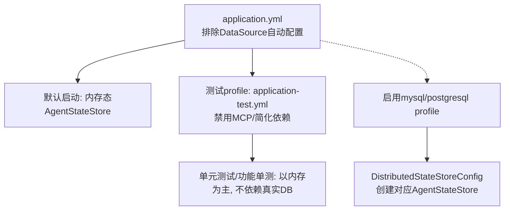
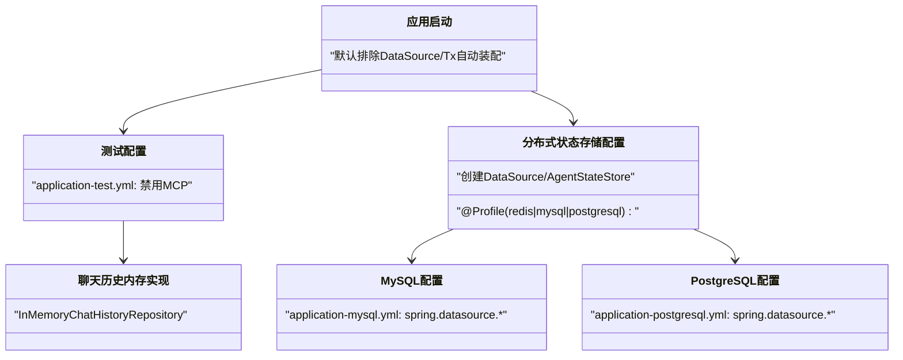
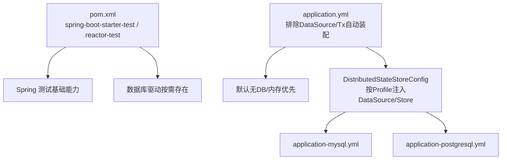

# 数据库测试数据

<cite>
**本文引用的文件**
- [src/test/resources/application-test.yml](file://src/test/resources/application-test.yml)
- [src/main/resources/application.yml](file://src/main/resources/application.yml)
- [src/main/resources/application-mysql.yml](file://src/main/resources/application-mysql.yml)
- [src/main/resources/application-postgresql.yml](file://src/main/resources/application-postgresql.yml)
- [src/main/java/com/skloda/agentscope/config/DistributedStateStoreConfig.java](file://src/main/java/com/skloda/agentscope/config/DistributedStateStoreConfig.java)
- [src/main/java/com/skloda/agentscope/service/InMemoryChatHistoryRepository.java](file://src/main/java/com/skloda/agentscope/service/InMemoryChatHistoryRepository.java)
- [pom.xml](file://pom.xml)
</cite>

## 目录
1. [简介](#简介)
2. [项目结构与上下文](#项目结构与上下文)
3. [核心组件与配置](#核心组件与配置)
4. [架构总览](#架构总览)
5. [详细组件分析](#详细组件分析)
6. [依赖关系分析](#依赖关系分析)
7. [性能考量](#性能考量)
8. [故障排查指南](#故障排查指南)
9. [结论](#结论)
10. [附录：建议补充的数据库测试能力](#附录建议补充的数据库测试能力)

## 简介
本说明围绕本项目中的“数据库测试数据”主题，系统阐述当前仓库在测试环境下的数据库与状态存储配置策略、种子数据与迁移现状、数据隔离方式、以及在现有代码基础上如何规划并落地更完善的数据库测试基础设施（含容器化测试库、迁移脚本管理、事务回滚、数据生成与性能数据集等）。文档严格基于仓库已提供的配置文件、注解与类结构进行解读，并在最后提供可落地的实施建议。

## 项目结构与上下文
- 应用默认启动时，主动排除了 Spring JDBC DataSource 自动装配及事务管理器自动装配；默认内存模式运行，无需外部数据库即可启动和跑通大部分测试。
- 通过启用特定 Profile（如 mysql/postgresql/redis），可切换到分布式 AgentStateStore（用于会话状态持久化）或 Redis-backed 状态存储。
- 测试资源包含 application-test.yml，用于在测试环境中禁用不必要的集成特性（如 MCP），以减少 CI 对额外进程的依赖。

图表来源
- [src/main/resources/application.yml:13-23](file://src/main/resources/application.yml#L13-L23)
- [src/test/resources/application-test.yml:1-9](file://src/test/resources/application-test.yml#L1-L9)
- [src/main/java/com/skloda/agentscope/config/DistributedStateStoreConfig.java:18-44](file://src/main/java/com/skloda/agentscope/config/DistributedStateStoreConfig.java#L18-L44)

章节来源
- [src/main/resources/application.yml:3-23](file://src/main/resources/application.yml#L3-L23)
- [src/test/resources/application-test.yml:1-9](file://src/test/resources/application-test.yml#L1-L9)

## 核心组件与配置
- 应用默认配置
  - 默认排除 DataSource 自动配置与事务管理器自动配置，确保无 DB 也可运行。
- 分布式状态存储配置
  - DistributedStateStoreConfig 通过 Profile 暴露不同后端的 AgentStateStore Bean：Redis、MySQL、PostgreSQL。
  - MySQL/PostgreSQL 分支通过 spring.datasource.* 配置项构建 DataSource，并注入对应的扩展组件。
- 聊天历史内存实现
  - 默认使用 InMemoryChatHistoryRepository 作为聊天历史的内存存储，适合测试快速验证。
- 测试配置
  - application-test.yml 关闭了 MCP 等外部依赖以降低测试复杂度。

章节来源
- [src/main/resources/application.yml:13-23](file://src/main/resources/application.yml#L13-L23)
- [src/main/java/com/skloda/agentscope/config/DistributedStateStoreConfig.java:43-118](file://src/main/java/com/skloda/agentscope/config/DistributedStateStoreConfig.java#L43-L118)
- [src/main/java/com/skloda/agentscope/service/InMemoryChatHistoryRepository.java:11-15](file://src/main/java/com/skloda/agentscope/service/InMemoryChatHistoryRepository.java#L11-L15)
- [src/test/resources/application-test.yml:1-9](file://src/test/resources/application-test.yml#L1-L9)

## 架构总览
以下图展示了当前仓库在“数据库/状态存储测试数据”方面的整体路径：默认内存态 → 可选启用分布式存储 → 通过 Profile 切换至具体后端（MySQL/PostgreSQL/Redis）。

图表来源
- [src/main/resources/application.yml:13-23](file://src/main/resources/application.yml#L13-L23)
- [src/test/resources/application-test.yml:1-9](file://src/test/resources/application-test.yml#L1-L9)
- [src/main/java/com/skloda/agentscope/config/DistributedStateStoreConfig.java:18-118](file://src/main/java/com/skloda/agentscope/config/DistributedStateStoreConfig.java#L18-L118)
- [src/main/resources/application-mysql.yml:1-18](file://src/main/resources/application-mysql.yml#L1-L18)
- [src/main/resources/application-postgresql.yml:1-18](file://src/main/resources/application-postgresql.yml#L1-L18)

## 详细组件分析

### 测试环境隔离与数据源策略
- 测试隔离
  - 测试资源提供了 application-test.yml，将 MCP 相关功能禁用，使测试可以在无 Node.js 环境下运行。
- 数据源策略
  - 默认不加载任何 DataSource，避免测试需要数据库。
  - 如需针对“分布式 AgentStateStore”做集成测试，可启用 mysql/postgresql/redis 等 Profile 并使用对应配置文件设定连接参数。
- H2 使用情况
  - 当前 POM 与源码中未发现内嵌 H2 测试数据库引入；因此，若需基于内存型 RDBMS 的断言式测试，应在后续引入 H2 并提供相应迁移/初始化方案。

章节来源
- [src/test/resources/application-test.yml:1-9](file://src/test/resources/application-test.yml#L1-L9)
- [src/main/resources/application.yml:13-23](file://src/main/resources/application.yml#L13-L23)
- [pom.xml:163-187](file://pom.xml#L163-L187)

### MySQL/PostgreSQL 配置与连接池
- 连接信息来源于各 Profile 的 application-*.yml 中 spring.datasource.*。
- 通过 DataSourceBuilder 创建 DataSource 并注入到 AgentStateStore 实现。
- 当前未显式配置连接池大小/超时等参数，建议使用 HikariCP 属性进行优化：例如 maximumPoolSize、minimumIdle、connectionTimeout、idleTimeout、maxLifetime、connectionTestQuery 等。

章节来源
- [src/main/resources/application-mysql.yml:4-10](file://src/main/resources/application-mysql.yml#L4-L10)
- [src/main/resources/application-postgresql.yml:4-10](file://src/main/resources/application-postgresql.yml#L4-L10)
- [src/main/java/com/skloda/agentscope/config/DistributedStateStoreConfig.java:66-117](file://src/main/java/com/skloda/agentscope/config/DistributedStateStoreConfig.java#L66-L117)

### 种子数据加载机制（现状与建议）
- 现状
  - 仓库未见到 Flyway/Liquibase 相关依赖或配置；也未找到 schema.sql 或 data.sql。
  - 分布式状态存储由 AgentStateStore 扩展自行管理表结构。
- 建议
  - 对于基于 AgentStateStore 的集成测试：采用 TestContainer 拉起临时 MySQL/PostgreSQL，配合 Flyway/Liquibase 按版本管理所需的最小表结构以便集成测试可用。
  - 对聊天历史等内存结构，可在每个测试用 @BeforeEach 重置或构造新实例，避免数据跨用例影响。

章节来源
- [src/main/resources/application.yml:13-23](file://src/main/resources/application.yml#L13-L23)
- [src/main/java/com/skloda/agentscope/config/DistributedStateStoreConfig.java:66-117](file://src/main/java/com/skloda/agentscope/config/DistributedStateStoreConfig.java#L66-L117)

### 数据隔离策略（测试用例事务与回滚）
- 现状
  - 当前未见在测试中使用 @Transactional/@Rollback；大多数单测依赖内存态对象或直接断言对象行为。
- 建议
  - 对于涉及 JdbcTemplate/JPA/Hibernate 的集成测试，可使用 @DataJpaTest + @Transactional（或使用 JUnit Platform 的事务式测试回调）配合 H2，保障测试间完全隔离与自动回滚。
  - 对于 TestContainer + 真实库的集成测试，建议结合 @TestMethod 级别事务或测试包装器进行回滚/重建基线数据。

章节来源
- [pom.xml:182-187](file://pom.xml#L182-L187)
- [src/main/java/com/skloda/agentscope/service/InMemoryChatHistoryRepository.java:11-15](file://src/main/java/com/skloda/agentscope/service/InMemoryChatHistoryRepository.java#L11-L15)

### 动态数据生成与工厂模式（建议）
- 现状
  - 仓库未出现 JDBI/SchemaGenerator 或统一的数据工厂。
- 建议
  - 引入 Data Factory/Bogus/Faker 等工具，为不同场景生成：正常值、边界值、异常值、空值、越界值等。
  - 针对分页查询测试，构建分层数据：页面前置/后置记录、唯一键冲突数据、索引缺失导致的慢查询场景数据。

章节来源
- [pom.xml:28-187](file://pom.xml#L28-L187)

### 性能测试数据（建议）
- 现状
  - 未提供大数据集生成逻辑。
- 建议
  - 使用批量插入+流式写入生成万级/十万级数据，覆盖索引命中/未命中、大字段、高基数列、冷热分区等。
  - 对分页查询测试准备多页数据、极限页尺寸、跨页一致性与重复请求幂等性的数据集。

章节来源
- [pom.xml:28-187](file://pom.xml#L28-L187)

### 数据库状态管理（测试前清理、测试间共享、测试后回收）
- 现状
  - 内存态聊天历史在每个测试用例直接 new 实例，天然隔离。
  - 分布式 AgentStateStore 测试需借助外部库（TestContainer）和迁移工具维护状态生命周期。
- 建议
  - 测试前：拉取干净的状态库，执行最小迁移集，准备共享基线数据。
  - 测试间：对读多写少的基线数据使用共享只读副本；对写多读少的用例隔离事务或用独立库实例。
  - 测试后：丢弃临时容器/回滚事务，释放连接。

章节来源
- [src/main/java/com/skloda/agentscope/service/InMemoryChatHistoryRepository.java:11-15](file://src/main/java/com/skloda/agentscope/service/InMemoryChatHistoryRepository.java#L11-L15)

## 依赖关系分析
- 主要测试依赖
  - Spring Boot Test、Reactor Test 已在 pom.xml 声明，用于常规与响应式测试支持。
- 数据库依赖
  - 默认不含嵌入式数据库；MySQL/PG 依赖仅在对应 Profile 下通过应用配置生效。
- 关系示意

图表来源
- [pom.xml:163-187](file://pom.xml#L163-L187)
- [src/main/resources/application.yml:13-23](file://src/main/resources/application.yml#L13-L23)
- [src/main/java/com/skloda/agentscope/config/DistributedStateStoreConfig.java:43-118](file://src/main/java/com/skloda/agentscope/config/DistributedStateStoreConfig.java#L43-L118)

章节来源
- [pom.xml:163-187](file://pom.xml#L163-L187)

## 性能考量
- 当前默认无连接池配置，需在启用 MySQL/PostgreSQL Profile 时显式添加连接池调优参数（最大连接数、空闲超时、连接生命周期等）。
- 测试阶段应尽量复用只读基线数据，减少写放大；针对分页、全表扫描、排序索引命中等场景构造针对性数据集。
- 对于流式/响应式链路测试，应避免在测试中引入阻塞 I/O，保持非阻塞原则。

[本节为通用指导，不直接分析具体文件]

## 故障排查指南
- 启动失败或找不到数据库
  - 确认未误启 mysql/postgresql profile；若启用了对应 profile，检查 application-*.yml 的连接地址、用户名、密码与环境变量替换是否正确。
  - 若使用分布式 AgentStateStore，确认目标服务可用且具备 AgentStateStore 所需表结构（可通过迁移工具补齐）。
- 测试污染与数据残留
  - 对内存态服务，确保每个测试方法新建实例或通过 @BeforeEach 清理。
  - 对基于外部库的集成测试，采用 TestContainer 或事务回滚，确保每个用例前后环境一致。
- 日志定位
  - 通过应用日志级别（如 io.agentscope）查看 Bean 注入与状态库初始化情况，确认正确的 Store 被装配。

章节来源
- [src/main/resources/application.yml:81-90](file://src/main/resources/application.yml#L81-L90)
- [src/main/java/com/skloda/agentscope/config/DistributedStateStoreConfig.java:66-117](file://src/main/java/com/skloda/agentscope/config/DistributedStateStoreConfig.java#L66-L117)

## 结论
当前仓库的“数据库测试数据”现状是：默认走内存态、禁用外部依赖以支持轻量测试；通过 Profile 可切换至分布式状态存储（MySQL/PostgreSQL/Redis）。尚未引入嵌入式数据库、Flyway/Liquibase、事务回滚和数据工厂等数据库测试常用能力。建议在现有清晰的分层与 Profile 基础上，逐步引入 TestContainer 化的数据库、迁移脚本与数据工厂，完善从单测到集成测试的全链路数据治理，提升稳定性、可复现性与可维护性。

## 附录：建议补充的数据库测试能力
- 在测试阶段引入 H2 或 TestContainer 管理的真实数据库（MySQL/PostgreSQL），配合 Flyway/Liquibase 统一管理最小表结构与初始化数据。
- 在单元测试中广泛使用 @BeforeEach/@AfterEach 或框架事务回调完成数据清理与校验。
- 建立统一的数据工厂与用例数据模板，覆盖边界值与异常路径。
- 为分页/聚合/复杂查询准备结构化基准数据，并结合 EXPLAIN/统计信息进行索引验证。
- 为连接池增加合理的容量与超时参数，避免测试中资源耗尽或长时间阻塞。

[本节为总体建议，不直接分析具体文件]