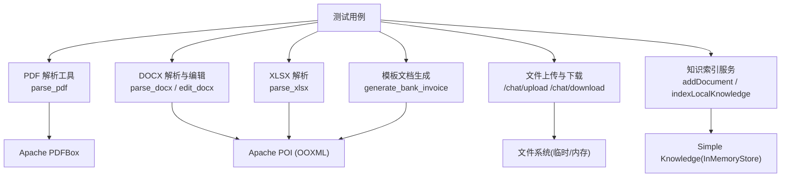
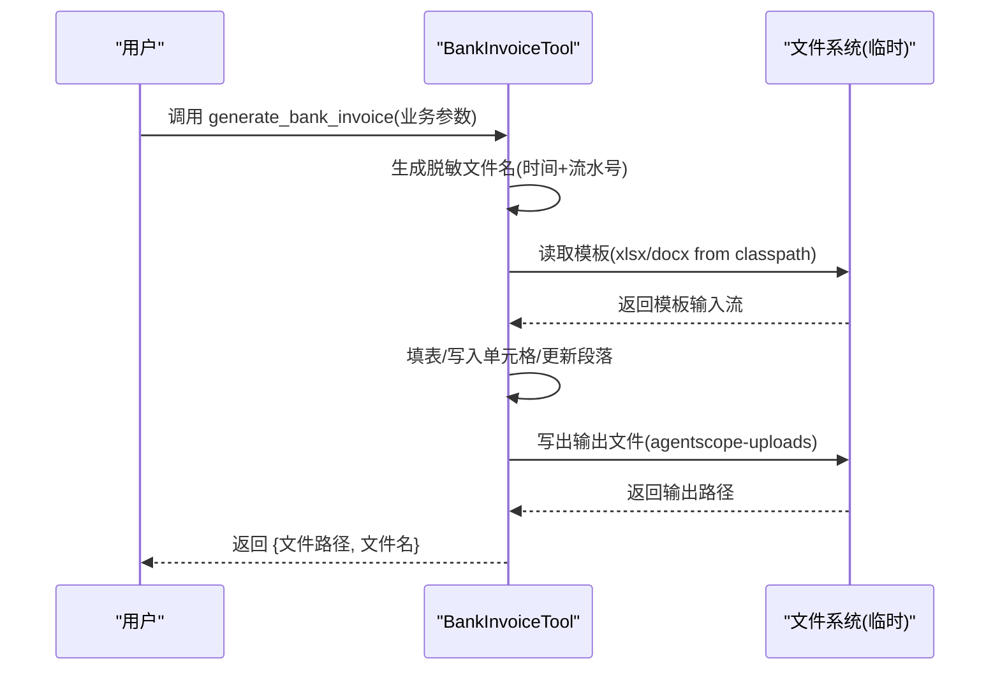
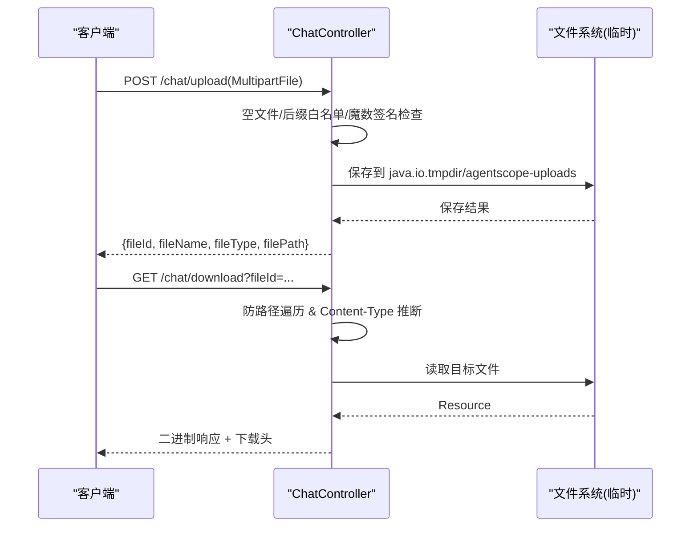
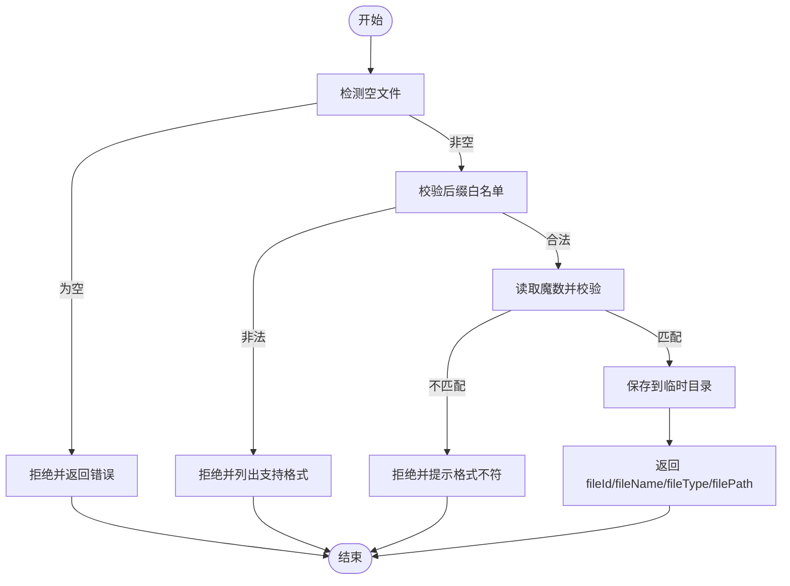
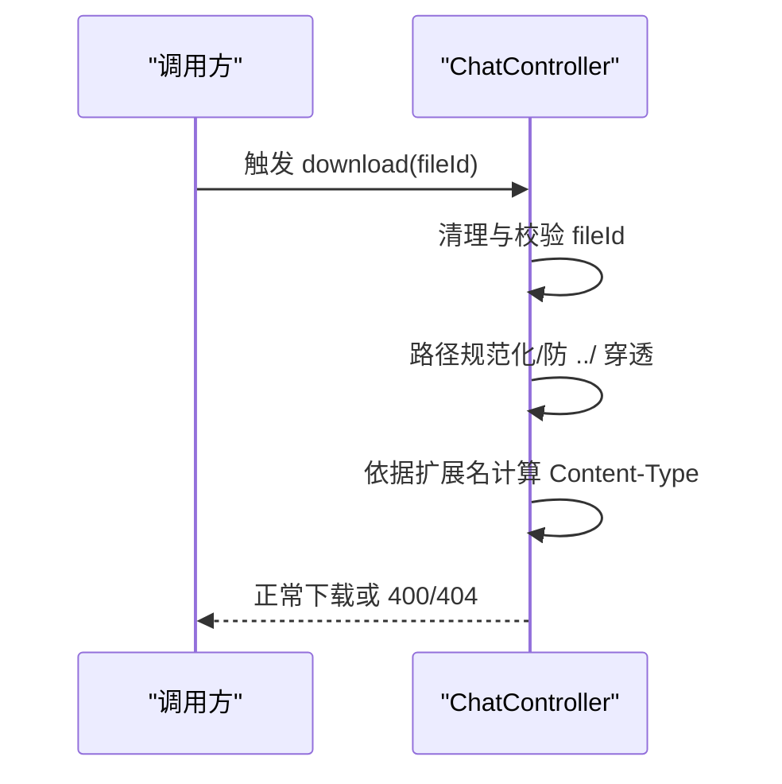
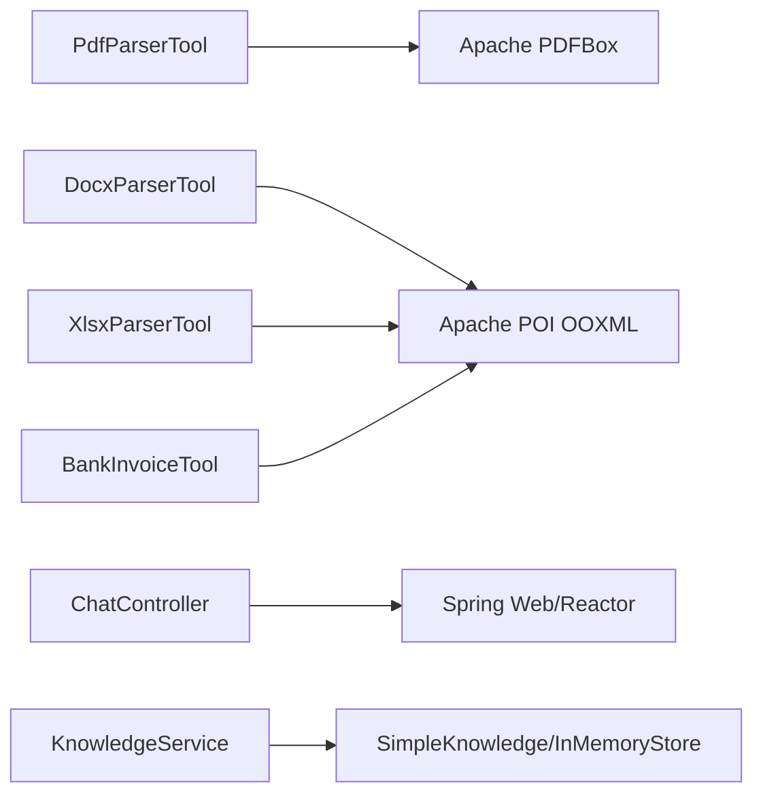

# 文件系统测试数据

<cite>
**本文引用的文件**
- [PdfParserToolTest.java](file://src/test/java/com/skloda/agentscope/tool/PdfParserToolTest.java)
- [DocxParserToolTest.java](file://src/test/java/com/skloda/agentscope/tool/DocxParserToolTest.java)
- [XlsxParserToolTest.java](file://src/test/java/com/skloda/agentscope/tool/XlsxParserToolTest.java)
- [ChatControllerFileTest.java](file://src/test/java/com/skloda/agentscope/controller/ChatControllerFileTest.java)
- [KnowledgeServiceStatusTest.java](file://src/test/java/com/skloda/agentscope/service/KnowledgeServiceStatusTest.java)
- [FileSignatureValidatorTest.java](file://src/test/java/com/skloda/agentscope/controller/FileSignatureValidatorTest.java)
- [PdfParserTool.java](file://src/main/java/com/skloda/agentscope/tool/PdfParserTool.java)
- [DocxParserTool.java](file://src/main/java/com/skloda/agentscope/tool/DocxParserTool.java)
- [XlsxParserTool.java](file://src/main/java/com/skloda/agentscope/tool/XlsxParserTool.java)
- [BankInvoiceTool.java](file://src/main/java/com/skloda/agentscope/tool/BankInvoiceTool.java)
- [ChatController.java](file://src/main/java/com/skloda/agentscope/controller/ChatController.java)
- [KnowledgeService.java](file://src/main/java/com/skloda/agentscope/service/KnowledgeService.java)
- [pom.xml](file://pom.xml)
</cite>

## 目录
1. [简介](#简介)
2. [项目结构与定位](#项目结构与定位)
3. [核心组件](#核心组件)
4. [架构总览](#架构总览)
5. [详细组件分析](#详细组件分析)
6. [依赖关系分析](#依赖关系分析)
7. [性能考量](#性能考量)
8. [故障诊断与排错](#故障诊断与排错)
9. [结论](#结论)
10. [附录：模板与测试资源组织规范](#附录：模板与测试资源组织规范)

## 简介
本文件聚焦“文件系统测试数据”的设计与实践，覆盖以下关键主题：
- 模板文件的版本控制策略、路径解析机制与多语言支持思路
- 二进制文件处理测试：PDF 解析、Office 文档处理、大文件上传与校验
- 虚拟文件系统：基于 JUnit @TempDir 的隔离临时目录、真实文件系统模拟与内存替代
- 权限与安全：访问权限控制、恶意文件检测（基于文件签名与后缀）、路径遍历防护
- 工作流端到端测试：文档生成流程、格式转换能力验证、版本对比基础
- 测试文件组织：按功能模块分类、命名约定、文件大小限制验证方法

上述内容与代码中 PDF/Word/Excel 解析工具、银行发票模板生成器、文件上传与下载控制器、知识索引服务以及覆盖性单元测试共同构成稳定可靠的文件系统测试体系。

## 项目结构与定位
该仓库以 Spring Boot + AgentScope 为基础，围绕文件处理提供三类能力：
- 工具层：解析 PDF/DOCX/XLSX、编辑 DOCX、基于模板生成 Excel/DOCX
- 接口层：文件上传、下载、类型识别、签名校验与路径安全校验
- 服务层：本地知识库扫描与导入、后台异步索引、状态聚合
- 测试层：全面的单元测试覆盖工具、控制器与服务的关键路径，普遍使用 @TempDir 创建隔离临时目录

**图示来源**
- [PdfParserTool.java:1-72](file://src/main/java/com/skloda/agentscope/tool/PdfParserTool.java#L1-L72)
- [DocxParserTool.java:1-200](file://src/main/java/com/skloda/agentscope/tool/DocxParserTool.java#L1-L200)
- [XlsxParserTool.java:1-108](file://src/main/java/com/skloda/agentscope/tool/XlsxParserTool.java#L1-L108)
- [BankInvoiceTool.java:1-199](file://src/main/java/com/skloda/agentscope/tool/BankInvoiceTool.java#L1-L199)
- [ChatController.java:1-186](file://src/main/java/com/skloda/agentscope/controller/ChatController.java#L1-L186)
- [KnowledgeService.java:1-199](file://src/main/java/com/skloda/agentscope/service/KnowledgeService.java#L1-L199)

**节来源**
- [pom.xml:76-107](file://pom.xml#L76-L107)
- [pom.xml:175-187](file://pom.xml#L175-L187)

## 核心组件
- 文件解析与编辑工具
  - PDF：提取文本、输出空内容或扫描版提示
  - Word：提取结构化文本、表格；支持替换占位符并写回新文件
  - Excel：按 Sheet/Row/Cell 提取值、公式与日期等类型信息
- 模板与文档生成
  - 从 classpath 加载模板文件，生成带脱敏信息的 Excel/Word 输出到系统临时目录下的专属子目录
- 文件上传与下载接口
  - 接收 MultipartFile，进行空文件检测、后缀白名单、魔数签名校验、类型推断、保存与返回元数据
  - 下载时防路径遍历，支持文件名兜底查找，正确设置 Content-Type 与下载头
- 知识索引服务
  - 支持本地目录扫描导入与单文件上传导入，记录状态与失败原因，隔离本地目录与上传命名空间

**节来源**
- [PdfParserTool.java:19-71](file://src/main/java/com/skloda/agentscope/tool/PdfParserTool.java#L19-L71)
- [DocxParserTool.java:24-127](file://src/main/java/com/skloda/agentscope/tool/DocxParserTool.java#L24-L127)
- [XlsxParserTool.java:17-106](file://src/main/java/com/skloda/agentscope/tool/XlsxParserTool.java#L17-L106)
- [BankInvoiceTool.java:49-166](file://src/main/java/com/skloda/agentscope/tool/BankInvoiceTool.java#L49-L166)
- [ChatController.java:47-186](file://src/main/java/com/skloda/agentscope/controller/ChatController.java#L47-L186)
- [KnowledgeService.java:140-199](file://src/main/java/com/skloda/agentscope/service/KnowledgeService.java#L140-L199)

## 架构总览
以下时序展示“完整文档生成流程”的端到端过程：用户发起任务 → 调用生成工具 → 加载模板 → 填充数据 → 写出文件 → 返回文件路径，便于后续下载或消费。

**图示来源**
- [BankInvoiceTool.java:40-166](file://src/main/java/com/skloda/agentscope/tool/BankInvoiceTool.java#L40-L166)

另一个常见流程是“文件上传—校验—存储—下载”，强调安全边界与类型推断：

**图示来源**
- [ChatController.java:47-186](file://src/main/java/com/skloda/agentscope/controller/ChatController.java#L47-L186)
- [ChatControllerFileTest.java:40-157](file://src/test/java/com/skloda/agentscope/controller/ChatControllerFileTest.java#L40-L157)
- [FileSignatureValidatorTest.java:11-90](file://src/test/java/com/skloda/agentscope/controller/FileSignatureValidatorTest.java#L11-L90)

## 详细组件分析

### 模板文件管理策略
- 版本控制建议
  - 模板置于 resources 下受版本控制的目录（如 skills/bank_invoice_java/assets/），通过 Git 变更跟踪
  - 模板升级需保留旧版以供兼容与回滚，或在文件名/版本号中体现
- 路径解析与多语言
  - 实现从 classpath 加载模板，通过类加载器的资源路径获取流
  - 多语言场景可通过不同命名或子目录区分模板资源（例如 assets/en/, assets/zh/）
  - 在测试中可通过注入不同 classpath 内容或直接复用真实模板，保证回归稳定性
- 生成输出与隔离
  - 统一输出至系统临时目录的子目录（如 agentscope-uploads），避免污染其他目录
  - 文件名采用脱敏规则与时间戳结合，减少冲突风险

**节来源**
- [BankInvoiceTool.java:49-166](file://src/main/java/com/skloda/agentscope/tool/BankInvoiceTool.java#L49-L166)

### 二进制文件处理测试
- PDF 解析测试
  - 覆盖空页/无文本可提取（可能是扫描版）的场景
  - 校验缺失文件时的错误信息前缀
  - 断言返回文本不含多余空白，或包含页面分段标记
- Office 文档处理测试
  - DOCX：提取段落与表格、验证占位符替换、生成新文件并校验路径存在
  - XLSX：校验 sheet/行/列、数值/公式/布尔类型的读取
- 大文件上传准备
  - 使用 @TempDir 生成的独立子目录构造不同大小样例
  - 通过 MockMultipartFile 注入指定头部字节进行魔数校验
  - 关注应用配置项对请求体大小限制的影响（由 application.yml/Spring Boot 默认约束）

**图示来源**
- [ChatControllerFileTest.java:40-113](file://src/test/java/com/skloda/agentscope/controller/ChatControllerFileTest.java#L40-L113)
- [FileSignatureValidatorTest.java:11-90](file://src/test/java/com/skloda/agentscope/controller/FileSignatureValidatorTest.java#L11-L90)

**节来源**
- [PdfParserToolTest.java:20-37](file://src/test/java/com/skloda/agentscope/tool/PdfParserToolTest.java#L20-L37)
- [DocxParserToolTest.java:27-72](file://src/test/java/com/skloda/agentscope/tool/DocxParserToolTest.java#L27-L72)
- [XlsxParserToolTest.java:20-52](file://src/test/java/com/skloda/agentscope/tool/XlsxParserToolTest.java#L20-L52)

### 虚拟文件系统
- 临时文件系统
  - 广泛使用 JUnit Jupiter 的 @TempDir，确保每个用例拥有独立的隔离目录
  - 通过 System.setProperty("java.io.tmpdir", ...) 切换全局临时根目录，集中验证上传、下载及文件落盘行为
- 内存替代方案
  - 对于 RAG/知识库场景，使用 InMemoryStore 避免磁盘 I/O，保障测试快速稳定
- 真实文件系统模拟
  - 通过 @TempDir 模拟真实文件存在/缺失、空文件、非法后缀等场景
  - 借助 MockMultipartFile 注入原始字节流构造不同文件类型与大小

**节来源**
- [ChatControllerFileTest.java:22-38](file://src/test/java/com/skloda/agentscope/controller/ChatControllerFileTest.java#L22-L38)
- [KnowledgeServiceStatusTest.java:24-50](file://src/test/java/com/skloda/agentscope/service/KnowledgeServiceStatusTest.java#L24-L50)

### 文件权限与安全测试
- 访问权限控制
  - 上传接口拒绝空文件、非法后缀；下载接口拒绝空标识符、不存在的文件
- 恶意文件检测
  - 基于魔数（签名）校验：PDF、ZIP-based 文档（docx/xlsx）、图片（png/jpg/gif）、音频（mp3/wav）、视频（mp4/m4a）等多类型
  - 当文件头与后缀不一致时，视为不可信并拒绝
- 路径遍历攻击防护
  - 下载参数必须为白名单内的文件名或 UUID 风格标识
  - 对 ../ 或反斜杠混用进行拦截，确保始终落在允许的 uploads 目录下

**图示来源**
- [ChatControllerFileTest.java:85-157](file://src/test/java/com/skloda/agentscope/controller/ChatControllerFileTest.java#L85-L157)

**节来源**
- [FileSignatureValidatorTest.java:11-90](file://src/test/java/com/skloda/agentscope/controller/FileSignatureValidatorTest.java#L11-L90)
- [ChatControllerFileTest.java:40-157](file://src/test/java/com/skloda/agentscope/controller/ChatControllerFileTest.java#L40-L157)

### 文件处理工作流测试
- 完整文档生成流程
  - 通过 bank invoice 工具，基于 classpath 模板生成双格式输出，并在测试与运行期统一落地到临时目录
- 文件格式转换与结构保持
  - DOCX 占位符替换后生成新文件，确保段落/表格结构保持
  - Excel 行列、公式、类型保留用于检索/展示
- 版本比较基础
  - 可对输出文件的路径/大小/哈希等进行断言（测试用例已验证输出文件存在与基本内容）
  - 如需更严格对比，可在现有基础上扩展断言（如差异计数）

**节来源**
- [BankInvoiceTool.java:194-260](file://src/main/java/com/skloda/agentscope/tool/BankInvoiceTool.java#L194-L260)
- [DocxParserToolTest.java:44-72](file://src/test/java/com/skloda/agentscope/tool/DocxParserToolTest.java#L44-L72)

## 依赖关系分析
- 解析库
  - Apache PDFBox：用于 PDF 文本提取与元数据读取
  - Apache POI OOXML：用于 DOCX 与 XLSX 的读写
- 运行时框架
  - Spring Web：Multipart 处理、响应封装、静态资源访问
  - Reactor：SSE 流式输出
- 知识图谱
  - SimpleKnowledge + InMemoryStore：内存中向量存储，适合演示与测试

**图示来源**
- [pom.xml:76-107](file://pom.xml#L76-L107)

**节来源**
- [pom.xml:76-107](file://pom.xml#L76-L107)
- [pom.xml:175-187](file://pom.xml#L175-L187)

## 性能考量
- 解析效率
  - PDF：当页数较多时分页逐页提取，降低一次性解析成本与内存占用
  - Excel：按行迭代、按需格式化，避免全量加载带来的峰值内存
- I/O 优化
  - 模板仅读取一次；批量操作尽量复用流与对象生命周期
  - 输出文件写入最小化缓冲区，及时关闭流
- 并发与线程池
  - 知识库索引通过单线程后台任务执行，避免争用；注意应用关闭时优雅终止

[本节为通用指导，无需特定文件引用]

## 故障诊断与排错
- 解析类异常
  - PDF/DOCX/XLSX 读不到文本或缺失文件时，返回明确错误前缀以便前端/上层快速定位
- 模板缺失
  - 生成步骤检测到 classpath 模板不存在会抛出运行时异常，应确保部署产物包含对应资源目录
- 上传校验失败
  - 空文件、不支持后缀、魔数不匹配都会直接拒绝，查看日志与返回错误消息定位问题
- 下载安全拦截
  - 遇到路径遍历尝试将被拒绝，核查传入参数是否经过清洗与白名单过滤

**节来源**
- [PdfParserTool.java:61-71](file://src/main/java/com/skloda/agentscope/tool/PdfParserTool.java#L61-L71)
- [DocxParserTool.java:53-57](file://src/main/java/com/skloda/agentscope/tool/DocxParserTool.java#L53-L57)
- [XlsxParserTool.java:102-106](file://src/main/java/com/skloda/agentscope/tool/XlsxParserTool.java#L102-L106)
- [KnowledgeService.java:167-175](file://src/main/java/com/skloda/agentscope/service/KnowledgeService.java#L167-L175)

## 结论
本项目围绕文件系统构建了清晰的职责分层：工具层负责解析与编辑、接口层负责安全与传输、服务层负责状态与索引。测试全面覆盖关键路径与异常分支，配合 JUnit 临时目录与内存存储，形成高可靠、易维护的测试体系。模板采用 classpath 内嵌方式便于版本管理与交付一致性。整体具备较好的安全性（魔数与路径遍历防护）、可扩展性（多文件类型与新工具接入）与可观测性（标准化错误信息与日志）。

[本节为总结性内容，无需特定文件引用]

## 附录：模板与测试资源组织规范
- 组织原则
  - 模板存放于 resources/skills/<module>/assets 下，按业务域划分目录
  - 通过类加载器按固定路径加载，测试时复用同一份模板，保证确定性
- 命名约定
  - 模板文件名避免空格与特殊字符；主模板建议采用语义化名称（如 bank_template.xlsx/docx）
  - 生成文件统一使用脱敏规则 + 日期 + 流水号，避免重叠
- 文件大小限制
  - 上传端点遵循 Spring Boot 默认最大请求体限制；可在应用中配置调整
  - 建议在测试中对不同大小文件（小/中/大）进行边界验证，观察内存与耗时表现
- 测试覆盖率建议
  - 正向路径：成功解析/编辑/生成/上传/下载
  - 反向路径：空文件、缺失文件、非法后缀、魔数不匹配、路径穿越、超大文件
  - 集成路径：端到端流程，从上传到生成再到下载的全链路

[本节为通用指导，无需特定文件引用]