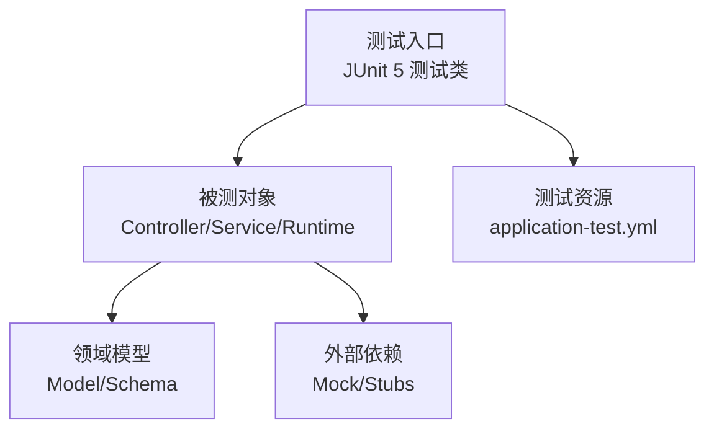
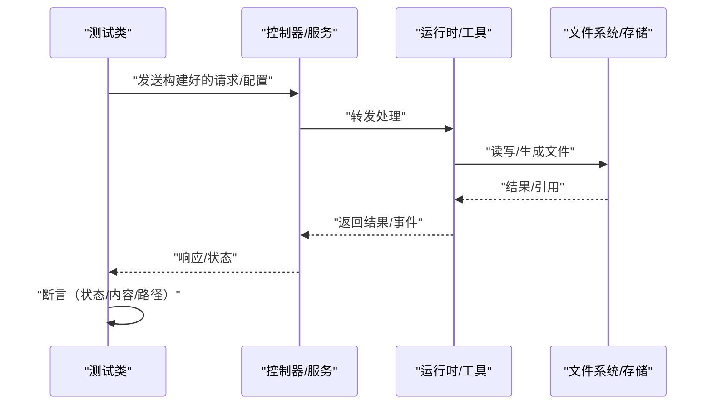
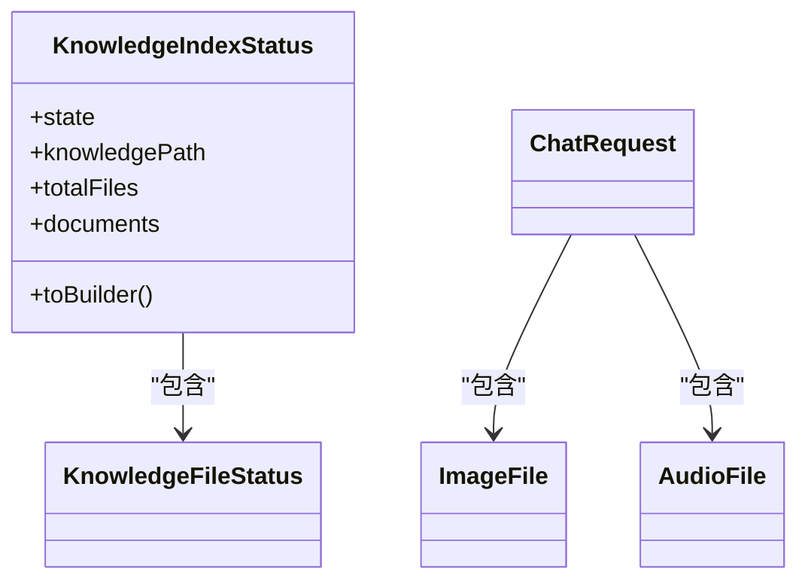
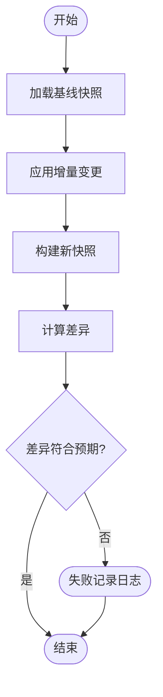
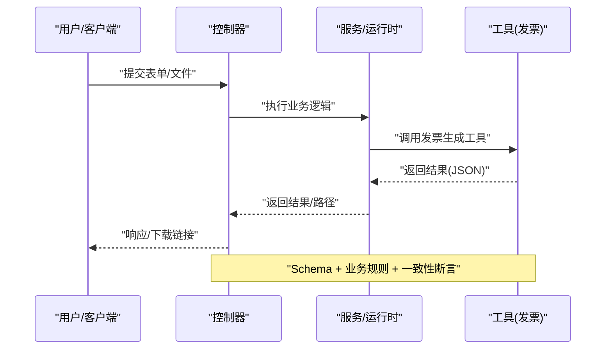
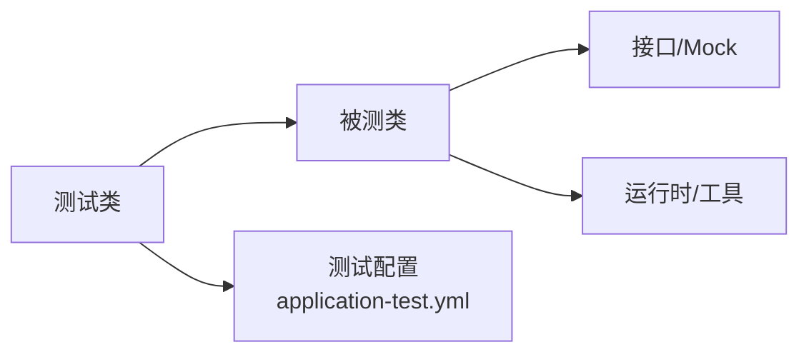

# 测试数据策略模式

<cite>
**本文引用的文件 **
- [AgentConfig.java](file://src/main/java/com/skloda/agentscope/agent/AgentConfig.java)
- [AgentConfigTest.java](file://src/test/java/com/skloda/agentscope/agent/AgentConfigTest.java)
- [ChatRequest.java](file://src/main/java/com/skloda/agentscope/model/ChatRequest.java)
- [KnowledgeIndexStatus.java](file://src/main/java/com/skloda/agentscope/model/KnowledgeIndexStatus.java)
- [KnowledgeControllerTest.java](file://src/test/java/com/skloda/agentscope/controller/KnowledgeControllerTest.java)
- [InvoiceData.java](file://src/main/java/com/skloda/agentscope/schema/InvoiceData.java)
- [InvoiceDataTest.java](file://src/test/java/com/skloda/agentscope/schema/InvoiceDataTest.java)
- [BankInvoiceToolTest.java](file://src/test/java/com/skloda/agentscope/tool/BankInvoiceToolTest.java)
- [application-test.yml](file://src/test/resources/application-test.yml)
</cite>

## 目录
1. [简介](#简介)
2. [项目结构](#项目结构)
3. [核心组件](#核心组件)
4. [架构总览](#架构总览)
5. [详细组件分析](#详细组件分析)
6. [依赖关系分析](#依赖关系分析)
7. [性能考虑](#性能考虑)
8. [故障排查指南](#故障排查指南)
9. [结论](#结论)
10. [附录](#附录)（必要时）

## 简介
本指南围绕本项目中的“测试数据策略模式”，基于现有代码与测试实现，总结并扩展以下主题：设计原则在测试数据中的应用、工厂模式在测试数据中的实践、数据快照技术与差异对比、数据共享与版本管理、数据注入模式（构造器/Setter/反射）、数据验证（Schema/业务规则/跨组件一致性），以及测试数据的监控与维护。目标是帮助团队建立可维护、可扩展且可观测的测试数据体系。

## 项目结构
- 测试框架为 JUnit 5 + Spring Boot Test + Mockito，集中在 src/test 下，按主包结构分层组织。
- 配置与资源：
  - 测试专用配置在 src/test/resources/application-test.yml，通过 profiles 隔离非核心依赖（例如禁用 MCP）。
  - 主应用配置位于 src/main/resources/config/*.yml，驱动 AgentScope 运行时装配。
- 数据模型与 Schema 定义集中于 main/src 下的 model/ 和 schema/ 包，对应测试用例分别在各模块的 *Test 中验证。

图表来源
- [application-test.yml:1-9](file://src/test/resources/application-test.yml#L1-L9)
- [KnowledgeControllerTest.java:18-47](file://src/test/java/com/skloda/agentscope/controller/KnowledgeControllerTest.java#L18-L47)
- [KnowledgeIndexStatus.java:9-52](file://src/main/java/com/skloda/agentscope/model/KnowledgeIndexStatus.java#L9-L52)

章节来源
- [application-test.yml:1-9](file://src/test/resources/application-test.yml#L1-L9)
- [KnowledgeControllerTest.java:18-47](file://src/test/java/com/skloda/agentscope/controller/KnowledgeControllerTest.java#L18-L47)
- [KnowledgeIndexStatus.java:9-52](file://src/main/java/com/skloda/agentscope/model/KnowledgeIndexStatus.java#L9-L52)

## 核心组件
- 请求模型：ChatRequest 携带多模态消息与会话上下文；测试验证默认值、字段绑定与可选字段行为。
- 结构化输出 Schema：InvoiceData/InvoiceItem 表示发票抽取的结构化数据，提供基础类型与嵌套集合场景的测试覆盖。
- 索引状态：KnowledgeIndexStatus 作为不可变/构建器模式的聚合状态对象，用于断言知识库索引流程产出的一致性。
- 工具输出：BankInvoiceTool 生成 Excel/Word，测试以文件系统存在性与脱敏文件名为断言点。

章节来源
- [ChatRequest.java:50-143](file://src/main/java/com/skloda/agentscope/model/ChatRequest.java#L50-L143)
- [InvoiceData.java:5-37](file://src/main/java/com/skloda/agentscope/schema/InvoiceData.java#L5-L37)
- [KnowledgeIndexStatus.java:9-52](file://src/main/java/com/skloda/agentscope/model/KnowledgeIndexStatus.java#L9-L52)
- [BankInvoiceToolTest.java:19-58](file://src/test/java/com/skloda/agentscope/tool/BankInvoiceToolTest.java#L19-L58)

## 架构总览
下图展示端到端“测试数据从构建到断言”的流程：测试类构造输入（或读取配置/文件），通过控制层或服务层进入，调用底层 Runtime/工具，最后对返回值、文件或状态进行断言。

图表来源
- [KnowledgeControllerTest.java:28-47](file://src/test/java/com/skloda/agentscope/controller/KnowledgeControllerTest.java#L28-L47)
- [BankInvoiceToolTest.java:44-58](file://src/test/java/com/skloda/agentscope/tool/BankInvoiceToolTest.java#L44-L58)

## 详细组件分析

### 设计原则在测试数据中的应用
- 单一职责原则
  - 每个测试方法只关注一个输入/行为分支，避免测试耦合。例如：ChatRequestTest 分别验证默认值、字段设置、Bean 绑定与可选字段缺失情况。
  - Schema 与模型分离，针对 InvoiceData 的子项做细粒度断言，便于定位问题。
- 开闭原则
  - 通过 Builder/静态创建方式构造测试数据，新增字段不影响已有用例。例如 KnowledgeIndexStatus.builder() 新增属性时不破坏既有用例。
  - 测试资源通过 application-test.yml 开关特性（如关闭 MCP），在不改动测试代码的前提下扩展运行环境。
- 依赖倒置原则
  - 使用 @Mock/@InjectMocks 将外部服务替换为 Stub，测试仅依赖接口契约。例如 KnowledgeControllerTest 对 KnowledgeService 打桩后仅断言 Controller 行为。
  - 对复杂对象（如 McpServerRef、ToolGroupConfig）采用构造器/Builder 装配，避免直接依赖具体实现细节。

章节来源
- [ChatRequestTest:21-74](file://src/test/java/com/skloda/agentscope/model/ChatRequestTest.java#L21-L74)
- [InvoiceDataTest:11-98](file://src/test/java/com/skloda/agentscope/schema/InvoiceDataTest.java#L11-L98)
- [KnowledgeControllerTest:28-47](file://src/test/java/com/skloda/agentscope/controller/KnowledgeControllerTest.java#L28-L47)
- [AgentConfigTest:17-79](file://src/test/java/com/skloda/agentscope/agent/AgentConfigTest.java#L17-L79)
- [application-test.yml:1-9](file://src/test/resources/application-test.yml#L1-L9)

### 工厂模式实现（测试数据侧）
- 通用测试数据工厂
  - 利用 Lombok @Value/@Builder 提供的轻量“工厂”，快速构建不可变状态对象（如 KnowledgeIndexStatus）。
- 特定领域工厂
  - 通过配置驱动组装复杂对象：AgentConfigTest 组合 SubAgentConfig、McpServerRef、ToolGroupConfig 等，模拟多智能体协作的配置矩阵。
- 数据组合模式
  - 用 List.of()/builder().addAll(...) 拼接测试列表，确保边界条件（空集、单元素、多元素）覆盖充分。

图表来源
- [KnowledgeIndexStatus.java:9-52](file://src/main/java/com/skloda/agentscope/model/KnowledgeIndexStatus.java#L9-L52)
- [ChatRequest.java:50-143](file://src/main/java/com/skloda/agentscope/model/ChatRequest.java#L50-L143)

章节来源
- [KnowledgeIndexStatus.java:9-52](file://src/main/java/com/skloda/agentscope/model/KnowledgeIndexStatus.java#L9-L52)
- [AgentConfigTest:17-79](file://src/test/java/com/skloda/agentscope/agent/AgentConfigTest.java#L17-L79)

### 数据快照技术
- 基线测试数据
  - 通过不可变的 Value Object（如 KnowledgeIndexStatus）表达“快照”，测试断言整体状态而非可变中间过程。
- 增量数据变更
  - 构造初始快照后，通过 toBuilder() 逐步叠加变更（如调整 state/documents），形成前后对比的最小变更集。
- 数据差异对比工具（建议）
  - 在现有基础上引入 JSON/XML/对象差异库，对两个同构快照做 diff 比较，突出新增、修改、删除部分，便于回归分析。

图表来源
- [KnowledgeIndexStatus.java:31-52](file://src/main/java/com/skloda/agentscope/model/KnowledgeIndexStatus.java#L31-L52)

### 数据共享策略
- 共享上下文数据
  - 测试级共享：通过 @BeforeAll / static 常量/工厂方法集中创建公共测试数据（例如通用 Agent 配置矩阵）。
  - 方法级隔离：每个测试方法独立构造或使用 toBuilder() 派生独立实例，避免相互影响。
- 线程安全的数据容器
  - 对并发测试，优先使用不可变对象（如 @Value + Builder 产物）或并发安全容器；减少锁竞争与内存可见性问题。
- 测试数据版本管理
  - 将大型或难复现的固定数据放在 resources/testdata 并按语义化版本命名；配合 @DisplayName 描述期望版本，利于回溯与比对。

[无源文件直接分析，为概念性说明]

### 数据注入模式
- 构造函数注入
  - 推荐：被测类构造时即注入依赖（如 Service/Factory）。测试通过参数化或工厂构造被测对象，无需暴露内部状态。
- Setter 注入
  - 适用于需要灵活替换依赖或复用对象图的场景，注意在测试 setUp 阶段完成全部依赖设置。
- 反射注入
  - 谨慎使用；当无法修改源码时通过反射设置私有字段进行断言或初始化，但会绕过封装约束，仅作为兜底方案。

章节来源
- [KnowledgeControllerTest:18-25](file://src/test/java/com/skloda/agentscope/controller/KnowledgeControllerTest.java#L18-L25)

### 数据验证策略
- Schema 验证
  - 通过强类型模型与构造器保证必填字段与类型约束，如 ChatRequest 的多媒体字段子类、InvoiceData 的字段类型与嵌套 Item。
- 业务规则验证
  - BankInvoiceToolTest 覆盖了姓名/身份证/流水号的缺失校验；对工具返回值解析 JSON 并断言 success=false 与错误提示。
- 跨组件数据一致性检查
  - 断言“上游产物 → 下游消费”的一致性。例如：知识库索引后，KnowledgeController.status() 返回的状态应与服务层一致；上传的文件路径与实际存在性匹配。

图表来源
- [BankInvoiceToolTest:19-58](file://src/test/java/com/skloda/agentscope/tool/BankInvoiceToolTest.java#L19-L58)
- [KnowledgeControllerTest:28-47](file://src/test/java/com/skloda/agentscope/controller/KnowledgeControllerTest.java#L28-L47)

章节来源
- [InvoiceData.java:5-37](file://src/main/java/com/skloda/agentscope/schema/InvoiceData.java#L5-L37)
- [ChatRequest.java:50-143](file://src/main/java/com/skloda/agentscope/model/ChatRequest.java#L50-L143)
- [BankInvoiceToolTest:19-58](file://src/test/java/com/skloda/agentscope/tool/BankInvoiceToolTest.java#L19-L58)
- [KnowledgeControllerTest:28-47](file://src/test/java/com/skloda/agentscope/controller/KnowledgeControllerTest.java#L28-L47)

### 测试数据监控
- 数据覆盖率分析
  - 结合行/分支覆盖率，识别未覆盖的边界条件（如空列表、非法枚举、缺失字段），补充用例。
- 测试数据质量评估
  - 对“随机/外部驱动”数据，增加确定性断言（如哈希/签名/文件名规则），提高稳定性。
- 自动化数据维护工具（建议）
  - 定期扫描并更新“示例/模板”数据（如发票模板、文档片段）至最新版本，保持测试基准与生产一致。
  - 引入“快照比对任务”（CI 定时作业）自动检测数据结构变化，提示人工评审。

[无源文件直接分析，为概念性说明]

## 依赖关系分析
- 组件间耦合
  - 测试类仅依赖被测试类的对外契约，外部服务通过 Mock 替代（低耦合高内聚）。
- 间接依赖
  - 通过 configuration 与 resource 控制全局启用/禁用能力（如 MCP 关闭），降低 CI 环境复杂度。

图表来源
- [KnowledgeControllerTest.java:18-25](file://src/test/java/com/skloda/agentscope/controller/KnowledgeControllerTest.java#L18-L25)
- [application-test.yml:1-9](file://src/test/resources/application-test.yml#L1-L9)

章节来源
- [KnowledgeControllerTest.java:18-25](file://src/test/java/com/skloda/agentscope/controller/KnowledgeControllerTest.java#L18-L25)
- [application-test.yml:1-9](file://src/test/resources/application-test.yml#L1-L9)

## 性能考虑
- 减少 IO：对于大文件或大量附件，仅在必要时落盘；可使用临时目录并在 after 清理。
- 并行执行：尽量使测试用例无副作用并可并行运行，提高 CI 吞吐。
- 惰性构建：延迟构造大数据对象至真正使用时再 build，减少无效开销。

[无源文件直接分析，为通用建议]

## 故障排查指南
- 断言失败
  - 确认最小可复现用例：缩小输入空间（如单个文件/单条消息），聚焦失败点。
  - 打印/导出实际输出（JSON、文件路径）并与预期对比，定位偏差位置。
- 资源不可用
  - 通过 application-test.yml 屏蔽非必要依赖（如 MCP），确保核心流程在 CI 可跑通。
- 数据不一致
  - 针对跨组件一致性，先断言中间产物（如 IndexStatus），再断言最终响应，逐步收敛问题范围。

章节来源
- [application-test.yml:1-9](file://src/test/resources/application-test.yml#L1-L9)

## 结论
本项目已具备良好的测试数据基础：明确的模型与 Schema、不可变对象与构建器、Mock 驱动的解耦测试。建议在现有基础上系统化推进“测试数据工厂化、快照化、可版本化”，并配套差异对比与监控机制，提升测试的稳定性与可维护性。

## 附录
- 术语说明
  - 基线：稳定不变的数据或状态，用作断言或比对的基础。
  - 增量：相对于基线的变更部分。
  - 快照：某一时刻完整数据状态的不可变复制。

[无源文件直接分析，为概念性说明]