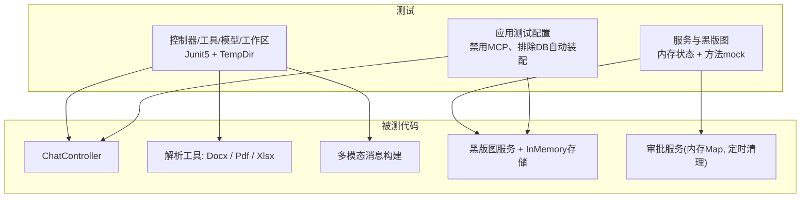
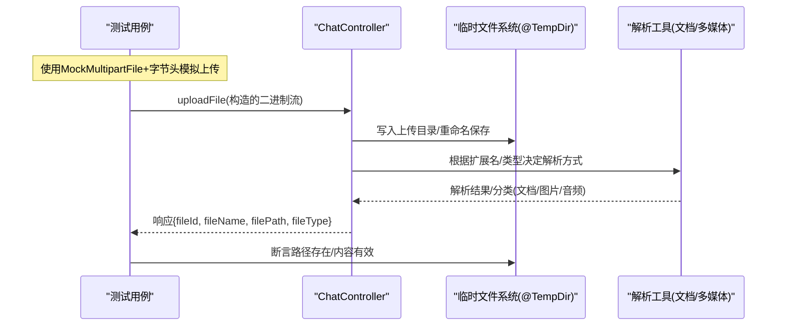
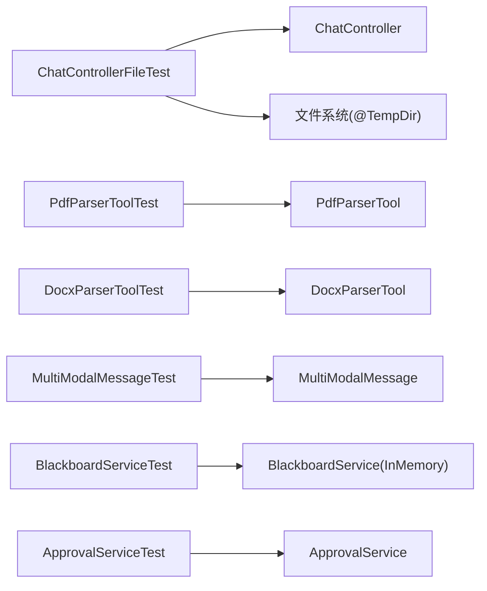

# 测试数据管理

<cite>
**本文引用的文件**
- [application-test.yml](file://src/test/resources/application-test.yml)
- [application.yml](file://src/main/resources/application.yml)
- [ChatControllerFileTest.java](file://src/test/java/com/skloda/agentscope/controller/ChatControllerFileTest.java)
- [PdfParserToolTest.java](file://src/test/java/com/skloda/agentscope/tool/PdfParserToolTest.java)
- [DocxParserToolTest.java](file://src/test/java/com/skloda/agentscope/tool/DocxParserToolTest.java)
- [MultiModalMessageTest.java](file://src/test/java/com/skloda/agentscope/model/MultiModalMessageTest.java)
- [WorkspaceInitializerTest.java](file://src/test/java/com/skloda/agentscope/harness/WorkspaceInitializerTest.java)
- [BlackboardServiceTest.java](file://src/test/java/com/skloda/agentscope/blackboard/BlackboardServiceTest.java)
- [ApprovalServiceTest.java](file://src/test/java/com/skloda/agentscope/service/ApprovalServiceTest.java)
- [ClasspathSkillRepositoryTest.java](file://src/test/java/com/skloda/agentscope/ClasspathSkillRepositoryTest.java)
</cite>

## 目录
1. [简介](#简介)
2. [项目结构](#项目结构)
3. [核心组件](#核心组件)
4. [架构总览](#架构总览)
5. [详细组件分析](#详细组件分析)
6. [依赖分析](#依赖分析)
7. [性能考虑](#性能考虑)
8. [故障排查指南](#故障排查指南)
9. [结论](#结论)
10. [附录](#附录)（如有需要）

## 简介
本文件围绕仓库中的单元测试与集成测试，总结并提炼一套“测试数据管理最佳实践”。内容覆盖：
- 生成策略：工厂式构造、随机化、边界值设计
- 隔离与清理：每用例隔离、事务回滚策略、文件临时目录隔离与清理
- 文件系统测试：模板文件准备、二进制文件处理
- 数据库测试数据：种子加载、版本化管理、迁移脚本（结合本项目当前配置说明）
- 脱敏方案：生产数据用于测试时的敏感信息处理
- 复用策略：共享、快照与按需生成

上述内容均基于仓库内现有测试代码、配置文件与实践得出。

## 项目结构
该仓库主要使用 JUnit 5 + Mockito 进行单测，文件类测试广泛采用临时目录隔离；没有显式的数据库事务注解或数据源初始化测试配置，默认启用的上下文排除了 DataSource 自动装配，因此数据库相关的数据层暂不涉及持久化状态。

图表来源
- [application-test.yml:1-8](file://src/test/resources/application-test.yml#L1-L8)
- [application.yml:13-23](file://src/main/resources/application.yml#L13-L23)

部分来源
- [application-test.yml:1-8](file://src/test/resources/application-test.yml#L1-L8)
- [application.yml:13-23](file://src/main/resources/application.yml#L13-L23)

## 核心组件
- 文件与二进制测试数据
  - 通过 JUnit 的 @TempDir 为每个测试用例提供干净的文件系统沙箱，避免用例间污染
  - 在测试中直接构造二进制头（如 PDF、DOCX、MP3 片段），仅验证识别逻辑与分类行为
- 内存态对象与事件数据
  - 使用 Mockito 创建轻量级 Mock，避免依赖外部系统（Agent、Hook、工具调用等）
  - 针对黑版图的多用户/会话场景，以内存状态校验隔离性与版本递增
- 配置隔离
  - test profile 下禁用 MCP 与 Demo，减少外部依赖（Node.js 等）对 CI 的不稳定影响

部分来源
- [ChatControllerFileTest.java:22-38](file://src/test/java/com/skloda/agentscope/controller/ChatControllerFileTest.java#L22-L38)
- [ChatControllerFileTest.java:49-83](file://src/test/java/com/skloda/agentscope/controller/ChatControllerFileTest.java#L49-L83)
- [PdfParserToolTest.java:20-37](file://src/test/java/com/skloda/agentscope/tool/PdfParserToolTest.java#L20-L37)
- [DocxParserToolTest.java:74-89](file://src/test/java/com/skloda/agentscope/tool/DocxParserToolTest.java#L74-L89)
- [MultiModalMessageTest.java:25-79](file://src/test/java/com/skloda/agentscope/model/MultiModalMessageTest.java#L25-L79)
- [BlackboardServiceTest.java:20-34](file://src/test/java/com/skloda/agentscope/blackboard/BlackboardServiceTest.java#L20-L34)
- [BlackboardServiceTest.java:110-133](file://src/test/java/com/skloda/agentscope/blackboard/BlackboardServiceTest.java#L110-L133)
- [ApprovalServiceTest.java:18-35](file://src/test/java/com/skloda/agentscope/service/ApprovalServiceTest.java#L18-L35)
- [application-test.yml:1-8](file://src/test/resources/application-test.yml#L1-L8)

## 架构总览
下图展示了典型“上传-识别-返回”流程中测试如何构造输入数据并断言结果：

图表来源
- [ChatControllerFileTest.java:49-83](file://src/test/java/com/skloda/agentscope/controller/ChatControllerFileTest.java#L49-L83)
- [ChatControllerFileTest.java:99-125](file://src/test/java/com/skloda/agentscope/controller/ChatControllerFileTest.java#L99-L125)
- [PdfParserToolTest.java:20-37](file://src/test/java/com/skloda/agentscope/tool/PdfParserToolTest.java#L20-L37)
- [DocxParserToolTest.java:27-54](file://src/test/java/com/skloda/agentscope/tool/DocxParserToolTest.java#L27-L54)

## 详细组件分析

### 工厂模式创建测试数据
- 二进制文件头构造：测试为 PDF、DOCX、图片、音频等提供极简二进制片段作为输入，确保不引入真实文件也能完成格式识别分支覆盖
- 模板与工作区初始化：通过初始化器复制内置模板到临时工作区，保证可重复创建的“样板数据”

部分来源
- [ChatControllerFileTest.java:49-83](file://src/test/java/com/skloda/agentscope/controller/ChatControllerFileTest.java#L49-L83)
- [WorkspaceInitializerTest.java:16-36](file://src/test/java/com/skloda/agentscope/harness/WorkspaceInitializerTest.java#L16-L36)

### 随机数据生成
- 在服务/处理器内部生成唯一 ID（如审批记录 id），测试断言其非空且长度合规，从而覆盖生成器的随机性约束
- 建议：若需更稳定的随机性对比，可在用例层固定种子或使用“伪随机但确定性”的工厂，以便回归可重现

部分来源
- [ApprovalServiceTest.java:37-46](file://src/test/java/com/skloda/agentscope/service/ApprovalServiceTest.java#L37-L46)

### 边界值测试数据
- 空/缺失文件：断言错误码与提示信息
- 路径穿越攻击：包含多层“../”、Windows 分隔符等非法路径应被拒绝
- 超大/异常头：利用有限头部验证分类与回退逻辑
- 并发/幂等：同键获取相同对象，清除后再次清除不应抛错

部分来源
- [ChatControllerFileTest.java:40-57](file://src/test/java/com/skloda/agentscope/controller/ChatControllerFileTest.java#L40-L57)
- [ChatControllerFileTest.java:127-146](file://src/test/java/com/skloda/agentscope/controller/ChatControllerFileTest.java#L127-L146)
- [PdfParserToolTest.java:20-37](file://src/test/java/com/skloda/agentscope/tool/PdfParserToolTest.java#L20-L37)
- [BlackboardServiceTest.java:142-154](file://src/test/java/com/skloda/agentscope/blackboard/BlackboardServiceTest.java#L142-L154)

### 测试数据隔离
- 文件系统隔离：所有文件读写均基于 @TempDir，测试结束后由 JUnit 自动清理；必要时在 setUp/tearDown 中还原系统属性（如临时目录）
- 内存态隔离：黑版图按 user+session 维度隔离，测试断言跨用户/会话数据互不可见
- 服务内缓存/计划任务：通过直接调用生命周期方法或注入时序断言，验证清理与过期行为

部分来源
- [ChatControllerFileTest.java:22-38](file://src/test/java/com/skloda/agentscope/controller/ChatControllerFileTest.java#L22-L38)
- [BlackboardServiceTest.java:110-133](file://src/test/java/com/skloda/agentscope/blackboard/BlackboardServiceTest.java#L110-L133)
- [ApprovalServiceTest.java:88-123](file://src/test/java/com/skloda/agentscope/service/ApprovalServiceTest.java#L88-L123)

### 事务回滚策略（在本项目的适用说明）
- 当前测试上下文中，DataSource 自动装配被全局排除，测试不会涉及事务型数据库操作
- 若未来引入数据库测试，建议使用@SpringBootTest + @Transactional(TestEntityManager等)，或在集成测试前用脚本/测试容器建库再回滚

部分来源
- [application.yml:13-23](file://src/main/resources/application.yml#L13-L23)
- [application-test.yml:1-8](file://src/test/resources/application-test.yml#L1-L8)

### 数据清理机制
- 文件型：@TempDir 天然支持用例结束后的目录清理；对于手动修改的系统属性（如临时目录）需在 tearDown 还原
- 内存型：服务提供 clear/remove 接口，测试验证幂等与清理有效性
- 定时/延迟清理：对过期数据执行清理时，通过断言不抛异常并确认旧条目已被移除

部分来源
- [ChatControllerFileTest.java:28-38](file://src/test/java/com/skloda/agentscope/controller/ChatControllerFileTest.java#L28-L38)
- [BlackboardServiceTest.java:142-154](file://src/test/java/com/skloda/agentscope/blackboard/BlackboardServiceTest.java#L142-L154)
- [ApprovalServiceTest.java:88-123](file://src/test/java/com/skloda/agentscope/service/ApprovalServiceTest.java#L88-L123)

### 文件系统测试数据（模板、二进制）
- 模板工作区初始化：从内置模板复制到临时工作区，保证每次运行都拥有一致的骨架
- 二进制处理：构造最小合法头/空页等极端样本，覆盖异常/扫描图/缺失文件分支
- 多模态消息：以临时文件为载体，验证图片/音频的编码与 MIME 推断

部分来源
- [WorkspaceInitializerTest.java:16-55](file://src/test/java/com/skloda/agentscope/harness/WorkspaceInitializerTest.java#L16-L55)
- [PdfParserToolTest.java:20-37](file://src/test/java/com/skloda/agentscope/tool/PdfParserToolTest.java#L20-L37)
- [MultiModalMessageTest.java:25-79](file://src/test/java/com/skloda/agentscope/model/MultiModalMessageTest.java#L25-L79)

### 数据库测试数据（种子、版本、迁移）
- 现状：默认上下文未启用数据库，因此当前仓库不包含数据库种子/迁移脚本的测试实践
- 建议：若新增数据库功能，可引入 TestData/Seed 脚本并按版本管理（如 V1__init.sql），并在集成测试启动时由 Flyway/Liquibase 执行

（本节为概念性建议，无直接源码依据，故不提供源码引用）

### 数据脱敏方案（生产数据用于测试）
- 实践建议：
  - 将真实数据放入“仅测试”资源中，并使用占位符替换；运行时通过环境变量注入测试密钥（如 DASHSCOPE_API_KEY）
  - 文件名/输出包含用户信息时进行去标识化处理（例如去除真实姓名，仅留代号）
  - 对外暴露的调试日志或报告中，过滤或删除敏感字段
- 本仓库示例：
  - Bank Invoice Agent 的模板与工具链可自动生成不含真实个人信息的文件名，便于演示与安全
  - API Key 通过环境变量注入，避免硬编码

部分来源
- [application.yml:28-36](file://src/main/resources/application.yml#L28-L36)

### 测试数据复用策略
- 共享：将公共的“工作区模板”与“技能/知识资源”放在受控位置，通过初始化器统一复制；多用例复用同一份“只读模板”，避免每个用例自建复杂结构
- 快照：对于复杂的黑版图文档状态，可按“初始快照 + Patch”方式推进，保持测试简短聚焦单一变更点
- 按需生成：仅在用例需要的地方生成二进制/文档/多媒体片段，避免全量预热导致启动变慢

部分来源
- [WorkspaceInitializerTest.java:16-55](file://src/test/java/com/skloda/agentscope/harness/WorkspaceInitializerTest.java#L16-L55)
- [BlackboardServiceTest.java:44-78](file://src/test/java/com/skloda/agentscope/blackboard/BlackboardServiceTest.java#L44-L78)
- [ClasspathSkillRepositoryTest.java:1-200](file://src/test/java/com/skloda/agentscope/ClasspathSkillRepositoryTest.java)

## 依赖分析
下图展示测试与各被测模块之间的关系及数据流向：

图表来源
- [ChatControllerFileTest.java:40-157](file://src/test/java/com/skloda/agentscope/controller/ChatControllerFileTest.java#L40-L157)
- [PdfParserToolTest.java:20-37](file://src/test/java/com/skloda/agentscope/tool/PdfParserToolTest.java#L20-L37)
- [DocxParserToolTest.java:27-89](file://src/test/java/com/skloda/agentscope/tool/DocxParserToolTest.java#L27-L89)
- [MultiModalMessageTest.java:25-79](file://src/test/java/com/skloda/agentscope/model/MultiModalMessageTest.java#L25-L79)
- [BlackboardServiceTest.java:20-172](file://src/test/java/com/skloda/agentscope/blackboard/BlackboardServiceTest.java#L20-L172)
- [ApprovalServiceTest.java:18-137](file://src/test/java/com/skloda/agentscope/service/ApprovalServiceTest.java#L18-L137)

部分来源
- [application-test.yml:1-8](file://src/test/resources/application-test.yml#L1-L8)
- [application.yml:13-23](file://src/main/resources/application.yml#L13-L23)

## 性能考虑
- 小样本优先：尽量用最小二进制头或最小文档满足分类与解析分支，降低 IO 成本
- 避免全局大资源：模板/知识文件按需复制，不要在全局 PreLoad 大量资源
- Mock 外部依赖：使用 Mockito 替换远端调用（Agent/Hook），避免网络抖动影响稳定性
- 并行安全：每个用例独立 @TempDir，避免并发冲突

（本节为通用指导，无具体源码依据）

## 故障排查指南
- 现象：CI 失败或环境缺少 Node.js
  - 检查测试配置是否启用了 MCP/Demo，当前已默认关闭以减少外部依赖
- 现象：测试偶发“路径不存在”
  - 确认使用的是 @TempDir 路径，且在 tearDown 中恢复系统属性
- 现象：文件下载断言失败（MIME/Disposition）
  - 确认传入的扩展名与实际文件一致；严格区分精确文件名与 fileId 下载模式
- 现象：多模态文件无法读取
  - 断言 fallback 路径与错误提示，优先检查临时文件是否存在

部分来源
- [application-test.yml:1-8](file://src/test/resources/application-test.yml#L1-L8)
- [ChatControllerFileTest.java:28-38](file://src/test/java/com/skloda/agentscope/controller/ChatControllerFileTest.java#L28-L38)
- [ChatControllerFileTest.java:99-125](file://src/test/java/com/skloda/agentscope/controller/ChatControllerFileTest.java#L99-L125)
- [MultiModalMessageTest.java:42-47](file://src/test/java/com/skloda/agentscope/model/MultiModalMessageTest.java#L42-L47)

## 结论
- 本项目测试数据以“就地构造 + 临时隔离”为主：二进制片段、工作区模板、内存状态，极大提升了可靠性与维护性
- 对 DB 的依赖当前已通过配置主动排除；后续如需接入数据层，建议遵循“种子版本化 + 迁移脚本 + 事务回滚”的组合策略
- 针对安全性（路径穿越、隐私数据），测试覆盖了关键边界与异常场景；持续保持“最小可用数据 + 强断言”的策略

## 附录
- 测试配置文件清单
  - application-test.yml：测试环境开关（禁用 MCP）
  - application.yml：默认应用配置（含排他项、模型、文件大小限制）

部分来源
- [application-test.yml:1-8](file://src/test/resources/application-test.yml#L1-L8)
- [application.yml:6-23](file://src/main/resources/application.yml#L6-L23)