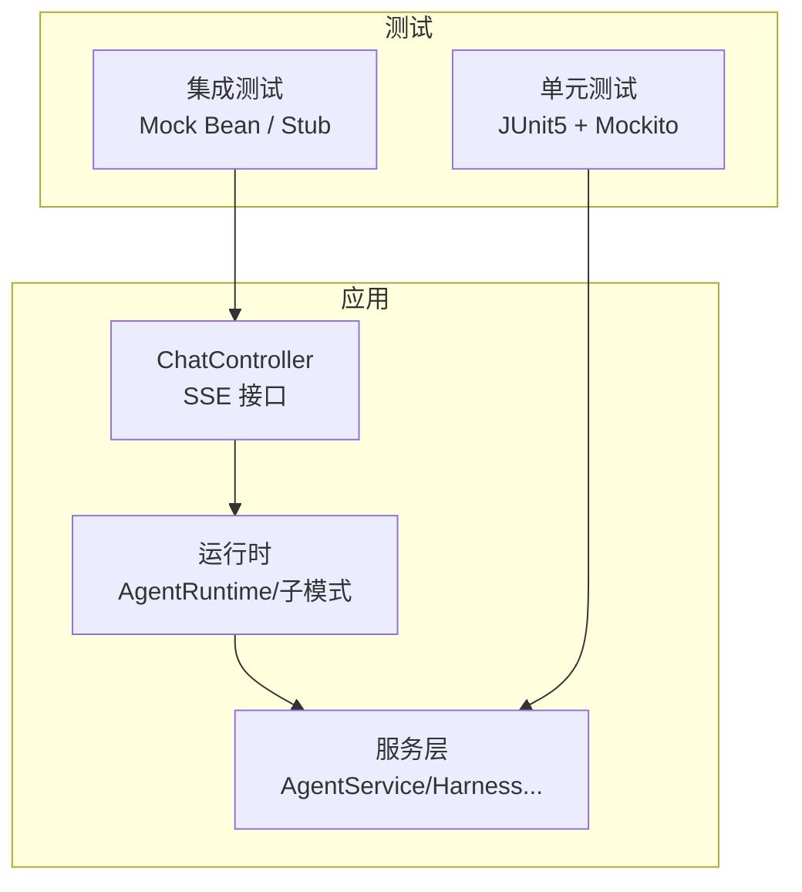
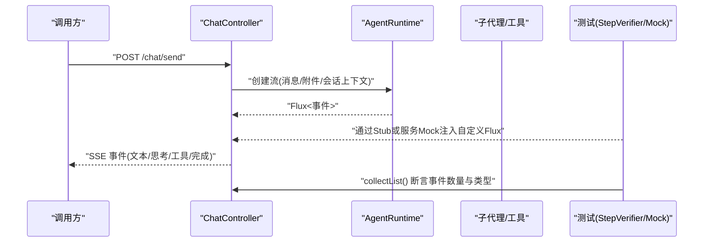
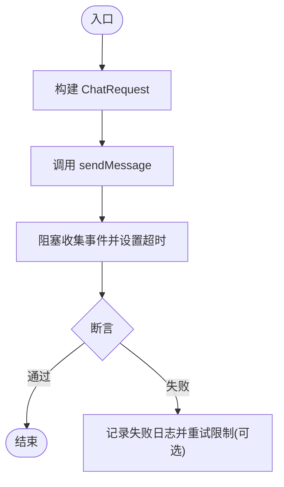
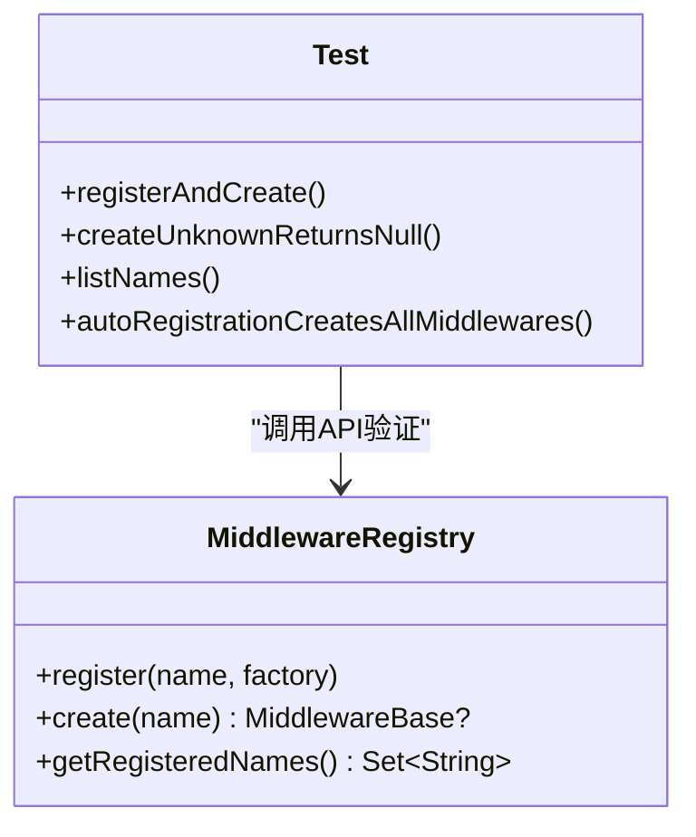
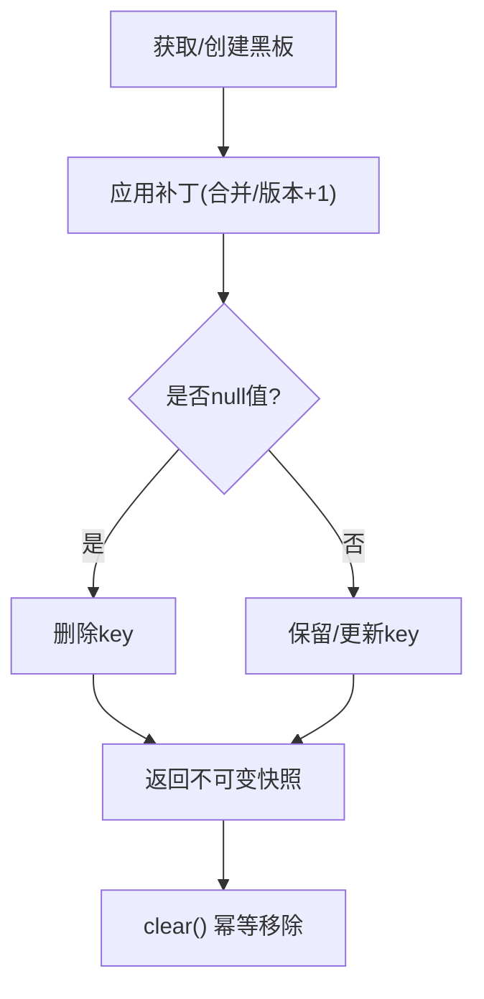
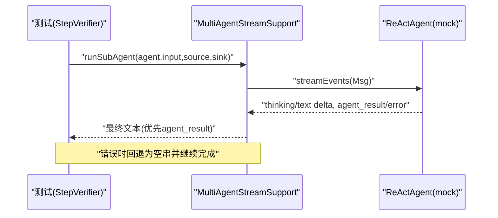
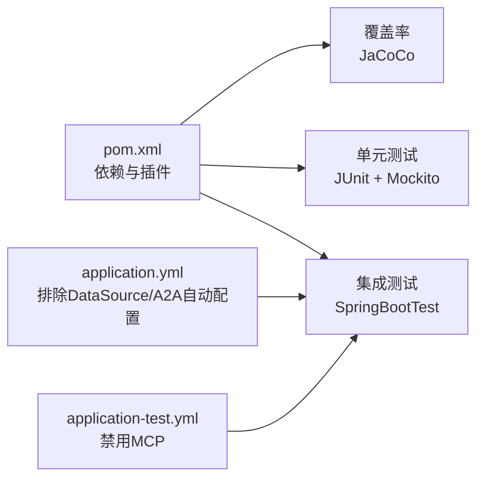

# 测试策略

<cite>
**本文引用的文件**
- [pom.xml](file://pom.xml)
- [application.yml](file://src/main/resources/application.yml)
- [application-test.yml](file://src/test/resources/application-test.yml)
- [ChatControllerStreamTest.java](file://src/test/java/com/skloda/agentscope/controller/ChatControllerStreamTest.java)
- [KnowledgeControllerTest.java](file://src/test/java/com/skloda/agentscope/controller/KnowledgeControllerTest.java)
- [BlackboardServiceTest.java](file://src/test/java/com/skloda/agentscope/blackboard/BlackboardServiceTest.java)
- [MultiAgentStreamSupportTest.java](file://src/test/java/com/skloda/agentscope/runtime/MultiAgentStreamSupportTest.java)
- [MiddlewareRegistryTest.java](file://src/test/java/com/skloda/agentscope/middleware/MiddlewareRegistryTest.java)
- [HarnessConfigIntegrationTest.java](file://src/test/java/com/skloda/agentscope/harness/HarnessConfigIntegrationTest.java)
- [SimpleToolsTest.java](file://src/test/java/com/skloda/agentscope/tool/SimpleToolsTest.java)
</cite>

## 目录
1. [引言](#引言)
2. [项目结构](#项目结构)
3. [核心组件](#核心组件)
4. [架构总览](#架构总览)
5. [详细组件分析](#详细组件分析)
6. [依赖关系分析](#依赖关系分析)
7. [性能考量](#性能考量)
8. [故障排查指南](#故障排查指南)
9. [结论](#结论)
10. [附录](#附录)

## 引言
本测试策略面向 AgentScope 演示项目的多形态工作负载：纯 Java 工具、Reactive SSE 流式接口、配置驱动的多智能体协作、可插拔中间件与外部服务（数据库、Redis、IM 通道等）。目标是为团队提供统一的测试设计、规范与实践指南，覆盖单元、集成与端到端三类测试，并给出覆盖率与质量门禁建议。

## 项目结构
仓库使用标准 Spring Boot + Maven 结构：
- 源代码位于 src/main/java，控制器与服务通过注解装配；Reactive SSE 返回 Flux
- 测试代码位于 src/test/java，遵循与主代码同包结构的命名约定
- 配置文件位于 src/main/resources，默认排除 DataSource 自动配置；测试专属配置在 application-test.yml
- 构建与测试由 pom.xml 管理，包含 spring-boot-starter-test 与 reactor-test

图表来源
- [ChatControllerStreamTest.java:20-39](file://src/test/java/com/skloda/agentscope/controller/ChatControllerStreamTest.java#L20-L39)
- [MultiAgentStreamSupportTest.java:49-109](file://src/test/java/com/skloda/agentscope/runtime/MultiAgentStreamSupportTest.java#L49-L109)
- [ApplicationTest:12-20](file://src/test/java/com/skloda/agentscope/AgentScopeDemoApplicationTest.java#L12-L20)

章节来源
- [pom.xml:28-187](file://pom.xml#L28-L187)
- [application.yml:1-24](file://src/main/resources/application.yml#L1-L24)
- [application-test.yml:1-9](file://src/test/resources/application-test.yml#L1-L9)

## 核心组件
围绕 AgentScope 的测试要点聚焦在以下方面：
- JUnit 5 + Mockito 编写单元用例，验证工具与领域逻辑
- Reactor + StepVerifier 对响应式流进行断言
- 以 @SpringBootTest + @MockitoBean/@Mock 实现控制器/服务集测
- 借助 InMemoryAgentStateStore 验证黑板状态隔离
- 通过测试 profile 关闭 MCP/数据源等外部依赖，保障本地执行稳定

关键实践依据
- 单元测试：工具类直接 new 或构造实例并使用 JUnit Assertions
  - SimpleTools 的数值、时间、异常分支校验见：[SimpleToolsTest.java:12-39](file://src/test/java/com/skloda/agentscope/tool/SimpleToolsTest.java#L12-L39)
- 响应式流：使用 StepVerifier 验证事件顺序与完成态
  - MultiAgentStreamSupport 的事件合并与错误兜底见：[MultiAgentStreamSupportTest.java:49-109](file://src/test/java/com/skloda/agentscope/runtime/MultiAgentStreamSupportTest.java#L49-L109)
- 集成测试：使用 @SpringBootTest + @MockitoBean 替换外部服务
  - 示例：应用启动注入知识服务 Mock，见：[AgentScopeDemoApplicationTest.java:12-20](file://src/test/java/com/skloda/agentscope/AgentScopeDemoApplicationTest.java#L12-L20)
  - 控制器 Mock 依赖：[KnowledgeControllerTest.java:21-45](file://src/test/java/com/skloda/agentscope/controller/KnowledgeControllerTest.java#L21-L45)
- 存储隔离：使用 InMemoryAgentStateStore 保证会话级隔离
  - 黑板读写、版本增长、清理、跨会话隔离见：[BlackboardServiceTest.java:22-171](file://src/test/java/com/skloda/agentscope/blackboard/BlackboardServiceTest.java#L22-L171)
- 配置解析：用对象构造方式校验 YAML 到配置的映射
  - Harness 双 Yaml 模式校验见：[HarnessConfigIntegrationTest.java:18-141](file://src/test/java/com/skloda/agentscope/harness/HarnessConfigIntegrationTest.java#L18-L141)

章节来源
- [SimpleToolsTest.java:12-39](file://src/test/java/com/skloda/agentscope/tool/SimpleToolsTest.java#L12-L39)
- [MultiAgentStreamSupportTest.java:49-109](file://src/test/java/com/skloda/agentscope/runtime/MultiAgentStreamSupportTest.java#L49-L109)
- [AgentScopeDemoApplicationTest.java:12-20](file://src/test/java/com/skloda/agentscope/AgentScopeDemoApplicationTest.java#L12-L20)
- [KnowledgeControllerTest.java:21-45](file://src/test/java/com/skloda/agentscope/controller/KnowledgeControllerTest.java#L21-L45)
- [BlackboardServiceTest.java:22-171](file://src/test/java/com/skloda/agentscope/blackboard/BlackboardServiceTest.java#L22-L171)
- [HarnessConfigIntegrationTest.java:18-141](file://src/test/java/com/skloda/agentscope/harness/HarnessConfigIntegrationTest.java#L18-L141)

## 架构总览
下图展示请求从控制器经运行时至子代理的响应式处理链路，以及测试如何拦截和断言关键阶段。

图表来源
- [ChatControllerStreamTest.java:20-39](file://src/test/java/com/skloda/agentscope/controller/ChatControllerStreamTest.java#L20-L39)
- [MultiAgentStreamSupportTest.java:49-109](file://src/test/java/com/skloda/agentscope/runtime/MultiAgentStreamSupportTest.java#L49-L109)

章节来源
- [ChatControllerStreamTest.java:20-39](file://src/test/java/com/skloda/agentscope/controller/ChatControllerStreamTest.java#L20-L39)

## 详细组件分析

### 组件A：控制器与流式响应测试
- 目标：验证 /chat/send 在运行时可能“永不结束”的情况下仍会正确释放资源并在完成后终止
- 要点：
  - 通过继承 AgentService 的 Stub 注入自定义 Flux，模拟 early done + 长期占用场景
  - 使用 assertTimeoutPreemptively 防止测试卡死
  - 使用 collectList().block() 收集并断言事件序列
- 推荐扩展：
  - 增加更多事件类型路径（tool_call、error、thinking）
  - 加入时序断言（如思考块先于结果）

章节来源
- [ChatControllerStreamTest.java:20-39](file://src/test/java/com/skloda/agentscope/controller/ChatControllerStreamTest.java#L20-L39)

图表来源
- [ChatControllerStreamTest.java:20-39](file://src/test/java/com/skloda/agentscope/controller/ChatControllerStreamTest.java#L20-L39)

### 组件B：中间件注册表测试
- 目标：确保中间件可按名称注册与创建，未知名称安全返回空
- 要点：
  - 注册多个中间件后验证 getRegisteredNames 集合
  - 使用自动注册名验证 create 能够产出具体实例
- 推荐扩展：
  - 添加错误/限流/审计等中间件的副作用验证（不实际执行外部系统）

章节来源
- [MiddlewareRegistryTest.java:17-52](file://src/test/java/com/skloda/agentscope/middleware/MiddlewareRegistryTest.java#L17-L52)

图表来源
- [MiddlewareRegistryTest.java:17-52](file://src/test/java/com/skloda/agentscope/middleware/MiddlewareRegistryTest.java#L17-L52)

### 组件C：共享黑板（Session Blackboard）测试
- 目标：验证 per-session 的状态写入、版本号单调递增、补丁合并、防御性拷贝与清理幂等性
- 要点：
  - 使用 InMemoryAgentStateStore 作为底层存储
  - 分别校验用户+会话维度的隔离性
  - 对 null patch value 删除 key 的行为进行测试
- 推荐扩展：
  - 并发补丁下的竞态/一致性检查（基于内存存储的确定性预期）

章节来源
- [BlackboardServiceTest.java:22-171](file://src/test/java/com/skloda/agentscope/blackboard/BlackboardServiceTest.java#L22-L171)

图表来源
- [BlackboardServiceTest.java:44-164](file://src/test/java/com/skloda/agentscope/blackboard/BlackboardServiceTest.java#L44-L164)

### 组件D：多智能体流式桥接（Sub-Agent）测试
- 目标：验证子代理事件转发、source 标签注入、最终文本来源优先级（AGENT_RESULT > 累积文本）、错误兜底
- 要点：
  - 使用 Mockito 模拟 ReActAgent.streamEvents 发出事件序列
  - 使用 StepVerifier 验证输出字符串完整流程
  - 捕获并记录错误事件，保证上游稳定性
- 推荐扩展：
  - 覆盖思考块、工具调用块、中断恢复等场景
  - 使用虚拟时间/慢流验证背压行为

章节来源
- [MultiAgentStreamSupportTest.java:49-109](file://src/test/java/com/skloda/agentscope/runtime/MultiAgentStreamSupportTest.java#L49-L109)

图表来源
- [MultiAgentStreamSupportTest.java:49-109](file://src/test/java/com/skloda/agentscope/runtime/MultiAgentStreamSupportTest.java#L49-L109)

## 依赖关系分析
- 测试依赖：JUnit 5、Mockito、Spring Test、Reactor Test
- 构建期插件：JaCoCo 用于覆盖率报告（见构建片段位置）
- 运行期依赖影响测试：
  - 默认排除了 DataSource 自动配置，使默认上下文不需要数据库即可启动
  - 测试 profile(application-test.yml) 禁用 MCP，避免 CI 环境缺少 Node.js
  - 可通过 profile-a2a/feishu/agui 等按需激活外部功能（需配套外部依赖）

图表来源
- [pom.xml:175-187](file://pom.xml#L175-L187)
- [pom.xml:223-239](file://pom.xml#L223-L239)
- [application.yml:13-24](file://src/main/resources/application.yml#L13-L24)
- [application-test.yml:1-9](file://src/test/resources/application-test.yml#L1-L9)

章节来源
- [pom.xml:175-187](file://pom.xml#L175-L187)
- [pom.xml:223-239](file://pom.xml#L223-L239)
- [application.yml:13-24](file://src/main/resources/application.yml#L13-L24)
- [application-test.yml:1-9](file://src/test/resources/application-test.yml#L1-L9)

## 性能考量
说明与建议在通用层面适用于本项目：
- 单元测试：避免网络/IO，尽量使用纯函数或内存数据，缩短单用例耗时
- 集成测试：使用内存数据库/内存状态存储（InMemory*），必要时使用嵌入式 Redis（本仓库未引入，可按需新增）
- 端到端测试：仅覆盖关键路径，使用轻量浏览器（如 Headless Chrome）控制最小交互次数
- 基准对比：将当前运行时的关键指标（SSE 首字时间、吞吐、错误率）纳入基线，后续回归比较
- 并发与背压：对 SSE 流使用 StepVerifier 的虚拟时间断言，验证极端延迟与丢帧下的健壮性

[本节为通用指导，不涉及特定源码]

## 故障排查指南
- 流式接口超时：确认是否过早 block 收集或使用合理断言超时（参考流式用例中的 assertTimeoutPreemptively）
- 外部依赖失败：
  - 数据库/缓存：确保未意外启用相关 profile，或在集成测试中显式启用对应 profile 与容器
  - MCP/IM/AG-UI：确保通过 application-test.yml 或 profile 屏蔽非必要模块
- 覆盖率：若 JaCoCo 未生成报告，检查 build 生命周期绑定是否正确
- 常见断言失败：
  - SSE 事件顺序错乱：结合 source 字段定位子代理分支
  - 黑板版本不一致：检查补丁是否为 null 键或删除语义是否符合预期
  - 中间件未生效：验证名称匹配与工厂是否被注册

章节来源
- [ChatControllerStreamTest.java:20-39](file://src/test/java/com/skloda/agentscope/controller/ChatControllerStreamTest.java#L20-L39)
- [application-test.yml:1-9](file://src/test/resources/application-test.yml#L1-L9)
- [pom.xml:223-239](file://pom.xml#L223-L239)

## 结论
当前仓库已具备完整的 JUnit5 + Mockito + Reactor Test 测试基础，并通过 InMemory 状态库与配置隔离实现了稳定可靠的单元/集成测试闭环。后续可按此策略逐步补齐端到端测试、性能基线与质量门禁，提升交付质量与回归效率。

## 附录

### 一、单元测试编写规范（JUnit 5）
- 命名与分组：按被测类/模块组织；测试类名以 XxxTest 结尾
- Mock 策略：
  - 对外部服务使用 @Mock/@MockitoBean，对内部依赖使用 when/thenReturn/doThrow
  - 对 ReActAgent 使用 Mockito 模拟 streamEvents 事件流
- 断言最佳实践：
  - 使用 assertEquals/assertTrue/assertThrows 等 JUnit5 断言
  - 对复杂结构使用 containsExactly 等方法
  - 对响应式流使用 StepVerifier 的 expectNext/verifyComplete 等
- 参考样例文件：
  - 简单工具断言：[SimpleToolsTest.java:12-39](file://src/test/java/com/skloda/agentscope/tool/SimpleToolsTest.java#L12-L39)
  - 流式响应断言：[ChatControllerStreamTest.java:20-39](file://src/test/java/com/skloda/agentscope/controller/ChatControllerStreamTest.java#L20-L39)
  - 事件桥接断言：[MultiAgentStreamSupportTest.java:49-109](file://src/test/java/com/skloda/agentscope/runtime/MultiAgentStreamSupportTest.java#L49-L109)
  - 注册表行为断言：[MiddlewareRegistryTest.java:17-52](file://src/test/java/com/skloda/agentscope/middleware/MiddlewareRegistryTest.java#L17-L52)

### 二、集成测试设计
- 数据库测试
  - 默认排除了 DataSource 自动配置；需要时使用独立 profile（如 mysql/postgresql）并配合嵌入式数据库或 TestContainer
  - 建议：每个测试用例在事务结束后回滚，或使用独立 schema
- 外部服务模拟
  - 使用 @MockitoBean/@Mock 注入 KnowledgeService、ObservabilityHook 等
  - 对 LLM/工具 API 用 stub 替代真实请求，仅验证输入/输出契约
- 配置隔离
  - 通过 application-test.yml 屏蔽 MCP/非必需特性
  - 用 @ActiveProfiles 指定不同环境配置

参考样例文件
- [KnowledgeControllerTest.java:21-45](file://src/test/java/com/skloda/agentscope/controller/KnowledgeControllerTest.java#L21-L45)
- [AgentScopeDemoApplicationTest.java:12-20](file://src/test/java/com/skloda/agentscope/AgentScopeDemoApplicationTest.java#L12-L20)
- [application-test.yml:1-9](file://src/test/resources/application-test.yml#L1-L9)

### 三、端到端测试执行流程
- 自动化框架：可使用 Selenium 或 Playwright 驱动浏览器
- 执行步骤：
  1) 启动应用（mvn spring-boot:run 或通过 TestRestTemplate 集成）
  2) 打开前端页面对应路由
  3) 登录/选择 Agent -> 发送消息 -> 观察 SSE 刷新与调试面板
  4) 验证 UI 展示、导出结果、错误提示
- 真实环境策略：
  - CI 中仅跑关键路径，真实模型与外部服务用 Mock 替代
  - 定期在 staging 环境执行真实 E2E 脚本，验证链路可用性

[本节为概念流程，不直接映射特定源码]

### 四、性能测试方法
- 压力测试：JMeter/Bombardier 对 /chat/send 发起高并发请求，统计 P95/P99 延迟与错误率
- 负载测试：阶梯增压观测系统拐点（CPU/内存/GC/IO）
- 性能基准对比：将本次运行的指标保存为基线，后续构建对比告警

[本节为通用指导，不涉及特定源码]

### 五、测试数据管理与环境隔离
- 生成：为工具/报表生成确定性的测试数据（固定随机种子、固定时间）
- 清理：每个用例结束后 clear/rollback，保证无副作用
- 隔离：会话级黑板由 InMemory 状态库维护，天然具备隔离；控制器/服务采用 Mock 隔离外部依赖

参考样例文件
- [BlackboardServiceTest.java:111-133](file://src/test/java/com/skloda/agentscope/blackboard/BlackboardServiceTest.java#L111-L133)

### 六、覆盖率要求与质量门禁
- 覆盖率目标建议：行覆盖率 ≥ 70%，分支覆盖率 ≥ 60%（可根据项目阶段调整）
- 门限量化：PR 禁止低于阈值提交
- 自动化：maven test 阶段自动生成覆盖率报告，CI 读取报告并阻断不达标变更

引用依据
- 覆盖率插件存在且绑定于 test 周期：[pom.xml:223-239](file://pom.xml#L223-L239)