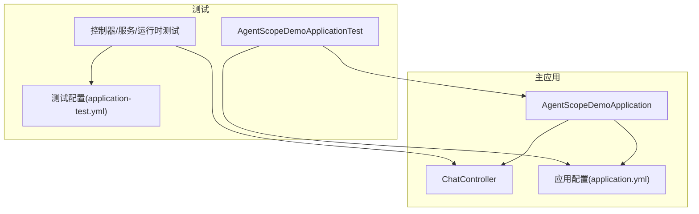
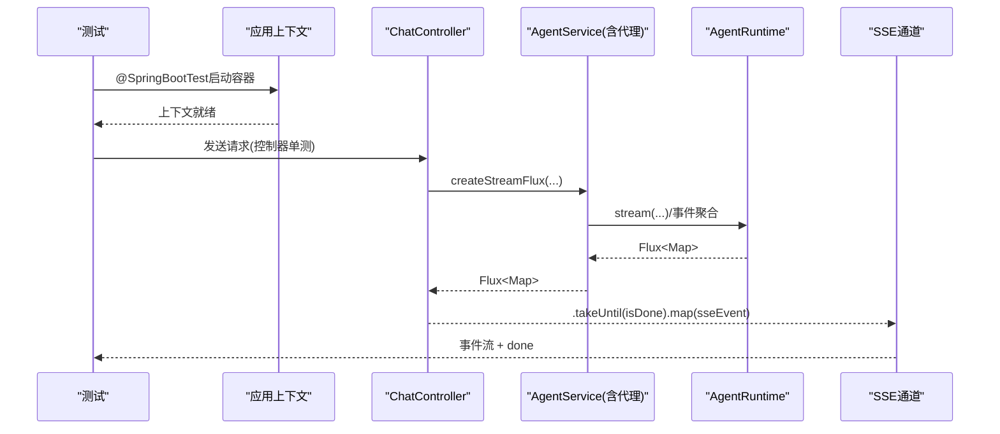
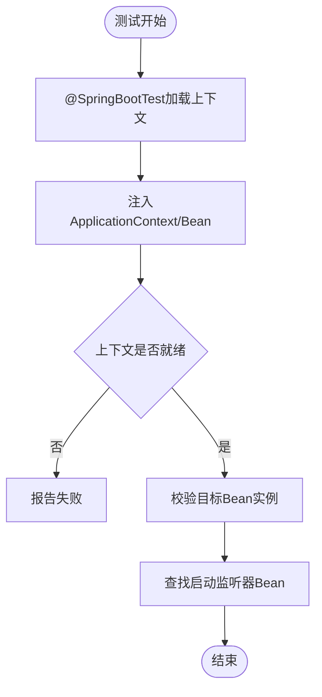
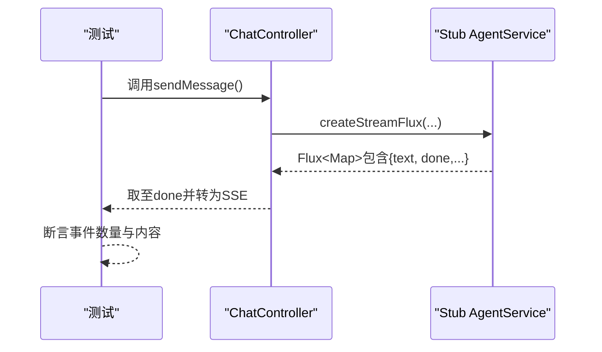
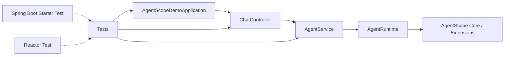

# Java集成测试

<cite>
**本文引用的文件**   
- [AgentScopeDemoApplication.java](file://src/main/java/com/skloda/agentscope/AgentScopeDemoApplication.java)
- [application.yml](file://src/main/resources/application.yml)
- [pom.xml](file://pom.xml)
- [application-test.yml](file://src/test/resources/application-test.yml)
- [AgentScopeDemoApplicationTest.java](file://src/test/java/com/skloda/agentscope/AgentScopeDemoApplicationTest.java)
- [KnowledgeControllerTest.java](file://src/test/java/com/skloda/agentscope/controller/KnowledgeControllerTest.java)
- [ChatControllerStreamTest.java](file://src/test/java/com/skloda/agentscope/controller/ChatControllerStreamTest.java)
- [ApprovalServiceTest.java](file://src/test/java/com/skloda/agentscope/service/ApprovalServiceTest.java)
- [MultiAgentStreamSupportTest.java](file://src/test/java/com/skloda/agentscope/runtime/MultiAgentStreamSupportTest.java)
- [MiddlewareRegistryTest.java](file://src/test/java/com/skloda/agentscope/middleware/MiddlewareRegistryTest.java)
- [ChatController.java](file://src/main/java/com/skloda/agentscope/controller/ChatController.java)
</cite>

## 目录
1. [简介](#简介)
2. [项目结构](#项目结构)
3. [核心组件](#核心组件)
4. [架构总览](#架构总览)
5. [详细组件分析](#详细组件分析)
6. [依赖分析](#依赖分析)
7. [性能注意事项](#性能注意事项)
8. [故障排查指南](#故障排查指南)
9. [结论](#结论)

## 简介
本指南聚焦于基于Spring Boot的Java集成测试实施，围绕容器中应用上下文启动、Bean装配与监听器注册、服务Mock化与外部依赖隔离、配置与Profile激活、Web全栈验证、数据库集成、异步流式响应与超时控制等主题，结合当前代码库中的真实测试用例与主程序结构，提供循序渐进、可复用的实践方法。内容既覆盖容器级端到端场景，也涵盖控制器与服务层测试，帮助在不同粒度下构建稳定可靠的测试套件。

## 项目结构
该项目采用典型的Spring Boot多模块分层结构：应用入口、控制器、服务、运行时与工具、配置与资源等；测试位于独立的test源集，覆盖单元、集成与容器化启动类测试。主要配置集中于application.yml与Profile配置文件；测试通过专用的application-test.yml屏蔽外部依赖（如MCP），确保CI内稳定执行。

图表来源
- [AgentScopeDemoApplication.java:11-17](file://src/main/java/com/skloda/agentscope/AgentScopeDemoApplication.java#L11-L17)
- [ChatController.java:47-153](file://src/main/java/com/skloda/agentscope/controller/ChatController.java#L47-L153)
- [application.yml:3-24](file://src/main/resources/application.yml#L3-L24)
- [AgentScopeDemoApplicationTest.java:12-29](file://src/test/java/com/skloda/agentscope/AgentScopeDemoApplicationTest.java#L12-L29)
- [application-test.yml:1-9](file://src/test/resources/application-test.yml#L1-L9)

章节来源
- [application.yml:3-24](file://src/main/resources/application.yml#L3-L24)
- [application-test.yml:1-9](file://src/test/resources/application-test.yml#L1-L9)
- [pom.xml:182-187](file://pom.xml#L182-L187)
- [AgentScopeDemoApplication.java:11-34](file://src/main/java/com/skloda/agentscope/AgentScopeDemoApplication.java#L11-L34)

## 核心组件
- 应用上下文与启动监听：应用入口中定义了启动完成监听器，在WebServer初始化事件时输出运行端口。测试用例以@SpringBootTest方式加载上下文，断言上下文有效并检查监听器Bean已注册。
- Web控制器与SSE流：聊天控制器返回Reactive流式SSE事件；相关测试使用内置stub验证流在完成标志到达后及时结束，并设置超时保证稳健性。
- 服务与中间件：服务层测试广泛使用Mockito构造依赖模拟数据；中间件注册表测试验证生命周期与方法链行为。
- 配置与Profile：默认配置排除DataSource自动配置与A2A自动配置；测试Profile关闭MCP以避免在CI中引入额外依赖。

章节来源
- [AgentScopeDemoApplication.java:19-34](file://src/main/java/com/skloda/agentscope/AgentScopeDemoApplication.java#L19-L34)
- [AgentScopeDemoApplicationTest.java:12-29](file://src/test/java/com/skloda/agentscope/AgentScopeDemoApplicationTest.java#L12-L29)
- [ChatController.java:122-153](file://src/main/java/com/skloda/agentscope/controller/ChatController.java#L122-L153)
- [ChatControllerStreamTest.java:20-39](file://src/test/java/com/skloda/agentscope/controller/ChatControllerStreamTest.java#L20-L39)
- [ApprovalServiceTest.java:18-137](file://src/test/java/com/skloda/agentscope/service/ApprovalServiceTest.java#L18-L137)
- [MiddlewareRegistryTest.java:17-52](file://src/test/java/com/skloda/agentscope/middleware/MiddlewareRegistryTest.java#L17-L52)
- [application.yml:13-24](file://src/main/resources/application.yml#L13-L24)
- [application-test.yml:1-9](file://src/test/resources/application-test.yml#L1-L9)

## 架构总览
下图展示了容器启动、SSE请求处理以及测试切入点的整体交互流程。应用启动后，监听器接收启动完成事件；当发起聊天请求时，控制器委托服务调用运行时并通过SSE流式返回事件；测试可通过@SpringBootTest或控制器单测配合依赖Mock来验证不同层级行为。

图表来源
- [AgentScopeDemoApplicationTest.java:12-29](file://src/test/java/com/skloda/agentscope/AgentScopeDemoApplicationTest.java#L12-L29)
- [ChatController.java:122-153](file://src/main/java/com/skloda/agentscope/controller/ChatController.java#L122-L153)

## 详细组件分析

### 容器化测试方案（@SpringBoot）
- 应用上下文加载测试：通过@SpringBootTest加载完整上下文，注入ApplicationContext进行存在性断言。适用于验证依赖注入与自动装配是否正确。
- Bean依赖注入验证：可在测试中注入目标Bean并校验其非空或状态。例如对服务组件进行注入验证，确保构造参数与条件装配成功。
- 启动监听器注册检查：应用内定义了StartupListener组件，测试中可通过ApplicationContext获取该类型Bean集合并进行数量断言，确保监听器注册生效。
- Profile与环境变量：测试可使用@TestPropertySource或ActiveProfiles切换配置；本项目测试Profile通过application-test.yml禁用MCP，避免外部依赖导致的测试不稳定。

图表来源
- [AgentScopeDemoApplicationTest.java:12-29](file://src/test/java/com/skloda/agentscope/AgentScopeDemoApplicationTest.java#L12-L29)
- [application-test.yml:1-9](file://src/test/resources/application-test.yml#L1-L9)
- [application.yml:13-24](file://src/main/resources/application.yml#L13-L24)

章节来源
- [AgentScopeDemoApplicationTest.java:12-29](file://src/test/java/com/skloda/agentscope/AgentScopeDemoApplicationTest.java#L12-L29)
- [application.yml:13-24](file://src/main/resources/application.yml#L13-L24)
- [application-test.yml:1-9](file://src/test/resources/application-test.yml#L1-L9)

### Mockito使用与实践
- 服务组件Mock化：对于控制器或服务之间的复杂依赖，使用@ExtendWith(MockitoExtension.class)、@Mock与@InjectMocks组合，将外部依赖替换为mock对象并注入到被控对象中，从而精准验证行为与返回值。
- 外部依赖隔离：服务层测试广泛通过Mockito构造Stub，隔离网络、AI模型、文件系统、消息队列等外部系统影响，保证测试快速、稳定与可重复。
- 测试数据模拟：借助Mockito.when/thenReturn或doAnswer定制返回值与副作用，用于模拟复杂业务对象的生成与处理。

示例参考
- 控制器单元测试中使用@Mock与@ExtendWith(MockitoExtension.class)，将KnowledgeService作为mock注入，断言控制器正确调用service并返回预期结果。
- 服务单元测试中通过Mockito.openMocks手动初始化mock，并对依赖进行打桩，验证服务的注册、查询与清理逻辑。

章节来源
- [KnowledgeControllerTest.java:18-48](file://src/test/java/com/skloda/agentscope/controller/KnowledgeControllerTest.java#L18-L48)
- [ApprovalServiceTest.java:22-63](file://src/test/java/com/skloda/agentscope/service/ApprovalServiceTest.java#L22-L63)
- [ApprovalServiceTest.java:72-123](file://src/test/java/com/skloda/agentscope/service/ApprovalServiceTest.java#L72-L123)

### 配置测试：应用配置加载与Profile激活
- 默认配置：application.yml中包含服务器端口、应用名称、分片上传大小、自动配置排除项（如DataSource与A2A自动配置）以及Agentscope相关属性（模型Provider、内存、工具、会话、知识、MCP）。
- Profile切换：通过application-test.yml等测试profile覆盖特定开关，如禁用MCP以减轻CI负担。生产环境或特殊场景可通过独立profile管理启用A2A、MySQL/PostgreSQL、Redis等功能。
- 环境变量处理：配置值可从环境变量注入（例如DashScope API Key可通过环境变量覆盖）。

章节来源
- [application.yml:3-89](file://src/main/resources/application.yml#L3-L89)
- [application-test.yml:1-9](file://src/test/resources/application-test.yml#L1-L9)

### Web环境测试：控制器与全栈测试
- 控制器单测（轻量）：适合验证路由与参数绑定、异常分支与返回结构。例如针对聊天控制器，使用stub服务实现流式输出，结合断言与超时保护验证SSE事件序列的正确性。
- 全栈测试（重）：对于需要端到端校验的场景，可基于@SpringBootTest与嵌入式Web服务器进行HTTP层面的验证（本项目未显式出现@WebMvcTest样例，但已有类似意图的单测模式可用于扩展）。

图表来源
- [ChatController.java:122-153](file://src/main/java/com/skloda/agentscope/controller/ChatController.java#L122-L153)
- [ChatControllerStreamTest.java:20-39](file://src/test/java/com/skloda/agentscope/controller/ChatControllerStreamTest.java#L20-L39)

章节来源
- [ChatControllerStreamTest.java:20-39](file://src/test/java/com/skloda/agentscope/controller/ChatControllerStreamTest.java#L20-L39)
- [ChatController.java:122-153](file://src/main/java/com/skloda/agentscope/controller/ChatController.java#L122-L153)

### 数据库集成测试：H2事务回滚与数据准备
- H2内存数据库：若需使用关系型存储进行集成测试，可添加H2依赖并在测试Profile下切换datasource，通过@Transactional在测试结束后回滚数据，保证测试间隔离。
- 数据准备与清理：使用SQL脚本或Repository在@BeforeEach/BeforeEach阶段插入必要数据，利用Spring的事务机制在测试方法结束后自动回滚。
- 适配本项目：默认exclude了DataSource自动配置以保证轻启动；当新增持久化需求时，推荐以测试Profile引入H2，保持默认上下文不感知数据库细节。

注意：本项目默认未启用数据库集成测试，实际落地时应按需启用对应Profile和依赖。

### 异步与流式测试：Reactive与CompletableFuture
- Reactive流测试：使用Reactor的StepVerifier或collectList(block())搭配超时断言，验证流何时结束、数据内容是否符合预期。测试中对“完成即停止”的语义进行了验证，即使底层流长期悬挂也能在上游触发done时结束。
- CompletableFuture等待：对于阻塞式API返回Future的场景，建议用future.get(timeout, unit)并捕获TimeoutException，结合重试或指数退避策略提升稳定性。
- 超时与容错：为所有网络与外部依赖的异步操作设置合理超时；在服务与控制器边界增加onErrorResume错误恢复路径，便于测试验证异常分支。

章节来源
- [ChatControllerStreamTest.java:20-39](file://src/test/java/com/skloda/agentscope/controller/ChatControllerStreamTest.java#L20-L39)
- [MultiAgentStreamSupportTest.java:48-109](file://src/test/java/com/skloda/agentscope/runtime/MultiAgentStreamSupportTest.java#L48-L109)

### 性能测试方法：JMH基准与负载测试
- JMH基准测试：针对热点链路（如SSE序列化、事件映射、文本聚合）编写微基准，测量吞吐与延迟分布，关注GC与锁竞争。
- 负载测试：使用JMeter、Gatling或k6对关键接口（如chat/send、knowledge相关接口）进行并发压测，监控QPS、延迟分位、错误率与资源使用。
- 并发访问测试：在容器化测试中，通过多线程并发请求并统计一致性，验证缓存与会话管理在并发下的正确性。

## 依赖分析

图表来源
- [pom.xml:175-187](file://pom.xml#L175-L187)
- [ChatController.java:47-70](file://src/main/java/com/skloda/agentscope/controller/ChatController.java#L47-L70)

章节来源
- [pom.xml:175-187](file://pom.xml#L175-L187)

## 性能注意事项
- 在容器启动后尽快禁用不必要的自动配置，以减少冷启动时间（默认配置已排除部分无关自动配置）。
- 对于流式处理，确保合理设置背压与超时，避免测试死锁或长时间挂起。
- 大数据量读取时注意分页与批处理，减少内存峰值；必要时在集成测试中限定数据集规模。
- 基准测试应在预热后进行，收集多次运行的稳定指标，避免首搭偏差。

## 故障排查指南
- 上下文加载失败：检查@Import/@EnableXXX注解与Profile是否开启；确认外部服务（如MCP/DB）通过Profile或Mock被隔离。
- Bean未找到：核实包扫描范围、条件装配（@ConditionalOnXxx）与环境变量/配置是否存在。
- SSE流无法结束：定位下游何时发出“done”或发生错误；必要时在测试中限制上游流的活跃期，或在控制器侧强制取至done。
- 测试耗时过长：缩小测试范围，优先做控制器/服务单测；全栈测试分批运行或跳过重场景。
- Mock未生效：确认使用了正确的Mock框架版本与注入方式，避免与Spring Test的自动装配冲突。

章节来源
- [ChatController.java:122-153](file://src/main/java/com/skloda/agentscope/controller/ChatController.java#L122-L153)
- [ChatControllerStreamTest.java:20-39](file://src/test/java/com/skloda/agentscope/controller/ChatControllerStreamTest.java#L20-L39)

## 结论
本项目已具备良好的测试基础：容器化上下文测试保证了装配正确性；控制器与服务层的Mock单测覆盖关键分支；流式SSE测试确保了时序与超时处理的可靠性；测试Profile有效隔离外部依赖。建议在后续迭代中逐步补充：
- H2事务化数据库集成测试（按Profile启用）
- 更全面的Web全栈测试（/chat/send等端点）
- 基准测试与负载测试套件（JMH/JMeter/k6）
- 统一的测试公共基类与数据准备工具

通过以上措施，可将测试覆盖度、稳定性与可维护性提升至工程级水准。