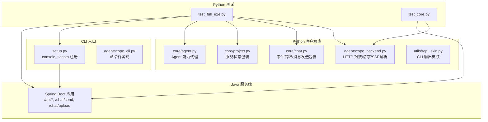
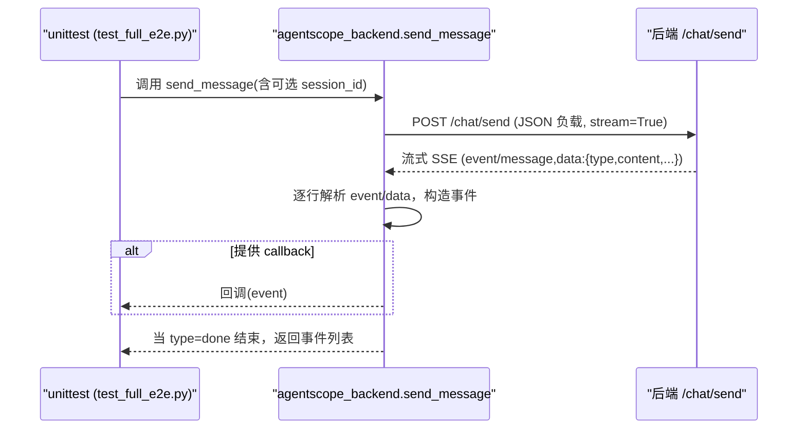
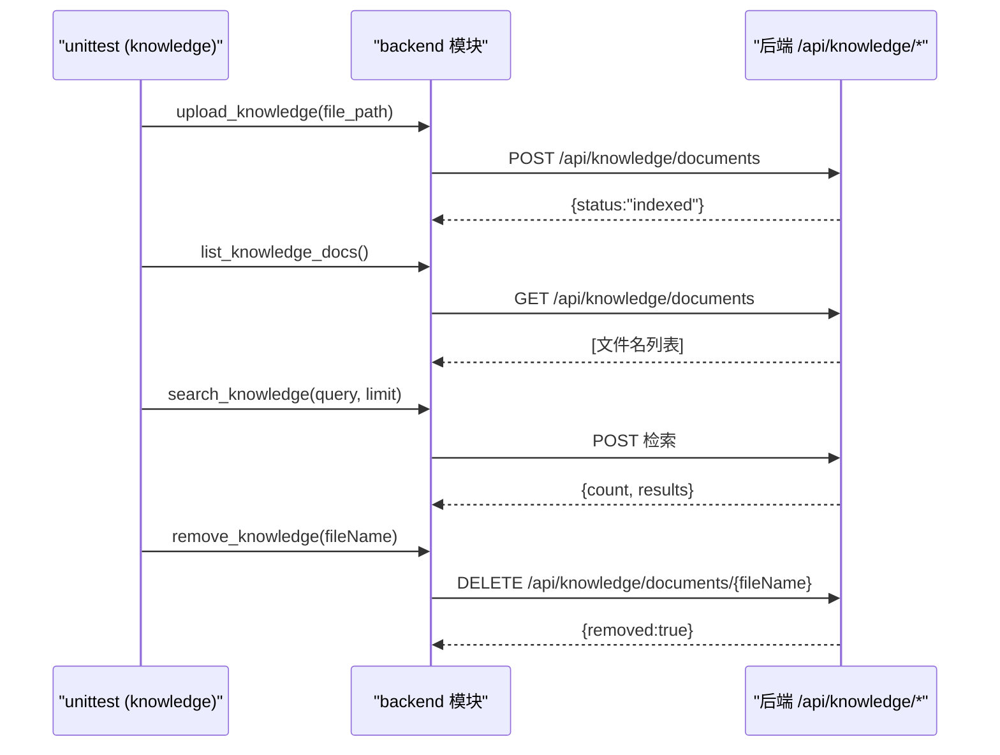
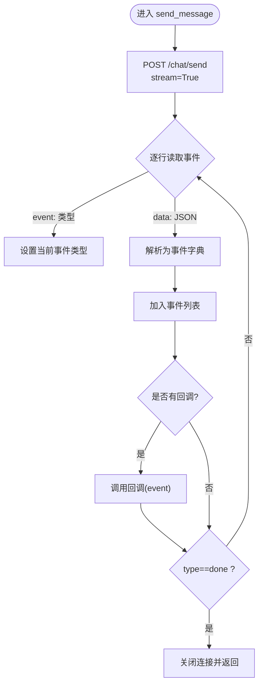
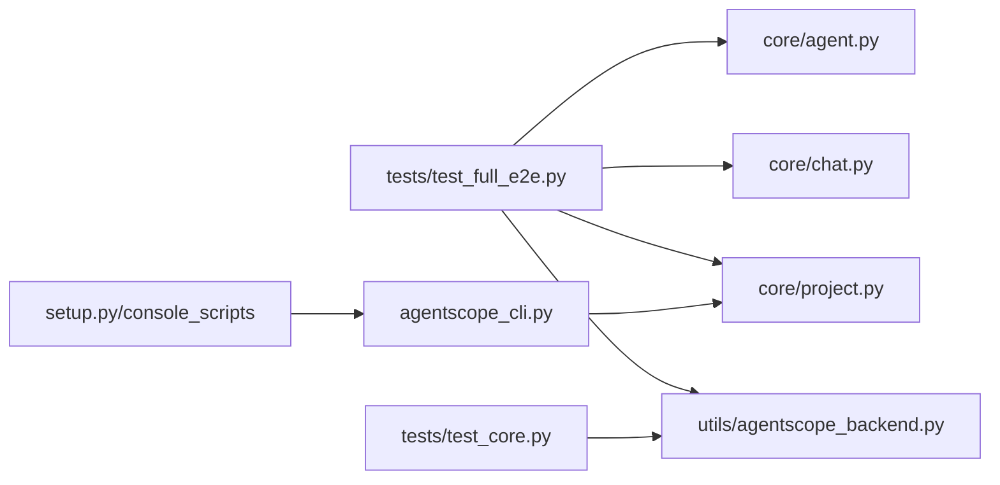

# Python HTTP接口测试

<cite>
**本文引用的文件**
- [test_full_e2e.py](file://agent-harness/cli_anything/agentscope/tests/test_full_e2e.py)
- [test_core.py](file://agent-harness/cli_anything/agentscope/tests/test_core.py)
- [TEST.md](file://agent-harness/cli_anything/agentscope/tests/TEST.md)
- [agentscope_backend.py](file://agent-harness/cli_anything/agentscope/utils/agentscope_backend.py)
- [chat.py](file://agent-harness/cli_anything/agentscope/core/chat.py)
- [project.py](file://agent-harness/cli_anything/agentscope/core/project.py)
- [agent.py](file://agent-harness/cli_anything/agentscope/core/agent.py)
- [repl_skin.py](file://agent-harness/cli_anything/agentscope/utils/repl_skin.py)
- [setup.py](file://agent-harness/setup.py)
- [README.md](file://README.md)
</cite>

## 目录
1. [介绍](#介绍)
2. [项目结构](#项目结构)
3. [核心组件](#核心组件)
4. [架构总览](#架构总览)
5. [详细组件分析](#详细组件分析)
6. [依赖关系分析](#依赖关系分析)
7. [性能注意事项](#性能注意事项)
8. [故障排查指南](#故障排查指南)
9. [结论](#结论)
10. [附录](#附录)

## 介绍
本指南面向需要在 AgentScope Demo 服务之上构建端到端（E2E）HTTP 接口测试的工程师。基于 test_full_e2e.py 的实现，结合单元测试与真实服务器交互，系统覆盖以下能力：
- 服务器连通性与状态检查
- Agent 操作（列举、详情）
- 会话生命周期管理（创建、列表、删除）
- 聊天消息发送（批量文本、流式响应、带会话上下文）
- 知识基操作（上传文档、索引验证、相似度搜索、文档删除）
- 文件上传测试（临时文件创建、上传校验、类型识别）
- 子进程 CLI 测试（命令运行、参数传递、输出解析）
同时给出测试环境准备要点、错误处理策略及网络异常重试建议。

## 项目结构
本仓库包含 Python CLI 工具集和 Java 后端服务：
- Python 客户端位于 agent-harness/cli_anything/agentscope，提供 HTTP 封装、CLI 入口、聊天事件解析等模块。
- E2E 和单元/混合测试集中在 tests 目录，分别覆盖集成链路和纯单元逻辑。
- README 描述了后端启动方式与访问地址，便于搭建测试环境。

**图表来源**
- [test_full_e2e.py:16-40](file://agent-harness/cli_anything/agentscope/tests/test_full_e2e.py#L16-L40)
- [agentscope_backend.py:31-41](file://agent-harness/cli_anything/agentscope/utils/agentscope_backend.py#L31-L41)
- [chat.py:9-40](file://agent-harness/cli_anything/agentscope/core/chat.py#L9-L40)
- [project.py:6-13](file://agent-harness/cli_anything/agentscope/core/project.py#L6-L13)
- [agent.py:9-30](file://agent-harness/cli_anything/agentscope/core/agent.py#L9-L30)
- [setup.py:20-24](file://agent-harness/setup.py#L20-L24)
- [README.md:71-83](file://README.md#L71-L83)

**章节来源**
- [test_full_e2e.py:16-40](file://agent-harness/cli_anything/agentscope/tests/test_full_e2e.py#L16-L40)
- [test_core.py:16-45](file://agent-harness/cli_anything/agentscope/tests/test_core.py#L16-L45)
- [README.md:71-83](file://README.md#L71-L83)

## 核心组件
- 服务端连通检测与环境变量：BASE_URL 通过环境变量 AGENTSCOPE_BASE_URL 配置；server_status 用于健康检查。
- Agent 能力：list_agents 获取全部 Agent，get_agent 获取指定 Agent 详情。
- 会话管理：create_session/list_sessions/delete_session，完成会话生命周期。
- 聊天发送：send_message 支持流式 SSE，回调可实时接收事件；extract_text 聚合文本。
- 知识操作：upload_knowledge/list_knowledge_docs/search_knowledge/remove_knowledge 完成文档上传、索引验证、检索、删除。
- 文件上传：upload_file 支持二进制文件上传并返回类型标识。
- CLI 子系统：_resolve_cli 动态定位命令行，TestCLISubprocess 用 subprocess 启动进程并传递 BASE_URL。

关键职责边界：
- agentscope_backend.py：HTTP 客户端，负责 URL 拼接、请求、SSE 解析、异常归一化。
- core/chat.py：事件提取与便捷方法，屏蔽底层细节。
- test_*：编排场景、断言业务结果、模拟或对接真实服务。

**章节来源**
- [agentscope_backend.py:10-41](file://agent-harness/cli_anything/agentscope/utils/agentscope_backend.py#L10-L41)
- [agentscope_backend.py:44-76](file://agent-harness/cli_anything/agentscope/utils/agentscope_backend.py#L44-L76)
- [agentscope_backend.py:79-141](file://agent-harness/cli_anything/agentscope/utils/agentscope_backend.py#L79-L141)
- [agentscope_backend.py:180-195](file://agent-harness/cli_anything/agentscope/utils/agentscope_backend.py#L180-L195)
- [chat.py:9-46](file://agent-harness/cli_anything/agentscope/core/chat.py#L9-L46)
- [test_full_e2e.py:44-90](file://agent-harness/cli_anything/agentscope/tests/test_full_e2e.py#L44-L90)
- [test_full_e2e.py:93-168](file://agent-harness/cli_anything/agentscope/tests/test_full_e2e.py#L93-L168)

## 架构总览
下图展示从 unittest 到后端服务的调用序列，包括流式 SSE 的处理闭环与回调机制。

**图表来源**
- [agentscope_backend.py:79-141](file://agent-harness/cli_anything/agentscope/utils/agentscope_backend.py#L79-L141)
- [test_full_e2e.py:93-135](file://agent-harness/cli_anything/agentscope/tests/test_full_e2e.py#L93-L135)

此外，知识操作的典型调用链如下：

**图表来源**
- [test_full_e2e.py:137-168](file://agent-harness/cli_anything/agentscope/tests/test_full_e2e.py#L137-L168)
- [agentscope_backend.py:198-210](file://agent-harness/cli_anything/agentscope/utils/agentscope_backend.py#L198-L210)

**章节来源**
- [agentscope_backend.py:79-141](file://agent-harness/cli_anything/agentscope/utils/agentscope_backend.py#L79-L141)
- [agentscope_backend.py:198-210](file://agent-harness/cli_anything/agentscope/utils/agentscope_backend.py#L198-L210)
- [test_full_e2e.py:137-168](file://agent-harness/cli_anything/agentscope/tests/test_full_e2e.py#L137-L168)

## 详细组件分析

### 服务器可用性检测与环境配置
- 使用 _server_available 尝试请求 /api/agents 检查可达性，避免无服务时盲目执行 E2E。
- BASE_URL 来自环境变量 AGENTSCOPE_BASE_URL，默认 http://localhost:8080。
- server_status 返回统一状态字段，便于判断“ok/offline/error”。

最佳实践
- CI 中启用超时控制和重试；若服务不可用则自动跳过测试用例。
- 在本地调试前确认后端已通过 mvn spring-boot:run 启动。

**章节来源**
- [test_full_e2e.py:16-40](file://agent-harness/cli_anything/agentscope/tests/test_full_e2e.py#L16-L40)
- [agentscope_backend.py:10-41](file://agent-harness/cli_anything/agentscope/utils/agentscope_backend.py#L10-L41)
- [README.md:71-83](file://README.md#L71-L83)

### Agent 操作测试
- 列出 Agent：assert 非空列表且每个元素具备必要字段（如 agentId、name）。
- 查询单个 Agent：按 ID 获取并校验关键字段（如 modelName）。

注意
- 若后端未暴露对应 Agent，需调整 BaseURL 或启用相应配置文件后再跑测试。

**章节来源**
- [test_full_e2e.py:53-70](file://agent-harness/cli_anything/agentscope/tests/test_full_e2e.py#L53-L70)
- [agentscope_backend.py:44-55](file://agent-harness/cli_anything/agentscope/utils/agentscope_backend.py#L44-L55)

### 会话生命周期测试
- 创建会话 -> 列出会话（验证 ID 存在）-> 删除会话（验证 deleted 标志）。
- 适用于验证会话隔离与持久化的基本链路。

**章节来源**
- [test_full_e2e.py:73-90](file://agent-harness/cli_anything/agentscope/tests/test_full_e2e.py#L73-L90)
- [agentscope_backend.py:58-76](file://agent-harness/cli_anything/agentscope/utils/agentscope_backend.py#L58-L76)

### 聊天消息发送（批量/流式/带会话）
- 批量文本：直接发送消息并收集所有事件，利用 extract_text 汇总文本。
- 流式响应：传入 callback 累积 text 事件。
- 会话上下文：创建 session_id 并在请求中附带，保障多轮对话一致性。

SSE 解析流程（关键算法）

**图表来源**
- [agentscope_backend.py:79-141](file://agent-harness/cli_anything/agentscope/utils/agentscope_backend.py#L79-L141)

**章节来源**
- [test_full_e2e.py:93-135](file://agent-harness/cli_anything/agentscope/tests/test_full_e2e.py#L93-L135)
- [agentscope_backend.py:79-141](file://agent-harness/cli_anything/agentscope/utils/agentscope_backend.py#L79-L141)
- [chat.py:43-46](file://agent-harness/cli_anything/agentscope/core/chat.py#L43-L46)

### 知识操作测试
- 上传文档：写入临时文件，调用 upload_knowledge，断言 status 为已索引。
- 列表校验：list_knowledge_docs 包含预期文件名。
- 相似度搜索：search_knowledge 返回 count>0 证明检索可用。
- 删除文档：remove_knowledge 返回 removed=true 清理数据。

文件生命周期与测试组织
- 使用 setUpClass/tearDownClass 管理临时目录与文件，避免污染宿主环境。

**章节来源**
- [test_full_e2e.py:137-168](file://agent-harness/cli_anything/agentscope/tests/test_full_e2e.py#L137-L168)

### 文件上传测试
- 创建 .txt 临时文件并通过 upload_file 上传，断言 fileId、fileType="document"。
- 验证服务端对上传文件的类型识别与返回结构。

**章节来源**
- [test_full_e2e.py:171-185](file://agent-harness/cli_anything/agentscope/tests/test_full_e2e.py#L171-L185)
- [agentscope_backend.py:180-195](file://agent-harness/cli_anything/agentscope/utils/agentscope_backend.py#L180-L195)

### 子进程 CLI 测试方法
- _resolve_cli 根据 PATH 查找已安装命令，否则回退到 python -m 模式，以适配开发/安装两种环境。
- TestCLISubprocess 通过 subprocess.run 启动 CLI，注入 AGENTSCOPE_BASE_URL，并验证输出（例如 --help 成功）。

扩展思路
- 可扩展更多 CLI 子命令的子进程断言，如 server status、agent list、session 与 chat 输出的结构化解析。

**章节来源**
- [test_full_e2e.py:188-212](file://agent-harness/cli_anything/agentscope/tests/test_full_e2e.py#L188-L212)
- [setup.py:20-24](file://agent-harness/setup.py#L20-L24)

### 单元测试补充
- test_core.py 通过 mock 隔离 HTTP，覆盖 base_url 解析、服务状态、Agent、会话、消息流、知识、技能/工具信息等。
- 适合在无网或离线环境中稳定回归核心逻辑。

**章节来源**
- [test_core.py:16-45](file://agent-harness/cli_anything/agentscope/tests/test_core.py#L16-L45)
- [test_core.py:81-130](file://agent-harness/cli_anything/agentscope/tests/test_core.py#L81-L130)
- [test_core.py:133-185](file://agent-harness/cli_anything/agentscope/tests/test_core.py#L133-L185)
- [test_core.py:187-196](file://agent-harness/cli_anything/agentscope/tests/test_core.py#L187-L196)

## 依赖关系分析
- E2E 与单元测试共同依赖 agentscope_backend 提供的 HTTP 客户端。
- E2E 依赖真实后端；单元测试通过 mock 阻断真实网络。
- core/chat 为上层 UI/CLI 提供事件提取简化 API。
- CLI 注册由 setup.py 的 entry_points 决定，便于统一入口调用。

**图表来源**
- [setup.py:20-24](file://agent-harness/setup.py#L20-L24)
- [agentscope_backend.py:10-41](file://agent-harness/cli_anything/agentscope/utils/agentscope_backend.py#L10-L41)
- [chat.py:1-40](file://agent-harness/cli_anything/agentscope/core/chat.py#L1-L40)
- [project.py:6-13](file://agent-harness/cli_anything/agentscope/core/project.py#L6-L13)
- [agent.py:9-30](file://agent-harness/cli_anything/agentscope/core/agent.py#L9-L30)

**章节来源**
- [setup.py:20-24](file://agent-harness/setup.py#L20-L24)
- [agentscope_backend.py:10-41](file://agent-harness/cli_anything/agentscope/utils/agentsope_backend.py#L10-L41)

## 性能注意事项
- SSE 长连接耗时可能较长，send_message 默认超时较长以容纳大模型推理；测试应避免过多并发影响后端性能。
- 大规模知识检索或上传建议在本地小批量先行验证，再扩展到完整流水线。
- 建议在测试套件中加入单次运行时长上限与幂等清理步骤（如删除会话/文档）。

[本节为通用指导，不直接分析具体代码文件]

## 故障排查指南
常见问题与建议
- 服务端不可达：
  - 使用 server_status 判断在线状态；若 offline，先启动后端服务。
  - 确保 AGENTSCOPE_BASE_URL 指向正确地址。
- 超时失败：
  - 增大请求超时或分片发送；检查网络与后端负载。
- 权限/认证：
  - 如需鉴权，需在 BASE_URL 指向的服务端启用并更新测试环境的鉴权参数。
- 资源未清理：
  - 知识文件与会话在 tearDown 中进行清理，避免后续用例受历史数据干扰。
- CLI 命令找不到：
  - 通过 CLI_ANYTHING_FORCE_INSTALLED=1 强制要求已安装命令；或者确保 PATH 正确或使用 python -m 回退逻辑。

相关实现参考
- 错误处理统一在 _handle_error 与 backend 层的 requests 异常转换中体现。
- REPL Skin 提供友好的错误/成功提示。

**章节来源**
- [agentscope_backend.py:17-41](file://agent-harness/cli_anything/agentscope/utils/agentscope_backend.py#L17-L41)
- [agentscope_cli.py:29-38](file://agent-harness/cli_anything/agentscope/agentscope_cli.py#L29-L38)
- [repl_skin.py:106-178](file://agent-harness/cli_anything/agentscope/utils/repl_skin.py#L106-L178)

## 结论
本方案以 E2E 为核心、单元测试为支撑，形成对 HTTP 接口的完整回归保障。通过明确的环境变量、健壮的事件解析与丰富的测试场景，可实现对 Agent、会话、聊天、知识与文件的全链路验证。建议将 E2E 放入有后端的 CI 环境，单元测试常驻本地/CI，形成双轨质量门。

## 附录

### 测试环境准备清单
- 启动后端服务
  - 安装 Java/Maven，配置 DASHSCOPE_API_KEY。
  - 执行 mvn spring-boot:run，访问 http://localhost:8080。
- 环境变量
  - AGENTSCOPE_BASE_URL：指向后端地址。
- 测试数据管理
  - 使用 tempfile 创建临时文件并在用例结束后清理。
  - 会话与知识库资源在执行前后尽量保持幂等状态（创建即删）。

**章节来源**
- [README.md:71-83](file://README.md#L71-L83)
- [test_full_e2e.py:137-168](file://agent-harness/cli_anything/agentscope/tests/test_full_e2e.py#L137-L168)