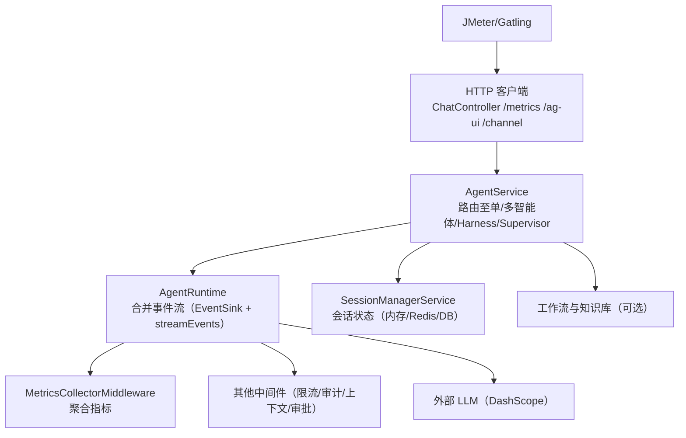
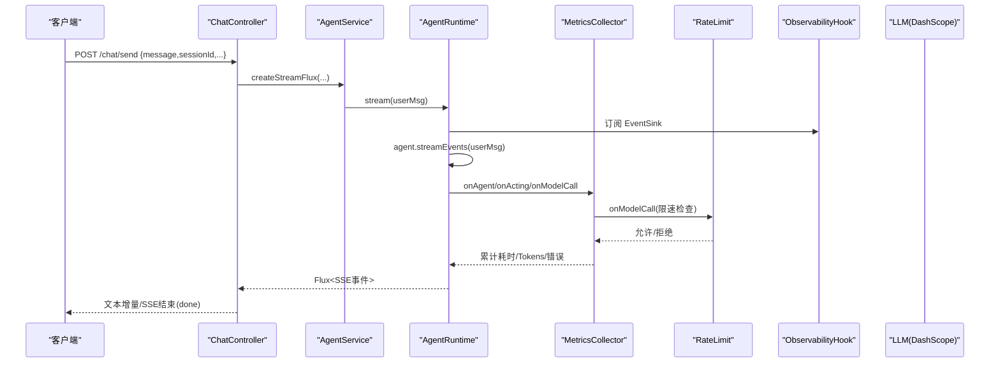
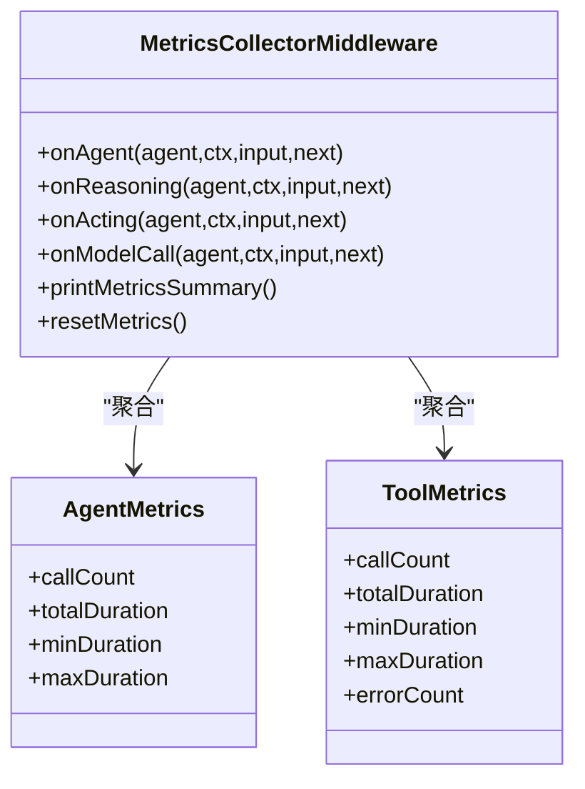

# 性能和负载测试

<cite>
**本文引用的文件**
- [pom.xml](file://pom.xml)
- [application.yml](file://src/main/resources/application.yml)
- [application-redis.yml](file://src/main/resources/application-redis.yml)
- [application-mysql.yml](file://src/main/resources/application-mysql.yml)
- [application-postgresql.yml](file://src/main/resources/application-postgresql.yml)
- [ChatController.java](file://src/main/java/com/skloda/agentscope/controller/ChatController.java)
- [MetricsController.java](file://src/main/java/com/skloda/agentscope/controller/MetricsController.java)
- [AgentService.java](file://src/main/java/com/skloda/agentscope/service/AgentService.java)
- [AgentRuntime.java](file://src/main/java/com/skloda/agentscope/runtime/AgentRuntime.java)
- [MultiAgentStreamSupport.java](file://src/main/java/com/skloda/agentscope/runtime/MultiAgentStreamSupport.java)
- [MetricsCollectorMiddleware.java](file://src/main/java/com/skloda/agentscope/middleware/MetricsCollectorMiddleware.java)
- [RateLimitMiddleware.java](file://src/main/java/com/skloda/agentscope/middleware/RateLimitMiddleware.java)
- [ObservabilityHook.java](file://src/main/java/com/skloda/agentscope/hook/ObservabilityHook.java)
- [SessionManagerService.java](file://src/main/java/com/skloda/agentscope/service/SessionManagerService.java)
</cite>

## 目录
1. [引言](#引言)
2. [项目结构](#项目结构)
3. [核心组件](#核心组件)
4. [架构总览](#架构总览)
5. [详细组件分析](#详细组件分析)
6. [依赖分析](#依赖分析)
7. [性能考虑](#性能考虑)
8. [故障排查指南](#故障排查指南)
9. [结论](#结论)
10. [附录](#附录)

## 引言
本指南面向使用 JMeter 或 Gatling 对 AgentScope Java 演示项目执行并发用户模拟、请求压力与吞吐基准、响应时间监控，并基于内置可观测能力进行 LLMOps 维度的性能评估：包括模型调用延迟、流式响应优化、队列与连接池配置验证，以及水平扩展与负载均衡场景下的分布式性能评估。文档提供从环境准备、脚本编排、指标采集到回归趋势报告的完整落地方法。

## 项目结构
本项目为 Spring Boot 3 + Reactor 非阻塞 API，提供聊天消息 SSE 流和 AG-UI/A2A/Feishu 等协议端点；默认禁用数据库自动配置，支持通过 profile 切换 Redis/MySQL/PostgreSQL 的分布式会话存储；内置指标中间件与控制台输出，支持成本估算、工具与模型调用统计、错误率追踪。

图表来源
- [ChatController.java:122-153](file://src/main/java/com/skloda/agentscope/controller/ChatController.java#L122-L153)
- [AgentService.java:140-177](file://src/main/java/com/skloda/agentscope/service/AgentService.java#L140-L177)
- [AgentRuntime.java:67-142](file://src/main/java/com/skloda/agentscope/runtime/AgentRuntime.java#L67-L142)
- [MetricsCollectorMiddleware.java:50-161](file://src/main/java/com/skloda/agentscope/middleware/MetricsCollectorMiddleware.java#L50-L161)
- [SessionManagerService.java:75-145](file://src/main/java/com/skloda/agentscope/service/SessionManagerService.java#L75-L145)

章节来源
- [application.yml:1-90](file://src/main/resources/application.yml#L1-L90)
- [pom.xml:28-188](file://pom.xml#L28-L188)

## 核心组件
- ChatController：对外暴露聊天发送 SSE 接口、文件上传、HITL 批准回调；所有请求进入 AgentService。
- AgentService：根据 agent 类型/配置路由到普通 Runtime、Harness/Supervisor 路径；负责会话与运行记录。
- AgentRuntime：统一的事件流容器，合并 EventSink 与 agent.streamEvents()，处理终止与恢复。
- MetricsCollectorMiddleware：在 agent/acting/model 各阶段收集工具耗时、token 用量、错误次数与成本估算。
- RateLimitMiddleware：按分钟窗口限制模型调用次数。
- ObservabilityHook：将多智能体管线事件转发到 EventSink，形成统一前端事件集。
- SessionManagerService：维护会话及底层状态存储迁移（内存/Redis/DB）。
- MetricsController：暴露 metrics 控制台打印与重置接口。

章节来源
- [ChatController.java:44-153](file://src/main/java/com/skloda/agentscope/controller/ChatController.java#L44-L153)
- [AgentService.java:26-177](file://src/main/java/com/skloda/agentscope/service/AgentService.java#L26-L177)
- [AgentRuntime.java:26-142](file://src/main/java/com/skloda/agentscope/runtime/AgentRuntime.java#L26-L142)
- [MetricsCollectorMiddleware.java:21-161](file://src/main/java/com/skloda/agentscope/middleware/MetricsCollectorMiddleware.java#L21-L161)
- [RateLimitMiddleware.java:16-53](file://src/main/java/com/skloda/agentscope/middleware/RateLimitMiddleware.java#L16-L53)
- [ObservabilityHook.java:16-67](file://src/main/java/com/skloda/agentscope/hook/ObservabilityHook.java#L16-L67)
- [SessionManagerService.java:23-198](file://src/main/java/com/skloda/agentscope/service/SessionManagerService.java#L23-L198)
- [MetricsController.java:15-57](file://src/main/java/com/skloda/agentscope/controller/MetricsController.java#L15-L57)

## 架构总览
以下时序展示了典型的聊天请求如何经由控制器、服务层到达运行时与中间件，并最终向 LLM 发起调用并返回 SSE 结果。

图表来源
- [ChatController.java:122-153](file://src/main/java/com/skloda/agentscope/controller/ChatController.java#L122-L153)
- [AgentService.java:140-177](file://src/main/java/com/skloda/agentscope/service/AgentService.java#L140-L177)
- [AgentRuntime.java:67-142](file://src/main/java/com/skloda/agentscope/runtime/AgentRuntime.java#L67-L142)
- [MetricsCollectorMiddleware.java:50-161](file://src/main/java/com/skloda/agentscope/middleware/MetricsCollectorMiddleware.java#L50-L161)
- [RateLimitMiddleware.java:32-52](file://src/main/java/com/skloda/agentscope/middleware/RateLimitMiddleware.java#L32-L52)
- [ObservabilityHook.java:20-67](file://src/main/java/com/skloda/agentscope/hook/ObservabilityHook.java#L20-L67)

## 详细组件分析

### 指标中间件（MetricsCollectorMiddleware）
- 作用：在 Agent 启动完成、工具调用起止、模型调用结束等关键点记录耗时、Token 用量、错误计数，并按工具/Agent 维度聚合。
- 线程安全：使用 AtomicLong/ConcurrentHashMap 保证并发正确性。
- 扩展点：可通过 MetricsController 触发汇总打印和重置。

图表来源
- [MetricsCollectorMiddleware.java:50-196](file://src/main/java/com/skloda/agentscope/middleware/MetricsCollectorMiddleware.java#L50-L196)
- [MetricsController.java:22-40](file://src/main/java/com/skloda/agentscope/controller/MetricsController.java#L22-L40)

章节来源
- [MetricsCollectorMiddleware.java:21-196](file://src/main/java/com/skloda/agentscope/middleware/MetricsCollectorMiddleware.java#L21-L196)
- [MetricsController.java:15-57](file://src/main/java/com/skloda/agentscope/controller/MetricsController.java#L15-L57)

### 速率限制（RateLimitMiddleware）
- 策略：固定长度队列记录最近一分钟内的模型调用时间戳，超限拒绝。
- 压力测试用途：限制外部 LLM 流量，保护下游并避免压测时产生过大费用。

章节来源
- [RateLimitMiddleware.java:16-53](file://src/main/java/com/skloda/agentscope/middleware/RateLimitMiddleware.java#L16-L53)

### 会话与持久化（SessionManagerService）
- 功能：管理会话生命周期，基于配置文件中的 sessionType 动态选择内存/Redis/DB 存储，并支持会话迁移。
- 压力测试用途：对比不同后端（内存 vs Redis vs MySQL/Postgres）在并发与长会话场景下对吞吐与延迟的影响。

章节来源
- [SessionManagerService.java:75-145](file://src/main/java/com/skloda/agentscope/service/SessionManagerService.java#L75-L145)
- [application-redis.yml:1-17](file://src/main/resources/application-redis.yml#L1-L17)
- [application-mysql.yml:1-18](file://src/main/resources/application-mysql.yml#L1-L18)
- [application-postgresql.yml:1-18](file://src/main/resources/application-postgresql.yml#L1-L18)

### 多智能体流式支持（MultiAgentStreamSupport）
- 功能：在多智能体编排（顺序/并行/辩论/循环/消息总线）中桥接事件流，把子代理的每次 event 转发到外层 sink，并收敛最终结果。
- 压力测试用途：验证复杂编排下的端到端延迟、背压与内存占用。

章节来源
- [MultiAgentStreamSupport.java:17-119](file://src/main/java/com/skloda/agentscope/runtime/MultiAgentStreamSupport.java#L17-L119)

## 依赖分析
- Web 框架：Spring Web Starter + Thymeleaf。
- Agent 生态：AgentScope 核心、DashScope 提供者、RAG、Memory 扩展。
- 分布式会话：Redis/MySQL/PostgreSQL 驱动与扩展，默认关闭数据库自动配置。
- 构建工具：Maven；Java 17；Spring Boot 3.5.14。

章节来源
- [pom.xml:20-188](file://pom.xml#L20-L188)
- [application.yml:20-24](file://src/main/resources/application.yml#L20-L24)

## 性能考虑
本节为通用实践说明，不绑定特定文件。

- 并发模型与非阻塞 IO
  - 利用 Reactor 非阻塞特性，确保高并发下线程不被阻塞；关注外部 I/O（LLM/文件解析）是否异步。
- 流控与降级
  - 通过 RateLimitMiddleware 控制模型 QPS；结合熔断/超时策略，防止雪崩。
- 资源配额
  - CPU 与堆内存：压测期间监控 GC 与 CPU 利用率；注意大对象（如文件内容、长会话历史）。
- 外部依赖
  - LLM 端点延迟抖动是主要瓶颈；建议在压测中使用重试/退避；必要时针对模型 Provider 做本地缓存或批处理。

[本节未直接分析具体源码文件]

## 故障排查指南
- 指标查看与复位
  - 通过 /api/metrics/print 打印聚合结果，/api/metrics/reset 清空累积指标。
- 常见问题定位
  - SSE 挂起：检查 EventSink 是否正确 in doFinally 完成，确保 merge 流终止。
  - HITL 阻塞：确认 approve/reject 后 AgentRuntime 的正确恢复逻辑。
  - 限流告警：RateLimit 日志提示被拒时，调整窗口或上限。
  - 存储异常：切换 Redis/DB profile 后检查连接与表结构初始化。

章节来源
- [MetricsController.java:22-57](file://src/main/java/com/skloda/agentscope/controller/MetricsController.java#L22-L57)
- [AgentRuntime.java:111-142](file://src/main/java/com/skloda/agentscope/runtime/AgentRuntime.java#L111-L142)
- [RateLimitMiddleware.java:32-52](file://src/main/java/com/skloda/agentscope/middleware/RateLimitMiddleware.java#L32-L52)

## 结论
项目具备完善的指标采集与会话/中间件基础设施，可在压测场景中快速搭建“并发建模—注入压力—采集指标—定位瓶颈”的闭环。结合 Redis/MySQL/PostgreSQL profile 可进行跨存储方案的性能对比，并结合多智能体流式处理能力验证复杂编排的稳定性与可伸缩性。

[本节未直接分析具体源码文件]

## 附录

### A. JMeter 实施要点
- 线程组与并发
  - 设定线程数=并发用户数； ramp-up 模拟用户爬坡；循环次数=请求数。
- 取样器
  - HTTP Request Sampler 指向 /chat/send，类型为 multipart（若包含附件），请求体包含 message、images、audio、agentId、sessionId、userId 等字段。
- 断言与监听器
  - Response Time Graph、Throughput、Active Threads Over Time、Error Percent；采样 JSON 提取 sessionId/token/duration。
- 流式响应
  - JMeter HTTP(S) Test Script Recorder/Sampler 对 SSE 流支持有限，建议改为“端到端计时”（发起一次消息，到收到 done 事件视为一次 RTT）。
- 指标采集
  - 压测中定时调用 /api/metrics/print 或 /api/metrics/status，记录输出作为 CSV；压测后 reset。

[本节为通用操作指引，不包含特定代码片段]

### B. Gatling 实施要点
- DSL 编排
  - 使用 http().post("/chat/send").header(...) 发起请求，定义 response time 阈值与成功条件。
- 场景设计
  - setUp(scenario(name).during(...).exec(...)) 设置 rampUser，rampToUsersDuring，holdFor 等节奏。
- 报告
  - 生成 HTML 报表，导出 CSV 用于趋势比对；配合 Prometheus/JMX/系统监控抓取 JVM、CPU、GC。

[本节为通用操作指引，不包含特定代码片段]

### C. 负载测试矩阵
- 并发梯度：10/50/100/500 RPS（按实例能力调整）。
- 用例粒度
  - 纯文本对话、图片/音频多模态输入、文件解析工具链（PDF/DOCX/XLSX）、复杂编排（loop/parallel/debate）。
- 参数组合
  - 启用/禁用 session、不同 sessionType（memory/redis/mysql/postgresql）。
- 外部依赖
  - 开启/关闭 RAG、开启/关闭 MCP、不同模型 provider/config。

[本节为实验设计建议，不包含特定代码片段]

### D. 指标监控体系
- 应用指标（内建）
  - 工具级耗时与错误、模型调用频次与 Token、成本估算、Agent 级别聚合。
- 系统与资源
  - CPU/内存/磁盘/网络；JVM 监控：线程、GC、堆、DirectBuffer。
- 业务指标
  - 会话数、消息量、文件处理成功率、HITL 通过率、错误分类。
- 采集方式
  - 服务器侧日志+控制台输出；外部集成 prometheus/jmx exporter（如需）。

章节来源
- [MetricsCollectorMiddleware.java:50-196](file://src/main/java/com/skloda/agentscope/middleware/MetricsCollectorMiddleware.java#L50-L196)
- [MetricsController.java:22-57](file://src/main/java/com/skloda/agentscope/controller/MetricsController.java#L22-L57)

### E. 测试环境准备
- 镜像与进程
  - Docker/容器化启动应用；配置 DASHSCOPE_API_KEY。
- 数据量
  - 准备样本文档与知识库，覆盖大/小文件、乱码与空内容边界。
- 网络拓扑
  - 同机房压测以减少网络抖动；必要时模拟公网延迟/丢包。
- Profile 与存储
  - 使用 application-redis.yml / application-mysql.yml / application-postgresql.yml 切换存储后端进行对比。

章节来源
- [application.yml:1-90](file://src/main/resources/application.yml#L1-L90)
- [application-redis.yml:1-17](file://src/main/resources/application-redis.yml#L1-L17)
- [application-mysql.yml:1-18](file://src/main/resources/application-mysql.yml#L1-L18)
- [application-postgresql.yml:1-18](file://src/main/resources/application-postgresql.yml#L1-L18)

### F. 持续性能测试（CI/CD 集成）
- 门禁指标
  - P95/P99 延迟上限、吞吐量下限、错误率上限；超阈失败。
- 回归检测
  - 每次 PR/发布构建执行基线场景，产出差异报告。
- 趋势分析
  - 将 JUnit/Gatling 与外部看板（Grafana/InfluxDB/时序数据库）对接，观察趋势。
- 环境一致性
  - CI 中与压测环境隔离但规格对齐，减少噪音。

[本节为流程建议，不包含特定代码片段]

### G. LLM 模型性能测试指南
- 请求队列影响
  - 逐步增加并发与请求大小，观察 AgentRuntime 合并流背压与吞吐拐点；结合 RateLimit 保护 LLM。
- 模型调用延迟
  - 以 MetricsCollectorMiddleware 收集的模型调用频次、令牌量与错误率为基础，叠加网络侧 RTT。
- 流式响应优化
  - 评估 SSE 分段频率与大小；确保前端处理不会成为瓶颈；监控事件丢失与重传。

章节来源
- [ChatController.java:122-153](file://src/main/java/com/skloda/agentscope/controller/ChatController.java#L122-L153)
- [MetricsCollectorMiddleware.java:50-161](file://src/main/java/com/skloda/agentscope/middleware/MetricsCollectorMiddleware.java#L50-L161)

### H. 数据库性能测试指南
- 查询优化
  - 针对知识检索/会话存取，评估索引、分页、批量写入；结合 sessionType 对比。
- 连接池效果
  - 调整 max-pool-size/min-idle，观察连接争用与等待时延；压测时监控数据库 CPU/IOPS。
- 缓存命中率
  - 在 RAG/向量检索开启缓存的场景，评估热键放大效应与失效策略。

章节来源
- [SessionManagerService.java:75-145](file://src/main/java/com/skloda/agentscope/service/SessionManagerService.java#L75-L145)
- [application-redis.yml:1-17](file://src/main/resources/application-redis.yml#L1-L17)
- [application-mysql.yml:1-18](file://src/main/resources/application-mysql.yml#L1-L18)
- [application-postgresql.yml:1-18](file://src/main/resources/application-postgresql.yml#L1-L18)

### I. 扩展性测试指南
- 水平扩展
  - 多实例部署，使用 LB 分发；评估无状态横向扩容对吞吐的提升与幂等性保障。
- 负载均衡
  - 压测不同路由策略（轮询/最小连接/加权）下的均匀性与尾部延迟。
- 分布式部署
  - 引入 Redis/DB 作为共享状态，对比单机 vs 分布式在相同负载下的表现。

[本节为方案建议，不包含特定代码片段]

### J. 压测关键路径参考
- 入口端点
  - POST /chat/send：主聊天流程，SSE 流。
  - POST /ag-ui/run、POST /channel/feishu/webhook：协议扩展端点（按需启用 profile）。
- 辅助端点
  - GET /：前端页面。
  - POST /chat/approve：HITL 审批恢复。
- 诊断端点
  - POST /api/metrics/print、/api/metrics/reset、/api/metrics/status

章节来源
- [ChatController.java:72-186](file://src/main/java/com/skloda/agentscope/controller/ChatController.java#L72-L186)
- [MetricsController.java:22-57](file://src/main/java/com/skloda/agentscope/controller/MetricsController.java#L22-L57)