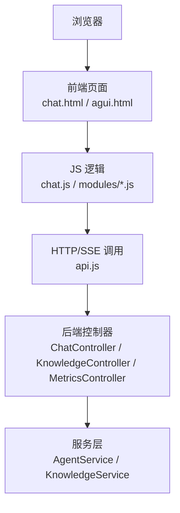
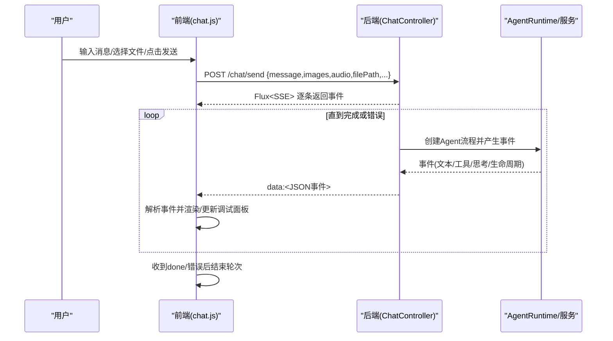

# 浏览器自动化测试

<cite>
**本文引用的文件列表**
- [ChatController.java](file://src/main/java/com/skloda/agentscope/controller/ChatController.java)
- [KnowledgeController.java](file://src/main/java/com/skloda/agentscope/controller/KnowledgeController.java)
- [MetricsController.java](file://src/main/java/com/skloda/agentscope/controller/MetricsController.java)
- [chat.html](file://src/main/resources/templates/chat.html)
- [agui.html](file://src/main/resources/static/agui.html)
- [chat.js](file://src/main/resources/static/scripts/chat.js)
- [api.js](file://src/main/resources/static/scripts/api.js)
- [upload.js](file://src/main/resources/static/scripts/modules/upload.js)
- [knowledge.js](file://src/main/resources/static/scripts/modules/knowledge.js)
- [debug.js](file://src/main/resources/static/scripts/modules/debug.js)
- [README.md](file://README.md)
- [ChatControllerStreamTest.java](file://src/test/java/com/skloda/agentscope/controller/ChatControllerStreamTest.java)
- [KnowledgeControllerTest.java](file://src/test/java/com/skloda/agentscope/controller/KnowledgeControllerTest.java)
</cite>

## 目录
1. [简介](#简介)
2. [项目结构与入口](#项目结构与入口)
3. [核心组件与接口](#核心组件与接口)
4. [架构总览](#架构总览)
5. [详细组件测试设计](#详细组件测试设计)
6. [多模态交互测试](#多模态交互测试)
7. [异步操作测试](#异步操作测试)
8. [可视化测试](#可视化测试)
9. [跨浏览器兼容性测试](#跨浏览器兼容性测试)
10. [测试报告与度量](#测试报告与度量)
11. [性能与稳定性建议](#性能与稳定性建议)
12. [故障排查指南](#故障排查指南)
13. [结论](#结论)
14. [附录：用例清单与建议实现路径](#附录用例清单与建议实现路径)

## 简介
本方案面向 AgentScope Demo 的前端交互能力，提供完整的浏览器自动化测试实施方案。覆盖两大技术选型：Selenium WebDriver（传统 DOM/表单驱动）和 Playwright（现代事件/流式渲染友好）。重点验证以下方面：
- 页面元素定位、用户交互模拟、表单提交处理
- 前端界面功能：聊天界面操作、文件上传流程、知识库管理界面、调试面板
- 多模态交互：图片上传验证、文档处理流程、实时流式响应显示
- 异步操作：SSE 事件流验证、WebSocket 连接管理（如涉及）、异步加载处理
- 可视化测试：截图对比、UI 组件渲染验证、响应式设计适配
- 跨浏览器兼容：Chrome、Firefox、Safari
- 测试报告生成：收集、分析失败用例、监控性能指标

该方案将基于实际后端的 HTTP/SSE 接口与前端模块化 JS 结构进行系统化用例设计，确保稳定回归、可观测、易维护。

## 项目结构与入口
- 主要 Web 入口页面
  - /：Thymeleaf 模板 chat.html，展示主界面（会话区、调试面板、左侧边栏等）
  - /agui.html：独立的 AG-UI SSE 演示页，用于验证 POST /ag-ui/run
- 主要控制器（后端 API）
  - ChatController：消息发送 SSE、审批、会话管理、Agent/技能/工具信息、文件上传下载
  - KnowledgeController：知识库上传/检索/删除/状态
  - MetricsController：内部指标查询（如 /api/metrics/status、/api/metrics/print）
- 前端脚本
  - chat.js：主逻辑（SSE 解析、发送消息、调试面板联动）
  - api.js：统一 fetch 封装（SSE 解析器、API 调用）
  - modules 子模块：upload.js（文件上传）、knowledge.js（知识库操作）、debug.js（调试面板），以及其他 UI/agents/session 模块

图表来源
- [ChatController.java:72-152](file://src/main/java/com/skloda/agentscope/controller/ChatController.java#L72-L152)
- [KnowledgeController.java:28-131](file://src/main/java/com/skloda/agentscope/controller/KnowledgeController.java#L28-L131)
- [chat.html](file://src/main/resources/templates/chat.html#L1-L96)
- [agui.html:22-133](file://src/main/resources/static/agui.html#L22-L133)
- [chat.js:1-100](file://src/main/resources/static/scripts/chat.js#L1-L100)
- [api.js:1-80](file://src/main/resources/static/scripts/api.js#L1-L80)

部分来源
- [ChatController.java:72-152](file://src/main/java/com/skloda/agentscope/controller/ChatController.java#L72-L152)
- [KnowledgeController.java:40-131](file://src/main/java/com/skloda/agentscope/controller/KnowledgeController.java#L40-L131)
- [chat.html:17-93](file://src/main/resources/templates/chat.html#L17-L93)
- [agui.html:22-133](file://src/main/resources/static/agui.html#L22-L133)

## 核心组件与接口
- SSE 聊天流
  - POST /chat/send：发送消息并返回 ServerSentEvent<String> 的 Flux 流；支持 images/audio/文件附件与会话上下文
  - POST /chat/approve：人类审批回调（同意/拒绝）
- 文件与下载
  - POST /chat/upload：MultipartFile 上传，保存到临时目录并返回 fileId/filePath
  - GET /chat/download?fileId=：通过资源下载已上传的文件
- 会话与 Agent
  - GET /api/sessions、POST /api/sessions、DELETE /api/sessions/{sessionId}
  - GET /api/agents、GET /api/agents/{agentId}
  - GET /api/agents/{agentId}/messages
  - GET /api/agents/{agentId}/sample-prompts/{index}
  - GET /api/skills/{skillName}、GET /api/tools/{toolName}
- 知识库
  - POST /api/knowledge/upload、GET /api/knowledge/documents、GET /api/knowledge/status、POST /api/knowledge/search、DELETE /api/knowledge/documents/{fileName}
- 指标
  - POST /api/metrics/print、POST /api/metrics/reset、GET /api/metrics/status

部分来源
- [ChatController.java:117-189](file://src/main/java/com/skloda/agentscope/controller/ChatController.java#L117-L189)
- [ChatController.java:215-428](file://src/main/java/com/skloda/agentscope/controller/ChatController.java#L215-L428)
- [KnowledgeController.java:37-131](file://src/main/java/com/skloda/agentscope/controller/KnowledgeController.java#L37-L131)
- [MetricsController.java:16-48](file://src/main/java/com/skloda/agentscope/controller/MetricsController.java#L16-L48)

## 架构总览
下图从请求到达开始，串联前端输入到后端处理器及响应流的回发过程，包括 SSE 事件的持续推送与前端接收渲染。

图表来源
- [ChatController.java:122-152](file://src/main/java/com/skloda/agentscope/controller/ChatController.java#L122-L152)
- [chat.js:78-100](file://src/main/resources/static/scripts/chat.js#L78-L100)
- [api.js:2-25](file://src/main/resources/static/scripts/api.js#L2-L25)

## 详细组件测试设计

### 聊天界面操作测试
- 元素定位策略
  - 使用数据语义化选择器（id/class）结合 CSS 或 XPath：如 #messageInput、#sendBtn、#chatMessages、#chatEmpty、#fileTagArea
  - 等待关键区域出现后再断言（例如“正在输入”指示器消失、第一条助手消息可见）
- 基本对话流程
  - 打开 /，进入聊天页
  - 输入非空文本，触发发送（键盘 Enter/按钮）
  - 验证：聊天区出现用户气泡、助手回复文本，SSE done 事件触发后的“轮次结束”状态
- 异常与边界
  - 空消息且无附件时，应直接返回错误提示（后端校验）
  - 连续快速发送：防止并发导致的状态污染（断言当前轮次结束后才可下一轮）
- 断言要点
  - HTML 存在性与文本包含（使用安全转义后的内容匹配）
  - SSE done 事件后轮次状态切换成功

部分来源
- [ChatController.java:122-152](file://src/main/java/com/skloda/agentscope/controller/ChatController.java#L122-L152)
- [chat.js:24-100](file://src/main/resources/static/scripts/chat.js#L24-L100)
- [chat.html:32-76](file://src/main/resources/templates/chat.html#L32-L76)

### 文件上传与文档处理流程
- 元素与行为
  - + 上传按钮触发隐藏 input[type=file] 的点击
  - 选择 docx/pdf/xlsx 后，自动附加到后续消息中发送（含 filePath/fileName）
- 测试步骤
  - 选择一个合法文档类型上传
  - 断言文件标签出现并可移除
  - 发送包含附件的消息，校验结果中是否出现了文档处理相关的输出或工具调用
  - 验证 /chat/download 可获取已上传文件
- 注意项
  - 前端类型校验（仅接受 doc/image/audio）
  - 后端支持的格式：pdf/docx/txt/md（知识库上传）与聊天场景的文件处理可能有差异，需分别覆盖

部分来源
- [upload.js:21-110](file://src/main/resources/static/scripts/modules/upload.js#L21-L110)
- [ChatController.java:419-470](file://src/main/java/com/skloda/agentscope/controller/ChatController.java#L419-L470)
- [KnowledgeController.java:40-78](file://src/main/java/com/skloda/agentscope/controller/KnowledgeController.java#L40-L78)

### 知识库管理界面
- 功能点
  - 上传文档至索引（/api/knowledge/upload）
  - 列出已索引文档（/api/knowledge/documents）
  - 查看索引状态（/api/knowledge/status）
  - 搜索检索（/api/knowledge/search）
  - 删除文档（/api/knowledge/documents/{fileName}）
- 测试设计
  - 上传前清理环境或准备基线
  - 上传不同格式（pdf/docx/txt/md），断言 status 为 indexed
  - 读取列表与名称一致
  - 执行 search 并断言返回结果集与 score
  - 删除后列表中不再包含该文档
- 稳定性
  - 避免竞态：在批量上传后加等待索引完成后再读列表/搜索

部分来源
- [knowledge.js:5-56](file://src/main/resources/static/scripts/modules/knowledge.js#L5-L56)
- [KnowledgeController.java:37-131](file://src/main/java/com/skloda/agentscope/controller/KnowledgeController.java#L37-L131)

### 调试面板功能
- 观察点
  - 每个消息发起会在右侧调试区新增一个“轮次卡片”
  - 显示模型名、Token、LLM/工具耗时、调用次数、状态（running/success/error）
  - 时间线包含 LLM/工具/循环/路由/专家派发等事件行
- 测试设计
  - 发送消息后断言轮次卡片出现并开始统计
  - 断言 done 后状态由 running→success 或 error
  - 断言时间线行数与事件类型合理
  - 重复发送若干次，检查旧轮次不会被误覆盖或丢失

部分来源
- [debug.js:5-61](file://src/main/resources/static/scripts/modules/debug.js#L5-L61)
- [debug.js:113-176](file://src/main/resources/static/scripts/modules/debug.js#L113-L176)
- [chat.html:79-89](file://src/main/resources/templates/chat.html#L79-L89)

## 多模态交互测试
- 图片上传验证
  - 选择 jpg/png/gif/webp 图片，断言预览出现并可查看大图
  - 若当前智能体不支持视觉模式，应给出“切换到视觉分析助手”的建议对话框，点击后可正确切换
- 音频上传验证
  - 选择 wav/mp3/m4a/mp4 音频，断言预览出现；若当前智能体不支持音频模式，应建议切换到语音助手
- 文档处理流程
  - 上传 docx/pdf/xlsx 后发送指令，断言工具调用与最终结果中体现了对文件的解析内容
- 断言策略
  - 前端侧：上传预览区域节点存在、预览图/文件名可见
  - 后端侧：上传接口返回 fileId/filePath；聊天记录中应有工具调用/结果相关事件序列

部分来源
- [upload.js:31-104](file://src/main/resources/static/scripts/modules/upload.js#L31-L104)
- [ChatController.java:122-152](file://src/main/java/com/skloda/agentscope/controller/ChatController.java#L122-L152)

## 异步操作测试
- SSE 事件流验证
  - 构建事件流断言：至少包含文本事件、工具事件、以及 final done
  - 断言事件顺序、事件 payload 关键字段是否存在（如 type 字段）
  - 超长对话场景下，缓冲与滚动到底部是否正常
- 流式渲染体验
  - 输入框动态高度调整
  - “正在输入”指示器的显隐与首次内容到达清除
  - 大量事件下的内存与回流压力（长文本/长代码块）
- 并发控制
  - 同一会话内严格串行发送，避免重复开启多条流
  - AbortController 在取消/超时场景的释放（如需）

部分来源
- [chat.js:11-22](file://src/main/resources/static/scripts/chat.js#L11-L22)
- [chat.js:78-100](file://src/main/resources/static/scripts/chat.js#L78-L100)
- [api.js:2-25](file://src/main/resources/static/scripts/api.js#L2-L25)
- [ChatController.java:117-152](file://src/main/java/com/skloda/agentscope/controller/ChatController.java#L117-L152)

## 可视化测试
- 截图对比测试
  - 以 stable baseline 作为基准截图（正常样式与布局）
  - 针对常见分辨率（桌面 1920x1080、平板 1024x768、手机竖屏 375x812）各截一帧关键页：首页空白、消息发送中、消息完成、调试面板展开/收起
  - 比较像素级/布局树差异，设置合理的容差阈值
- UI 组件渲染验证
  - 文件标签、图片/音频预览、知识条目、轮次卡片、时间线行的存在性与可见性
  - 主题切换与字体缩放后的布局是否正确
- 响应式设计
  - 在不同视口宽度下，主聊天区与调试面板的自适应折叠与可读性
  - 小屏幕下滚动区域与固定区域不互相遮挡

实践建议
- Selenium：适用于表单与基础 DOM 交互的稳定性验证；配合截图库（如 Allure Screenshot、JUnit Screenshots）保存比对图
- Playwright：更适合截图对比、视口控制、事件断言；具备更好的网络与调度性能

## 跨浏览器兼容性测试
- 目标浏览器
  - Chrome（最新稳定版）、Firefox（ESR/最新版）、Safari（macOS 最新版本）
- 执行方式
  - 使用 Selenium Grid/Cloud（BrowserStack、Sauce Labs）或本地 Docker 容器编排多个浏览器实例并行执行
  - 对关键路径（发送消息、文件上传、知识库、调试面板）进行冒烟测试矩阵
- 关注点
  - SSE 支持：Safari 某些历史版本可能存在差异，建议使用新版；必要时降级为短轮询或长连接的兼容测试
  - 文件选择行为差异：input[type=file] 在跨平台的行为一致性
  - Cookie/同源/跨域策略：保证所有静态资源与服务端在同一域名下

## 测试报告与度量
- 测试结果收集
  - 将测试运行结果聚合至 Allure/JUnit 报告
  - 记录失败截图、控制台日志、网络请求与 SSE 原始事件
- 失败用例分析
  - 区分：UI 不稳定（偶发）、定位失败、业务逻辑失败、网络/依赖失败
  - 通过录制回放视频与分段截图帮助定位问题根因
- 性能指标监控
  - 通过 /api/metrics/status、/api/metrics/print 获取运行时指标快照，作为性能验收辅助
  - 监控端到端时延：请求发起→首字符到达→done 完成的时长分布
  - 采集浏览器端指标（Performance API）：DOM 就绪、主线程阻塞、重排次数等

部分来源
- [MetricsController.java:16-48](file://src/main/java/com/skloda/agentscope/controller/MetricsController.java#L16-L48)

## 性能与稳定性建议
- 减少不必要的重新渲染：对大段落或代码高亮区域采用虚拟滚动或分页加载
- 节流/防抖：输入框输入与 resize 事件优化
- SSE 缓冲：合理分片与增量解析，避免一次性拼接过大字符串
- 重试机制：对网络抖动导致的 SSE 中断进行指数退避重试，并在 UI 上明确状态反馈
- 资源隔离：上传/处理大文件时使用独立会话或任务队列，避免阻塞主聊天线程

[本节提供通用指导，无需特定文件引用]

## 故障排查指南
- 常见问题与对策
  - SSE 未关闭或卡住：检查服务端 on 错误恢复与 takeUntil(done) 逻辑；前端应监听断开并提示“服务中断”
  - 文件无法下载：确认 /chat/download 路径有效且权限允许；必要时增加鉴权/签名
  - 知识库状态不同步：等待索引完成后拉取；必要时轮询 status 直至 READY
  - 调试面板数据错乱：确保每次新轮次前清空 currentRound，done 后重置状态
- 断点与日志
  - 在前端 console 打开网络与 SSE 原始事件；后端开启 io.agentscope 的 DEBUG 日志
  - 通过 /api/metrics/print 打印阶段性指标辅助判断瓶颈

部分来源
- [ChatController.java:117-152](file://src/main/java/com/skloda/agentscope/controller/ChatController.java#L117-L152)
- [KnowledgeController.java:80-95](file://src/main/java/com/skloda/agentscope/controller/KnowledgeController.java#L80-L95)
- [MetricsController.java:22-48](file://src/main/java/com/skloda/agentscope/controller/MetricsController.java#L22-L48)

## 结论
本方案围绕实际的聊天、文件与知识库能力，系统设计了前后端联动的浏览器自动化测试方法，兼顾功能、可视化与跨浏览器场景。建议在 CI 中引入分层用例集（冒烟/回归/性能基线），并配合截图对比与性能报告，保障迭代质量与用户体验。

[本节总结性陈述，不直接分析具体文件]

## 附录：用例清单与建议实现路径

### 聊天流端到端
- 用例描述
  - 访问 /，输入文本并发送，断言首个文本事件与 done
  - 并发限制：确保仅在上一轮结束后发送下一轮
  - 断言调试面板状态变更与轮次总数递增
- 关联源码
  - [ChatController.java:122-152](file://src/main/java/com/skloda/agentscope/controller/ChatController.java#L122-L152)
  - [ChatControllerStreamTest.java:18-39](file://src/test/java/com/skloda/agentscope/controller/ChatControllerStreamTest.java#L18-L39)
  - [chat.js:78-100](file://src/main/resources/static/scripts/chat.js#L78-L100)

### 文件上传与下载
- 用例描述
  - POST /chat/upload 上传成功，返回列表包含 fileName 与 filePath
  - 通过 /chat/download?fileId= 成功下载原文件，校验字节一致
- 关联源码
  - [ChatController.java:419-476](file://src/main/java/com/skloda/agentscope/controller/ChatController.java#L419-L476)
  - [api.js:27-41](file://src/main/resources/static/scripts/api.js#L27-L41)

### 知识库增删改查与状态
- 用例描述
  - 上传文档→status 变为 READY→列表包含文档名→搜索命中→删除后不在列表
- 关联源码
  - [KnowledgeController.java:37-131](file://src/main/java/com/skloda/agentscope/controller/KnowledgeController.java#L37-L131)
  - [KnowledgeControllerTest.java:27-48](file://src/test/java/com/skloda/agentscope/controller/KnowledgeControllerTest.java#L27-L48)
  - [knowledge.js:5-56](file://src/main/resources/static/scripts/modules/knowledge.js#L5-L56)

### 审批回调（HITL）
- 用例描述
  - 收到 require_user_confirm 类事件后，调用 /chat/approve 传递同意/拒绝与原因，断言对应后续流
- 关联源码
  - [ChatController.java:155-189](file://src/main/java/com/skloda/agentscope/controller/ChatController.java#L155-L189)

### AG-UI 协议入口
- 用例描述
  - 访问 /agui.html，构造 RunAgentInput 并通过 fetch 发送至 /ag-ui/run
  - 断言返回的 SSE 事件按 RUN_/TEXT_/TOOL_/RUN_FINISHED 分类渲染
- 关联源码
  - [agui.html:22-133](file://src/main/resources/static/agui.html#L22-L133)

### 指标与监控
- 用例描述
  - 调用 /api/metrics/status 获取运行时摘要；/api/metrics/print 输出统计；/api/metrics/reset 复位
- 关联源码
  - [MetricsController.java:22-48](file://src/main/java/com/skloda/agentscope/controller/MetricsController.java#L22-L48)