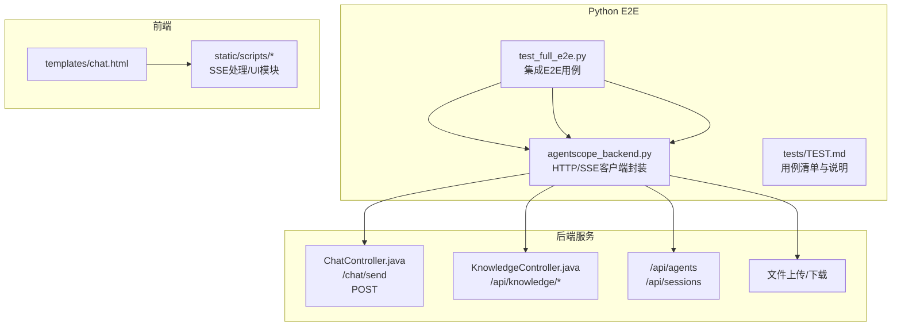
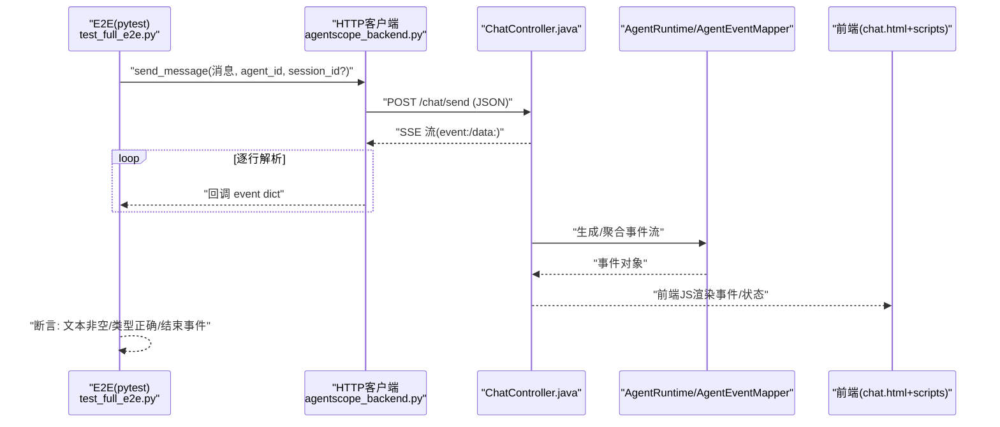
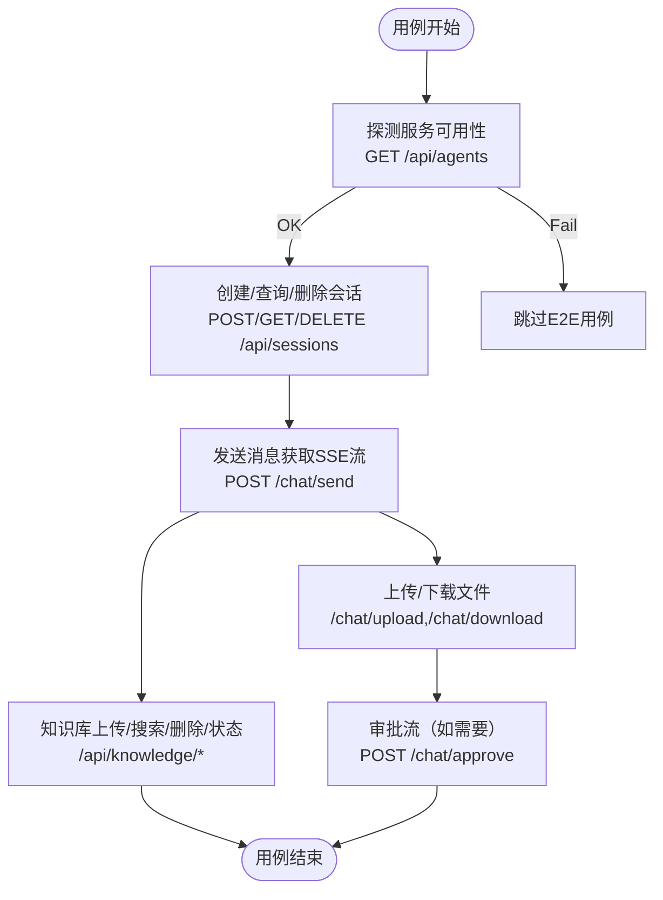
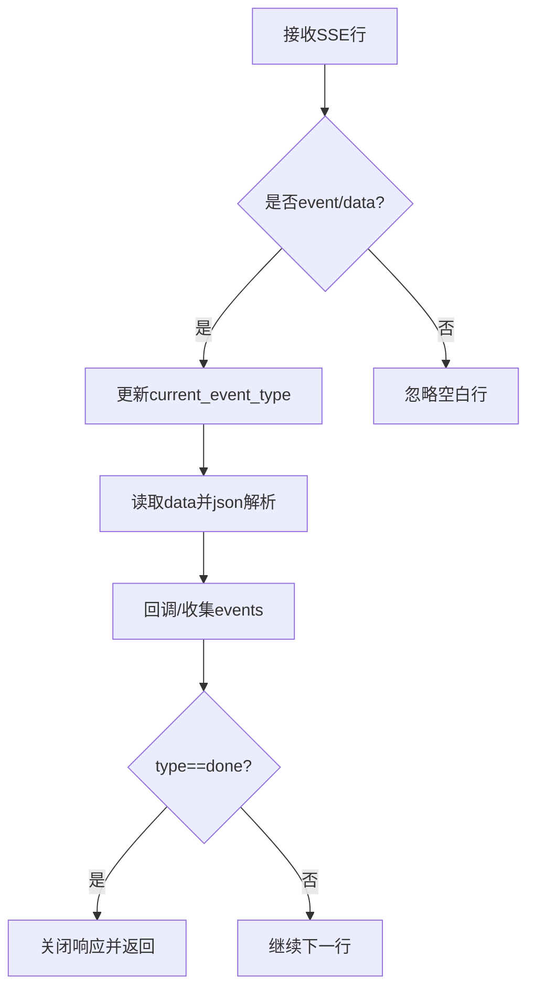
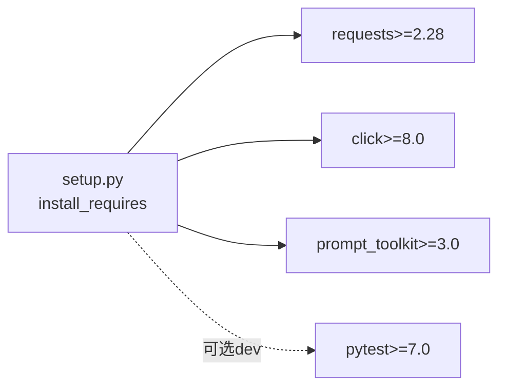

# 端到端测试

<cite>
**本文引用的文件**
- [test_full_e2e.py](file://agent-harness/cli_anything/agentscope/tests/test_full_e2e.py)
- [test_core.py](file://agent-harness/cli_anything/agentscope/tests/test_core.py)
- [TEST.md](file://agent-harness/cli_anything/agentscope/tests/TEST.md)
- [agentscope_backend.py](file://agent-harness/cli_anything/agentscope/utils/agentscope_backend.py)
- [setup.py](file://agent-harness/setup.py)
- [application.yml](file://src/main/resources/application.yml)
</cite>

## 目录
1. [引言](#引言)
2. [项目结构](#项目结构)
3. [核心组件](#核心组件)
4. [架构总览](#架构总览)
5. [详细组件分析](#详细组件分析)
6. [依赖关系分析](#依赖关系分析)
7. [性能考虑](#性能考虑)
8. [故障排查指南](#故障排查指南)
9. [结论](#结论)
10. [附录](#附录)

## 引言
本指南面向在 AgentScope Demo（Java/Spring Boot）之上实施端到端（E2E）测试的工程实践，目标是：
- 使用 Python requests 构建覆盖完整业务流的 E2E 用例（会话、聊天、知识库、文件上传等）。
- 提供基于 Selenium 或 Playwright 的浏览器自动化方案（前端 UI 交互与验证）。
- 规划真实环境（本地开发、CI/CD）下 E2E 的执行策略、结果收集与报告。
- 设计测试数据生命周期管理（初始化、准备、清理）。
- 提供性能测试方法（负载、压力、并发用户）。
- 总结常见问题与解决方案（网络抖动、环境问题、数据污染等）。

## 项目结构
当前仓库的 Python E2E 位于 agent-harness 子项目内，借助 Java Spring Boot 应用暴露的后端 API，端到端验证从 CLI、HTTP、SSE 流到前端页面的完整链路。

图示来源
- [test_full_e2e.py:43-185](file://agent-harness/cli_anything/agentscope/tests/test_full_e2e.py#L43-L185)
- [agentscope_backend.py:31-141](file://agent-harness/cli_anything/agentscope/utils/agentscope_backend.py#L31-L141)
- [application.yml](file://src/main/resources/application.yml)

章节来源
- [test_full_e2e.py:43-185](file://agent-harness/cli_anything/agentscope/tests/test_full_e2e.py#L43-L185)
- [agentscope_backend.py:31-141](file://agent-harness/cli_anything/agentscope/utils/agentscope_backend.py#L31-L141)

## 核心组件
- 服务端能力（由后端暴露）
  - 会话与代理：/api/agents、/api/sessions
  - 聊天消息：POST /chat/send（Server-Sent Events 流式返回）
  - 知识库：/api/knowledge/documents、/api/knowledge/search、/api/knowledge/upload、/api/knowledge/status
  - 文件上传下载：/chat/upload、/chat/download
  - 审批与示例提示词：/chat/approve、/api/agents/{id}/sample-prompts/{index}、/api/agents/{id}/messages
- Python E2E 客户端
  - 通过 agentscope_backend.py 集中实现 HTTP 请求、SSE 解析、回调支持；便于 E2E 复用与断言。
  - test_full_e2e.py 组织场景化的端到端流程：服务器探测、会话、对话、知识库、文件上传、CLI 调用等。
- 单元测试辅助
  - test_core.py 利用 mock 验证各后端 API 的输入输出契约，确保接口稳定，不受网络影响。
- 文档
  - tests/TEST.md 维护了用例清单、覆盖范围与运行说明，有助于团队协作与扩展。

章节来源
- [test_full_e2e.py:43-185](file://agent-harness/cli_anything/agentscope/tests/test_full_e2e.py#L43-L185)
- [test_core.py:16-200](file://agent-harness/cli_anything/agentscope/tests/test_core.py#L16-L200)
- [agentscope_backend.py:31-312](file://agent-harness/cli_anything/agentscope/utils/agentscope_backend.py#L31-L312)
- [TEST.md:1-168](file://agent-harness/cli_anything/agentscope/tests/TEST.md#L1-L168)

## 架构总览
下面的序列图展示了“发送聊天并消费 SSE”的端到端调用链，涵盖 Python E2E、后端控制器与服务事件：

图示来源
- [test_full_e2e.py:94-117](file://agent-harness/cli_anything/agentscope/tests/test_full_e2e.py#L94-L117)
- [agentscope_backend.py:79-141](file://agent-harness/cli_anything/agentscope/utils/agentscope_backend.py#L79-L141)

## 详细组件分析

### 组件A：后端能力与E2E调用映射
该部分将 Python E2E 中每个断点与后端接口进行一一映射，指导用例如何覆盖端到端的关键路径。

图示来源
- [test_full_e2e.py:43-185](file://agent-harness/cli_anything/agentscope/tests/test_full_e2e.py#L43-L185)
- [agentscope_backend.py:31-312](file://agent-harness/cli_anything/agentscope/utils/agentscope_backend.py#L31-L312)

章节来源
- [test_full_e2e.py:43-185](file://agent-harness/cli_anything/agentscope/tests/test_full_e2e.py#L43-L185)
- [agentscope_backend.py:31-312](file://agent-harness/cli_anything/agentscope/utils/agentscope_backend.py#L31-L312)

### 组件B：SSE流处理与断言策略
- 要点
  - 使用 stream=True 发起 POST，逐行解析 event:/data: 头，维护 current_event_type。
  - 通过可选 callback 实时打印/捕获事件，便于定位问题。
  - 以 done 事件作为结束标志，避免无限等待。
- 推荐断言
  - 至少一条 text 类型事件且内容非空。
  - 最后出现 done 类型事件。
  - 多轮/多消息场景下，按 sessionId 校验消息顺序与数量。

图示来源
- [agentscope_backend.py:115-141](file://agent-harness/cli_anything/agentscope/utils/agentscope_backend.py#L115-L141)

章节来源
- [agentscope_backend.py:79-141](file://agent-harness/cli_anything/agentscope/utils/agentscope_backend.py#L79-L141)
- [test_full_e2e.py:94-117](file://agent-harness/cli_anything/agentscope/tests/test_full_e2e.py#L94-L117)

### 组件C：浏览器自动化（Selenium/Playwright）建议
虽然仓库未内置浏览器自动化脚本，但可按如下方案补充：
- 启动后访问 templates/chat.html 或使用静态页面 agui.html（若启用相应 profile）。
- 登录/选择 Agent（如有权限）、输入消息、点击发送、验证 SSE 渲染输出与面板状态。
- 对于文件上传场景：使用 file chooser 或拖拽；对知识库场景：打开 knowledge tab，上传并检索。
- 关键断言
  - 文本区出现回复片段，包含关键字。
  - 调试面板可见事件类型流转。
  - 文件标签出现在会话中。
  - 知识列表中能看到上传的文档。

[本节为通用指引，不直接对应具体源码]

## 依赖关系分析
- 运行期依赖
  - Python 包：requests（基础HTTP与流），click/prompt_toolkit（CLI/REPL）。
  - Java 后端：Spring Boot 应用默认监听端口可通过 application.yml 配置；E2E 通过 AGENTS..._BASE_URL 环境变量控制。
- 测试执行依赖
  - pytest（可选 extras dev）用于本地运行；unittest 已原生可用。

图示来源
- [setup.py:1-25](file://agent-harness/setup.py#L1-L25)

章节来源
- [setup.py:1-25](file://agent-harness/setup.py#L1-L25)
- [application.yml](file://src/main/resources/application.yml)

## 性能考虑
- 负载与压力
  - 使用 pytest-xdist 并行化 E2E 用例，结合限流防止压垮外部 LLM。
  - 使用 locust/benchpy 模拟多会话并发，观察 SSE 延迟与错误率；关注 CPU/内存、连接池与线程模型。
  - 针对长会话或多文件上传链路做分段压测，定位瓶颈。
- 指标收集
  - 统计单次消息端到端时延（post 到 done 事件）。
  - 统计 SSE 分段大小与频率，评估前端渲染压力。
- 资源隔离
  - CI 中每次运行前重置知识库与会话，避免跨任务干扰。

[本节为通用建议]

## 故障排查指南
- 常见错误与处理
  - 连接失败：检测 server_status 返回 offline/error，记录 BASE_URL 与超时设置。
  - SSE 流异常：解析 JSON 失败时使用 fallback raw；记录原始 data 便于回溯。
  - 网络抖动：重试机制 + 指数退避；大文件/知识库操作提高超时。
  - 数据污染：用例前后使用独立临时目录/文件名，并在 finally/tearDown 清理。
  - 环境问题：优先在本地 mvn spring-boot:run 调试；CI 中确保 JAR/Profile 一致。
- 诊断工具
  - 开启后端日志与调试面板，核对事件类型。
  - 在 E2E 中增加步骤日志与截图（Selenium/Playwright 方案）。
- 定位步骤
  - 最小化复现：先断言 /api/agents 可达，再逐步推进到 /chat/send。
  - 抓包或日志：确认 payload 字段与后端期望一致。

章节来源
- [test_full_e2e.py:33-40](file://agent-harness/cli_anything/agentscope/tests/test_full_e2e.py#L33-L40)
- [agentscope_backend.py:17-28](file://agent-harness/cli_anything/agentscope/utils/agentscope_backend.py#L17-L28)
- [agentscope_backend.py:115-141](file://agent-harness/cli_anything/agentscope/utils/agentscope_backend.py#L115-L141)

## 结论
本指南以仓库现有的 Python E2E 测试为基线，结合后端能力给出了端到端业务流程（会话、聊天、知识库、文件上传、审批）的落地方案，并给出浏览器自动化、真实环境执行、数据生命周期管理与性能测试的建议。通过在现有 test_full_e2e.py 基础上扩展用例、完善断言与报告，可快速形成稳定可靠的 E2E 体系。

## 附录
- 运行与执行建议
  - 本地启动后端：mvn spring-boot:run
  - 设置后端地址：AGENTSCOPE_BASE_URL=http://localhost:8080
  - 仅运行单元测试：python -m unittest
  - 安装开发依赖（pytest）后运行：pip install -e ".[dev]"
- 最佳实践
  - 所有涉及 I/O 的用例均使用临时文件/命名空间，保证幂等与隔离。
  - 长耗时/不稳定步骤（LLM 调用、文件索引）设置合理超时与重试。
  - 将关键断言集中在一个高层级用例，以便回归快速发现破坏性变更。