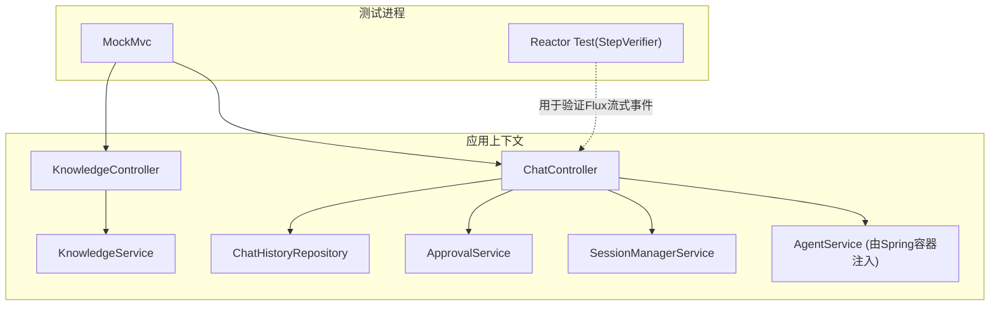
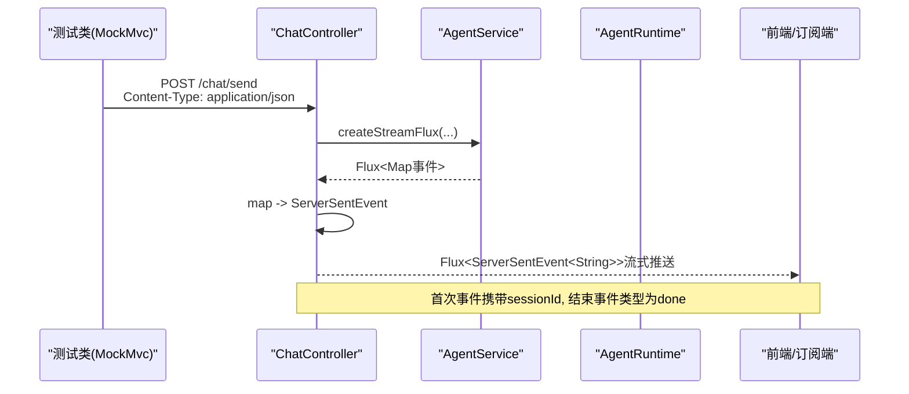
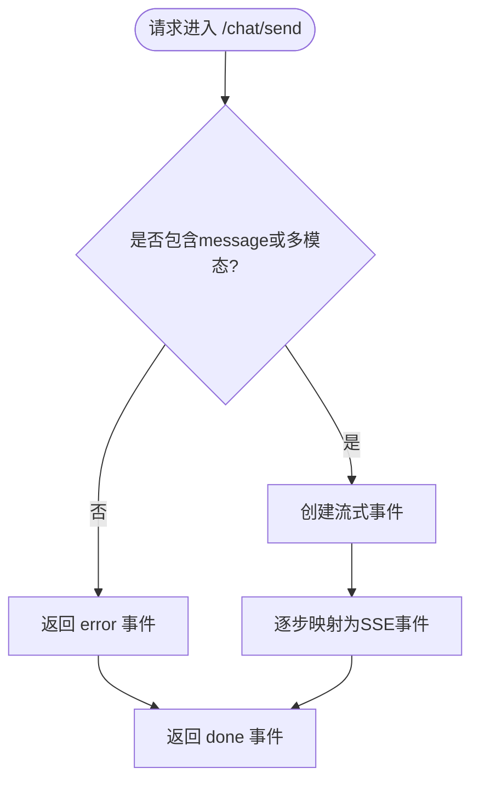
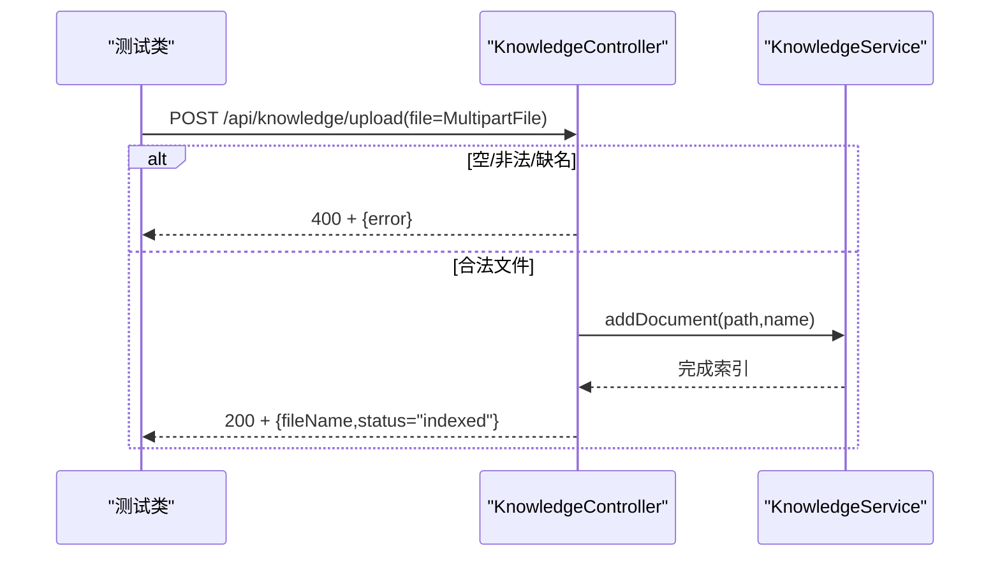
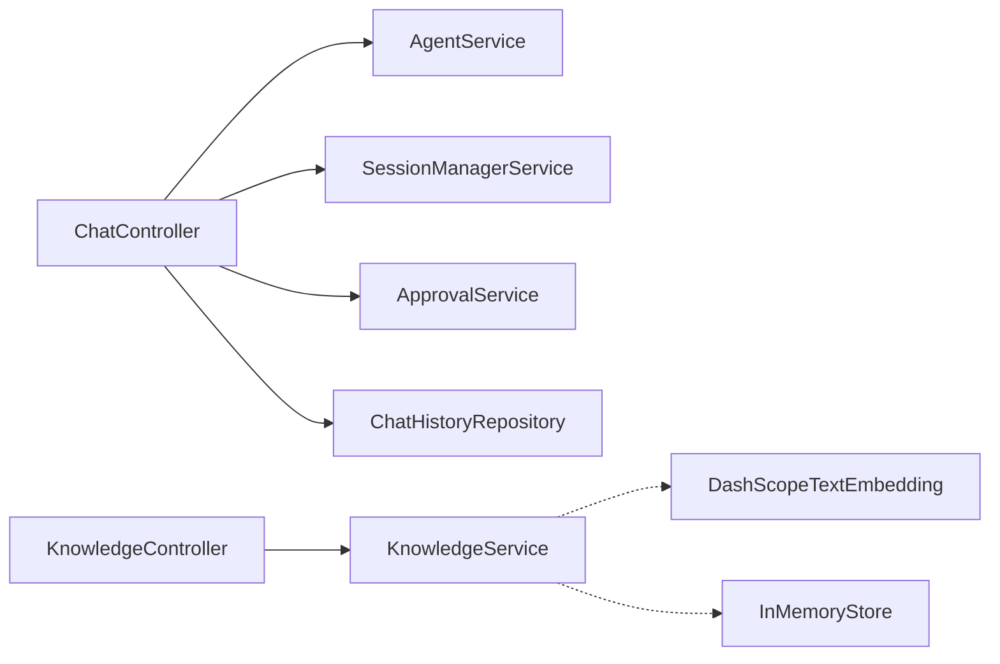

# Web控制器集成测试

<cite>
**文档中引用的文件**
- [ChatController.java](file://src/main/java/com/skloda/agentscope/controller/ChatController.java)
- [KnowledgeController.java](file://src/main/java/com/skloda/agentscope/controller/KnowledgeController.java)
- [ChatRequest.java](file://src/main/java/com/skloda/agentscope/model/ChatRequest.java)
- [ChatEvent.java](file://src/main/java/com/skloda/agentscope/model/ChatEvent.java)
- [KnowledgeService.java](file://src/main/java/com/skloda/agentscope/service/KnowledgeService.java)
- [application.yml](file://src/main/resources/application.yml)
- [application-test.yml](file://src/test/resources/application-test.yml)
- [pom.xml](file://pom.xml)
</cite>

## 目录
1. [简介](#简介)
2. [项目结构](#项目结构)
3. [核心组件](#核心组件)
4. [架构总览](#架构总览)
5. [详细组件与接口测试方案](#详细组件与接口测试方案)
6. [依赖分析](#依赖分析)
7. [性能与稳定性考量](#性能与稳定性考量)
8. [故障排查指南](#故障排查指南)
9. [结论](#结论)
10. [附录：用例清单与断言建议](#附录用例清单与断言建议)

## 简介
本文面向使用 MockMvc 对 Spring Boot Web 控制器进行集成测试，覆盖两个关键场景：
- POST /chat/send：基于响应式 SSE 的消息发送与流式事件返回；支持文件路径、图片/音频等多模态参数。
- POST /api/knowledge/upload：知识库文档上传与索引。

本文同时说明如何构造模拟请求体（包括 MultipartFile）、校验 HTTP 状态码与响应体、处理流式响应、设计错误边界、以及结合会话管理、权限上下文的完整链路测试策略。

## 项目结构
- 控制器层
  - ChatController：负责聊天消息的接收、SSE 流式事件封装、审批事件转发等。
  - KnowledgeController：提供知识库文档上传、查询、搜索、删除等操作。
- 模型层
  - ChatRequest：定义 /chat/send 的请求体字段，包括 agentId、message、filePath、sessionId、多模态图片/音频等。
  - ChatEvent：统一 SSE 事件对象，包含 done/error 等类型。
- 服务层
  - KnowledgeService：RAG 知识库索引服务，内部维护 InMemoryStore，提供文档添加、检索、状态查询。
- 配置
  - application.yml：应用端口、SSE、知识库与模型配置，默认启用知识索引与内存模式。
  - application-test.yml：测试环境关闭 MCP 以缩短启动时间并减少外部依赖。
- 构建
  - pom.xml：引入 spring-boot-starter-test 与 reactor-test，为 MockMvc 与 Reactor 流测试提供支持。

图表来源
- [ChatController.java:122-152](file://src/main/java/com/skloda/agentscope/controller/ChatController.java#L122-L152)
- [KnowledgeController.java:40-77](file://src/main/java/com/skloda/agentscope/controller/KnowledgeController.java#L40-L77)

章节来源
- [ChatController.java:44-152](file://src/main/java/com/skloda/agentscope/controller/ChatController.java#L44-L152)
- [KnowledgeController.java:20-131](file://src/main/java/com/skloda/agentscope/controller/KnowledgeController.java#L20-L131)
- [ChatRequest.java:1-143](file://src/main/java/com/skloda/agentscope/model/ChatRequest.java#L1-L143)
- [ChatEvent.java:1-39](file://src/main/java/com/skloda/agentscope/model/ChatEvent.java#L1-L39)
- [KnowledgeService.java:39-196](file://src/main/java/com/skloda/agentscope/service/KnowledgeService.java#L39-L196)
- [application.yml:1-89](file://src/main/resources/application.yml#L1-L89)
- [application-test.yml:1-9](file://src/test/resources/application-test.yml#L1-L9)
- [pom.xml:175-187](file://pom.xml#L175-L187)

## 核心组件
- ChatController
  - 暴露 GET /、POST /chat/send、POST /chat/approve 等端点；/chat/send 直接返回 Flux<ServerSentEvent<String>> 流式输出。
  - 内置 SSE 包装方法，负责将事件对象序列化为字符串，并在异常时返回 error+done 双事件。
  - 接收 ChatRequest 请求体，支持 filePath、fileName、多模态 images/audio、sessionId、userId、executionMode、permissionMode、sessionType 等。
- KnowledgeController
  - POST /api/knowledge/upload：接受 MultipartFile，校验空名/格式限制后保存到临时目录，并调用 KnowledgeService.addDocument。
  - GET /api/knowledge/documents：返回已索引文档列表。
  - GET /api/knowledge/status：返回当前索引状态快照。
  - POST /api/knowledge/search：按 query、limit、threshold 检索并返回截断文本与得分。
  - DELETE /api/knowledge/documents/{fileName}：从知识库移除文档。
- KnowledgeService
  - 通过 SimpleKnowledge + InMemoryStore 完成文档读取、切片、嵌入与入库；提供索引状态追踪与并发控制。

章节来源
- [ChatController.java:122-152](file://src/main/java/com/skloda/agentscope/controller/ChatController.java#L122-L152)
- [KnowledgeController.java:40-131](file://src/main/java/com/skloda/agentscope/controller/KnowledgeController.java#L40-L131)
- [KnowledgeService.java:140-196](file://src/main/java/com/skloda/agentscope/service/KnowledgeService.java#L140-L196)

## 架构总览

图表来源
- [ChatController.java:122-152](file://src/main/java/com/skloda/agentscope/controller/ChatController.java#L122-L152)
- [ChatController.java:79-113](file://src/main/java/com/skloda/agentscope/controller/ChatController.java#L79-L113)

## 详细组件与接口测试方案

### 通用前提与准备
- 测试依赖
  - spring-boot-starter-test：提供 MockMvc、@SpringBootTest。
  - reactor-test：配合 StepVerifier 验证 Reactive 流。
- 应用配置
  - 使用 application-test.yml 禁用 MCP 以减少启动依赖和耗时。
  - 保持 knowledge 配置可用或按需关闭，以便验证上传接口不依赖外部向量库。
- 公共设置
  - 通过 @WebMvcTest 或 @SpringBootTest(webEnvironment = MOCK) 加载控制器与相关 Bean。
  - 若存在鉴权拦截器/过滤器（如 session 或权限上下文），需确保测试环境中相应 Bean 可用或通过 @Import/Mock 方式注入。

章节来源
- [pom.xml:175-187](file://pom.xml#L175-L187)
- [application-test.yml:1-9](file://src/test/resources/application-test.yml#L1-L9)
- [application.yml:26-71](file://src/main/resources/application.yml#L26-L71)

### 测试 POST /chat/send（SSE 流式）
目标
- 验证正常消息、多模态消息、含 filePath 消息的返回事件流与结束信号。
- 验证缺失 message 且无多媒体时的错误流。
- 验证流式事件的完成事件类型。

建议用例与步骤
1) 基本对话流
- 构造一个有效的 ChatRequest，包含非空白 message，agentId 可留默认或指定存在的 agent。
- 发起 POST 并接收 Flux<ServerSentEvent<String>> 内容。在测试侧可通过如下两种方式之一：
  - 方式A：使用 @SpringBootTest 加载真实上下文，用 WebClient/SseClient 订阅服务端返回的流，断言首个事件类型包含 sessionId、后续包含 token/工具调用/结束事件。
  - 方式B：仅验证最小契约（例如通过 Stub AgentService），期望至少收到一个 type=done 的事件。
- 断言要点：
  - 第一次事件的 data 中包含 sessionId。
  - 最后一次事件为 type=done。
  - 中间事件符合预期类型（如 tool_use/tool_result/message 等）。

2) 多模态输入
- 在 ChatRequest 中设置 images 或 audio 数组，不强制要求 message 非空。
- 断言与上述一致，重点确保控制器不拒绝“空 message 但有图片/音频”的请求。

3) 文件路径输入
- 设置 filePath 与 fileName（该文件应由业务方先通过上传接口保存，或在测试数据准备阶段创建）。
- 断言流式事件正常下发，并在结束时产出 done 事件。

4) 空消息错误分支
- 发送没有 message 且没有 images/audio 的请求。
- 断言第一个事件为 error 类型，随后紧跟 done 事件（这是控制器内部的 on 错误短路输出）。

5) 超时与背压
- 对于长任务流，建议在测试中使用合理的超时与重试/退避策略，避免 CI 不稳定。
- 使用 reactor-test 时可结合 StepVerifier 等待 done 事件或最大收集条数，防止泄漏。

图表来源
- [ChatController.java:122-152](file://src/main/java/com/skloda/agentscope/controller/ChatController.java#L122-L152)
- [ChatController.java:79-113](file://src/main/java/com/skloda/agentscope/controller/ChatController.java#L79-L113)

章节来源
- [ChatController.java:122-152](file://src/main/java/com/skloda/agentscope/controller/ChatController.java#L122-L152)
- [ChatEvent.java:21-35](file://src/main/java/com/skloda/agentscope/model/ChatEvent.java#L21-L35)

提示
- 由于 /chat/send 直接返回 Flux，MockMvc 的 .andReturn() 无法阻塞等待流结束。推荐使用 @SpringBootTest + WebClient 订阅流，或者对上层 AgentService 做最小 Stub 以只验证契约流程。

### 测试 POST /api/knowledge/upload（MultipartFile 上传）
目标
- 验证空文件、非法后缀、缺失文件名、成功索引与失败场景。
- 验证上传完成后索引状态变更。

建议用例与步骤
1) 空文件/缺文件名
- 使用 MockPart 构造空文件或不带原始名称的文件上传。
- 断言状态码为 400，响应体包含 error 信息。

2) 非法后缀
- 上传非 .pdf/.docx/.txt/.md 的文件。
- 断言状态码为 400，响应体包含支持的格式提示。

3) 成功索引
- 选择合法格式的最小样本文件（资源文件或临时创建），执行 upload。
- 断言状态码为 200，响应体包含 fileName 与 status=indexed。
- 随后访问 GET /api/knowledge/documents 或 /api/knowledge/status 断言文件存在或状态已更新。

4) 异常场景
- 可尝试对已知不存在的文件路径触发异常流程（若需要），或使用 @MockBean 让 addDocument 抛错，断言状态码为 500，响应体包含错误消息。

图表来源
- [KnowledgeController.java:40-77](file://src/main/java/com/skloda/agentscope/controller/KnowledgeController.java#L40-L77)
- [KnowledgeService.java:140-177](file://src/main/java/com/skloda/agentscope/service/KnowledgeService.java#L140-L177)

章节来源
- [KnowledgeController.java:40-131](file://src/main/java/com/skloda/agentscope/controller/KnowledgeController.java#L40-L131)

### 测试 GET /api/knowledge/documents 与 /api/knowledge/status
目标
- 验证文档列表是否为空或包含刚刚上传的文件。
- 验证状态中的 state、startedAt/finishedAt 等快照字段语义。

步骤
- 执行一次成功上传后，调用 list/status，断言：
  - documents 列表包含上传文件的显示名或相对路径。
  - status.state 不再是 EMPTY（应为 INDEXING 或 其他终态），并且 finishedAt 在成功后有值。

章节来源
- [KnowledgeController.java:80-94](file://src/main/java/com/skloda/agentscope/controller/KnowledgeController.java#L80-L94)
- [KnowledgeService.java:180-196](file://src/main/java/com/skloda/agentscope/service/KnowledgeService.java#L180-L196)

### 测试 POST /api/knowledge/search
目标
- 验证空 query 校验、默认 limit/threshold 行为、返回结果结构与内容截断长度。

步骤
- 使用 Map 作为 body 发送 query，断言：
  - 空查询返回 400。
  - 默认 limit=3、threshold=0.5。
  - 响应体中 count、results[].content 为前若干字符、score 存在。

章节来源
- [KnowledgeController.java:96-121](file://src/main/java/com/skloda/agentscope/controller/KnowledgeController.java#L96-L121)

### 会话管理与权限上下文测试
会话与权限
- ChatController 会透传 sessionId、userId、executionMode、permissionMode 给下游运行时与服务，用于会话延续与权限判定。
- 权限相关可能由中间件或服务层实现。为确保端到端正确性，建议在测试中：
  - 显式传入不同 sessionId，观察是否被持久化或关联到历史记录。
  - 传递不同 userId 与 permissionMode，并通过下游 Service（如 ApprovalService、AgentRuntime）的行为来验证授权差异（可通过 Mock 或 Spy 观察调用次数与参数）。

章节来源
- [ChatController.java:136-146](file://src/main/java/com/skloda/agentscope/controller/ChatController.java#L136-L146)
- [ChatRequest.java:8-17](file://src/main/java/com/skloda/agentscope/model/ChatRequest.java#L8-L17)

### HITL 审批流程测试（附加）
如果希望覆盖人类审批闭环：
- 当上游流出现 require_user_confirm 等事件后，使用 /chat/approve 提交审批。
- 测试可 Stub AgentRuntime.stream 返回受控事件流，断言 approve/reject 分别触发不同分支。

章节来源
- [ChatController.java:155-186](file://src/main/java/com/skloda/agentscope/controller/ChatController.java#L155-L186)

## 依赖分析
- 控制器之间无直接耦合，均依赖各自服务（AgentService/KnowledgeService）。
- ChatController 还依赖 SessionManagerService、ApprovalService、ChatHistoryRepository。
- KnowledgeService 依赖外部嵌入模型与 InMemoryStore，测试时无需 DB（默认已排除 JDBC 自动装配），适合单元/轻量集成测试。

图表来源
- [ChatController.java:54-70](file://src/main/java/com/skloda/agentscope/controller/ChatController.java#L54-L70)
- [KnowledgeService.java:73-85](file://src/main/java/com/skloda/agentscope/service/KnowledgeService.java#L73-L85)

章节来源
- [pom.xml:175-187](file://pom.xml#L175-L187)
- [application.yml:6-23](file://src/main/resources/application.yml#L6-L23)

## 性能与稳定性考量
- 流式测试应避免长时间占用线程，合理设置超时与最大事件数量，防止 CI 悬挂。
- 知识库上传涉及文件系统 I/O 与可能的嵌入计算，建议测试数据最小化、必要时 Mock 服务以稳定耗时。
- 使用 application-test.yml 关闭非必要的 MCP 等特性可显著缩短测试启动时间。

[本节为通用指导，无需特定文件引用]

## 故障排查指南
- 流未结束或超时
  - 检查是否存在未处理的异常分支导致流未发出 done 事件。
  - 确认代理运行时代码是否抛出异常并吞掉事件，必要时在测试中记录日志或打印事件类型。
- 上传报 400
  - 核对文件格式后缀是否在允许列表内。
  - 确保 multipart 请求包含正确的表单字段名 file。
- 索引后仍然为空
  - 检查 KnowledgeService 的状态快照与后台线程生命周期，确认索引已实际完成。
  - 关注日志中是否有“skipping background indexing”等提示。

章节来源
- [ChatController.java:107-113](file://src/main/java/com/skloda/agentscope/controller/ChatController.java#L107-L113)
- [KnowledgeController.java:40-77](file://src/main/java/com/skloda/agentscope/controller/KnowledgeController.java#L40-L77)
- [KnowledgeService.java:91-125](file://src/main/java/com/skloda/agentscope/service/KnowledgeService.java#L91-L125)

## 结论
通过对 ChatController 与 KnowledgeController 的 MockMvc/WebClient 集成测试，可覆盖以下关键点：
- /chat/send 的多路输入（文本、多模态、文件路径）与 SSE 流契约校验。
- /api/knowledge/upload 的上传、校验、索引与查询一致性。
- 会话与权限参数透传的有效性验证。
- 异常情况与错误边界的覆盖，保证生产可用性。

建议在实际项目中补充完整的测试基类，统一装配 MockBean，并提供一组覆盖常见场景的用例集，以提升回归效率与稳定性。

## 附录：用例清单与断言建议
- POST /chat/send
  - 有效消息 → 断言首个事件包含 sessionId，末事件为 done。
  - 空消息且无多媒体 → 断言首事件为 error，紧接着 done。
  - 多模态图片/音频 → 断言与文本相同的流式契约。
  - 含 filePath → 断言正常下发事件，结束后为 done。
- POST /api/knowledge/upload
  - 空文件/缺名/非法后缀 → 断言 400。
  - 合法文件 → 断言 200，status=indexed，并校验文档列表或状态。
- GET /api/knowledge/documents 与 /status
  - 上传后 → 断言列表中新增记录，状态 snapshot 合理。
- POST /api/knowledge/search
  - 空 query → 400；否则返回 count/results，content 为截取片段。

章节来源
- [ChatController.java:122-152](file://src/main/java/com/skloda/agentscope/controller/ChatController.java#L122-L152)
- [KnowledgeController.java:40-121](file://src/main/java/com/skloda/agentscope/controller/KnowledgeController.java#L40-L121)