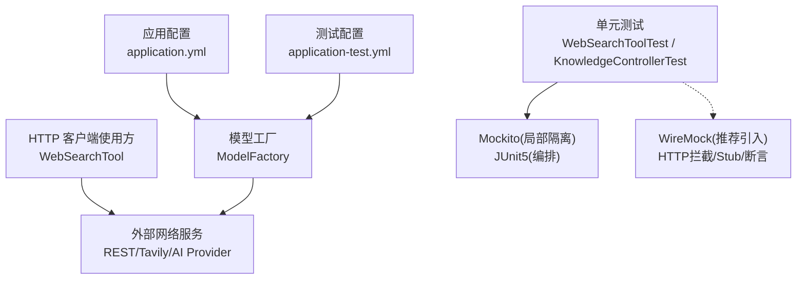
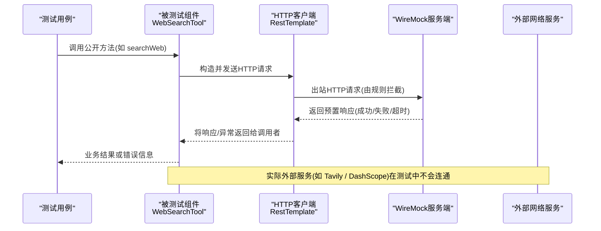
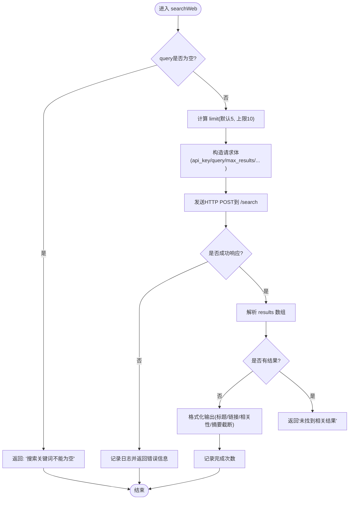
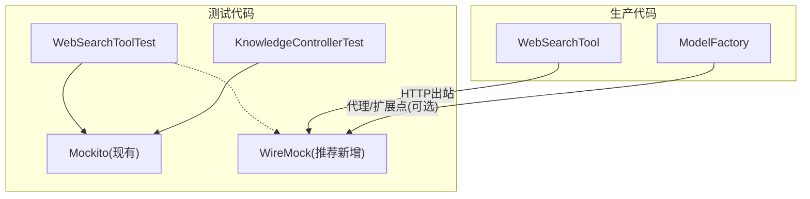

# 外部服务模拟测试

<cite>
**本文引用的文件**   
- [pom.xml](file://src/test/java/pom.xml)
- [application.yml](file://src/main/resources/application.yml)
- [application-test.yml](file://src/test/resources/application-test.yml)
- [ModelFactory.java](file://src/main/java/com/skloda/agentscope/model/ModelFactory.java)
- [WebSearchTool.java](file://src/main/java/com/skloda/agentscope/tool/WebSearchTool.java)
- [WebSearchToolTest.java](file://src/test/java/com/skloda/agentscope/tool/WebSearchToolTest.java)
- [KnowledgeControllerTest.java](file://src/test/java/com/skloda/agentscope/controller/KnowledgeControllerTest.java)
</cite>

## 目录
1. [引言](#引言)
2. [项目结构](#项目结构)
3. [核心组件](#核心组件)
4. [架构总览](#架构总览)
5. [详细组件分析](#详细组件分析)
6. [依赖分析](#依赖分析)
7. [性能考虑](#性能考虑)
8. [故障排除指南](#故障排除指南)
9. [结论](#结论)
10. [附录](#附录)

## 引言
本文件聚焦于“外部服务模拟测试”的体系化方案，围绕以下目标展开：
- 以 WireMock（或等效的 HTTP 拦截与断言能力）模拟第三方 API 调用。
- 覆盖网络超时、服务不可用、异常响应等典型不稳定场景。
- 面向 AI 模型提供商接口（通过统一入口）实现可替换的仿真行为。
- 针对 HTTP 客户端重试机制与认证授权策略设计有效用例。
- 扩展至分布式服务调用、消息队列与异步任务的模拟测试。
- 提供测试环境网络隔离配置、Mock 数据动态生成与覆盖率提升方法。
- 给出微服务架构下的服务间通信测试最佳实践建议。

本项目当前代码库尚未内置 WireMock，且对外部网络调用点集中在工具层与模型工厂层；我们将据此提出可落地的设计与集成路径，并结合现有测试模式（JUnit5 + Mockito）进行说明。

## 项目结构
与外部服务模拟测试直接相关的关键位置：
- 测试依赖与构建脚本位于根 pom.xml。
- 应用默认配置与测试配置文件，定义了模型、MCP、以及测试态开关。
- 模型创建入口 ModelFactory 负责解析模型 ID、组装上下文并驱动外部模型提供方（DashScope）。
- Web 搜索工具 WebSearchTool 通过 RestTemplate 发起 HTTP 请求到外部搜索服务，可作为典型外部网络调用的模拟对象。
- 现有单元测试覆盖了参数校验、无网络调用路径的验证；为后续增加 Mock 网络行为奠定了风格基础。

图示来源
- [application.yml:26-43](file://src/main/resources/application.yml#L26-L43)
- [application.yml:1-24](file://src/main/resources/application.yml#L1-L24)
- [application-test.yml:1-9](file://src/test/resources/application-test.yml#L1-L9)
- [ModelFactory.java:22-56](file://src/main/java/com/skloda/agentscope/model/ModelFactory.java#L22-L56)
- [WebSearchTool.java:20-58](file://src/main/java/com/skloda/agentscope/tool/WebSearchTool.java#L20-L58)

章节来源
- [pom.xml](file://src/test/java/pom.xml)
- [application.yml:1-43](file://src/main/resources/application.yml#L1-L43)
- [application-test.yml:1-9](file://src/test/resources/application-test.yml#L1-L9)
- [ModelFactory.java:22-95](file://src/main/java/com/skloda/agentscope/model/ModelFactory.java#L22-L95)
- [WebSearchTool.java:20-134](file://src/main/java/com/skloda/agentscope/tool/WebSearchTool.java#L20-L134)

## 核心组件
- 模型工厂 ModelFactory：统一封装对模型提供方（DashScope）的调用路径（ModelRegistry.resolve），并通过环境变量或配置注入密钥。适合在此处注入测试用的替代提供者或拦截器。
- Web 搜索工具 WebSearchTool：基于 RestTemplate 发起 HTTP 调用，包含空参校验、限流参数处理、异常捕获与用户提示。其网络调用点是理想的 WireMock Stub 目标。

章节来源
- [ModelFactory.java:22-95](file://src/main/java/com/skloda/agentscope/model/ModelFactory.java#L22-L95)
- [WebSearchTool.java:20-134](file://src/main/java/com/skloda/agentscope/tool/WebSearchTool.java#L20-L134)

## 架构总览
下面的序列图展示了在引入 WireMock 之后，外部服务模拟的典型调用链：测试驱动 → 被测组件 → 底层 HTTP 客户端 → WireMock → 固定 Stub 响应。

图示来源
- [WebSearchTool.java:42-58](file://src/main/java/com/skloda/agentscope/tool/WebSearchTool.java#L42-L58)
- [WebSearchTool.java:96-99](file://src/main/java/com/skloda/agentscope/tool/WebSearchTool.java#L96-L99)

## 详细组件分析

### 组件A：外部搜索工具（WebSearchTool）的模拟测试
- 关键点
  - 入参与限流：query 为空直接返回错误；limit 超出范围时截断为 5。这些无网络分支已通过单测覆盖，保持快速、确定性。
  - 网络路径：构造 JSON Body，调用 https://api.tavily.com/search；成功后解析 results 字段并组织文本输出。
  - 异常路径：任何网络/解析异常均捕获后返回用户友好提示信息。
- 模拟设计
  - 使用 WireMock 注册 Stub：匹配 POST 到 /search，Body 包含指定 key/查询词；返回成功、部分结果、空结果、HTTP 5xx、JSON Schema 非法等多套响应。
  - 通过 WireMock 的 ResponseDefinitionBuilder 自定义延迟与连接超时，模拟网络抖动与服务降级。
  - 对解析分支（results 不存在/类型不匹配）进行精确断言。
- 典型用例
  - 正常搜索结果（多条目、含 score/title/url/content）。
  - 返回空结果集。
  - 非 200 状态码（如 502/503）。
  - 请求体校验失败（缺少必要字段）。
  - 网络超时与连接拒绝。

图示来源
- [WebSearchTool.java:35-39](file://src/main/java/com/skloda/agentscope/tool/WebSearchTool.java#L35-L39)
- [WebSearchTool.java:42-58](file://src/main/java/com/skloda/agentscope/tool/WebSearchTool.java#L42-L58)
- [WebSearchTool.java:64-94](file://src/main/java/com/skloda/agentscope/tool/WebSearchTool.java#L64-L94)
- [WebSearchTool.java:96-99](file://src/main/java/com/skloda/agentscope/tool/WebSearchTool.java#L96-L99)

章节来源
- [WebSearchTool.java:31-134](file://src/main/java/com/skloda/agentscope/tool/WebSearchTool.java#L31-L134)
- [WebSearchToolTest.java:7-63](file://src/test/java/com/skloda/agentscope/tool/WebSearchToolTest.java#L7-L63)

### 组件B：AI 模型提供商接口模拟（ModelFactory）
- 关键点
  - 统一入口 resolveModelId：支持 bare name 与 provider:name 两种形式。当无前缀时自动补全 provider（dashscope）。
  - ModelCreationContext：设置 apiKey、stream、enableThinking、Formatter 等上下文，最终委托 ModelRegistry 完成创建。
- 模拟策略
  - 方案一（优先）：在测试中替换 Provider/Registry 行为。若框架支持，可通过 SPI/Test 扩展注入虚拟 Provider，或直接 mock Registry。
  - 方案二：在调用前以环境变量/属性注入“测试用的假模型ID”，并将该 ID 的解析过程在本地重定向到 Stub（例如一个内嵌的本地 HTTP/协议适配）。
  - 方案三（最小侵入）：利用 AgentScope 提供的扩展点或测试夹具（若有）注入自定义 Formatter/Provider；否则可在更高层面（如 AgentRuntime 或会话层）拦截事件流，确保不影响真实网络。
- 注意
  - 避免直接修改源码中的硬编码 URL；应以配置或抽象方式解耦。
  - 密钥读取需支持测试覆盖：当未提供 api-key 时应走环境变量或默认策略，保证在 CI 中也能执行。

章节来源
- [ModelFactory.java:22-56](file://src/main/java/com/skloda/agentscope/model/ModelFactory.java#L22-L56)
- [application.yml:26-43](file://src/main/resources/application.yml#L26-L43)

### 组件C：HTTP 客户端重试机制测试
- 现状
  - WebSearchTool 在当前实现中未显式暴露重试配置；网络异常会被捕获并转为错误信息返回。
- 建议与示例
  - 如果未来引入 Spring Retry 或自定义重试，应通过配置项控制最大重试次数、退避策略、可重试异常类型。
  - 使用 WireMock 重复返回失败 N 次后再成功，断言重试次数、耗时与最终结果一致性。
  - 对于“始终失败”的场景，断言不超过上限的重试次数与被测组件的错误语义一致。

章节来源
- [WebSearchTool.java:96-99](file://src/main/java/com/skloda/agentscope/tool/WebSearchTool.java#L96-L99)

### 组件D：认证授权的测试策略
- 关键点
  - Token/Header 注入：使用 WireMock 的 withHeader()/withQueryStringParameter() 来要求特定鉴权头，并断言缺失时的行为。
  - Token 失效：对同一 token 连续多次调用时，让第一次返回 200，后续返回 401/403，以验证重试/刷新逻辑（如存在）。
  - 密文传输：通过 HTTPS Stub，断言请求未被明文输出或在日志中被掩码。

章节来源
- [WebSearchTool.java:25-27](file://src/main/java/com/skloda/agentscope/tool/WebSearchTool.java#L25-L27)

### 组件E：分布式服务与消息队列、异步任务的模拟
- 分布式服务
  - 所有 outbound HTTP 均可通过 WireMock 集中接管；配合容器化部署（如 Testcontainers）在同一网段运行依赖服务。
- 消息队列
  - 使用嵌入式 Broker（如 RabbitMQ/Redis Streams）+ WireMock 组合：生产者侧断言消息内容，消费者侧以“假订阅端”消费并校验。
- 异步任务
  - 针对 @Async/Reactor 流程，建议以等待/轮询确认副作用，或使用 Reactor Test 的 stepByStep() 与 stepAwait() 验证事件顺序与时序约束。

章节来源
- [WebSearchTool.java:55-58](file://src/main/java/com/skloda/agentscope/tool/WebSearchTool.java#L55-L58)

### 组件F：网络隔离与测试配置
- 端口与绑定
  - 使用独立的 WireMock 实例，绑定到随机端口（或通过环境变量覆盖），避免与开发/测试环境的 8081/9090/9091 冲突。
- Profile 分离
  - application.yml 已排除 DataSource 与 A2A 自动装配；application-test.yml 关闭 MCP Demo，确保无 Node.js 依赖即可启动测试。
- 安全边界
  - 测试中禁止访问真实公网：将所有出站流量指向 WireMock；DNS 映射、防火墙规则或容器网络策略辅助隔离。

章节来源
- [application.yml:13-23](file://src/main/resources/application.yml#L13-L23)
- [application.yml:73-80](file://src/main/resources/application.yml#L73-L80)
- [application-test.yml:1-9](file://src/test/resources/application-test.yml#L1-L9)

## 依赖分析
本项目测试基线使用 JUnit5 + Mockito；如需引入 WireMock，请在构建脚本中添加测试依赖，并在测试生命周期管理 WireMock 的启停。

图示来源
- [WebSearchToolTest.java:7-63](file://src/test/java/com/skloda/agentscope/tool/WebSearchToolTest.java#L7-L63)
- [KnowledgeControllerTest.java:18-49](file://src/test/java/com/skloda/agentscope/controller/KnowledgeControllerTest.java#L18-L49)
- [WebSearchTool.java:42-58](file://src/main/java/com/skloda/agentscope/tool/WebSearchTool.java#L42-L58)
- [ModelFactory.java:42-56](file://src/main/java/com/skloda/agentscope/model/ModelFactory.java#L42-L56)

章节来源
- [pom.xml](file://src/test/java/pom.xml)
- [WebSearchToolTest.java:7-63](file://src/test/java/com/skloda/agentscope/tool/WebSearchToolTest.java#L7-L63)
- [KnowledgeControllerTest.java:18-49](file://src/test/java/com/skloda/agentscope/controller/KnowledgeControllerTest.java#L18-L49)

## 性能考虑
- 仅 Mock 网络层，确保用例不真正联网，从而避免随机性、外部限流与安全合规问题。
- 合理使用 wiremock 的 “delayed response” 模拟真实延迟，但不要放大过多导致 CI 变慢。
- 大量请求场景下，采用批量 stub 与共享 HTTP client（在测试中复用）减少开销。

[本节提供通用指导，无需特定文件引用]

## 故障排除指南
- 现象：测试偶发连接超时或远程地址不可达。
  - 排查是否误开了真实网络出口；检查 WireMock 是否启动成功及端口绑定。
  - 在 CI 环境下提前拉取所需镜像，避免冷启动导致的慢启动。
- 现象：断言失败但日志不足以定位。
  - 启用被测组件 debug 日志，打印关键参数（脱敏）与时间戳。
  - 使用 WireMock “access log” 查看真实请求，比对预期请求头/Body。

[本节提供通用指导，无需特定文件引用]

## 结论
- WebSearchTool 是当前最清晰的 HTTP 出站调用点，建议作为首批引入 WireMock 的目标，构建覆盖成功/失败/超时/异常的多维度用例。
- 模型工厂 ModelFactory 是 AI 接口冒烟测试的关键入口；优先寻找框架层面的 Provider/Registry 扩展点，其次再考虑在更高层做事件拦截。
- 借助 application.yml 的配置屏蔽与 application-test.yml 的最小化加载，可有效降低测试耦合度与依赖面。
- 通过统一的网络隔离策略（WireMock + Profile + 禁用不必要特性），可稳定复现分布式/外部依赖的各种边界情况。

[本节为总结，无需特定文件引用]

## 附录

### 常见测试场景清单（可直接落地）
- 搜索工具
  - 空查询返回明确提示。
  - limit 越界截断为默认值。
  - 200 且 results 非空；results 为空；results 字段类型不正确。
  - 5xx/4xx 返回；请求体不完整；头部缺失；HTTPS 证书校验失败。
- AI 模型
  - 模型名补齐（bare name→provider:name）。
  - 无 api-key 时回落到环境变量/默认策略。
  - 开启/关闭 stream、thinking 的行为差异（若上层有暴露配置）。
- 中间件与容错
  - 重试次数上限、退避间隔、失败快速失败策略。
  - 熔断/降级（若未来引入）。
- 微服务间通信
  - 使用契约测试/接口快照验证向后兼容。
  - 通过 WireMock 录制/回放跨服务调用路径。

[本节为补充建议，无需特定文件引用]