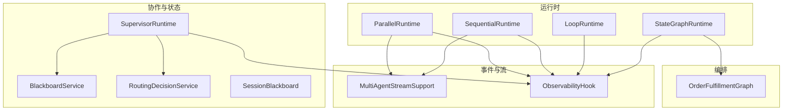
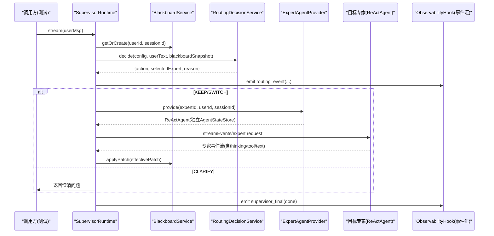
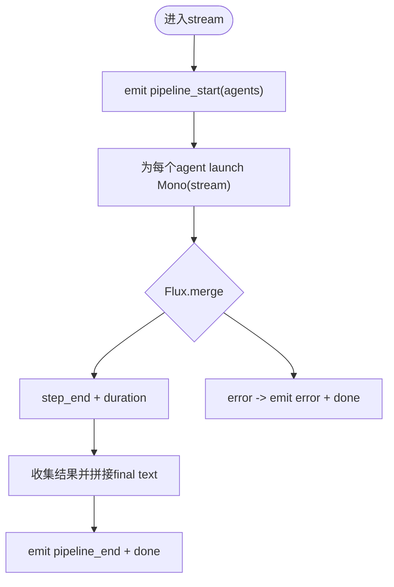
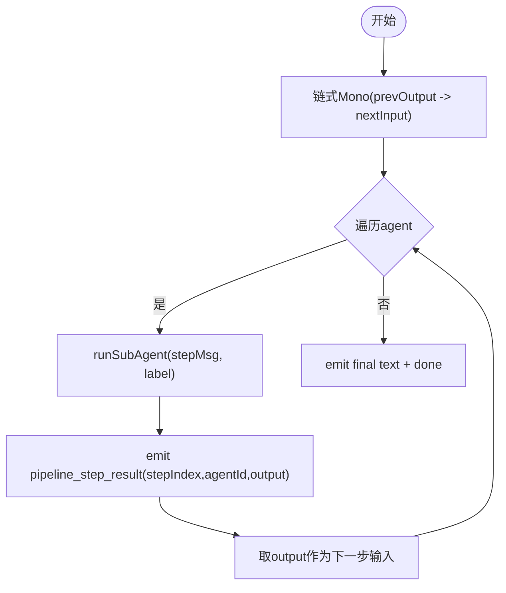
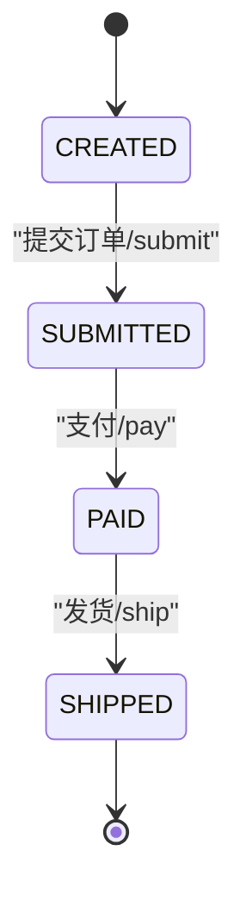
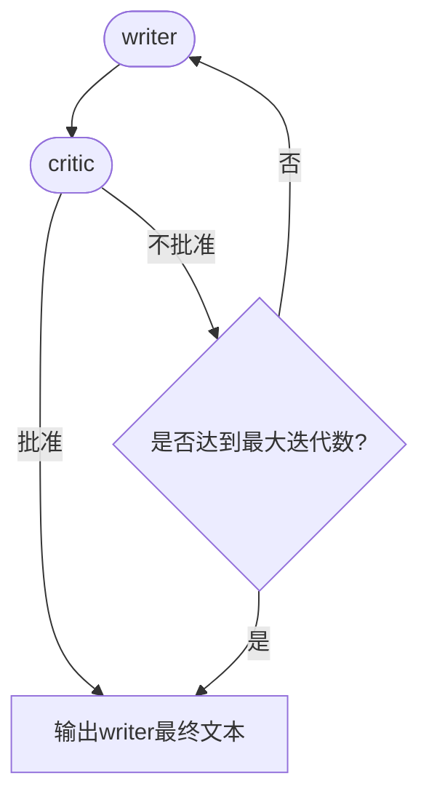
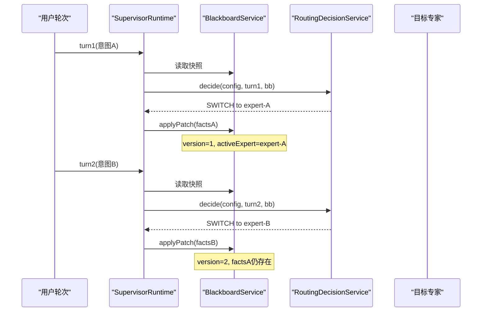
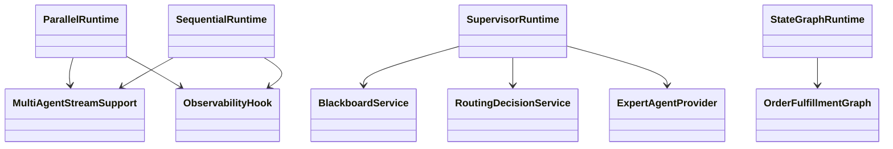

# 多Agent协作集成测试

<cite>
**本文引用的文件**
- [ParallelRuntimeTest.java](file://src/test/java/com/skloda/agentscope/runtime/ParallelRuntimeTest.java)
- [SequentialRuntimeTest.java](file://src/test/java/com/skloda/agentscope/runtime/SequentialRuntimeTest.java)
- [StateGraphRuntimeTest.java](file://src/test/java/com/skloda/agentscope/runtime/StateGraphRuntimeTest.java)
- [MultiAgentStreamSupportTest.java](file://src/test/java/com/skloda/agentscope/runtime/MultiAgentStreamSupportTest.java)
- [LoopRuntimeTest.java](file://src/test/java/com/skloda/agentscope/runtime/LoopRuntimeTest.java)
- [OrderFulfillmentGraphTest.java](file://src/test/java/com/skloda/agentscope/composite/graph/OrderFulfillmentGraphTest.java)
- [RuntimeContextPropagationTest.java](file://src/test/java/com/skloda/agentscope/blackboard/RuntimeContextPropagationTest.java)
- [ExpertStateIsolationTest.java](file://src/test/java/com/skloda/agentscope/blackboard/ExpertStateIsolationTest.java)
- [SupervisorRoutingContextTest.java](file://src/test/java/com/skloda/agentscope/blackboard/SupervisorRoutingContextTest.java)
- [BlackboardServiceTest.java](file://src/test/java/com/skloda/agentscope/blackboard/BlackboardServiceTest.java)
- [HarnessRuntimeTest.java](file://src/test/java/com/skloda/agentscope/harness/HarnessRuntimeTest.java)
- [WorkflowControllerTest.java](file://src/test/java/com/skloda/agentscope/controller/WorkflowControllerTest.java)
- [ParallelRuntime.java](file://src/main/java/com/skloda/agentscope/runtime/ParallelRuntime.java)
- [SequentialRuntime.java](file://src/main/java/com/skloda/agentscope/runtime/SequentialRuntime.java)
- [SupervisorRuntime.java](file://src/main/java/com/skloda/agentscope/blackboard/SupervisorRuntime.java)
</cite>

## 目录
1. [简介](#简介)
2. [项目结构](#项目结构)
3. [核心组件](#核心组件)
4. [架构总览](#架构总览)
5. [详细组件分析](#详细组件分析)
6. [依赖关系分析](#依赖关系分析)
7. [性能与并发考量](#性能与并发考量)
8. [故障恢复与长时间运行测试](#故障恢复与长时间运行测试)
9. [调试工具与技巧](#调试工具与技巧)
10. [结论](#结论)

## 简介
本文围绕多Agent协作场景，梳理并沉淀覆盖并行执行、顺序执行、状态图执行的复杂工作流测试策略；深入分析Agent间通信、事件同步、共享状态一致性等关键质量属性；同时给出长时间运行、故障恢复、性能基准的测试方法与落地建议。文档内容均基于当前仓库中的运行时实现及对应单元测试进行归纳总结，并提供可复用的验证清单与实践路径。

## 项目结构
围绕多Agent协作，测试代码主要集中在 runtime（多种流水线与图形执行器）、blackboard（黑板、路由决策、会话上下文传播）、composite/graph（状态图编排）以及 harness/controller（工作流入口与配置校验）。关键源文件包括：
- 运行时抽象与具体实现：ParallelRuntime、SequentialRuntime、StateGraphRuntime
- 事件与流桥接：MultiAgentStreamSupport、ObservabilityHook（事件总线）、AgentEventMapper（事件映射）
- 协同与状态：SupervisorRuntime、BlackboardService、RoutingDecisionService、SessionBlackboard
- 复合状态机：OrderFulfillmentGraph
- 测试用例：各模块对应的 *Test 类集中验证行为与边界

图示来源
- [ParallelRuntime.java:38-95](file://src/main/java/com/skloda/agentscope/runtime/ParallelRuntime.java#L38-L95)
- [SequentialRuntime.java:38-89](file://src/main/java/com/skloda/agentscope/runtime/SequentialRuntime.java#L38-L89)
- [StateGraphRuntimeTest.java:50-118](file://src/test/java/com/skloda/agentscope/runtime/StateGraphRuntimeTest.java#L50-L118)
- [SupervisorRuntime.java:134-200](file://src/main/java/com/skloda/agentscope/blackboard/SupervisorRuntime.java#L134-L200)
- [MultiAgentStreamSupportTest.java:48-109](file://src/test/java/com/skloda/agentscope/runtime/MultiAgentStreamSupportTest.java#L48-L109)
- [OrderFulfillmentGraphTest.java:47-190](file://src/test/java/com/skloda/agentscope/composite/graph/OrderFulfillmentGraphTest.java#L47-L190)

章节来源
- [ParallelRuntime.java:17-106](file://src/main/java/com/skloda/agentscope/runtime/ParallelRuntime.java#L17-L106)
- [SequentialRuntime.java:15-100](file://src/main/java/com/skloda/agentscope/runtime/SequentialRuntime.java#L15-L100)
- [StateGraphRuntimeTest.java:21-118](file://src/test/java/com/skloda/agentscope/runtime/StateGraphRuntimeTest.java#L21-L118)
- [BlackboardServiceTest.java:18-173](file://src/test/java/com/skloda/agentscope/blackboard/BlackboardServiceTest.java#L18-L173)
- [RuntimeContextPropagationTest.java:30-127](file://src/test/java/com/skloda/agentscope/blackboard/RuntimeContextPropagationTest.java#L30-L127)
- [ExpertStateIsolationTest.java:32-127](file://src/test/java/com/skloda/agentscope/blackboard/ExpertStateIsolationTest.java#L32-L127)
- [SupervisorRoutingContextTest.java:34-198](file://src/test/java/com/skloda/agentscope/blackboard/SupervisorRoutingContextTest.java#L34-L198)
- [HarnessRuntimeTest.java:14-29](file://src/test/java/com/skloda/agentscope/harness/HarnessRuntimeTest.java#L14-L29)
- [WorkflowControllerTest.java:12-35](file://src/test/java/com/skloda/agentscope/controller/WorkflowControllerTest.java#L12-L35)

## 核心组件
- 并行执行引擎：通过合并子代理任务流实现并发，聚合结果为最终文本，维护 pipeline_start/pipeline_end/done 契约事件序列。
- 顺序执行引擎：将上一阶段输出作为下一阶段输入，逐阶段流转，保持 step 级 pipeline 事件与 done 完成语义。
- 状态图执行器：基于状态机驱动的业务流程执行，触发转移时产生 graph_transition 事件并维持当前状态。
- 循环工作流：writer-critic 迭代收敛，支持达到最大次数后仍输出最终草稿的回归修复点。
- 共享黑板与路由决策：按 (userId, sessionId) 隔离会话级黑板，专家切换时通过快照传递事实，版本单调递增。
- 运行时上下文传播：确保 Supervisor、Expert 的 AgentStateStore 键空间分离，且不跨会话交叉。
- 事件桥接与SSE：统一将 AgentEvent 转换为 SSE Map，标注 source、类型与时间戳，保证前端可消费。

章节来源
- [ParallelRuntimeTest.java:27-70](file://src/test/java/com/skloda/agentscope/runtime/ParallelRuntimeTest.java#L27-L70)
- [SequentialRuntimeTest.java:30-94](file://src/test/java/com/skloda/agentscope/runtime/SequentialRuntimeTest.java#L30-L94)
- [StateGraphRuntimeTest.java:45-118](file://src/test/java/com/skloda/agentscope/runtime/StateGraphRuntimeTest.java#L45-L118)
- [LoopRuntimeTest.java:27-89](file://src/test/java/com/skloda/agentscope/runtime/LoopRuntimeTest.java#L27-L89)
- [BlackboardServiceTest.java:27-173](file://src/test/java/com/skloda/agentscope/blackboard/BlackboardServiceTest.java#L27-L173)
- [RuntimeContextPropagationTest.java:30-127](file://src/test/java/com/skloda/agentscope/blackboard/RuntimeContextPropagationTest.java#L30-L127)
- [ExpertStateIsolationTest.java:32-127](file://src/test/java/com/skloda/agentscope/blackboard/ExpertStateIsolationTest.java#L32-L127)
- [MultiAgentStreamSupportTest.java:25-121](file://src/test/java/com/skloda/agentscope/runtime/MultiAgentStreamSupportTest.java#L25-L121)

## 架构总览
下面以 Supervisor 调度专家工作流的典型过程为例，展示测试如何覆盖关键交互点。

图示来源
- [SupervisorRuntime.java:134-200](file://src/main/java/com/skloda/agentscope/blackboard/SupervisorRuntime.java#L134-L200)
- [SupervisorRoutingContextTest.java:37-119](file://src/test/java/com/skloda/agentscope/blackboard/SupervisorRoutingContextTest.java#L37-L119)

## 详细组件分析

### 并行执行测试（Pipeline 并发）
- 验证所有子代理并发执行，各自推流 thinking/tool/text 片段至同一 sink；结果聚合后推送 text，并以 pipeline_start→…→pipeline_end→done 保持契约事件序列。
- 关注并发安全：单一 fluxSink 多线程写入需线程安全；事件需带 source 标签区分不同 agent。
- 错误路径应产出 error 事件并完成流。

图示来源
- [ParallelRuntime.java:38-95](file://src/main/java/com/skloda/agentscope/runtime/ParallelRuntime.java#L38-L95)
- [ParallelRuntimeTest.java:29-59](file://src/test/java/com/skloda/agentscope/runtime/ParallelRuntimeTest.java#L29-L59)

章节来源
- [ParallelRuntime.java:17-106](file://src/main/java/com/skloda/agentscope/runtime/ParallelRuntime.java#L17-L106)
- [ParallelRuntimeTest.java:27-70](file://src/test/java/com/skloda/agentscope/runtime/ParallelRuntimeTest.java#L27-L70)
- [MultiAgentStreamSupportTest.java:48-109](file://src/test/java/com/skloda/agentscope/runtime/MultiAgentStreamSupportTest.java#L48-L109)

### 顺序执行测试（Pipeline 串行）
- 步骤级流转：第 N 步的最终文本作为第 N+1 步输入，逐步推进。
- 事件契约：pipeline_start → pipeline_step_start → text（每步） → pipeline_step_end → … → pipeline_end → done。
- 空列表场景仍能正常完成，无 error 事件。

图示来源
- [SequentialRuntime.java:38-89](file://src/main/java/com/skloda/agentscope/runtime/SequentialRuntime.java#L38-L89)
- [SequentialRuntimeTest.java:32-84](file://src/test/java/com/skloda/agentscope/runtime/SequentialRuntimeTest.java#L32-L84)

章节来源
- [SequentialRuntime.java:15-100](file://src/main/java/com/skloda/agentscope/runtime/SequentialRuntime.java#L15-L100)
- [SequentialRuntimeTest.java:24-94](file://src/test/java/com/skloda/agentscope/runtime/SequentialRuntimeTest.java#L24-L94)

### 状态图执行测试（State Graph）
- 执行状态机的 execute(Msg)，根据用户指令匹配事件，触发状态迁移，回调 graph_transition 事件。
- 正确处理空状态、未知操作提示可用动作、中文别名、reset 回初态、null transitions 容错等。

图示来源
- [OrderFulfillmentGraphTest.java:47-190](file://src/test/java/com/skloda/agentscope/composite/graph/OrderFulfillmentGraphTest.java#L47-L190)
- [StateGraphRuntimeTest.java:68-118](file://src/test/java/com/skloda/agentscope/runtime/StateGraphRuntimeTest.java#L68-L118)

章节来源
- [OrderFulfillmentGraphTest.java:15-190](file://src/test/java/com/skloda/agentscope/composite/graph/OrderFulfillmentGraphTest.java#L15-L190)
- [StateGraphRuntimeTest.java:21-118](file://src/test/java/com/skloda/agentscope/runtime/StateGraphRuntimeTest.java#L21-L118)

### 循环工作流测试（Writer-Critic）
- 首次批准即输出 writer 最终结果，否则最多迭代 N 次后，仍输出最后一次 writer 输出。
- 关注回归点：达到最大次数时不应丢失最终输出，loop_end 中 approved=false。

图示来源
- [LoopRuntimeTest.java:29-79](file://src/test/java/com/skloda/agentscope/runtime/LoopRuntimeTest.java#L29-L79)

章节来源
- [LoopRuntimeTest.java:23-89](file://src/test/java/com/skloda/agentscope/runtime/LoopRuntimeTest.java#L23-L89)

### 共享黑板与事件同步测试（Blackboard + Routing）
- 同一 (userId, sessionId) 的连续轮次，黑板版本单调递增，专家切换时由快照携带事实到后续专家。
- 路由策略：意图匹配则 SWITCH，否则保持或 Clarify；支持 defaultKeep=false 时的澄清逻辑。
- 测试覆盖 patch 构造、字段追加、删除键值、不同会话隔离等。

图示来源
- [SupervisorRoutingContextTest.java:37-119](file://src/test/java/com/skloda/agentscope/blackboard/SupervisorRoutingContextTest.java#L37-L119)
- [BlackboardServiceTest.java:44-108](file://src/test/java/com/skloda/agentscope/blackboard/BlackboardServiceTest.java#L44-L108)

章节来源
- [SupervisorRoutingContextTest.java:34-198](file://src/test/java/com/skloda/agentscope/blackboard/SupervisorRoutingContextTest.java#L34-L198)
- [BlackboardServiceTest.java:18-173](file://src/test/java/com/skloda/agentscope/blackboard/BlackboardServiceTest.java#L18-L173)

### 运行时上下文与专家状态隔离
- 同会话还原对话状态；不同会话/用户严格隔离。
- Expert 每次 provide 返回新的 AgentStateStore，且与 Supervisor 存储键空间独立。
- 匿名用户（null userId）与命名用户不冲突。

章节来源
- [RuntimeContextPropagationTest.java:30-127](file://src/test/java/com/skloda/agentscope/blackboard/RuntimeContextPropagationTest.java#L30-L127)
- [ExpertStateIsolationTest.java:32-127](file://src/test/java/com/skloda/agentscope/blackboard/ExpertStateIsolationTest.java#L32-L127)

### 多Agent流与SSE事件桥接
- 事件提取 concat TextBlocks，错误降级输出空字符串并保持流完成。
- runSubAgent 会将 thinking/tool/text 全部转发，并在有 AgentResultEvent 时优先采用其权威文本；无结果则累积 delta。
- 事件带 source 标签，便于前端渲染定位来源。

章节来源
- [MultiAgentStreamSupportTest.java:25-121](file://src/test/java/com/skloda/agentscope/runtime/MultiAgentStreamSupportTest.java#L25-L121)

### Harness与工作流入口
- Harness 默认执行模式为 CLAW，可通过配置切换。
- 工作流控制器查询最近的工作流快照，缺失时返回 404。

章节来源
- [HarnessRuntimeTest.java:14-29](file://src/test/java/com/skloda/agentscope/harness/HarnessRuntimeTest.java#L14-L29)
- [WorkflowControllerTest.java:12-35](file://src/test/java/com/skloda/agentscope/controller/WorkflowControllerTest.java#L12-L35)

## 依赖关系分析
- ParallelRuntime/SequentialRuntime 依赖 MultiAgentStreamSupport.runSubAgent 统一封装专家流转发与输出解析，依赖 ObservabilityHook 发出 pipeline 生命周期事件。
- SupervisorRuntime 组合 BlackboardService、RoutingDecisionService、ExpertAgentProvider 三者形成“路由-状态-实例”闭环，并通过 AgentEventMapper/EventSink 输出事件。
- StateGraphRuntime 依赖 OrderFulfillmentGraph 的状态机与事件回调，结合 hook 暴露状态迁移事件。

图示来源
- [ParallelRuntime.java:38-95](file://src/main/java/com/skloda/agentscope/runtime/ParallelRuntime.java#L38-L95)
- [SequentialRuntime.java:38-89](file://src/main/java/com/skloda/agentscope/runtime/SequentialRuntime.java#L38-L89)
- [SupervisorRuntime.java:60-156](file://src/main/java/com/skloda/agentscope/blackboard/SupervisorRuntime.java#L60-L156)
- [StateGraphRuntimeTest.java:45-118](file://src/test/java/com/skloda/agentscope/runtime/StateGraphRuntimeTest.java#L45-L118)

## 性能与并发考量
- 并发执行：并行流水线使用 Flux.merge 合并多个 agent Mono 任务，需注意后端模型并发上限与流背压；建议在负载测试中调节 maxConcurrency 并观察延迟分布。
- 事件桥接：单一流式输出聚合大量文本时应截断过长中间产物，避免内存抖动（已在运行时对输出长度做截断处理）。
- 锁竞争：Supervisor 针对每会话的 ReentrantLock 串行化路由与 patch 写入，避免竞态，但应避免热点会话导致瓶颈。
- 基准方法建议：
  - 以 QPS、P95/P99 延迟、吞吐量为指标，逐步增加并发度并观测事件完整性（pipeline 事件序列、error 事件出现比例）。
  - 对状态图场景，设计多阶段长链任务，统计状态迁移耗时与失败重试率。
  - 对循环工作流，设置不同迭代阈值，评估 critic 判断成本与 writer 生成成本对比。

[本节为通用指导，不直接分析具体文件]

## 故障恢复与长时间运行测试
- 异常路径：并行/顺序/状态图/循环均应在错误分支产出 error 事件并完成流，确保客户端可感知中断。
- 最大迭代保护：循环工作流在达到最大次数时仍应输出最后一次 writer 结果，避免“卡死”或结果丢失。
- 超时与取消：下游 LLM 调用可能挂起，需配合外层超时控制与请求取消；验证在取消场景下关闭资源并清理事件流订阅。
- 稳定性测试：持续运行一段时间（如 30~120 分钟），检测内存泄漏、连接池耗尽、事件堆积等情况。

章节来源
- [ParallelRuntimeTest.java:55-59](file://src/test/java/com/skloda/agentscope/runtime/ParallelRuntimeTest.java#L55-L59)
- [SequentialRuntimeTest.java:76-84](file://src/test/java/com/skloda/agentscope/runtime/SequentialRuntimeTest.java#L76-L84)
- [StateGraphRuntimeTest.java:85-118](file://src/test/java/com/skloda/agentscope/runtime/StateGraphRuntimeTest.java#L85-L118)
- [LoopRuntimeTest.java:52-79](file://src/test/java/com/skloda/agentscope/runtime/LoopRuntimeTest.java#L52-L79)
- [ParallelRuntime.java:84-95](file://src/main/java/com/skloda/agentscope/runtime/ParallelRuntime.java#L84-L95)
- [SequentialRuntime.java:71-89](file://src/main/java/com/skloda/agentscope/runtime/SequentialRuntime.java#L71-L89)
- [StateGraphRuntimeTest.java:56-67](file://src/test/java/com/skloda/agentscope/runtime/StateGraphRuntimeTest.java#L56-L67)

## 调试工具与技巧
- 使用事件类型过滤：在客户端侧监听 routing_event、graph_transition、pipeline_*、error、done 等关键事件，定位断点。
- 记录时间戳与持续时间：利用 step 级 timing 估算各环节开销，识别慢节点。
- 回放与快照：借助 BlackboardService 的版本号与快照能力，重建专家间上下文，辅助问题重现。
- 分阶段断言：将完整流拆解为“事件契约、数据契约、副作用”三类断言，提高覆盖率与稳定性。
- Mock 与最小依赖：对于外部依赖（LLM、工具、HTTP），通过 mock 返回事件流或最小 payload，聚焦流程正确性。

[本节为通用指导，不直接分析具体文件]

## 结论
本仓库在多 Agent 协作方面的核心路径——并行/顺序/状态图执行、Supervisor 路由与黑板记忆、专家状态隔离与事件桥接——已具备完善的测试覆盖。建议在生产级回归与验收中，结合上述测试策略引入负载型与长稳型测试，以保障高并发下的正确性与稳定性；同时在开发期以细粒度单元/集成测试先行，快速发现回归风险。