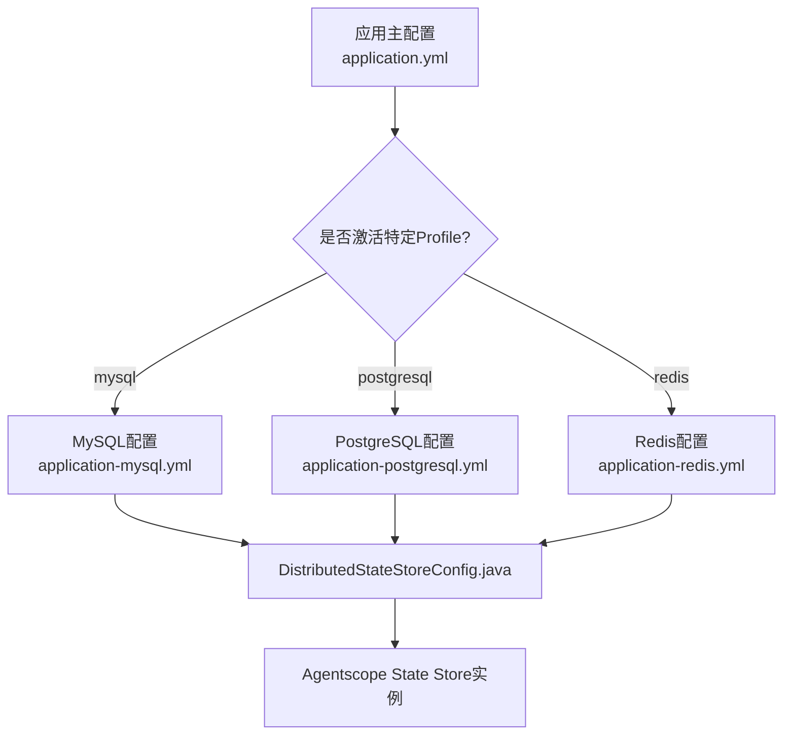
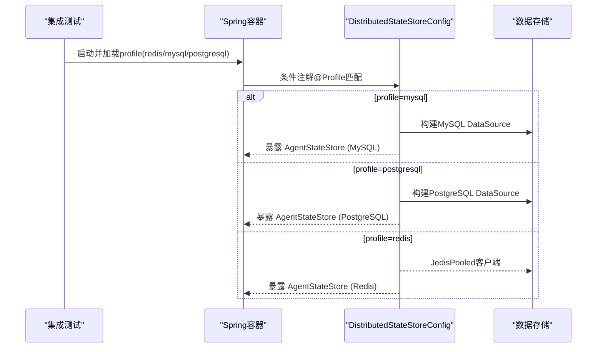
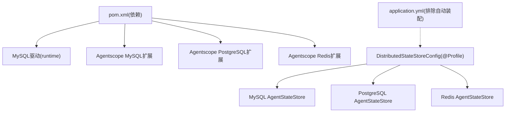

# 数据库集成测试

<cite>
**本文引用的文件**
- [pom.xml](file://pom.xml)
- [application.yml](file://src/main/resources/application.yml)
- [application-test.yml](file://src/test/resources/application-test.yml)
- [application-mysql.yml](file://src/main/resources/application-mysql.yml)
- [application-postgresql.yml](file://src/main/resources/application-postgresql.yml)
- [application-redis.yml](file://src/main/resources/application-redis.yml)
- [DistributedStateStoreConfig.java](file://src/main/java/com/skloda/agentscope/config/DistributedStateStoreConfig.java)
- [InMemoryChatHistoryRepository.java](file://src/main/java/com/skloda/agentscope/service/InMemoryChatHistoryRepository.java)
- [AgentScopeDemoApplicationTest.java](file://src/test/java/com/skloda/agentscope/AgentScopeDemoApplicationTest.java)
</cite>

## 目录
1. [引言](#引言)
2. [项目结构](#项目结构)
3. [核心组件](#核心组件)
4. [架构总览](#架构总览)
5. [详细组件分析](#详细组件分析)
6. [依赖分析](#依赖分析)
7. [性能考虑](#性能考虑)
8. [故障排查指南](#故障排查指南)
9. [结论](#结论)
10. [附录](#附录)

## 引言
本文件围绕项目中“数据层”的集成测试能力与最佳实践，系统梳理了内存数据库（H2）与多存储后端（MySQL、PostgreSQL、Redis）的配置和使用方式，明确测试环境的隔离策略；并给出事务回滚、实体关系与查询、事务边界、并发访问、Schema验证、迁移测试等实操建议。同时提供容器化运行多种后端的方案与测试初始化/清理策略，便于在CI或本地快速执行端到端数据库相关测试。

## 项目结构
- 默认应用未启用DataSource自动装配，避免启动时强依赖数据库，保持轻量运行。
- 通过Spring Profile为不同存储后端注入对应的分布式状态存储实现（Redis/MySQL/PostgreSQL）。
- 测试资源提供了test profile用于禁用MCP等外部依赖，保证测试环境最小化。

图表来源
- [application.yml:6-23](file://src/main/resources/application.yml#L6-L23)
- [application-mysql.yml:1-17](file://src/main/resources/application-mysql.yml#L1-L17)
- [application-postgresql.yml:1-17](file://src/main/resources/application-postgresql.yml#L1-L17)
- [application-redis.yml:1-16](file://src/main/resources/application-redis.yml#L1-L16)
- [DistributedStateStoreConfig.java:43-117](file://src/main/java/com/skloda/agentscope/config/DistributedStateStoreConfig.java#L43-L117)

章节来源
- [application.yml:6-23](file://src/main/resources/application.yml#L6-L23)
- [application-test.yml:1-9](file://src/test/resources/application-test.yml#L1-L9)

## 核心组件
- 分布式状态存储配置：根据Profile创建相应的DataSource与AgentStateStore，分别对应MySQL、PostgreSQL或Redis。
- 内存聊天历史仓库：使用进程内并发集合实现的聊天消息持久替代，适合无库场景与单元测试。
- 应用上下文启动测试：确保在不引入数据库的前提下完成最小可用上下文装载。

章节来源
- [DistributedStateStoreConfig.java:18-42](file://src/main/java/com/skloda/agentscope/config/DistributedStateStoreConfig.java#L18-L42)
- [InMemoryChatHistoryRepository.java:1-46](file://src/main/java/com/skloda/agentscope/service/InMemoryChatHistoryRepository.java#L1-L46)
- [AgentScopeDemoApplicationTest.java:12-30](file://src/test/java/com/skloda/agentscope/AgentScopeDemoApplicationTest.java#L12-L30)

## 架构总览
下图展示了三种存储后端的激活路径及状态存储实例生成流程。

图表来源
- [application-mysql.yml:1-17](file://src/main/resources/application-mysql.yml#L1-L17)
- [application-postgresql.yml:1-17](file://src/main/resources/application-postgresql.yml#L1-L17)
- [application-redis.yml:1-16](file://src/main/resources/application-redis.yml#L1-L16)
- [DistributedStateStoreConfig.java:43-117](file://src/main/java/com/skloda/agentscope/config/DistributedStateStoreConfig.java#L43-L117)

## 详细组件分析

### 内存数据库（H2）配置与使用
当前工程并未内置H2依赖或H2专属配置，测试与开发以内存型AgentStateStore或无库启动为主（通过排除DataSource自动装配），可在无需任何数据库驱动情况下加载上下文，非常适合单元/集成测试的快速反馈。若需引入H2进行JDBC层面的测试覆盖，推荐以外部test profile注入独立DataSource到被测试服务，配合@Transactional实现单次方法级回滚。

- 默认不加载DataSource以避免对数据库的硬性依赖，提升测试可移植性。
- 现有测试类通过最小化启动确认容器就绪，适合作为后续引入更复杂测试的基础。

章节来源
- [application.yml:13-23](file://src/main/resources/application.yml#L13-L23)
- [AgentScopeDemoApplicationTest.java:12-30](file://src/test/java/com/skloda/agentscope/AgentScopeDemoApplicationTest.java#L12-L30)

### 数据隔离策略（测试态）
- Profile隔离：通过spring.profiles.active选择不同的存储后端配置文件，实现单一变量切换后端，互不影响。
- Bean作用域隔离：每个Profile仅激活一个DataSource/StateStore Bean，避免Bean冲突。
- 测试资源隔离：test profile下关闭MCP等外部依赖，降低偶发因素影响测试结果。

章节来源
- [application-mysql.yml:1-17](file://src/main/resources/application-mysql.yml#L1-L17)
- [application-postgresql.yml:1-17](file://src/main/resources/application-postgresql.yml#L1-L17)
- [application-redis.yml:1-16](file://src/main/resources/application-redis.yml#L1-L16)
- [application-test.yml:1-9](file://src/test/resources/application-test.yml#L1-L9)

### @Transactional 测试数据回滚与独立性
说明：当前源码未直接可见Service层对@Transactiona的使用。建议在需要事务边界的接口或服务上增加@Transactional注解；测试用例中以@SpringBootTest为基础，利用框架的方法级自动回滚保证每次测试数据隔离，从而实现幂等与稳定断言。对于非Spring管理的对象，可通过构造器传入只读快照或使用线程隔离数据结构，但应尽量避免跨测试污染。

章节来源
- [application.yml:13-23](file://src/main/resources/application.yml#L13-L23)

### 实体关系测试、查询性能测试、事务边界测试
- 实体关系：基于存储后端的DAO或封装的服务，编写断言用例覆盖外键/约束与关联读取/更新路径。
- 查询性能：在关键SQL/查询路径上增加慢查询阈值断言或基准测试（如使用JMH），并结合explain计划验证索引有效性。
- 事务边界：以业务操作为粒度拆分事务，避免过宽的事务导致锁竞争与超时；结合异常分支断言回滚语义。

说明：以上为通用最佳实践，可适配到本项目后续新增的数据访问层。

### 多存储后端测试（MySQL、PostgreSQL、Redis）的容器化方案
- MySQL/PostgreSQL：建议使用官方镜像，挂载临时卷或匿名卷以便每次CI后清空数据；以环境变量注入URL/凭据；必要时执行初始化脚本准备表结构与初始数据。
- Redis：以单机镜像启动，设置key前缀以避免命名冲突；必要时用FLUSHALL等命令做环境复位。
- 组合测试：同一工程通过不同profile一键切换；借助docker compose统一编排依赖与生命周期管理。

章节来源
- [application-mysql.yml:1-17](file://src/main/resources/application-mysql.yml#L1-L17)
- [application-postgresql.yml:1-17](file://src/main/resources/application-postgresql.yml#L1-L17)
- [application-redis.yml:1-16](file://src/main/resources/application-redis.yml#L1-L16)

### Schema验证、数据迁移、并发访问的最佳实践
- Schema验证：将DDL纳入版本化管理，启动时执行校验或增量变更；针对MySQL/PostgreSQL分别测试语法兼容性与行为差异。
- 数据迁移：所有变更置于脚本中（包含回滚语句）；在CI中对新环境执行完整迁移链验证。
- 并发访问：使用连接池合理参数，控制读写比与超时；在缓存或锁场景下设计幂等与重试策略；结合压测评估吞吐与稳定性。

[本节为通用指导，未直接引用具体代码文件]

### 测试数据库初始化与清理策略
- 初始化：优先采用声明式脚本（SQL/Versioin Script）而非手动插入；按环境区分初始数据量。
- 清理：容器生命周期结束后数据即丢弃；或在测试生命周期前/后执行标准化清理命令（如Redis FLUSHALL，DB drop/recreate）。
- 原子性：将多个步骤合并到单个事务或脚本中以减少不一致风险。

[本节为通用指导，未直接引用具体代码文件]

## 依赖分析
- 依赖入口：通过maven引入各扩展依赖与运行时驱动（如MySQL驱动在runtime范围）。
- 条件装配：由@Configuration + @Profile条件装配DataSource与AgentStateStore。
- 默认无库启动：排除DataSource自动装配，降低不必要的启动开销。

章节来源
- [pom.xml:146-173](file://pom.xml#L146-L173)
- [application.yml:13-23](file://src/main/resources/application.yml#L13-L23)
- [DistributedStateStoreConfig.java:43-117](file://src/main/java/com/skloda/agentscope/config/DistributedStateStoreConfig.java#L43-L117)

图表来源
- [pom.xml:146-173](file://pom.xml#L146-L173)
- [application.yml:13-23](file://src/main/resources/application.yml#L13-L23)
- [DistributedStateStoreConfig.java:43-117](file://src/main/java/com/skloda/agentscope/config/DistributedStateStoreConfig.java#L43-L117)

## 性能考虑
- 选择合适后端：Redis提供更低延迟与更高吞吐；MySQL/PostgreSQL提供强一致与复杂查询能力，可按场景选择。
- 连接池配置：在高并发下调优最大连接数、空闲回收、超时时间，避免阻塞。
- 会话状态分片与压缩：避免超大对象落库；结合压缩、过期策略减少I/O压力。

[本节为通用指导，未直接引用具体代码文件]

## 故障排查指南
- 无法解析属性：检查profiles是否激活、配置文件是否正确、环境变量是否生效。
- 连接失败：核对URL、端口、用户权限；确认数据库/Redis已启动并监听正确端口。
- 启动报错：确认是否意外加载了DataSource自动装配；如需走默认无库模式，排除项应保持有效。
- 测试结果不稳定：检查测试间数据污染问题；建议使用独立DB实例或Key前缀隔离，并确保事务回滚或后置清理逻辑。

章节来源
- [application-mysql.yml:1-17](file://src/main/resources/application-mysql.yml#L1-L17)
- [application-postgresql.yml:1-17](file://src/main/resources/application-postgresql.yml#L1-L17)
- [application-redis.yml:1-16](file://src/main/resources/application-redis.yml#L1-L16)
- [application.yml:13-23](file://src/main/resources/application.yml#L13-L23)

## 结论
项目以Profile为核心实现了无侵入的多后端切换与最小化启动能力，为数据库相关的集成测试提供了灵活、可维护的基线。在实际落地中，建议在新增数据访问代码时遵循统一的Schema与迁移管理、完善的回滚策略以及合理的并发与事务边界设计；并通过容器化与标准化初始化/清理策略保障环境与执行的可重复性。

## 附录
- 快速定位配置入口：application.yml排除自动装配；application-{profile}.yml定义对应后端参数；DistributedStateStoreConfig负责条件装配。
- 单测基础用例参考：AgentScopeDemoApplicationTest用于验证最小可用上下文。

章节来源
- [application.yml:13-23](file://src/main/resources/application.yml#L13-L23)
- [AgentScopeDemoApplicationTest.java:12-30](file://src/test/java/com/skloda/agentscope/AgentScopeDemoApplicationTest.java#L12-L30)