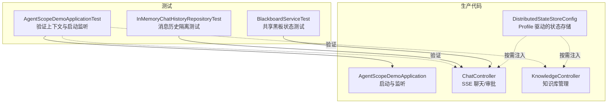
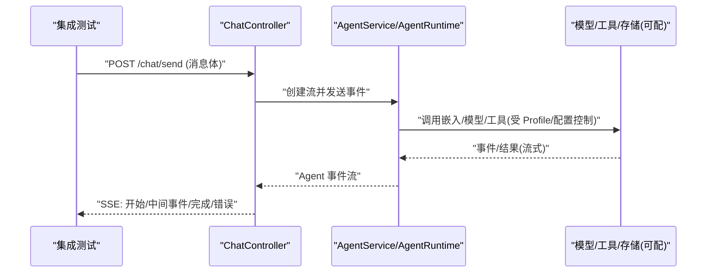
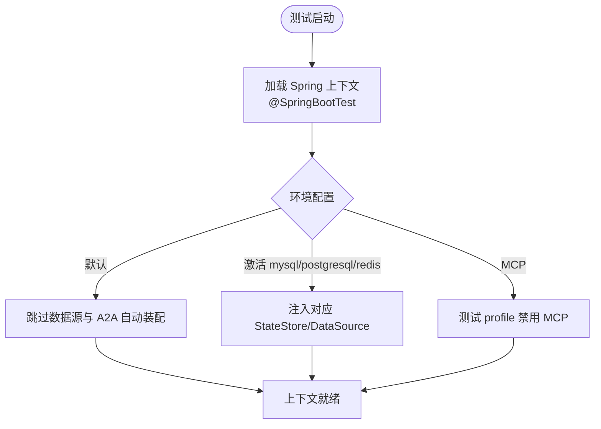
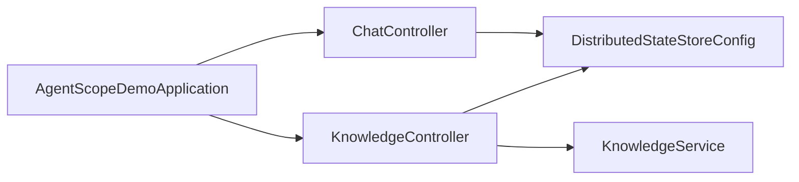

# 集成测试

<cite>
**本文引用的文件**   
- [AgentScopeDemoApplication.java](file://src/main/java/com/skloda/agentscope/AgentScopeDemoApplication.java)
- [ChatController.java](file://src/main/java/com/skloda/agentscope/controller/ChatController.java)
- [KnowledgeController.java](file://src/main/java/com/skloda/agentscope/controller/KnowledgeController.java)
- [DistributedStateStoreConfig.java](file://src/main/java/com/skloda/agentscope/config/DistributedStateStoreConfig.java)
- [application.yml](file://src/main/resources/application.yml)
- [application-test.yml](file://src/test/resources/application-test.yml)
- [pom.xml](file://pom.xml)
- [AgentScopeDemoApplicationTest.java](file://src/test/java/com/skloda/agentscope/AgentScopeDemoApplicationTest.java)
- [InMemoryChatHistoryRepositoryTest.java](file://src/test/java/com/skloda/agentscope/service/InMemoryChatHistoryRepositoryTest.java)
- [BlackboardServiceTest.java](file://src/test/java/com/skloda/agentscope/blackboard/BlackboardServiceTest.java)
- [KnowledgeService.java](file://src/main/java/com/skloda/agentscope/service/KnowledgeService.java)
</cite>

## 目录
1. [引言](#引言)
2. [项目结构](#项目结构)
3. [核心组件](#核心组件)
4. [架构总览](#架构总览)
5. [详细组件分析](#详细组件分析)
6. [依赖关系分析](#依赖关系分析)
7. [性能考量](#性能考量)
8. [故障排查指南](#故障排查指南)
9. [结论](#结论)
10. [附录](#附录)

## 引言
本文件面向本项目中基于 Spring Boot 的集成测试体系，围绕以下目标进行系统化说明与落地指引：
- 使用 @SpringBootTest 构建最小可行上下文，实现测试环境隔离与多 profile 切换。
- 数据库集成测试策略：默认不加载 DataSource；按 profile 接入 Redis/MySQL/PostgreSQL；建议引入 Testcontainers 以增强 CI 可复现性。
- HTTP 接口测试：针对控制器（聊天流式 SSE、知识库上传检索）提供测试方法设计与验证点；MockMvc 的使用思路与注意事项。
- 外部服务集成：通过配置与模拟策略隔离第三方 API（如嵌入模型、A2A/AGUI/MCP 等），保证稳定性与确定性。
- 文件上传下载、知识库索引、多 Agent 协作链路的端到端测试设计。
- 测试数据准备与清理策略：确保测试之间相互独立、无副作用、可重复执行。

## 项目结构
测试相关的主要位置与约定如下：
- 应用启动类与入口事件监听位于主包，用于验证 ApplicationContext 加载及组件注册。
- 控制器层包含聊天会话、审批回调、知识库增删查搜等 HTTP 接口，是集成测试的重点覆盖对象。
- 配置文件分离：主配置 application.yml 默认排除数据源与 A2A 自动装配；测试专用配置 application-test.yml 关闭 MCP 以减少 CI 依赖。
- 分布式状态存储通过 Profile 条件装配，使测试可按需挂载内存或真实 DB。
- 单元测试与集成测试均位于 src/test/java，测试资源位于 src/test/resources。

图表来源
- [AgentScopeDemoApplication.java:11-35](file://src/main/java/com/skloda/agentscope/AgentScopeDemoApplication.java#L11-L35)
- [ChatController.java:117-186](file://src/main/java/com/skloda/agentscope/controller/ChatController.java#L117-L186)
- [KnowledgeController.java:37-130](file://src/main/java/com/skloda/agentscope/controller/KnowledgeController.java#L37-L130)
- [DistributedStateStoreConfig.java:43-117](file://src/main/java/com/skloda/agentscope/config/DistributedStateStoreConfig.java#L43-L117)

章节来源
- [application.yml:6-23](file://src/main/resources/application.yml#L6-L23)
- [application-test.yml:1-9](file://src/test/resources/application-test.yml#L1-L9)
- [AgentScopeDemoApplicationTest.java:1-30](file://src/test/java/com/skloda/agentscope/AgentScopeDemoApplicationTest.java#L1-L30)

## 核心组件
- 应用启动与事件监听：应用启动完成后输出端口信息，可通过 @SpringBootTest 验证上下文装载与启动监听是否生效。
- ChatController：负责聊天消息的响应式 SSE 推送、审批回调、文件上传与下载、错误收敛与结束信号生成。
- KnowledgeController：提供知识库文档上传、列表、搜索与删除，内部调用 KnowledgeService 完成解析与向量化索引。
- DistributedStateStoreConfig：基于 Profile 注入 AgentStateStore 或 DataSource，支持 redis/mysql/postgresql 三种后端。
- 应用配置：默认排除数据源与 A2A 自动装配，避免默认启动时强依赖；测试通过 profile 切换行为。

章节来源
- [AgentScopeDemoApplication.java:11-35](file://src/main/java/com/skloda/agentscope/AgentScopeDemoApplication.java#L11-L35)
- [ChatController.java:117-186](file://src/main/java/com/skloda/agentscope/controller/ChatController.java#L117-L186)
- [KnowledgeController.java:37-130](file://src/main/java/com/skloda/agentscope/controller/KnowledgeController.java#L37-L130)
- [DistributedStateStoreConfig.java:43-117](file://src/main/java/com/skloda/agentscope/config/DistributedStateStoreConfig.java#L43-L117)
- [application.yml:6-23](file://src/main/resources/application.yml#L6-L23)

## 架构总览
从测试视角看，系统集成可分为三层：HTTP 控制器层、业务能力层（Agent/知识/工作流）、持久化与外部服务层（内存/数据库/Embedding/A2A/MCP）。测试应当自顶向下逐层推进，优先验证控制器契约，再深入到领域行为与外部依赖。

图表来源
- [ChatController.java:117-186](file://src/main/java/com/skloda/agentscope/controller/ChatController.java#L117-L186)
- [application.yml:25-42](file://src/main/resources/application.yml#L25-L42)

## 详细组件分析

### 组件 A：@SpringBootTest 上下文装配与环境隔离
- 应用启用与监听验证：通过 @SpringBootTest(webEnvironment=NONE) 仅装载 Bean 与监听器，快速校验上下文是否正确加载，以及 StartupListener 是否被注册。
- 测试配置隔离：
  - 默认 application.yml 排除了数据源与 A2A 自动装配，保证默认上下文中不会因缺少 DB/网络而失败。
  - 测试专用 application-test.yml 关闭 MCP（避免 CI 需要 Node.js），在运行测试时可指定 active profiles。
- Profile 化外部能力：
  - 若需要数据库集成测试，可在测试类上使用 @ActiveProfiles("mysql|postgresql|redis")，并配合 DistributedStateStoreConfig 暴露相应 AgentStateStore 或 DataSource。
- Mock 外部依赖：
  - 测试中可使用 Mockito 注解（例如 @MockitoBean）对某些 Service 进行替换，以便聚焦控制器或关键链路。

图表来源
- [AgentScopeDemoApplicationTest.java:12-29](file://src/test/java/com/skloda/agentscope/AgentScopeDemoApplicationTest.java#L12-L29)
- [application.yml:19-23](file://src/main/resources/application.yml#L19-L23)
- [application-test.yml:1-9](file://src/test/resources/application-test.yml#L1-L9)
- [DistributedStateStoreConfig.java:43-117](file://src/main/java/com/skloda/agentscope/config/DistributedStateStoreConfig.java#L43-L117)

章节来源
- [AgentScopeDemoApplicationTest.java:1-30](file://src/test/java/com/skloda/agentscope/AgentScopeDemoApplicationTest.java#L1-L30)
- [application.yml:19-23](file://src/main/resources/application.yml#L19-L23)
- [application-test.yml:1-9](file://src/test/resources/application-test.yml#L1-L9)
- [DistributedStateStoreConfig.java:43-117](file://src/main/java/com/skloda/agentscope/config/DistributedStateStoreConfig.java#L43-L117)

### 组件 B：数据库集成测试（内存库与 Testcontainers）
- 默认情况：应用默认排除数据源自动装配，因此基础测试无需数据库即可运行。
- 有库测试方案：
  - 方式一（推荐在本地调试快速验证）：为测试激活 mysql/postgresql 或 redis profile，由 DistributedStateStoreConfig 装配对应的 AgentStateStore 或 DataSource。
  - 方式二（CI/可重现）：使用 Testcontainers 启动真实的 MySQL/Postgres/Redis，结合 Profile + 属性替换，动态注入连接字符串，从而保证“真机真库”的集成语义。
- 事务与清理：建议在每条测试后回滚或显式清理数据；对于 InMemoryStore/InMemoryAgentStateStore，可在每个用例前后重置状态，确保幂等。
- 注意：当前应用未内建 H2 配置模块，如需 H2 可额外引入并在测试 profile 下启用；但考虑到已有明确的数据源/存储抽象与 Profile 控制，更建议优先采用 Testcontainers 或现有 Profile 配置。

章节来源
- [application.yml:19-23](file://src/main/resources/application.yml#L19-L23)
- [DistributedStateStoreConfig.java:43-117](file://src/main/java/com/skloda/agentscope/config/DistributedStateStoreConfig.java#L43-L117)
- [pom.xml:164-173](file://pom.xml#L164-L173)

### 组件 C：HTTP 接口测试（MockMvc + SSE 流式）
- 覆盖范围建议：
  - 聊天接口：POST /chat/send，验证请求参数校验、SSE 事件顺序、完成事件类型、错误事件格式、中断/异常路径。
  - 审批回调：POST /chat/approve，验证拒绝与批准的分支处理，确认会恢复运行或终止流式输出。
  - 文件上传下载：POST /chat/upload（如有）、GET /chat/download?fileId=，验证扩展名校验、目录安全（防遍历）、返回 Content-Type 与 Content-Disposition 头。
  - 知识库接口：/api/knowledge/{upload,documents,status,search,delete}，验证表单提交、支持的文件类型、查询参数与错误返回。
- 流式断言要点：
  - 由于 ChatController 直接返回 ServerSentEvent<String> 流，建议在测试中使用 WebTestClient（Reactor 友好）或在 JUnit 中订阅 Flux，采集事件序列后再断言开始、中间与结束事件。
  - 使用 takeUntil/等待 done 事件的方式判断流程结束，防止测试过早退出。
- 隔离外部依赖：
  - 将 LLM/Embedding/MCP/A2A 等调用通过配置或 Mock 屏蔽（例如通过 @MockitoBean 或 profile 禁用），确保测试稳定。
- 参考定位：
  - SSE 发送与错误封装、事件完成判断逻辑、审批分支处理均在控制器中实现，应作为断言关键点。

章节来源
- [ChatController.java:77-153](file://src/main/java/com/skloda/agentscope/controller/ChatController.java#L77-L153)
- [ChatController.java:155-186](file://src/main/java/com/skloda/agentscope/controller/ChatController.java#L155-L186)

### 组件 D：外部服务集成测试（WireMock 模拟第三方 API）
- 建议场景：
  - Embedding/LLM 调用：在测试环境中用 WireMock 启动本地服务，代理 dashscope 或其他推理端点，拦截并注入固定响应。
  - A2A/Feishu/Webhook：通过 WireMock 模拟回调/拉取接口，验证握手、协议兼容性与路由逻辑。
- 接入方式：
  - 测试期间通过系统属性或环境变量指向 Mock 服务地址。
  - 使用 Profile 或 test container 启动 WireMock 实例，集中管理 stub 生命周期。
- 优点：
  - 屏蔽外部不稳定因素（网络抖动、限流、付费配额），提高回归速度。
  - 能够精准断言协议与边界条件（错误码、超时重试）。

[本节为概念性指导，不直接引用具体实现文件]

### 组件 E：文件上传下载测试
- 上传校验：空文件、不支持的扩展名应返回错误。
- 文件分类与存储：正确识别图片、音视频/文档并存储到临时目录，返回必要元数据（fileName、fileType、filePath）。
- 下载安全：禁止路径遍历（../../../etc/passwd）、区分文件名与 fileId 两种查找策略、正确设置 Content-Type 与 Content-Disposition。
- 资源清理：测试前后清理临时目录或使用 @TempDir 隔离。

章节来源
- [ChatControllerFileTest.java:40-158](file://src/test/java/com/skloda/agentscope/controller/ChatControllerFileTest.java#L40-L158)

### 组件 F：知识库集成测试
- 上传与索引：/api/knowledge/upload 接受 MultipartFile，校验扩展名后落盘，然后调用 KnowledgeService 解析并写入向量库。
- 列表与状态：/api/knowledge/documents 返回已索引文档集合；/api/knowledge/status 暴露索引进度与时间戳。
- 检索：/api/knowledge/search 根据 query、limit、threshold 返回列表片段与相似度分数。
- 删除：/api/knowledge/documents/{fileName} 移除文档，接口成功应返回标志。
- 背景知识：
  - KnowledgeService 在当前演示中基于 InMemoryStore，便于轻量测试；也可结合外部 Embedding 与持久化策略进行测试。

章节来源
- [KnowledgeController.java:37-130](file://src/main/java/com/skloda/agentscope/controller/KnowledgeController.java#L37-L130)
- [KnowledgeService.java:39-196](file://src/main/java/com/skloda/agentscope/service/KnowledgeService.java#L39-L196)

### 组件 G：多 Agent 协作集成测试
- 典型验证点：
  - 事件流连续性：流水线/路由/交接/并行/顺序等模式下，事件必须按预期顺序到达前端。
  - 共享黑板（Shared Blackboard）一致性：同一 session/user 下的视图合并、版本单调递增、隔离性正确。
  - 中止与恢复：审批/拒绝路径下，代理状态可恢复且不影响其他会话。
- 可用测试基线：
  - 共享黑板的行为已通过 BlackboardServiceTest 覆盖了版本增长、合并规则、不可变快照等约束。
  - 聊天流的处理器可在 ChatController 中追加事件收集与断言。

章节来源
- [BlackboardServiceTest.java:14-173](file://src/test/java/com/skloda/agentscope/blackboard/BlackboardServiceTest.java#L14-L173)
- [ChatController.java:155-186](file://src/main/java/com/skloda/agentscope/controller/ChatController.java#L155-L186)

## 依赖关系分析
- 启动与监听：应用启动后触发监听事件，便于测试校验上下文就绪。
- 控制器依赖：
  - ChatController 依赖 AgentService 与审批服务，负责将事件映射为 SSE 输出。
  - KnowledgeController 依赖 KnowledgeService，负责 RAG 相关的文档处理与查询。
- 数据层：
  - DistributedStateStoreConfig 根据 Profile 注入不同的 AgentStateStore 或 DataSource。
  - 默认排除 DataSource 与 A2A 自动装配，避免无库环境启动失败。
- 测试依赖：
  - POM 中包含 spring-boot-starter-test、reactor-test，可用于 Spring MVC/WebTestClient/Flux 测试。

图表来源
- [AgentScopeDemoApplication.java:11-35](file://src/main/java/com/skloda/agentscope/AgentScopeDemoApplication.java#L11-L35)
- [ChatController.java:117-186](file://src/main/java/com/skloda/agentscope/controller/ChatController.java#L117-L186)
- [KnowledgeController.java:37-130](file://src/main/java/com/skloda/agentscope/controller/KnowledgeController.java#L37-L130)
- [DistributedStateStoreConfig.java:43-117](file://src/main/java/com/skloda/agentscope/config/DistributedStateStoreConfig.java#L43-L117)

章节来源
- [pom.xml:175-186](file://pom.xml#L175-L186)
- [application.yml:19-23](file://src/main/resources/application.yml#L19-L23)

## 性能考量
- 流式接口测试应避免阻塞，建议使用响应式客户端订阅并消费事件，减少内存占用与测试时间。
- 对外部服务的模拟要尽量短路长耗时步骤（如模型推理、大文档解析），必要时拆分用例（慢用例单独套件）。
- 知识库索引在测试中建议限制文档规模与 chunk 数量，或切换到内存向量存储，加速断言。

[本节提供通用优化建议，不直接引用具体实现文件]

## 故障排查指南
- 上下文无法启动：
  - 检查是否意外引入了 DataSource 自动装配；应用已默认排除，若自定义装配请确认仅在特定 profile 生效。
- 数据库相关失败：
  - 若使用 mysql/postgresql/redis 配置但未连接成功，优先在测试中通过 Testcontainers 或 Docker Compose 启动依赖服务。
  - 核对分布式状态存储配置是否匹配 profile。
- 外部依赖导致的不稳定：
  - 在测试中通过配置关闭或 Mock MCP/A2A/渠道，或使用 WireMock 固定协议与返回值。
- 聊天接口断言失败：
  - 确保已正确消费 SSE 流直到 done 事件；校验错误事件消息与结束事件存在。
- 文件上传下载路径问题：
  - 确认临时目录权限与路径穿越防护是否生效；下载时对路径做严格校验。

章节来源
- [application.yml:19-23](file://src/main/resources/application.yml#L19-L23)
- [DistributedStateStoreConfig.java:43-117](file://src/main/java/com/skloda/agentscope/config/DistributedStateStoreConfig.java#L43-L117)
- [ChatController.java:117-186](file://src/main/java/com/skloda/agentscope/controller/ChatController.java#L117-L186)

## 结论
本项目基于 Spring Boot 提供了完整的集成测试基础能力：默认最小上下文、灵活的 profile 配置、流式 HTTP 接口与丰富的控制器行为、清晰的外部依赖隔离点以及完善的测试断言示例。建议按照“上下文 → 控制器契约 → 领域能力 → 外部服务”的层级逐步覆盖，利用 Profile 与 Mock/WireMock/Testcontainers 确保测试的稳定性和可重复性。

## 附录
- 推荐的测试分层组合：
  - 快速上下文测试：@SpringBootTest + 少量断言（Bean/监听器）
  - HTTP 契约测试：WebTestClient/MockMvc + 响应式流断言
  - 数据库/存储测试：Profile + Testcontainers（MySQL/Postgres/Redis）
  - 外部服务测试：WireMock 模拟 LLM/Embedding/第三方 API
  - 完整链路测试：端到端案例（上传 → 索引 → 检索 → 聊天 → 多 Agent 协作）
- 测试数据管理与清理：
  - 临时目录使用 @TempDir；内存态在 setUp/AfterEach 清理；数据库用例使用事务或显式清除脚本。
  - 知识库索引在测试前准备最少必要数据；必要时清空 InMemoryStore。
- 常用断言清单：
  - 控制器入参校验、SSE 事件顺序、错误事件、完成事件、文件类型与头部、路径穿越防护、状态码与消息体。
  - 多 Agent 协作：事件流连续性、黑板版本单调递增、不同用户/会话完全隔离。